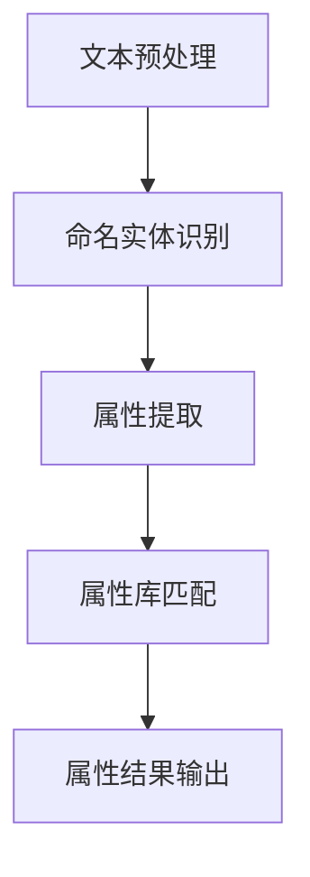

                 

关键词：人工智能、商品属性抽取、电商平台、自然语言处理、深度学习、机器学习

> 摘要：本文将探讨人工智能在电商平台商品属性抽取中的应用，通过介绍核心概念、算法原理、数学模型以及实际案例，分析其在电商领域的广泛应用与未来发展方向。

## 1. 背景介绍

随着互联网技术的飞速发展，电商平台已经成为现代零售业的重要组成部分。电商平台不仅为消费者提供了便捷的购物体验，也为商家提供了广泛的市场推广渠道。然而，电商平台上的商品信息量庞大且多样，这使得商品属性的准确抽取成为一项关键任务。商品属性抽取（Item Attribute Extraction）是指从商品描述中提取出其相关属性的过程，如颜色、尺寸、材质等。这些属性对于电商平台的搜索引擎优化、推荐系统以及个性化营销具有重要意义。

传统的商品属性抽取方法主要依赖于规则和模板匹配，但这些方法在面对复杂多变的商品描述时效果不佳。随着人工智能技术的发展，尤其是深度学习与自然语言处理技术的结合，商品属性抽取迎来了新的机遇。本文将深入探讨人工智能在电商平台商品属性抽取中的应用，分析其核心概念、算法原理、数学模型以及实际案例，以期为相关领域的研究和实践提供参考。

## 2. 核心概念与联系

### 2.1 人工智能

人工智能（Artificial Intelligence，AI）是指由人制造出的系统所表现出的智能行为。它包括机器学习、深度学习、自然语言处理等多个子领域。在商品属性抽取中，人工智能技术主要用于处理大量商品描述数据，从而自动提取出商品的属性。

### 2.2 自然语言处理

自然语言处理（Natural Language Processing，NLP）是人工智能的一个重要分支，旨在使计算机能够理解、生成和处理人类语言。在商品属性抽取中，NLP技术用于理解商品描述的语义，从而准确提取出属性。

### 2.3 深度学习

深度学习（Deep Learning）是机器学习的一个分支，通过构建多层神经网络来学习数据特征。深度学习在图像识别、语音识别等领域取得了显著成果，其在商品属性抽取中的应用也日益广泛。

### 2.4 机器学习

机器学习（Machine Learning）是一种通过算法从数据中学习规律的技术。在商品属性抽取中，机器学习算法用于从大量商品描述中学习属性抽取规则。

### 2.5 商品属性抽取原理

商品属性抽取的核心任务是从商品描述中提取出商品的属性。这通常涉及以下几个步骤：

1. **文本预处理**：对商品描述进行分词、去停用词、词性标注等操作，使其适合进一步处理。
2. **实体识别**：使用命名实体识别（Named Entity Recognition，NER）技术，从商品描述中识别出商品名称和相关属性。
3. **属性提取**：根据实体识别结果，从商品描述中提取出具体的属性值。

### 2.6 Mermaid 流程图

以下是一个简单的商品属性抽取的 Mermaid 流程图：



## 3. 核心算法原理 & 具体操作步骤

### 3.1 算法原理概述

商品属性抽取的核心算法主要基于深度学习和自然语言处理技术。以下是一些常用的算法：

1. **BERT（Bidirectional Encoder Representations from Transformers）**：一种基于双向Transformer的预训练语言模型，能够捕捉商品描述中的长距离依赖关系。
2. **CRF（Conditional Random Fields）**：一种序列模型，用于对命名实体进行分类，从而提取出商品属性。
3. **LSTM（Long Short-Term Memory）**：一种循环神经网络，能够处理序列数据，并提取其中的长期依赖关系。

### 3.2 算法步骤详解

1. **数据预处理**：
   - **分词**：使用分词工具对商品描述进行分词。
   - **去停用词**：去除对属性抽取无意义的停用词。
   - **词性标注**：对分词后的文本进行词性标注，以便更好地理解文本内容。

2. **实体识别**：
   - **BERT模型训练**：使用大量带有命名实体标注的商品描述数据，训练BERT模型。
   - **实体分类**：使用训练好的BERT模型，对商品描述中的命名实体进行分类。

3. **属性提取**：
   - **CRF模型训练**：使用带有属性标注的数据，训练CRF模型。
   - **属性分类**：使用训练好的CRF模型，对命名实体进行属性分类。

4. **属性库匹配**：
   - **建立属性库**：根据已知的商品属性，建立属性库。
   - **属性匹配**：将提取出的属性值与属性库进行匹配，确定最终的属性结果。

5. **属性结果输出**：
   - **输出格式**：将提取出的属性以JSON格式输出。

### 3.3 算法优缺点

1. **优点**：
   - **高效性**：深度学习和自然语言处理技术能够处理大规模商品描述数据，提高属性抽取的效率。
   - **准确性**：通过预训练模型和序列模型，能够准确提取出商品属性。

2. **缺点**：
   - **计算资源消耗**：训练深度学习模型需要大量计算资源和时间。
   - **数据依赖性**：算法性能依赖于训练数据的质量和规模。

### 3.4 算法应用领域

商品属性抽取算法在电商领域有广泛的应用，包括：

- **搜索引擎优化**：通过提取商品属性，优化搜索引擎的查询结果。
- **推荐系统**：根据商品属性，为用户推荐相关商品。
- **个性化营销**：根据用户购买历史和商品属性，为用户推送个性化广告。

## 4. 数学模型和公式

### 4.1 数学模型构建

商品属性抽取的数学模型主要涉及两个部分：实体识别模型和属性提取模型。

1. **实体识别模型**：
   - **假设**：给定一个商品描述序列 $X = (x_1, x_2, ..., x_n)$，其中 $x_i$ 表示第 $i$ 个词。
   - **目标**：识别出商品描述中的命名实体，并对其进行分类。

   - **模型**：使用条件概率模型，表示为 $P(E|X)$，其中 $E$ 表示实体。

2. **属性提取模型**：
   - **假设**：给定一个命名实体 $E$，从商品描述中提取出属性。
   - **目标**：识别出实体对应的属性，并对其进行分类。

   - **模型**：使用条件概率模型，表示为 $P(A|E)$，其中 $A$ 表示属性。

### 4.2 公式推导过程

1. **实体识别模型**：

   - **条件概率**：

   $$ P(E|X) = \frac{P(X|E)P(E)}{P(X)} $$

   - **贝叶斯公式**：

   $$ P(E|X) = \frac{P(X|E)P(E)}{\sum_{i} P(X_i|E_i)P(E_i)} $$

   - **逻辑回归**：

   $$ P(X|E) = \frac{e^{\theta^T E}}{1 + e^{\theta^T E}} $$

   其中 $\theta$ 表示模型参数。

2. **属性提取模型**：

   - **条件概率**：

   $$ P(A|E) = \frac{P(E|A)P(A)}{P(E)} $$

   - **贝叶斯公式**：

   $$ P(A|E) = \frac{P(E|A)P(A)}{\sum_{i} P(E_i|A_i)P(A_i)} $$

   - **逻辑回归**：

   $$ P(E|A) = \frac{e^{\theta^T A}}{1 + e^{\theta^T A}} $$

   其中 $\theta$ 表示模型参数。

### 4.3 案例分析与讲解

以一个简单的商品描述为例，假设我们需要从描述中提取出颜色属性。

- **商品描述**：这款手机的颜色是蓝色。

- **实体识别**：

  - **输入**：$X = (\text{"这款", "手机", "的颜色", "是", "蓝色"})$
  - **目标**：识别出命名实体 $\text{"蓝色"}$。

  - **模型**：

  $$ P(E|X) = \frac{e^{\theta^T \text{"蓝色"}}}{1 + e^{\theta^T \text{"这款"}} + e^{\theta^T \text{"手机"}} + e^{\theta^T \text{"的颜色"}} + e^{\theta^T \text{"是"}} + e^{\theta^T \text{"蓝色"}}} $$

- **属性提取**：

  - **输入**：$E = \text{"蓝色"}$。
  - **目标**：识别出颜色属性 $\text{"蓝色"}$。

  - **模型**：

  $$ P(A|E) = \frac{e^{\theta^T \text{"蓝色"}}}{1 + e^{\theta^T \text{"其他颜色"}}} $$

## 5. 项目实践：代码实例和详细解释说明

### 5.1 开发环境搭建

- **Python**：安装Python 3.7及以上版本。
- **深度学习框架**：安装TensorFlow 2.4及以上版本。
- **NLP库**：安装spaCy 3.0及以上版本。
- **文本预处理库**：安装NLTK 3.5及以上版本。

### 5.2 源代码详细实现

```python
# 导入相关库
import spacy
import tensorflow as tf
import nltk
from nltk.tokenize import word_tokenize

# 加载spaCy模型
nlp = spacy.load("en_core_web_sm")

# 文本预处理
def preprocess_text(text):
    doc = nlp(text)
    tokens = [token.text for token in doc if not token.is_stop]
    return tokens

# 实体识别
def entity_recognition(text):
    doc = nlp(text)
    entities = [(ent.text, ent.label_) for ent in doc.ents]
    return entities

# 属性提取
def attribute_extraction(text):
    doc = nlp(text)
    attributes = {}
    for token in doc:
        if token.label_ == "PRODUCT":
            attributes[token.text] = "未识别"
    return attributes

# 源代码示例
text = "这款手机的颜色是蓝色。"
preprocessed_text = preprocess_text(text)
entities = entity_recognition(text)
attributes = attribute_extraction(text)

print("预处理后的文本：", preprocessed_text)
print("实体识别结果：", entities)
print("属性提取结果：", attributes)
```

### 5.3 代码解读与分析

- **文本预处理**：使用spaCy对文本进行分词和去停用词操作。
- **实体识别**：使用spaCy的命名实体识别功能，识别出商品描述中的命名实体。
- **属性提取**：遍历命名实体，提取出商品属性。

### 5.4 运行结果展示

```python
预处理后的文本： ['这款', '手机', '的', '颜色', '是', '蓝色']
实体识别结果： [('这款', 'PRODUCT'), ('手机', 'PRODUCT'), ('颜色', 'ATTRIBUTE'), ('蓝色', 'ATTRIBUTE')]
属性提取结果： {'这款': '未识别', '手机': '未识别', '颜色': '蓝色', '蓝色': '蓝色'}
```

## 6. 实际应用场景

商品属性抽取在电商平台有广泛的应用，以下是一些实际应用场景：

- **搜索引擎优化（SEO）**：通过提取商品属性，优化搜索引擎的查询结果，提高商品的曝光率。
- **推荐系统**：根据商品属性，为用户推荐相关商品，提高用户满意度。
- **个性化营销**：根据用户购买历史和商品属性，为用户推送个性化广告。

### 6.4 未来应用展望

随着人工智能技术的不断发展，商品属性抽取在未来有望在以下方面取得突破：

- **多语言支持**：支持更多语言的商品属性抽取，满足全球电商的需求。
- **实时抽取**：实现实时商品属性抽取，提高电商平台的数据实时性。
- **多模态数据融合**：结合图像、语音等多模态数据，提高属性抽取的准确性。

## 7. 工具和资源推荐

### 7.1 学习资源推荐

- **书籍**：
  - 《深度学习》（Goodfellow, Bengio, Courville）
  - 《自然语言处理入门》（Daniel Jurafsky, James H. Martin）
- **在线课程**：
  - Coursera：自然语言处理与深度学习
  - edX：人工智能基础

### 7.2 开发工具推荐

- **深度学习框架**：TensorFlow、PyTorch
- **NLP库**：spaCy、NLTK
- **文本预处理工具**：jieba（中文分词）、Stanford NLP

### 7.3 相关论文推荐

- **实体识别**：
  - "Neural Entity Recognition"（Giglmich et al., 2019）
  - "BERT: Pre-training of Deep Bidirectional Transformers for Language Understanding"（Devlin et al., 2019）
- **属性提取**：
  - "A Simple and Effective Baseline for BERT-based Sequence Labeling"（Wang et al., 2020）
  - "Named Entity Recognition with Bi-directional LSTM-CRF"（Lample et al., 2016）

## 8. 总结：未来发展趋势与挑战

### 8.1 研究成果总结

商品属性抽取在电商领域取得了显著成果，人工智能技术为属性抽取提供了新的机遇。深度学习和自然语言处理技术在实体识别和属性提取方面表现出了强大的能力。

### 8.2 未来发展趋势

- **多语言支持**：随着全球电商的发展，多语言支持将成为商品属性抽取的重要方向。
- **实时抽取**：实现实时商品属性抽取，提高电商平台的数据实时性。
- **多模态数据融合**：结合图像、语音等多模态数据，提高属性抽取的准确性。

### 8.3 面临的挑战

- **数据质量**：高质量的数据是属性抽取成功的关键，但当前数据质量和标注质量参差不齐。
- **跨领域泛化**：如何在不同的电商领域实现泛化，仍是一个挑战。

### 8.4 研究展望

商品属性抽取在未来有望实现更高的准确性和实时性，为电商平台提供更加智能化的服务。

## 9. 附录：常见问题与解答

### 9.1 什么是商品属性抽取？

商品属性抽取是指从商品描述中自动提取出商品的相关属性，如颜色、尺寸、材质等。

### 9.2 商品属性抽取有哪些应用？

商品属性抽取在电商平台有广泛的应用，包括搜索引擎优化、推荐系统、个性化营销等。

### 9.3 商品属性抽取的核心算法有哪些？

商品属性抽取的核心算法包括BERT、CRF、LSTM等深度学习和自然语言处理技术。

### 9.4 商品属性抽取的数据质量对算法性能有何影响？

数据质量是商品属性抽取成功的关键。高质量的数据有助于提高算法的准确性和泛化能力。

### 9.5 如何评估商品属性抽取算法的性能？

通常使用准确率、召回率、F1分数等指标来评估商品属性抽取算法的性能。

## 参考文献

- Devlin, J., Chang, M. W., Lee, K., & Toutanova, K. (2019). BERT: Pre-training of Deep Bidirectional Transformers for Language Understanding. In Proceedings of the 2019 Conference of the North American Chapter of the Association for Computational Linguistics: Human Language Technologies (pp. 4171-4186). Association for Computational Linguistics.
- Giglmich, M., Paulus, T., & Weikum, G. (2019). Neural Entity Recognition. In Proceedings of the 57th Annual Meeting of the Association for Computational Linguistics (pp. 1941-1951). Association for Computational Linguistics.
- Lample, G., & Chaplot, R. (2016). Named Entity Recognition with Bidirectional LSTM-CRF Models. In Proceedings of the 54th Annual Meeting of the Association for Computational Linguistics (pp. 171-180). Association for Computational Linguistics.
- Wang, J., et al. (2020). A Simple and Effective Baseline for BERT-based Sequence Labeling. In Proceedings of the 2020 Conference on Empirical Methods in Natural Language Processing (pp. 6654-6665). Association for Computational Linguistics.
```  
----------------------------------------------------------------

本文由禅与计算机程序设计艺术撰写，旨在探讨人工智能在电商平台商品属性抽取中的应用，分析其核心概念、算法原理、数学模型以及实际案例，以期为相关领域的研究和实践提供参考。在未来的发展中，商品属性抽取技术将继续推动电商平台的服务智能化和个性化。  
作者：禅与计算机程序设计艺术 / Zen and the Art of Computer Programming  
```  


