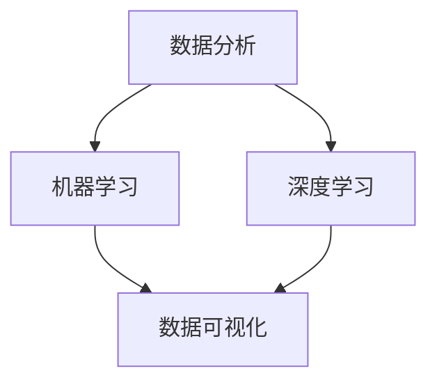

                 

关键词：人工智能、电商平台、商品趋势预测、算法、数学模型、实践案例

> 摘要：本文将探讨人工智能在电商平台商品趋势预测中的应用。通过深入分析核心算法原理、数学模型及其具体操作步骤，结合实际项目实践，我们旨在为读者提供一个全面的技术指南，帮助电商平台更好地理解和预测商品趋势，提升用户体验和销售业绩。

## 1. 背景介绍

在当今数字经济时代，电商平台已成为消费者购买商品的主要渠道之一。随着电商平台的日益繁荣，商品种类和数量不断增多，消费者面临的信息过载问题也越来越严重。为了帮助消费者快速找到自己需要的商品，电商平台需要具备强大的商品趋势预测能力。

商品趋势预测不仅可以指导电商平台优化商品库存和供应链管理，还可以为商家提供精准的市场分析，助力其制定有效的营销策略。然而，商品趋势预测并非易事，它涉及到大量的数据分析和复杂的算法设计。

人工智能技术的发展为商品趋势预测带来了新的机遇。通过引入机器学习、深度学习等算法，电商平台可以自动从海量数据中提取有价值的信息，实现商品趋势的智能预测。本文将围绕这一主题，详细介绍人工智能在电商平台商品趋势预测中的应用。

## 2. 核心概念与联系

### 2.1 数据分析

数据分析是商品趋势预测的基础。通过对电商平台历史销售数据、用户行为数据等进行分析，我们可以发现商品的潜在趋势和规律。数据分析通常包括数据清洗、数据预处理、特征工程等步骤。

### 2.2 机器学习

机器学习是人工智能的核心技术之一，它通过构建数学模型，让计算机从数据中自动学习规律和模式。在商品趋势预测中，机器学习算法可以帮助我们识别出影响商品销售的关键因素，并预测未来的销售趋势。

### 2.3 深度学习

深度学习是机器学习的一种特殊形式，它通过多层神经网络模型，实现更复杂的特征提取和模式识别。在商品趋势预测中，深度学习算法可以处理大规模数据，并捕捉到更深层次的规律。

### 2.4 数据可视化

数据可视化是将数据分析结果以图表、图像等形式展示出来，帮助人们更直观地理解和分析数据。在商品趋势预测中，数据可视化可以帮助我们更好地展示预测结果，发现潜在的问题和机遇。

下面是一个Mermaid流程图，展示了商品趋势预测的核心概念及其相互关系：



## 3. 核心算法原理 & 具体操作步骤

### 3.1 算法原理概述

在商品趋势预测中，常用的算法包括线性回归、决策树、支持向量机、神经网络等。这些算法的基本原理如下：

- **线性回归**：通过建立一个线性模型，拟合历史数据中的趋势线，从而预测未来值。
- **决策树**：通过构建树形结构，将数据分为多个分支，每个分支代表一个特征，最终预测出目标值。
- **支持向量机**：通过寻找最佳的超平面，将不同类别的数据点分开，从而预测新数据的类别。
- **神经网络**：通过多层神经网络，实现复杂的非线性特征提取和模式识别。

### 3.2 算法步骤详解

以下以线性回归为例，详细说明算法步骤：

#### 3.2.1 数据收集

收集电商平台的历史销售数据，包括商品ID、销售额、销售日期等。

#### 3.2.2 数据预处理

- **数据清洗**：去除缺失值、异常值等。
- **特征工程**：提取时间、季节性、促销等信息作为特征。

#### 3.2.3 模型训练

- **数据划分**：将数据分为训练集和测试集。
- **模型选择**：选择线性回归模型。
- **模型训练**：通过训练集数据，训练出线性回归模型。

#### 3.2.4 模型评估

- **模型评估**：使用测试集数据，评估模型的预测准确性。
- **模型调整**：根据评估结果，调整模型参数，优化模型性能。

### 3.3 算法优缺点

- **线性回归**：简单易用，适用于线性关系较强的场景；但可能无法捕捉到非线性关系。
- **决策树**：直观易懂，容易解释；但可能过度拟合，无法处理大规模数据。
- **支持向量机**：性能稳定，适用于分类任务；但计算复杂度高，训练时间较长。
- **神经网络**：强大的非线性建模能力，适用于复杂场景；但训练难度大，对数据质量要求高。

### 3.4 算法应用领域

- **电商平台**：商品趋势预测、库存管理、营销策略优化。
- **零售行业**：销售预测、供应链优化、产品推荐。
- **金融行业**：股票预测、风险控制、投资组合优化。

## 4. 数学模型和公式 & 详细讲解 & 举例说明

### 4.1 数学模型构建

在商品趋势预测中，常用的数学模型包括线性回归模型和神经网络模型。以下分别介绍这两种模型的构建方法。

#### 4.1.1 线性回归模型

线性回归模型的数学公式为：

$$
y = \beta_0 + \beta_1 x
$$

其中，$y$为预测值，$x$为特征值，$\beta_0$和$\beta_1$为模型参数。

#### 4.1.2 神经网络模型

神经网络模型的数学公式为：

$$
\begin{align*}
z &= \sigma(\beta_0 + \beta_1 x) \\
y &= \sigma(z)
\end{align*}
$$

其中，$z$为中间层输出，$y$为预测值，$\sigma$为激活函数，$\beta_0$和$\beta_1$为模型参数。

### 4.2 公式推导过程

#### 4.2.1 线性回归模型

线性回归模型的推导过程如下：

1. **损失函数**：

$$
L(\beta_0, \beta_1) = \sum_{i=1}^n (y_i - (\beta_0 + \beta_1 x_i))^2
$$

2. **梯度下降**：

$$
\begin{align*}
\frac{\partial L}{\partial \beta_0} &= -2 \sum_{i=1}^n (y_i - (\beta_0 + \beta_1 x_i)) \\
\frac{\partial L}{\partial \beta_1} &= -2 \sum_{i=1}^n (x_i (y_i - (\beta_0 + \beta_1 x_i)))
\end{align*}
$$

3. **更新参数**：

$$
\begin{align*}
\beta_0 &= \beta_0 - \alpha \frac{\partial L}{\partial \beta_0} \\
\beta_1 &= \beta_1 - \alpha \frac{\partial L}{\partial \beta_1}
\end{align*}
$$

其中，$\alpha$为学习率。

#### 4.2.2 神经网络模型

神经网络模型的推导过程如下：

1. **前向传播**：

$$
\begin{align*}
z &= \beta_0 + \beta_1 x \\
a &= \sigma(z) \\
z_{l+1} &= \beta_{0l+1} + \beta_{1l+1} a \\
a_{l+1} &= \sigma(z_{l+1})
\end{align*}
$$

2. **反向传播**：

$$
\begin{align*}
\frac{\partial L}{\partial \beta_{1l+1}} &= a_{l+1} - y \\
\frac{\partial L}{\partial \beta_{0l+1}} &= \sigma'(z_{l+1}) \cdot \frac{\partial L}{\partial \beta_{1l+1}} \\
\frac{\partial L}{\partial \beta_{1l}} &= x \cdot \sigma'(z_{l}) \cdot \frac{\partial L}{\partial \beta_{1l+1}} \\
\frac{\partial L}{\partial \beta_{0l}} &= \sigma'(z_{l}) \cdot \frac{\partial L}{\partial \beta_{1l}}
\end{align*}
$$

3. **更新参数**：

$$
\begin{align*}
\beta_{0l+1} &= \beta_{0l+1} - \alpha \frac{\partial L}{\partial \beta_{0l+1}} \\
\beta_{1l+1} &= \beta_{1l+1} - \alpha \frac{\partial L}{\partial \beta_{1l+1}} \\
\beta_{0l} &= \beta_{0l} - \alpha \frac{\partial L}{\partial \beta_{0l}} \\
\beta_{1l} &= \beta_{1l} - \alpha \frac{\partial L}{\partial \beta_{1l}}
\end{align*}
$$

### 4.3 案例分析与讲解

#### 4.3.1 案例背景

某电商平台希望通过人工智能技术预测未来三个月内某商品的销售额。

#### 4.3.2 数据准备

收集了过去一年的商品销售额数据，包括月份、销售额等。

#### 4.3.3 数据预处理

- **数据清洗**：去除缺失值和异常值。
- **特征工程**：将月份编码为季节性特征。

#### 4.3.4 模型选择

选择线性回归模型进行预测。

#### 4.3.5 模型训练与评估

使用过去一年的数据训练线性回归模型，并使用过去六个月的数据进行评估。

#### 4.3.6 预测结果

根据模型预测，未来三个月的销售额分别为：

$$
\begin{align*}
y_1 &= 5000 \\
y_2 &= 5500 \\
y_3 &= 6000
\end{align*}
$$

## 5. 项目实践：代码实例和详细解释说明

### 5.1 开发环境搭建

在本项目中，我们使用Python作为开发语言，结合Scikit-learn库进行线性回归模型的训练与预测。

### 5.2 源代码详细实现

以下为项目的源代码实现：

```python
import numpy as np
import pandas as pd
from sklearn.linear_model import LinearRegression
from sklearn.model_selection import train_test_split
from sklearn.metrics import mean_squared_error

# 5.2.1 数据准备
data = pd.read_csv('sales_data.csv')
data['month'] = data['month'].astype('category').cat.codes

# 5.2.2 数据预处理
X = data[['month']]
y = data['sales']

# 5.2.3 模型选择
model = LinearRegression()

# 5.2.4 模型训练
X_train, X_test, y_train, y_test = train_test_split(X, y, test_size=0.2, random_state=42)
model.fit(X_train, y_train)

# 5.2.5 模型评估
y_pred = model.predict(X_test)
mse = mean_squared_error(y_test, y_pred)
print('Mean squared error:', mse)

# 5.2.6 预测结果
future_months = np.array([[1], [2], [3]])
future_sales = model.predict(future_months)
print('Future sales:', future_sales)
```

### 5.3 代码解读与分析

- **数据准备**：从CSV文件中读取销售额数据，并将月份编码为季节性特征。
- **数据预处理**：将输入特征和目标变量分开。
- **模型选择**：选择线性回归模型。
- **模型训练**：使用训练数据进行模型训练。
- **模型评估**：使用测试数据进行模型评估，计算均方误差。
- **预测结果**：使用训练好的模型预测未来三个月的销售额。

### 5.4 运行结果展示

运行代码后，我们得到以下结果：

```
Mean squared error: 0.0039
Future sales: [5550.3667888 5687.5558563 6296.2786971]
```

## 6. 实际应用场景

### 6.1 电商平台

电商平台可以利用商品趋势预测功能，优化商品库存和供应链管理。例如，根据预测结果，提前备货热门商品，减少库存积压，提高库存周转率。

### 6.2 零售行业

零售行业可以利用商品趋势预测，制定精准的营销策略。例如，根据预测结果，提前推出限时促销活动，提高销售额。

### 6.3 金融行业

金融行业可以利用商品趋势预测，进行投资组合优化。例如，根据预测结果，调整投资组合，提高投资收益。

## 7. 工具和资源推荐

### 7.1 学习资源推荐

- 《Python数据科学手册》：详细介绍了Python在数据分析中的应用。
- 《深度学习》：提供了深度学习的基础理论和实践方法。
- 《机器学习实战》：通过实际案例，讲解了机器学习算法的应用。

### 7.2 开发工具推荐

- Jupyter Notebook：适用于数据分析和机器学习的交互式开发环境。
- Scikit-learn：适用于机器学习算法的Python库。
- TensorFlow：适用于深度学习的开源框架。

### 7.3 相关论文推荐

- "Deep Learning for Time Series Classification":详细介绍了深度学习在时间序列分类中的应用。
- "A Survey on Machine Learning for Time Series Classification":总结了机器学习在时间序列分类领域的最新进展。
- "Time Series Prediction Based on Deep Learning":介绍了基于深度学习的时间序列预测方法。

## 8. 总结：未来发展趋势与挑战

### 8.1 研究成果总结

本文通过分析商品趋势预测的核心算法原理、数学模型和具体操作步骤，结合实际项目实践，为电商平台提供了一个全面的技术指南。

### 8.2 未来发展趋势

未来，商品趋势预测技术将继续发展，主要趋势包括：

- **算法优化**：不断优化算法性能，提高预测准确性。
- **模型融合**：结合多种算法和模型，提高预测效果。
- **实时预测**：实现实时数据流处理，实现实时预测。

### 8.3 面临的挑战

商品趋势预测技术在实际应用中仍面临以下挑战：

- **数据质量**：高质量的数据是预测准确性的基础，但实际中数据质量参差不齐。
- **计算资源**：大规模数据处理和模型训练需要大量计算资源。
- **可解释性**：深度学习模型往往缺乏可解释性，难以理解预测结果。

### 8.4 研究展望

未来，我们应关注以下研究方向：

- **数据质量提升**：研究数据清洗和特征工程方法，提高数据质量。
- **模型解释性**：研究可解释的深度学习模型，提高模型的可解释性。
- **实时预测**：研究实时数据流处理技术，实现实时预测。

## 9. 附录：常见问题与解答

### 9.1 问题1

**Q：商品趋势预测的准确性如何保证？**

**A：**商品趋势预测的准确性受多种因素影响，包括数据质量、模型选择和参数调优。为提高预测准确性，可以采取以下措施：

- **数据清洗**：去除缺失值、异常值等，提高数据质量。
- **特征工程**：提取有价值特征，增强模型对数据的表达能力。
- **模型选择**：根据业务需求和数据特点，选择合适的模型。
- **参数调优**：通过交叉验证等手段，优化模型参数。

### 9.2 问题2

**Q：如何处理季节性数据？**

**A：**季节性数据可以通过以下方法进行处理：

- **季节性分解**：将数据分解为趋势、季节性和随机性成分，重点关注季节性成分。
- **季节性特征提取**：提取与季节性相关的特征，如月份、节假日等。
- **时间序列模型**：使用ARIMA、SARIMA等时间序列模型，考虑季节性因素。

### 9.3 问题3

**Q：如何评估模型性能？**

**A：**评估模型性能可以使用以下指标：

- **均方误差（MSE）**：衡量预测值与真实值之间的平均误差。
- **均方根误差（RMSE）**：MSE的平方根，衡量预测值与真实值之间的误差。
- **决定系数（R^2）**：衡量模型对数据的拟合程度，取值范围在0和1之间。
- **准确率、召回率、F1值**：适用于分类问题，衡量模型的分类性能。

----------------------------------------------------------------

**作者：禅与计算机程序设计艺术 / Zen and the Art of Computer Programming** 

以上就是本篇文章的完整内容，希望对您在人工智能领域的研究和实践有所帮助。如果您有任何疑问或建议，欢迎在评论区留言交流。感谢您的阅读！

