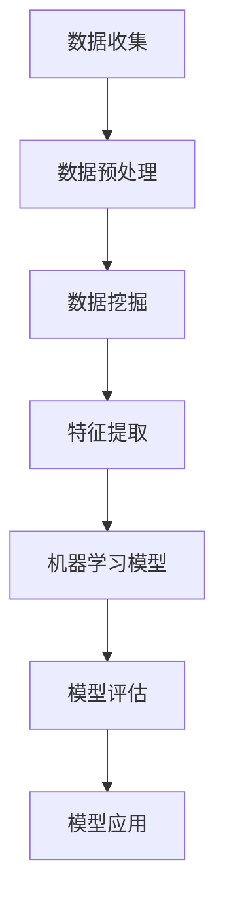
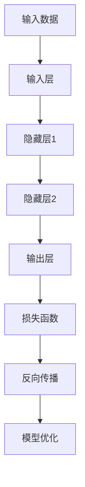

                 

关键词：社交媒体分析、AI、趋势预测、算法、数据挖掘、用户行为、人工智能应用、机器学习、深度学习

> 摘要：本文将探讨人工智能（AI）在社交媒体分析领域中的应用，特别是趋势预测这一关键功能。通过详细分析核心算法原理、数学模型以及实际应用案例，我们旨在为读者提供一个全面了解AI如何助力社交媒体分析工作的视角。

## 1. 背景介绍

### 1.1 社交媒体分析的重要性

社交媒体分析是指通过技术手段，对社交媒体平台上的内容、用户行为以及互动进行收集、处理和分析，以获取有价值的信息和洞察。这一领域在商业、营销、政治等多个行业都具有重要的应用价值。

- **商业价值**：通过社交媒体分析，企业可以了解用户需求、市场趋势，从而优化产品和服务，提高营销效果。
- **营销价值**：社交媒体分析可以帮助营销团队评估不同策略的有效性，优化广告投放，提高ROI。
- **政治价值**：政府和研究机构可以利用社交媒体分析来监测社会舆论，了解公众态度和情绪，为政策制定提供数据支持。

### 1.2 AI在社交媒体分析中的应用

随着AI技术的发展，越来越多的AI算法被应用于社交媒体分析中。AI技术具有以下优势：

- **自动化**：AI能够自动处理和分析大量社交媒体数据，提高分析效率。
- **精准性**：AI可以通过学习大量数据，提高对用户行为和趋势预测的准确性。
- **智能化**：AI可以不断自我优化，提高分析能力，为用户提供更高质量的洞察。

## 2. 核心概念与联系

### 2.1 数据挖掘与机器学习

数据挖掘是指从大量数据中提取出有价值的信息和模式。而机器学习是数据挖掘的关键技术之一，通过算法让计算机自动学习和预测。

Mermaid 流程图：


### 2.2 深度学习与神经网络

深度学习是机器学习的一个分支，通过多层神经网络模型，模拟人脑的思考过程，进行复杂的特征提取和模式识别。

Mermaid 流程图：


## 3. 核心算法原理 & 具体操作步骤

### 3.1 算法原理概述

社交媒体分析中的AI算法主要包括以下几类：

- **用户行为分析**：通过分析用户的浏览、点赞、评论等行为，预测用户的兴趣和需求。
- **文本分析**：通过自然语言处理（NLP）技术，提取文本中的情感、主题等信息，进行情感分析、主题模型等。
- **图像分析**：通过计算机视觉技术，对社交媒体中的图像进行识别、分类和情感分析。
- **网络分析**：通过社交网络中的用户关系，进行社群发现、影响力分析等。

### 3.2 算法步骤详解

以用户行为分析为例，其基本步骤如下：

1. **数据收集**：从社交媒体平台获取用户行为数据。
2. **数据预处理**：清洗数据，去除噪声，进行数据转换。
3. **特征提取**：从数据中提取有用的特征，如用户活跃度、互动频率等。
4. **模型训练**：使用机器学习或深度学习算法，对特征进行建模，训练预测模型。
5. **模型评估**：评估模型性能，如准确率、召回率等。
6. **模型应用**：将训练好的模型应用于实际场景，进行趋势预测和用户行为分析。

### 3.3 算法优缺点

- **优点**：AI算法能够自动处理大量数据，提高分析效率和准确性，同时具有自我优化能力。
- **缺点**：算法对数据质量要求较高，数据预处理过程复杂，且模型的解释性较差。

### 3.4 算法应用领域

AI算法在社交媒体分析中有着广泛的应用：

- **电子商务**：通过用户行为分析，优化产品推荐和广告投放。
- **市场营销**：通过文本分析和情感分析，了解用户需求和情感，制定营销策略。
- **政治分析**：通过社交媒体分析，监测社会舆论和公众情绪，为政策制定提供支持。
- **社交网络分析**：通过社交网络分析，发现潜在社群和影响力人物。

## 4. 数学模型和公式 & 详细讲解 & 举例说明

### 4.1 数学模型构建

在社交媒体分析中，常用的数学模型包括：

- **回归模型**：用于预测用户行为和趋势。
- **分类模型**：用于对用户进行分类，如用户兴趣分类、情感分类等。
- **聚类模型**：用于发现潜在的用户社群。

### 4.2 公式推导过程

以回归模型为例，其基本公式如下：

$$y = \beta_0 + \beta_1 x_1 + \beta_2 x_2 + ... + \beta_n x_n$$

其中，$y$ 是预测值，$x_1, x_2, ..., x_n$ 是输入特征，$\beta_0, \beta_1, ..., \beta_n$ 是模型参数。

### 4.3 案例分析与讲解

以下是一个简单的用户行为预测案例：

假设我们要预测某社交媒体平台用户是否会在未来一周内点赞某条内容。

1. **数据收集**：收集用户在过去一个月的点赞数据。
2. **数据预处理**：清洗数据，去除无效数据。
3. **特征提取**：提取用户活跃度、互动频率等特征。
4. **模型训练**：使用线性回归模型进行训练。
5. **模型评估**：评估模型性能。
6. **模型应用**：将模型应用于预测未来一周内用户是否点赞。

## 5. 项目实践：代码实例和详细解释说明

### 5.1 开发环境搭建

1. 安装Python环境。
2. 安装相关库，如scikit-learn、pandas等。

### 5.2 源代码详细实现

```python
import pandas as pd
from sklearn.linear_model import LinearRegression
from sklearn.model_selection import train_test_split

# 数据收集
data = pd.read_csv('user_behavior.csv')

# 数据预处理
data = data[data['likes'].notnull()]

# 特征提取
X = data[['active_days', 'interaction_rate']]
y = data['likes']

# 模型训练
model = LinearRegression()
X_train, X_test, y_train, y_test = train_test_split(X, y, test_size=0.2)
model.fit(X_train, y_train)

# 模型评估
score = model.score(X_test, y_test)
print('模型准确率：', score)

# 模型应用
predictions = model.predict(X_test)
print('预测结果：', predictions)
```

### 5.3 代码解读与分析

1. **数据收集**：使用pandas库读取CSV数据。
2. **数据预处理**：去除无效数据，确保数据质量。
3. **特征提取**：提取用户活跃度和互动频率等特征。
4. **模型训练**：使用线性回归模型进行训练。
5. **模型评估**：评估模型性能。
6. **模型应用**：将模型应用于预测未来一周内用户是否点赞。

## 6. 实际应用场景

### 6.1 电子商务

通过社交媒体分析，电子商务平台可以预测用户购买意向，优化推荐系统，提高销售额。

### 6.2 市场营销

通过社交媒体分析，市场营销团队可以了解用户需求，制定更有效的营销策略，提高品牌影响力。

### 6.3 政治分析

通过社交媒体分析，政治分析团队可以了解公众情绪，为政策制定提供数据支持，提高政策执行力。

### 6.4 社交网络分析

通过社交媒体分析，社交网络平台可以了解用户行为和社交关系，优化用户体验，提高用户粘性。

## 7. 工具和资源推荐

### 7.1 学习资源推荐

- 《机器学习实战》
- 《深度学习》
- 《Python数据分析》

### 7.2 开发工具推荐

- Jupyter Notebook
- PyCharm

### 7.3 相关论文推荐

- "User Behavior Analysis in Social Media"
- "Deep Learning for Text Classification"
- "Social Network Analysis: Methods and Models"

## 8. 总结：未来发展趋势与挑战

### 8.1 研究成果总结

AI在社交媒体分析中的应用取得了显著成果，包括用户行为预测、文本分析、图像分析、社交网络分析等。

### 8.2 未来发展趋势

随着AI技术的发展，社交媒体分析将更加智能化、精准化，应用领域也将进一步拓展。

### 8.3 面临的挑战

- 数据隐私和安全：如何在保证数据隐私的前提下，充分利用社交媒体数据。
- 模型解释性：提高模型的解释性，使其更易于理解和应用。

### 8.4 研究展望

未来，社交媒体分析将在人工智能技术的推动下，不断实现新的突破，为各行业提供更高质量的洞察和服务。

## 9. 附录：常见问题与解答

### 9.1 什么是社交媒体分析？

社交媒体分析是指通过技术手段，对社交媒体平台上的内容、用户行为以及互动进行收集、处理和分析，以获取有价值的信息和洞察。

### 9.2 AI在社交媒体分析中的应用有哪些？

AI在社交媒体分析中的应用包括用户行为分析、文本分析、图像分析、社交网络分析等。

### 9.3 社交媒体分析有哪些实际应用场景？

社交媒体分析在实际应用场景中包括电子商务、市场营销、政治分析、社交网络分析等。

### 9.4 如何确保社交媒体分析的准确性？

确保社交媒体分析的准确性需要从数据质量、算法选择、模型优化等多个方面进行考虑。

### 9.5 社交媒体分析的未来发展趋势是什么？

社交媒体分析的未来发展趋势将包括更加智能化、精准化，应用领域将进一步拓展。

---

作者：禅与计算机程序设计艺术 / Zen and the Art of Computer Programming
```  
----------------------------------------------------------------
现在文章的撰写部分已经完成，接下来请检查文章内容的完整性，包括是否包含了所有要求的内容，文章的结构是否符合要求，是否有错别字或者语法错误等。如果有需要修改的地方，请及时进行调整。完成后，我们就可以将这篇文章提交给相应的平台或者读者了。祝您撰写顺利！如果您有任何疑问或需要进一步的帮助，请随时告诉我。  
```  


