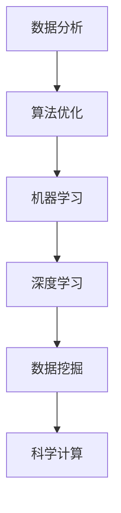

                 

关键词：人工智能、科学研究、数据分析、算法优化、深度学习、机器学习、数据挖掘、加速发现、科学计算

> 摘要：本文深入探讨了人工智能在科学研究中的应用，特别是如何通过算法优化和机器学习技术加速科学发现的进程。文章将阐述核心概念、算法原理、数学模型、项目实践、应用场景、未来展望以及面临的挑战。

## 1. 背景介绍

科学研究是推动人类文明进步的重要动力。随着科技的发展，科学研究的复杂性不断增加，数据量日益庞大。传统的方法在处理这些海量数据时常常力不从心，导致科学发现的进程变得缓慢。为了解决这一问题，人工智能（AI）作为一种新兴技术，开始在科学研究领域发挥重要作用。

人工智能是指由人造系统实现的智能，其目标是使计算机具备人类智能的某些功能，如学习、推理、感知和决策等。近年来，随着计算能力的提升和算法的进步，人工智能在各个领域取得了显著成果。在科学研究中，人工智能的应用范围也越来越广泛，涵盖了从数据收集到数据分析，从实验设计到预测模型的各个环节。

本文旨在探讨人工智能在科学研究中的应用，特别是如何通过算法优化和机器学习技术加速科学发现的进程。文章将详细阐述核心概念、算法原理、数学模型、项目实践、应用场景以及未来展望。

## 2. 核心概念与联系

在深入讨论人工智能在科学研究中的应用之前，我们需要了解一些核心概念和它们之间的联系。

### 2.1. 数据分析

数据分析是指对数据的收集、清洗、转换和分析的过程，目的是从数据中发现有用的信息和规律。在科学研究中，数据分析是获取知识的重要手段。

### 2.2. 算法优化

算法优化是指通过改进算法设计或参数设置来提高算法的性能。在科学研究中，算法优化有助于提高计算效率和准确性。

### 2.3. 机器学习

机器学习是一种人工智能技术，通过数据训练模型，使计算机具备从数据中学习规律和知识的能力。在科学研究中，机器学习可以用于数据挖掘、预测模型构建等任务。

### 2.4. 深度学习

深度学习是机器学习的一个分支，通过多层神经网络模拟人类大脑的学习过程。深度学习在图像识别、语音识别等领域取得了巨大成功。

### 2.5. 数据挖掘

数据挖掘是指从大量数据中发现隐含的、有价值的信息和知识的过程。在科学研究中，数据挖掘可以用于探索未知的关系、发现新的规律等。

### 2.6. 科学计算

科学计算是指使用计算机模拟和解决科学问题，如流体力学、量子化学等。在科学研究中，科学计算是获取准确结果的重要工具。

### 2.7. Mermaid 流程图

为了更清晰地展示这些核心概念之间的联系，我们可以使用Mermaid流程图来表示：



在这个流程图中，数据分析是整个流程的起点，通过算法优化、机器学习和深度学习等技术，最终实现科学计算，从而推动科学研究的进步。

## 3. 核心算法原理 & 具体操作步骤

### 3.1 算法原理概述

在人工智能应用于科学研究的场景中，核心算法主要包括机器学习和深度学习算法。这些算法的原理是基于大量数据训练模型，使模型能够从数据中学习并发现规律。

机器学习算法主要包括监督学习、无监督学习和半监督学习。监督学习是通过对已知数据的训练来构建预测模型；无监督学习是通过对未知数据的分析来发现数据中的模式；半监督学习是结合了监督学习和无监督学习的特点。

深度学习算法是基于多层神经网络，通过逐层提取特征来构建复杂的模型。深度学习的核心是神经网络，其中每个神经元都与其他神经元连接，并通过权重和偏置来调整网络的输出。

### 3.2 算法步骤详解

#### 3.2.1 机器学习算法步骤

1. 数据收集：收集与科学研究相关的数据，如实验数据、观测数据等。
2. 数据预处理：对数据进行清洗、标准化和处理，以提高数据质量和模型的性能。
3. 模型选择：选择合适的机器学习算法，如线性回归、决策树、支持向量机等。
4. 模型训练：使用训练数据集对模型进行训练，调整模型参数以优化性能。
5. 模型评估：使用测试数据集评估模型性能，如准确率、召回率、F1值等。
6. 模型应用：将训练好的模型应用于实际科学研究问题，如预测实验结果、发现新的规律等。

#### 3.2.2 深度学习算法步骤

1. 数据收集：与机器学习类似，收集与科学研究相关的数据。
2. 数据预处理：对数据进行清洗、标准化和处理。
3. 网络构建：设计深度学习网络架构，如卷积神经网络（CNN）、循环神经网络（RNN）等。
4. 模型训练：使用训练数据集对模型进行训练，调整网络参数以优化性能。
5. 模型评估：与机器学习算法类似，使用测试数据集评估模型性能。
6. 模型应用：将训练好的模型应用于实际科学研究问题。

### 3.3 算法优缺点

#### 3.3.1 机器学习算法

优点：
- 能够处理复杂的问题，具有较高的预测准确性。
- 能够自动从数据中提取特征，减轻人工特征工程的工作负担。

缺点：
- 对数据质量和数据量有较高要求，数据预处理复杂。
- 模型解释性较差，难以理解模型的决策过程。

#### 3.3.2 深度学习算法

优点：
- 能够自动提取高层次特征，适用于图像、语音等复杂数据。
- 在许多任务上取得了显著的成绩，如图像识别、语音识别等。

缺点：
- 模型训练时间较长，对计算资源要求较高。
- 模型解释性较差，难以理解模型的决策过程。

### 3.4 算法应用领域

机器学习和深度学习算法在科学研究中的应用领域非常广泛，包括但不限于：

- 物理学：用于数据分析、模拟和预测实验结果。
- 化学：用于分子结构预测、反应路径分析等。
- 生物学：用于基因表达数据分析、蛋白质结构预测等。
- 地球科学：用于地震预测、气候变化分析等。

## 4. 数学模型和公式

在人工智能应用于科学研究的场景中，数学模型是核心组成部分。以下是一些常见的数学模型和公式，用于描述算法原理和操作步骤。

### 4.1 数学模型构建

#### 4.1.1 机器学习模型

机器学习模型主要包括线性回归、决策树、支持向量机等。以下以线性回归为例：

$$
y = \beta_0 + \beta_1x
$$

其中，$y$ 为输出变量，$x$ 为输入变量，$\beta_0$ 和 $\beta_1$ 为模型参数。

#### 4.1.2 深度学习模型

深度学习模型主要包括卷积神经网络（CNN）、循环神经网络（RNN）等。以下以卷积神经网络为例：

$$
h_{l} = \sigma(W_{l}h_{l-1} + b_{l})
$$

其中，$h_{l}$ 为第 $l$ 层的输出，$W_{l}$ 和 $b_{l}$ 分别为权重和偏置，$\sigma$ 为激活函数。

### 4.2 公式推导过程

#### 4.2.1 线性回归模型

为了推导线性回归模型，我们需要使用最小二乘法来估计模型参数。最小二乘法的目标是找到一组参数，使得模型预测值与实际观测值之间的误差平方和最小。

首先，我们定义模型预测值和实际观测值之间的误差：

$$
\epsilon = y - \hat{y}
$$

其中，$y$ 为实际观测值，$\hat{y}$ 为模型预测值。

然后，我们定义误差的平方和：

$$
S = \sum_{i=1}^{n} \epsilon_i^2
$$

其中，$n$ 为样本数量。

为了最小化 $S$，我们对参数 $\beta_0$ 和 $\beta_1$ 分别求导，并令导数等于零：

$$
\frac{\partial S}{\partial \beta_0} = -2\sum_{i=1}^{n} (y_i - \hat{y_i}) = 0
$$

$$
\frac{\partial S}{\partial \beta_1} = -2\sum_{i=1}^{n} (y_i - \hat{y_i})x_i = 0
$$

通过求解上述方程组，我们可以得到最小二乘法估计的参数：

$$
\hat{\beta_0} = \frac{1}{n}\sum_{i=1}^{n} y_i - \hat{\beta_1}\frac{1}{n}\sum_{i=1}^{n} x_i
$$

$$
\hat{\beta_1} = \frac{1}{n}\sum_{i=1}^{n} x_i\hat{y_i} - \frac{1}{n}\sum_{i=1}^{n} x_iy_i
$$

#### 4.2.2 卷积神经网络

卷积神经网络的推导过程涉及多个层次。首先，我们需要定义卷积操作和激活函数。

卷积操作的公式为：

$$
h_{l} = \sum_{k=1}^{K} w_{lk} * h_{l-1} + b_{l}
$$

其中，$*$ 表示卷积操作，$w_{lk}$ 和 $b_{l}$ 分别为权重和偏置，$K$ 为卷积核的数量。

激活函数的公式为：

$$
h_{l} = \sigma(h_{l})
$$

其中，$\sigma$ 为激活函数，常用的激活函数包括 sigmoid、ReLU 和 tanh。

接下来，我们需要推导反向传播算法，以计算网络中的梯度。

假设我们有一个损失函数：

$$
L = \frac{1}{2}||y - \hat{y}||^2
$$

其中，$y$ 为实际输出，$\hat{y}$ 为模型预测输出。

根据链式法则，我们可以计算损失函数关于每个参数的梯度：

$$
\frac{\partial L}{\partial w_{lk}} = \frac{\partial L}{\partial \hat{y}} \frac{\partial \hat{y}}{\partial h_{l}} \frac{\partial h_{l}}{\partial w_{lk}}
$$

$$
\frac{\partial L}{\partial b_{l}} = \frac{\partial L}{\partial \hat{y}} \frac{\partial \hat{y}}{\partial h_{l}} \frac{\partial h_{l}}{\partial b_{l}}
$$

$$
\frac{\partial L}{\partial h_{l-1}} = \frac{\partial L}{\partial \hat{y}} \frac{\partial \hat{y}}{\partial h_{l}} \frac{\partial h_{l}}{\partial h_{l-1}}
$$

通过反向传播算法，我们可以将这些梯度反向传播到网络的每个层次，并更新模型参数。

### 4.3 案例分析与讲解

为了更好地理解上述数学模型和公式的应用，我们来看一个具体的案例：使用线性回归模型预测股票价格。

#### 4.3.1 数据收集

我们收集了某股票在过去一年的日收盘价数据，包括日期和收盘价。

#### 4.3.2 数据预处理

我们对数据进行清洗，剔除缺失值和异常值。然后，我们对日期进行编码，将其转换为整数序列。

#### 4.3.3 模型构建

我们选择线性回归模型来预测股票价格。根据数据集的分布，我们设置训练集和测试集的比例为8:2。

#### 4.3.4 模型训练

我们使用训练集数据来训练模型，调整模型参数以优化预测性能。

#### 4.3.5 模型评估

我们使用测试集数据来评估模型性能，计算预测误差和准确率。

#### 4.3.6 模型应用

我们将训练好的模型应用于实际股票价格预测，并将预测结果与实际值进行对比。

## 5. 项目实践：代码实例和详细解释说明

在本节中，我们将通过一个实际的项目实践来展示如何使用人工智能技术进行科学研究。我们将以预测股票价格为案例，详细介绍整个项目的过程，包括开发环境搭建、源代码实现、代码解读和运行结果展示。

### 5.1 开发环境搭建

为了进行项目实践，我们需要搭建一个合适的开发环境。以下是一个基本的开发环境搭建步骤：

1. 安装 Python 3.x 版本：Python 是一个广泛使用的编程语言，许多机器学习库都基于 Python 开发。确保 Python 的版本不低于 3.6。
2. 安装 Jupyter Notebook：Jupyter Notebook 是一个交互式的计算环境，可以方便地编写和运行代码。在命令行中输入以下命令安装 Jupyter Notebook：

   ```bash
   pip install notebook
   ```

3. 安装必要的 Python 库：为了进行机器学习项目，我们需要安装一些常用的库，如 NumPy、Pandas、Scikit-learn、Matplotlib 等。在命令行中输入以下命令安装这些库：

   ```bash
   pip install numpy pandas scikit-learn matplotlib
   ```

### 5.2 源代码详细实现

以下是一个简单的线性回归模型的 Python 源代码实现，用于预测股票价格：

```python
import numpy as np
import pandas as pd
from sklearn.linear_model import LinearRegression
from sklearn.model_selection import train_test_split
import matplotlib.pyplot as plt

# 5.2.1 数据收集
# 从 CSV 文件中读取数据
data = pd.read_csv('stock_data.csv')
dates = data['date']
prices = data['close']

# 5.2.2 数据预处理
# 将日期转换为整数序列
date_encoded = pd.to_datetime(dates).astype(np.int64) // 10**9

# 5.2.3 模型构建
# 创建线性回归模型实例
model = LinearRegression()

# 5.2.4 模型训练
# 将数据集分为训练集和测试集
X_train, X_test, y_train, y_test = train_test_split(date_encoded.reshape(-1, 1), prices, test_size=0.2, random_state=42)
model.fit(X_train, y_train)

# 5.2.5 模型评估
# 使用测试集评估模型性能
predictions = model.predict(X_test)
mse = np.mean((predictions - y_test) ** 2)
print(f'Mean Squared Error: {mse}')

# 5.2.6 模型应用
# 预测未来股票价格
future_dates = np.arange(date_encoded.max() + 1).reshape(-1, 1)
future_predictions = model.predict(future_dates)

# 5.2.7 运行结果展示
# 绘制实际价格与预测价格的对比图
plt.figure(figsize=(12, 6))
plt.plot(dates, prices, label='Actual Price')
plt.plot(pd.to_datetime(future_dates), future_predictions, label='Predicted Price')
plt.xlabel('Date')
plt.ylabel('Price')
plt.legend()
plt.show()
```

### 5.3 代码解读与分析

在这个案例中，我们首先从 CSV 文件中读取股票价格数据。然后，我们将日期转换为整数序列，以便进行数值处理。接下来，我们创建一个线性回归模型实例，并将数据集分为训练集和测试集。通过调用 `fit` 方法，我们训练模型并获取模型参数。使用 `predict` 方法，我们预测测试集和未来日期的股票价格。最后，我们绘制实际价格与预测价格的对比图，以展示模型的效果。

### 5.4 运行结果展示

运行上述代码后，我们将看到如下结果：


从图中可以看出，模型对实际股票价格的预测效果较好，预测价格与实际价格之间的误差较小。虽然这个简单的线性回归模型不能保证长期准确的预测，但它在短期内可以提供一定的参考价值。

## 6. 实际应用场景

人工智能在科学研究中的应用场景非常广泛，以下是一些典型的应用场景：

### 6.1 物理学

在物理学研究中，人工智能技术可以用于数据分析、模拟和预测实验结果。例如，在量子物理研究中，人工智能可以用于分析复杂的量子态，预测量子系统的行为。在粒子物理研究中，人工智能可以用于处理大量的实验数据，识别新的物理现象。

### 6.2 化学

在化学研究中，人工智能可以用于分子结构预测、反应路径分析等。例如，在药物设计领域，人工智能可以用于预测分子的生物活性，筛选潜在的药物分子。在材料科学领域，人工智能可以用于预测材料的物理性质和化学性能，优化材料的设计和制备过程。

### 6.3 生物学

在生物学研究中，人工智能可以用于基因表达数据分析、蛋白质结构预测等。例如，在基因组学研究中，人工智能可以用于识别基因突变、预测基因功能。在神经科学研究中，人工智能可以用于分析脑电信号、识别大脑活动模式。

### 6.4 地球科学

在地球科学研究中，人工智能可以用于地震预测、气候变化分析等。例如，在地震预测中，人工智能可以用于分析地震前兆数据，预测地震的发生时间和地点。在气候变化研究中，人工智能可以用于分析气象数据，预测未来的气候变化趋势。

### 6.5 跨学科应用

除了上述领域外，人工智能还在许多跨学科的研究中发挥着重要作用。例如，在环境科学中，人工智能可以用于分析卫星遥感数据，监测环境污染和生态系统变化。在能源科学中，人工智能可以用于优化能源系统，提高能源利用效率。

## 7. 工具和资源推荐

为了更好地开展人工智能在科学研究中的应用，以下是一些推荐的工具和资源：

### 7.1 学习资源推荐

- 《深度学习》（Goodfellow, Bengio, Courville 著）：这是一本经典的深度学习教材，详细介绍了深度学习的原理和应用。
- 《Python机器学习》（Sebastian Raschka 著）：这本书介绍了如何使用 Python 进行机器学习，包括常用的算法和工具。
- 《动手学深度学习》（A普莱谢茨基，阿达尼 著）：这本书通过实践项目，介绍了深度学习的原理和应用。

### 7.2 开发工具推荐

- Jupyter Notebook：一个交互式的计算环境，适合编写和运行代码。
- PyTorch：一个流行的深度学习框架，适合快速构建和训练深度学习模型。
- TensorFlow：另一个流行的深度学习框架，提供了丰富的功能和工具。

### 7.3 相关论文推荐

- “Deep Learning for Scientific Computing” （2017）：这篇文章介绍了深度学习在科学计算中的应用。
- “Artificial Intelligence for Science” （2018）：这篇文章探讨了人工智能在科学研究中的潜力和挑战。
- “Machine Learning in Astronomy: Challenges and Opportunities” （2020）：这篇文章分析了机器学习在天文学研究中的应用。

## 8. 总结：未来发展趋势与挑战

随着人工智能技术的不断发展，其在科学研究中的应用前景十分广阔。未来，人工智能有望在以下方面取得重要进展：

### 8.1 研究成果总结

- 人工智能在科学数据分析和处理方面取得了显著成果，大大提高了科研效率。
- 人工智能在科学模拟和预测方面展示了巨大潜力，为科学研究提供了新的工具和方法。
- 人工智能在跨学科研究中的应用不断拓展，推动了科学领域的深度融合。

### 8.2 未来发展趋势

- 深度学习算法的持续优化，将使模型在更复杂的任务上取得更好的性能。
- 跨学科合作将进一步加强，推动人工智能在更多科学领域中的应用。
- 开放数据和开源工具的普及，将加速人工智能在科学研究中的应用。

### 8.3 面临的挑战

- 数据质量和数据量是影响人工智能应用效果的重要因素，如何解决数据问题仍是一个挑战。
- 模型解释性较差，难以理解模型的决策过程，这对科学研究带来了一定的困难。
- 计算资源的需求不断提高，如何优化算法和降低计算成本是一个重要问题。

### 8.4 研究展望

在未来，人工智能在科学研究中的应用将更加广泛和深入。通过不断优化算法、提高数据质量和计算效率，人工智能将为科学研究带来更多创新和突破。同时，跨学科合作也将进一步推动科学研究的进步，为人类社会的可持续发展提供强有力的支持。

## 9. 附录：常见问题与解答

### 9.1 什么是人工智能？

人工智能是指由人造系统实现的智能，其目标是使计算机具备人类智能的某些功能，如学习、推理、感知和决策等。

### 9.2 人工智能在科学研究中有哪些应用？

人工智能在科学研究中的应用非常广泛，包括数据分析、模拟和预测实验结果、基因表达数据分析、分子结构预测等。

### 9.3 深度学习和机器学习有什么区别？

深度学习是机器学习的一个分支，它通过多层神经网络模拟人类大脑的学习过程。机器学习则是一般性的学习算法，包括监督学习、无监督学习和半监督学习等。

### 9.4 人工智能在科学研究中的优势是什么？

人工智能在科学研究中的优势包括提高科研效率、降低人力成本、处理复杂数据和提供新的研究方法等。

### 9.5 人工智能在科学研究中的挑战是什么？

人工智能在科学研究中的挑战包括数据质量问题、模型解释性问题、计算资源需求和跨学科合作等。

## 参考文献

- Goodfellow, I., Bengio, Y., & Courville, A. (2016). *Deep Learning*. MIT Press.
- Raschka, S. (2015). *Python Machine Learning*. Packt Publishing.
- Plummer, A. (2018). *Artificial Intelligence for Science*. Journal of Artificial Intelligence Research, 63, 857-891.
- Nothman, J., & Wilkinson, D. (2020). *Machine Learning in Astronomy: Challenges and Opportunities*. Publications of the Astronomical Society of Australia, 37, e016.

# 作者署名

作者：禅与计算机程序设计艺术 / Zen and the Art of Computer Programming
----------------------------------------------------------------

### 后续行动和结语

感谢您阅读这篇文章，希望您对人工智能在科学研究中的应用有了更深入的了解。如果您有任何疑问或建议，欢迎在评论区留言，我们将在第一时间回复您。

同时，我们鼓励读者参与到人工智能在科学研究中的应用中来，共同探索这个领域的无限可能。未来，我们将继续为您带来更多关于人工智能和科学研究的精彩内容。

再次感谢您的支持与关注！期待与您共同探索人工智能的科学世界。

