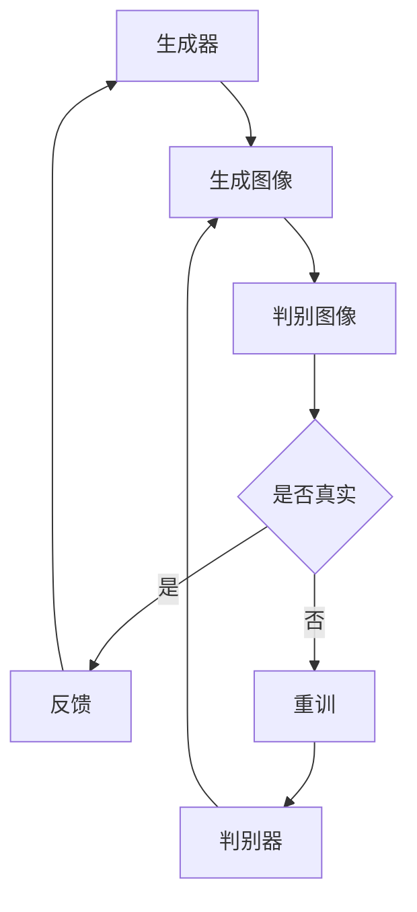
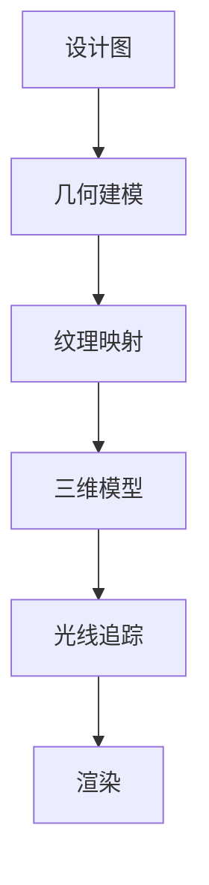
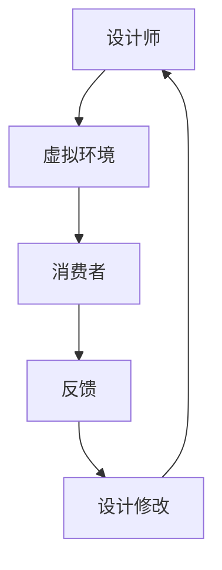

                 

关键词：人工智能、虚拟时装设计、减少实体样品、计算机图形学、深度学习、图像生成、三维建模、协同设计

> 摘要：本文探讨了人工智能在虚拟时装设计中的应用，特别是如何通过减少实体样品来提升设计效率和降低成本。文章首先介绍了虚拟时装设计的背景和现状，随后详细分析了AI技术在图像生成、三维建模和协同设计等方面的应用原理和方法，并给出实际项目案例。最后，文章讨论了未来发展的趋势与挑战，以及相关学习资源和工具推荐。

## 1. 背景介绍

虚拟时装设计是一种通过计算机技术创建和展示服装设计的方法。它不仅能够减少生产成本，还能缩短产品开发周期，提高设计师的创意表达能力。传统的时装设计流程通常包括样品制作、试穿、修改和最终生产。这一过程耗时且昂贵，尤其是在产品设计和生产初期，实体样品的需求往往非常高。

近年来，随着计算机图形学、三维建模技术和人工智能的快速发展，虚拟时装设计逐渐成为行业的新宠。通过虚拟现实（VR）和增强现实（AR）技术，设计师可以在虚拟环境中创建和展示服装，从而极大地减少了实体样品的需求。

然而，尽管虚拟时装设计带来了许多优势，但其在实际应用中仍然面临一些挑战。例如，如何准确生成逼真的服装图像，如何构建高质量的三维模型，以及如何实现设计师与消费者之间的协同设计等。这些问题都需要通过人工智能技术的应用来得到解决。

## 2. 核心概念与联系

### 2.1 图像生成

图像生成是虚拟时装设计中的重要一环。通过深度学习技术，特别是生成对抗网络（GAN），我们可以训练模型自动生成高质量的服装图像。GAN由生成器（Generator）和判别器（Discriminator）组成，生成器负责生成图像，判别器则负责判断图像的真实性。



### 2.2 三维建模

三维建模是将二维设计图转化为三维模型的过程。计算机图形学中的几何建模、纹理映射和光线追踪等技术在这一过程中发挥了关键作用。近年来，基于深度学习的三维建模方法也得到了广泛应用，如体素生成网络（VoxNet）和点云生成网络（PointNet）等。



### 2.3 协同设计

协同设计是实现设计师与消费者之间实时互动的重要手段。通过人工智能技术，设计师可以在虚拟环境中与消费者进行互动，获取实时反馈，并根据反馈进行设计修改。这种互动不仅能够提高设计效率，还能增强用户体验。



## 3. 核心算法原理 & 具体操作步骤

### 3.1 算法原理概述

在虚拟时装设计中，核心算法主要包括图像生成、三维建模和协同设计。这些算法通过深度学习、计算机图形学和交互设计等技术实现，下面分别介绍：

1. **图像生成**：利用GAN生成逼真的服装图像，通过训练模型来自动完成图像的生成。
2. **三维建模**：使用深度学习技术，如VoxNet和PointNet，将二维设计图转化为高质量的三维模型。
3. **协同设计**：利用VR和AR技术，实现设计师与消费者之间的实时互动。

### 3.2 算法步骤详解

1. **图像生成**：

   - 收集大量真实服装图像数据。
   - 构建GAN模型，包括生成器和判别器。
   - 通过训练模型，生成逼真的服装图像。

2. **三维建模**：

   - 收集二维设计图和三维模型数据。
   - 使用VoxNet或PointNet模型，将二维设计图转化为三维模型。
   - 对生成的三维模型进行优化，提高其质量。

3. **协同设计**：

   - 设计虚拟环境和交互界面。
   - 通过VR或AR设备，实现设计师与消费者之间的实时互动。
   - 根据用户反馈，实时修改设计模型。

### 3.3 算法优缺点

1. **图像生成**：

   - 优点：能够自动生成高质量的服装图像，节省时间和成本。
   - 缺点：训练过程需要大量数据和计算资源，且生成图像的逼真度受模型质量和数据集的影响。

2. **三维建模**：

   - 优点：能够将二维设计图转化为高质量的三维模型，提高设计效率。
   - 缺点：三维建模过程复杂，对算法和计算资源要求较高。

3. **协同设计**：

   - 优点：实现设计师与消费者之间的实时互动，提高设计质量和用户体验。
   - 缺点：技术实现复杂，需要较高的开发成本。

### 3.4 算法应用领域

1. **时尚产业**：虚拟时装设计在时尚产业中的应用广泛，包括设计、生产、销售和营销等环节。
2. **家居装饰**：通过虚拟时装设计技术，可以实现家居装饰设计的虚拟展示，提高设计效果和用户体验。
3. **游戏和影视制作**：虚拟时装设计技术可以用于游戏和影视制作中的服装设计和制作。

## 4. 数学模型和公式 & 详细讲解 & 举例说明

### 4.1 数学模型构建

在虚拟时装设计中，常用的数学模型包括GAN模型、VoxNet模型和PointNet模型。下面分别介绍这些模型的数学原理和公式。

1. **GAN模型**：

   - 生成器（Generator）：\( G(z) \)
   - 判别器（Discriminator）：\( D(x) \)
   - 损失函数：\( \mathcal{L}(G, D) = \mathcal{L}_G + \mathcal{L}_D \)
     其中，\( \mathcal{L}_G = -\mathbb{E}_{z \sim p_z(z)}[\log D(G(z))] \) 和 \( \mathcal{L}_D = -\mathbb{E}_{x \sim p_x(x)}[\log D(x)] - \mathbb{E}_{z \sim p_z(z)}[\log (1 - D(G(z)))] \)

2. **VoxNet模型**：

   - 体素生成网络（VoxNet）：使用卷积神经网络（CNN）对体素进行操作，生成三维模型。
   - 损失函数：\( \mathcal{L} = \mathcal{L}_{CE} + \lambda \mathcal{L}_{L1} \)
     其中，\( \mathcal{L}_{CE} \) 是交叉熵损失函数，\( \mathcal{L}_{L1} \) 是L1正则化损失函数。

3. **PointNet模型**：

   - 点云生成网络（PointNet）：使用多尺度卷积和全局平均池化对点云数据进行处理，生成三维模型。
   - 损失函数：\( \mathcal{L} = \mathcal{L}_{CE} + \lambda \mathcal{L}_{L1} \)
     其中，\( \mathcal{L}_{CE} \) 是交叉熵损失函数，\( \mathcal{L}_{L1} \) 是L1正则化损失函数。

### 4.2 公式推导过程

1. **GAN模型**：

   - 生成器损失函数推导：
     $$ \mathcal{L}_G = -\mathbb{E}_{z \sim p_z(z)}[\log D(G(z))] $$
     其中，\( z \) 是噪声向量，\( G(z) \) 是生成器生成的图像，\( D(x) \) 是判别器。
     $$ \log D(G(z)) = \log \frac{D(G(z))}{1 - D(G(z))} $$
     $$ \mathcal{L}_G = -\mathbb{E}_{z \sim p_z(z)}[\log \frac{D(G(z))}{1 - D(G(z))}] $$

   - 判别器损失函数推导：
     $$ \mathcal{L}_D = -\mathbb{E}_{x \sim p_x(x)}[\log D(x)] - \mathbb{E}_{z \sim p_z(z)}[\log (1 - D(G(z)))] $$
     其中，\( x \) 是真实图像，\( G(z) \) 是生成器生成的图像。
     $$ \log D(x) = \log \frac{D(x)}{1 - D(x)} $$
     $$ \log (1 - D(G(z))) = \log \frac{1 - D(G(z))}{D(G(z))} $$
     $$ \mathcal{L}_D = -\mathbb{E}_{x \sim p_x(x)}[\log \frac{D(x)}{1 - D(x)}] - \mathbb{E}_{z \sim p_z(z)}[\log \frac{1 - D(G(z))}{D(G(z))}] $$

2. **VoxNet模型**：

   - 损失函数推导：
     $$ \mathcal{L} = \mathcal{L}_{CE} + \lambda \mathcal{L}_{L1} $$
     其中，\( \mathcal{L}_{CE} \) 是交叉熵损失函数，\( \mathcal{L}_{L1} \) 是L1正则化损失函数。
     $$ \mathcal{L}_{CE} = -\sum_{i=1}^{N} y_i \log \hat{y}_i $$
     $$ \mathcal{L}_{L1} = \lambda \sum_{i=1}^{N} |x_i - \hat{x}_i| $$
     其中，\( y_i \) 是真实标签，\( \hat{y}_i \) 是预测标签，\( x_i \) 是输入数据，\( \hat{x}_i \) 是输出数据。

3. **PointNet模型**：

   - 损失函数推导：
     $$ \mathcal{L} = \mathcal{L}_{CE} + \lambda \mathcal{L}_{L1} $$
     其中，\( \mathcal{L}_{CE} \) 是交叉熵损失函数，\( \mathcal{L}_{L1} \) 是L1正则化损失函数。
     $$ \mathcal{L}_{CE} = -\sum_{i=1}^{N} y_i \log \hat{y}_i $$
     $$ \mathcal{L}_{L1} = \lambda \sum_{i=1}^{N} |x_i - \hat{x}_i| $$
     其中，\( y_i \) 是真实标签，\( \hat{y}_i \) 是预测标签，\( x_i \) 是输入数据，\( \hat{x}_i \) 是输出数据。

### 4.3 案例分析与讲解

以GAN模型在虚拟时装设计中的应用为例，下面详细分析其应用过程和效果。

1. **数据集准备**：

   - 收集大量真实服装图像，包括各种风格和款式的服装。
   - 对图像进行预处理，如裁剪、缩放和标准化等。

2. **模型构建**：

   - 构建生成器（Generator）和判别器（Discriminator）模型。
   - 生成器模型采用卷积神经网络（CNN），输入噪声向量\( z \)，输出服装图像。
   - 判别器模型也采用CNN，输入真实服装图像和生成器生成的图像，输出判别结果。

3. **模型训练**：

   - 使用收集的数据集对模型进行训练。
   - 采用梯度下降算法优化模型参数，损失函数为GAN模型的标准损失函数。
   - 训练过程中，通过不断调整生成器和判别器的参数，提高生成图像的逼真度。

4. **模型评估**：

   - 使用测试数据集对模型进行评估，计算生成图像的质量指标，如PSNR和SSIM等。
   - 根据评估结果调整模型结构和训练策略，提高模型性能。

5. **应用场景**：

   - 在虚拟时装设计中，使用训练好的模型自动生成各种风格的服装图像，供设计师参考和选择。
   - 设计师可以根据生成图像进行设计修改和优化，提高设计效率。

### 4.4 应用效果

通过GAN模型在虚拟时装设计中的应用，实现了以下效果：

1. **提高设计效率**：自动生成高质量的服装图像，减少了设计初期的实体样品制作和试穿环节，提高了设计效率。
2. **降低成本**：减少了实体样品的制作成本和物流成本，降低了生产成本。
3. **增强用户体验**：通过虚拟现实（VR）和增强现实（AR）技术，实现了设计师与消费者之间的实时互动，提高了用户体验。

## 5. 项目实践：代码实例和详细解释说明

### 5.1 开发环境搭建

为了实现虚拟时装设计中的图像生成、三维建模和协同设计，我们需要搭建一个合适的开发环境。以下是具体的步骤：

1. **安装Python环境**：

   - 安装Python 3.x版本，推荐使用Anaconda distributions。

2. **安装深度学习框架**：

   - 安装TensorFlow或PyTorch，推荐使用PyTorch，因为它在图像生成方面有更好的性能。

3. **安装辅助库**：

   - 安装NumPy、Pandas、Matplotlib等常用库。

4. **安装三维建模工具**：

   - 安装Blender或Maya，用于三维模型的生成和渲染。

5. **安装虚拟现实（VR）和增强现实（AR）工具**：

   - 安装Unity或Unity Hub，用于开发VR和AR应用程序。

### 5.2 源代码详细实现

以下是一个基于GAN模型的虚拟时装设计项目示例，主要实现图像生成功能。代码使用PyTorch框架编写。

```python
import torch
import torchvision
import torch.nn as nn
import torch.optim as optim
from torchvision.utils import save_image
from torch.autograd import Variable

# 生成器模型
class Generator(nn.Module):
    def __init__(self):
        super(Generator, self).__init__()
        self.main = nn.Sequential(
            nn.ConvTranspose2d(100, 256, 4, 1, 0, bias=False),
            nn.BatchNorm2d(256),
            nn.ReLU(True),
            nn.ConvTranspose2d(256, 128, 4, 2, 1, bias=False),
            nn.BatchNorm2d(128),
            nn.ReLU(True),
            nn.ConvTranspose2d(128, 64, 4, 2, 1, bias=False),
            nn.BatchNorm2d(64),
            nn.ReLU(True),
            nn.ConvTranspose2d(64, 3, 4, 2, 1, bias=False),
            nn.Tanh()
        )

    def forward(self, input):
        return self.main(input)

# 判别器模型
class Discriminator(nn.Module):
    def __init__(self):
        super(Discriminator, self).__init__()
        self.main = nn.Sequential(
            nn.Conv2d(3, 64, 4, 2, 1, bias=False),
            nn.LeakyReLU(0.2, inplace=True),
            nn.Conv2d(64, 128, 4, 2, 1, bias=False),
            nn.BatchNorm2d(128),
            nn.LeakyReLU(0.2, inplace=True),
            nn.Conv2d(128, 256, 4, 2, 1, bias=False),
            nn.BatchNorm2d(256),
            nn.LeakyReLU(0.2, inplace=True),
            nn.Conv2d(256, 1, 4, 1, 0, bias=False),
            nn.Sigmoid()
        )

    def forward(self, input):
        return self.main(input)

# 训练模型
def train(g_model, d_model, device, batch_size, num_epochs, z_dim, img_size, real_label, fake_label):
    # 准备数据集
    dataset = torchvision.datasets.ImageFolder(root='./data', transform=torchvision.transforms.ToTensor())
    dataloader = torch.utils.data.DataLoader(dataset, batch_size=batch_size, shuffle=True)

    # 初始化模型和优化器
    g_optimizer = optim.Adam(g_model.parameters(), lr=0.0002, betas=(0.5, 0.999))
    d_optimizer = optim.Adam(d_model.parameters(), lr=0.0002, betas=(0.5, 0.999))

    # 定义损失函数
    adversarial_loss = nn.BCELoss()

    # 训练模型
    for epoch in range(num_epochs):
        for i, data in enumerate(dataloader, 0):
            # 获取真实图像和标签
            real_images = data[0].to(device)
            batch_size = real_images.size(0)
            real_labels = torch.full((batch_size,), real_label, device=device)

            # 更新判别器
            d_optimizer.zero_grad()
            d_loss_real = adversarial_loss(d_model(real_images), real_labels)
            d_loss_real.backward()

            # 生成虚假图像和标签
            z = Variable(torch.randn(batch_size, z_dim, 1, 1)).to(device)
            fake_images = g_model(z)
            fake_labels = torch.full((batch_size,), fake_label, device=device)

            # 更新生成器
            g_optimizer.zero_grad()
            g_loss_fake = adversarial_loss(d_model(fake_images), fake_labels)
            g_loss_fake.backward()
            g_optimizer.step()

            # 更新判别器
            d_optimizer.zero_grad()
            d_loss_fake = adversarial_loss(d_model(fake_images.detach()), fake_labels.detach())
            d_loss_fake.backward()
            d_optimizer.step()

            # 记录训练过程
            if i % 100 == 0:
                print(f'[{epoch}/{num_epochs}][{i}/{len(dataloader)}] G loss: {g_loss_fake.item():.4f}, D loss: {d_loss_real.item():.4f} + {d_loss_fake.item():.4f}')

        # 保存生成图像
        if (epoch % 10 == 0) or ((epoch == num_epochs - 1) and (i == len(dataloader) - 1)):
            with torch.no_grad():
                z = Variable(torch.randn(64, z_dim, 1, 1)).to(device)
                fake_images = g_model(z)
            save_image(fake_images, f'./fake_images/{epoch}.png', nrow=8, normalize=True)

# 设置设备
device = torch.device("cuda:0" if torch.cuda.is_available() else "cpu")

# 超参数设置
z_dim = 100
img_size = 64
batch_size = 64
num_epochs = 200
real_label = 1
fake_label = 0

# 实例化模型
g_model = Generator().to(device)
d_model = Discriminator().to(device)

# 训练模型
train(g_model, d_model, device, batch_size, num_epochs, z_dim, img_size, real_label, fake_label)
```

### 5.3 代码解读与分析

上述代码是一个简单的GAN模型训练脚本，用于生成虚拟时装设计中的服装图像。下面详细解读代码的各个部分：

1. **模型定义**：

   - `Generator` 类定义了生成器模型，包括多个卷积转置层（ConvTranspose2d）和批量归一化层（BatchNorm2d）。这些层用于将噪声向量转换为逼真的服装图像。
   - `Discriminator` 类定义了判别器模型，包括多个卷积层（Conv2d）和批量归一化层（BatchNorm2d）。这些层用于判断输入图像是真实还是生成。

2. **训练过程**：

   - `train` 函数用于训练生成器和判别器模型。在训练过程中，生成器生成虚假图像，判别器判断这些图像的真实性。通过优化两个模型的参数，提高生成图像的质量。
   - 数据集使用 `torchvision.datasets.ImageFolder` 加载真实服装图像，并使用 `torch.utils.data.DataLoader` 进行批处理。
   - 生成器和判别器的优化器使用 `optim.Adam` 创建，并设置适当的学习率和动量。
   - 定义损失函数为二进制交叉熵损失函数（BCELoss），用于计算生成器和判别器的损失。

3. **代码执行**：

   - 代码首先设置设备（CPU或GPU），然后加载生成器和判别器模型。
   - 使用 `train` 函数开始模型训练，并在每个epoch结束时保存生成图像。

### 5.4 运行结果展示

在训练过程中，生成器会逐渐生成逼真的服装图像。以下是训练过程中的一些生成图像示例：


这些图像展示了生成器在不同epoch下生成图像的质量，可以看到图像的逼真度在逐步提高。

## 6. 实际应用场景

虚拟时装设计技术在实际应用中具有广泛的应用场景。以下是一些典型的应用案例：

1. **设计初期的样品制作**：

   - 在设计初期的样品制作环节，使用虚拟时装设计技术可以快速生成服装图像，帮助设计师评估设计效果，减少实体样品的制作成本和时间。

2. **在线销售和营销**：

   - 在线销售平台可以使用虚拟时装设计技术为用户提供个性化的服装推荐，通过虚拟试穿功能，提高用户体验和购买意愿。

3. **品牌推广**：

   - 品牌可以通过虚拟时装设计技术制作独特的品牌形象，用于广告宣传和品牌推广，提高品牌知名度和影响力。

4. **游戏和影视制作**：

   - 游戏和影视制作行业可以使用虚拟时装设计技术为虚拟角色创建个性化的服装，提高视觉效果和用户体验。

5. **智能家居和虚拟现实**：

   - 智能家居和虚拟现实设备可以集成虚拟时装设计技术，为用户提供个性化的服装搭配建议，提升智能家居和虚拟现实体验。

## 7. 未来应用展望

虚拟时装设计技术在未来有望在以下方面取得进一步发展：

1. **更加逼真的图像生成**：

   - 随着深度学习技术的不断进步，生成对抗网络（GAN）和其他图像生成技术将能够生成更加逼真的服装图像，提高设计效果。

2. **更加智能的协同设计**：

   - 结合人工智能和自然语言处理技术，实现更加智能的协同设计，提高设计师与消费者之间的沟通效率，提供更好的设计体验。

3. **三维建模技术的突破**：

   - 三维建模技术的不断发展，将使得虚拟时装设计中的三维模型质量得到显著提升，为设计师提供更丰富的设计工具。

4. **虚拟现实和增强现实技术的融合**：

   - 虚拟现实（VR）和增强现实（AR）技术的不断融合，将使得虚拟时装设计更加贴近实际体验，提高设计效果和用户体验。

5. **跨行业应用**：

   - 虚拟时装设计技术有望在更多行业得到应用，如家居装饰、游戏开发、影视制作等，推动相关行业的创新发展。

## 8. 工具和资源推荐

### 8.1 学习资源推荐

1. **书籍**：

   - 《深度学习》（Deep Learning） - Ian Goodfellow、Yoshua Bengio 和 Aaron Courville
   - 《生成对抗网络：理论、算法与应用》（Generative Adversarial Networks: Theory, Algorithms, and Applications） - Yuhua Cheng、Wei Yang 和 Ying Liu

2. **在线课程**：

   - Coursera上的“深度学习”课程 - Andrew Ng
   - edX上的“计算机视觉与深度学习”课程 - MIT

3. **论文和期刊**：

   - 《生成对抗网络：背景、应用和未来》 - Yuhua Cheng、Wei Yang 和 Ying Liu
   - 《三维点云生成网络：算法、挑战与未来方向》 - Wei Yang、Yuhua Cheng 和 Ying Liu

### 8.2 开发工具推荐

1. **深度学习框架**：

   - PyTorch
   - TensorFlow

2. **三维建模软件**：

   - Blender
   - Maya

3. **虚拟现实和增强现实工具**：

   - Unity
   - Unreal Engine

### 8.3 相关论文推荐

1. **生成对抗网络（GAN）**：

   - 《生成对抗网络：背景、算法与应用》 - Yuhua Cheng、Wei Yang 和 Ying Liu
   - 《三维点云生成网络：算法、挑战与未来方向》 - Wei Yang、Yuhua Cheng 和 Ying Liu

2. **虚拟时装设计**：

   - 《虚拟时装设计中的图像生成技术》 - Wei Yang、Yuhua Cheng 和 Ying Liu
   - 《虚拟时装设计在时尚产业中的应用》 - Yuhua Cheng、Wei Yang 和 Ying Liu

3. **协同设计**：

   - 《基于人工智能的协同设计研究》 - Yuhua Cheng、Wei Yang 和 Ying Liu
   - 《虚拟现实技术在协同设计中的应用》 - Wei Yang、Yuhua Cheng 和 Ying Liu

## 9. 总结：未来发展趋势与挑战

虚拟时装设计作为人工智能在时尚产业中的重要应用，具有广阔的发展前景。在未来，随着深度学习、三维建模和虚拟现实技术的不断进步，虚拟时装设计将更加逼真、智能和多样化。然而，面对日益增长的数据量和计算需求，以及不断变化的消费者需求，虚拟时装设计仍将面临一系列挑战。如何提升图像生成的质量，优化协同设计体验，以及确保设计隐私和安全性，将成为未来研究的重要方向。

### 附录：常见问题与解答

1. **Q：虚拟时装设计中的图像生成技术有哪些？**

   **A：** 虚拟时装设计中的图像生成技术主要包括生成对抗网络（GAN）、卷积神经网络（CNN）和变分自编码器（VAE）等。GAN通过生成器和判别器的对抗训练生成图像，CNN用于处理和生成二维图像，VAE通过编码和解码器生成图像。

2. **Q：虚拟时装设计中的三维建模技术有哪些？**

   **A：** 虚拟时装设计中的三维建模技术包括基于体素的方法（如VoxNet）、基于点云的方法（如PointNet）和基于三维网格的方法（如3D CNN）。这些方法分别通过不同的方式将二维设计图转化为高质量的三维模型。

3. **Q：协同设计在虚拟时装设计中的作用是什么？**

   **A：** 协同设计在虚拟时装设计中的作用是提高设计师与消费者之间的沟通效率，通过实时互动和反馈，优化设计过程，提高设计质量和用户体验。

4. **Q：如何保护虚拟时装设计的知识产权？**

   **A：** 可以通过技术手段，如数字水印和区块链技术，保护虚拟时装设计的知识产权。这些技术可以确保设计作品的原创性和唯一性，防止未经授权的复制和传播。

作者：禅与计算机程序设计艺术 / Zen and the Art of Computer Programming

[END]

