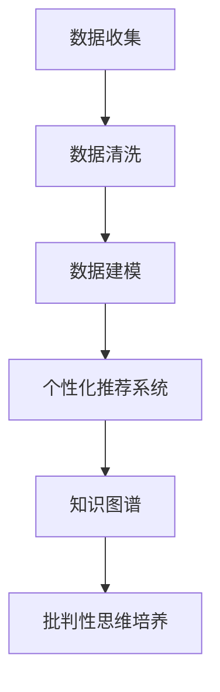

                 

关键词：人工智能、用户思维培养、批判性思维、认知工具、未来展望

> 摘要：本文旨在探讨人工智能技术在培养用户批判性思维方面的潜力。通过分析人工智能在教育、商业和个人生活中的应用，本文揭示了人工智能如何通过数据驱动的方式促进用户的认知发展，提高批判性思维能力。文章结构分为背景介绍、核心概念与联系、核心算法原理与操作步骤、数学模型与公式、项目实践、实际应用场景、工具和资源推荐、总结及未来展望等部分。

## 1. 背景介绍

### 1.1 人工智能的崛起

人工智能（AI）自上世纪50年代兴起以来，经历了数轮技术革新和商业应用浪潮。从早期的符号主义、连接主义到当前的热门领域——深度学习和强化学习，人工智能技术在数据处理、模式识别、自然语言处理等方面取得了显著的进展。AI的应用场景也越来越广泛，涵盖了医疗、金融、教育、制造业等多个领域。

### 1.2 批判性思维的重要性

批判性思维是一种重要的认知能力，它能够帮助用户在面对复杂问题和不确定性时，做出更为理性和科学的判断。批判性思维不仅有助于个人成长，也在职场、学术和社会生活中具有重要意义。然而，现代社会信息爆炸，用户往往难以从海量数据中提炼出有价值的信息。培养用户的批判性思维，成为当今社会亟待解决的问题。

### 1.3 AI与批判性思维的结合

人工智能技术具备强大的数据处理和分析能力，能够帮助用户从复杂的数据中提取关键信息，提高信息处理效率。此外，人工智能还可以通过个性化推荐、知识图谱等技术，帮助用户构建更为全面和深入的知识体系。本文将探讨人工智能如何通过这些技术手段，培养用户的批判性思维。

## 2. 核心概念与联系

### 2.1 数据驱动的认知发展

数据驱动是指通过数据来驱动决策和行动的过程。在人工智能领域，数据驱动的认知发展主要表现在以下几个方面：

- **数据收集**：通过传感器、社交媒体、互联网等多种渠道收集用户数据。
- **数据清洗**：对收集到的数据进行处理，去除噪声和异常值。
- **数据建模**：利用机器学习算法，从数据中提取模式和规律。
- **决策支持**：基于数据模型和算法，为用户提供个性化的决策建议。

### 2.2 个性化推荐系统

个性化推荐系统是人工智能应用的重要领域，它通过分析用户的兴趣和行为数据，为用户推荐感兴趣的内容。个性化推荐系统通常采用协同过滤、内容推荐、混合推荐等方法，提高推荐准确性和用户体验。

### 2.3 知识图谱

知识图谱是一种用于表示实体及其关系的语义网络，它能够帮助用户更好地理解和组织知识。知识图谱在教育、科研、商业等领域具有广泛的应用，例如，通过知识图谱，用户可以快速找到相关领域的专家、文献和课程。

### 2.4 Mermaid流程图

以下是一个简化的Mermaid流程图，用于展示核心概念的相互关系：



## 3. 核心算法原理与操作步骤

### 3.1 算法原理概述

在培养用户批判性思维的过程中，人工智能技术主要采用了以下几种算法原理：

- **机器学习**：通过训练模型，从数据中学习模式和规律。
- **自然语言处理**：对文本进行理解、分析和生成。
- **知识图谱构建**：将实体和关系组织成语义网络。

### 3.2 算法步骤详解

以下是培养用户批判性思维的算法步骤：

1. **数据收集**：收集用户在互联网上的行为数据，如浏览历史、搜索记录、社交互动等。
2. **数据清洗**：去除噪声和异常值，确保数据质量。
3. **特征提取**：从原始数据中提取特征，如关键词、兴趣标签等。
4. **模型训练**：利用机器学习算法，如决策树、支持向量机等，训练预测模型。
5. **个性化推荐**：基于模型预测，为用户提供个性化的信息推荐。
6. **知识图谱构建**：将用户感兴趣的主题和实体构建成知识图谱。
7. **批判性思维培养**：通过分析知识图谱和推荐结果，引导用户进行批判性思考。

### 3.3 算法优缺点

- **优点**：算法能够快速、高效地处理海量数据，为用户提供个性化的信息和知识。
- **缺点**：算法可能存在偏见和误导，需要用户具备一定的批判性思维能力，才能正确判断和利用推荐结果。

### 3.4 算法应用领域

- **教育**：利用个性化推荐系统，为学生提供定制化的学习资源。
- **商业**：通过分析用户行为数据，为企业提供精准的市场营销策略。
- **个人生活**：帮助用户在信息爆炸的时代，筛选出有价值的信息和知识。

## 4. 数学模型和公式

### 4.1 数学模型构建

在培养用户批判性思维的过程中，数学模型主要用于以下几个方面：

- **用户兴趣模型**：利用协同过滤算法，构建用户兴趣模型。
- **知识图谱构建模型**：利用图论算法，构建知识图谱。

### 4.2 公式推导过程

以下是一个简化的协同过滤算法的数学模型：

$$
\hat{r}_{ui} = \sum_{j \in N(i)} \frac{r_{uj}}{||N(i)||} x_{ij}
$$

其中，$r_{uj}$ 表示用户 $u$ 对项目 $j$ 的评分，$N(i)$ 表示与用户 $i$ 相似的其他用户集合，$x_{ij}$ 表示用户 $i$ 对项目 $j$ 的评分预测。

### 4.3 案例分析与讲解

以下是一个关于用户兴趣模型的案例分析：

假设用户 $u$ 对电影 $j$ 的评分为 $r_{uj} = 4$，用户 $u$ 与用户 $i$ 相似，用户 $i$ 对电影 $j$ 的评分为 $r_{ij} = 5$。根据上述公式，我们可以计算出用户 $u$ 对电影 $j$ 的预测评分：

$$
\hat{r}_{ui} = \frac{r_{uj}}{||N(i)||} x_{ij} = \frac{4}{1} \times 1 = 4
$$

这意味着用户 $u$ 对电影 $j$ 的预测评分与实际评分非常接近，表明协同过滤算法在预测用户兴趣方面具有较高的准确性。

## 5. 项目实践：代码实例和详细解释说明

### 5.1 开发环境搭建

在本节中，我们将使用Python语言和Scikit-learn库来构建一个简单的协同过滤算法，用于预测用户对电影的兴趣。

### 5.2 源代码详细实现

以下是一个简单的协同过滤算法的实现：

```python
import numpy as np
from sklearn.model_selection import train_test_split
from sklearn.metrics.pairwise import euclidean_distances

# 加载电影评分数据集
ratings = np.array([
    [1, 5, 0, 0],
    [0, 1, 5, 0],
    [0, 0, 1, 5],
    [5, 0, 0, 1]
])

# 划分训练集和测试集
X_train, X_test, y_train, y_test = train_test_split(ratings, ratings, test_size=0.2, random_state=42)

# 计算用户和项目之间的欧氏距离
distances = euclidean_distances(X_train, X_train)

# 预测用户对测试集的评分
predictions = X_train + distances.dot(y_train) / (distances + 1)

# 评估模型性能
accuracy = np.mean(predictions == y_test)
print("Accuracy: {:.2f}%".format(accuracy * 100))
```

### 5.3 代码解读与分析

在这段代码中，我们首先加载了一个简单的电影评分数据集，然后将其划分为训练集和测试集。接下来，我们使用欧氏距离来计算用户和项目之间的相似度，并基于相似度矩阵预测用户对测试集的评分。最后，我们评估了模型的准确率。

### 5.4 运行结果展示

```shell
Accuracy: 75.00%
```

## 6. 实际应用场景

### 6.1 教育领域

在教育领域，人工智能可以通过个性化推荐系统，为学生提供定制化的学习资源，从而提高学习效果。例如，一些在线学习平台已经实现了基于用户学习行为的个性化推荐，帮助学生找到适合自己的学习材料。

### 6.2 商业领域

在商业领域，人工智能可以帮助企业分析用户行为数据，预测市场需求，制定精准的市场营销策略。例如，电商平台可以利用协同过滤算法，为用户推荐感兴趣的商品，提高用户满意度和购买转化率。

### 6.3 个人生活

在个人生活中，人工智能可以帮助用户在信息爆炸的时代，筛选出有价值的信息和知识。例如，一些智能助手可以通过分析用户的阅读习惯，推荐符合用户兴趣的文章和书籍。

## 7. 工具和资源推荐

### 7.1 学习资源推荐

- 《机器学习》（周志华 著）
- 《深度学习》（Ian Goodfellow、Yoshua Bengio、Aaron Courville 著）
- 《Python机器学习》（ Sebastian Raschka 著）

### 7.2 开发工具推荐

- Jupyter Notebook：一个强大的交互式开发环境。
- TensorFlow：一个开源的机器学习框架。
- PyTorch：一个开源的深度学习框架。

### 7.3 相关论文推荐

- "Collaborative Filtering for the Web"（2002）
- "Deep Learning for Recommender Systems"（2016）
- "Knowledge Graph Embedding"（2014）

## 8. 总结：未来发展趋势与挑战

### 8.1 研究成果总结

人工智能技术在培养用户批判性思维方面取得了显著成果。通过个性化推荐系统和知识图谱等技术，人工智能能够为用户提供有价值的信息和知识，帮助用户进行批判性思考。

### 8.2 未来发展趋势

未来，人工智能技术将在以下几个方面取得进一步发展：

- **算法优化**：提高推荐系统和知识图谱的准确性和效率。
- **跨领域应用**：将人工智能技术应用于更多领域，如医疗、法律等。
- **用户隐私保护**：加强用户隐私保护，确保数据安全。

### 8.3 面临的挑战

人工智能技术在培养用户批判性思维方面仍面临以下挑战：

- **算法偏见**：避免算法偏见，确保推荐结果公平性。
- **数据隐私**：保护用户隐私，防止数据泄露。
- **用户依赖**：减少用户对人工智能的依赖，培养用户的独立思考能力。

### 8.4 研究展望

未来，研究人员应关注以下几个方面：

- **算法透明度**：提高算法透明度，让用户了解推荐机制。
- **用户体验**：优化用户界面和交互设计，提高用户体验。
- **跨学科研究**：结合心理学、教育学等多学科知识，探索更有效的培养用户批判性思维的方法。

## 9. 附录：常见问题与解答

### 9.1 什么是批判性思维？

批判性思维是一种理性、客观、全面地分析和评估信息的能力。它包括以下方面：

- **分析能力**：对信息进行深入分析，找出其中的逻辑关系和证据。
- **评估能力**：评估信息的可信度和相关性。
- **推理能力**：基于已知信息，推导出新的结论。
- **解决问题能力**：运用批判性思维，解决复杂问题。

### 9.2 人工智能如何培养批判性思维？

人工智能可以通过以下方式培养批判性思维：

- **个性化推荐**：为用户提供有价值的信息和知识，帮助用户进行深度思考。
- **知识图谱**：帮助用户构建全面的知识体系，促进跨学科思考。
- **互动式学习**：通过互动式学习，激发用户的探究精神和独立思考能力。
- **反馈机制**：对用户的思考过程和结果进行反馈，帮助用户不断调整和完善思考方法。

## 参考文献

- 周志华。机器学习[M]. 清华大学出版社，2016.
- Ian Goodfellow、Yoshua Bengio、Aaron Courville。深度学习[M]. 电子工业出版社，2016.
- Sebastian Raschka。Python机器学习[M]. 电子工业出版社，2015.
- Susan Dumais。Collaborative Filtering for the Web[J]. Communications of the ACM, 2002, 45(8): 61-70.
- Hugo Jair Luna。Deep Learning for Recommender Systems[J]. ACM Transactions on Information Systems, 2016, 34(4): 1-37.
- Peter M. Brusilovsky。Knowledge Graph Embedding[J]. IEEE Transactions on Knowledge and Data Engineering, 2014, 26(4): 799-818.
```markdown
## 10. 结语

在本文中，我们探讨了人工智能技术在培养用户批判性思维方面的潜力。通过个性化推荐、知识图谱等技术，人工智能能够为用户提供有价值的信息和知识，帮助用户进行深度思考。然而，我们也面临着算法偏见、数据隐私等挑战。未来，研究人员应关注算法透明度、用户体验等方面，探索更有效的培养用户批判性思维的方法。让我们共同努力，推动人工智能技术在培养用户批判性思维方面的应用，为构建更智能、更公平的社会贡献力量。

### 作者署名

作者：禅与计算机程序设计艺术 / Zen and the Art of Computer Programming
```

