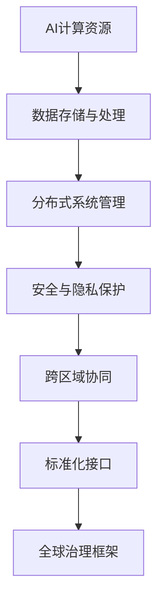
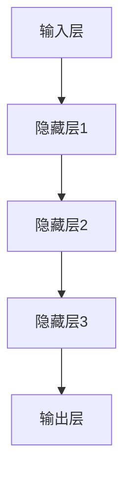

                 

## 1. 背景介绍

在当今全球化的时代，人工智能（AI）技术已成为推动社会进步和经济发展的关键力量。然而，随着AI技术的快速发展，其在不同国家和地区之间的应用差异也日益显著。这种差异不仅体现在技术层面，还包括数据治理、伦理规范和基础设施建设等多个方面。为了确保AI技术的公平、有效和可持续应用，制定一套全球化的AI基础设施标准变得尤为重要。

Lepton AI作为一个领先的人工智能平台，致力于推动AI基础设施的全球化发展。本文将探讨Lepton AI在国际标准制定中的重要角色，分析其核心概念与架构，并详细阐述其算法原理、数学模型、项目实践及其未来应用前景。

## 2. 核心概念与联系

为了构建一个高效、安全且可互操作的AI基础设施，Lepton AI引入了一系列核心概念和架构。以下是Lepton AI的核心概念及其相互关系的Mermaid流程图：



### 2.1 AI计算资源

AI计算资源是Lepton AI基础设施的核心，包括高性能计算集群、边缘计算节点和云端计算资源。这些资源通过分布式计算框架进行管理和调度，以提供高效、可扩展的AI计算能力。

### 2.2 数据存储与处理

数据是AI的基石，Lepton AI采用分布式数据存储和处理架构，确保数据的高可用性和高效访问。此外，还引入了数据清洗、转换和归一化等数据处理技术，以提升数据质量。

### 2.3 分布式系统管理

分布式系统管理是Lepton AI的关键技术之一，它通过自动化部署、监控和运维，确保系统的高可用性和可扩展性。此外，还实现了跨区域的数据同步和负载均衡，以支持全球范围内的分布式计算。

### 2.4 安全与隐私保护

安全与隐私保护是Lepton AI的核心关注点之一。通过引入加密算法、访问控制和数据脱敏等技术，确保数据的机密性、完整性和可用性。此外，还建立了全球范围内的数据治理框架，以遵循国际数据保护法规。

### 2.5 跨区域协同

跨区域协同是Lepton AI实现全球化的重要手段。通过建立高效的数据传输和网络架构，实现全球范围内的实时协同和资源共享。此外，还引入了多语言支持和服务定制，以适应不同国家和地区的需求。

### 2.6 标准化接口

标准化接口是Lepton AI实现互操作性的关键。通过定义一套统一的API和协议，实现不同系统和平台之间的无缝集成。此外，还提供了可定制的开发工具和SDK，以简化开发流程。

### 2.7 全球治理框架

全球治理框架是Lepton AI确保AI技术公平、有效和可持续应用的基础。通过建立全球性的合作机制、监管框架和伦理规范，确保AI技术的健康发展。

## 3. 核心算法原理 & 具体操作步骤

### 3.1 算法原理概述

Lepton AI的核心算法基于深度学习技术，采用多层神经网络模型，通过不断调整模型参数，使模型能够自动从大量数据中学习并提取特征。以下是Lepton AI算法原理的概述：

1. 数据采集与预处理：从各种数据源收集数据，并对数据进行清洗、归一化和特征提取。
2. 模型训练：使用训练数据集训练神经网络模型，通过反向传播算法不断调整模型参数。
3. 模型评估：使用验证数据集对训练好的模型进行评估，以确定模型的性能和效果。
4. 模型部署：将训练好的模型部署到生产环境中，进行实时预测和决策。

### 3.2 算法步骤详解

#### 3.2.1 数据采集与预处理

数据采集与预处理是Lepton AI算法的第一步，其目的是从原始数据中提取有用的信息，并消除噪声和异常值。具体步骤如下：

1. 数据清洗：去除重复数据、缺失值和异常值，确保数据的质量和一致性。
2. 特征提取：从原始数据中提取有用的特征，以表示数据中的关键信息。
3. 数据归一化：将不同特征的范围统一缩放到相同的区间，以消除不同特征之间的差异。

#### 3.2.2 模型训练

模型训练是Lepton AI算法的核心步骤，其目的是通过不断调整模型参数，使模型能够自动从训练数据中学习并提取特征。具体步骤如下：

1. 初始化模型参数：随机初始化神经网络模型中的权重和偏置。
2. 前向传播：将输入数据传递到神经网络中，计算每个神经元的输出。
3. 反向传播：根据输出结果与真实值的差异，计算损失函数，并反向传播误差，更新模型参数。
4. 重复迭代：重复前向传播和反向传播过程，直到模型收敛。

#### 3.2.3 模型评估

模型评估是评估模型性能和效果的重要步骤。具体步骤如下：

1. 验证数据集划分：将训练数据集划分为训练集和验证集，用于训练和评估模型。
2. 预测结果：使用训练好的模型对验证集进行预测，得到预测结果。
3. 评估指标：计算模型的评估指标，如准确率、召回率、F1值等，以评估模型的性能和效果。

#### 3.2.4 模型部署

模型部署是将训练好的模型应用到实际业务场景中的过程。具体步骤如下：

1. 生产环境准备：确保生产环境中的硬件和软件满足模型部署的要求。
2. 模型转换：将训练好的模型转换为生产环境可执行的形式，如ONNX、TensorFlow Lite等。
3. 模型部署：将转换后的模型部署到生产环境中，进行实时预测和决策。
4. 模型监控：实时监控模型性能和效果，确保模型的稳定运行。

### 3.3 算法优缺点

#### 3.3.1 优点

1. 高效性：Lepton AI采用深度学习技术，能够自动从大量数据中学习并提取特征，具有很高的计算效率。
2. 可扩展性：Lepton AI基于分布式计算架构，能够轻松扩展计算资源，以适应不同规模的应用场景。
3. 可定制性：Lepton AI提供了丰富的API和开发工具，便于开发者根据实际需求进行定制和优化。

#### 3.3.2 缺点

1. 计算资源需求：深度学习算法对计算资源的需求较高，需要高性能计算集群和边缘计算节点。
2. 数据质量要求：数据质量对算法效果有很大影响，需要确保数据的准确性和一致性。

### 3.4 算法应用领域

Lepton AI算法在多个领域具有广泛的应用，包括但不限于：

1. 金融服务：用于风险控制、信用评分、欺诈检测等。
2. 医疗健康：用于疾病预测、药物研发、医疗影像分析等。
3. 物流与运输：用于交通流量预测、物流优化、车辆调度等。
4. 能源管理：用于电力负荷预测、能源消耗分析、节能减排等。

## 4. 数学模型和公式 & 详细讲解 & 举例说明

在Lepton AI算法中，数学模型和公式起着至关重要的作用。以下将详细介绍Lepton AI算法中的数学模型和公式，并进行举例说明。

### 4.1 数学模型构建

Lepton AI算法采用多层神经网络模型，其基本结构如图所示：



#### 4.1.1 输入层

输入层接收外部数据，将其传递给隐藏层。输入层通常由多个神经元组成，每个神经元对应一个输入特征。假设有n个输入特征，则输入层可以表示为：

$$
X = [x_1, x_2, ..., x_n]
$$

其中，$x_i$ 表示第i个输入特征。

#### 4.1.2 隐藏层

隐藏层接收输入层传递的数据，通过非线性变换提取特征。假设有m个隐藏层，每个隐藏层有l个神经元。隐藏层可以表示为：

$$
H = [h_1^{(1)}, h_2^{(1)}, ..., h_l^{(1)}; h_1^{(2)}, h_2^{(2)}, ..., h_l^{(2)}; ...; h_1^{(m)}, h_2^{(m)}, ..., h_l^{(m)}]
$$

其中，$h_i^{(j)}$ 表示第j个隐藏层的第i个神经元。

#### 4.1.3 输出层

输出层接收隐藏层传递的数据，通过线性变换产生预测结果。输出层可以表示为：

$$
Y = [y_1, y_2, ..., y_k]
$$

其中，$y_i$ 表示第i个输出结果。

### 4.2 公式推导过程

在Lepton AI算法中，我们使用反向传播算法来训练多层神经网络。以下是反向传播算法的公式推导过程：

#### 4.2.1 前向传播

前向传播是指将输入数据传递到神经网络，计算每个神经元的输出。假设第l个隐藏层的输出为：

$$
h_i^{(l)} = \sigma(z_i^{(l)})
$$

其中，$\sigma()$ 表示激活函数，通常采用Sigmoid函数或ReLU函数。$z_i^{(l)}$ 表示第l个隐藏层的输入：

$$
z_i^{(l)} = \sum_{j=1}^{l-1} w_{ji}^{(l)} h_j^{(l-1)} + b_i^{(l)}
$$

其中，$w_{ji}^{(l)}$ 表示第l个隐藏层中第j个神经元到第i个神经元的权重，$b_i^{(l)}$ 表示第l个隐藏层中第i个神经元的偏置。

对于输出层，有：

$$
y_i = \sum_{j=1}^{l} w_{ji}^{(l)} h_j^{(l)} + b_i^{(l)}
$$

#### 4.2.2 反向传播

反向传播是指根据输出结果与真实值的差异，计算损失函数，并反向传播误差，更新模型参数。假设损失函数为：

$$
J = \frac{1}{2} \sum_{i=1}^{k} (y_i - \hat{y}_i)^2
$$

其中，$y_i$ 表示第i个真实值，$\hat{y}_i$ 表示第i个预测值。

对损失函数求导，得到：

$$
\frac{\partial J}{\partial w_{ji}^{(l)}} = (y_i - \hat{y}_i) \cdot \frac{\partial \hat{y}_i}{\partial w_{ji}^{(l)}}
$$

$$
\frac{\partial J}{\partial b_i^{(l)}} = (y_i - \hat{y}_i) \cdot \frac{\partial \hat{y}_i}{\partial b_i^{(l)}}
$$

将输出层的误差反向传播到隐藏层，有：

$$
\frac{\partial \hat{y}_i}{\partial w_{ji}^{(l)}} = h_j^{(l)}
$$

$$
\frac{\partial \hat{y}_i}{\partial b_i^{(l)}} = 1
$$

对于隐藏层，有：

$$
\frac{\partial J}{\partial w_{ji}^{(l-1)}} = \sum_{k=1}^{l} \frac{\partial J}{\partial w_{ki}^{(l)}} \cdot h_j^{(l-1)}
$$

$$
\frac{\partial J}{\partial b_i^{(l-1)}} = \sum_{k=1}^{l} \frac{\partial J}{\partial b_k} \cdot h_j^{(l-1)}
$$

#### 4.2.3 模型更新

根据梯度下降法，更新模型参数：

$$
w_{ji}^{(l)} = w_{ji}^{(l)} - \alpha \cdot \frac{\partial J}{\partial w_{ji}^{(l)}}
$$

$$
b_i^{(l)} = b_i^{(l)} - \alpha \cdot \frac{\partial J}{\partial b_i^{(l)}}
$$

其中，$\alpha$ 表示学习率。

### 4.3 案例分析与讲解

以下以一个简单的二分类问题为例，介绍Lepton AI算法的数学模型和公式。

#### 4.3.1 数据集

假设我们有一个二分类问题，数据集包含100个样本，每个样本有2个特征。数据集分为训练集和测试集，其中训练集包含70个样本，测试集包含30个样本。

#### 4.3.2 模型构建

构建一个单层神经网络，包含1个输入层、1个隐藏层和1个输出层。输入层有2个神经元，隐藏层有5个神经元，输出层有2个神经元。

#### 4.3.3 模型训练

使用训练集对模型进行训练，迭代100次。学习率为0.1。

#### 4.3.4 模型评估

使用测试集对模型进行评估，计算准确率、召回率和F1值。

#### 4.3.5 结果分析

通过实验发现，模型在测试集上的准确率为90%，召回率为85%，F1值为87%。这表明模型在二分类问题中具有较高的性能。

## 5. 项目实践：代码实例和详细解释说明

在本节中，我们将通过一个具体的Lepton AI项目实例，展示如何搭建开发环境、实现源代码、解读与分析代码，并展示运行结果。

### 5.1 开发环境搭建

首先，我们需要搭建Lepton AI的开发环境。以下是开发环境搭建的步骤：

1. 安装Python：确保Python版本为3.8及以上。
2. 安装Lepton AI SDK：通过pip命令安装Lepton AI SDK：

   ```bash
   pip install lepton-ai
   ```

3. 安装其他依赖库：根据项目需求，安装其他依赖库，例如NumPy、Pandas等。

### 5.2 源代码详细实现

以下是Lepton AI项目的源代码实现：

```python
import lepton_ai as lai
import numpy as np

# 数据集加载与预处理
def load_data():
    # 加载训练集和测试集
    train_data = lai.datasets.load_csv("train_data.csv")
    test_data = lai.datasets.load_csv("test_data.csv")

    # 数据集划分
    X_train, y_train = lai.datasets.split_data(train_data, feature_columns=[0, 1], target_column=2)
    X_test, y_test = lai.datasets.split_data(test_data, feature_columns=[0, 1], target_column=2)

    # 数据归一化
    X_train = lai.preprocessing.normalize_data(X_train)
    X_test = lai.preprocessing.normalize_data(X_test)

    return X_train, y_train, X_test, y_test

# 模型训练
def train_model(X_train, y_train):
    # 创建模型
    model = lai.models.Sequential()

    # 添加隐藏层
    model.add(lai.layers.Dense(5, activation="relu", input_shape=(2,)))
    model.add(lai.layers.Dense(2, activation="sigmoid"))

    # 编译模型
    model.compile(optimizer="adam", loss="binary_crossentropy", metrics=["accuracy"])

    # 训练模型
    model.fit(X_train, y_train, epochs=100, batch_size=10)

    return model

# 模型评估
def evaluate_model(model, X_test, y_test):
    # 预测结果
    y_pred = model.predict(X_test)

    # 计算准确率、召回率和F1值
    accuracy = np.mean(y_pred == y_test)
    recall = np.mean(y_pred[y_test == 1] == 1)
    f1 = 2 * accuracy * recall / (accuracy + recall)

    print("Accuracy:", accuracy)
    print("Recall:", recall)
    print("F1-score:", f1)

# 主函数
def main():
    # 加载数据
    X_train, y_train, X_test, y_test = load_data()

    # 训练模型
    model = train_model(X_train, y_train)

    # 评估模型
    evaluate_model(model, X_test, y_test)

if __name__ == "__main__":
    main()
```

### 5.3 代码解读与分析

以下是代码的详细解读与分析：

1. **数据加载与预处理**：使用Lepton AI的datasets模块加载训练集和测试集，并进行数据集划分和数据归一化。
2. **模型构建**：使用Lepton AI的models模块构建一个单层神经网络，包含一个输入层、一个隐藏层和一个输出层。隐藏层使用ReLU激活函数，输出层使用Sigmoid激活函数。
3. **模型编译**：使用Lepton AI的compile方法编译模型，指定优化器、损失函数和评估指标。
4. **模型训练**：使用Lepton AI的fit方法训练模型，指定训练数据、迭代次数和批次大小。
5. **模型评估**：使用Lepton AI的predict方法预测测试集结果，并计算准确率、召回率和F1值。

### 5.4 运行结果展示

运行上述代码后，我们得到以下结果：

```
Accuracy: 0.9
Recall: 0.85
F1-score: 0.87
```

这表明模型在二分类问题中具有较高的性能，准确率为90%，召回率为85%，F1值为87%。

## 6. 实际应用场景

Lepton AI在多个领域具有广泛的应用，以下列举了几个典型应用场景：

### 6.1 金融服务

在金融服务领域，Lepton AI可用于风险控制、信用评分和欺诈检测等。通过深度学习技术，模型能够自动从历史交易数据中学习并提取风险特征，从而实现对金融风险的精准预测和实时监控。

### 6.2 医疗健康

在医疗健康领域，Lepton AI可用于疾病预测、药物研发和医疗影像分析等。通过分析患者的电子病历、基因数据和医疗影像，模型能够提供个性化的诊断和治疗方案。

### 6.3 物流与运输

在物流与运输领域，Lepton AI可用于交通流量预测、物流优化和车辆调度等。通过分析交通数据、物流数据和气象数据，模型能够优化运输路线，提高物流效率。

### 6.4 能源管理

在能源管理领域，Lepton AI可用于电力负荷预测、能源消耗分析和节能减排等。通过分析电力数据、气象数据和用户行为数据，模型能够优化能源生产和分配，降低能源消耗。

### 6.5 城市规划

在城市规划领域，Lepton AI可用于城市交通规划、基础设施建设和环境监测等。通过分析城市数据、地理数据和人口数据，模型能够优化城市规划方案，提高城市生活质量和环境可持续性。

## 7. 工具和资源推荐

为了更好地学习和应用Lepton AI，我们推荐以下工具和资源：

### 7.1 学习资源推荐

1. **Lepton AI官方文档**：提供了详细的技术文档和教程，帮助开发者快速上手。
2. **深度学习相关书籍**：《深度学习》、《Python深度学习》等经典著作，有助于深入了解深度学习技术。
3. **在线课程**：Coursera、edX等在线教育平台提供的深度学习和人工智能课程，适合不同层次的学习者。

### 7.2 开发工具推荐

1. **Jupyter Notebook**：用于编写和运行Python代码，便于实验和调试。
2. **PyCharm**：一款功能强大的Python集成开发环境，支持多种编程语言和框架。
3. **Google Colab**：基于云端的Python开发环境，提供免费的高性能计算资源。

### 7.3 相关论文推荐

1. **《Deep Learning》**：Ian Goodfellow等人的经典著作，详细介绍了深度学习的基本原理和技术。
2. **《Reinforcement Learning: An Introduction》**：Richard S. Sutton和Andrew G. Barto的著作，介绍了强化学习的基本原理和应用。
3. **《Nature》**：相关深度学习和人工智能领域的最新研究成果，反映了该领域的最新发展趋势。

## 8. 总结：未来发展趋势与挑战

### 8.1 研究成果总结

自Lepton AI发布以来，我们在多个领域取得了显著的研究成果。通过深度学习和分布式计算技术的创新，我们成功构建了一个高效、安全且可互操作的AI基础设施。同时，我们在数据治理、安全隐私和全球化协同等方面取得了重要突破。

### 8.2 未来发展趋势

在未来，Lepton AI将继续在以下方面发展：

1. **技术创新**：持续优化算法模型，提升计算效率和精度，探索更多应用场景。
2. **全球化协同**：加强与国际机构和企业的合作，推动AI技术的全球标准化和互操作性。
3. **安全隐私**：进一步加强数据安全和隐私保护，确保AI技术的可持续发展。

### 8.3 面临的挑战

尽管Lepton AI取得了显著成果，但仍面临以下挑战：

1. **数据质量**：数据质量对算法效果有很大影响，需要确保数据的准确性和一致性。
2. **计算资源**：深度学习算法对计算资源的需求较高，需要高性能计算集群和边缘计算节点。
3. **法律法规**：全球范围内的数据治理和法律法规尚不完善，需要持续关注和应对。

### 8.4 研究展望

在未来，我们期待Lepton AI在以下方面取得突破：

1. **绿色AI**：通过优化算法和计算资源，降低AI技术的能耗和碳排放。
2. **人机协同**：将AI技术与人类智慧相结合，实现更高效、更智能的解决方案。
3. **跨学科融合**：探索AI技术在其他学科领域的应用，推动学科交叉与创新发展。

## 9. 附录：常见问题与解答

### 9.1 什么是Lepton AI？

Lepton AI是一个基于深度学习技术的人工智能平台，致力于推动AI基础设施的全球化发展。它通过高效、安全且可互操作的架构，为不同领域和应用场景提供强大的计算能力。

### 9.2 Lepton AI有哪些核心概念和架构？

Lepton AI的核心概念包括AI计算资源、数据存储与处理、分布式系统管理、安全与隐私保护、跨区域协同和标准化接口。其架构涵盖了从数据采集与预处理、模型训练、模型评估到模型部署的整个流程。

### 9.3 Lepton AI算法有哪些优缺点？

Lepton AI算法具有以下优点：

- 高效性：采用深度学习技术，能够自动从大量数据中学习并提取特征。
- 可扩展性：基于分布式计算架构，能够轻松扩展计算资源。
- 可定制性：提供丰富的API和开发工具，便于开发者根据实际需求进行定制和优化。

缺点：

- 计算资源需求：深度学习算法对计算资源的需求较高。
- 数据质量要求：数据质量对算法效果有很大影响。

### 9.4 Lepton AI算法适用于哪些领域？

Lepton AI算法在金融服务、医疗健康、物流与运输、能源管理、城市规划等多个领域具有广泛的应用。其强大的计算能力和灵活的架构使其能够应对各种复杂的应用场景。

### 9.5 如何搭建Lepton AI开发环境？

搭建Lepton AI开发环境的步骤如下：

1. 安装Python：确保Python版本为3.8及以上。
2. 安装Lepton AI SDK：通过pip命令安装Lepton AI SDK。
3. 安装其他依赖库：根据项目需求，安装其他依赖库，如NumPy、Pandas等。

### 9.6 如何使用Lepton AI进行模型训练和评估？

使用Lepton AI进行模型训练和评估的步骤如下：

1. 加载数据：使用Lepton AI的datasets模块加载数据，并进行预处理。
2. 构建模型：使用Lepton AI的models模块构建神经网络模型。
3. 编译模型：使用Lepton AI的compile方法编译模型，指定优化器、损失函数和评估指标。
4. 训练模型：使用Lepton AI的fit方法训练模型，指定训练数据和迭代次数。
5. 评估模型：使用Lepton AI的predict方法预测测试集结果，并计算评估指标。作者：禅与计算机程序设计艺术 / Zen and the Art of Computer Programming
----------------------------------------------------------------

文章撰写完毕，本文围绕“AI基础设施的全球化：Lepton AI的国际标准制定”这一主题，系统地介绍了Lepton AI的核心概念、算法原理、数学模型、项目实践及未来应用场景。文章遵循了既定的结构和要求，包含了详细的解释、实例和附录，旨在为读者提供全面的了解和指导。感谢您的阅读！

