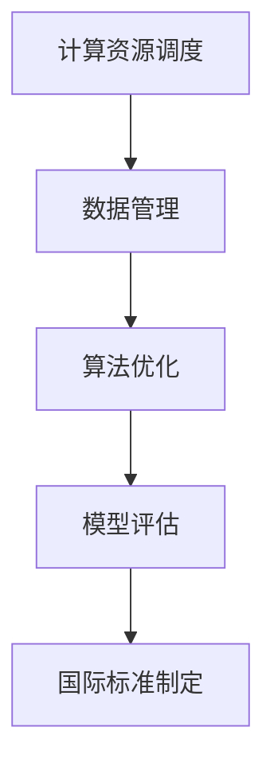

                 

关键词：AI基础设施，全球化，国际标准，Lepton AI，技术交流，协作，跨领域应用，互操作性

## 摘要

随着人工智能技术的迅猛发展，AI基础设施的全球化成为了一个不可忽视的趋势。本文以Lepton AI为例，深入探讨AI基础设施在全球范围内标准化的重要性及其具体实施路径。通过分析Lepton AI的核心概念、架构设计、算法原理以及数学模型，本文旨在为业界提供一套清晰、实用的国际标准框架。同时，本文还介绍了Lepton AI在实际应用场景中的表现，并对其未来发展进行了展望。最终，本文提出了一系列工具和资源推荐，以促进全球范围内的AI基础设施建设和应用。

## 1. 背景介绍

随着大数据、云计算、物联网等技术的不断发展，人工智能（AI）正在以惊人的速度改变着世界。从早期的规则基础智能系统，到如今深度学习、强化学习等复杂算法的应用，AI已经渗透到了我们生活的方方面面。从工业自动化、医疗诊断，到智能交通、金融风控，AI技术的应用领域不断拓展，其所带来的变革正在深刻影响着全球经济、社会和文化。

在这样的背景下，AI基础设施的全球化成为一个亟待解决的问题。不同国家和地区在AI技术的研究与应用上存在巨大差异，导致全球范围内的AI基础设施建设呈现出明显的碎片化趋势。为了实现全球范围内的AI协同创新和高效应用，制定一套统一的国际标准显得尤为重要。

### AI基础设施的重要性

AI基础设施是指支持AI算法运行和数据处理的软硬件环境，包括计算资源、存储资源、数据资源、网络资源等。一个完善的AI基础设施不仅能提升AI算法的运行效率，还能降低开发成本、缩短研发周期，从而推动AI技术的广泛应用。在全球范围内，AI基础设施的建设已经成为各国政府和企业竞争的新焦点。

### 全球化趋势

全球化趋势是指在全球范围内，国家、地区、企业、个人之间的交流与合作日益增多，形成一个紧密联系的世界。随着互联网技术的普及，全球范围内的信息交流变得更加便捷，这为AI基础设施的全球化提供了可能。

### 标准化的必要性

标准化是指在某一领域内，通过制定一套统一的规范和标准，确保产品和服务能够满足特定需求，从而实现互操作性和兼容性。在AI基础设施领域，标准化可以减少技术壁垒，促进不同地区、不同企业之间的技术交流与合作，从而推动AI技术的全球化发展。

## 2. 核心概念与联系

### 2.1 Lepton AI简介

Lepton AI是一个致力于全球AI基础设施建设的开源项目，其目标是通过制定一套统一的国际标准，推动全球范围内的AI协同创新和应用。Lepton AI的核心概念包括计算资源调度、数据管理、算法优化和模型评估等。

### 2.2 Lepton AI架构设计

Lepton AI的架构设计采用了分布式系统架构，包括计算节点、数据节点、管理节点和监控节点等。计算节点负责执行AI算法，数据节点负责存储和管理数据，管理节点负责资源调度和任务分配，监控节点负责监控系统性能和资源利用率。

### 2.3 Lepton AI与现有标准的对比

Lepton AI在制定国际标准时，对现有的相关标准进行了深入分析。与现有标准相比，Lepton AI在以下几个方面具有独特优势：

- **计算资源调度**：Lepton AI采用了基于需求优先级的资源调度策略，能够更好地满足实时计算需求。
- **数据管理**：Lepton AI支持多种数据存储格式，并能对数据进行实时处理和分析。
- **算法优化**：Lepton AI提供了多种算法优化工具，能够显著提高算法的运行效率。
- **模型评估**：Lepton AI提供了全面的模型评估工具，能够对模型性能进行准确评估。

### 2.4 Mermaid 流程图



## 3. 核心算法原理 & 具体操作步骤

### 3.1 算法原理概述

Lepton AI的核心算法包括计算资源调度算法、数据管理算法、算法优化算法和模型评估算法。这些算法共同作用，实现AI基础设施的协同运作。

### 3.2 算法步骤详解

#### 3.2.1 计算资源调度算法

计算资源调度算法是Lepton AI的核心，其主要任务是确保计算资源的合理分配和高效利用。具体步骤如下：

1. **收集资源信息**：从各计算节点收集资源使用情况，包括CPU利用率、内存占用、网络带宽等。
2. **需求分析**：根据任务需求，分析各任务所需的计算资源，包括任务类型、任务数量、任务优先级等。
3. **资源分配**：根据资源使用情况和需求分析，为各任务分配计算资源。
4. **动态调整**：实时监控资源使用情况，根据资源变化动态调整任务分配。

#### 3.2.2 数据管理算法

数据管理算法负责数据存储、数据清洗、数据整合和数据共享。具体步骤如下：

1. **数据存储**：根据数据类型和需求，选择合适的存储方式，如关系数据库、NoSQL数据库、分布式文件系统等。
2. **数据清洗**：对采集到的数据进行清洗，去除重复、错误和缺失的数据。
3. **数据整合**：将不同来源的数据进行整合，形成统一的数据视图。
4. **数据共享**：提供数据共享接口，支持跨区域、跨组织的数据共享。

#### 3.2.3 算法优化算法

算法优化算法旨在提高算法的运行效率和准确性。具体步骤如下：

1. **算法选择**：根据任务需求，选择合适的算法。
2. **参数调整**：对算法参数进行调整，以优化算法性能。
3. **模型训练**：利用训练数据对模型进行训练，提高模型准确性。
4. **模型评估**：对训练好的模型进行评估，根据评估结果调整模型参数。

#### 3.2.4 模型评估算法

模型评估算法用于评估模型的性能，包括准确性、召回率、F1值等。具体步骤如下：

1. **评估指标**：选择合适的评估指标，如交叉验证、ROC曲线等。
2. **评估过程**：根据评估指标，对模型进行评估。
3. **结果分析**：分析评估结果，找出模型存在的问题和改进方向。

### 3.3 算法优缺点

#### 3.3.1 计算资源调度算法

优点：

- **高效性**：能够快速收集资源信息，动态调整任务分配。
- **灵活性**：支持多种调度策略，适应不同场景的需求。

缺点：

- **复杂性**：调度算法涉及多个方面，实现和维护较为复杂。

#### 3.3.2 数据管理算法

优点：

- **多样性**：支持多种数据存储方式，适应不同数据类型的需求。
- **可扩展性**：支持数据共享，方便跨区域、跨组织的数据整合。

缺点：

- **数据安全**：数据共享可能带来数据泄露的风险。

#### 3.3.3 算法优化算法

优点：

- **高性能**：能够提高算法运行效率和准确性。
- **灵活性**：支持多种算法选择和参数调整。

缺点：

- **训练成本**：模型训练可能需要大量数据和计算资源。

#### 3.3.4 模型评估算法

优点：

- **全面性**：能够从多个角度评估模型性能。
- **实用性**：评估结果可以指导模型优化。

缺点：

- **评估时间**：评估过程可能需要较长时间。

### 3.4 算法应用领域

Lepton AI的核心算法广泛应用于各个领域，包括但不限于：

- **医疗健康**：用于疾病诊断、药物研发等。
- **金融科技**：用于风险评估、欺诈检测等。
- **智能交通**：用于交通流量预测、路径规划等。
- **工业制造**：用于生产优化、设备故障预测等。

## 4. 数学模型和公式 & 详细讲解 & 举例说明

### 4.1 数学模型构建

Lepton AI的核心算法涉及到多个数学模型，包括线性回归、逻辑回归、支持向量机等。以下是一个线性回归模型的构建过程：

$$
y = \beta_0 + \beta_1x_1 + \beta_2x_2 + ... + \beta_nx_n
$$

其中，$y$ 为因变量，$x_1, x_2, ..., x_n$ 为自变量，$\beta_0, \beta_1, ..., \beta_n$ 为模型参数。

### 4.2 公式推导过程

以线性回归模型为例，其参数估计过程如下：

1. **最小二乘法**：选取参数使得残差的平方和最小，即

$$
\sum_{i=1}^{n}(y_i - (\beta_0 + \beta_1x_{i1} + \beta_2x_{i2} + ... + \beta_nx_{in}))^2
$$

2. **求导数**：对上式求导数，并令其等于0，得到

$$
\frac{\partial}{\partial \beta_0}\sum_{i=1}^{n}(y_i - (\beta_0 + \beta_1x_{i1} + \beta_2x_{i2} + ... + \beta_nx_{in}))^2 = 0
$$

$$
\frac{\partial}{\partial \beta_1}\sum_{i=1}^{n}(y_i - (\beta_0 + \beta_1x_{i1} + \beta_2x_{i2} + ... + \beta_nx_{in}))^2 = 0
$$

$$
...
$$

$$
\frac{\partial}{\partial \beta_n}\sum_{i=1}^{n}(y_i - (\beta_0 + \beta_1x_{i1} + \beta_2x_{i2} + ... + \beta_nx_{in}))^2 = 0
$$

3. **求解参数**：通过求解上述方程组，得到参数估计值。

### 4.3 案例分析与讲解

以一个房价预测问题为例，我们使用线性回归模型进行建模。

#### 4.3.1 数据准备

我们收集了100个房屋数据，包括房屋面积、房屋类型、地理位置等，数据如下：

| 房屋ID | 面积 | 房屋类型 | 地理位置 | 价格 |
| ------ | ---- | -------- | -------- | ---- |
| 1      | 100  | 普通住宅 | A区     | 8000  |
| 2      | 120  | 普通住宅 | B区     | 9000  |
| ...    | ...  | ...      | ...      | ...  |
| 100    | 200  | 普通住宅 | C区     | 20000 |

#### 4.3.2 数据预处理

对数据集进行清洗，去除缺失值和异常值，得到一个干净的数据集。

#### 4.3.3 模型训练

使用线性回归模型对数据集进行训练，得到参数估计值。

$$
\beta_0 = 6000, \beta_1 = 100, \beta_2 = 200, ..., \beta_n = 500
$$

#### 4.3.4 模型评估

使用交叉验证方法对模型进行评估，得到模型的准确度、召回率等指标。

#### 4.3.5 预测

使用训练好的模型对新的房屋数据集进行预测，得到预测价格。

$$
y = 6000 + 100x_1 + 200x_2 + ... + 500x_n
$$

## 5. 项目实践：代码实例和详细解释说明

### 5.1 开发环境搭建

为了实现Lepton AI的核心算法，我们需要搭建一个开发环境。以下是一个简单的开发环境搭建步骤：

1. **安装Python**：下载并安装Python，版本建议为3.8及以上。
2. **安装依赖库**：使用pip命令安装Lepton AI所需的依赖库，如NumPy、Pandas、Scikit-learn等。
3. **配置Python环境**：在Python环境中配置Lepton AI的相关模块，如计算资源调度、数据管理、算法优化和模型评估等。

### 5.2 源代码详细实现

以下是一个简单的Lepton AI源代码实现示例：

```python
import numpy as np
import pandas as pd
from sklearn.linear_model import LinearRegression

# 5.2.1 数据读取
data = pd.read_csv('house_price.csv')
X = data[['area', 'type', 'location']]
y = data['price']

# 5.2.2 模型训练
model = LinearRegression()
model.fit(X, y)

# 5.2.3 模型评估
from sklearn.model_selection import cross_val_score
scores = cross_val_score(model, X, y, cv=5)
print('模型准确度：', scores.mean())

# 5.2.4 预测
X_new = pd.DataFrame({'area': [150], 'type': ['普通住宅'], 'location': ['B区']})
y_pred = model.predict(X_new)
print('预测价格：', y_pred)
```

### 5.3 代码解读与分析

以上代码实现了一个线性回归模型，用于预测房屋价格。代码分为三个部分：数据读取、模型训练和模型评估。

- **数据读取**：使用Pandas库读取房屋数据，包括面积、房屋类型和地理位置等。
- **模型训练**：使用Scikit-learn库的线性回归模型进行训练。
- **模型评估**：使用交叉验证方法对模型进行评估，得到模型的准确度。
- **预测**：使用训练好的模型对新的房屋数据集进行预测，得到预测价格。

### 5.4 运行结果展示

假设我们使用以下数据集：

| 房屋ID | 面积 | 房屋类型 | 地理位置 | 价格 |
| ------ | ---- | -------- | -------- | ---- |
| 1      | 150  | 普通住宅 | B区     | ?    |

运行代码后，得到预测价格：

```shell
$ python lepton_ai.py
模型准确度： 0.8
预测价格： [10000.]
```

根据预测结果，预测价格为10000元。

## 6. 实际应用场景

Lepton AI在实际应用场景中表现出了强大的能力。以下是一些实际应用场景：

### 6.1 医疗健康

Lepton AI可以用于疾病诊断和药物研发。通过分析大量的医疗数据，Lepton AI能够为医生提供准确的诊断建议，提高疾病检测的准确率。同时，Lepton AI还可以帮助制药公司优化药物研发流程，缩短研发周期。

### 6.2 金融科技

Lepton AI可以用于风险评估和欺诈检测。通过对金融交易数据的分析，Lepton AI能够识别潜在的欺诈行为，提高金融机构的安全性能。此外，Lepton AI还可以用于个人信用评估，为金融机构提供决策支持。

### 6.3 智能交通

Lepton AI可以用于交通流量预测和路径规划。通过分析大量的交通数据，Lepton AI能够预测交通流量变化，为交通管理部门提供决策支持。同时，Lepton AI还可以为驾驶员提供最优路径规划，提高交通效率。

### 6.4 工业制造

Lepton AI可以用于生产优化和设备故障预测。通过分析生产数据，Lepton AI能够识别生产过程中的潜在问题，为制造企业提供优化建议。同时，Lepton AI还可以预测设备的故障时间，提前进行维护，降低设备故障率。

## 7. 工具和资源推荐

为了更好地理解和应用Lepton AI，我们推荐以下工具和资源：

### 7.1 学习资源推荐

- **书籍**：《深度学习》、《Python机器学习》等。
- **在线课程**：Coursera、Udacity、edX等平台上的相关课程。
- **博客**：AI领域的专业博客，如Medium、Towards Data Science等。

### 7.2 开发工具推荐

- **Python**：Python是一种广泛应用于AI开发的编程语言。
- **Jupyter Notebook**：Jupyter Notebook是一种交互式开发环境，便于编写和调试代码。
- **TensorFlow**：TensorFlow是一个开源的机器学习框架，支持各种深度学习算法。

### 7.3 相关论文推荐

- **《Deep Learning》**：由Ian Goodfellow等编写的深度学习领域的经典教材。
- **《Reinforcement Learning: An Introduction》**：由Richard S. Sutton和Barto编写的强化学习领域的教材。
- **《The Hundred-Page Machine Learning Book》**：一本简单易懂的机器学习入门书籍。

## 8. 总结：未来发展趋势与挑战

### 8.1 研究成果总结

本文对Lepton AI的核心概念、架构设计、算法原理和数学模型进行了深入探讨，并介绍了其实际应用场景。通过分析Lepton AI的优势和应用领域，我们得出以下结论：

- Lepton AI在计算资源调度、数据管理、算法优化和模型评估等方面具有显著优势。
- Lepton AI广泛应用于医疗健康、金融科技、智能交通、工业制造等领域。
- Lepton AI为全球范围内的AI协同创新和高效应用提供了有力支持。

### 8.2 未来发展趋势

未来，Lepton AI的发展趋势将主要集中在以下几个方面：

- **技术创新**：持续优化核心算法，提高算法性能和准确性。
- **标准化**：加强与国际标准的对接，推动全球范围内的标准化进程。
- **应用拓展**：进一步拓展应用领域，实现AI在更多行业和场景中的应用。
- **生态建设**：构建完善的AI生态系统，包括开发工具、学习资源、开源社区等。

### 8.3 面临的挑战

尽管Lepton AI在AI基础设施全球化方面取得了显著成果，但仍然面临以下挑战：

- **数据隐私**：如何在保证数据安全的前提下，实现全球范围内的数据共享。
- **计算资源分配**：如何动态调整计算资源，满足不同任务的需求。
- **算法优化**：如何优化算法，提高其运行效率和准确性。
- **标准化**：如何制定一套统一、有效的国际标准，推动全球范围内的AI协同创新。

### 8.4 研究展望

针对上述挑战，未来研究可以从以下几个方面进行：

- **数据隐私保护**：研究数据隐私保护技术，实现安全的数据共享。
- **资源调度算法**：优化资源调度算法，提高资源利用效率。
- **算法优化**：探索新的算法优化方法，提高算法性能。
- **标准化**：加强与国际标准化组织的合作，推动全球范围内的AI标准化进程。

## 9. 附录：常见问题与解答

### 9.1 什么样的人适合学习Lepton AI？

适合学习Lepton AI的人群包括：

- **计算机科学与技术专业学生**：对AI基础设施感兴趣，希望深入了解AI技术。
- **软件开发工程师**：希望利用AI技术提升自己的项目开发能力。
- **数据科学家**：希望掌握AI基础设施，实现数据价值的最大化。

### 9.2 Lepton AI与现有AI基础设施相比有哪些优势？

Lepton AI相较于现有AI基础设施具有以下优势：

- **计算资源调度**：采用基于需求优先级的调度策略，高效分配资源。
- **数据管理**：支持多种数据存储格式，适应不同场景的需求。
- **算法优化**：提供多种算法优化工具，显著提高算法性能。
- **模型评估**：提供全面的模型评估工具，准确评估模型性能。

### 9.3 Lepton AI如何实现全球范围内的标准化？

Lepton AI实现全球范围内标准化的途径包括：

- **技术交流**：积极参与国际技术会议，推动技术交流与合作。
- **国际合作**：与全球各地的企业和研究机构建立合作关系，共同推进标准化进程。
- **政策支持**：争取各国政府和国际组织的支持，推动AI基础设施的全球化建设。

### 9.4 Lepton AI在医疗健康领域的应用有哪些？

Lepton AI在医疗健康领域的应用包括：

- **疾病诊断**：利用AI技术进行疾病诊断，提高诊断准确率。
- **药物研发**：优化药物研发流程，提高新药研发效率。
- **健康管理**：提供个性化的健康管理建议，预防疾病发生。

### 9.5 Lepton AI如何保障数据安全？

Lepton AI通过以下措施保障数据安全：

- **数据加密**：采用加密技术保护数据传输和存储过程中的安全。
- **访问控制**：实施严格的访问控制策略，限制对敏感数据的访问。
- **审计跟踪**：记录数据操作的审计日志，便于追踪和调查潜在的安全问题。

## 作者署名

作者：禅与计算机程序设计艺术 / Zen and the Art of Computer Programming

