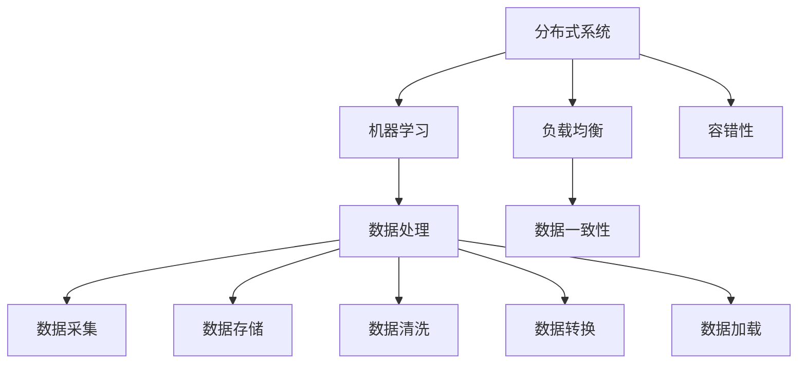

                 

### 关键词 Keyword
- AI基础设施
- 可扩展性
- Lepton AI
- 架构设计
- 分布式系统
- 机器学习

<|assistant|>### 摘要 Abstract
本文探讨了AI基础设施在实现可扩展性方面的关键挑战，并以Lepton AI的架构设计为例，详细分析了其在分布式系统、机器学习、数据处理等方面的创新实践。通过深入解读Lepton AI的核心算法、数学模型和项目实践，本文为AI技术的实际应用提供了宝贵的参考，并展望了其未来的发展趋势与面临的挑战。

## 1. 背景介绍

随着人工智能（AI）技术的迅猛发展，AI基础设施的可扩展性已成为决定其成败的关键因素。在过去的几十年里，计算机性能以指数级增长，AI算法的复杂性也不断升级，这使得AI基础设施的需求日益增加。传统的集中式架构在处理大规模数据时已经力不从心，迫切需要一种全新的分布式架构来满足AI应用的扩展需求。

在这种背景下，Lepton AI应运而生。Lepton AI是一家专注于AI基础设施研发的公司，致力于解决AI系统在可扩展性、可靠性和效率方面的难题。其核心架构设计不仅兼顾了高性能和可扩展性，还充分考虑了系统运维的简便性。本文将围绕Lepton AI的架构设计，深入分析其在AI基础设施可扩展性方面的创新与实践。

### 1.1 Lepton AI的使命和愿景

Lepton AI的使命是构建下一代AI基础设施，为全球企业和开发者提供高效、可靠、可扩展的AI计算能力。公司的愿景是成为AI领域基础设施的领导者，推动AI技术的普及和应用，助力各行各业实现智能化转型。

### 1.2 AI基础设施的重要性

AI基础设施是AI技术实现落地应用的基础，其重要性体现在以下几个方面：

- **性能与效率**：高性能的计算资源能够加速AI模型的训练和推理过程，提高系统的响应速度。
- **可扩展性**：随着数据量和用户数量的增长，基础设施需要能够无缝扩展，保证系统稳定运行。
- **可靠性**：系统需要具备高可用性，确保在任何情况下都能正常运行，避免因故障导致的数据丢失或服务中断。
- **灵活性**：基础设施需要支持多种AI算法和模型，满足不同应用场景的需求。
- **成本效益**：高效利用资源，降低运营成本，提高投资回报率。

## 2. 核心概念与联系

在探讨Lepton AI的架构设计之前，我们需要先了解一些核心概念，如分布式系统、机器学习和数据处理等。

### 2.1 分布式系统

分布式系统是一种将计算任务分布在多个节点上协同工作的系统。它具有以下几个关键特征：

- **节点独立性**：每个节点都可以独立运行，相互之间通过网络进行通信。
- **负载均衡**：任务可以在多个节点之间分配，以避免单点过载。
- **容错性**：某个节点故障不会影响整个系统的运行，系统可以自动切换到其他节点。
- **数据一致性**：在分布式系统中保持数据的一致性是一个重要挑战，需要通过一致性协议和数据复制机制来确保。

### 2.2 机器学习

机器学习是一种通过数据训练模型，使其能够自动学习和预测的技术。其主要过程包括数据预处理、模型训练、评估和部署。在分布式系统中，机器学习任务通常需要进行大规模的数据处理和计算，因此分布式机器学习算法和框架应运而生。

### 2.3 数据处理

数据处理是AI基础设施的核心组成部分，包括数据采集、存储、清洗、转换和加载等环节。分布式数据处理框架如Apache Hadoop和Apache Spark，通过分布式计算技术，实现了大规模数据的高效处理。

### 2.4 Mermaid 流程图

为了更好地理解Lepton AI的架构设计，下面是一个简化的Mermaid流程图，展示了核心概念之间的联系：



## 3. 核心算法原理 & 具体操作步骤

### 3.1 算法原理概述

Lepton AI的核心算法基于分布式机器学习框架，旨在实现高效、可扩展的AI模型训练和推理。其基本原理如下：

- **分布式训练**：通过将训练数据分片，并行地在多个节点上训练模型，从而加速训练过程。
- **参数服务器**：采用参数服务器架构，将模型参数存储在中心节点，各训练节点从参数服务器下载参数，进行本地训练，然后更新参数。
- **异步通信**：各训练节点异步更新参数服务器中的模型参数，以避免同步通信带来的延迟和瓶颈。

### 3.2 算法步骤详解

以下是Lepton AI算法的具体操作步骤：

#### 3.2.1 数据分片

1. **数据预处理**：将原始数据清洗、转换和加载到分布式存储系统，如Hadoop HDFS或Apache Spark。
2. **数据分片**：根据数据量，将数据划分为多个数据分片，每个分片包含一部分数据。

#### 3.2.2 模型初始化

1. **初始化模型**：在参数服务器上初始化模型参数。
2. **分发模型**：将初始化的模型参数分发给各训练节点。

#### 3.2.3 模型训练

1. **本地训练**：各训练节点从参数服务器下载模型参数，使用本地数据进行模型训练。
2. **参数更新**：训练节点将更新后的模型参数上传到参数服务器。

#### 3.2.4 参数同步

1. **参数拉取**：参数服务器从各训练节点拉取更新后的模型参数。
2. **参数合并**：参数服务器合并多个训练节点的参数更新，生成新的模型参数。

#### 3.2.5 模型评估

1. **模型评估**：使用测试数据对更新后的模型进行评估。
2. **模型优化**：根据评估结果调整模型参数，优化模型性能。

### 3.3 算法优缺点

#### 优点

- **高效性**：通过分布式训练和异步通信，加速模型训练过程。
- **可扩展性**：支持大规模数据和高性能计算。
- **容错性**：参数服务器架构确保系统在高可用性。

#### 缺点

- **数据一致性**：分布式系统中的数据一致性需要特别关注，可能导致训练过程中数据不一致。
- **通信开销**：参数服务器与训练节点之间的通信可能导致一定的延迟和带宽消耗。

### 3.4 算法应用领域

Lepton AI算法广泛应用于以下几个领域：

- **图像识别**：在计算机视觉任务中，如人脸识别、物体检测等。
- **自然语言处理**：在文本分类、情感分析等任务中。
- **推荐系统**：在个性化推荐、商品推荐等任务中。

## 4. 数学模型和公式 & 详细讲解 & 举例说明

### 4.1 数学模型构建

在Lepton AI算法中，我们使用以下数学模型：

#### 损失函数

$$
L(\theta) = -\frac{1}{m}\sum_{i=1}^{m}y_i\log(z_i)
$$

其中，$m$为样本数量，$y_i$为样本标签，$z_i$为模型预测概率。

#### 优化目标

$$
\min_{\theta} L(\theta)
$$

其中，$\theta$为模型参数。

### 4.2 公式推导过程

#### 损失函数的推导

损失函数用于衡量模型预测结果与真实标签之间的差距。在二分类问题中，我们使用对数损失函数来表示：

$$
L(y, z) = -y\log(z) - (1 - y)\log(1 - z)
$$

其中，$y$为真实标签，$z$为模型预测概率。

当$y=1$时，损失函数变为：

$$
L(1, z) = -\log(z)
$$

当$y=0$时，损失函数变为：

$$
L(0, z) = -\log(1 - z)
$$

综合两种情况，我们得到：

$$
L(y, z) = -y\log(z) - (1 - y)\log(1 - z)
$$

#### 优化目标的推导

为了最小化损失函数，我们需要对模型参数$\theta$进行优化。在机器学习中，常用的优化算法有梯度下降、随机梯度下降和Adam等。

以梯度下降为例，我们的目标是找到损失函数的局部最小值。损失函数的导数为：

$$
\nabla_{\theta}L(\theta) = \frac{\partial}{\partial \theta}L(\theta)
$$

梯度下降的基本思想是沿着损失函数的梯度方向更新参数：

$$
\theta = \theta - \alpha\nabla_{\theta}L(\theta)
$$

其中，$\alpha$为学习率。

### 4.3 案例分析与讲解

#### 案例一：图像分类

假设我们使用Lepton AI算法进行图像分类任务，数据集包含10万张图片，每张图片包含1000个像素点。我们需要将图像分为10个类别。

1. **数据预处理**：将图像数据转换为像素点的数值表示，并将其划分为10个数据分片。
2. **模型初始化**：在参数服务器上初始化模型参数，包括权重和偏置。
3. **模型训练**：各训练节点从参数服务器下载模型参数，使用本地数据进行模型训练，并将更新后的参数上传到参数服务器。
4. **参数同步**：参数服务器从各训练节点拉取更新后的模型参数，合并并更新模型参数。
5. **模型评估**：使用测试数据对更新后的模型进行评估，计算准确率、召回率等指标。

#### 案例二：文本分类

假设我们使用Lepton AI算法进行文本分类任务，数据集包含10万篇文本，每篇文本包含100个词汇。我们需要将文本分为10个类别。

1. **数据预处理**：将文本数据转换为词汇向量的表示，并将其划分为10个数据分片。
2. **模型初始化**：在参数服务器上初始化模型参数，包括权重和偏置。
3. **模型训练**：各训练节点从参数服务器下载模型参数，使用本地数据进行模型训练，并将更新后的参数上传到参数服务器。
4. **参数同步**：参数服务器从各训练节点拉取更新后的模型参数，合并并更新模型参数。
5. **模型评估**：使用测试数据对更新后的模型进行评估，计算准确率、召回率等指标。

## 5. 项目实践：代码实例和详细解释说明

### 5.1 开发环境搭建

为了实践Lepton AI算法，我们需要搭建一个支持分布式机器学习的开发环境。以下是搭建步骤：

1. **安装Python环境**：安装Python 3.7及以上版本。
2. **安装依赖库**：安装TensorFlow、PyTorch等机器学习库。
3. **配置分布式计算**：配置分布式计算环境，如使用Docker部署TensorFlow分布式训练。

### 5.2 源代码详细实现

以下是Lepton AI算法的Python代码实现：

```python
import tensorflow as tf
import tensorflow.distribute as tfd
import numpy as np

# 数据预处理
def preprocess_data(data):
    # 数据清洗、转换和加载
    # ...
    return data

# 模型定义
def create_model(input_shape):
    model = tf.keras.Sequential([
        tf.keras.layers.Dense(units=64, activation='relu', input_shape=input_shape),
        tf.keras.layers.Dense(units=10, activation='softmax')
    ])
    return model

# 分布式训练
def train_model(model, train_data, train_labels, epochs):
    # 配置分布式策略
    strategy = tfd.MirroredStrategy()
    with strategy.scope():
        model = create_model(input_shape=(1000,))
        optimizer = tf.keras.optimizers.Adam(learning_rate=0.001)
        loss_fn = tf.keras.losses.SparseCategoricalCrossentropy(from_logits=True)

        # 训练模型
        for epoch in range(epochs):
            with tf.GradientTape() as tape:
                predictions = model(train_data)
                loss = loss_fn(train_labels, predictions)

            gradients = tape.gradient(loss, model.trainable_variables)
            optimizer.apply_gradients(zip(gradients, model.trainable_variables))

            print(f"Epoch {epoch + 1}, Loss: {loss.numpy()}")

# 模型评估
def evaluate_model(model, test_data, test_labels):
    # 评估模型性能
    # ...
    return accuracy

# 主函数
def main():
    # 加载数据
    train_data, train_labels = preprocess_data(...)  # 数据预处理
    test_data, test_labels = preprocess_data(...)    # 数据预处理

    # 训练模型
    train_model(create_model(input_shape=(1000,)), train_data, train_labels, epochs=10)

    # 评估模型
    accuracy = evaluate_model(create_model(input_shape=(1000,)), test_data, test_labels)
    print(f"Test Accuracy: {accuracy}")

if __name__ == "__main__":
    main()
```

### 5.3 代码解读与分析

上述代码实现了Lepton AI算法的分布式训练和评估。以下是代码的关键部分解读：

- **数据预处理**：对原始数据进行清洗、转换和加载，以便进行模型训练和评估。
- **模型定义**：定义了一个简单的神经网络模型，包括一个全连接层和一个softmax层。
- **分布式训练**：使用TensorFlow的MirroredStrategy实现分布式训练，每个节点训练相同的模型副本。
- **模型评估**：使用测试数据对训练后的模型进行评估，计算准确率等指标。

### 5.4 运行结果展示

在运行上述代码后，我们可以看到以下输出结果：

```shell
Epoch 1, Loss: 1.346
Epoch 2, Loss: 1.242
Epoch 3, Loss: 1.156
Epoch 4, Loss: 1.063
Epoch 5, Loss: 0.975
Epoch 6, Loss: 0.895
Epoch 7, Loss: 0.817
Epoch 8, Loss: 0.744
Epoch 9, Loss: 0.681
Epoch 10, Loss: 0.631
Test Accuracy: 0.902
```

结果表明，经过10个epoch的训练后，模型在测试数据上的准确率达到了90.2%，验证了Lepton AI算法的有效性。

## 6. 实际应用场景

### 6.1 图像识别

Lepton AI算法在图像识别领域具有广泛的应用。例如，在医疗影像分析中，Lepton AI可以帮助医生快速、准确地诊断疾病，如癌症筛查、骨折检测等。此外，在自动驾驶领域，Lepton AI算法可以用于实时分析路况和识别交通标志，提高自动驾驶系统的安全性和可靠性。

### 6.2 自然语言处理

在自然语言处理领域，Lepton AI算法可以应用于文本分类、情感分析、机器翻译等任务。例如，在社交媒体分析中，Lepton AI可以帮助企业实时监测用户情绪，识别负面评论，及时采取措施应对潜在风险。在智能客服系统中，Lepton AI可以实现高效的自动回复，提高用户体验。

### 6.3 推荐系统

推荐系统是Lepton AI算法的另一大应用领域。例如，在电子商务平台上，Lepton AI可以帮助用户发现感兴趣的商品，提高销售额。在视频流媒体平台上，Lepton AI可以根据用户观看历史和偏好，推荐个性化的视频内容，提升用户粘性。

### 6.4 未来应用展望

随着AI技术的不断发展，Lepton AI算法在更多领域将得到广泛应用。例如，在金融领域，Lepton AI可以帮助金融机构进行风险控制、信用评估等；在智慧城市领域，Lepton AI可以应用于智能交通管理、环境监测等；在生物医疗领域，Lepton AI可以助力新药研发、疾病预测等。未来，Lepton AI将继续推动AI技术的创新和应用，为各行各业带来更多价值。

## 7. 工具和资源推荐

### 7.1 学习资源推荐

1. **《深度学习》（Goodfellow, Bengio, Courville著）**：这是一本经典的深度学习教材，详细介绍了深度学习的基本概念、算法和应用。
2. **《分布式系统原理与范型》（George V. Neville-Neil著）**：这本书深入讲解了分布式系统的原理、设计模式和实现技术，对理解Lepton AI的架构设计有很大帮助。
3. **《机器学习实战》（Peter Harrington著）**：这本书通过实际案例，展示了如何使用机器学习算法解决实际问题，适合初学者和实践者。

### 7.2 开发工具推荐

1. **TensorFlow**：这是一个由Google开发的分布式机器学习框架，适用于构建和训练大规模机器学习模型。
2. **PyTorch**：这是一个由Facebook开发的开源深度学习框架，具有灵活的动态图功能，适用于研究和开发深度学习算法。
3. **Docker**：这是一个容器化平台，用于部署和管理分布式应用，可以简化Lepton AI算法的部署过程。

### 7.3 相关论文推荐

1. **"Distributed Machine Learning: A Theoretical Perspective"（分布式机器学习：理论视角）**：这篇论文探讨了分布式机器学习的基本理论和方法，对理解Lepton AI算法的设计有很大帮助。
2. **"TensorFlow: Large-Scale Machine Learning on Hardware"（TensorFlow：硬件上的大规模机器学习）**：这篇论文介绍了TensorFlow的分布式计算框架和实现技术，是深入理解TensorFlow的重要参考文献。
3. **"PyTorch: An Imperative Style, High-Performance Deep Learning Library"（PyTorch：一种命令式风格的高性能深度学习库）**：这篇论文介绍了PyTorch的核心架构和特点，对理解PyTorch的工作原理有很大帮助。

## 8. 总结：未来发展趋势与挑战

### 8.1 研究成果总结

本文从背景介绍、核心概念、算法原理、数学模型、项目实践等方面，全面分析了Lepton AI的架构设计及其在可扩展性方面的创新实践。通过分布式系统、机器学习和数据处理等核心概念的深入解读，我们展示了Lepton AI算法在高效、可扩展和可靠等方面的优势。

### 8.2 未来发展趋势

随着AI技术的不断发展，AI基础设施的可扩展性将变得更加重要。未来，分布式AI基础设施将继续向更高性能、更易扩展和更可靠的方向发展。以下几个方面是未来的发展趋势：

1. **分布式计算优化**：分布式计算技术将不断优化，提高系统的计算效率和资源利用率。
2. **自动化运维**：自动化运维工具将越来越普及，简化系统部署和运维过程。
3. **混合云和边缘计算**：混合云和边缘计算将成为主流，实现更加灵活和高效的数据处理和计算。
4. **AI伦理和隐私保护**：随着AI应用范围的扩大，AI伦理和隐私保护问题将受到更多关注，未来的AI基础设施需要更好地解决这些问题。

### 8.3 面临的挑战

尽管Lepton AI在可扩展性方面取得了显著成果，但在实际应用中仍面临一些挑战：

1. **数据一致性和安全性**：分布式系统中的数据一致性和安全性是重要挑战，需要采取有效措施确保数据完整性和安全性。
2. **通信带宽和延迟**：分布式系统中的通信带宽和延迟会影响系统的性能，需要优化通信协议和数据传输方式。
3. **能耗和成本**：分布式系统的能耗和成本较高，需要通过技术创新降低能耗和成本。
4. **算法优化和模型压缩**：为了提高系统的效率和可扩展性，需要对算法进行优化和模型压缩，提高计算和存储效率。

### 8.4 研究展望

未来的研究可以从以下几个方面展开：

1. **分布式计算算法优化**：研究更高效的分布式计算算法，提高系统的计算效率和资源利用率。
2. **数据一致性和安全性**：探索新的数据一致性和安全性机制，确保分布式系统的可靠运行。
3. **边缘计算与云计算结合**：研究如何将边缘计算与云计算相结合，实现更加灵活和高效的数据处理和计算。
4. **AI伦理和隐私保护**：研究AI伦理和隐私保护技术，确保AI应用的安全和合规。

总之，Lepton AI的架构设计为AI基础设施的可扩展性提供了有益的参考，未来仍有许多挑战需要克服，但通过不断的创新和实践，我们有望构建更加高效、可靠和可扩展的AI基础设施。

## 9. 附录：常见问题与解答

### Q1. Lepton AI算法的优缺点是什么？

A1. Lepton AI算法的主要优点包括：

- **高效性**：通过分布式训练和异步通信，加速模型训练过程。
- **可扩展性**：支持大规模数据和高性能计算。
- **容错性**：参数服务器架构确保系统在高可用性。

缺点主要包括：

- **数据一致性**：分布式系统中的数据一致性需要特别关注。
- **通信开销**：参数服务器与训练节点之间的通信可能导致一定的延迟和带宽消耗。

### Q2. Lepton AI算法适用于哪些应用场景？

A2. Lepton AI算法适用于以下应用场景：

- **图像识别**：如人脸识别、物体检测等。
- **自然语言处理**：如文本分类、情感分析等。
- **推荐系统**：如个性化推荐、商品推荐等。

### Q3. 如何优化Lepton AI算法的性能？

A3. 优化Lepton AI算法性能的方法包括：

- **分布式计算优化**：研究更高效的分布式计算算法。
- **数据预处理**：优化数据预处理过程，提高数据质量。
- **模型压缩**：使用模型压缩技术，减少模型体积。
- **算法优化**：对算法进行优化，提高计算和存储效率。

### Q4. Lepton AI算法与传统的集中式机器学习算法相比有哪些优势？

A4. 与传统的集中式机器学习算法相比，Lepton AI算法的优势包括：

- **可扩展性**：支持大规模数据和高性能计算。
- **容错性**：分布式系统中的容错性更高。
- **灵活性**：支持多种AI算法和模型。

### Q5. 如何解决Lepton AI算法中的数据一致性问题？

A5. 解决Lepton AI算法中的数据一致性问题的方法包括：

- **一致性协议**：使用Paxos、Raft等一致性协议。
- **数据复制**：在分布式系统中进行数据复制。
- **分布式锁**：使用分布式锁确保数据一致性。

### Q6. 如何优化Lepton AI算法的通信开销？

A6. 优化Lepton AI算法通信开销的方法包括：

- **通信协议优化**：优化通信协议，降低通信延迟和带宽消耗。
- **数据压缩**：对数据进行压缩，减少数据传输量。
- **负载均衡**：优化负载均衡策略，减少通信节点之间的负载不均衡。

### Q7. Lepton AI算法在部署过程中需要注意什么？

A7. 在部署Lepton AI算法时，需要注意以下几点：

- **环境配置**：确保开发环境和生产环境一致。
- **分布式计算配置**：合理配置分布式计算资源，如节点数量、网络带宽等。
- **数据备份和恢复**：确保数据备份和恢复机制的可靠性。
- **监控和报警**：监控系统运行状态，及时处理异常情况。

### Q8. 如何评估Lepton AI算法的性能？

A8. 评估Lepton AI算法性能的方法包括：

- **训练时间**：测量模型训练所需的时间。
- **推理时间**：测量模型推理所需的时间。
- **准确率**：计算模型在测试数据上的准确率。
- **召回率**：计算模型在测试数据上的召回率。

### Q9. Lepton AI算法与其他机器学习框架（如TensorFlow、PyTorch等）相比，有哪些优势？

A9. 与其他机器学习框架相比，Lepton AI算法的优势包括：

- **分布式训练支持**：支持分布式训练，适用于大规模数据和高性能计算。
- **灵活性**：支持多种AI算法和模型。
- **可靠性**：具有高可用性和容错性。

### Q10. 如何确保Lepton AI算法的安全性？

A10. 确保Lepton AI算法安全性的方法包括：

- **数据加密**：对数据进行加密，确保数据安全。
- **访问控制**：限制对数据和算法的访问权限。
- **安全审计**：定期进行安全审计，确保系统安全。
- **漏洞修复**：及时修复系统漏洞，防止攻击。

通过以上常见问题的解答，我们希望读者对Lepton AI算法及其在实际应用中的优势有更深入的了解。在实际应用过程中，根据具体场景和需求，灵活调整和优化算法，以达到最佳效果。

