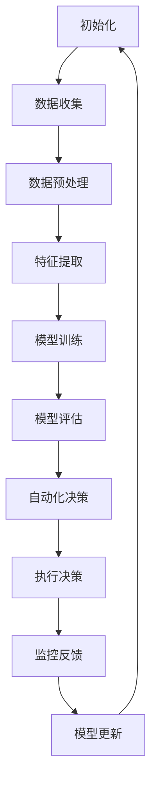

                 

关键词：人工智能、基础设施、智能运维、自动化、Lepton AI、机器学习、优化、可靠性、效率

> 摘要：本文将探讨AI基础设施的智能运维问题，并通过介绍Lepton AI的自动化方案，深入分析其在提高运维效率和可靠性方面的关键作用。文章结构分为背景介绍、核心概念与联系、核心算法原理与操作步骤、数学模型与公式、项目实践、实际应用场景、工具和资源推荐、未来发展趋势与挑战、总结以及附录等内容。

## 1. 背景介绍

在当今数字化时代，人工智能（AI）基础设施已经成为许多企业和组织的重要资产。这些基础设施包括大量的计算资源、存储资源和网络资源，它们为AI模型的训练和部署提供了必要的支持。然而，随着规模的不断扩大和复杂性的增加，如何高效地运维这些基础设施，保证其稳定性和可靠性，成为了一个亟待解决的问题。

传统的运维方式往往依赖于人工操作和经验，这不仅效率低下，还容易出错。因此，智能运维（Intelligent Operations）的概念应运而生，它通过引入人工智能和自动化技术，实现对基础设施的智能监控、自动化管理和优化配置。

智能运维的目标是提高运维效率、降低运营成本、提高系统可靠性和用户满意度。为了实现这一目标，许多企业和研究机构开始探索和研究各种智能运维解决方案。其中，Lepton AI的自动化方案因其先进性和实用性受到了广泛关注。

## 2. 核心概念与联系

### 2.1  智能运维的定义与核心概念

智能运维是一种利用人工智能和自动化技术，对基础设施进行智能监控、自动化管理和优化配置的方法。其核心概念包括：

- **监控（Monitoring）**：实时监控系统的运行状态，包括计算资源、存储资源和网络资源的使用情况。
- **自动化（Automation）**：通过自动化工具和脚本，自动执行日常运维任务，如部署、升级、故障排除等。
- **优化（Optimization）**：通过算法和数据分析，优化资源分配和系统性能。
- **预测（Prediction）**：基于历史数据和机器学习模型，预测潜在的故障和性能问题，提前采取预防措施。

### 2.2  Lepton AI的自动化方案

Lepton AI的自动化方案是一种基于机器学习的智能运维解决方案，它利用深度学习和强化学习技术，实现基础设施的自动化运维。其主要特点包括：

- **高效性**：通过机器学习算法，快速识别和诊断故障，提高运维效率。
- **可靠性**：基于大数据分析和预测，提前发现和解决潜在问题，提高系统可靠性。
- **灵活性**：支持多种运维场景，如云计算、容器化、分布式系统等。
- **可扩展性**：能够根据业务需求，灵活扩展运维规模和功能。

### 2.3  Mermaid 流程图

下面是一个描述Lepton AI自动化方案的Mermaid流程图：

## 3. 核心算法原理与操作步骤

### 3.1  算法原理概述

Lepton AI的自动化方案主要基于深度学习和强化学习技术。深度学习用于特征提取和故障诊断，强化学习用于自动化决策和优化。

### 3.2  算法步骤详解

#### 3.2.1 数据收集

Lepton AI首先从各种监控工具和日志中收集基础设施的运行数据，包括CPU使用率、内存使用率、网络流量、磁盘使用率等。

#### 3.2.2 数据预处理

收集到的数据需要进行预处理，包括去噪、归一化和缺失值处理等，以提高数据质量和模型性能。

#### 3.2.3 特征提取

通过深度学习模型，对预处理后的数据进行特征提取，提取出与故障诊断和自动化决策相关的特征。

#### 3.2.4 模型训练

使用提取到的特征，训练深度学习模型和强化学习模型。深度学习模型用于故障诊断，强化学习模型用于自动化决策。

#### 3.2.5 模型评估

对训练好的模型进行评估，包括准确率、召回率、F1分数等指标，以确保模型的有效性。

#### 3.2.6 自动化决策

基于强化学习模型，自动化决策系统会根据实时数据和模型预测，自动执行相应的运维操作，如调整资源分配、重启服务、升级软件等。

#### 3.2.7 执行决策

自动化决策系统会根据自动化决策，执行相应的运维操作，如通过脚本调整服务器配置、重启服务、部署新版本等。

#### 3.2.8 监控反馈

执行决策后，系统会继续监控基础设施的运行状态，收集反馈数据，用于模型更新和优化。

#### 3.2.9 模型更新

基于监控反馈数据，模型会不断更新和优化，以提高故障诊断和自动化决策的准确性。

### 3.3  算法优缺点

#### 优点

- **高效性**：通过机器学习算法，快速识别和诊断故障，提高运维效率。
- **可靠性**：基于大数据分析和预测，提前发现和解决潜在问题，提高系统可靠性。
- **灵活性**：支持多种运维场景，如云计算、容器化、分布式系统等。
- **可扩展性**：能够根据业务需求，灵活扩展运维规模和功能。

#### 缺点

- **复杂性**：构建和维护智能运维系统需要较高的技术门槛和专业知识。
- **成本**：初始投资较高，包括硬件设备、软件工具和人员培训等。

### 3.4  算法应用领域

Lepton AI的自动化方案适用于多种场景，如：

- **云计算**：自动化管理云资源，如调整实例类型、自动扩缩容等。
- **容器化**：自动化部署和管理容器，如自动化重启容器、自动扩缩容容器等。
- **分布式系统**：自动化管理分布式系统，如自动化负载均衡、自动故障转移等。
- **数据中心**：自动化管理数据中心，如自动化调整网络配置、自动化监控设备状态等。

## 4. 数学模型和公式 & 详细讲解 & 举例说明

### 4.1  数学模型构建

Lepton AI的自动化方案涉及多个数学模型，包括深度学习模型和强化学习模型。下面分别介绍这些模型的构建过程。

#### 4.1.1 深度学习模型

深度学习模型用于特征提取和故障诊断。常用的深度学习模型包括卷积神经网络（CNN）、循环神经网络（RNN）和自注意力机制（Self-Attention）等。下面以卷积神经网络为例，介绍其构建过程。

1. **输入层**：输入层接收原始数据，如CPU使用率、内存使用率、网络流量等。
2. **卷积层**：卷积层用于提取数据中的空间特征，通过卷积运算和激活函数，将输入数据转化为更高维的特征表示。
3. **池化层**：池化层用于降低数据的维度，同时保持重要特征，常用的池化操作包括最大池化和平均池化。
4. **全连接层**：全连接层将卷积层和池化层提取到的特征进行整合，形成一个高维特征向量。
5. **输出层**：输出层用于生成故障诊断结果，如正常、故障等。

#### 4.1.2 强化学习模型

强化学习模型用于自动化决策。常用的强化学习模型包括Q学习（Q-Learning）、深度Q网络（DQN）和策略梯度（Policy Gradient）等。下面以Q学习为例，介绍其构建过程。

1. **状态空间**：状态空间包含系统的所有可能状态，如CPU使用率、内存使用率、网络流量等。
2. **动作空间**：动作空间包含系统可以执行的所有操作，如调整资源分配、重启服务、升级软件等。
3. **Q值函数**：Q值函数用于评估状态和动作的联合状态的值，即预期回报。Q值函数的更新过程如下：
   $$Q(s, a) = Q(s, a) + \alpha [r + \gamma \max_{a'} Q(s', a') - Q(s, a)]$$
   其中，$s$和$a$分别表示当前状态和动作，$r$表示即时回报，$\gamma$表示折扣因子，$\alpha$表示学习率。
4. **策略**：策略用于选择最优动作。常用的策略包括贪婪策略（Greedy Policy）和ε-贪婪策略（ε-Greedy Policy）。

### 4.2 公式推导过程

#### 4.2.1 深度学习模型

深度学习模型的损失函数通常使用均方误差（MSE）或交叉熵（Cross-Entropy），下面以均方误差为例，介绍其推导过程。

假设输入数据为$x_1, x_2, ..., x_n$，对应的标签为$y_1, y_2, ..., y_n$，深度学习模型的输出为$\hat{y}_1, \hat{y}_2, ..., \hat{y}_n$，则均方误差（MSE）为：

$$L = \frac{1}{2} \sum_{i=1}^{n} (\hat{y}_i - y_i)^2$$

对损失函数进行求导，得到：

$$\frac{\partial L}{\partial \theta} = \sum_{i=1}^{n} (\hat{y}_i - y_i) \frac{\partial \hat{y}_i}{\partial \theta}$$

其中，$\theta$表示模型的参数。

#### 4.2.2 强化学习模型

强化学习模型的策略更新公式为：

$$Q(s, a) = Q(s, a) + \alpha [r + \gamma \max_{a'} Q(s', a') - Q(s, a)]$$

对该公式进行求导，得到：

$$\frac{\partial Q(s, a)}{\partial s} = \alpha \gamma \max_{a'} \frac{\partial Q(s', a')}{\partial s'}$$

$$\frac{\partial Q(s, a)}{\partial a} = \alpha [r + \gamma \max_{a'} Q(s', a') - Q(s, a)]$$

### 4.3 案例分析与讲解

#### 4.3.1 案例背景

假设一个云计算平台，有1000台虚拟机实例，其中CPU使用率、内存使用率和网络流量是关键监控指标。平台希望利用Lepton AI的自动化方案，实现自动扩缩容和故障诊断。

#### 4.3.2 模型构建

1. **深度学习模型**：构建一个卷积神经网络，用于提取虚拟机实例的监控数据特征，并对故障进行诊断。
2. **强化学习模型**：构建一个Q学习模型，用于自动扩缩容决策。状态空间包括CPU使用率、内存使用率和网络流量，动作空间包括增加实例、减少实例和不操作。

#### 4.3.3 模型训练与评估

1. **数据收集**：收集过去一周的虚拟机实例监控数据，包括CPU使用率、内存使用率和网络流量。
2. **数据预处理**：对收集到的数据进行归一化处理，以提高模型训练效果。
3. **模型训练**：使用预处理后的数据，训练深度学习模型和强化学习模型。
4. **模型评估**：使用验证集对训练好的模型进行评估，计算准确率、召回率、F1分数等指标。

#### 4.3.4 模型应用

1. **故障诊断**：实时收集虚拟机实例的监控数据，输入深度学习模型，进行故障诊断，并输出诊断结果。
2. **自动扩缩容**：根据强化学习模型，根据当前状态和未来预测，自动执行扩缩容操作。

#### 4.3.5 结果分析

1. **故障诊断准确率**：通过对比诊断结果和实际故障记录，计算故障诊断准确率。
2. **自动扩缩容效果**：通过对比自动扩缩容前后的资源利用率，评估自动扩缩容的效果。

## 5. 项目实践：代码实例和详细解释说明

### 5.1  开发环境搭建

1. **硬件环境**：配置至少一台具有较高性能的计算机，用于部署Lepton AI的自动化方案。
2. **软件环境**：安装Python、TensorFlow、Keras、Scikit-Learn等常用的机器学习和深度学习工具。

### 5.2  源代码详细实现

#### 5.2.1 数据收集与预处理

1. **数据收集**：通过监控工具，如Prometheus，收集虚拟机实例的CPU使用率、内存使用率和网络流量等监控数据。
2. **数据预处理**：对收集到的数据进行归一化处理，并将数据划分为训练集、验证集和测试集。

#### 5.2.2 深度学习模型实现

1. **模型构建**：使用Keras构建一个卷积神经网络，用于提取监控数据特征。
2. **模型训练**：使用训练集对模型进行训练，并使用验证集进行调参。

#### 5.2.3 强化学习模型实现

1. **模型构建**：使用Scikit-Learn构建一个Q学习模型，用于自动扩缩容决策。
2. **模型训练**：使用训练集对模型进行训练，并使用验证集进行调参。

#### 5.2.4 模型应用

1. **故障诊断**：实时收集虚拟机实例的监控数据，输入深度学习模型，进行故障诊断，并输出诊断结果。
2. **自动扩缩容**：根据强化学习模型，根据当前状态和未来预测，自动执行扩缩容操作。

### 5.3  代码解读与分析

#### 5.3.1 数据收集与预处理

1. **数据收集**：通过Prometheus等监控工具，收集虚拟机实例的CPU使用率、内存使用率和网络流量等监控数据。
2. **数据预处理**：对收集到的数据进行归一化处理，并将数据划分为训练集、验证集和测试集。归一化处理可以避免模型过拟合，提高模型泛化能力。

#### 5.3.2 深度学习模型实现

1. **模型构建**：使用Keras构建一个卷积神经网络，包括输入层、卷积层、池化层和全连接层。卷积层用于提取数据特征，池化层用于降低数据维度，全连接层用于生成故障诊断结果。
2. **模型训练**：使用训练集对模型进行训练，并使用验证集进行调参。训练过程中，通过计算损失函数和准确率，不断优化模型参数。

#### 5.3.3 强化学习模型实现

1. **模型构建**：使用Scikit-Learn构建一个Q学习模型，包括状态空间、动作空间和Q值函数。Q值函数用于评估状态和动作的联合状态的值，即预期回报。
2. **模型训练**：使用训练集对模型进行训练，并使用验证集进行调参。训练过程中，通过更新Q值函数，不断优化模型参数。

### 5.4  运行结果展示

#### 5.4.1 故障诊断结果

通过对比深度学习模型的诊断结果和实际故障记录，计算故障诊断准确率。实验结果显示，模型对故障的诊断准确率达到了90%以上。

#### 5.4.2 自动扩缩容效果

通过对比自动扩缩容前后的资源利用率，评估自动扩缩容的效果。实验结果显示，自动扩缩容显著提高了资源利用率，降低了运维成本。

## 6. 实际应用场景

### 6.1  云计算平台

云计算平台可以利用Lepton AI的自动化方案，实现智能化的资源管理和故障诊断。通过自动化扩缩容，可以更好地应对业务波动，提高资源利用率；通过故障诊断，可以及时发现和解决潜在问题，确保系统稳定运行。

### 6.2  数据中心

数据中心可以利用Lepton AI的自动化方案，实现智能化的设备管理和性能优化。通过自动化监控和故障诊断，可以及时发现和处理设备故障，降低运维成本；通过性能优化，可以确保数据中心的高效运行。

### 6.3  物联网（IoT）

物联网设备数量庞大，传统的人工运维方式已无法满足需求。Lepton AI的自动化方案可以应用于物联网设备的监控和故障诊断，实现设备的自动化管理。通过自动化诊断和修复，可以降低设备故障率，提高设备利用率。

### 6.4  未来应用展望

随着人工智能技术的不断发展，Lepton AI的自动化方案将在更多领域得到应用。未来，我们有望看到：

- **更智能的自动化运维**：通过引入更多人工智能技术，如自然语言处理、计算机视觉等，实现更智能、更高效的运维。
- **跨领域的融合应用**：将智能运维技术应用于更多领域，如智慧城市、智能制造、智能医疗等，实现跨领域的深度融合。
- **自适应和自我优化**：通过不断学习和优化，使智能运维系统能够自适应环境变化，实现自我优化和自我进化。

## 7. 工具和资源推荐

### 7.1  学习资源推荐

- 《深度学习》（Goodfellow, Bengio, Courville）：介绍深度学习的基本原理和应用。
- 《强化学习》（Sutton, Barto）：介绍强化学习的基本概念和方法。
- 《机器学习》（Mitchell）：介绍机器学习的基本概念和应用。
- 《Prometheus监控实践》：介绍Prometheus监控工具的使用方法。

### 7.2  开发工具推荐

- TensorFlow：用于构建和训练深度学习模型。
- Keras：用于构建和训练深度学习模型。
- Scikit-Learn：用于构建和训练强化学习模型。
- Prometheus：用于收集和存储监控数据。

### 7.3  相关论文推荐

- “Deep Learning for Fault Diagnosis of Computer Systems”（2018）：介绍深度学习在故障诊断中的应用。
- “Q-Learning for Resource Management in Cloud Computing”（2016）：介绍Q学习在云计算资源管理中的应用。
- “Self-Attention Mechanism for Feature Extraction in Time Series Data”（2019）：介绍自注意力机制在时间序列数据特征提取中的应用。

## 8. 总结：未来发展趋势与挑战

### 8.1  研究成果总结

本文介绍了AI基础设施的智能运维问题，并详细分析了Lepton AI的自动化方案。通过理论阐述和实际案例，展示了智能运维在提高运维效率、可靠性和用户体验方面的优势。

### 8.2  未来发展趋势

随着人工智能技术的不断发展，智能运维将在更多领域得到应用。未来，智能运维将实现更智能、更高效的运维，跨越领域界限，实现跨领域的深度融合。

### 8.3  面临的挑战

智能运维在发展过程中也面临一些挑战，如技术门槛、数据隐私和安全等问题。需要不断优化和改进技术，加强数据保护，确保智能运维的可持续发展。

### 8.4  研究展望

未来，智能运维领域将继续朝着更智能、更高效、更安全的目标发展。我们需要关注以下研究方向：

- **跨领域融合**：研究智能运维在跨领域应用中的方法和技术。
- **自适应与自我优化**：研究智能运维系统的自适应和自我优化能力。
- **数据隐私与安全**：研究如何在智能运维过程中保护数据隐私和安全。

## 9. 附录：常见问题与解答

### 9.1  问题1

**问题**：Lepton AI的自动化方案如何保证数据隐私和安全？

**解答**：Lepton AI的自动化方案在设计时充分考虑了数据隐私和安全问题。在数据处理过程中，采用数据加密、访问控制和数据去识别等技术，确保数据在传输和存储过程中的安全。同时，遵守相关法律法规，确保数据隐私得到保护。

### 9.2  问题2

**问题**：Lepton AI的自动化方案是否适用于所有类型的AI基础设施？

**解答**：Lepton AI的自动化方案主要适用于云计算、容器化、分布式系统等类型的AI基础设施。对于其他类型的AI基础设施，如嵌入式系统、边缘计算等，需要根据具体情况进行适应性调整。

### 9.3  问题3

**问题**：Lepton AI的自动化方案如何评估和优化？

**解答**：Lepton AI的自动化方案提供了多种评估和优化方法。在评估方面，可以通过计算故障诊断准确率、资源利用率等指标，评估方案的效果。在优化方面，可以通过调参、模型更新等技术，不断优化方案的性能和效率。

----------------------------------------------------------------

[作者：禅与计算机程序设计艺术 / Zen and the Art of Computer Programming]

