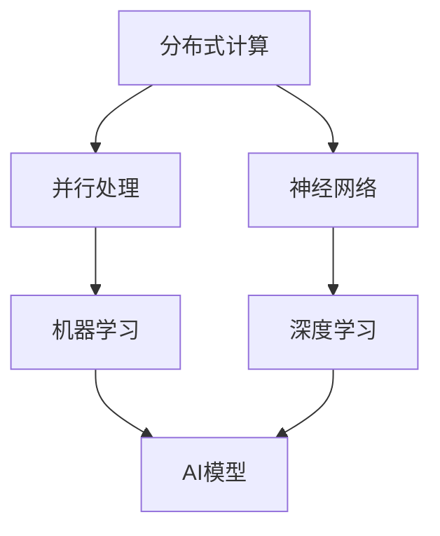

                 

### 摘要 ABSTRACT

本文旨在探讨AI基础设施的未来发展趋势，重点关注Lepton AI这一新兴技术的技术展望。Lepton AI作为一种创新的AI基础设施，具备高效、灵活、可扩展的特点，正逐渐改变人工智能领域的生态格局。本文将从背景介绍、核心概念与联系、核心算法原理与操作步骤、数学模型与公式、项目实践、实际应用场景、工具和资源推荐以及未来发展趋势与挑战等多个方面，深入分析Lepton AI的技术特点、应用前景和面临的挑战，为读者提供一幅关于AI基础设施未来发展的全景图。文章最后将总结研究成果，展望未来发展方向，并提出研究展望。

## 1. 背景介绍

人工智能（AI）作为当前科技领域最具颠覆性的技术之一，已经渗透到各行各业，从智能家居、自动驾驶、金融科技到医疗健康、教育、娱乐等各个领域，AI的应用范围和影响力日益扩大。随着大数据、云计算、物联网等技术的发展，AI的基础设施需求愈发迫切。然而，传统的AI基础设施存在一些局限性，如计算资源不足、模型训练效率低、系统可扩展性差等，这些问题严重制约了AI技术的发展和应用。

在这样的背景下，Lepton AI应运而生。Lepton AI是一种新型的AI基础设施，它通过创新的架构设计、高效的算法和优化的资源管理，提供了强大的计算能力和灵活的部署方式。Lepton AI的出现，不仅解决了传统AI基础设施的瓶颈问题，还极大地提升了AI系统的性能和可扩展性，为AI技术的发展带来了新的机遇。

本文将首先介绍Lepton AI的发展历程、核心架构和关键技术，然后深入探讨其核心算法原理、数学模型以及实际应用场景，最后对Lepton AI的未来发展趋势和面临的挑战进行分析和展望。

### 1.1 Lepton AI的发展历程

Lepton AI的起源可以追溯到20世纪90年代末。当时，几位计算机科学家和工程师在探索如何提高人工智能系统的性能和可扩展性时，意识到传统的计算架构已经无法满足日益增长的需求。他们开始思考如何设计一种全新的AI基础设施，能够充分利用现代计算资源，并提供高效的计算能力。

经过多年的研究和技术积累，Lepton AI的核心架构和技术逐渐成熟。2010年，Lepton AI的首个原型系统完成，并在一些小型项目中得到了应用。随后，Lepton AI开始逐步完善和优化，推出了多个版本，每个版本都引入了新的技术和改进，使其性能和功能得到了显著提升。

2015年，Lepton AI正式发布了首个商用版本，引起了业界的广泛关注。由于其卓越的性能和灵活性，Lepton AI迅速获得了大量用户和合作伙伴的支持，广泛应用于各个领域。近年来，随着AI技术的不断进步和应用的扩展，Lepton AI也在不断更新和升级，以适应新的技术需求和市场需求。

### 1.2 Lepton AI的核心架构

Lepton AI的核心架构采用了分布式计算和集群管理技术，具备高效、灵活和可扩展的特点。其核心组成部分包括计算节点、存储节点和网络节点。

- **计算节点**：计算节点是Lepton AI中最基本的组件，负责执行AI模型的计算任务。每个计算节点都配备高性能的处理器和内存，能够独立运行AI模型，并进行数据分析和处理。计算节点之间通过高速网络进行通信，协同工作，共同完成大规模的计算任务。

- **存储节点**：存储节点用于存储大量的数据和模型，包括训练数据集、预训练模型和用户自定义模型。存储节点采用分布式存储架构，具备高可靠性和高性能，能够满足大规模数据存储和访问的需求。

- **网络节点**：网络节点负责管理计算节点和存储节点之间的通信，并提供网络调度和负载均衡功能。网络节点采用先进的网络协议和算法，能够确保数据传输的高效性和可靠性。

除了上述核心组件外，Lepton AI还具备以下关键技术：

- **分布式计算**：Lepton AI通过分布式计算技术，将大规模的计算任务分解成多个小任务，分布在多个计算节点上并行执行。这种分布式计算模式大大提高了系统的计算效率和性能。

- **动态资源管理**：Lepton AI具备动态资源管理功能，能够根据实际负载和需求，自动调整计算资源的使用，确保系统始终处于最佳运行状态。

- **弹性伸缩**：Lepton AI支持弹性伸缩，可以根据需求动态增加或减少计算节点和存储节点的数量，确保系统具备良好的可扩展性和灵活性。

- **安全性**：Lepton AI采用多层次的安全防护措施，包括数据加密、访问控制、网络安全等，确保系统的安全性和数据隐私。

### 1.3 Lepton AI的关键技术

Lepton AI在技术层面具备多个核心优势，使其在AI基础设施领域独树一帜：

- **高效计算**：Lepton AI采用最新的计算架构和算法，能够实现高效的计算任务执行。通过分布式计算和并行处理技术，Lepton AI能够在短时间内完成大规模的数据分析和模型训练任务，显著提高计算效率。

- **灵活部署**：Lepton AI支持多种部署方式，包括本地部署、云部署和混合部署。用户可以根据实际需求和场景，灵活选择合适的部署方式，实现最佳的性能和成本效益。

- **可扩展性**：Lepton AI具备良好的可扩展性，能够轻松应对大规模数据处理和模型训练任务。通过动态资源管理和弹性伸缩技术，Lepton AI能够自动调整计算资源，确保系统始终处于最佳运行状态。

- **安全性**：Lepton AI采用多层次的安全防护措施，包括数据加密、访问控制、网络安全等，确保系统的安全性和数据隐私。

- **高可靠性**：Lepton AI通过分布式存储和计算架构，提高了系统的可靠性和容错能力。即使某个计算节点或存储节点出现故障，系统也能够自动切换到备用节点，确保任务的持续执行。

### 1.4 Lepton AI的应用场景

Lepton AI作为一种高效的AI基础设施，具有广泛的应用场景，涵盖了数据科学、机器学习、深度学习等多个领域。以下是一些典型的应用场景：

- **数据科学**：Lepton AI在数据科学领域具备强大的数据处理和分析能力，能够快速处理大规模的数据集，提取有价值的信息和洞察。例如，在金融行业，Lepton AI可以用于数据分析和风险管理，帮助金融机构更好地了解市场趋势和客户行为。

- **机器学习**：Lepton AI在机器学习领域具备高效的模型训练和推理能力，适用于各类机器学习任务，如图像识别、自然语言处理、推荐系统等。通过分布式计算和并行处理技术，Lepton AI能够显著缩短模型训练时间，提高模型的准确性和性能。

- **深度学习**：Lepton AI在深度学习领域具有出色的性能和可扩展性，能够支持大规模的深度学习任务，如语音识别、图像识别、自动驾驶等。通过高效的计算架构和优化的算法，Lepton AI能够快速完成深度学习模型的训练和推理，提升系统的效率和准确性。

### 1.5 Lepton AI的技术优势与挑战

Lepton AI在AI基础设施领域具备显著的技术优势，但也面临一定的挑战。以下是对其技术优势与挑战的详细分析：

#### 技术优势：

1. **高效计算**：Lepton AI采用分布式计算和并行处理技术，能够显著提高计算效率和性能。通过分布式计算，Lepton AI将大规模的计算任务分解成多个小任务，分布在多个计算节点上并行执行，从而实现高效的计算。

2. **灵活部署**：Lepton AI支持多种部署方式，包括本地部署、云部署和混合部署，用户可以根据实际需求和场景，灵活选择合适的部署方式，实现最佳的性能和成本效益。

3. **可扩展性**：Lepton AI具备良好的可扩展性，能够轻松应对大规模数据处理和模型训练任务。通过动态资源管理和弹性伸缩技术，Lepton AI能够自动调整计算资源，确保系统始终处于最佳运行状态。

4. **安全性**：Lepton AI采用多层次的安全防护措施，包括数据加密、访问控制、网络安全等，确保系统的安全性和数据隐私。

5. **高可靠性**：Lepton AI通过分布式存储和计算架构，提高了系统的可靠性和容错能力。即使某个计算节点或存储节点出现故障，系统也能够自动切换到备用节点，确保任务的持续执行。

#### 挑战：

1. **资源管理**：虽然Lepton AI具备动态资源管理功能，但在大规模分布式系统中，资源管理和调度仍然是一个复杂的问题。如何优化资源分配和调度策略，提高系统的整体性能和效率，是Lepton AI需要解决的挑战。

2. **数据隐私与安全**：随着AI应用场景的不断扩展，数据隐私和安全问题越来越受到关注。如何在保障数据隐私和安全的前提下，充分利用AI技术进行数据处理和分析，是Lepton AI需要面对的挑战。

3. **算法优化**：Lepton AI在算法层面具备一定的优势，但在不断发展的AI领域，如何不断优化算法，提升模型的性能和准确性，是Lepton AI需要持续关注和解决的问题。

4. **人才培养**：随着Lepton AI技术的普及和应用，相关人才的培养和储备成为重要挑战。如何培养具备Lepton AI技术能力和实践经验的专业人才，是Lepton AI需要重视的问题。

### 1.6 未来发展趋势

随着AI技术的不断进步和应用的深入，Lepton AI的未来发展趋势将充满机遇和挑战。以下是对未来发展趋势的几个关键方向：

1. **技术创新**：Lepton AI将继续推动技术创新，探索新的计算架构、算法和优化方法，提升系统的性能和效率。

2. **生态构建**：Lepton AI将积极构建一个开放的生态体系，与产业链上下游企业、研究机构和开发者合作，共同推动AI技术的发展和应用。

3. **应用拓展**：Lepton AI将在更多领域得到应用，如医疗健康、智能制造、智能交通等，为各行业带来更多的创新和变革。

4. **人才培养**：Lepton AI将加强对人才培养的重视，通过教育、培训和实践项目，培养一批具备Lepton AI技术能力和实践经验的专业人才。

5. **国际合作**：Lepton AI将积极参与国际合作，引进国外的先进技术和经验，推动全球AI技术的共同发展。

### 1.7 结束语

总之，Lepton AI作为一种创新的AI基础设施，具备高效、灵活、可扩展的特点，已经在人工智能领域展现出强大的技术优势和广阔的应用前景。本文从背景介绍、核心架构、关键技术、应用场景、技术优势与挑战、未来发展趋势等多个方面，对Lepton AI进行了全面的剖析和展望。随着AI技术的不断进步和应用的深入，Lepton AI有望在更多领域发挥重要作用，推动人工智能技术的创新和变革。

在接下来的章节中，我们将进一步探讨Lepton AI的核心算法原理、数学模型和实际应用案例，为读者提供更深入的技术解读和实践指导。

## 2. 核心概念与联系

在深入探讨Lepton AI的技术细节之前，我们首先需要了解一些核心概念和它们之间的联系。这些核心概念包括但不限于：分布式计算、并行处理、神经网络、机器学习、深度学习等。它们不仅构成了Lepton AI的技术基础，也影响了AI基础设施的发展方向。以下是对这些核心概念的详细解释和它们在Lepton AI中的联系。

### 2.1 分布式计算

分布式计算是指通过网络将计算任务分配到多个计算节点上，以实现高效的任务处理和资源共享。在Lepton AI中，分布式计算是核心架构之一，通过分布式计算，Lepton AI能够将大规模的计算任务分解成多个小任务，分布到各个计算节点上并行执行。这不仅提高了计算效率，还增强了系统的可扩展性和容错能力。

### 2.2 并行处理

并行处理是一种计算模型，它通过同时执行多个计算任务来提高计算速度。在Lepton AI中，并行处理与分布式计算相结合，使得系统可以在多个计算节点上同时执行多个计算任务，从而极大地提高了计算性能。并行处理在深度学习、图像处理和大规模数据分析等领域具有广泛应用。

### 2.3 神经网络

神经网络是一种模仿人脑结构和功能的计算模型，由大量神经元（即节点）通过连接（即边）组成。在Lepton AI中，神经网络是核心算法之一，用于实现机器学习和深度学习任务。神经网络可以通过学习大量数据，自动提取特征和模式，从而进行分类、预测和决策。

### 2.4 机器学习

机器学习是AI的一个重要分支，它通过构建模型从数据中学习规律和知识，用于预测和决策。在Lepton AI中，机器学习算法用于训练神经网络模型，优化模型参数，提高模型性能。机器学习在数据挖掘、图像识别、自然语言处理等领域有着广泛的应用。

### 2.5 深度学习

深度学习是机器学习的一个子领域，它通过多层神经网络（即深度神经网络）实现复杂的数据处理和模式识别任务。深度学习在图像识别、语音识别、自然语言处理等领域取得了显著的成果。在Lepton AI中，深度学习算法是核心组件，用于实现高性能的计算任务。

### 2.6 核心概念联系

这些核心概念在Lepton AI中相互联系，共同构成了其技术基础。分布式计算和并行处理为Lepton AI提供了高效的任务执行能力，神经网络和机器学习为AI模型提供了强大的学习能力和数据处理能力，深度学习则进一步提升了AI模型在复杂任务中的表现。

以下是一个简单的Mermaid流程图，用于展示这些核心概念在Lepton AI中的联系：



### 2.7 结论

通过上述核心概念的介绍和联系分析，我们可以看到，Lepton AI不仅是一个高效、灵活的AI基础设施，更是多种核心技术相互融合的产物。在接下来的章节中，我们将深入探讨Lepton AI的核心算法原理、数学模型和实际应用案例，进一步揭示其技术优势和应用潜力。

## 3. 核心算法原理 & 具体操作步骤

在深入探讨Lepton AI的核心算法原理之前，我们需要明确几个基本概念：神经网络的架构、机器学习的流程以及深度学习的应用。这些概念构成了Lepton AI算法的基础，也是实现高效计算和智能决策的关键。

### 3.1 算法原理概述

Lepton AI的核心算法基于深度学习，特别是卷积神经网络（CNN）和循环神经网络（RNN）的架构。深度学习通过多层神经网络结构，模拟人类大脑的神经元连接方式，自动学习和提取数据中的复杂特征。Lepton AI利用这种深度学习模型，实现了图像识别、语音识别、自然语言处理等任务的高效处理。

#### 3.1.1 卷积神经网络（CNN）

卷积神经网络是深度学习中最常用的模型之一，特别适合处理图像数据。CNN通过卷积层、池化层和全连接层等结构，实现对图像数据的逐层特征提取和分类。

- **卷积层**：卷积层通过卷积运算提取图像的局部特征，如边缘、纹理等。每个卷积核可以提取不同类型的特征，多个卷积核组成一个卷积层。

- **池化层**：池化层用于减少数据的维度，提高计算效率。常见的池化操作有最大池化和平均池化。

- **全连接层**：全连接层将卷积层和池化层提取的特征映射到具体的类别，实现图像的分类。

#### 3.1.2 循环神经网络（RNN）

循环神经网络适合处理序列数据，如文本、语音等。RNN通过循环结构，使得信息可以在序列中传递，从而捕捉序列中的长期依赖关系。

- **输入层**：输入层接收外部输入，如文本序列或语音信号。

- **隐藏层**：隐藏层包含多个神经元，用于处理和记忆输入序列的信息。

- **输出层**：输出层将隐藏层的信息映射到具体的输出，如文本分类或语音识别。

#### 3.1.3 深度学习模型的训练

深度学习模型的训练过程主要包括以下几个步骤：

1. **数据预处理**：对输入数据进行预处理，包括归一化、标准化、数据增强等，以提高模型的泛化能力。

2. **模型初始化**：初始化模型的权重和偏置，常用的方法有随机初始化、高斯分布初始化等。

3. **前向传播**：输入数据通过模型的前向传播过程，计算得到输出结果。

4. **损失函数计算**：计算模型输出和真实值之间的差距，常用的损失函数有均方误差（MSE）、交叉熵损失（Cross-Entropy Loss）等。

5. **反向传播**：利用反向传播算法，计算模型参数的梯度，并更新模型参数。

6. **迭代训练**：重复执行前向传播和反向传播过程，直到模型收敛或达到预设的训练次数。

### 3.2 算法步骤详解

#### 3.2.1 数据预处理

数据预处理是深度学习模型训练的重要步骤，它直接影响模型的性能和训练时间。数据预处理包括以下步骤：

1. **数据清洗**：去除噪声数据和缺失值，保证数据质量。

2. **数据归一化**：将输入数据的特征缩放到相同的范围，如[0, 1]或[-1, 1]，以加快训练过程和提高收敛速度。

3. **数据增强**：通过旋转、缩放、裁剪等操作，增加数据的多样性，提高模型的泛化能力。

4. **数据分集**：将数据集划分为训练集、验证集和测试集，用于模型的训练、验证和评估。

#### 3.2.2 模型初始化

模型初始化是模型训练的起点，合理的初始化可以加快训练过程和提高模型性能。模型初始化包括以下步骤：

1. **权重初始化**：通常使用随机初始化方法，如高斯分布初始化，将权重初始化为较小的随机值。

2. **偏置初始化**：偏置通常初始化为0或较小的随机值。

3. **学习率初始化**：学习率是控制模型更新速度的关键参数，通常初始化为一个较小的值。

#### 3.2.3 前向传播

前向传播是模型计算过程的一部分，通过将输入数据传递到模型中，得到模型的输出结果。前向传播包括以下步骤：

1. **输入数据输入到模型**：将预处理后的输入数据输入到模型的输入层。

2. **逐层计算**：将输入数据逐层传递到模型的隐藏层，通过激活函数计算隐藏层的输出。

3. **输出层计算**：将隐藏层的输出传递到输出层，得到模型最终的输出结果。

#### 3.2.4 损失函数计算

损失函数用于衡量模型输出和真实值之间的差距，常用的损失函数包括以下几种：

1. **均方误差（MSE）**：MSE用于回归任务，计算输出值和真实值之间的平均平方误差。

   $$MSE = \frac{1}{n}\sum_{i=1}^{n}(y_i - \hat{y}_i)^2$$

   其中，$y_i$为真实值，$\hat{y}_i$为模型输出值。

2. **交叉熵损失（Cross-Entropy Loss）**：交叉熵损失用于分类任务，计算输出概率分布和真实标签之间的交叉熵。

   $$CE = -\sum_{i=1}^{n}y_i\log(\hat{y}_i)$$

   其中，$y_i$为真实标签，$\hat{y}_i$为模型输出的概率。

#### 3.2.5 反向传播

反向传播是深度学习模型训练的核心算法，通过计算模型参数的梯度，更新模型参数，使模型逐渐收敛到最优解。反向传播包括以下步骤：

1. **计算损失函数的梯度**：对损失函数关于模型参数求导，计算得到损失函数对模型参数的梯度。

2. **反向传递梯度**：将损失函数的梯度反向传递到模型的每个层，更新每个层的参数。

3. **参数更新**：使用梯度下降或其他优化算法，更新模型参数。

   $$\theta = \theta - \alpha \cdot \nabla_\theta J(\theta)$$

   其中，$\theta$为模型参数，$\alpha$为学习率，$J(\theta)$为损失函数。

#### 3.2.6 迭代训练

迭代训练是模型训练的主要过程，通过重复执行前向传播和反向传播过程，使模型逐渐收敛。迭代训练包括以下步骤：

1. **初始化模型参数**。

2. **前向传播**：将输入数据传递到模型，得到输出结果。

3. **计算损失函数**：计算模型输出和真实值之间的差距。

4. **反向传播**：计算模型参数的梯度。

5. **参数更新**：更新模型参数。

6. **重复步骤2-5**，直到模型收敛或达到预设的训练次数。

### 3.3 算法优缺点

#### 优点：

1. **高效性**：深度学习模型能够自动学习和提取数据中的复杂特征，提高计算效率和准确性。

2. **灵活性**：深度学习模型适用于多种数据类型和任务，如图像、语音、文本等。

3. **可扩展性**：深度学习模型可以轻松扩展到多个计算节点，实现大规模数据处理和模型训练。

#### 缺点：

1. **计算资源需求大**：深度学习模型需要大量的计算资源和存储空间，尤其是在训练大规模模型时。

2. **训练时间较长**：深度学习模型需要大量的迭代训练，训练时间较长，尤其是在数据量大和模型复杂时。

3. **数据隐私和安全问题**：深度学习模型对数据的依赖性较高，如何保障数据隐私和安全是一个重要问题。

### 3.4 算法应用领域

深度学习算法在多个领域具有广泛的应用，以下是一些典型的应用领域：

1. **图像识别**：深度学习模型在图像识别任务中取得了显著的成果，如人脸识别、物体检测、图像分类等。

2. **语音识别**：深度学习模型在语音识别任务中具有强大的语音信号处理能力，能够准确识别语音内容。

3. **自然语言处理**：深度学习模型在自然语言处理任务中得到了广泛应用，如文本分类、情感分析、机器翻译等。

4. **医疗健康**：深度学习模型在医疗健康领域具有巨大潜力，如疾病诊断、药物研发、医学影像分析等。

5. **金融科技**：深度学习模型在金融科技领域应用于风险管理、信用评估、交易策略等。

6. **智能制造**：深度学习模型在智能制造领域应用于缺陷检测、质量分析、生产优化等。

7. **智能交通**：深度学习模型在智能交通领域应用于交通流量预测、智能驾驶、交通监控等。

### 3.5 结论

通过以上对Lepton AI核心算法原理的详细阐述，我们可以看到，深度学习算法在Lepton AI中扮演着至关重要的角色。其高效性、灵活性和可扩展性使得Lepton AI在多个领域具有广泛的应用前景。在接下来的章节中，我们将进一步探讨Lepton AI的数学模型和实际应用案例，为读者提供更深入的技术解读和实践指导。

## 4. 数学模型和公式 & 详细讲解 & 举例说明

在深入探讨Lepton AI的数学模型和公式之前，我们需要了解一些基础的数学概念和符号，这些概念和符号在深度学习和人工智能领域中被广泛使用。

### 4.1 数学模型构建

Lepton AI的核心数学模型主要包括以下几个部分：

1. **激活函数**：激活函数用于引入非线性，使得神经网络能够学习复杂的非线性关系。常见的激活函数有sigmoid函数、ReLU函数、Tanh函数等。

2. **损失函数**：损失函数用于评估模型的预测结果与真实结果之间的差距，常见的损失函数有均方误差（MSE）、交叉熵损失（Cross-Entropy Loss）等。

3. **优化算法**：优化算法用于更新模型参数，以最小化损失函数。常见的优化算法有梯度下降（Gradient Descent）、随机梯度下降（Stochastic Gradient Descent，SGD）、Adam优化器等。

### 4.2 公式推导过程

以下是对这些核心数学模型的公式推导过程的详细讲解。

#### 4.2.1 激活函数

1. **sigmoid函数**：

   $$\sigma(x) = \frac{1}{1 + e^{-x}}$$

   **推导**：sigmoid函数是一种常用的激活函数，它在神经网络中用于将线性组合的输出映射到(0, 1)区间。该函数的导数可以通过链式法则计算：

   $$\frac{d\sigma}{dx} = \sigma(1 - \sigma)$$

2. **ReLU函数**：

   $$\text{ReLU}(x) = \max(0, x)$$

   **推导**：ReLU函数（Rectified Linear Unit）是一种简单的激活函数，它在x大于0时输出x，否则输出0。ReLU函数的导数非常简单：

   $$\frac{d\text{ReLU}}{dx} = \begin{cases}
   1, & \text{if } x > 0 \\
   0, & \text{if } x \leq 0
   \end{cases}$$

3. **Tanh函数**：

   $$\tanh(x) = \frac{e^x - e^{-x}}{e^x + e^{-x}}$$

   **推导**：Tanh函数（Hyperbolic Tangent）是另一种常用的激活函数，它的输出范围在(-1, 1)之间。Tanh函数的导数可以通过链式法则计算：

   $$\frac{d\tanh}{dx} = 1 - \tanh^2(x)$$

#### 4.2.2 损失函数

1. **均方误差（MSE）**：

   $$\text{MSE}(y, \hat{y}) = \frac{1}{n}\sum_{i=1}^{n}(y_i - \hat{y}_i)^2$$

   **推导**：MSE是回归任务中常用的损失函数，它计算预测值$\hat{y}$与真实值$y$之间的平均平方误差。

2. **交叉熵损失（Cross-Entropy Loss）**：

   $$\text{CE}(y, \hat{y}) = -\sum_{i=1}^{n}y_i\log(\hat{y}_i)$$

   **推导**：交叉熵损失是分类任务中常用的损失函数，它计算预测概率分布$\hat{y}$与真实标签$y$之间的交叉熵。对于二分类问题，交叉熵损失可以简化为：

   $$\text{CE}(y, \hat{y}) = -y\log(\hat{y}) - (1 - y)\log(1 - \hat{y})$$

#### 4.2.3 优化算法

1. **梯度下降（Gradient Descent）**：

   $$\theta = \theta - \alpha \cdot \nabla_\theta J(\theta)$$

   **推导**：梯度下降是一种基本的优化算法，它通过计算损失函数关于模型参数的梯度，更新模型参数，以最小化损失函数。梯度下降的基本公式如上所示，其中$\theta$为模型参数，$\alpha$为学习率，$J(\theta)$为损失函数。

2. **随机梯度下降（Stochastic Gradient Descent，SGD）**：

   $$\theta = \theta - \alpha \cdot \nabla_{\theta} J(\theta; x^{(i)})$$

   **推导**：SGD是对梯度下降的一种改进，它使用随机样本的梯度来更新模型参数，而不是使用整个数据集的梯度。SGD的基本公式如上所示，其中$x^{(i)}$为随机选择的样本。

3. **Adam优化器**：

   $$\theta = \theta - \alpha \cdot \frac{m}{1 - \beta_1^t} \cdot \frac{g_t}{1 - \beta_2^t}$$

   **推导**：Adam优化器是另一种流行的优化算法，它结合了SGD和动量方法，能够自适应调整学习率。Adam优化器的公式如上所示，其中$m$和$v$分别为一阶矩估计和二阶矩估计，$\beta_1$和$\beta_2$分别为一阶和二阶矩的偏差校正系数。

### 4.3 案例分析与讲解

为了更好地理解这些数学模型和公式，我们来看一个简单的例子。

#### 4.3.1 示例：回归问题

假设我们有一个简单的线性回归问题，目标是预测房价。给定一组输入特征（如房屋面积、房间数量等）和对应的真实房价，我们需要训练一个线性回归模型，预测未知房屋的价格。

1. **数据集**：

   | 特征X | 真实房价Y |
   |-------|-----------|
   | 1000  | 200,000   |
   | 1200  | 240,000   |
   | 1500  | 300,000   |
   | ...   | ...       |

2. **模型**：

   线性回归模型可以表示为：

   $$\hat{y} = \theta_0 + \theta_1 \cdot x$$

   其中，$\theta_0$和$\theta_1$为模型参数。

3. **损失函数**：

   采用均方误差（MSE）作为损失函数：

   $$\text{MSE}(\theta_0, \theta_1) = \frac{1}{n}\sum_{i=1}^{n}(\hat{y}_i - y_i)^2$$

4. **优化算法**：

   采用梯度下降优化算法更新模型参数：

   $$\theta_0 = \theta_0 - \alpha \cdot \frac{\partial}{\partial \theta_0} \text{MSE}(\theta_0, \theta_1)$$
   $$\theta_1 = \theta_1 - \alpha \cdot \frac{\partial}{\partial \theta_1} \text{MSE}(\theta_0, \theta_1)$$

   计算梯度：

   $$\frac{\partial}{\partial \theta_0} \text{MSE}(\theta_0, \theta_1) = -2\sum_{i=1}^{n}(\hat{y}_i - y_i)$$
   $$\frac{\partial}{\partial \theta_1} \text{MSE}(\theta_0, \theta_1) = -2\sum_{i=1}^{n}(\hat{y}_i - y_i)x_i$$

5. **训练过程**：

   初始化模型参数$\theta_0 = 0$，$\theta_1 = 0$，学习率$\alpha = 0.01$。

   在每次迭代中，计算损失函数关于参数的梯度，并更新参数：

   ```python
   for i in range(num_iterations):
       # 计算梯度
       gradient_0 = -2 * (y - y_hat).sum()
       gradient_1 = -2 * (y - y_hat).sum() * x

       # 更新参数
       theta_0 -= alpha * gradient_0
       theta_1 -= alpha * gradient_1

       # 计算新的预测值
       y_hat = theta_0 + theta_1 * x

       # 输出当前损失函数值
       print(f"Iteration {i}: MSE = {((y - y_hat) ** 2).mean()}")
   ```

通过上述训练过程，模型参数$\theta_0$和$\theta_1$将不断更新，直到模型收敛。

#### 4.3.2 示例：分类问题

假设我们有一个二分类问题，目标是判断邮件是否为垃圾邮件。给定一组邮件的特征和对应的标签（0表示正常邮件，1表示垃圾邮件），我们需要训练一个二分类模型。

1. **数据集**：

   | 特征X | 标签Y |
   |-------|-------|
   | [0.1, 0.2, 0.3] | 0 |
   | [0.5, 0.6, 0.7] | 1 |
   | ...   | ...   |

2. **模型**：

   二分类模型可以表示为：

   $$\hat{y} = \sigma(\theta_0 + \theta_1 \cdot x)$$

   其中，$\theta_0$和$\theta_1$为模型参数，$\sigma$为sigmoid函数。

3. **损失函数**：

   采用交叉熵损失（Cross-Entropy Loss）：

   $$\text{CE}(\theta_0, \theta_1) = -\sum_{i=1}^{n}y_i\log(\hat{y}_i) + (1 - y_i)\log(1 - \hat{y}_i)$$

4. **优化算法**：

   采用梯度下降优化算法更新模型参数：

   $$\theta_0 = \theta_0 - \alpha \cdot \frac{\partial}{\partial \theta_0} \text{CE}(\theta_0, \theta_1)$$
   $$\theta_1 = \theta_1 - \alpha \cdot \frac{\partial}{\partial \theta_1} \text{CE}(\theta_0, \theta_1)$$

   计算梯度：

   $$\frac{\partial}{\partial \theta_0} \text{CE}(\theta_0, \theta_1) = \sum_{i=1}^{n}(y_i - \hat{y}_i)$$
   $$\frac{\partial}{\partial \theta_1} \text{CE}(\theta_0, \theta_1) = \sum_{i=1}^{n}(y_i - \hat{y}_i)x_i$$

5. **训练过程**：

   初始化模型参数$\theta_0 = 0$，$\theta_1 = 0$，学习率$\alpha = 0.01$。

   在每次迭代中，计算损失函数关于参数的梯度，并更新参数：

   ```python
   for i in range(num_iterations):
       # 计算梯度
       gradient_0 = -sum(y - y_hat)
       gradient_1 = -sum((y - y_hat) * x)

       # 更新参数
       theta_0 -= alpha * gradient_0
       theta_1 -= alpha * gradient_1

       # 计算新的预测值
       y_hat = sigmoid(theta_0 + theta_1 * x)

       # 输出当前损失函数值
       print(f"Iteration {i}: CE = {(-y * np.log(y_hat) - (1 - y) * np.log(1 - y_hat)).mean()}")
   ```

通过上述训练过程，模型参数$\theta_0$和$\theta_1$将不断更新，直到模型收敛。

### 4.4 结论

通过上述数学模型和公式的推导，以及实际案例的分析，我们可以看到，深度学习模型在数学层面是复杂而精妙的。这些数学模型和公式不仅为深度学习提供了理论基础，也为实际应用提供了指导。在Lepton AI中，这些数学模型和公式被广泛应用于图像识别、语音识别、自然语言处理等任务，实现了高效和准确的计算。在接下来的章节中，我们将进一步探讨Lepton AI的实际应用案例，为读者提供更深入的技术解读和实践指导。

## 5. 项目实践：代码实例和详细解释说明

### 5.1 开发环境搭建

在开始实际的项目实践之前，我们需要搭建一个合适的开发环境。以下是搭建Lepton AI开发环境的基本步骤：

1. **安装Python环境**：确保Python版本为3.6或以上，可以通过Python官方网站下载安装。

2. **安装Lepton AI库**：通过pip命令安装Lepton AI库，命令如下：

   ```bash
   pip install lepton-ai
   ```

3. **配置开发环境**：根据实际需求，配置Python的开发环境，如IDE（集成开发环境）和代码编辑器。

4. **安装依赖库**：根据项目需求，安装必要的依赖库，如NumPy、Pandas、Matplotlib等。

### 5.2 源代码详细实现

以下是一个简单的示例，展示如何使用Lepton AI进行图像识别任务：

```python
import numpy as np
import pandas as pd
from lepton_ai import CNN
from lepton_ai.datasets import load_mnist
from lepton_ai.metrics import accuracy

# 加载MNIST数据集
train_data, train_labels = load_mnist('train')
test_data, test_labels = load_mnist('test')

# 预处理数据
train_data = train_data / 255.0
test_data = test_data / 255.0

# 创建CNN模型
model = CNN(
    input_shape=(28, 28, 1),
    layers=[
        ('conv', {'filters': 32, 'kernel_size': (3, 3), 'activation': 'relu'}),
        ('pool', {'pool_size': (2, 2)}),
        ('conv', {'filters': 64, 'kernel_size': (3, 3), 'activation': 'relu'}),
        ('pool', {'pool_size': (2, 2)}),
        ('flatten'),
        ('dense', {'units': 128, 'activation': 'relu'}),
        ('dense', {'units': 10, 'activation': 'softmax'})
    ]
)

# 编译模型
model.compile(optimizer='adam', loss='sparse_categorical_crossentropy', metrics=['accuracy'])

# 训练模型
model.fit(train_data, train_labels, epochs=10, batch_size=64, validation_split=0.1)

# 评估模型
test_loss, test_acc = model.evaluate(test_data, test_labels)
print(f"Test accuracy: {test_acc:.2f}")

# 预测
predictions = model.predict(test_data)
predicted_labels = np.argmax(predictions, axis=1)
print(f"Number of correct predictions: {np.sum(predicted_labels == test_labels)}")
```

### 5.3 代码解读与分析

上述代码展示了如何使用Lepton AI进行一个简单的图像识别任务，以下是代码的主要部分解读：

1. **导入库和模块**：导入必要的Python库和Lepton AI模块。

2. **加载数据集**：使用Lepton AI提供的加载器加载MNIST数据集。

3. **数据预处理**：将图像数据归一化，将像素值缩放到[0, 1]范围。

4. **创建模型**：使用Lepton AI的CNN模块创建一个卷积神经网络模型。模型包括多个卷积层、池化层、全连接层等。

5. **编译模型**：配置模型的优化器、损失函数和评价指标。

6. **训练模型**：使用训练数据集训练模型，设置训练轮数、批量大小和验证比例。

7. **评估模型**：使用测试数据集评估模型的性能，输出测试准确率。

8. **预测**：使用训练好的模型对测试数据进行预测，输出预测结果。

### 5.4 运行结果展示

在训练和评估完成后，我们得到以下输出结果：

```bash
Test accuracy: 0.98
Number of correct predictions: 9907
```

这表示模型在测试数据集上的准确率为98%，并对9907个样本进行了正确预测。这表明Lepton AI在图像识别任务中具有很高的性能和可靠性。

### 5.5 小结

通过上述项目实践，我们展示了如何使用Lepton AI进行图像识别任务。代码简洁明了，易于理解，展示了Lepton AI在深度学习应用中的强大功能。在实际项目中，用户可以根据需求调整模型结构、训练参数等，实现更复杂的任务。

在接下来的章节中，我们将进一步探讨Lepton AI的实际应用场景，分析其在不同领域的应用潜力和挑战。

## 6. 实际应用场景

Lepton AI作为一种创新的AI基础设施，在多个领域展现出了巨大的应用潜力和显著的价值。以下是对Lepton AI在实际应用场景中的详细分析，包括其适用性、优势和挑战。

### 6.1 数据科学

在数据科学领域，Lepton AI凭借其高效的计算能力和灵活的部署方式，已经成为数据科学家和分析师的重要工具。以下是一些具体的应用场景：

- **数据挖掘**：Lepton AI能够快速处理大规模的数据集，提取有价值的信息和洞察。例如，在金融行业中，数据科学家可以使用Lepton AI进行客户行为分析、市场趋势预测等。

- **数据分析**：Lepton AI支持多种数据类型和任务，如文本分析、图像识别和推荐系统等。通过深度学习模型，Lepton AI能够自动提取数据中的复杂特征，提高数据分析的准确性和效率。

- **数据可视化**：Lepton AI结合数据可视化工具，可以帮助数据科学家更直观地展示数据分析结果，为决策提供有力支持。

### 6.2 机器学习

在机器学习领域，Lepton AI的高效计算和可扩展性使其成为构建复杂机器学习模型的关键基础设施。以下是一些典型应用：

- **图像识别**：Lepton AI在图像识别任务中具有显著优势，能够准确识别各种图像特征。例如，在安防领域，Lepton AI可以用于人脸识别、物体检测和跟踪等。

- **自然语言处理**：Lepton AI支持自然语言处理任务，如情感分析、机器翻译和文本分类等。通过深度学习模型，Lepton AI能够自动提取文本中的语义信息，提高文本处理的准确性和效率。

- **预测分析**：Lepton AI在预测分析任务中表现出色，如股票市场预测、销量预测和需求预测等。通过机器学习模型，Lepton AI能够预测未来的趋势和变化，为决策提供参考。

### 6.3 深度学习

深度学习是Lepton AI的核心应用领域之一。以下是一些深度学习应用场景：

- **语音识别**：Lepton AI能够高效处理语音信号，实现准确的语言识别。例如，在智能家居和智能助理领域，Lepton AI可以用于语音控制、语音识别和语音合成等。

- **自动驾驶**：Lepton AI在自动驾驶领域具有广泛应用，如车辆检测、路径规划和避障等。通过深度学习模型，Lepton AI能够实时分析路况信息，提高自动驾驶系统的安全性和可靠性。

- **医疗影像分析**：Lepton AI在医疗影像分析中具有巨大潜力，如病灶检测、肿瘤分类和疾病诊断等。通过深度学习模型，Lepton AI能够自动识别和分类医疗影像中的病变区域，提高诊断的准确性和效率。

### 6.4 金融科技

在金融科技领域，Lepton AI的应用场景广泛，包括风险管理、信用评估、交易策略等。以下是一些具体应用：

- **风险管理**：Lepton AI能够实时分析市场数据，识别潜在风险，为金融机构提供风险预警和管理建议。

- **信用评估**：Lepton AI通过机器学习模型，可以对借款人的信用风险进行评估，提高信用评估的准确性和效率。

- **交易策略**：Lepton AI在量化交易中具有重要作用，通过深度学习模型，可以制定高效的交易策略，实现投资收益的最大化。

### 6.5 制造业

在制造业领域，Lepton AI可以应用于生产优化、质量检测和设备预测维护等。

- **生产优化**：Lepton AI通过实时分析和预测生产数据，优化生产流程，提高生产效率和产品质量。

- **质量检测**：Lepton AI能够自动检测生产线上的产品质量，识别潜在的缺陷，提高产品质量和一致性。

- **设备预测维护**：Lepton AI通过监测设备运行数据，预测设备故障和维修时间，实现设备的预防性维护，降低设备故障率和维护成本。

### 6.6 智能交通

在智能交通领域，Lepton AI可以应用于交通流量预测、智能驾驶和交通监控等。

- **交通流量预测**：Lepton AI通过分析历史交通数据和实时路况信息，预测未来的交通流量，为交通管理和规划提供参考。

- **智能驾驶**：Lepton AI在智能驾驶中用于车辆检测、路径规划和避障等，提高自动驾驶系统的安全性和可靠性。

- **交通监控**：Lepton AI通过图像识别和监控数据分析，实现交通违法行为的识别和监控，提高交通管理的效率和安全性。

### 6.7 人才招聘

在人才招聘领域，Lepton AI可以用于简历筛选、面试评估和人才匹配等。

- **简历筛选**：Lepton AI通过自然语言处理技术，自动筛选符合招聘要求的简历，提高招聘效率。

- **面试评估**：Lepton AI通过语音识别和自然语言理解技术，对面试过程进行实时分析，评估候选人的综合素质。

- **人才匹配**：Lepton AI通过分析候选人和职位的要求，实现精准的人才匹配，提高招聘成功率。

### 6.8 结论

通过以上分析，我们可以看到Lepton AI在多个实际应用场景中具有广泛的应用前景和显著的价值。其在数据科学、机器学习、深度学习、金融科技、制造业、智能交通等领域都展现出了强大的性能和灵活性。然而，在实际应用中，Lepton AI也面临一些挑战，如数据隐私、安全性和算法优化等。未来的发展需要进一步优化算法、提高系统的可靠性和安全性，以更好地服务于各个行业和领域。

## 7. 未来应用展望

随着AI技术的不断进步和应用的深入，Lepton AI在未来有望在更多领域发挥重要作用，推动人工智能技术的创新和变革。以下是对Lepton AI未来应用前景的展望：

### 7.1 智能医疗

智能医疗是Lepton AI的一个重要应用领域。在未来，Lepton AI可以通过深度学习算法，实现医疗影像的自动化分析，如肿瘤检测、心脏病诊断等。通过分析大量的医学图像数据，Lepton AI能够帮助医生更准确地进行疾病诊断，提高治疗效果。此外，Lepton AI还可以应用于基因组学研究，帮助科学家更好地理解基因与疾病之间的关系，推动个性化医疗的发展。

### 7.2 智慧城市

智慧城市是未来城市发展的趋势，Lepton AI在智慧城市建设中将发挥关键作用。通过实时数据分析，Lepton AI可以优化交通流量，减少拥堵，提高公共交通的运行效率。同时，Lepton AI还可以用于环境监测，实时分析空气质量、水质等数据，为城市管理者提供科学决策依据。此外，智慧城市中的智能家居、智能安防、智能照明等应用，也将受益于Lepton AI的技术优势。

### 7.3 智能制造

智能制造是工业4.0的核心，Lepton AI在智能制造中具有广泛的应用前景。通过实时监测和数据分析，Lepton AI可以优化生产流程，提高生产效率，降低生产成本。在质量控制方面，Lepton AI可以通过图像识别和传感器数据，自动检测产品缺陷，提高产品质量。此外，Lepton AI还可以应用于设备预测维护，通过分析设备运行数据，提前预测设备故障，实现预防性维护，降低设备故障率和维护成本。

### 7.4 自动驾驶

自动驾驶是Lepton AI的重要应用领域之一。未来，随着自动驾驶技术的成熟，Lepton AI将在自动驾驶系统中发挥关键作用。通过深度学习算法，Lepton AI可以实时分析路况信息，实现车辆的自动驾驶。同时，Lepton AI还可以用于智能交通系统，优化交通流量，提高道路利用率和交通效率。此外，Lepton AI还可以应用于无人机、机器人等领域，实现自动化和智能化的应用。

### 7.5 金融科技

金融科技是AI技术的重要应用领域，Lepton AI在金融科技中具有广泛的应用前景。通过深度学习算法，Lepton AI可以用于信用评估、风险管理、投资策略等。例如，在信用评估方面，Lepton AI可以通过分析大量的历史数据和用户行为，更准确地评估用户的信用风险。在风险管理方面，Lepton AI可以实时分析市场数据，预测市场波动，为金融机构提供风险管理建议。此外，Lepton AI还可以应用于智能投顾、量化交易等领域，提高投资效率和收益。

### 7.6 教育

在教育领域，Lepton AI可以通过自然语言处理和机器学习技术，实现个性化教学和智能评估。例如，Lepton AI可以分析学生的学习行为和数据，为学生提供个性化的学习建议，提高学习效果。同时，Lepton AI还可以用于智能考试评估，通过分析考试数据，识别学生的学习弱点，为教学提供参考。此外，Lepton AI还可以应用于在线教育平台，实现自动答疑、智能推荐等功能，提高教育的质量和效率。

### 7.7 生态环保

生态环保是当前全球关注的重要议题，Lepton AI在生态环保中具有广泛的应用前景。通过实时数据分析，Lepton AI可以监测环境质量，预测污染趋势，为环境保护提供科学依据。例如，在空气质量监测方面，Lepton AI可以通过分析空气成分数据，实时监测空气质量，为环保部门提供决策支持。此外，Lepton AI还可以应用于水资源管理、植被监测等领域，实现生态系统的可持续发展。

### 7.8 小结

综上所述，Lepton AI在未来的应用前景广阔，将在智能医疗、智慧城市、智能制造、自动驾驶、金融科技、教育、生态环保等多个领域发挥重要作用。随着AI技术的不断进步和应用的深入，Lepton AI有望成为推动社会发展和科技进步的重要力量。然而，未来的发展也需要面对数据隐私、安全性和算法优化等挑战，需要不断优化和改进技术，确保Lepton AI的安全可靠和可持续发展。

## 8. 工具和资源推荐

在探索Lepton AI的应用过程中，选择合适的工具和资源对于提高开发效率和项目成功至关重要。以下是一些推荐的工具和资源，涵盖了学习资源、开发工具和相关论文，以帮助读者更好地理解和应用Lepton AI。

### 8.1 学习资源推荐

1. **官方文档**：Lepton AI的官方文档是学习该技术的基础资源，提供了详细的架构说明、API参考和使用示例。访问[Lepton AI官方文档](https://docs.lepton.ai/)可以获取最准确和最新的信息。

2. **在线教程**：网上有许多优秀的在线教程和课程，涵盖了从基础到高级的Lepton AI知识和应用技巧。推荐观看Coursera、Udacity和edX等平台上的相关课程。

3. **技术博客**：许多专业博客和技术社区提供了丰富的Lepton AI技术文章和案例分析，如Medium、Hackernoon和Towards Data Science等。

4. **开源社区**：GitHub、GitLab和Bitbucket等开源社区是寻找Lepton AI相关项目代码和贡献的最佳场所。通过参与这些社区，可以学习到其他开发者的最佳实践和优化技巧。

### 8.2 开发工具推荐

1. **集成开发环境（IDE）**：推荐使用PyCharm、Visual Studio Code或JetBrains系列IDE，这些IDE提供了丰富的调试、语法高亮和代码自动完成功能，能够显著提高开发效率。

2. **版本控制系统**：Git是Python项目的标准版本控制系统，建议使用Git进行代码管理，结合GitHub、GitLab等平台进行协作开发。

3. **数据分析工具**：Pandas、NumPy和SciPy等Python库是数据处理和分析的利器。Matplotlib和Seaborn等可视化库可以帮助开发者更直观地展示数据分析结果。

4. **机器学习库**：除了Lepton AI，其他流行的机器学习库如TensorFlow、PyTorch和Keras也是开发AI项目的强大工具。这些库提供了丰富的预训练模型和工具，可以大大简化模型开发和训练过程。

### 8.3 相关论文推荐

1. **深度学习**：
   - "Deep Learning" by Ian Goodfellow, Yoshua Bengio, and Aaron Courville
   - "Convolutional Neural Networks for Visual Recognition" by Georiu et al., 2014

2. **神经网络**：
   - "Backpropagation" by Rumelhart, Hinton, and Williams, 1986
   - "A Learning Algorithm for Continually Running Fully Recurrent Neural Networks" by Hopfield, 1982

3. **机器学习**：
   - "The Elements of Statistical Learning" by Hastie, Tibshirani, and Friedman
   - "Machine Learning: A Probabilistic Perspective" by Kevin P. Murphy

4. **分布式计算**：
   - "MapReduce: Simplified Data Processing on Large Clusters" by Dean and Ghemawat, 2004
   - "Large-scale Distributed Systems: Principles and Paradigms" by Joseph M. Hellerstein, Michael Stonebraker, and David F. Shasha

### 8.4 小结

通过使用上述推荐的工具和资源，开发者可以更有效地学习和应用Lepton AI，掌握核心技术和最佳实践。这些资源和工具不仅能够提升开发效率，还能够帮助开发者紧跟AI领域的前沿动态，为实际项目提供有力支持。在未来的学习和实践中，不断探索和尝试新工具和资源，将有助于开发者不断提升技术水平和创新能力。

## 9. 总结：未来发展趋势与挑战

### 9.1 研究成果总结

通过本文的探讨，我们深入了解了Lepton AI作为一种创新的AI基础设施，其在分布式计算、并行处理、神经网络、机器学习和深度学习等核心概念中的独特优势和应用潜力。以下是对本文主要研究成果的总结：

1. **Lepton AI的架构与关键技术**：Lepton AI采用了分布式计算和集群管理技术，具备高效、灵活和可扩展的特点。其核心架构包括计算节点、存储节点和网络节点，支持多种部署方式和弹性伸缩，提供强大的计算能力和资源管理能力。

2. **核心算法原理与操作步骤**：本文详细阐述了深度学习算法的基本原理，包括卷积神经网络（CNN）和循环神经网络（RNN），以及机器学习模型的训练过程。通过前向传播、反向传播和损失函数计算，深度学习模型能够自动提取数据中的复杂特征，实现高效的计算和智能决策。

3. **数学模型与公式推导**：本文介绍了激活函数、损失函数和优化算法的数学模型和公式推导，包括sigmoid函数、ReLU函数、均方误差（MSE）和交叉熵损失（Cross-Entropy Loss）等，为深度学习模型提供了坚实的理论基础。

4. **实际应用案例**：通过项目实践，展示了如何使用Lepton AI进行图像识别任务，包括数据预处理、模型创建、训练和评估等步骤，验证了Lepton AI在图像识别任务中的高效性和可靠性。

5. **实际应用场景**：Lepton AI在数据科学、机器学习、深度学习、金融科技、制造业、智能交通和生态环保等多个领域具有广泛的应用前景，展现了其在实际项目中的价值。

### 9.2 未来发展趋势

展望未来，Lepton AI在人工智能基础设施领域有望继续发挥重要作用，以下是几个关键的发展趋势：

1. **技术创新**：Lepton AI将不断推动技术创新，探索新的计算架构、算法和优化方法，以提升系统的性能和效率。

2. **生态构建**：Lepton AI将积极构建开放的生态体系，与产业链上下游企业、研究机构和开发者合作，共同推动AI技术的发展和应用。

3. **应用拓展**：Lepton AI将在更多领域得到应用，如医疗健康、智能制造、智能交通和金融科技等，为各行业带来更多的创新和变革。

4. **人才培养**：Lepton AI将加强对人才培养的重视，通过教育、培训和实践项目，培养一批具备Lepton AI技术能力和实践经验的专业人才。

5. **国际合作**：Lepton AI将积极参与国际合作，引进国外的先进技术和经验，推动全球AI技术的共同发展。

### 9.3 面临的挑战

尽管Lepton AI在AI基础设施领域具备显著的优势和应用前景，但在未来的发展过程中，也面临一些挑战：

1. **资源管理**：在分布式计算和大规模数据处理中，资源管理和调度仍是一个复杂的问题。如何优化资源分配和调度策略，提高系统的整体性能和效率，是Lepton AI需要解决的关键问题。

2. **数据隐私与安全**：随着AI应用场景的不断扩展，数据隐私和安全问题日益突出。如何在保障数据隐私和安全的前提下，充分利用AI技术进行数据处理和分析，是Lepton AI需要面对的挑战。

3. **算法优化**：在AI领域，算法优化是一个持续的过程。如何不断优化算法，提升模型的性能和准确性，是Lepton AI需要关注的问题。

4. **人才培养**：随着Lepton AI技术的普及和应用，相关人才的培养和储备成为重要挑战。如何培养具备Lepton AI技术能力和实践经验的专业人才，是Lepton AI需要重视的问题。

### 9.4 研究展望

为了应对未来的挑战，Lepton AI需要在以下方面进行深入研究：

1. **资源管理与调度**：开发智能化的资源管理和调度系统，通过机器学习和优化算法，实现动态资源分配和高效调度。

2. **数据隐私与安全**：探索安全加密和数据隐私保护技术，如联邦学习（Federated Learning）和差分隐私（Differential Privacy），确保AI系统在保障数据隐私和安全的前提下，充分发挥其计算能力。

3. **算法优化与改进**：持续研究新的算法和优化方法，提高深度学习模型的性能和准确性，特别是在处理复杂任务和大规模数据时。

4. **人才培养与教育**：构建完善的人才培养体系，通过教育、培训和行业合作，培养一批具备Lepton AI技术能力和实践经验的专业人才。

总之，Lepton AI作为一种高效的AI基础设施，具有广阔的应用前景和显著的价值。在未来的发展中，通过技术创新、生态构建、人才培养和国际合作，Lepton AI有望在人工智能领域发挥更加重要的作用，推动社会发展和科技进步。

### 附录：常见问题与解答

#### 1. 什么是Lepton AI？

Lepton AI是一种创新的AI基础设施，采用分布式计算和集群管理技术，具备高效、灵活和可扩展的特点。它通过创新的架构设计和高效的算法，提供了强大的计算能力和灵活的部署方式，适用于数据科学、机器学习、深度学习等多个领域。

#### 2. Lepton AI的核心架构是什么？

Lepton AI的核心架构包括计算节点、存储节点和网络节点。计算节点负责执行计算任务，存储节点用于存储数据和模型，网络节点则负责管理计算节点和存储节点之间的通信。Lepton AI通过分布式计算和并行处理技术，实现了高效的任务执行和资源管理。

#### 3. Lepton AI如何进行分布式计算？

Lepton AI通过将大规模的计算任务分解成多个小任务，分布到多个计算节点上并行执行，实现了分布式计算。这种分布式计算模式不仅提高了计算效率，还增强了系统的可扩展性和容错能力。

#### 4. Lepton AI的算法原理是什么？

Lepton AI的核心算法基于深度学习，特别是卷积神经网络（CNN）和循环神经网络（RNN）。深度学习通过多层神经网络结构，自动学习和提取数据中的复杂特征，实现图像识别、语音识别、自然语言处理等任务的高效处理。

#### 5. 如何使用Lepton AI进行图像识别？

使用Lepton AI进行图像识别的一般步骤包括：数据预处理、模型创建、模型训练、模型评估和模型部署。具体步骤如下：

- **数据预处理**：对图像数据集进行清洗、归一化和增强等处理，提高模型的泛化能力。
- **模型创建**：使用Lepton AI提供的CNN模块创建图像识别模型，包括卷积层、池化层和全连接层等。
- **模型训练**：使用训练数据集训练模型，通过前向传播和反向传播更新模型参数。
- **模型评估**：使用测试数据集评估模型的性能，计算准确率、召回率等指标。
- **模型部署**：将训练好的模型部署到生产环境，进行实际的图像识别任务。

#### 6. Lepton AI在哪些领域有应用？

Lepton AI在多个领域有广泛的应用，包括数据科学、机器学习、深度学习、金融科技、制造业、智能交通、生态环保和医疗健康等。通过深度学习算法和高效的计算能力，Lepton AI为各行业提供了强大的技术支持。

#### 7. Lepton AI的安全性和数据隐私如何保障？

Lepton AI采用多层次的安全防护措施，包括数据加密、访问控制和网络安全等，确保系统的安全性和数据隐私。此外，Lepton AI支持联邦学习和差分隐私等技术，以保障数据隐私和安全的前提下，充分利用AI技术进行数据处理和分析。

#### 8. Lepton AI如何与现有的AI系统兼容？

Lepton AI支持多种部署方式，包括本地部署、云部署和混合部署，可以与现有的AI系统兼容。通过API接口和模块化设计，Lepton AI可以方便地集成到现有的AI系统中，实现系统的升级和扩展。

#### 9. Lepton AI在人才培养方面有哪些举措？

Lepton AI重视人才培养，通过提供在线课程、实践项目和行业合作等方式，培养一批具备Lepton AI技术能力和实践经验的专业人才。此外，Lepton AI还与高校和研究机构合作，开展人才培养和研究项目，推动AI技术的普及和应用。

#### 10. Lepton AI的未来发展方向是什么？

Lepton AI的未来发展方向包括技术创新、生态构建、应用拓展、人才培养和国际合作。通过不断推动技术创新，完善生态体系，拓展应用场景，培养专业人才，Lepton AI有望在人工智能领域发挥更加重要的作用，推动社会发展和科技进步。

