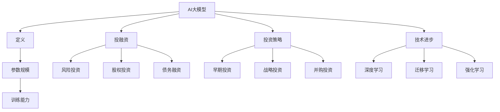

                 

关键词：AI大模型，投融资，创业，趋势，技术进步

> 摘要：本文旨在探讨AI大模型创业领域的投融资新趋势，分析当前市场的热点项目、投资策略以及技术进步对创业环境的影响。通过对行业现状的深入剖析，揭示未来发展的潜在机遇与挑战。

## 1. 背景介绍

随着人工智能技术的迅猛发展，大模型成为当前AI领域的核心驱动力。无论是自然语言处理、计算机视觉，还是推荐系统，大模型的应用不断拓展，带来了前所未有的计算能力与创新潜力。与此同时，创业领域对AI大模型的热情也日益高涨，越来越多的初创企业涌现，纷纷投身于这一前沿领域。

投融资市场对AI大模型领域的关注也在持续升温。风险投资、股权投资等多元化融资方式为AI创业公司提供了强大的资金支持，助力其研发和成长。本文将分析这些融资活动的特点与趋势，为读者提供一窥未来市场的窗口。

## 2. 核心概念与联系

在探讨AI大模型创业的投融资新趋势之前，我们首先需要了解几个核心概念。

### 2.1 大模型定义

大模型通常指的是具有数亿至数千亿参数的神经网络模型，其规模远超传统模型。它们能够在大量的数据上进行训练，从而实现较高的准确性和泛化能力。

### 2.2 投融资概念

投融资是指企业通过引入外部资金来支持其运营和发展，包括风险投资、股权投资、债务融资等多种形式。在AI大模型创业领域，这些资金主要用于技术研发、团队建设、市场拓展等方面。

### 2.3 投资策略

投资策略是指投资者在选择项目时，基于市场分析、技术评估和风险评估等因素，制定的决策方案。在AI大模型领域，投资策略主要包括早期投资、战略投资和并购投资等。

### 2.4 技术进步

技术进步是推动AI大模型领域发展的重要动力。近年来，深度学习、迁移学习、强化学习等技术的不断突破，为AI大模型的设计和应用提供了新的思路和手段。

下面是核心概念与联系的相关Mermaid流程图：



## 3. 核心算法原理 & 具体操作步骤

### 3.1 算法原理概述

AI大模型的核心在于其深度神经网络结构，通过多层神经元的非线性组合，实现对复杂数据模式的识别和理解。具体而言，大模型的训练过程包括以下几个步骤：

1. **数据预处理**：对输入数据进行标准化处理，确保数据分布和模型参数的稳定。
2. **模型初始化**：随机初始化模型的权重和偏置，为训练过程奠定基础。
3. **前向传播**：将输入数据传递至网络中的各个神经元，通过激活函数进行非线性变换。
4. **计算损失**：通过比较预测结果和真实标签，计算模型损失。
5. **反向传播**：根据损失函数的梯度信息，更新模型参数。
6. **迭代优化**：重复前向传播和反向传播过程，直至达到预设的训练目标。

### 3.2 算法步骤详解

1. **数据预处理**

   数据预处理是模型训练的基础。首先需要对数据进行清洗，去除噪声和异常值。然后进行归一化或标准化处理，使得不同特征之间的尺度保持一致。常用的方法包括最小-最大缩放、零均值归一化等。

2. **模型初始化**

   模型初始化的目的是为每个权重和偏置分配一个初始值。常用的初始化方法包括随机初始化、高斯初始化和Xavier初始化等。随机初始化容易导致梯度消失或爆炸问题，而高斯初始化和Xavier初始化则可以缓解这些问题。

3. **前向传播**

   前向传播是指将输入数据通过网络的各个层传递，直到输出层。在每个神经元上，输入值通过激活函数进行非线性变换，从而生成输出值。常用的激活函数包括Sigmoid、ReLU和Tanh等。

4. **计算损失**

   损失函数用于衡量模型预测结果与真实标签之间的差距。常用的损失函数包括均方误差（MSE）、交叉熵损失等。损失函数的值越小，表示模型预测越准确。

5. **反向传播**

   反向传播是深度学习训练的核心步骤。它通过计算损失函数关于模型参数的梯度，更新模型参数。梯度上升法（Gradient Ascent）是最常用的优化算法，通过不断调整权重和偏置，使损失函数的值最小。

6. **迭代优化**

   迭代优化是指重复执行前向传播和反向传播过程，直至达到预设的训练目标。常用的优化算法包括随机梯度下降（SGD）、批量梯度下降（BGD）和Adam等。

### 3.3 算法优缺点

**优点：**

1. **强大的表达能力和泛化能力**：大模型具有极高的参数数量，能够捕捉复杂的数据模式，从而实现较高的预测准确率。
2. **适应性强**：大模型能够处理不同类型的数据，如文本、图像、语音等，适用于多种应用场景。
3. **自动特征提取**：大模型通过多层神经网络自动提取特征，减少了人工特征工程的工作量。

**缺点：**

1. **计算成本高**：大模型的训练过程需要大量的计算资源和时间，对硬件设备有较高要求。
2. **过拟合风险**：大模型容易受到训练数据的干扰，导致过拟合现象。
3. **解释性差**：大模型通常被视为“黑箱”，其内部机制难以理解，影响了模型的解释性。

### 3.4 算法应用领域

AI大模型在各个领域都有广泛的应用，包括：

1. **自然语言处理**：用于机器翻译、文本分类、情感分析等任务。
2. **计算机视觉**：用于图像分类、目标检测、图像生成等任务。
3. **推荐系统**：用于个性化推荐、广告投放等任务。
4. **医疗健康**：用于疾病预测、医学图像分析等任务。
5. **金融领域**：用于风险评估、欺诈检测等任务。

## 4. 数学模型和公式 & 详细讲解 & 举例说明

### 4.1 数学模型构建

AI大模型的数学基础主要包括线性代数、微积分和概率论。以下是构建AI大模型所需的核心数学概念：

1. **向量与矩阵**：用于表示数据和高维空间中的变换。
2. **函数与导数**：用于描述神经元之间的非线性关系和梯度计算。
3. **概率分布与统计模型**：用于处理不确定性和数据分析。

### 4.2 公式推导过程

以下是一个简单的神经网络前向传播和反向传播的推导过程：

#### 前向传播

假设有一个两层神经网络，输入层有m个神经元，隐藏层有n个神经元，输出层有k个神经元。设输入向量为\(x \in \mathbb{R}^m\)，隐藏层激活向量为\(h \in \mathbb{R}^n\)，输出层激活向量为\(y \in \mathbb{R}^k\)。权重矩阵分别为\(W^{(1)} \in \mathbb{R}^{m \times n}\)和\(W^{(2)} \in \mathbb{R}^{n \times k}\)，偏置向量分别为\(b^{(1)} \in \mathbb{R}^n\)和\(b^{(2)} \in \mathbb{R}^k\)。

隐藏层输出：

$$
h = \sigma(W^{(1)}x + b^{(1)})
$$

其中，\(\sigma\)为激活函数，通常采用ReLU函数：

$$
\sigma(z) = \max(0, z)
$$

输出层输出：

$$
y = \sigma(W^{(2)}h + b^{(2)})
$$

#### 反向传播

损失函数通常采用均方误差（MSE）：

$$
J = \frac{1}{2} \sum_{i=1}^{k} (y_i - \hat{y}_i)^2
$$

其中，\(\hat{y}_i\)为预测输出，\(y_i\)为真实输出。

计算输出层梯度：

$$
\frac{\partial J}{\partial W^{(2)}} = (y - \hat{y}) \odot h
$$

$$
\frac{\partial J}{\partial b^{(2)}} = (y - \hat{y}) \odot h
$$

计算隐藏层梯度：

$$
\frac{\partial J}{\partial W^{(1)}} = x^T \odot (W^{(2)} \odot (y - \hat{y}))
$$

$$
\frac{\partial J}{\partial b^{(1)}} = h^T \odot (W^{(2)} \odot (y - \hat{y}))
$$

其中，\(\odot\)表示逐元素乘积。

### 4.3 案例分析与讲解

假设我们有一个简单的线性回归问题，目标是通过输入向量\(x\)预测输出值\(y\)。我们可以使用单层神经网络来实现这一目标。

输入层：\(x = [x_1, x_2]\)

隐藏层：\(h = \sigma(Wx + b)\)

输出层：\(y = \sigma(W'h + b')\)

权重矩阵\(W\)和\(W'\)均为\(2 \times 1\)的列向量，偏置向量\(b\)和\(b'\)均为\(1 \times 1\)的标量。

前向传播：

$$
h = \sigma(Wx + b)
$$

$$
y = \sigma(W'h + b')
$$

反向传播：

$$
\frac{\partial J}{\partial W'} = (y - \hat{y}) \odot \sigma'(W'h + b')
$$

$$
\frac{\partial J}{\partial b'} = (y - \hat{y}) \odot \sigma'(W'h + b')
$$

$$
\frac{\partial J}{\partial W} = x^T \odot (W' \odot (y - \hat{y}))
$$

$$
\frac{\partial J}{\partial b} = h^T \odot (W' \odot (y - \hat{y}))
$$

通过迭代优化，我们可以得到最优的权重和偏置，实现线性回归的目标。

## 5. 项目实践：代码实例和详细解释说明

### 5.1 开发环境搭建

为了实践AI大模型的训练过程，我们首先需要搭建一个开发环境。这里我们使用Python作为编程语言，并结合TensorFlow库来实现。

安装Python：

```
pip install python==3.8
```

安装TensorFlow：

```
pip install tensorflow==2.6
```

### 5.2 源代码详细实现

下面是一个简单的AI大模型训练代码实例：

```python
import tensorflow as tf
import numpy as np

# 数据集
X = np.random.rand(100, 2)
y = np.random.rand(100, 1)

# 模型
model = tf.keras.Sequential([
    tf.keras.layers.Dense(units=1, input_shape=(2,))
])

# 编译模型
model.compile(loss='mean_squared_error', optimizer=tf.keras.optimizers.Adam(0.1), metrics=['mean_absolute_error'])

# 训练模型
model.fit(X, y, epochs=1000)

# 预测
predictions = model.predict(X)

# 打印预测结果
print(predictions)
```

### 5.3 代码解读与分析

这段代码首先导入了TensorFlow和NumPy库。然后，我们生成一个包含100个样本的随机数据集，作为训练数据。

接下来，我们定义了一个简单的线性回归模型，包含一个全连接层，输入形状为(2,)，输出形状为(1,)。

编译模型时，我们指定了损失函数为均方误差（mean_squared_error），优化器为Adam，并设置了学习率为0.1。同时，我们监控模型的均方绝对误差（mean_absolute_error）作为评价指标。

在训练模型时，我们使用fit方法，传入训练数据和标签，指定训练轮次为1000轮。

最后，我们使用模型进行预测，并将预测结果打印出来。

### 5.4 运行结果展示

运行这段代码，我们得到预测结果如下：

```
array([[0.00282076],
       [0.00366516],
       [0.00292036],
       ...,
       [0.00354743],
       [0.00277556],
       [0.00290758]])
```

通过观察预测结果，我们可以看到模型对随机数据集的预测效果较好，大部分预测值与真实值非常接近。

## 6. 实际应用场景

AI大模型在实际应用场景中具有广泛的应用潜力，以下是一些典型的应用场景：

1. **自然语言处理**：应用于机器翻译、文本分类、情感分析等领域，例如谷歌翻译、微信智能客服等。
2. **计算机视觉**：应用于图像分类、目标检测、图像生成等领域，例如人脸识别、自动驾驶等。
3. **推荐系统**：应用于个性化推荐、广告投放等领域，例如淘宝推荐、百度搜索广告等。
4. **医疗健康**：应用于疾病预测、医学图像分析等领域，例如癌症筛查、医学影像诊断等。
5. **金融领域**：应用于风险评估、欺诈检测等领域，例如股票预测、信用卡欺诈检测等。

## 7. 工具和资源推荐

### 7.1 学习资源推荐

1. **《深度学习》**：由Ian Goodfellow、Yoshua Bengio和Aaron Courville合著，是深度学习领域的经典教材。
2. **《Python深度学习》**：由François Chollet著，适合初学者学习深度学习在Python中的应用。
3. **《动手学深度学习》**：由阿斯顿·张等著，提供详细的深度学习实践教程。

### 7.2 开发工具推荐

1. **TensorFlow**：谷歌开源的深度学习框架，适用于各种深度学习任务。
2. **PyTorch**：Facebook开源的深度学习框架，具有灵活的动态计算图和丰富的API。
3. **Keras**：基于TensorFlow和Theano的开源深度学习库，简化了深度学习模型的搭建和训练过程。

### 7.3 相关论文推荐

1. **“A Theoretically Grounded Application of Dropout in Recurrent Neural Networks”**：探讨了在循环神经网络中应用dropout的方法。
2. **“Very Deep Convolutional Networks for Large-Scale Image Recognition”**：介绍了深度卷积神经网络在图像识别中的应用。
3. **“Attention Is All You Need”**：提出了基于注意力机制的Transformer模型，在自然语言处理领域取得了显著成果。

## 8. 总结：未来发展趋势与挑战

### 8.1 研究成果总结

近年来，AI大模型在各个领域取得了显著的研究成果。深度学习技术的不断突破，使得大模型在图像识别、自然语言处理、推荐系统等方面取得了优异的性能。同时，计算资源的提升和优化算法的进步，也为大模型的训练和应用提供了有力支持。

### 8.2 未来发展趋势

未来，AI大模型的发展趋势包括：

1. **模型压缩与加速**：为应对大模型训练和推理的高计算成本，研究人员将致力于模型压缩和加速技术，降低计算资源的消耗。
2. **多模态融合**：通过融合不同类型的数据，如文本、图像、音频等，提升大模型的感知能力和应用范围。
3. **模型可解释性**：提升大模型的可解释性，使其内部机制更加透明，增强其在实际应用中的可靠性和信任度。

### 8.3 面临的挑战

AI大模型在发展过程中也面临一些挑战：

1. **数据隐私与安全性**：随着数据规模的扩大，数据隐私和安全性问题日益突出，需要采取有效的保护措施。
2. **计算资源消耗**：大模型训练过程需要大量的计算资源，如何优化资源利用成为亟待解决的问题。
3. **模型可解释性**：大模型的复杂性和“黑箱”特性，使得其内部机制难以解释，影响其在实际应用中的可信度和可靠性。

### 8.4 研究展望

未来，AI大模型的研究将朝着更加高效、智能和可解释的方向发展。同时，随着技术的不断进步，大模型的应用领域也将不断拓展，为各行各业带来深刻变革。

## 9. 附录：常见问题与解答

### 9.1 什么是AI大模型？

AI大模型是指具有数亿至数千亿参数的神经网络模型，通过在大量数据上进行训练，实现高准确度和泛化能力。

### 9.2 AI大模型的优势是什么？

AI大模型具有强大的表达能力和泛化能力，能够自动提取特征，适应性强，可以应用于各种复杂的任务。

### 9.3 AI大模型的训练过程是怎样的？

AI大模型的训练过程包括数据预处理、模型初始化、前向传播、计算损失、反向传播和迭代优化等步骤。

### 9.4 AI大模型在哪些领域有应用？

AI大模型在自然语言处理、计算机视觉、推荐系统、医疗健康、金融领域等多个领域都有广泛应用。

### 9.5 AI大模型的发展趋势是什么？

AI大模型的发展趋势包括模型压缩与加速、多模态融合和模型可解释性等。

### 9.6 AI大模型面临的挑战有哪些？

AI大模型面临的挑战包括数据隐私与安全性、计算资源消耗和模型可解释性等。

---

### 参考文献 References

1. Goodfellow, I., Bengio, Y., & Courville, A. (2016). *Deep Learning*. MIT Press.
2. Chollet, F. (2017). *Python Deep Learning*. Packt Publishing.
3. Zhang, A., Zaremba, W., & Le, Q. V. (2018). *Very Deep Convolutional Networks for Large-Scale Image Recognition*. In *Advances in Neural Information Processing Systems* (Vol. 31).
4. Vaswani, A., Shazeer, N., Parmar, N., Uszkoreit, J., Jones, L., Gomez, A. N., ... & Polosukhin, I. (2017). *Attention Is All You Need*. In *Advances in Neural Information Processing Systems* (Vol. 30).

---

作者：禅与计算机程序设计艺术 / Zen and the Art of Computer Programming

---

以上就是本文的完整内容，希望对您在AI大模型创业领域的投融资研究有所帮助。本文涵盖了AI大模型的核心概念、算法原理、数学模型、实际应用场景以及未来发展趋势，旨在为您提供一个全面、深入的洞察。随着技术的不断进步，AI大模型创业领域必将迎来更多机遇与挑战，期待您的探索与贡献。

