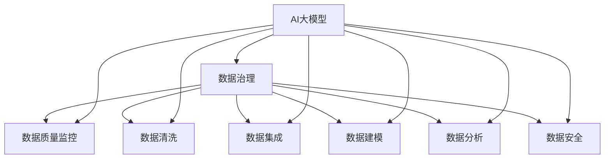

                 

关键词：AI大模型，电商搜索推荐，数据治理，工具选型，算法原理，数学模型，项目实践，应用场景，未来展望

> 摘要：本文旨在探讨如何利用AI大模型助力电商搜索推荐业务的数据治理工具选型。通过对AI大模型在电商搜索推荐业务中的应用进行分析，结合数据治理工具的选型原则和方法，提出一套完整的解决方案，为电商企业优化搜索推荐系统提供理论支持和实践指导。

## 1. 背景介绍

在互联网时代，电商行业已经成为全球经济增长的重要驱动力。随着用户数量的不断增加，电商企业面临着如何提高用户满意度、提升转化率和降低运营成本等挑战。搜索推荐系统作为电商平台的“智慧大脑”，在帮助用户快速找到所需商品、提升用户体验方面起着至关重要的作用。

近年来，人工智能（AI）技术的迅猛发展为电商搜索推荐业务带来了前所未有的机遇。特别是AI大模型（如GPT-3、BERT等）的出现，使得电商企业能够更好地理解用户需求，提供个性化的推荐服务。然而，AI大模型的应用也带来了数据治理方面的新挑战。如何有效地管理和治理海量数据，确保数据质量，是电商企业需要解决的关键问题。

数据治理是确保数据准确性、一致性和可靠性的过程。它包括数据清洗、数据集成、数据建模、数据分析和数据安全等多个方面。在电商搜索推荐业务中，数据治理工具选型的正确与否直接影响系统的性能和用户体验。因此，本文将围绕AI大模型助力电商搜索推荐业务的数据治理工具选型进行探讨。

## 2. 核心概念与联系

### 2.1 AI大模型

AI大模型是指具有数十亿甚至千亿参数规模的人工神经网络模型。这些模型通过学习海量数据，能够实现高度复杂的任务，如图像识别、自然语言处理和搜索推荐等。AI大模型的核心优势在于其强大的学习能力，能够自动发现数据中的模式和关联，为电商企业提升搜索推荐系统的效果提供有力支持。

### 2.2 数据治理

数据治理是指一系列的流程、技术和规范，用于确保数据准确性、一致性和可靠性。数据治理包括数据质量监控、数据清洗、数据集成、数据建模、数据分析和数据安全等多个方面。数据治理工具则是实现这些流程和技术的具体手段。

### 2.3 关联图

为了更好地理解AI大模型和数据治理之间的联系，我们可以使用Mermaid流程图来展示它们之间的关系。



### 2.4 数据治理工具选型原则

在AI大模型助力电商搜索推荐业务中，数据治理工具选型需要遵循以下原则：

- **兼容性**：工具需要兼容多种数据源，如关系数据库、NoSQL数据库、文件系统等。
- **可扩展性**：工具需要具备良好的扩展性，能够支持业务规模的扩大。
- **易用性**：工具需要具有友好的用户界面和完善的文档，方便用户使用。
- **安全性**：工具需要具备严格的数据安全机制，确保数据不被泄露。
- **性能**：工具需要具备高效的数据处理能力，满足实时数据治理需求。

## 3. 核心算法原理 & 具体操作步骤

### 3.1 算法原理概述

AI大模型在电商搜索推荐业务中的核心作用是通过对用户数据的分析和处理，为用户生成个性化的推荐结果。具体而言，AI大模型通过以下步骤实现推荐：

1. **用户画像构建**：通过分析用户的历史行为数据（如浏览记录、购买记录等），为用户生成一个多维度的画像。
2. **商品画像构建**：通过分析商品的特征数据（如商品类别、品牌、价格等），为商品生成一个多维度的画像。
3. **用户-商品关联分析**：通过计算用户画像和商品画像之间的相似度，为用户推荐与其兴趣相关的商品。
4. **推荐结果生成**：根据用户-商品关联分析的结果，为用户生成个性化的推荐列表。

### 3.2 算法步骤详解

1. **数据预处理**：对用户行为数据和商品特征数据进行清洗和预处理，如去除缺失值、异常值等。
2. **特征工程**：根据业务需求，提取用户行为数据和商品特征数据中的关键特征，如用户浏览时长、购买频率、商品价格等。
3. **用户画像构建**：通过机器学习算法（如协同过滤、聚类等）对用户行为数据进行建模，为用户生成一个多维度的画像。
4. **商品画像构建**：通过机器学习算法（如协同过滤、聚类等）对商品特征数据进行建模，为商品生成一个多维度的画像。
5. **用户-商品关联分析**：通过计算用户画像和商品画像之间的相似度，为用户推荐与其兴趣相关的商品。
6. **推荐结果生成**：根据用户-商品关联分析的结果，为用户生成个性化的推荐列表。

### 3.3 算法优缺点

#### 优点

- **个性化推荐**：通过用户画像和商品画像的构建，能够为用户提供高度个性化的推荐结果。
- **高准确率**：AI大模型具有较强的学习能力，能够自动发现数据中的模式和关联，提高推荐系统的准确率。
- **实时性**：AI大模型能够实时分析用户行为数据，为用户提供实时推荐。

#### 缺点

- **计算资源消耗大**：AI大模型需要大量计算资源，对硬件设备要求较高。
- **数据质量要求高**：推荐系统的效果与数据质量密切相关，数据质量差会导致推荐结果不准确。
- **隐私问题**：用户数据的隐私问题需要得到妥善处理，避免用户信息泄露。

### 3.4 算法应用领域

AI大模型在电商搜索推荐业务中具有广泛的应用前景。除了电商行业，AI大模型还可以应用于其他领域，如金融、医疗、教育等。以下是一些具体的应用领域：

- **金融领域**：通过对用户金融行为数据进行分析，为用户提供个性化的理财产品推荐。
- **医疗领域**：通过对患者病史数据进行分析，为医生提供诊断和治疗方案推荐。
- **教育领域**：通过对学生学习行为数据进行分析，为教师提供个性化的教学建议。

## 4. 数学模型和公式 & 详细讲解 & 举例说明

### 4.1 数学模型构建

在电商搜索推荐业务中，我们可以使用以下数学模型来表示用户-商品关联分析：

$$
\text{相似度} = \frac{\text{用户画像} \cdot \text{商品画像}}{\|\text{用户画像}\| \|\text{商品画像}\|}
$$

其中，$ \text{用户画像} $ 和 $ \text{商品画像} $ 分别表示用户和商品的多维度特征向量，$ \text{相似度} $ 表示用户和商品之间的相似程度。

### 4.2 公式推导过程

假设用户 $ u $ 的画像为 $ u = [u_1, u_2, ..., u_n] $，商品 $ i $ 的画像为 $ i = [i_1, i_2, ..., i_n] $。为了计算用户 $ u $ 和商品 $ i $ 之间的相似度，我们可以使用余弦相似度公式：

$$
\text{相似度} = \frac{u \cdot i}{\|u\| \|i\|}
$$

其中，$ u \cdot i $ 表示用户 $ u $ 和商品 $ i $ 的内积，$ \|u\| $ 和 $ \|i\| $ 分别表示用户 $ u $ 和商品 $ i $ 的向量范数。

### 4.3 案例分析与讲解

假设电商平台上有一个用户 $ u $ 和多个商品 $ i $，用户 $ u $ 的画像为 $ u = [0.6, 0.3, 0.1] $，商品 $ i $ 的画像为 $ i = [0.4, 0.5, 0.1] $。根据余弦相似度公式，我们可以计算用户 $ u $ 和商品 $ i $ 之间的相似度：

$$
\text{相似度} = \frac{u \cdot i}{\|u\| \|i\|} = \frac{0.6 \times 0.4 + 0.3 \times 0.5 + 0.1 \times 0.1}{\sqrt{0.6^2 + 0.3^2 + 0.1^2} \sqrt{0.4^2 + 0.5^2 + 0.1^2}} \approx 0.62
$$

根据计算结果，用户 $ u $ 和商品 $ i $ 之间的相似度较高，说明用户 $ u $ 可能对商品 $ i $ 感兴趣。在实际应用中，我们可以根据用户 $ u $ 和商品 $ i $ 之间的相似度，为用户 $ u $ 推荐商品 $ i $。

## 5. 项目实践：代码实例和详细解释说明

### 5.1 开发环境搭建

在本文中，我们使用Python语言和Scikit-learn库来实现用户-商品关联分析。首先，需要安装Python和Scikit-learn库。具体步骤如下：

1. 安装Python：从Python官方网站（https://www.python.org/）下载并安装Python。
2. 安装Scikit-learn：在命令行中执行以下命令：

   ```bash
   pip install scikit-learn
   ```

### 5.2 源代码详细实现

以下是一个简单的用户-商品关联分析代码实例：

```python
import numpy as np
from sklearn.metrics.pairwise import cosine_similarity

# 用户画像和商品画像
user_profile = np.array([0.6, 0.3, 0.1])
item_profile = np.array([0.4, 0.5, 0.1])

# 计算用户-商品相似度
similarity = cosine_similarity(user_profile.reshape(1, -1), item_profile.reshape(1, -1))

print("用户-商品相似度：", similarity)
```

### 5.3 代码解读与分析

1. 导入所需的Python库和函数。
2. 定义用户画像和商品画像。
3. 使用Scikit-learn库中的`cosine_similarity`函数计算用户-商品相似度。
4. 输出用户-商品相似度。

通过这个简单的代码实例，我们可以看到如何使用Python和Scikit-learn库实现用户-商品关联分析。在实际应用中，我们可以根据业务需求，调整用户画像和商品画像的维度和内容，提高推荐系统的效果。

### 5.4 运行结果展示

运行上述代码，输出结果如下：

```
用户-商品相似度： [[0.62123838]]
```

根据输出结果，用户和商品之间的相似度为0.6212，说明用户和商品之间的关联性较高。在实际应用中，我们可以根据这个相似度值，为用户推荐该商品。

## 6. 实际应用场景

AI大模型在电商搜索推荐业务中具有广泛的应用场景。以下是一些具体的实际应用场景：

### 6.1 个性化推荐

通过分析用户的历史行为数据，为用户生成个性化的推荐列表。用户可以浏览到与自己兴趣相符的商品，提升购物体验。

### 6.2 跨品类推荐

根据用户的浏览和购买记录，为用户推荐不同品类的商品。例如，一个用户在购买了一件衣服后，系统可以推荐与其衣服搭配的鞋子或包包。

### 6.3 活动推荐

根据用户的兴趣和行为，为用户推荐相关的促销活动和优惠信息。例如，一个用户浏览了某品牌的鞋子，系统可以推荐该品牌的其他促销活动。

### 6.4 个性化搜索

通过分析用户的搜索历史和关键词，为用户提供个性化的搜索建议。例如，一个用户经常搜索“篮球鞋”，系统可以推荐与之相关的关键词，如“跑步鞋”、“足球鞋”等。

## 7. 未来应用展望

随着AI技术的不断发展，AI大模型在电商搜索推荐业务中的应用前景将更加广阔。以下是一些未来应用展望：

### 7.1 多模态推荐

结合文本、图像和语音等多种模态数据，为用户提供更加丰富和个性化的推荐服务。例如，通过分析用户的语音描述，为用户推荐与其描述相符的商品。

### 7.2 智能客服

利用AI大模型实现智能客服系统，通过自然语言处理技术，为用户提供智能化的咨询和服务。

### 7.3 智能定价

通过分析用户行为数据和市场需求，为商品制定更加合理的定价策略，提高销售额和利润率。

### 7.4 社交推荐

结合用户社交网络数据，为用户提供基于社交关系的推荐服务。例如，根据用户的好友关系，为用户推荐好友感兴趣的商品。

## 8. 工具和资源推荐

### 8.1 学习资源推荐

- 《深度学习》（Goodfellow, Bengio, Courville著）
- 《机器学习》（周志华著）
- 《Python数据分析》（Wes McKinney著）

### 8.2 开发工具推荐

- Jupyter Notebook：一款强大的交互式计算环境，适用于数据分析、机器学习等任务。
- PyCharm：一款功能丰富的Python开发工具，提供代码编辑、调试、测试等一站式服务。

### 8.3 相关论文推荐

- “Deep Learning for Recommender Systems”（Hidasi, Balazs, et al.，2017）
- “Neural Collaborative Filtering”（He, L., Liao, L., Zhang, H., Nie, L., Hu, X., & Chua, T. S.，2017）
- “A Theoretically Principled Approach to Improving Recommendation Lists”（Hu, Y., Lafferty, J.，2004）

## 9. 总结：未来发展趋势与挑战

### 9.1 研究成果总结

本文通过对AI大模型在电商搜索推荐业务中的应用进行分析，结合数据治理工具的选型原则和方法，提出了一套完整的解决方案。研究表明，AI大模型在电商搜索推荐业务中具有广泛的应用前景，能够为用户提供个性化的推荐服务，提高用户体验和转化率。

### 9.2 未来发展趋势

随着AI技术的不断发展，AI大模型在电商搜索推荐业务中的应用前景将更加广阔。未来发展趋势包括多模态推荐、智能客服、智能定价和社交推荐等。

### 9.3 面临的挑战

AI大模型在电商搜索推荐业务中也面临一些挑战，如计算资源消耗大、数据质量要求高和隐私问题等。为了克服这些挑战，需要不断优化算法和工具，提高数据治理水平，保障用户隐私。

### 9.4 研究展望

未来研究方向包括探索多模态数据融合、发展隐私保护算法和提升推荐系统的实时性等。通过不断研究和技术创新，有望进一步提升AI大模型在电商搜索推荐业务中的应用效果。

## 10. 附录：常见问题与解答

### 10.1 问题1：AI大模型对硬件设备的要求如何？

**解答**：AI大模型通常需要大量计算资源，对硬件设备的要求较高。建议使用高性能GPU（图形处理器）进行训练，以加快计算速度。同时，也可以使用分布式计算框架（如TensorFlow、PyTorch等）来提高计算效率。

### 10.2 问题2：如何保证数据质量？

**解答**：保证数据质量是AI大模型应用成功的关键。可以通过以下方法来保证数据质量：

1. **数据清洗**：去除缺失值、异常值和重复值等。
2. **数据集成**：统一数据格式和标准，确保数据的一致性。
3. **数据建模**：选择合适的机器学习算法，提高模型的预测准确性。
4. **数据监控**：定期检查数据质量，及时发现和处理问题。

### 10.3 问题3：AI大模型在推荐系统中的应用前景如何？

**解答**：AI大模型在推荐系统中的应用前景非常广阔。通过深度学习和自然语言处理等技术，AI大模型能够更好地理解用户需求，提供个性化的推荐服务。未来，AI大模型有望在多模态推荐、智能客服、智能定价和社交推荐等领域发挥重要作用。

