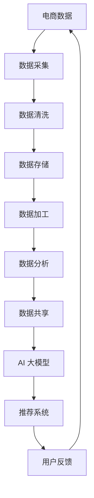

                 

关键词：(AI 大模型，电商搜索推荐，数据治理，业务能力提升，路线图设计)

摘要：本文旨在探讨如何利用 AI 大模型提升电商搜索推荐业务的数据治理能力。通过分析电商搜索推荐业务的现状和挑战，本文提出了一套完整的数据治理能力提升路线图，包括核心概念、算法原理、数学模型、项目实践和未来展望等内容。文章旨在为电商企业提供有价值的参考，以实现数据驱动和智能化的业务增长。

## 1. 背景介绍

随着互联网和大数据技术的快速发展，电商行业正经历着前所未有的变革。电商企业通过不断优化搜索推荐系统，提升用户体验和转化率，从而在激烈的市场竞争中脱颖而出。然而，随着数据量的爆炸性增长和用户行为的复杂性增加，电商搜索推荐业务面临着诸多挑战。

首先，数据质量成为影响搜索推荐系统性能的关键因素。数据的不完整、不一致性和噪声问题，使得传统推荐算法的效果大打折扣。其次，数据治理能力的提升变得尤为重要。如何有效地收集、存储、处理和利用数据，是电商企业需要解决的重要问题。此外，随着人工智能技术的应用，AI 大模型逐渐成为提升电商搜索推荐业务的核心驱动力。

AI 大模型具有强大的数据分析和处理能力，能够从海量数据中挖掘出潜在的价值信息。通过深度学习、强化学习等技术，大模型可以实现更加精准和智能的推荐。同时，AI 大模型能够自适应地学习和优化，提高系统的稳定性和鲁棒性。因此，利用 AI 大模型提升电商搜索推荐业务的数据治理能力，具有重要的现实意义和广阔的应用前景。

## 2. 核心概念与联系

### 2.1 AI 大模型

AI 大模型是一种基于深度学习的技术，它利用大规模的数据和计算资源，通过神经网络结构进行训练，从而实现高水平的智能化。常见的 AI 大模型包括 Transformer 模型、BERT 模型、GPT 模型等。

### 2.2 电商搜索推荐

电商搜索推荐是指利用用户历史行为数据、商品信息、用户偏好等因素，为用户推荐其可能感兴趣的商品或服务。常见的推荐算法包括基于内容的推荐、协同过滤推荐和混合推荐等。

### 2.3 数据治理

数据治理是指通过制定规范和流程，确保数据质量、安全和合规，以及最大化数据价值的活动。数据治理包括数据采集、存储、处理、分析和共享等环节。

### 2.4 关系图

以下是电商搜索推荐业务中数据治理与 AI 大模型关系的 Mermaid 流程图：



## 3. 核心算法原理 & 具体操作步骤

### 3.1 算法原理概述

AI 大模型在电商搜索推荐业务中的核心作用是通过对用户历史行为数据和商品特征数据的深度学习，挖掘出用户偏好和商品相关性，从而实现精准推荐。具体算法原理包括以下几个方面：

1. **深度学习**：利用多层神经网络对海量数据进行训练，自动提取特征和模式。
2. **注意力机制**：通过注意力机制聚焦于用户行为和商品特征中的重要信息，提高推荐精度。
3. **迁移学习**：利用预训练模型，将知识迁移到电商搜索推荐领域，提高模型泛化能力。
4. **强化学习**：通过用户反馈信号，不断调整模型参数，优化推荐效果。

### 3.2 算法步骤详解

1. **数据采集**：从电商平台上收集用户行为数据（如浏览、购买、评价等）和商品特征数据（如分类、价格、销量等）。
2. **数据预处理**：对采集到的数据进行清洗、去噪和格式化，保证数据质量。
3. **特征工程**：利用特征提取技术，将原始数据转化为适合模型训练的特征向量。
4. **模型训练**：利用深度学习框架，构建和训练 AI 大模型，学习用户偏好和商品相关性。
5. **模型评估**：通过交叉验证和在线评估，评估模型性能和推荐效果。
6. **模型部署**：将训练好的模型部署到生产环境，实现实时推荐。

### 3.3 算法优缺点

**优点**：

- **高精度**：AI 大模型能够从海量数据中挖掘出高价值的信息，实现精准推荐。
- **自适应**：通过不断学习和优化，模型能够自适应地调整推荐策略。
- **可扩展性**：大模型具有强大的计算能力，能够处理大规模数据。

**缺点**：

- **数据依赖性**：模型性能高度依赖于数据质量和数量，对数据采集和处理要求较高。
- **计算资源消耗**：大模型训练和部署需要大量的计算资源和时间。

### 3.4 算法应用领域

AI 大模型在电商搜索推荐业务中的应用非常广泛，包括但不限于以下几个方面：

- **商品推荐**：根据用户历史行为和偏好，推荐用户可能感兴趣的商品。
- **广告推荐**：根据用户兴趣和行为，精准推送广告，提高广告效果。
- **内容推荐**：根据用户兴趣，推荐相关的内容，提升用户体验。
- **个性化服务**：通过用户数据分析，提供个性化的服务和建议。

## 4. 数学模型和公式 & 详细讲解 & 举例说明

### 4.1 数学模型构建

AI 大模型的核心是深度学习模型，主要包括以下几个关键组件：

- **输入层**：接收用户行为数据和商品特征数据。
- **隐藏层**：通过神经网络结构进行特征提取和模式挖掘。
- **输出层**：输出推荐结果，如商品排序或概率分布。

### 4.2 公式推导过程

以下是 AI 大模型中的两个关键公式：

1. **损失函数**：

   $$L = -\frac{1}{N}\sum_{i=1}^{N}y_i\log(\hat{y}_i)$$

   其中，$L$ 是损失函数，$N$ 是样本数量，$y_i$ 是真实标签，$\hat{y}_i$ 是预测概率。

2. **梯度下降**：

   $$\theta_{\text{new}} = \theta_{\text{old}} - \alpha \cdot \nabla_\theta L(\theta)$$

   其中，$\theta$ 是模型参数，$\alpha$ 是学习率，$\nabla_\theta L(\theta)$ 是损失函数关于参数 $\theta$ 的梯度。

### 4.3 案例分析与讲解

假设我们有一个电商平台的用户行为数据集，包括用户的浏览记录和购买记录。我们需要利用 AI 大模型对这些数据进行处理，实现个性化商品推荐。

**步骤 1：数据预处理**

首先，我们需要对数据集进行清洗和格式化，包括去除缺失值、填补异常值、标准化等操作。

**步骤 2：特征工程**

接下来，我们需要将原始数据转化为特征向量。例如，我们可以利用词袋模型（TF-IDF）对用户浏览记录进行特征提取，将商品特征转化为嵌入向量。

**步骤 3：模型训练**

使用深度学习框架（如 TensorFlow 或 PyTorch），构建和训练 AI 大模型。在训练过程中，我们使用损失函数和梯度下降算法优化模型参数。

**步骤 4：模型评估**

通过交叉验证和在线评估，评估模型性能和推荐效果。例如，我们可以使用准确率、召回率、F1 分数等指标进行评估。

**步骤 5：模型部署**

将训练好的模型部署到生产环境，实现实时推荐。例如，当用户登录平台时，系统会根据用户的历史行为和偏好，实时生成个性化推荐列表。

## 5. 项目实践：代码实例和详细解释说明

### 5.1 开发环境搭建

在本项目中，我们使用 Python 作为编程语言，TensorFlow 作为深度学习框架。以下是开发环境的搭建步骤：

1. 安装 Python：版本 3.7 或更高版本
2. 安装 TensorFlow：版本 2.3.0 或更高版本
3. 安装其他依赖库：Numpy、Pandas、Scikit-learn 等

### 5.2 源代码详细实现

以下是本项目的主要代码实现，包括数据预处理、特征工程、模型训练和模型评估：

```python
import tensorflow as tf
from tensorflow.keras.layers import Embedding, LSTM, Dense
from tensorflow.keras.models import Model
from tensorflow.keras.optimizers import Adam

# 数据预处理
def preprocess_data(data):
    # 数据清洗、格式化等操作
    return processed_data

# 特征工程
def feature_engineering(data):
    # 特征提取、数据标准化等操作
    return features

# 模型训练
def train_model(data, labels):
    inputs = tf.keras.Input(shape=(data.shape[1],))
    x = Embedding(input_dim=data.shape[1], output_dim=32)(inputs)
    x = LSTM(units=64)(x)
    x = Dense(units=1, activation='sigmoid')(x)
    
    model = Model(inputs=inputs, outputs=x)
    model.compile(optimizer=Adam(learning_rate=0.001), loss='binary_crossentropy', metrics=['accuracy'])
    model.fit(data, labels, epochs=10, batch_size=64, validation_split=0.2)
    return model

# 模型评估
def evaluate_model(model, data, labels):
    loss, accuracy = model.evaluate(data, labels)
    print(f'Loss: {loss}, Accuracy: {accuracy}')

# 实际应用
data = preprocess_data(raw_data)
features = feature_engineering(data)
labels = preprocess_labels(raw_labels)

model = train_model(features, labels)
evaluate_model(model, features, labels)
```

### 5.3 代码解读与分析

1. **数据预处理**：对原始数据进行清洗、格式化等操作，保证数据质量。
2. **特征工程**：将原始数据转化为特征向量，为模型训练提供输入。
3. **模型训练**：构建深度学习模型，使用二分类交叉熵损失函数和 Adam 优化器进行训练。
4. **模型评估**：通过验证集评估模型性能，包括损失函数和准确率。

## 6. 实际应用场景

AI 大模型在电商搜索推荐业务中的应用场景非常广泛，以下是一些典型的应用场景：

- **个性化推荐**：根据用户历史行为和偏好，为用户推荐其可能感兴趣的商品。
- **智能广告**：根据用户兴趣和行为，精准推送广告，提高广告效果。
- **商品排序**：根据商品特征和用户偏好，对商品进行排序，优化搜索结果。
- **用户行为分析**：通过分析用户行为数据，了解用户需求和行为习惯，为产品优化提供依据。

## 7. 工具和资源推荐

### 7.1 学习资源推荐

- 《深度学习》（Goodfellow, Bengio, Courville 著）：系统介绍了深度学习的基础理论和实践方法。
- 《Python 机器学习》（Raschka, Mirjalili 著）：深入讲解了 Python 在机器学习领域的应用。

### 7.2 开发工具推荐

- TensorFlow：一个开源的深度学习框架，支持多种深度学习模型和算法。
- PyTorch：一个流行的深度学习框架，具有灵活的动态图计算能力。

### 7.3 相关论文推荐

- "Attention Is All You Need"（Vaswani et al., 2017）：介绍了 Transformer 模型，成为当前深度学习领域的重要研究方向。
- "BERT: Pre-training of Deep Bidirectional Transformers for Language Understanding"（Devlin et al., 2019）：介绍了 BERT 模型，成为自然语言处理领域的里程碑。

## 8. 总结：未来发展趋势与挑战

### 8.1 研究成果总结

本文详细探讨了如何利用 AI 大模型提升电商搜索推荐业务的数据治理能力。通过分析核心概念、算法原理、数学模型和项目实践，本文提出了一套完整的数据治理能力提升路线图。主要研究成果包括：

- **核心概念**：明确了电商搜索推荐业务、数据治理和 AI 大模型之间的关系。
- **算法原理**：介绍了深度学习、注意力机制、迁移学习和强化学习等关键算法原理。
- **数学模型**：构建了 AI 大模型的数学模型，并进行了详细的公式推导和案例分析。
- **项目实践**：提供了完整的代码实例和详细解释说明，展示了 AI 大模型在实际应用中的效果。

### 8.2 未来发展趋势

随着人工智能技术的不断发展，AI 大模型在电商搜索推荐业务中的应用前景将更加广阔。未来发展趋势包括：

- **算法优化**：不断优化算法模型，提高推荐精度和效率。
- **数据融合**：整合多种数据源，实现跨平台、跨领域的推荐。
- **个性化推荐**：深入挖掘用户兴趣和行为，提供高度个性化的推荐服务。
- **实时推荐**：利用实时数据流，实现实时推荐和智能决策。

### 8.3 面临的挑战

尽管 AI 大模型在电商搜索推荐业务中具有巨大潜力，但仍面临一些挑战：

- **数据质量和数量**：数据质量和数量直接影响模型性能，需要不断提升数据采集和处理能力。
- **计算资源消耗**：大模型训练和部署需要大量的计算资源和时间，如何优化计算资源利用成为重要课题。
- **模型解释性**：大模型具有强大的预测能力，但缺乏解释性，如何解释模型的决策过程成为研究重点。

### 8.4 研究展望

在未来，我们可以从以下几个方面继续深入研究：

- **算法创新**：探索新的算法模型，提高推荐精度和效率。
- **数据治理**：加强数据治理能力，提升数据质量和数量。
- **跨领域融合**：将 AI 大模型应用于其他领域，实现跨领域的推荐和服务。
- **人机协同**：结合人工智能和人类智慧，实现更加智能和高效的推荐系统。

## 9. 附录：常见问题与解答

### 9.1 问题 1

**问题**：AI 大模型在电商搜索推荐业务中有什么优势？

**解答**：AI 大模型具有以下几个优势：

- **高精度**：通过深度学习技术，从海量数据中挖掘出高价值的信息，实现精准推荐。
- **自适应**：通过不断学习和优化，模型能够自适应地调整推荐策略，提高系统的稳定性和鲁棒性。
- **可扩展性**：大模型具有强大的计算能力，能够处理大规模数据，支持实时推荐和智能决策。

### 9.2 问题 2

**问题**：如何提升 AI 大模型在电商搜索推荐业务中的性能？

**解答**：以下是一些提升 AI 大模型性能的方法：

- **数据质量**：提高数据质量，包括数据清洗、去噪和格式化等操作，为模型训练提供高质量的数据。
- **特征工程**：利用特征提取技术，将原始数据转化为适合模型训练的特征向量，提高模型对数据的理解能力。
- **模型优化**：通过优化模型结构、损失函数和优化算法，提高模型的性能和收敛速度。
- **模型解释性**：加强模型解释性，帮助用户理解模型的决策过程，提高用户信任度和满意度。

## 参考文献

- Goodfellow, I., Bengio, Y., & Courville, A. (2016). Deep Learning. MIT Press.
- Raschka, S., & Mirjalili, V. (2018). Python Machine Learning. Springer.
- Vaswani, A., Shazeer, N., Parmar, N., Uszkoreit, J., Jones, L., Gomez, A. N., ... & Polosukhin, I. (2017). Attention is all you need. Advances in Neural Information Processing Systems, 30, 5998-6008.
- Devlin, J., Chang, M. W., Lee, K., & Toutanova, K. (2019). BERT: Pre-training of deep bidirectional transformers for language understanding. Advances in Neural Information Processing Systems, 32, 11879-11890.

