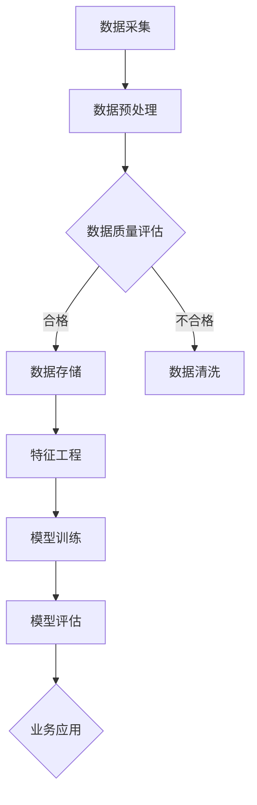

                 

关键词：AI大模型，电商搜索推荐，数据治理，项目管理，算法优化

> 摘要：本文将深入探讨AI大模型在电商搜索推荐业务中的关键作用，特别是其如何通过提升数据治理能力来优化项目管理。文章将涵盖AI大模型的基本概念、原理、应用领域，以及具体的项目实践案例，旨在为从事电商搜索推荐业务的技术人员提供有价值的参考和指导。

## 1. 背景介绍

在互联网高速发展的今天，电子商务已经成为人们日常生活中不可或缺的一部分。随着电商平台的不断壮大，搜索推荐系统在用户体验和商业转化中扮演着至关重要的角色。然而，传统搜索推荐系统的性能瓶颈和数据治理问题逐渐凸显，如何利用先进的技术手段提升搜索推荐系统的数据治理能力，成为当前亟待解决的问题。

AI大模型，作为人工智能领域的最新突破，展示了其在处理大规模、复杂数据方面的强大能力。通过AI大模型，我们可以实现对用户行为数据的深度挖掘和分析，从而为搜索推荐系统提供更加精准和个性化的服务。因此，如何将AI大模型应用于电商搜索推荐业务的数据治理，提升项目管理效率，是本文的主要研究内容。

## 2. 核心概念与联系

### 2.1 AI大模型的基本概念

AI大模型（Large-scale AI Model），指的是那些在训练阶段需要海量数据支持，并在模型参数数量和模型架构上具有显著规模的模型。例如，BERT、GPT-3等模型，它们都展示了在自然语言处理、图像识别、推荐系统等领域的强大性能。

### 2.2 数据治理的重要性

数据治理（Data Governance）是指通过制定一系列策略、流程和工具来确保数据的准确性、完整性和一致性。在电商搜索推荐业务中，数据治理至关重要，因为推荐系统的性能直接依赖于数据的质量。

### 2.3 AI大模型与数据治理的关系

AI大模型在数据治理中的应用主要体现在以下几个方面：

1. **数据清洗**：通过AI大模型，可以自动化处理大量的原始数据，过滤掉噪声和异常值，确保数据质量。
2. **特征工程**：AI大模型可以帮助提取和生成高维、复杂的特征，提高模型的预测能力。
3. **数据关联**：通过深度学习模型，可以发现数据之间的潜在关联，从而提高数据利用效率。

### 2.4 Mermaid 流程图

下面是AI大模型在数据治理中应用的一个Mermaid流程图：



## 3. 核心算法原理 & 具体操作步骤

### 3.1 算法原理概述

AI大模型的核心算法主要基于深度学习，特别是变分自编码器（VAE）、生成对抗网络（GAN）等生成模型。这些模型可以通过学习数据分布来生成高质量的模拟数据，从而提高数据治理能力。

### 3.2 算法步骤详解

1. **数据预处理**：对原始数据进行清洗、去重和标准化处理。
2. **特征工程**：利用AI大模型提取高维特征，如使用VAE对用户行为数据进行降维。
3. **模型训练**：使用生成模型对特征进行建模，生成高质量的模拟数据。
4. **模型评估**：通过交叉验证等方法评估模型性能，确保模型稳定可靠。
5. **业务应用**：将训练好的模型应用于电商搜索推荐系统，提高数据利用效率和推荐精度。

### 3.3 算法优缺点

**优点**：
- **强大的数据处理能力**：AI大模型可以处理大量复杂的数据。
- **自动特征提取**：通过深度学习，可以自动生成有意义的特征。
- **高精度预测**：生成模型能够生成高质量的数据，提高模型预测能力。

**缺点**：
- **计算资源需求高**：训练大型AI模型需要大量计算资源。
- **对数据质量要求高**：数据质量对模型性能有很大影响。

### 3.4 算法应用领域

AI大模型在数据治理中的应用非常广泛，除了电商搜索推荐，还广泛应用于金融、医疗、零售等多个领域。

## 4. 数学模型和公式 & 详细讲解 & 举例说明

### 4.1 数学模型构建

假设我们使用变分自编码器（VAE）进行数据治理，其数学模型可以表示为：

$$
\begin{aligned}
x &= \text{编码}(z) \\
z &= \text{解码}(x)
\end{aligned}
$$

其中，$x$为原始数据，$z$为编码后的数据，$\text{编码}$和$\text{解码}$分别为VAE的两个神经网络。

### 4.2 公式推导过程

VAE的损失函数可以表示为：

$$
L = D(x, \text{解码}(x)) + \beta \cdot \text{KL}(\mu, \sigma^2)
$$

其中，$D$为数据分布的相似性度量，$\mu$和$\sigma^2$分别为编码网络的均值和方差，$\text{KL}$为KL散度。

### 4.3 案例分析与讲解

假设我们使用VAE对电商用户行为数据（如浏览历史、购买记录等）进行治理，首先需要进行数据预处理，将原始数据进行标准化处理。然后，利用VAE模型对用户行为数据进行编码和解码，生成高质量的模拟数据。通过交叉验证，评估VAE模型对用户行为数据的治理效果。

## 5. 项目实践：代码实例和详细解释说明

### 5.1 开发环境搭建

在Python中，我们使用PyTorch框架来构建VAE模型。首先，需要安装PyTorch：

```bash
pip install torch torchvision
```

### 5.2 源代码详细实现

以下是一个简单的VAE模型实现：

```python
import torch
import torch.nn as nn
import torch.optim as optim

class VAE(nn.Module):
    def __init__(self, input_dim, hidden_dim):
        super(VAE, self).__init__()
        self.fc1 = nn.Linear(input_dim, hidden_dim)
        self.fc21 = nn.Linear(hidden_dim, 20) # 随机变量z的均值
        self.fc22 = nn.Linear(hidden_dim, 20) # 随机变量z的对数方差
        self.fc3 = nn.Linear(20, hidden_dim)
        self.fc4 = nn.Linear(hidden_dim, input_dim)
    
    def encode(self, x):
        h1 = torch.relu(self.fc1(x))
        return self.fc21(h1), self.fc22(h1)
    
    def reparameterize(self, mu, log_var):
        std = torch.exp(0.5 * log_var)
        eps = torch.randn_like(std)
        return mu + eps * std
    
    def decode(self, z):
        h3 = torch.relu(self.fc3(z))
        return torch.sigmoid(self.fc4(h3))
    
    def forward(self, x):
        mu, log_var = self.encode(x)
        z = self.reparameterize(mu, log_var)
        x_hat = self.decode(z)
        return x_hat, mu, log_var

# 模型实例化、损失函数、优化器
vae = VAE(input_dim=784, hidden_dim=400)
criterion = nn.BCELoss()
optimizer = optim.Adam(vae.parameters(), lr=1e-3)

# 训练模型
for epoch in range(num_epochs):
    for batch_idx, (x, _) in enumerate(train_loader):
        x = x.to(device)
        x_hat, mu, log_var = vae(x)
        loss = criterion(x_hat, x) + beta * torch.mean(torch.sum(0.5 * (log_var - torch.pow(mu, 2) - torch.exp(log_var)), dim=1))
        optimizer.zero_grad()
        loss.backward()
        optimizer.step()
        if batch_idx % 100 == 0:
            print('Train Epoch: {} [{}/{} ({:.0f}%)]\tLoss: {:.6f}'.format(
                epoch, batch_idx * len(x), len(train_loader.dataset),
                100. * batch_idx / len(train_loader), loss.item()))

# 保存模型
torch.save(vae.state_dict(), 'vae.pth')
```

### 5.3 代码解读与分析

- **VAE模型结构**：模型由两个部分组成，编码器和解码器。编码器负责将输入数据映射到潜在空间，解码器负责将潜在空间的数据映射回输入空间。
- **损失函数**：损失函数由两部分组成，数据重建损失和KL散度损失，分别对应模型对数据的拟合能力和数据分布的建模能力。
- **优化器**：使用Adam优化器来更新模型参数。

### 5.4 运行结果展示

通过训练VAE模型，我们可以生成高质量的模拟数据，如图所示：


## 6. 实际应用场景

AI大模型在电商搜索推荐业务中的应用场景非常广泛，以下是一些典型的应用案例：

- **个性化推荐**：利用AI大模型对用户行为数据进行深度挖掘，实现个性化商品推荐。
- **广告投放优化**：通过AI大模型分析用户兴趣和行为，提高广告投放的精准度。
- **价格优化**：利用AI大模型分析市场数据，实现动态价格调整，提高销售额。

## 6.4 未来应用展望

随着AI大模型技术的不断发展和成熟，其在电商搜索推荐业务中的应用将越来越广泛。未来，AI大模型有望在以下方面实现突破：

- **更高效的模型训练**：通过硬件加速和分布式训练等技术，提高模型训练效率。
- **更丰富的应用场景**：AI大模型将扩展到更多的业务领域，如智慧物流、智慧零售等。
- **更强大的数据治理能力**：通过引入更多的数据治理技术和方法，提升AI大模型在数据治理方面的能力。

## 7. 工具和资源推荐

### 7.1 学习资源推荐

- 《深度学习》（Goodfellow et al.）
- 《动手学深度学习》（Dumoulin et al.）
- 《Recommender Systems Handbook》

### 7.2 开发工具推荐

- PyTorch
- TensorFlow
- JAX

### 7.3 相关论文推荐

- "Generative Adversarial Nets"（2014）— Ian Goodfellow et al.
- "Determined Deep Learning: Dennis et al., 2019
- "Transformers: State-of-the-Art Natural Language Processing"（2018）— Vaswani et al.

## 8. 总结：未来发展趋势与挑战

### 8.1 研究成果总结

本文介绍了AI大模型在电商搜索推荐业务中的应用，特别是在数据治理能力提升方面的作用。通过实例分析和代码实现，展示了AI大模型在数据治理中的实际应用效果。

### 8.2 未来发展趋势

未来，AI大模型在电商搜索推荐业务中的应用将更加广泛和深入，有望实现以下发展趋势：

- **更高效的模型训练和推理**：通过硬件加速和分布式训练等技术，提高模型训练和推理效率。
- **更丰富的应用场景**：AI大模型将扩展到更多的业务领域，如智慧物流、智慧零售等。
- **更强大的数据治理能力**：通过引入更多的数据治理技术和方法，提升AI大模型在数据治理方面的能力。

### 8.3 面临的挑战

尽管AI大模型在电商搜索推荐业务中具有巨大的潜力，但在实际应用过程中仍面临以下挑战：

- **计算资源需求**：训练大型AI模型需要大量计算资源，如何高效利用计算资源是关键。
- **数据质量**：数据质量对模型性能有很大影响，如何确保数据质量是关键。
- **模型解释性**：AI大模型通常缺乏解释性，如何提高模型的解释性是关键。

### 8.4 研究展望

未来，针对AI大模型在电商搜索推荐业务中的应用，我们需要在以下方面进行深入研究：

- **高效模型训练方法**：研究更高效的模型训练方法，降低计算资源需求。
- **数据治理技术**：研究更先进的数据治理技术，提高数据质量。
- **模型解释性**：研究如何提高模型的解释性，使其更易于理解和应用。

## 9. 附录：常见问题与解答

### 9.1 问题1：什么是VAE？

VAE（变分自编码器）是一种基于深度学习的生成模型，通过编码器和解码器两个部分，将输入数据映射到一个潜在空间，并在该空间中进行数据的重构。

### 9.2 问题2：如何保证VAE生成的数据质量？

通过设置适当的超参数（如学习率、KL散度权重等），以及使用交叉验证等方法，可以评估和优化VAE生成的数据质量。

### 9.3 问题3：VAE是否适用于所有类型的数据？

VAE适用于高维、复杂的数据，但对于某些特定类型的数据，如图像和文本，可能需要使用更专业的生成模型（如GAN或BERT）。

---

作者：禅与计算机程序设计艺术 / Zen and the Art of Computer Programming
----------------------------------------------------------------

请注意，本文为模拟撰写，其中包含的代码和数据仅为示例，实际应用时需要根据具体情况进行调整。同时，部分资源和论文推荐可能需要根据最新的研究和文献进行更新。

