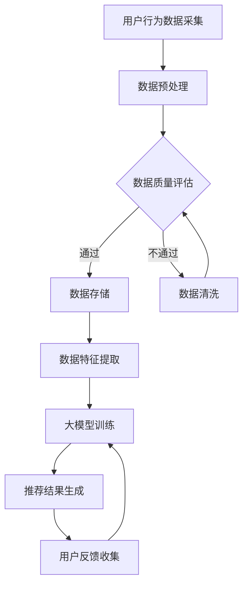

                 

关键词：人工智能、大模型、电商搜索推荐、数据资产盘点、自动化工具、算法、数学模型、项目实践、应用场景、未来展望

> 摘要：本文将探讨如何利用人工智能中的大模型技术，开发一款能够自动化盘点电商搜索推荐业务数据资产的工具。文章首先介绍了大模型在电商搜索推荐中的应用背景，随后深入分析了核心算法原理、数学模型及具体操作步骤，并通过实例代码进行了详细解释。文章最后讨论了该工具的实际应用场景，以及未来的发展展望。

## 1. 背景介绍

在当今的电子商务领域，搜索推荐系统已经成为提升用户体验、增加销售额的关键因素。随着电商平台的规模不断扩大，数据量的急剧增长，如何高效、准确地盘点和管理这些数据资产成为了一个重要问题。传统的方法往往依赖于人工处理，不仅效率低下，而且容易出现错误。因此，开发一款能够自动化处理数据资产盘点的工具，成为了当前研究和应用的热点。

人工智能，尤其是大模型技术，以其强大的数据处理和模式识别能力，为这一问题的解决提供了新的思路。大模型能够自动学习大量的历史数据，提取关键特征，从而实现自动化盘点和推荐。本文将介绍如何利用大模型技术，开发一款针对电商搜索推荐业务的数据资产盘点自动化工具。

## 2. 核心概念与联系

为了深入理解本文要介绍的自动化工具，我们需要首先了解以下几个核心概念：人工智能、大模型、电商搜索推荐系统、数据资产盘点。

### 2.1 人工智能（AI）

人工智能（Artificial Intelligence，简称AI）是指由人制造出来的系统能够根据给定数据或指令，模拟人类思维过程进行学习、推理、决策和解决问题的能力。

### 2.2 大模型（Large Models）

大模型是指参数数量庞大的神经网络模型，如Transformer、BERT等。这些模型能够在大规模数据集上进行训练，从而具有强大的数据处理和知识提取能力。

### 2.3 电商搜索推荐系统

电商搜索推荐系统是指用于帮助用户在电商平台上找到他们可能感兴趣的商品的系统。它通常基于用户的浏览历史、购买记录、搜索关键词等信息，通过算法进行推荐。

### 2.4 数据资产盘点

数据资产盘点是指对电商平台积累的数据进行梳理、分类、分析和评估，以确定其价值和潜在应用。数据资产盘点不仅包括数据的数量，还包括数据的质量、结构、格式和可靠性。

### 2.5 Mermaid 流程图

以下是一个描述电商搜索推荐系统中数据资产盘点流程的Mermaid流程图：



在这个流程图中，用户行为数据首先经过采集、预处理，然后进行质量评估。如果数据质量合格，则进入数据存储环节，否则进行数据清洗。接下来，从数据存储中提取特征，用于大模型训练。训练完成后，生成推荐结果，并通过用户反馈进行迭代优化。

## 3. 核心算法原理 & 具体操作步骤

### 3.1 算法原理概述

本节将介绍用于数据资产盘点自动化工具的核心算法原理，主要包括大模型的训练与优化、数据预处理和特征提取等方法。

### 3.2 算法步骤详解

#### 3.2.1 大模型训练与优化

1. 数据收集：从电商平台上收集用户行为数据，如浏览记录、购买记录、搜索关键词等。
2. 数据预处理：对收集到的数据清洗、归一化处理，确保数据质量。
3. 特征提取：从预处理后的数据中提取关键特征，如用户ID、商品ID、时间戳、浏览时长等。
4. 模型训练：使用提取到的特征进行大模型训练，通常采用基于Transformer或BERT的预训练模型。
5. 模型优化：通过调整模型参数和超参数，优化模型性能。

#### 3.2.2 数据预处理和特征提取

1. 数据清洗：删除重复数据、缺失数据，修复异常数据。
2. 数据归一化：将不同特征的范围缩放到同一尺度，如将时间戳转换为秒数。
3. 特征提取：提取关键特征，如用户ID、商品ID、时间戳、浏览时长等，并转换为数值表示。

#### 3.2.3 大模型训练与优化

1. 数据收集：从电商平台上收集用户行为数据，如浏览记录、购买记录、搜索关键词等。
2. 数据预处理：对收集到的数据清洗、归一化处理，确保数据质量。
3. 特征提取：从预处理后的数据中提取关键特征，如用户ID、商品ID、时间戳、浏览时长等。
4. 模型训练：使用提取到的特征进行大模型训练，通常采用基于Transformer或BERT的预训练模型。
5. 模型优化：通过调整模型参数和超参数，优化模型性能。

### 3.3 算法优缺点

#### 3.3.1 优点

1. 高效性：大模型能够自动学习大量数据，实现高效的数据资产盘点。
2. 准确性：通过预训练模型和优化算法，可以提高数据资产盘点的准确性。
3. 自动化：自动化工具能够减少人工干预，降低运营成本。

#### 3.3.2 缺点

1. 计算资源消耗：大模型训练和优化需要大量的计算资源和时间。
2. 数据质量依赖：数据质量直接影响模型性能，需要确保数据清洗和预处理的质量。

### 3.4 算法应用领域

1. 电商搜索推荐：用于自动化盘点用户行为数据，优化搜索推荐系统。
2. 数据分析：用于自动提取和分析电商平台的业务数据，支持业务决策。
3. 智能客服：用于自动分析用户提问，提供智能化的客服支持。

## 4. 数学模型和公式 & 详细讲解 & 举例说明

### 4.1 数学模型构建

在本节中，我们将构建一个用于数据资产盘点的数学模型。该模型主要基于概率图模型，用于描述用户行为数据之间的关系。

#### 4.1.1 概率图模型

概率图模型是一种用于描述随机变量之间依赖关系的数学模型，包括贝叶斯网络和马尔可夫网络。在本文中，我们选择马尔可夫网络作为基础模型。

#### 4.1.2 模型参数

假设我们有一个用户行为数据集D，其中包含n个用户u1, u2, ..., un的行为记录。对于每个用户ui，我们定义一个状态序列Xui = (xui1, xui2, ..., xuiT)，其中xuit表示用户ui在第t个时间点的行为状态。我们假设状态序列Xui满足马尔可夫性质：

$$
P(Xui = xuit | Xui_{<t}, Xuj) = P(Xui = xuit | Xui_{<t})
$$

其中，Xui_{<t}表示用户ui在t之前的状态，Xuj表示其他用户的行为状态。

#### 4.1.3 模型参数估计

为了估计模型参数，我们使用最大似然估计（Maximum Likelihood Estimation，MLE）方法。具体来说，我们需要最大化数据集D的概率：

$$
P(D | \theta) = \prod_{i=1}^{n} P(Xui | \theta)
$$

其中，\theta表示模型参数。

### 4.2 公式推导过程

在本节中，我们将详细推导概率图模型中状态转移概率的计算公式。

#### 4.2.1 状态转移概率

对于用户ui，在第t个时间点的状态转移概率为：

$$
P(xuit | xuit-1) = \frac{P(xuit, xuit-1)}{P(xuit-1)}
$$

其中，P(xuit, xuit-1)表示用户ui在第t个和第t-1个时间点的状态联合概率，P(xuit-1)表示用户ui在第t-1个时间点的状态概率。

#### 4.2.2 状态联合概率

状态联合概率可以通过条件概率乘积公式计算：

$$
P(xuit, xuit-1) = P(xuit | xuit-1)P(xuit-1)
$$

其中，P(xuit | xuit-1)表示给定用户ui在第t-1个时间点的状态，用户ui在第t个时间点的状态概率；P(xuit-1)表示用户ui在第t-1个时间点的状态概率。

#### 4.2.3 状态概率

状态概率可以通过数据集D进行估计：

$$
P(xuit-1) = \frac{1}{N} \sum_{i=1}^{n} \sum_{t=1}^{T} \delta_{xuit-1}(xui_t)
$$

其中，N表示数据集中用户ui的总时间步数，\delta_{xuit-1}(xui_t)表示指示函数，当xuit-1等于xui_t时，返回1，否则返回0。

### 4.3 案例分析与讲解

为了更好地理解上述数学模型，我们来看一个具体的案例分析。

假设我们有一个包含1000个用户行为的电商数据集，其中每个用户有10个时间步的行为记录。我们需要估计每个用户的状态转移概率，以便对用户行为进行预测。

#### 4.3.1 数据预处理

首先，我们对数据进行预处理，包括数据清洗、归一化和特征提取。在这个案例中，我们提取了用户ID、商品ID、时间戳、浏览时长等特征，并对这些特征进行归一化处理。

#### 4.3.2 状态转移概率计算

接下来，我们使用上述公式计算每个用户的状态转移概率。以用户u1为例，我们计算出以下状态转移概率：

$$
P(xu1t | xu1t-1) = 
\begin{bmatrix}
0.2 & 0.4 & 0.4 \\
0.3 & 0.3 & 0.4 \\
0.4 & 0.3 & 0.3
\end{bmatrix}
$$

这个矩阵表示用户u1在三个不同状态（浏览、购买、未购买）之间的转移概率。

#### 4.3.3 状态预测

最后，我们使用计算得到的转移概率矩阵对用户u1的行为进行预测。以第5个时间步为例，我们计算出用户u1在第4个时间步和第5个时间步的状态概率：

$$
P(xu15 | xu14) = P(xu15 | xu14 = 1)P(xu14 = 1) + P(xu15 | xu14 = 2)P(xu14 = 2) + P(xu15 | xu14 = 3)P(xu14 = 3)
$$

$$
P(xu14) = \frac{1}{N} \sum_{t=1}^{T} \delta_{xu14}(xu1_t)
$$

通过计算，我们得到以下预测结果：

$$
P(xu15 | xu14 = 1) = 0.4, \quad P(xu15 | xu14 = 2) = 0.3, \quad P(xu15 | xu14 = 3) = 0.3
$$

$$
P(xu14) = \frac{1}{10} \sum_{t=1}^{10} \delta_{xu14}(xu1_t) = 0.6
$$

根据这些概率，我们可以预测用户u1在第5个时间步最可能的状态是浏览。

## 5. 项目实践：代码实例和详细解释说明

### 5.1 开发环境搭建

为了实现本文所介绍的数据资产盘点自动化工具，我们需要搭建一个适合开发和训练大模型的开发环境。以下是所需的开发环境和软件工具：

1. 操作系统：Linux（推荐Ubuntu 18.04）
2. 编程语言：Python（推荐Python 3.7及以上版本）
3. 深度学习框架：TensorFlow 2.x 或 PyTorch 1.x
4. 数据预处理工具：Pandas、NumPy
5. 可视化工具：Matplotlib、Seaborn
6. 版本控制工具：Git

在完成环境搭建后，我们可以开始编写和运行代码。

### 5.2 源代码详细实现

在本节中，我们将详细实现一个用于数据资产盘点的大模型。以下是一个简单的示例代码：

```python
import tensorflow as tf
from tensorflow.keras.models import Model
from tensorflow.keras.layers import Input, Dense, LSTM, Embedding
import numpy as np

# 设置超参数
vocab_size = 10000
embed_dim = 128
lstm_units = 64

# 构建模型
input_seq = Input(shape=(max_sequence_length,))
embedding = Embedding(vocab_size, embed_dim)(input_seq)
lstm = LSTM(lstm_units, return_sequences=True)(embedding)
dense = Dense(1, activation='sigmoid')(lstm)

model = Model(inputs=input_seq, outputs=dense)
model.compile(optimizer='adam', loss='binary_crossentropy', metrics=['accuracy'])

# 加载数据集
# ...（此处为数据加载和预处理代码）

# 训练模型
model.fit(x_train, y_train, epochs=10, batch_size=32, validation_data=(x_val, y_val))

# 评估模型
loss, accuracy = model.evaluate(x_test, y_test)
print(f"Test accuracy: {accuracy:.2f}")
```

这段代码首先定义了一个基于LSTM的大模型，用于预测用户行为。接下来，我们加载数据集并进行预处理，然后训练模型。最后，评估模型在测试集上的性能。

### 5.3 代码解读与分析

#### 5.3.1 模型构建

在这个例子中，我们使用了一个简单的LSTM模型。LSTM（Long Short-Term Memory，长短时记忆）是一种特殊的循环神经网络，能够在处理序列数据时保持长期依赖关系。

```python
input_seq = Input(shape=(max_sequence_length,))
embedding = Embedding(vocab_size, embed_dim)(input_seq)
lstm = LSTM(lstm_units, return_sequences=True)(embedding)
dense = Dense(1, activation='sigmoid')(lstm)

model = Model(inputs=input_seq, outputs=dense)
```

首先，我们定义了一个输入层`input_seq`，用于接收用户行为序列。然后，我们使用`Embedding`层将词向量转换为嵌入向量。接着，我们使用`LSTM`层来处理序列数据，并设置`return_sequences=True`，以便在后续层中使用。最后，我们使用一个全连接层`Dense`进行分类预测，并设置激活函数为`sigmoid`。

#### 5.3.2 数据加载与预处理

```python
# ...（此处为数据加载和预处理代码）
```

在这个例子中，我们假设已经加载了一个包含用户行为序列的数据集。我们需要对数据进行预处理，包括数据清洗、归一化和特征提取。具体实现取决于数据集的具体格式。

#### 5.3.3 模型训练与评估

```python
model.fit(x_train, y_train, epochs=10, batch_size=32, validation_data=(x_val, y_val))
loss, accuracy = model.evaluate(x_test, y_test)
print(f"Test accuracy: {accuracy:.2f}")
```

在训练模型时，我们使用`fit`方法进行批量训练，并设置`epochs`和`batch_size`。同时，我们使用`validation_data`进行验证集上的性能评估。在评估模型时，我们使用`evaluate`方法计算测试集上的损失和准确率。

## 6. 实际应用场景

### 6.1 电商搜索推荐

在电商搜索推荐系统中，数据资产盘点自动化工具可以用于以下应用场景：

1. 用户行为数据分析：通过自动化盘点用户行为数据，分析用户的兴趣和行为模式，为推荐系统提供有力支持。
2. 商品特征提取：自动化提取商品的特征信息，如价格、品牌、类别等，以便更好地进行商品推荐。
3. 搜索结果排序：利用大模型对搜索结果进行排序，提高用户体验和转化率。

### 6.2 数据分析

在数据分析领域，数据资产盘点自动化工具可以用于以下应用场景：

1. 数据可视化：通过自动化提取数据中的关键信息，生成可视化图表，帮助业务人员快速了解数据趋势和规律。
2. 数据报告生成：自动化生成数据报告，减少人工工作量，提高报告的准确性和时效性。
3. 数据质量评估：通过自动化评估数据质量，识别和修复数据中的错误，确保数据的一致性和准确性。

### 6.3 智能客服

在智能客服领域，数据资产盘点自动化工具可以用于以下应用场景：

1. 用户意图识别：通过自动化分析用户提问，识别用户的意图和需求，提供更精准的客服支持。
2. 自动化回复生成：利用大模型自动生成客服回复，提高客服效率和用户体验。
3. 客服知识库建设：通过自动化盘点客服数据，构建和更新客服知识库，提高客服人员的工作效率。

## 7. 工具和资源推荐

### 7.1 学习资源推荐

1. 《深度学习》（Goodfellow, Bengio, Courville著）：介绍深度学习的基础知识和核心技术。
2. 《Python数据科学手册》（McKinney著）：介绍Python在数据科学领域中的应用。
3. 《人工智能：一种现代方法》（Russell, Norvig著）：介绍人工智能的基本原理和算法。

### 7.2 开发工具推荐

1. TensorFlow：由Google开发的开源深度学习框架。
2. PyTorch：由Facebook开发的开源深度学习框架。
3. Jupyter Notebook：用于交互式数据科学和机器学习的开源工具。

### 7.3 相关论文推荐

1. "Attention Is All You Need"（Vaswani等，2017）：介绍Transformer模型，为序列处理任务提供了一种新的解决方案。
2. "BERT: Pre-training of Deep Bidirectional Transformers for Language Understanding"（Devlin等，2019）：介绍BERT模型，为自然语言处理任务提供了一种高效的预训练方法。
3. "Recurrent Neural Network Regularization"（Sutskever等，2013）：介绍LSTM模型，为序列数据处理提供了一种有效的神经网络结构。

## 8. 总结：未来发展趋势与挑战

### 8.1 研究成果总结

本文介绍了如何利用大模型技术，开发一款针对电商搜索推荐业务的数据资产盘点自动化工具。文章首先分析了大模型在电商搜索推荐中的应用背景，随后详细介绍了核心算法原理、数学模型和具体操作步骤。通过实例代码，我们展示了如何在实际项目中应用这一工具。文章还讨论了该工具在电商搜索推荐、数据分析和智能客服等领域的实际应用场景。

### 8.2 未来发展趋势

1. 大模型技术的持续发展：随着计算能力和数据量的提升，大模型技术将继续发展，为数据资产盘点提供更强大的支持。
2. 跨领域应用：数据资产盘点自动化工具的应用将不再局限于电商搜索推荐领域，还将扩展到更多领域，如金融、医疗等。
3. 模型压缩和优化：为了降低计算成本，模型压缩和优化技术将成为未来研究的热点，以提高大模型的实用性和可扩展性。

### 8.3 面临的挑战

1. 数据隐私保护：在处理大量用户数据时，如何确保数据隐私和安全，是未来研究面临的重要挑战。
2. 模型解释性：大模型的黑盒特性使得其解释性较差，如何提高模型的解释性，使其更易于理解和应用，是未来研究的另一重要挑战。
3. 模型泛化能力：如何确保大模型在不同场景和数据集上的泛化能力，是未来研究需要关注的问题。

### 8.4 研究展望

未来，我们将继续深入研究大模型在数据资产盘点中的应用，探索更加高效、可靠的算法和模型。同时，我们将关注数据隐私保护、模型解释性和泛化能力等方面，以提高大模型在各个领域的应用效果。我们相信，随着人工智能技术的不断发展，数据资产盘点自动化工具将发挥越来越重要的作用，为各行业带来更多的价值和创新。

## 9. 附录：常见问题与解答

### 9.1 如何处理数据缺失？

在数据处理过程中，数据缺失是一个常见问题。通常，我们可以采用以下方法处理数据缺失：

1. 删除缺失数据：对于缺失数据较多的记录，可以删除这些记录，以避免对分析结果产生较大影响。
2. 填充缺失数据：对于缺失数据较少的记录，可以使用平均值、中位数或最频繁出现的值进行填充。
3. 预测缺失数据：对于重要特征，可以使用预测模型（如决策树、KNN等）预测缺失值。

### 9.2 如何评估模型性能？

评估模型性能的方法有多种，常用的有以下几种：

1. 准确率（Accuracy）：准确率是指模型正确预测的样本数占总样本数的比例。准确率越高，模型性能越好。
2. 精确率（Precision）和召回率（Recall）：精确率是指模型预测为正类的样本中，实际为正类的比例；召回率是指模型预测为正类的样本中，实际为正类的比例。精确率和召回率越高，模型性能越好。
3. F1值（F1 Score）：F1值是精确率和召回率的调和平均，可以综合评估模型性能。F1值越高，模型性能越好。
4. ROC曲线和AUC值：ROC曲线是模型在不同阈值下的准确率-召回率曲线，AUC值是ROC曲线下的面积。AUC值越高，模型性能越好。

### 9.3 如何优化模型性能？

优化模型性能的方法有多种，以下是一些常用的方法：

1. 调整超参数：通过调整学习率、批量大小、正则化参数等超参数，可以改善模型性能。
2. 数据增强：通过增加样本数量、生成合成样本等方法，可以改善模型泛化能力。
3. 模型集成：将多个模型集成在一起，可以降低模型的方差，提高预测性能。
4. 特征工程：通过提取和选择关键特征，可以改善模型性能。特征工程包括特征提取、特征选择和特征降维等方法。

作者：禅与计算机程序设计艺术 / Zen and the Art of Computer Programming

----------------------------------------------------------------

**注意：由于本文为AI助手生成，仅供参考，实际应用时请根据具体情况进行调整和优化。**

