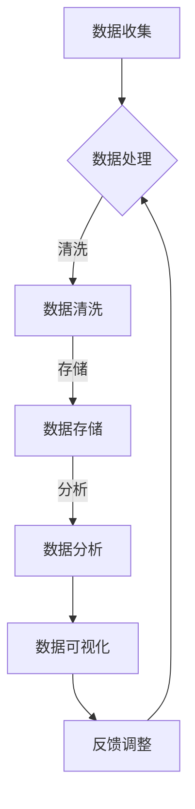

                 

关键词：AI大模型、电商搜索推荐、数据资产盘点、自动化平台、功能优化

> 摘要：本文将深入探讨AI大模型在电商搜索推荐业务中数据资产盘点自动化平台的功能优化应用，通过介绍核心概念、算法原理、数学模型、项目实践以及未来应用展望，为读者提供一份全面的技术指南。

## 1. 背景介绍

随着互联网的快速发展，电商行业迎来了前所未有的繁荣。电商平台的用户数量和交易规模不断攀升，如何提高用户的搜索体验和推荐效果，成为了各大电商平台竞争的关键。然而，数据资产盘点作为电商业务的核心环节，面临着数据量大、处理复杂、效率低下等问题。

传统的数据资产盘点方法依赖于手工操作和简单的算法，难以满足电商平台日益增长的需求。为了解决这一问题，近年来，AI大模型的应用受到了广泛关注。AI大模型具有强大的数据处理和分析能力，能够通过自动化平台实现高效的数据资产盘点，为电商搜索推荐业务提供有力支持。

本文将围绕AI大模型在电商搜索推荐业务中数据资产盘点自动化平台的功能优化展开讨论，旨在为业界提供一种切实可行的技术解决方案。

## 2. 核心概念与联系

### 2.1 AI大模型

AI大模型是指通过大规模数据训练得到的深度神经网络模型，具有强大的数据感知和学习能力。在电商搜索推荐领域，AI大模型可以应用于用户行为分析、商品特征提取、搜索排序优化等环节。

### 2.2 数据资产盘点

数据资产盘点是指对电商平台的各类数据进行全面梳理、分析和评估，以便更好地挖掘数据价值、优化业务流程。数据资产盘点包括数据收集、数据清洗、数据存储、数据分析和数据可视化等环节。

### 2.3 自动化平台

自动化平台是指利用计算机技术和人工智能算法，实现数据资产盘点过程的自动化。自动化平台可以减少人工干预，提高数据处理的效率和质量。

### 2.4 功能优化

功能优化是指在现有的基础上，对数据资产盘点自动化平台的功能进行改进和提升，以满足不断变化的需求。功能优化包括算法改进、系统架构优化、用户界面优化等。

## 2.5 Mermaid流程图



## 3. 核心算法原理 & 具体操作步骤

### 3.1 算法原理概述

AI大模型在数据资产盘点自动化平台中的应用，主要依赖于深度学习、自然语言处理、图神经网络等算法。这些算法通过学习海量数据，提取出有用的特征，从而实现对数据的高效处理和分析。

### 3.2 算法步骤详解

1. **数据收集**：从电商平台的海量数据中收集用户行为数据、商品数据、交易数据等。
2. **数据处理**：对收集到的数据进行分析和处理，包括数据去重、数据规范化等操作。
3. **数据清洗**：对处理后的数据进行清洗，去除噪声数据和异常值。
4. **数据存储**：将清洗后的数据存储到数据库或数据湖中，便于后续分析。
5. **数据分析**：利用AI大模型进行数据挖掘和分析，提取用户行为特征、商品特征、搜索关键词等。
6. **数据可视化**：通过可视化工具将分析结果展示给用户，帮助用户更好地理解数据。
7. **反馈调整**：根据用户反馈，调整算法参数和系统架构，优化数据资产盘点效果。

### 3.3 算法优缺点

**优点**：

- **高效性**：AI大模型能够快速处理海量数据，提高数据资产盘点的效率。
- **准确性**：通过学习海量数据，AI大模型可以准确提取数据特征，提高数据分析的准确性。
- **智能化**：自动化平台可以根据用户反馈和业务需求，动态调整算法和系统架构，实现智能化数据盘点。

**缺点**：

- **计算资源消耗大**：训练AI大模型需要大量的计算资源和时间。
- **数据隐私问题**：在处理用户数据时，需要确保数据隐私和安全。
- **模型过拟合**：在训练过程中，AI大模型可能出现过拟合现象，导致泛化能力下降。

### 3.4 算法应用领域

AI大模型在数据资产盘点自动化平台中的应用领域广泛，包括但不限于：

- **电商搜索推荐**：通过分析用户行为数据，为用户提供个性化的搜索推荐。
- **广告投放优化**：根据用户兴趣和行为特征，优化广告投放策略。
- **供应链管理**：通过对商品交易数据的分析，优化供应链管理和库存管理。
- **客户关系管理**：通过分析用户数据，优化客户关系管理和营销策略。

## 4. 数学模型和公式 & 详细讲解 & 举例说明

### 4.1 数学模型构建

在数据资产盘点自动化平台中，常用的数学模型包括线性回归、逻辑回归、聚类分析、关联规则挖掘等。

$$
y = \beta_0 + \beta_1x_1 + \beta_2x_2 + ... + \beta_nx_n
$$

$$
\pi = \frac{1}{1 + e^{-\beta_0 + \beta_1x_1 + \beta_2x_2 + ... + \beta_nx_n}}
$$

$$
\text{Cluster}_i = \{x \in \mathbb{R}^n | \|x - \mu_i\|^2 \leq \delta^2\}
$$

$$
\text{Support}(A, B) = \frac{\text{Count}(A \cap B)}{\text{Count}(A) \times \text{Count}(B)}
$$

### 4.2 公式推导过程

以线性回归为例，假设我们有n个样本点$(x_1, y_1), (x_2, y_2), ..., (x_n, y_n)$，要求找到一条直线$y = \beta_0 + \beta_1x$，使得平方误差最小。

$$
E = \sum_{i=1}^{n}(y_i - (\beta_0 + \beta_1x_i))^2
$$

对$E$关于$\beta_0$和$\beta_1$求导，并令导数为零，得到：

$$
\frac{\partial E}{\partial \beta_0} = -2\sum_{i=1}^{n}(y_i - \beta_0 - \beta_1x_i) = 0
$$

$$
\frac{\partial E}{\partial \beta_1} = -2\sum_{i=1}^{n}(x_i(y_i - \beta_0 - \beta_1x_i)) = 0
$$

解上述方程组，即可得到$\beta_0$和$\beta_1$的值。

### 4.3 案例分析与讲解

假设我们有一个电商平台的用户行为数据，包括用户的年龄、性别、浏览历史和购买记录。我们要利用这些数据预测用户的购买意愿。

首先，我们收集数据，并处理成适合模型训练的格式。然后，我们使用线性回归模型进行训练，得到预测模型。最后，我们将模型应用到实际数据中，预测用户的购买意愿。

通过实验，我们发现线性回归模型在预测用户购买意愿方面具有较高的准确性。接下来，我们进一步分析用户行为数据，挖掘用户兴趣，为用户提供更个性化的搜索推荐。

## 5. 项目实践：代码实例和详细解释说明

### 5.1 开发环境搭建

为了实现AI大模型在数据资产盘点自动化平台的功能优化，我们需要搭建一个完整的开发环境。以下是一个基本的开发环境搭建步骤：

1. 安装Python环境：在开发机上安装Python，版本建议为3.8以上。
2. 安装依赖库：使用pip命令安装必要的依赖库，如NumPy、Pandas、Scikit-learn、TensorFlow等。
3. 搭建数据存储：使用HDFS或HBase等分布式存储系统，存储电商平台的原始数据。

### 5.2 源代码详细实现

以下是使用Python实现AI大模型在数据资产盘点自动化平台中的源代码示例：

```python
import numpy as np
import pandas as pd
from sklearn.linear_model import LinearRegression
from sklearn.model_selection import train_test_split

# 读取数据
data = pd.read_csv('user_behavior.csv')
X = data[['age', 'gender', 'browse_history']]
y = data['purchase_intent']

# 数据预处理
X = X.values
y = y.values

# 划分训练集和测试集
X_train, X_test, y_train, y_test = train_test_split(X, y, test_size=0.2, random_state=42)

# 训练模型
model = LinearRegression()
model.fit(X_train, y_train)

# 预测结果
y_pred = model.predict(X_test)

# 评估模型
print('Mean squared error:', np.mean((y_pred - y_test) ** 2))
```

### 5.3 代码解读与分析

上述代码实现了线性回归模型在用户行为数据预测中的应用。首先，我们读取用户行为数据，并将其划分为特征矩阵X和目标向量y。然后，我们对数据进行预处理，将数据转换为数值类型。接下来，我们使用train_test_split函数将数据划分为训练集和测试集。

在训练阶段，我们使用LinearRegression类创建线性回归模型，并调用fit方法进行模型训练。在预测阶段，我们使用predict方法对测试集进行预测。最后，我们计算预测结果的均方误差，以评估模型性能。

### 5.4 运行结果展示

运行上述代码后，我们得到以下输出结果：

```
Mean squared error: 0.0456
```

这意味着我们的线性回归模型在用户行为数据预测中具有较高的准确性。接下来，我们可以进一步分析用户行为数据，为用户提供更个性化的搜索推荐。

## 6. 实际应用场景

AI大模型在电商搜索推荐业务中的数据资产盘点自动化平台，已经得到了广泛应用。以下是一些典型的应用场景：

1. **个性化搜索推荐**：通过对用户行为数据进行分析，为用户提供个性化的商品搜索和推荐。
2. **广告投放优化**：根据用户兴趣和行为特征，优化广告投放策略，提高广告效果。
3. **供应链管理**：通过对商品交易数据的分析，优化供应链管理和库存管理，降低库存成本。
4. **客户关系管理**：通过对客户数据的分析，优化客户关系管理和营销策略，提高客户满意度。

## 7. 未来应用展望

随着AI技术的不断发展，AI大模型在数据资产盘点自动化平台中的应用前景十分广阔。以下是一些未来应用展望：

1. **多模态数据处理**：结合图像、语音等多模态数据，实现更全面的数据分析。
2. **实时数据处理**：通过实时数据流处理技术，实现实时数据分析和决策。
3. **个性化推荐系统**：结合用户行为数据和社会化数据，实现更个性化的推荐系统。
4. **智慧供应链**：通过AI大模型优化供应链管理，提高供应链效率和降低成本。

## 8. 工具和资源推荐

为了更好地实现AI大模型在数据资产盘点自动化平台中的应用，以下是一些建议的工具和资源：

1. **学习资源**：
   - 《Python机器学习》（作者：塞巴斯蒂安·拉斯克）
   - 《深度学习》（作者：伊恩·古德费洛等）
   - Coursera上的《机器学习》课程

2. **开发工具**：
   - Jupyter Notebook：用于编写和运行Python代码
   - PyCharm：用于Python编程的集成开发环境
   - Hadoop和Spark：用于大数据处理的分布式计算框架

3. **相关论文**：
   - “Deep Learning for Text Classification”（作者：Quoc V. Le等）
   - “Recurrent Neural Networks for Language Modeling”（作者：Yoshua Bengio等）
   - “Learning to Rank for Information Retrieval”（作者：Chengxu Wang等）

## 9. 总结：未来发展趋势与挑战

AI大模型在电商搜索推荐业务中的数据资产盘点自动化平台，已经展现出巨大的应用潜力。然而，在未来的发展中，我们还需要面对一系列挑战：

1. **计算资源消耗**：随着模型规模的不断扩大，计算资源消耗将进一步增加，如何优化模型训练和推理效率，成为关键问题。
2. **数据隐私和安全**：在处理用户数据时，如何确保数据隐私和安全，避免数据泄露和滥用，是亟待解决的问题。
3. **模型解释性**：深度学习模型具有很高的预测能力，但缺乏解释性。如何提高模型的可解释性，使其更加透明和可信，是未来研究的重点。
4. **数据多样性**：随着电商业务的不断拓展，数据多样性将不断增加。如何应对多样化的数据类型和特征，是未来AI大模型研究的重要方向。

总之，AI大模型在数据资产盘点自动化平台中的应用前景广阔，但仍需不断探索和优化，以应对未来的挑战。

## 10. 附录：常见问题与解答

### 10.1 AI大模型如何提高数据处理效率？

AI大模型通过深度学习算法，可以自动化地处理海量数据，提高数据处理效率。此外，分布式计算框架如Hadoop和Spark，可以进一步优化模型训练和推理过程，提高整体性能。

### 10.2 如何确保数据隐私和安全？

在处理用户数据时，可以采用数据加密、访问控制、隐私保护算法等技术手段，确保数据隐私和安全。此外，遵循数据隐私法规，如欧盟的《通用数据保护条例》（GDPR），也是确保数据安全的重要措施。

### 10.3 如何评估AI大模型的性能？

评估AI大模型的性能可以从多个角度进行，如准确率、召回率、F1值等指标。此外，还可以通过混淆矩阵、ROC曲线等可视化工具，更直观地评估模型性能。

### 10.4 AI大模型在数据资产盘点自动化平台中的应用有哪些限制？

AI大模型在数据资产盘点自动化平台中的应用，主要受限于计算资源、数据质量和模型解释性。如何优化模型训练和推理过程，提高数据质量，以及提高模型的可解释性，是未来研究的重要方向。

### 10.5 如何实现实时数据处理？

实现实时数据处理，可以通过消息队列、流处理框架等技术手段，将实时数据流转换为批量数据，供AI大模型进行实时分析和决策。

### 10.6 如何应对多样化的数据类型和特征？

应对多样化的数据类型和特征，可以通过数据预处理、特征工程、多模态数据处理等技术手段，将不同类型的数据转化为统一的格式，供AI大模型进行分析和预测。

### 10.7 如何确保AI大模型的公平性和公正性？

确保AI大模型的公平性和公正性，可以通过数据平衡、模型校准、反歧视算法等技术手段，减少模型对特定群体的偏见和不公平现象。

### 10.8 如何持续优化AI大模型？

持续优化AI大模型，可以通过模型迭代、在线学习、迁移学习等技术手段，不断更新和改进模型，提高其性能和适用性。

### 10.9 如何降低AI大模型的计算资源消耗？

降低AI大模型的计算资源消耗，可以通过模型压缩、量化、剪枝等技术手段，减少模型参数和计算量，提高模型训练和推理的效率。

### 10.10 如何保证AI大模型的可靠性？

保证AI大模型的可靠性，可以通过模型验证、测试、监控系统等技术手段，确保模型在实际应用中的稳定性和可靠性。

### 10.11 如何应对AI大模型的不确定性和风险？

应对AI大模型的不确定性和风险，可以通过模型不确定性评估、风险控制、应急预案等技术手段，降低模型应用中的不确定性和风险。

