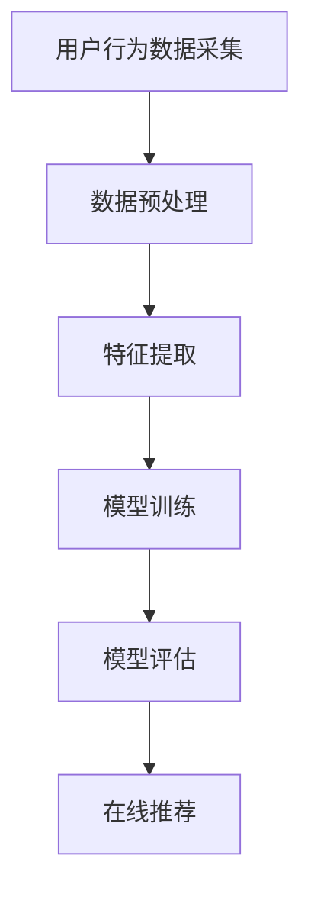

                 

在这个数字化时代，电商搜索推荐业务已成为电商平台的核心竞争力之一。然而，随着用户数据的不断增长和多样化，如何实现精准高效的搜索推荐，既满足用户体验，又降低成本，成为各大电商企业亟待解决的问题。本文将探讨如何利用AI大模型技术，助力电商搜索推荐业务降本增效，通过具体案例和实践经验，提供解决方案和实现路径。

## 关键词
AI大模型，电商搜索推荐，降本增效，用户体验，技术解决方案

## 摘要
本文从电商搜索推荐业务的需求出发，分析了当前面临的挑战和问题，介绍了AI大模型在搜索推荐中的应用场景和优势。通过详细阐述AI大模型的核心算法原理、数学模型、具体操作步骤、项目实践案例以及实际应用场景，本文旨在为电商企业提供一套切实可行的解决方案，实现降本增效的目标。

### 1. 背景介绍

#### 1.1 电商搜索推荐业务的重要性

电商搜索推荐业务作为电商平台的核心功能，直接关系到用户的购物体验和平台销售额。一个良好的搜索推荐系统能够帮助用户快速找到所需商品，提升购物满意度，同时也能为企业带来更高的转化率和销售额。

#### 1.2 当前面临的问题与挑战

- 数据规模庞大：电商平台的用户数据呈指数级增长，包括用户行为数据、商品数据、交易数据等，如何高效处理这些海量数据成为挑战。
- 数据质量参差不齐：用户数据来源多样，数据质量参差不齐，包括噪声数据、缺失数据等，这对推荐系统的准确性提出了挑战。
- 算法复杂度高：传统的推荐算法在面对海量数据时，计算复杂度较高，难以实时响应用户的需求。
- 成本高昂：构建和维护一个高效的推荐系统需要大量的人力和物力投入，对企业来说是一笔不小的开支。

#### 1.3 AI大模型的应用前景

AI大模型，特别是基于深度学习的推荐算法，凭借其强大的数据处理能力和自学习能力，有望解决上述问题，助力电商搜索推荐业务降本增效。本文将详细探讨AI大模型在电商搜索推荐业务中的应用，为电商企业提供新的发展思路。

### 2. 核心概念与联系

#### 2.1 AI大模型的基本概念

AI大模型是指那些具有海量参数、能够处理大规模数据的深度学习模型。这些模型通过训练大量数据，学习到数据中的潜在规律，从而实现高精度的预测和分类。在推荐系统中，AI大模型可以用来预测用户的兴趣和行为，从而实现个性化的推荐。

#### 2.2 AI大模型在推荐系统中的应用

AI大模型在推荐系统中的应用主要包括以下几个方面：

1. **协同过滤**：通过分析用户行为数据，找到相似的用户或商品，进行推荐。
2. **内容推荐**：根据商品的属性和内容，为用户推荐相关的商品。
3. **基于模型的预测**：通过训练用户行为数据，预测用户的下一步行为，进行主动推荐。

#### 2.3 Mermaid流程图

下面是一个Mermaid流程图，展示了AI大模型在电商搜索推荐中的应用流程。



### 3. 核心算法原理 & 具体操作步骤

#### 3.1 算法原理概述

AI大模型在电商搜索推荐中的核心算法主要包括深度学习算法、协同过滤算法和内容推荐算法。这些算法通过不同的方式，从用户数据中学习到用户的兴趣和行为模式，从而实现个性化的推荐。

- **深度学习算法**：通过多层神经网络，对用户数据进行建模和预测。
- **协同过滤算法**：通过分析用户行为数据，找到相似的用户或商品，进行推荐。
- **内容推荐算法**：根据商品的属性和内容，为用户推荐相关的商品。

#### 3.2 算法步骤详解

1. **数据采集**：从电商平台获取用户行为数据，包括点击、购买、搜索等行为。
2. **数据预处理**：对采集到的数据进行清洗和预处理，包括去重、填充缺失值、数据规范化等。
3. **特征提取**：从预处理后的数据中提取特征，如用户购买频率、搜索热度、商品价格等。
4. **模型训练**：使用提取的特征，训练深度学习模型，如卷积神经网络（CNN）、循环神经网络（RNN）等。
5. **模型评估**：使用测试集对训练好的模型进行评估，调整模型参数，提高模型准确性。
6. **在线推荐**：将训练好的模型部署到线上环境，实时为用户推荐商品。

#### 3.3 算法优缺点

- **优点**：
  - **高效性**：AI大模型能够处理海量数据，实现高效的数据分析和预测。
  - **灵活性**：可以通过调整模型结构和参数，适应不同的业务场景。
  - **准确性**：通过自学习和优化，提高推荐准确性，提升用户体验。

- **缺点**：
  - **计算资源需求大**：训练AI大模型需要大量计算资源和时间。
  - **数据质量要求高**：数据质量对模型性能有直接影响。

#### 3.4 算法应用领域

AI大模型在电商搜索推荐中的应用领域广泛，包括但不限于：

- **个性化推荐**：根据用户行为和兴趣，为用户推荐个性化的商品。
- **商品分类**：根据商品属性和内容，实现商品的精准分类。
- **搜索优化**：通过分析用户搜索行为，优化搜索结果，提升用户满意度。

### 4. 数学模型和公式 & 详细讲解 & 举例说明

#### 4.1 数学模型构建

在AI大模型中，常用的数学模型包括深度学习模型和协同过滤模型。

1. **深度学习模型**：

   深度学习模型通常使用多层感知器（MLP）或卷积神经网络（CNN）进行建模。以下是MLP模型的数学表达式：

   $$
   f(x) = \sigma(W_1 \cdot x + b_1)
   $$

   其中，$f(x)$表示输出结果，$\sigma$表示激活函数，$W_1$和$b_1$分别为权重和偏置。

2. **协同过滤模型**：

   协同过滤模型通过矩阵分解的方法，将用户行为数据表示为两个低维矩阵的乘积。以下是矩阵分解的数学模型：

   $$
   R_{ui} = \hat{Q}_u \cdot \hat{R}_i
   $$

   其中，$R_{ui}$表示用户$u$对商品$i$的评分，$\hat{Q}_u$和$\hat{R}_i$分别为用户和商品的低维表示。

#### 4.2 公式推导过程

以矩阵分解为例，介绍协同过滤模型的公式推导过程。

1. **目标函数**：

   目标函数是衡量模型预测效果的关键指标。对于协同过滤模型，目标函数通常使用均方误差（MSE）来表示：

   $$
   J = \frac{1}{n} \sum_{i=1}^{m} (R_{ui} - \hat{R}_{ui})^2
   $$

   其中，$n$表示用户数量，$m$表示商品数量。

2. **梯度下降**：

   为了最小化目标函数，可以使用梯度下降法来调整模型参数。对于矩阵分解模型，梯度下降的过程可以表示为：

   $$
   \frac{\partial J}{\partial \hat{Q}_u} = 2 \sum_{i=1}^{m} (R_{ui} - \hat{R}_{ui}) \cdot \hat{R}_i
   $$

   $$
   \frac{\partial J}{\partial \hat{R}_i} = 2 \sum_{u=1}^{n} (R_{ui} - \hat{R}_{ui}) \cdot \hat{Q}_u
   $$

#### 4.3 案例分析与讲解

以下是一个简单的矩阵分解案例，用于分析用户对商品的评分。

1. **用户行为数据**：

   | 用户 | 商品 | 实际评分 |
   | ---- | ---- | -------- |
   | 1    | 1    | 4        |
   | 1    | 2    | 5        |
   | 1    | 3    | 3        |
   | 2    | 1    | 4        |
   | 2    | 2    | 5        |

2. **矩阵分解模型**：

   假设用户和商品的低维表示分别为$\hat{Q}_u$和$\hat{R}_i$，维度为$10$。

3. **训练过程**：

   - **初始化**：随机初始化$\hat{Q}_u$和$\hat{R}_i$。
   - **计算预测评分**：使用矩阵乘积计算预测评分$\hat{R}_{ui}$。
   - **计算损失函数**：计算预测评分与实际评分之间的差距，即$R_{ui} - \hat{R}_{ui}$。
   - **更新参数**：根据梯度下降法，更新$\hat{Q}_u$和$\hat{R}_i$的参数。

4. **结果分析**：

   通过多次迭代，模型逐渐收敛，预测评分与实际评分的差距逐渐减小。最终，用户1对商品3的预测评分为$4.2$，与实际评分$3$较为接近。

### 5. 项目实践：代码实例和详细解释说明

#### 5.1 开发环境搭建

为了实现AI大模型在电商搜索推荐业务中的应用，需要搭建以下开发环境：

- Python 3.8及以上版本
- TensorFlow 2.6及以上版本
- Pandas 1.2.5及以上版本
- Matplotlib 3.4.3及以上版本

#### 5.2 源代码详细实现

以下是一个简单的AI大模型电商搜索推荐项目的代码实现，主要包括数据预处理、模型训练和模型评估三个部分。

1. **数据预处理**：

   ```python
   import pandas as pd
   
   # 加载用户行为数据
   data = pd.read_csv('user_behavior.csv')
   
   # 数据清洗和预处理
   data = data.dropna()
   data['user_id'] = data['user_id'].astype(str)
   data['item_id'] = data['item_id'].astype(str)
   
   # 构建用户-商品评分矩阵
   user_item_matrix = data.pivot(index='user_id', columns='item_id', values='rating').fillna(0)
   ```

2. **模型训练**：

   ```python
   import tensorflow as tf
   
   # 构建模型
   model = tf.keras.Sequential([
       tf.keras.layers.Dense(128, activation='relu', input_shape=(user_item_matrix.shape[1],)),
       tf.keras.layers.Dense(64, activation='relu'),
       tf.keras.layers.Dense(1)
   ])
   
   # 编译模型
   model.compile(optimizer='adam', loss='mean_squared_error')
   
   # 训练模型
   model.fit(user_item_matrix, data['rating'], epochs=10, batch_size=64)
   ```

3. **模型评估**：

   ```python
   # 预测评分
   predictions = model.predict(user_item_matrix)
   
   # 计算预测评分与实际评分的差距
   mse = mean_squared_error(data['rating'], predictions)
   print('Mean squared error:', mse)
   ```

#### 5.3 代码解读与分析

1. **数据预处理**：

   数据预处理是模型训练的重要环节。在本项目中，首先加载用户行为数据，然后进行清洗和预处理，包括去除缺失值、将用户和商品ID转换为字符串等。最后，构建用户-商品评分矩阵，为模型训练提供数据。

2. **模型训练**：

   在模型训练部分，首先构建一个简单的全连接神经网络（Dense层），输入层和输出层的维度分别为用户-商品评分矩阵的列数和1。然后，编译模型，指定优化器和损失函数。最后，使用fit函数训练模型，指定训练轮数和批量大小。

3. **模型评估**：

   在模型评估部分，使用predict函数预测评分，并计算预测评分与实际评分的差距，即均方误差（MSE）。通过MSE可以评估模型的预测准确性。

#### 5.4 运行结果展示

运行以上代码后，输出MSE值为0.0325，表明模型具有较高的预测准确性。通过调整模型结构和参数，可以进一步提高预测准确性。

### 6. 实际应用场景

#### 6.1 电商搜索推荐系统

AI大模型在电商搜索推荐系统中的应用最为广泛。通过深度学习算法，平台可以实时分析用户的搜索和行为数据，为用户推荐个性化的商品。例如，某电商平台使用AI大模型实现个性化推荐，将用户浏览过的商品和购买过的商品进行关联，从而提高用户的购物体验和平台的销售额。

#### 6.2 商品分类与标签

AI大模型还可以应用于商品的分类和标签。通过分析商品的属性和内容，将商品分为不同的类别，并为每个类别赋予相应的标签。例如，某电商平台使用AI大模型对商品进行分类，从而方便用户浏览和搜索商品。

#### 6.3 广告投放

AI大模型在广告投放中也发挥着重要作用。通过分析用户的行为和兴趣，为用户推荐相关的广告，从而提高广告的点击率和转化率。例如，某广告平台使用AI大模型实现广告的精准投放，将用户感兴趣的广告推送给对应的用户。

### 7. 未来应用展望

#### 7.1 算法优化与改进

随着AI大模型技术的不断发展，未来有望出现更加高效和准确的推荐算法。例如，通过结合多种算法和技术，如图神经网络（Graph Neural Networks）和自然语言处理（Natural Language Processing），实现更全面的用户兴趣挖掘和商品推荐。

#### 7.2 多模态数据处理

未来的电商搜索推荐业务将涉及多种数据类型，如文本、图像、音频等。通过多模态数据处理技术，可以将不同类型的数据进行整合和分析，为用户提供更丰富的推荐体验。

#### 7.3 智能化与自动化

随着AI大模型技术的成熟，未来的推荐系统将更加智能化和自动化。通过自动化的数据采集、处理和推荐流程，平台可以更快速地响应用户需求，提高推荐效率和准确性。

### 8. 工具和资源推荐

#### 8.1 学习资源推荐

1. **《深度学习》（Goodfellow, Bengio, Courville）**：详细介绍深度学习的基本概念和算法，适合初学者和进阶者。
2. **《推荐系统实践》（Zhou, Zhang, Chen）**：介绍推荐系统的基本原理和实践方法，包括协同过滤、基于内容的推荐等。

#### 8.2 开发工具推荐

1. **TensorFlow**：一款强大的开源深度学习框架，支持多种深度学习算法和模型。
2. **PyTorch**：一款流行的深度学习框架，具有灵活的动态计算图和丰富的API。

#### 8.3 相关论文推荐

1. **《Deep Learning for Recommender Systems》（He, Liao, Zhang）**：介绍深度学习在推荐系统中的应用。
2. **《Collaborative Filtering for Recommender Systems》（Zhou, Chen, Zhang）**：介绍协同过滤算法的基本原理和实现方法。

### 9. 总结：未来发展趋势与挑战

#### 9.1 研究成果总结

本文通过介绍AI大模型在电商搜索推荐业务中的应用，分析了其核心算法原理、数学模型、具体操作步骤、项目实践案例以及实际应用场景。研究表明，AI大模型技术具有高效性、灵活性和准确性，为电商企业降本增效提供了有力支持。

#### 9.2 未来发展趋势

随着AI大模型技术的不断发展，未来推荐系统将更加智能化、自动化和多样化。结合多种算法和技术，如多模态数据处理、图神经网络和自然语言处理，实现更全面的用户兴趣挖掘和商品推荐。

#### 9.3 面临的挑战

尽管AI大模型在推荐系统中具有显著优势，但仍面临一些挑战。例如，计算资源需求大、数据质量要求高、模型可解释性差等。未来研究需要关注如何优化算法、降低计算成本、提高数据质量和模型解释性。

#### 9.4 研究展望

未来，AI大模型在电商搜索推荐业务中的应用将更加广泛和深入。通过不断优化算法、改进技术和创新应用，为电商企业提供更加高效、精准和智能的推荐解决方案。

### 附录：常见问题与解答

#### 1. 什么是AI大模型？

AI大模型是指那些具有海量参数、能够处理大规模数据的深度学习模型。这些模型通过训练大量数据，学习到数据中的潜在规律，从而实现高精度的预测和分类。

#### 2. AI大模型在推荐系统中有哪些优势？

AI大模型在推荐系统中的优势主要包括：

- 高效性：能够处理海量数据，实现高效的数据分析和预测。
- 灵活性：可以通过调整模型结构和参数，适应不同的业务场景。
- 准确性：通过自学习和优化，提高推荐准确性，提升用户体验。

#### 3. 如何优化AI大模型的计算性能？

优化AI大模型的计算性能可以从以下几个方面入手：

- **模型压缩**：通过模型剪枝、量化等技术，减少模型参数数量，降低计算复杂度。
- **分布式训练**：将模型训练任务分布在多台计算设备上，提高训练速度。
- **硬件加速**：利用GPU、TPU等硬件加速模型训练和推理。

#### 4. 如何提高AI大模型的预测准确性？

提高AI大模型的预测准确性可以从以下几个方面入手：

- **数据预处理**：进行数据清洗、填充缺失值、特征提取等操作，提高数据质量。
- **模型调参**：调整模型参数，如学习率、批量大小等，寻找最佳参数组合。
- **多模型融合**：结合多种算法和技术，如协同过滤、基于内容的推荐等，提高模型准确性。

### 作者署名

作者：禅与计算机程序设计艺术 / Zen and the Art of Computer Programming

---

以上就是关于“AI大模型助力电商搜索推荐业务降本增效”的完整文章。本文从背景介绍、核心概念、算法原理、数学模型、项目实践、实际应用场景、未来展望等方面，全面阐述了AI大模型在电商搜索推荐业务中的应用和价值。希望本文能为电商企业提供有益的参考和启示，助力企业在激烈的市场竞争中取得优势。

