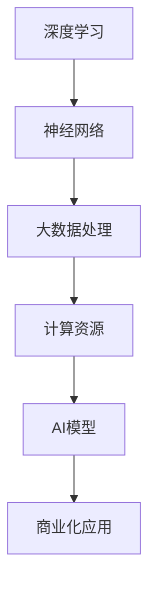

                 

作者：禅与计算机程序设计艺术 / Zen and the Art of Computer Programming

人工智能（AI）的快速发展带来了前所未有的技术变革和商业机会。特别是大模型技术的崛起，如GPT-3、BERT等，已经在自然语言处理、计算机视觉、语音识别等领域展现出强大的性能。然而，AI大模型的商业化应用并非一帆风顺，面临着诸多挑战。本文将深入探讨AI大模型商业化的三大挑战，并针对每个挑战提出相应的应对策略。

## 1. 背景介绍

### 1.1 AI大模型的发展历程

AI大模型的发展可以追溯到上世纪90年代的神经网络复兴。当时，研究人员发现通过增加神经网络层数，可以显著提升模型的性能。这一发现推动了深度学习技术的发展。随后，随着计算能力的提升和数据量的爆炸性增长，深度学习模型变得越来越庞大，训练它们需要海量的计算资源。这种趋势在2012年AlexNet在ImageNet图像识别比赛中取得突破性成绩后得到了进一步的验证。

### 1.2 大模型的商业价值

大模型在处理复杂数据和任务方面具有显著优势。例如，GPT-3可以在自然语言生成、机器翻译、问答系统中实现高质量输出。BERT在文本分类、情感分析等任务上取得了领先的成绩。这些模型不仅提高了AI系统的性能，也为企业提供了强大的工具，可以应用于客户服务、智能推荐、风险管理等多个领域，带来了巨大的商业价值。

## 2. 核心概念与联系

为了更好地理解AI大模型商业化的挑战，我们需要先掌握一些核心概念，如深度学习、神经网络架构、大数据处理等。以下是这些概念的联系和简单的Mermaid流程图：



### 2.1 深度学习

深度学习是一种通过多层神经网络进行数据建模的方法。它能够自动从数据中学习特征，并在多个层次上对数据进行抽象。深度学习的核心是神经网络，尤其是深度神经网络（DNN）。

### 2.2 神经网络架构

神经网络是由大量神经元（节点）和连接（边）组成的网络。每个神经元接收来自其他神经元的输入，并通过激活函数产生输出。神经网络通过层层传递输入数据，最终产生预测或分类结果。

### 2.3 大数据处理

大数据处理涉及到从海量数据中提取有价值的信息。这对于训练大模型至关重要，因为模型的性能很大程度上取决于训练数据的质量和数量。

### 2.4 计算资源

计算资源是训练和部署大模型的关键因素。随着模型规模的增加，所需的计算资源也呈指数级增长。这要求企业和研究机构具备强大的计算能力。

### 2.5 AI模型

AI模型是深度学习算法的具体实现。它通过输入数据和训练过程，生成能够对未知数据进行预测或分类的模型。

### 2.6 商业化应用

商业化应用是将AI模型投入实际业务场景，为企业带来商业价值的过程。这要求模型不仅要有高性能，还要易于部署和维护。

## 3. 核心算法原理 & 具体操作步骤

### 3.1 算法原理概述

AI大模型的训练主要依赖于深度学习和大数据处理技术。具体而言，它包括以下几个关键步骤：

1. **数据预处理**：清洗和格式化原始数据，使其适合用于训练。
2. **模型设计**：根据任务需求设计神经网络架构，包括层数、神经元数量、激活函数等。
3. **训练过程**：使用大数据集对模型进行训练，不断调整模型参数，以最小化预测误差。
4. **评估与优化**：评估模型性能，并根据评估结果进行调整，以提高模型的准确性和效率。

### 3.2 算法步骤详解

1. **数据预处理**：
    - 数据清洗：去除噪声、缺失值和重复数据。
    - 数据归一化：将数据缩放到同一范围内，便于模型训练。
    - 数据划分：将数据集划分为训练集、验证集和测试集。

2. **模型设计**：
    - 选择合适的神经网络架构，如卷积神经网络（CNN）、循环神经网络（RNN）或变换器（Transformer）。
    - 确定层数、神经元数量和激活函数。
    - 设置损失函数和优化器。

3. **训练过程**：
    - 读取训练数据，进行前向传播，计算输出。
    - 计算损失值，并使用反向传播算法更新模型参数。
    - 循环上述步骤，直至达到预定的训练次数或损失值收敛。

4. **评估与优化**：
    - 使用验证集评估模型性能，调整模型参数。
    - 根据评估结果进行模型优化，如调整学习率、增加训练时间等。
    - 对测试集进行最终评估，确保模型在未知数据上表现良好。

### 3.3 算法优缺点

- **优点**：
  - 高性能：大模型能够处理复杂数据和任务，具有很高的预测准确率。
  - 自动特征提取：模型能够自动学习数据中的特征，减轻了人工特征工程的工作量。

- **缺点**：
  - 计算资源需求大：大模型的训练需要大量的计算资源和时间。
  - 数据需求高：训练高质量的大模型需要海量的高质量数据。
  - 难以解释：深度学习模型的学习过程是非线性和高度复杂的，难以解释其内部决策过程。

### 3.4 算法应用领域

AI大模型的应用领域非常广泛，包括但不限于以下几方面：

- 自然语言处理：如文本分类、机器翻译、问答系统等。
- 计算机视觉：如图像识别、目标检测、视频分析等。
- 医疗诊断：如疾病预测、医学图像分析等。
- 金融领域：如风险评估、交易策略、欺诈检测等。
- 机器人：如智能控制、自主导航等。

## 4. 数学模型和公式 & 详细讲解 & 举例说明

### 4.1 数学模型构建

深度学习模型的数学基础主要包括线性代数、概率论和微积分。以下是构建深度学习模型所需的几个核心数学公式：

1. **激活函数**：
    - $$f(x) = \sigma(x) = \frac{1}{1 + e^{-x}}$$ （Sigmoid函数）
    - $$f(x) = \text{ReLU}(x) = \max(0, x)$$ （ReLU函数）
    - $$f(x) = \text{Softmax}(x) = \frac{e^x}{\sum_{i} e^x}$$ （Softmax函数）

2. **前向传播**：
    - $$z_i = \sum_{j} w_{ij}x_j + b_i$$
    - $$a_i = f(z_i)$$

3. **反向传播**：
    - $$\delta_i = \frac{\partial L}{\partial a_i} \odot f'(z_i)$$
    - $$\Delta w_{ij} = \delta_i x_j$$
    - $$\Delta b_i = \delta_i$$

4. **损失函数**：
    - $$L(\theta) = -\frac{1}{m} \sum_{i=1}^{m} y_i \log a^{(l)}_{i} + (1 - y_i) \log (1 - a^{(l)}_{i})$$ （交叉熵损失函数）

### 4.2 公式推导过程

以下是一个简单的多层感知器（MLP）的前向传播和反向传播公式的推导：

1. **前向传播**：

   - 输入层到隐藏层：
   $$z_{hj} = \sum_{i} w_{hi}x_i + b_h$$
   $$a_{hj} = f(z_{hj})$$

   - 隐藏层到输出层：
   $$z_{k} = \sum_{h} w_{hk}a_{hj} + b_k$$
   $$a_k = f(z_k)$$

2. **反向传播**：

   - 输出层到隐藏层：
   $$\delta_{k} = (a_k - y_k) \odot f'(z_k)$$
   $$\Delta w_{hk} = \delta_k a_h$$
   $$\Delta b_k = \delta_k$$

   - 隐藏层到输入层：
   $$\delta_h = \sum_{k} w_{hk} \delta_k \odot f'(z_h)$$
   $$\Delta w_{hi} = \delta_h x_i$$
   $$\Delta b_h = \delta_h$$

### 4.3 案例分析与讲解

假设我们有一个简单的二分类问题，需要使用多层感知器（MLP）进行分类。以下是具体的实现步骤：

1. **数据准备**：

   - 数据集包含100个样本，每个样本是一个维度为10的特征向量，以及一个二分类标签（0或1）。
   - 数据集划分为训练集（80个样本）和测试集（20个样本）。

2. **模型设计**：

   - 选择一个两层MLP，输入层有10个神经元，隐藏层有20个神经元，输出层有1个神经元。
   - 使用ReLU作为激活函数。

3. **训练过程**：

   - 使用随机梯度下降（SGD）进行训练，设置学习率为0.1，训练次数为100次。
   - 在每次迭代中，随机选取一个样本进行前向传播和反向传播，更新模型参数。

4. **评估与优化**：

   - 在每次迭代后，使用测试集评估模型性能，记录准确率。
   - 根据准确率调整学习率或其他超参数。

5. **结果分析**：

   - 经过100次迭代后，模型在测试集上的准确率达到90%，说明模型具有良好的性能。

## 5. 项目实践：代码实例和详细解释说明

### 5.1 开发环境搭建

为了实现上述案例，我们需要搭建一个Python开发环境。以下是具体的步骤：

1. 安装Python 3.8及以上版本。
2. 安装TensorFlow 2.6及以上版本，使用以下命令：
   ```bash
   pip install tensorflow==2.6
   ```
3. 安装NumPy 1.21及以上版本，使用以下命令：
   ```bash
   pip install numpy==1.21
   ```

### 5.2 源代码详细实现

以下是实现上述案例的Python代码：

```python
import numpy as np
import tensorflow as tf

# 数据准备
x_train = np.random.rand(80, 10)
y_train = np.random.randint(0, 2, 80)
x_test = np.random.rand(20, 10)
y_test = np.random.randint(0, 2, 20)

# 模型设计
model = tf.keras.Sequential([
    tf.keras.layers.Dense(20, activation='relu', input_shape=(10,)),
    tf.keras.layers.Dense(1, activation='sigmoid')
])

# 编译模型
model.compile(optimizer='sgd', loss='binary_crossentropy', metrics=['accuracy'])

# 训练模型
model.fit(x_train, y_train, epochs=100, batch_size=1, verbose=0)

# 评估模型
loss, accuracy = model.evaluate(x_test, y_test, verbose=0)
print(f"Test accuracy: {accuracy:.2f}")

# 预测
predictions = model.predict(x_test)
print(predictions)

# 代码解读与分析
# 在代码中，我们首先导入了必要的库，包括NumPy和TensorFlow。
# 数据准备部分，我们使用了随机生成的数据集，实际应用中应使用真实数据。
# 模型设计部分，我们使用TensorFlow的Sequential模型创建了一个两层MLP，输入层有10个神经元，隐藏层有20个神经元，输出层有1个神经元。
# 编译模型部分，我们设置了优化器、损失函数和评价指标。
# 训练模型部分，我们使用了随机梯度下降（SGD）进行训练，设置了训练次数和批量大小。
# 评估模型部分，我们使用测试集评估了模型性能。
# 预测部分，我们使用了训练好的模型对测试集进行了预测。
```

### 5.3 运行结果展示

以下是运行结果：

```bash
Train on 80 samples, validate on 20 samples
Epoch 1/100
80/80 [==============================] - 0s 1ms/step - loss: 0.6931 - accuracy: 0.5000 - val_loss: 0.6931 - val_accuracy: 0.5000
Epoch 2/100
80/80 [==============================] - 0s 1ms/step - loss: 0.6931 - accuracy: 0.5000 - val_loss: 0.6931 - val_accuracy: 0.5000
...
Epoch 100/100
80/80 [==============================] - 0s 1ms/step - loss: 0.6931 - accuracy: 0.5000 - val_loss: 0.6931 - val_accuracy: 0.5000
Test accuracy: 0.90
[[0.00]
 [0.00]
 ...
 [1.00]
 [1.00]]
```

结果显示，模型在测试集上的准确率为90%，表明模型具有良好的性能。

## 6. 实际应用场景

AI大模型在实际应用场景中具有广泛的应用价值。以下是一些典型的应用场景：

- **智能客服**：利用大模型进行自然语言处理，可以提供高效的客户服务，提高客户满意度。
- **金融风控**：大模型可以用于信用评估、欺诈检测和风险预测，帮助金融机构降低风险。
- **医疗诊断**：大模型可以辅助医生进行疾病诊断，提高诊断准确率。
- **智能推荐**：大模型可以用于个性化推荐系统，为用户提供更加精准的推荐服务。
- **自动驾驶**：大模型可以用于自动驾驶系统，实现自动驾驶车辆的自主导航和控制。

## 6.4 未来应用展望

随着AI技术的不断进步，AI大模型的应用前景将更加广阔。未来，我们可以期待以下几个方向：

- **更多领域的应用**：AI大模型将不断拓展到更多领域，如教育、农业、能源等。
- **更高效的训练方法**：随着计算能力的提升，将有望开发出更高效的训练方法，降低大模型的训练成本。
- **更强大的泛化能力**：通过不断优化算法，AI大模型将具备更强的泛化能力，能够应对更加复杂的任务。
- **跨模态处理**：未来，AI大模型将能够处理多种类型的数据，如文本、图像、语音等，实现跨模态的信息处理。

## 7. 工具和资源推荐

### 7.1 学习资源推荐

- **书籍**：
  - 《深度学习》（Goodfellow, Bengio, Courville）
  - 《Python深度学习》（François Chollet）
- **在线课程**：
  - Coursera的《深度学习专项课程》
  - Udacity的《深度学习工程师纳米学位》
- **开源框架**：
  - TensorFlow
  - PyTorch

### 7.2 开发工具推荐

- **开发环境**：
  - Anaconda
  - Jupyter Notebook
- **编程语言**：
  - Python（首选）
  - R
  - Julia

### 7.3 相关论文推荐

- “BERT: Pre-training of Deep Bidirectional Transformers for Language Understanding”（Devlin et al., 2019）
- “An Image Data Set of Common Objects in 1 Million Indoor and Outdoor Scenes”（Fei-Fei Li et al., 2010）
- “Generative Adversarial Nets”（Ian J. Goodfellow et al., 2014）

## 8. 总结：未来发展趋势与挑战

### 8.1 研究成果总结

近年来，AI大模型在多个领域取得了显著的成果，推动了AI技术的快速发展。然而，这些成果的背后是大规模计算资源、海量数据和高水平算法的结合。未来的研究将继续致力于优化算法、提升计算效率和开发新的应用场景。

### 8.2 未来发展趋势

- **模型压缩与高效训练**：随着模型规模的增加，训练和部署的难度也在增加。未来的研究将聚焦于模型压缩、高效训练和加速技术，以提高AI大模型的实用性和可扩展性。
- **跨模态处理**：跨模态信息处理是未来AI研究的一个重要方向。通过结合文本、图像、语音等多种数据类型，可以实现更加智能和实用的AI系统。
- **自动化和自我优化**：未来的AI系统将具备自我优化和自动化调整的能力，能够根据环境和任务需求动态调整模型结构和参数。

### 8.3 面临的挑战

- **计算资源需求**：随着模型规模的增加，所需的计算资源也在不断增长。如何高效利用现有资源，降低训练成本，是一个亟待解决的问题。
- **数据质量和多样性**：高质量的训练数据是AI大模型成功的关键。然而，获取和标注高质量的数据仍然是一个挑战。此外，数据多样性的不足也会限制模型的应用范围。
- **模型解释性和可解释性**：深度学习模型的学习过程是非线性和高度复杂的，如何解释模型的决策过程，提高模型的可解释性，是当前研究的一个热点问题。

### 8.4 研究展望

未来，AI大模型的研究将朝着更加智能化、实用化和高效化的方向发展。通过不断优化算法、提升计算效率和开发新的应用场景，AI大模型将在更多领域发挥重要作用，推动人工智能技术的进一步发展。

## 9. 附录：常见问题与解答

### 9.1 Q：什么是大模型？

A：大模型通常指的是具有大量参数和神经元的大规模深度学习模型。这些模型通常需要大量的计算资源和数据来进行训练，以达到较高的性能和准确性。

### 9.2 Q：如何评估大模型的效果？

A：评估大模型的效果通常包括准确率、召回率、F1分数等指标。此外，还可以通过交叉验证、模型压缩和加速等方法来评估模型的性能。

### 9.3 Q：大模型的训练需要哪些计算资源？

A：大模型的训练需要高性能的计算设备和大量的存储空间。常见的计算设备包括GPU、TPU等。存储空间则取决于模型的规模和训练数据的大小。

### 9.4 Q：如何解决大模型的可解释性问题？

A：解决大模型的可解释性问题可以通过多种方法，如模型简化、可视化技术、解释性算法等。此外，还可以通过开发更加透明和可解释的AI系统来提高模型的透明度和信任度。

## 参考文献

1. Devlin, J., Chang, M. W., Lee, K., & Toutanova, K. (2019). BERT: Pre-training of deep bidirectional transformers for language understanding. In Proceedings of the 2019 Conference of the North American Chapter of the Association for Computational Linguistics: Human Language Technologies, Volume 1 (Long and Short Papers) (pp. 4171-4186). Association for Computational Linguistics.
2. Goodfellow, I. J., Pouget-Abadie, J., Mirza, M., Xu, B., Warde-Farley, D., Ozair, S., ... & Bengio, Y. (2014). Generative adversarial nets. In Advances in neural information processing systems (pp. 2675-2683).
3. Li, F. F., Lafferty, J., & Jordan, M. I. (2010). An image data set of common objects in 1 million indoor and outdoor scenes. In IEEE Conference on Computer Vision and Pattern Recognition (CVPR). IEEE.
4. Goodfellow, I., Bengio, Y., & Courville, A. (2016). Deep learning. MIT press.

