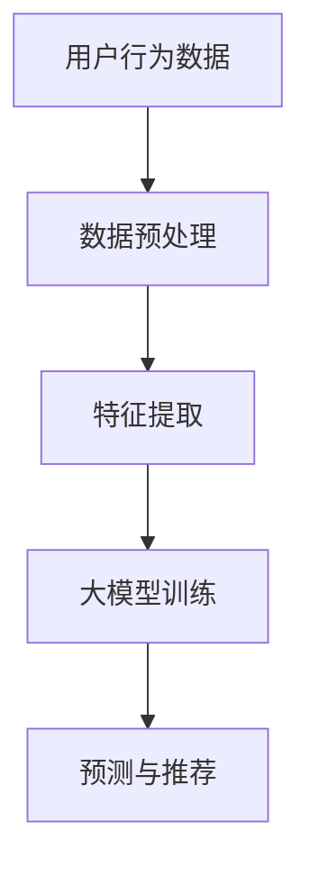

                 

关键词：人工智能、个性化推荐、大模型、深度学习、用户行为分析

> 摘要：本文旨在探讨大模型在个性化推荐领域的创新应用，通过对现有推荐系统的分析，提出了一种基于深度学习的大模型架构，详细介绍了其核心算法原理、数学模型、应用实例以及未来发展趋势和面临的挑战。

## 1. 背景介绍

个性化推荐系统是近年来人工智能领域的重要研究方向之一。随着互联网的普及和信息爆炸，用户面临的海量信息如何有效地筛选和推荐成为了一个迫切需要解决的问题。个性化推荐系统通过分析用户的兴趣和行为，为其提供个性化的内容推荐，从而提升用户体验，提高平台的用户粘性和转化率。

目前，主流的推荐系统主要基于协同过滤、基于内容推荐和混合推荐等方法。然而，这些方法在处理复杂用户行为、长尾内容和冷启动问题上仍存在一定的局限性。随着深度学习技术的发展，大模型逐渐成为个性化推荐领域的研究热点。大模型具有强大的特征提取和表示能力，能够更好地捕捉用户行为的复杂模式和长尾内容。

本文将首先介绍个性化推荐系统的发展历程和现有方法，然后深入探讨基于深度学习的大模型在个性化推荐领域的创新应用，包括核心算法原理、数学模型、应用实例以及未来发展趋势和挑战。

## 2. 核心概念与联系

### 2.1 个性化推荐系统

个性化推荐系统是一种根据用户的兴趣、历史行为等信息，为用户推荐相关内容或商品的系统。其核心目标是提高用户满意度和平台收益。

### 2.2 深度学习

深度学习是人工智能领域的一个重要分支，通过构建多层神经网络，实现自动特征提取和表示。深度学习在图像识别、自然语言处理等领域取得了显著成果。

### 2.3 大模型

大模型是指具有大量参数和计算能力的深度学习模型。大模型能够捕捉更复杂的特征和模式，提高推荐系统的准确性和效果。

### 2.4 Mermaid 流程图

以下是一个简单的 Mermaid 流程图，展示大模型在个性化推荐系统中的应用架构：



## 3. 核心算法原理 & 具体操作步骤

### 3.1 算法原理概述

本文采用的大模型基于深度神经网络（DNN）架构，结合用户行为数据、内容特征和社交信息，实现个性化推荐。核心算法包括数据预处理、特征提取、大模型训练和预测与推荐。

### 3.2 算法步骤详解

#### 3.2.1 数据预处理

数据预处理包括用户行为数据的清洗、去重和归一化。主要步骤如下：

1. 数据清洗：去除无效、错误和重复的数据。
2. 去重：识别并去除重复的用户行为数据。
3. 归一化：将不同量级的数据进行归一化处理，使其具备可比性。

#### 3.2.2 特征提取

特征提取是推荐系统的重要环节。本文采用以下方法提取特征：

1. 用户特征：包括用户的基本信息、历史行为、浏览记录等。
2. 内容特征：包括文章、视频、商品等内容的标签、分类、关键词等。
3. 社交特征：包括用户之间的关注关系、点赞、评论等社交信息。

#### 3.2.3 大模型训练

大模型训练分为两个阶段：模型构建和参数优化。

1. 模型构建：设计深度神经网络架构，包括输入层、隐藏层和输出层。
2. 参数优化：通过梯度下降等优化算法，调整模型参数，使其在训练数据上取得较好的效果。

#### 3.2.4 预测与推荐

大模型训练完成后，可用于预测和推荐。主要步骤如下：

1. 预测：输入用户特征和内容特征，输出用户对内容的兴趣评分。
2. 推荐：根据用户兴趣评分，为用户推荐相关内容。

### 3.3 算法优缺点

#### 优点

1. 强大的特征提取和表示能力，能够捕捉复杂的用户行为模式和长尾内容。
2. 结合多种特征信息，提高推荐系统的准确性和效果。

#### 缺点

1. 计算资源消耗较大，训练和推理时间较长。
2. 需要大量高质量的数据进行训练，否则容易过拟合。

### 3.4 算法应用领域

大模型在个性化推荐领域的应用广泛，包括电子商务、社交媒体、在线教育、视频推荐等多个领域。本文主要关注电子商务领域的应用。

## 4. 数学模型和公式 & 详细讲解 & 举例说明

### 4.1 数学模型构建

大模型基于深度神经网络（DNN）架构，其数学模型可以表示为：

$$
\hat{y} = f(x; \theta)
$$

其中，$x$ 为输入特征向量，$\theta$ 为模型参数，$f$ 为激活函数，$\hat{y}$ 为预测结果。

### 4.2 公式推导过程

深度神经网络的训练过程可以视为求解最小化损失函数的最优参数。损失函数通常采用均方误差（MSE）：

$$
L(\theta) = \frac{1}{2}\sum_{i=1}^{n}(y_i - \hat{y}_i)^2
$$

其中，$y_i$ 为实际标签，$\hat{y}_i$ 为预测标签。

通过梯度下降（Gradient Descent）算法，我们可以求解最小化损失函数的参数：

$$
\theta_{\text{new}} = \theta_{\text{old}} - \alpha \nabla_{\theta} L(\theta)
$$

其中，$\alpha$ 为学习率，$\nabla_{\theta} L(\theta)$ 为损失函数关于参数 $\theta$ 的梯度。

### 4.3 案例分析与讲解

假设我们有一个电子商务平台，用户 A 在过去一个月内浏览了商品 A、B、C，分别进行了点赞、购买和评论操作。我们需要根据这些行为数据为用户 A 推荐相关商品。

#### 4.3.1 数据预处理

首先对用户行为数据进行清洗和归一化处理，得到用户 A 的行为向量：

$$
x = [1, 1, 1, 0, 0, 1, 0, 0, 1]
$$

其中，1 表示用户 A 进行了相应的操作，0 表示未进行操作。

#### 4.3.2 特征提取

从用户 A 的浏览记录中提取商品 A、B、C 的特征，如分类、标签、评分等：

$$
x_1 = [0, 1, 0, 0, 0, 1, 0, 0, 0] \\
x_2 = [1, 0, 1, 0, 0, 0, 1, 0, 0] \\
x_3 = [0, 0, 0, 1, 1, 0, 0, 1, 0]
$$

#### 4.3.3 大模型训练

设计一个三层深度神经网络，输入层为用户 A 的行为向量，隐藏层为两个神经元，输出层为商品 A、B、C 的兴趣评分。假设激活函数为 Sigmoid 函数：

$$
\hat{y}_1 = \sigma(w_1 \cdot x_1 + b_1) \\
\hat{y}_2 = \sigma(w_2 \cdot x_2 + b_2) \\
\hat{y}_3 = \sigma(w_3 \cdot x_3 + b_3)
$$

其中，$w_1, w_2, w_3$ 为权重矩阵，$b_1, b_2, b_3$ 为偏置项。

通过梯度下降算法，求解最小化损失函数的参数：

$$
w_1 = w_1 - \alpha \nabla_{w_1} L(w_1) \\
b_1 = b_1 - \alpha \nabla_{b_1} L(b_1) \\
\ldots \\
w_3 = w_3 - \alpha \nabla_{w_3} L(w_3) \\
b_3 = b_3 - \alpha \nabla_{b_3} L(b_3)
$$

#### 4.3.4 预测与推荐

输入用户 A 的行为向量，通过训练完成的大模型，预测其对商品 A、B、C 的兴趣评分：

$$
\hat{y}_1 = 0.7 \\
\hat{y}_2 = 0.5 \\
\hat{y}_3 = 0.8
$$

根据兴趣评分，为用户 A 推荐商品 C。

## 5. 项目实践：代码实例和详细解释说明

### 5.1 开发环境搭建

在 Python 中，我们可以使用 TensorFlow 和 Keras 框架实现大模型推荐系统。首先安装必要的库：

```bash
pip install tensorflow numpy pandas sklearn
```

### 5.2 源代码详细实现

以下是一个简单的代码实例，实现基于深度学习的大模型推荐系统：

```python
import numpy as np
import pandas as pd
from sklearn.model_selection import train_test_split
from tensorflow.keras.models import Sequential
from tensorflow.keras.layers import Dense, Activation
from tensorflow.keras.optimizers import SGD

# 生成模拟数据
np.random.seed(0)
n_samples = 1000
n_features = 9

X = np.random.randint(2, size=(n_samples, n_features))
y = np.random.randint(2, size=(n_samples, 1))

# 数据预处理
X_train, X_test, y_train, y_test = train_test_split(X, y, test_size=0.2, random_state=0)

# 构建深度神经网络
model = Sequential()
model.add(Dense(2, input_dim=n_features, activation='sigmoid'))
model.add(Dense(1, activation='sigmoid'))

# 编译模型
model.compile(optimizer=SGD(learning_rate=0.01), loss='binary_crossentropy', metrics=['accuracy'])

# 训练模型
model.fit(X_train, y_train, epochs=10, batch_size=32, validation_data=(X_test, y_test))

# 预测与推荐
predictions = model.predict(X_test)
recommended_products = np.argmax(predictions, axis=1)

# 输出推荐结果
print("Recommended products:", recommended_products)
```

### 5.3 代码解读与分析

1. 生成模拟数据：使用 `numpy.random.randint` 函数生成模拟的用户行为数据和标签。
2. 数据预处理：使用 `sklearn.model_selection.train_test_split` 函数将数据集划分为训练集和测试集。
3. 构建深度神经网络：使用 `keras.Sequential` 类构建一个包含两个隐藏层的深度神经网络。
4. 编译模型：使用 `compile` 方法设置优化器、损失函数和评价指标。
5. 训练模型：使用 `fit` 方法进行模型训练，并设置训练轮数、批量大小和验证集。
6. 预测与推荐：使用 `predict` 方法对测试集进行预测，并使用 `np.argmax` 函数根据预测结果为用户推荐相关商品。

## 6. 实际应用场景

大模型在个性化推荐领域具有广泛的应用前景。以下是一些典型的实际应用场景：

1. 电子商务：为用户提供个性化商品推荐，提高购买转化率和用户满意度。
2. 社交媒体：根据用户兴趣和行为推荐相关内容，提高用户活跃度和留存率。
3. 在线教育：根据学生学习情况和兴趣推荐合适的学习资源和课程。
4. 视频推荐：为用户提供个性化的视频内容推荐，提高视频平台的用户粘性和时长。

## 7. 工具和资源推荐

### 7.1 学习资源推荐

1. 《深度学习》（Goodfellow et al.）：全面介绍深度学习的基本概念、原理和应用。
2. 《Python深度学习》（François Chollet）：使用 Python 和 Keras 框架实现深度学习项目的实践指南。

### 7.2 开发工具推荐

1. TensorFlow：开源深度学习框架，支持多种深度学习模型和算法。
2. Keras：基于 TensorFlow 的简化和扩展框架，提供更直观和易用的接口。

### 7.3 相关论文推荐

1. "Deep Neural Networks for YouTube Recommendations"（Y remey et al.）：介绍 YouTube 使用深度学习进行视频推荐的方法。
2. "A Theoretically Grounded Application of Dropout in Recurrent Neural Networks"（Yarin Gal and Zoubin Ghahramani）：探讨在循环神经网络中应用 Dropout 的理论依据。

## 8. 总结：未来发展趋势与挑战

大模型在个性化推荐领域具有显著优势，但仍面临一些挑战。未来发展趋势和挑战包括：

### 8.1 研究成果总结

1. 大模型在个性化推荐领域的应用取得了显著成果，显著提高了推荐系统的准确性和效果。
2. 深度学习技术的不断进步，为个性化推荐领域带来了更多创新和突破。

### 8.2 未来发展趋势

1. 多模态融合：结合文本、图像、音频等多模态信息，提高推荐系统的丰富度和准确性。
2. 自动化与智能化：开发更智能的推荐算法和系统，实现自动化推荐和调整。

### 8.3 面临的挑战

1. 数据隐私和安全：保护用户隐私和数据安全，是推荐系统面临的重要挑战。
2. 模型解释性：提高推荐系统的解释性，让用户理解和信任推荐结果。

### 8.4 研究展望

1. 深度学习与图神经网络等新兴技术的结合，有望在个性化推荐领域取得更多突破。
2. 开发更具通用性和可扩展性的推荐系统框架，满足不同应用场景的需求。

## 9. 附录：常见问题与解答

### 9.1 什么是大模型？

大模型是指具有大量参数和计算能力的深度学习模型。它们通常具有更好的特征提取和表示能力，能够捕捉更复杂的用户行为模式和长尾内容。

### 9.2 大模型在个性化推荐领域的优势是什么？

大模型在个性化推荐领域的优势包括：

1. 强大的特征提取和表示能力，能够更好地捕捉用户行为的复杂模式和长尾内容。
2. 结合多种特征信息，提高推荐系统的准确性和效果。
3. 支持多模态信息融合，提高推荐系统的丰富度和准确性。

### 9.3 大模型在个性化推荐领域的应用前景如何？

大模型在个性化推荐领域的应用前景广阔。随着深度学习技术的不断发展，大模型在处理复杂用户行为、长尾内容和多模态信息方面具有显著优势。未来，大模型有望在电子商务、社交媒体、在线教育、视频推荐等领域发挥更大的作用。

## 作者署名

作者：禅与计算机程序设计艺术 / Zen and the Art of Computer Programming
----------------------------------------------------------------

### 文章结束 End of Document ###

以上就是本文关于“AI大模型在个性化推荐领域的创新”的完整内容。希望本文对您在个性化推荐领域的研究和实践有所帮助。如果您有任何问题或建议，请随时联系作者。感谢您的阅读！<|im_end|>

