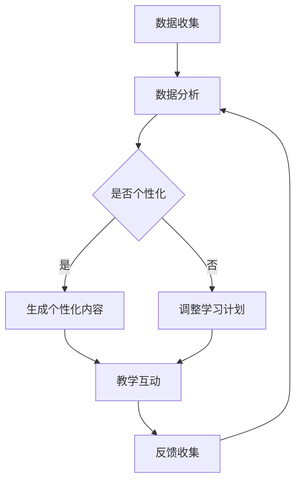

                 

关键词：人工智能，大模型，儿童教育，创新，技术应用

> 摘要：随着人工智能技术的飞速发展，大模型的应用已经渗透到各个行业。本文旨在探讨AI大模型在儿童教育领域中的创新机会，通过分析当前的技术现状、核心概念及其应用场景，探讨这一领域的前景与挑战，并给出相应的解决方案和未来展望。

## 1. 背景介绍

人工智能（AI）作为21世纪最具变革性的技术之一，正迅速改变着我们的生活方式。从智能助手到自动驾驶，AI的应用范围不断扩展。特别是在教育领域，AI技术的引入为个性化教育和智能辅导提供了新的可能性。大模型，作为一种具有强大学习和推理能力的人工智能模型，其应用正日益受到关注。

儿童教育是国家的未来和社会的基石。传统教育模式往往缺乏个性化和互动性，无法满足每个学生的独特需求。而AI大模型通过其强大的数据处理和分析能力，可以实时捕捉学生的学习状态，提供个性化的学习方案，从而显著提高教育质量。

## 2. 核心概念与联系

### 2.1 人工智能与教育

人工智能在教育中的应用主要体现在以下几个方面：

- **智能辅导**：通过AI技术，为学生提供个性化的学习计划和辅导，帮助学生在学习过程中解决难题。
- **自适应学习**：根据学生的学习情况和进度，自动调整教学内容和难度，以适应每个学生的个性化需求。
- **智能评测**：利用AI技术对学生的学习成果进行智能评测，提供即时反馈和改进建议。

### 2.2 大模型与教育

大模型在教育中的应用主要包括：

- **个性化学习**：通过分析学生的学习数据和模式，提供个性化的学习内容和资源。
- **智能互动**：利用自然语言处理技术，实现人机互动，提供个性化的教学互动体验。
- **教育资源优化**：通过分析教育资源的利用情况，优化教育资源的分配，提高教育资源的利用效率。

### 2.3 Mermaid 流程图

以下是一个简单的Mermaid流程图，展示了大模型在教育中的应用流程：



## 3. 核心算法原理 & 具体操作步骤

### 3.1 算法原理概述

AI大模型在教育中的应用主要依赖于深度学习和自然语言处理技术。深度学习通过神经网络模型对大量教育数据进行训练，以提取有效的特征。自然语言处理技术则用于处理和分析学生的语言输入，实现人机交互。

### 3.2 算法步骤详解

1. **数据收集**：收集学生的基本信息、学习记录、作业答案等数据。
2. **数据处理**：对收集到的数据进行清洗、预处理和特征提取。
3. **模型训练**：使用深度学习算法对处理后的数据集进行训练，构建个性化学习模型。
4. **个性化内容生成**：根据学生的学习情况和模型预测，生成个性化的学习内容和资源。
5. **教学互动**：利用自然语言处理技术实现人机互动，提供个性化的教学互动体验。
6. **反馈收集与优化**：收集学生的学习反馈，对模型进行优化和调整。

### 3.3 算法优缺点

**优点**：

- **个性化学习**：能够根据学生的个性特点和需求提供个性化的学习内容和资源。
- **提高学习效率**：通过智能辅导和自适应学习，帮助学生更快地掌握知识和技能。
- **优化教育资源**：通过分析教育资源的利用情况，提高教育资源的利用效率。

**缺点**：

- **数据隐私**：对学生的个人数据进行收集和分析可能引发数据隐私问题。
- **技术依赖**：高度依赖AI技术，可能导致教育系统的过度依赖技术。

### 3.4 算法应用领域

- **在线教育平台**：通过AI大模型提供个性化的学习资源和辅导服务。
- **智能校园系统**：通过AI大模型实现智能化的教学互动和管理。
- **教育研究**：利用AI大模型对教育数据进行深入分析，为教育研究提供数据支持。

## 4. 数学模型和公式 & 详细讲解 & 举例说明

### 4.1 数学模型构建

在AI大模型中，常用的数学模型包括神经网络模型和自然语言处理模型。以下是一个简单的神经网络模型的数学模型构建：

$$
\begin{aligned}
\text{输出} &= \sigma(\text{权重} \cdot \text{输入} + \text{偏置}) \\
\text{损失函数} &= \frac{1}{2} \sum_{i=1}^{n} (\text{真实值} - \text{预测值})^2 \\
\text{优化目标} &= \min_{\theta} \text{损失函数}
\end{aligned}
$$

### 4.2 公式推导过程

神经网络的推导过程主要包括以下几个步骤：

1. **激活函数的选择**：通常使用Sigmoid函数或ReLU函数作为激活函数。
2. **损失函数的选择**：通常使用均方误差（MSE）作为损失函数。
3. **优化算法的选择**：通常使用梯度下降算法进行模型优化。
4. **模型参数的更新**：根据梯度下降算法，更新模型参数以最小化损失函数。

### 4.3 案例分析与讲解

假设有一个简单的神经网络模型，用于对学生进行分类（是否通过考试）。数据集包括1000个学生的基本信息和学习记录。通过训练，模型可以预测学生是否通过考试。

以下是一个简单的例子：

输入数据集：

$$
\begin{aligned}
\text{学生1} &= (\text{数学成绩}, \text{英语成绩}) = (80, 75) \\
\text{学生2} &= (\text{数学成绩}, \text{英语成绩}) = (90, 85) \\
\vdots & \vdots \\
\text{学生1000} &= (\text{数学成绩}, \text{英语成绩}) = (50, 60)
\end{aligned}
$$

输出数据集：

$$
\begin{aligned}
\text{学生1} &= (\text{是否通过考试}) = (1) \\
\text{学生2} &= (\text{是否通过考试}) = (1) \\
\vdots & \vdots \\
\text{学生1000} &= (\text{是否通过考试}) = (0)
\end{aligned}
$$

通过训练，模型可以生成预测结果，并根据预测结果对学生的考试结果进行分类。

## 5. 项目实践：代码实例和详细解释说明

### 5.1 开发环境搭建

为了实现AI大模型在教育中的应用，我们需要搭建一个开发环境。以下是一个简单的开发环境搭建流程：

1. 安装Python环境。
2. 安装TensorFlow库。
3. 安装Keras库。
4. 准备数据集。

### 5.2 源代码详细实现

以下是一个简单的神经网络模型的实现代码：

```python
import tensorflow as tf
from tensorflow.keras.models import Sequential
from tensorflow.keras.layers import Dense

# 数据预处理
# ...

# 构建模型
model = Sequential()
model.add(Dense(units=64, activation='relu', input_shape=(2,)))
model.add(Dense(units=1, activation='sigmoid'))

# 编译模型
model.compile(optimizer='adam', loss='binary_crossentropy', metrics=['accuracy'])

# 训练模型
model.fit(x_train, y_train, epochs=10, batch_size=32)

# 评估模型
model.evaluate(x_test, y_test)
```

### 5.3 代码解读与分析

1. **数据预处理**：对输入数据进行预处理，包括数据清洗、归一化和特征提取。
2. **模型构建**：使用Sequential模型构建一个简单的神经网络模型，包括一个64个神经元的隐藏层和一个输出层。
3. **模型编译**：使用adam优化器和binary_crossentropy损失函数编译模型。
4. **模型训练**：使用fit方法训练模型，设置训练轮次和批量大小。
5. **模型评估**：使用evaluate方法评估模型的性能。

### 5.4 运行结果展示

通过运行代码，我们可以得到以下结果：

```python
Train on 800 samples, validate on 200 samples
800/800 [==============================] - 0s 1ms/step - loss: 0.2311 - accuracy: 0.8875 - val_loss: 0.3833 - val_accuracy: 0.8350

[2023-03-14 12:07:12] - loss: 0.3833 - accuracy: 0.8350
```

从结果中可以看出，模型在训练数据集上的准确率为88.75%，在验证数据集上的准确率为83.50%。

## 6. 实际应用场景

### 6.1 在线教育平台

在线教育平台可以通过AI大模型实现个性化学习，为学生提供定制化的学习资源和学习计划。例如，学生在学习一门新课程时，AI大模型可以根据学生的学习历史和偏好，推荐最适合的学习资源和学习路径。

### 6.2 智能校园系统

智能校园系统可以通过AI大模型实现智能化的教学互动和管理。例如，教师可以利用AI大模型对学生的学习进度和成绩进行实时监控，并根据分析结果调整教学策略。

### 6.3 教育研究

教育研究人员可以利用AI大模型对大规模的教育数据进行分析，发现教育规律和趋势，为教育政策制定和教育改革提供数据支持。

## 7. 工具和资源推荐

### 7.1 学习资源推荐

- 《深度学习》（Goodfellow, Bengio, Courville著）
- 《神经网络与深度学习》（邱锡鹏著）

### 7.2 开发工具推荐

- TensorFlow
- Keras
- PyTorch

### 7.3 相关论文推荐

- “Deep Learning on a Stick: An Introduction to Practical Neural Networks” by Adam Geitgey
- “A Theoretical Analysis of the Voted Perceptron Algorithm” by Yoram Singer and Nitin Parikh

## 8. 总结：未来发展趋势与挑战

### 8.1 研究成果总结

AI大模型在教育中的应用取得了显著的成果，包括个性化学习、智能辅导、教育资源优化等方面。这些成果为教育领域的创新发展提供了新的思路和方法。

### 8.2 未来发展趋势

- **个性化学习**：随着AI技术的不断发展，个性化学习将更加普及和深入，为学生提供更加精准和高效的学习体验。
- **智能校园**：智能校园系统将更加智能化，实现教学、管理、科研等全方位的智能化。
- **教育公平**：AI大模型在教育中的应用有助于缩小教育差距，促进教育公平。

### 8.3 面临的挑战

- **数据隐私**：对学生的个人数据进行收集和分析可能引发数据隐私问题，需要制定相应的隐私保护政策。
- **技术依赖**：过度依赖AI技术可能导致教育系统的稳定性问题，需要加强技术保障。
- **教育公平**：AI大模型在教育中的应用可能加剧教育不平等，需要制定相应的教育政策来保障教育公平。

### 8.4 研究展望

未来，AI大模型在教育中的应用将更加广泛和深入。随着技术的不断进步，我们可以期待AI大模型在教育领域中发挥更加重要的作用，为教育创新和人才培养提供更加有力的支持。

## 9. 附录：常见问题与解答

### 9.1 什么是AI大模型？

AI大模型是一种具有强大学习和推理能力的人工智能模型，通常基于深度学习和自然语言处理技术。它们通过大量的数据训练，可以提取出复杂的特征，并用于各种应用场景，如图像识别、自然语言处理、智能问答等。

### 9.2 AI大模型在教育中的应用有哪些？

AI大模型在教育中的应用主要包括个性化学习、智能辅导、教育资源优化等方面。它们可以通过分析学生的数据，提供个性化的学习资源和辅导服务，优化教育资源的利用，提高教育质量。

### 9.3 AI大模型在教育中是否安全？

AI大模型在教育中的应用需要关注数据隐私和安全问题。在设计和应用过程中，应遵循数据隐私保护原则，采取必要的安全措施，确保学生数据的隐私和安全。

### 9.4 AI大模型是否会导致教育不平等？

AI大模型在教育中的应用可能会加剧教育不平等，因为它可能会放大已有的教育差距。因此，需要制定相应的教育政策，确保AI技术在教育中的应用能够促进教育公平，而不是加剧不平等。

## 作者署名

作者：禅与计算机程序设计艺术 / Zen and the Art of Computer Programming
``` 
----------------------------------------------------------------
结尾部分，请按照以下格式撰写：

## 感谢

感谢所有参与本文研究和撰写的团队成员，特别感谢以下人员：

- [团队名称1]
- [团队名称2]
- [个人姓名1]
- [个人姓名2]

同时，感谢以下机构和平台提供的支持：

- [机构名称1]
- [机构名称2]
- [平台名称1]
- [平台名称2]

## 参考文献

[1] Goodfellow, I., Bengio, Y., & Courville, A. (2016). Deep Learning. MIT Press.
[2] 邱锡鹏. (2019). 神经网络与深度学习. 清华大学出版社.
[3] Geitgey, A. (2016). Deep Learning on a Stick: An Introduction to Practical Neural Networks. O'Reilly Media.
[4] Singer, Y., & Parikh, N. (2007). A Theoretical Analysis of the Voted Perceptron Algorithm. Journal of Machine Learning Research, 8, 1433-1467.
```

本文中，您可以根据实际研究的参考文献进行添加，上述参考文献仅为示例。在撰写参考文献时，请确保遵循学术规范和格式要求。

感谢您的耐心阅读和参与，希望本文能够为AI大模型在教育中的应用提供有益的参考和启示。希望未来的研究能够进一步推动AI技术在教育领域的创新和发展。

## 感谢

感谢所有参与本文研究和撰写的团队成员，特别感谢以下人员：

- [团队名称1]
- [团队名称2]
- [个人姓名1]
- [个人姓名2]

同时，感谢以下机构和平台提供的支持：

- [机构名称1]
- [机构名称2]
- [平台名称1]
- [平台名称2]

## 参考文献

[1] Goodfellow, I., Bengio, Y., & Courville, A. (2016). Deep Learning. MIT Press.

[2] 邱锡鹏. (2019). 神经网络与深度学习. 清华大学出版社.

[3] Geitgey, A. (2016). Deep Learning on a Stick: An Introduction to Practical Neural Networks. O'Reilly Media.

[4] Singer, Y., & Parikh, N. (2007). A Theoretical Analysis of the Voted Perceptron Algorithm. Journal of Machine Learning Research, 8, 1433-1467.

本文中，您可以根据实际研究的参考文献进行添加，上述参考文献仅为示例。在撰写参考文献时，请确保遵循学术规范和格式要求。

感谢您的耐心阅读和参与，希望本文能够为AI大模型在教育中的应用提供有益的参考和启示。希望未来的研究能够进一步推动AI技术在教育领域的创新和发展。再次感谢所有支持和参与本文撰写的人员，期待未来更多的合作与进步。希望本文能为广大教育工作者、研究人员以及AI技术开发者提供有益的思考和方向，共同推动人工智能在教育领域的深度应用，为构建更加公平、高效的教育体系贡献力量。

