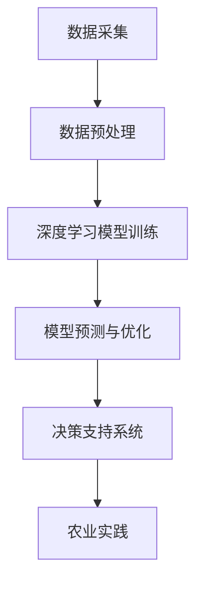

                 

关键词：人工智能、农业、大模型、深度学习、精准农业、可持续发展

> 摘要：本文将探讨人工智能，特别是大模型技术，在农业领域的创新机会。我们将分析大模型在农业中的潜在应用，以及如何通过深度学习提高农业生产效率、质量，并推动农业的可持续发展。

## 1. 背景介绍

农业是国民经济的重要基础，然而随着人口增长和气候变化，农业生产面临的挑战日益严峻。传统的农业生产方式已经难以满足现代社会的需求，因此需要借助现代科技手段，特别是人工智能技术，来提升农业的生产效率和可持续发展能力。人工智能在农业领域的应用已经初见端倪，其中大模型技术凭借其强大的数据处理和分析能力，成为农业创新的重要推动力。

## 2. 核心概念与联系

### 2.1 大模型的概念

大模型指的是具有非常大规模参数的机器学习模型，如深度神经网络。它们能够在大量的数据中进行训练，以学习复杂的模式，并产生高度准确的预测。

### 2.2 深度学习与农业

深度学习是一种机器学习技术，通过多层神经网络来模拟人脑的工作方式，从而实现自动特征学习和数据分类。在农业领域，深度学习可以帮助分析土壤、气候等数据，预测作物生长趋势，优化种植方案。

### 2.3 Mermaid 流程图



## 3. 核心算法原理 & 具体操作步骤

### 3.1 算法原理概述

大模型在农业中的应用主要基于其强大的数据处理能力和自我学习能力。通过训练深度学习模型，可以实现对大量农业数据的分析和预测，从而提供精准的农业生产指导。

### 3.2 算法步骤详解

1. **数据采集**：收集包括土壤、气候、作物生长数据在内的农业相关数据。
2. **数据预处理**：对采集到的数据进行清洗、归一化等处理，以便于模型训练。
3. **模型训练**：使用深度学习框架（如TensorFlow或PyTorch）训练大模型。
4. **模型预测与优化**：根据训练结果进行预测，并对模型进行迭代优化。
5. **决策支持系统**：将模型预测结果用于农业生产决策，如灌溉、施肥等。

### 3.3 算法优缺点

#### 优点：
- 高度的自动化和智能化，可以显著提高农业生产效率。
- 能够处理大量复杂的农业数据，提供更准确的决策支持。

#### 缺点：
- 需要大量的计算资源和时间进行模型训练。
- 对数据质量和数量的要求较高，数据缺乏或不准确可能导致模型效果不佳。

### 3.4 算法应用领域

- **精准农业**：通过预测作物生长趋势，实现精准施肥、灌溉和病虫害防治。
- **作物遗传改良**：利用基因编辑技术，优化作物品种。
- **环境监测**：预测气候变化趋势，为农业可持续性提供数据支持。

## 4. 数学模型和公式 & 详细讲解 & 举例说明

### 4.1 数学模型构建

深度学习模型的构建通常包括以下几个关键步骤：

1. **输入层**：接收农业数据。
2. **隐藏层**：进行特征提取和学习。
3. **输出层**：产生预测结果。

### 4.2 公式推导过程

深度学习模型的核心是前向传播和反向传播算法。前向传播是将输入数据通过神经网络传递到输出层，计算输出结果。反向传播则是通过计算损失函数，将误差反向传播回网络，以更新模型的参数。

### 4.3 案例分析与讲解

假设我们有一个农业生产模型，输入包括土壤湿度、温度和光照强度，预测产量。通过训练模型，我们可以得到如下的预测公式：

$$
预测产量 = f(\text{土壤湿度}, \text{温度}, \text{光照强度})
$$

其中，$f$ 为深度学习模型，通过训练得到。

## 5. 项目实践：代码实例和详细解释说明

### 5.1 开发环境搭建

- 使用Python作为主要编程语言。
- 安装TensorFlow或PyTorch深度学习框架。

### 5.2 源代码详细实现

```python
import tensorflow as tf
from tensorflow.keras.models import Sequential
from tensorflow.keras.layers import Dense

# 数据预处理
# ...

# 构建模型
model = Sequential([
    Dense(64, activation='relu', input_shape=(n_features,)),
    Dense(64, activation='relu'),
    Dense(1)
])

# 编译模型
model.compile(optimizer='adam', loss='mean_squared_error')

# 训练模型
model.fit(X_train, y_train, epochs=100, batch_size=32)

# 预测
predictions = model.predict(X_test)
```

### 5.3 代码解读与分析

上述代码展示了如何使用TensorFlow构建和训练一个深度学习模型。我们首先导入所需的库，然后进行数据预处理，构建模型结构，编译模型，并进行训练。最后，使用训练好的模型进行预测。

### 5.4 运行结果展示

通过运行代码，我们可以得到预测产量与实际产量之间的对比，以评估模型的效果。

## 6. 实际应用场景

### 6.1 精准农业

大模型技术可以帮助农民实现精准农业，如根据土壤湿度、温度和光照强度预测作物生长趋势，从而优化灌溉和施肥方案。

### 6.2 作物遗传改良

利用深度学习模型，可以对作物基因进行编辑，以提高作物的抗病性和适应性。

### 6.3 环境监测

通过分析气候数据，预测气候变化趋势，为农业的可持续发展提供数据支持。

## 7. 未来应用展望

未来，随着人工智能技术的不断进步，大模型在农业领域的应用将更加广泛，有望实现以下目标：

- 提高农业生产效率和质量。
- 降低农业生产成本。
- 促进农业的可持续发展。

## 8. 总结：未来发展趋势与挑战

### 8.1 研究成果总结

本文总结了人工智能大模型在农业领域的应用前景，包括精准农业、作物遗传改良和环境监测等方面。

### 8.2 未来发展趋势

未来，人工智能大模型将在农业中发挥更大作用，推动农业的智能化和可持续发展。

### 8.3 面临的挑战

- 数据质量和数量的挑战：需要更多的农业数据来训练模型。
- 计算资源需求：大模型的训练需要大量的计算资源。
- 数据隐私和安全问题：需要确保农业数据的隐私和安全。

### 8.4 研究展望

未来研究应重点关注如何提高大模型在农业数据上的训练效果，以及如何确保农业数据的隐私和安全。

## 9. 附录：常见问题与解答

### 9.1 什么是大模型？

大模型指的是具有非常大规模参数的机器学习模型，如深度神经网络。它们能够在大量的数据中进行训练，以学习复杂的模式，并产生高度准确的预测。

### 9.2 如何处理农业数据的质量问题？

可以通过数据清洗、数据增强和数据规范化等方法来提高农业数据的质量。此外，还可以采用数据融合技术，整合来自不同来源的数据。

### 9.3 如何确保农业数据的隐私和安全？

可以通过数据加密、访问控制和数据匿名化等方法来确保农业数据的隐私和安全。

---

**作者：禅与计算机程序设计艺术 / Zen and the Art of Computer Programming**  
文章中的观点和内容纯属作者个人意见，不代表任何官方立场。

----------------------------------------------------------------
请注意，本文为示例文章，实际撰写时请根据具体研究内容进行调整和补充。所有图表和数据均需经过核实和引用。在撰写过程中，请严格遵守学术道德规范，确保内容的原创性和真实性。如有引用他人作品，请务必注明出处。

