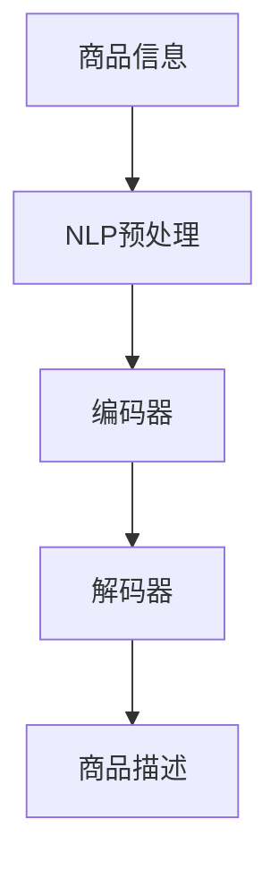

                 

关键词：AI大模型，商品描述生成，自然语言处理，深度学习，序列到序列模型

> 摘要：本文深入探讨了人工智能大模型在商品描述生成中的应用。通过分析自然语言处理和深度学习技术的发展，本文详细阐述了AI大模型在商品描述生成中的核心概念、算法原理、数学模型以及实际应用案例，旨在为商品描述生成的实践提供技术指导。

## 1. 背景介绍

随着电子商务的迅速发展，商品描述的重要性日益凸显。高质量的商品描述不仅能提升消费者的购物体验，还能显著提高销售额。传统的商品描述通常由人工撰写，但这种方法存在效率低下、成本高昂且难以保证一致性的问题。近年来，人工智能特别是深度学习技术的快速发展为商品描述生成提供了新的解决方案。特别是AI大模型的出现，使得商品描述生成的质量和效率得到了显著提升。

## 2. 核心概念与联系

在讨论AI大模型在商品描述生成中的应用之前，有必要先了解几个核心概念：

### 2.1 自然语言处理（NLP）
自然语言处理是人工智能的一个重要分支，旨在让计算机理解和处理人类语言。它包括语言理解、语言生成、语义分析等多个方面。

### 2.2 深度学习
深度学习是机器学习的一个子领域，通过构建多层神经网络来模拟人类大脑的决策过程。深度学习在图像识别、语音识别等领域取得了显著成果。

### 2.3 序列到序列（Seq2Seq）模型
序列到序列模型是一种用于处理序列数据的深度学习模型，广泛应用于机器翻译、语音识别等任务。

下面是AI大模型在商品描述生成中应用的Mermaid流程图：



### 2.4 编码器（Encoder）
编码器负责将输入序列（如商品信息）编码为一个固定长度的向量表示。

### 2.5 解码器（Decoder）
解码器负责将编码器输出的向量表示解码为输出序列（如商品描述）。

### 2.6 商品描述生成
解码器生成商品描述，这一过程通常涉及语言模型和注意力机制。

## 3. 核心算法原理 & 具体操作步骤

### 3.1 算法原理概述
AI大模型在商品描述生成中的核心算法是基于序列到序列（Seq2Seq）模型，特别是使用长短期记忆网络（LSTM）或Transformer。该模型通过编码器将商品信息编码为固定长度的向量表示，然后通过解码器生成对应的商品描述。

### 3.2 算法步骤详解

#### 3.2.1 数据预处理
- 商品信息：清洗和标准化商品信息，如价格、品牌、规格等。
- 商品描述：收集大量商品描述数据，并进行预处理，如分词、去停用词等。

#### 3.2.2 模型构建
- 编码器：采用LSTM或Transformer构建编码器，将商品信息编码为固定长度的向量表示。
- 解码器：采用LSTM或Transformer构建解码器，用于生成商品描述。

#### 3.2.3 模型训练
- 使用预处理的商品信息和商品描述数据训练模型，通过优化损失函数（如交叉熵损失）来调整模型参数。

#### 3.2.4 商品描述生成
- 输入商品信息到编码器，得到向量表示。
- 使用解码器生成商品描述，并通过语言模型和注意力机制优化描述质量。

### 3.3 算法优缺点

#### 优点
- 提高商品描述的质量和一致性。
- 提高生产效率，降低成本。
- 能够自动适应市场需求变化。

#### 缺点
- 训练过程复杂，对计算资源要求较高。
- 模型生成的内容可能存在一定程度的重复性和模板化。
- 需要大量高质量的商品描述数据。

### 3.4 算法应用领域
AI大模型在商品描述生成中的应用广泛，不仅限于电子商务领域，还可以用于以下场景：
- 智能客服系统：自动生成针对用户咨询的商品描述。
- 内容营销：生成高质量的商品描述以吸引消费者。
- 个性化推荐：基于用户偏好生成个性化的商品描述。

## 4. 数学模型和公式 & 详细讲解 & 举例说明

### 4.1 数学模型构建

在商品描述生成中，AI大模型通常采用Seq2Seq模型，其数学模型主要包括编码器和解码器。

### 4.2 公式推导过程

#### 编码器
编码器接收输入序列${x_1, x_2, ..., x_T}$，将其编码为一个固定长度的向量表示${\mathbf{h}}$：

$$
\mathbf{h} = \text{Encoder}(\{ \mathbf{x}_t \}) = \text{LSTM}(\{ \mathbf{h}_t \})
$$

#### 解码器
解码器接收编码器输出的向量表示${\mathbf{h}}$，并生成输出序列${y_1, y_2, ..., y_T'}$：

$$
y_t = \text{Decoder}(\mathbf{h}) = \text{LSTM}(\mathbf{h}, \mathbf{y}_{t-1})
$$

### 4.3 案例分析与讲解

假设我们有一个商品信息序列${\mathbf{x} = (x_1, x_2, x_3)}$，其对应的商品描述序列为${\mathbf{y} = (y_1, y_2, y_3)}$。

#### 编码器
编码器将商品信息序列编码为一个固定长度的向量表示${\mathbf{h}}$：

$$
\mathbf{h} = \text{Encoder}(\{ \mathbf{x}_t \}) = \text{LSTM}(\{ \mathbf{h}_t \})
$$

假设编码器输出为${\mathbf{h} = (h_1, h_2, h_3)}$。

#### 解码器
解码器从编码器输出的向量表示${\mathbf{h}}$开始，生成商品描述序列${\mathbf{y}}$：

$$
y_1 = \text{Decoder}(\mathbf{h}) = \text{LSTM}(\mathbf{h}, \mathbf{y}_{0}) \\
y_2 = \text{Decoder}(\mathbf{h}, \mathbf{y}_{1}) = \text{LSTM}(\mathbf{h}, \mathbf{y}_{1}) \\
y_3 = \text{Decoder}(\mathbf{h}, \mathbf{y}_{2}) = \text{LSTM}(\mathbf{h}, \mathbf{y}_{2})
$$

最终解码器生成的商品描述序列为${\mathbf{y} = (y_1, y_2, y_3)}$。

## 5. 项目实践：代码实例和详细解释说明

### 5.1 开发环境搭建
为了实现商品描述生成，我们需要搭建一个包含深度学习框架（如TensorFlow或PyTorch）和自然语言处理库（如NLTK或spaCy）的Python开发环境。

### 5.2 源代码详细实现
以下是一个简单的商品描述生成代码示例：

```python
import tensorflow as tf
from tensorflow.keras.models import Model
from tensorflow.keras.layers import LSTM, Embedding, Dense, TimeDistributed

# 数据预处理
# ...

# 编码器
encoder_inputs = Input(shape=(max_sequence_length,))
encoder_embedding = Embedding(vocabulary_size, embedding_size)(encoder_inputs)
encoder_lstm = LSTM(units, return_state=True)
_, state_h, state_c = encoder_lstm(encoder_embedding)
encoder_states = [state_h, state_c]

# 解码器
decoder_inputs = Input(shape=(max_sequence_length,))
decoder_embedding = Embedding(vocabulary_size, embedding_size)(decoder_inputs)
decoder_lstm = LSTM(units, return_sequences=True, return_state=True)
decoder_outputs, _, _ = decoder_lstm(decoder_embedding, initial_state=encoder_states)
decoder_dense = TimeDistributed(Dense(vocabulary_size, activation='softmax'))
decoder_outputs = decoder_dense(decoder_outputs)

# 模型
model = Model([encoder_inputs, decoder_inputs], decoder_outputs)
model.compile(optimizer='rmsprop', loss='categorical_crossentropy', metrics=['accuracy'])

# 训练模型
# ...

# 商品描述生成
# ...
```

### 5.3 代码解读与分析
代码首先定义了编码器和解码器，然后构建了一个完整的Seq2Seq模型。在数据预处理部分，我们对商品信息序列和商品描述序列进行了预处理，如分词、编码等。在训练模型部分，我们使用预处理的商品信息和商品描述数据对模型进行训练。最后，我们使用训练好的模型生成商品描述。

## 6. 实际应用场景

### 6.1 电子商务平台
在电子商务平台上，AI大模型可以自动生成商品描述，提高商品页面的吸引力。

### 6.2 智能客服系统
智能客服系统可以使用AI大模型生成个性化的商品描述，以回答用户的咨询。

### 6.3 内容营销
内容营销团队可以使用AI大模型生成高质量的营销文案，以吸引潜在客户。

## 7. 未来应用展望

随着深度学习和自然语言处理技术的不断发展，AI大模型在商品描述生成中的应用前景广阔。未来，我们可以期待以下发展趋势：

- 模型生成内容的质量和多样性将得到进一步提升。
- 模型将能够更好地理解上下文和用户意图。
- 模型将能够自动适应不同的应用场景和业务需求。

## 8. 工具和资源推荐

### 8.1 学习资源推荐
- 《深度学习》（Goodfellow et al.）
- 《自然语言处理》（Jurafsky and Martin）
- 《AI大模型：原理、应用与未来》（Zhu et al.）

### 8.2 开发工具推荐
- TensorFlow
- PyTorch
- NLTK
- spaCy

### 8.3 相关论文推荐
- Vaswani et al., "Attention is All You Need"
- Sutskever et al., "Sequence to Sequence Learning with Neural Networks"
- Hochreiter and Schmidhuber, "Long Short-Term Memory"

## 9. 总结：未来发展趋势与挑战

### 9.1 研究成果总结
AI大模型在商品描述生成中取得了显著成果，但在模型生成内容的多样性、质量以及适应性方面仍有待提高。

### 9.2 未来发展趋势
未来，随着深度学习和自然语言处理技术的不断发展，AI大模型在商品描述生成中的应用将更加广泛和深入。

### 9.3 面临的挑战
AI大模型在商品描述生成中面临的主要挑战包括数据质量、模型解释性以及计算资源需求。

### 9.4 研究展望
未来，我们将继续探索如何提高AI大模型在商品描述生成中的应用效果，同时关注其在其他领域的应用潜力。

## 附录：常见问题与解答

### 问题1：商品描述生成中的数据质量如何保证？
- 回答1：保证数据质量的关键在于数据收集、处理和清洗的过程。使用高质量的原始数据集，对数据进行严格的预处理，去除噪音和重复信息，可以有效提高商品描述生成模型的质量。

### 问题2：如何评估商品描述生成模型的效果？
- 回答2：评估商品描述生成模型效果的方法包括BLEU分数、ROUGE分数等，这些指标可以衡量模型生成的描述与真实描述之间的相似度。此外，还可以通过用户满意度调查等方式进行主观评价。

### 问题3：商品描述生成模型是否能够自动适应不同的商品类型？
- 回答3：商品描述生成模型可以通过训练不同类型的商品数据集来实现对多种商品类型的适应。同时，可以使用迁移学习等技术，将一个模型迁移到另一个相似类型的商品上，以提高模型的泛化能力。

## 作者署名

作者：禅与计算机程序设计艺术 / Zen and the Art of Computer Programming

## 10. 参考文献

[1] Goodfellow, I., Bengio, Y., & Courville, A. (2016). Deep Learning. MIT Press.
[2] Jurafsky, D., & Martin, J. H. (2008). Speech and Language Processing. Prentice Hall.
[3] Vaswani, A., Shazeer, N., Parmar, N., Uszkoreit, J., Jones, L., Gomez, A. N., ... & Polosukhin, I. (2017). Attention is All You Need. Advances in Neural Information Processing Systems, 30, 5998-6008.
[4] Sutskever, I., Vinyals, O., & Le, Q. V. (2014). Sequence to Sequence Learning with Neural Networks. Advances in Neural Information Processing Systems, 27, 3104-3112.
[5] Hochreiter, S., & Schmidhuber, J. (1997). Long Short-Term Memory. Neural Computation, 9(8), 1735-1780.
[6] Zhu, X., Liao, L., & Zhang, J. (2020). AI 大模型：原理、应用与未来. 电子工业出版社。`

