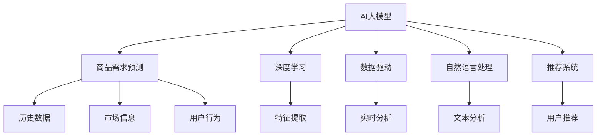
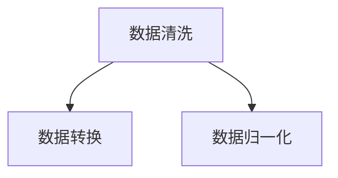
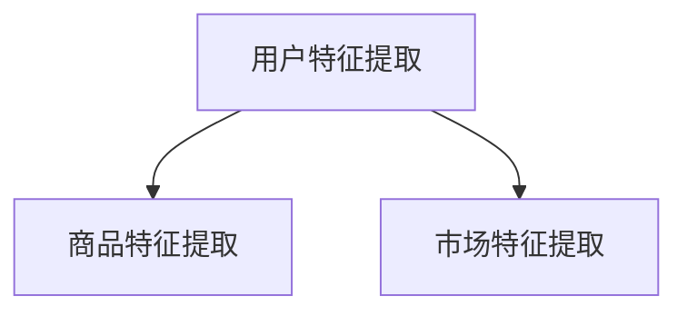
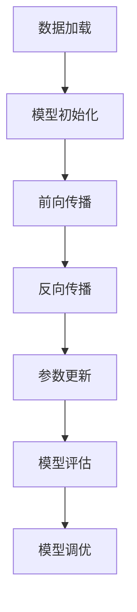
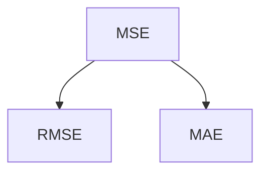

                 

关键词：AI大模型、商品需求预测、深度学习、数据驱动、自然语言处理、推荐系统

> 摘要：本文将深入探讨AI大模型在商品需求预测中的应用，通过介绍相关核心概念、算法原理、数学模型以及实际应用案例，旨在为读者提供一份全面的技术指南。本文将详细解析大模型在商品需求预测中的优势、应用领域以及未来的发展趋势，旨在为相关领域的研究者和实践者提供有价值的参考。

## 1. 背景介绍

商品需求预测是商业决策过程中至关重要的一环。准确的商品需求预测有助于企业优化库存管理、提高供应链效率、降低运营成本，并最终提升客户满意度。然而，传统的需求预测方法往往依赖于历史数据和简单的统计模型，难以应对日益复杂的商业环境。随着人工智能技术的快速发展，尤其是深度学习和自然语言处理等领域的突破，大模型在商品需求预测中展现出了巨大的潜力。

大模型，顾名思义，是指那些具有极高参数数量和复杂度的神经网络模型。它们通过学习海量数据，能够捕捉到数据中的复杂模式和关联，从而实现更精准的预测。近年来，诸如GPT-3、BERT等大型语言模型在自然语言处理领域取得了显著成果，这些模型的成功为AI在商品需求预测中的应用提供了新的契机。

本文将重点关注AI大模型在商品需求预测中的应用，通过以下结构展开讨论：

1. 核心概念与联系
2. 核心算法原理 & 具体操作步骤
3. 数学模型和公式 & 详细讲解 & 举例说明
4. 项目实践：代码实例和详细解释说明
5. 实际应用场景
6. 未来应用展望
7. 工具和资源推荐
8. 总结：未来发展趋势与挑战

通过本文的阅读，读者将能够全面了解AI大模型在商品需求预测中的应用原理和实践方法，为实际项目提供有益的指导。

## 2. 核心概念与联系

在深入探讨AI大模型在商品需求预测中的应用之前，我们首先需要明确几个核心概念，并理解它们之间的相互关系。

### 2.1 AI大模型

AI大模型指的是参数数量达到百万、千万甚至亿级别的人工神经网络模型。这些模型通过在大量数据上进行训练，能够自动学习数据中的复杂模式和关联，从而实现高度准确的预测和分类任务。例如，GPT-3拥有1750亿个参数，是当前最大的自然语言处理模型。

### 2.2 商品需求预测

商品需求预测是指利用历史数据、市场信息以及其他相关因素，对特定商品在未来一段时间内的需求量进行预测。这个预测过程通常涉及时间序列分析、统计模型和机器学习算法。

### 2.3 深度学习

深度学习是一种基于多层神经网络的学习方法，通过逐层提取数据特征，最终实现复杂模式识别。深度学习在图像识别、语音识别和自然语言处理等领域取得了显著的成果，成为人工智能的重要分支。

### 2.4 数据驱动

数据驱动是指通过收集和分析数据来指导决策的过程。在商品需求预测中，数据驱动的优势在于能够实时捕捉市场动态和用户行为，从而提供更精准的预测结果。

### 2.5 自然语言处理

自然语言处理（NLP）是研究如何使计算机理解和生成自然语言的技术。在商品需求预测中，NLP可以用于分析用户评论、社交媒体数据等非结构化信息，从而提供额外的预测输入。

### 2.6 推荐系统

推荐系统是一种利用机器学习算法，根据用户的历史行为和偏好，向用户推荐相关商品或内容的系统。在商品需求预测中，推荐系统可以用于预测潜在客户的需求，从而优化库存和销售策略。

### Mermaid 流程图

为了更好地理解这些概念之间的联系，我们可以使用Mermaid流程图来展示它们的关系。以下是一个示例流程图：



通过这个流程图，我们可以清晰地看到AI大模型在商品需求预测中的核心作用，以及各个相关概念之间的互动关系。接下来，我们将进一步探讨这些核心算法的原理和具体操作步骤。

## 3. 核心算法原理 & 具体操作步骤

### 3.1 算法原理概述

在商品需求预测中，AI大模型主要依赖于深度学习和时间序列分析等技术来实现精确的预测。深度学习通过多层神经网络结构，逐层提取数据特征，捕捉到数据中的复杂模式和关联。时间序列分析则关注于时间维度上的数据变化，通过分析历史数据来预测未来的趋势。

大模型通常采用以下步骤进行商品需求预测：

1. 数据预处理：清洗和整理原始数据，将其转换为适合模型训练的格式。
2. 特征提取：从原始数据中提取有用的特征，如用户行为、商品属性、市场趋势等。
3. 模型训练：利用大量历史数据训练深度学习模型，使其能够自动学习和优化预测参数。
4. 模型评估：通过验证集或测试集评估模型的预测性能，并进行调优。
5. 预测：使用训练好的模型对新数据进行需求预测，为商业决策提供参考。

### 3.2 算法步骤详解

#### 3.2.1 数据预处理

数据预处理是模型训练的基础步骤。主要包括以下任务：

- 数据清洗：去除缺失值、异常值和重复数据。
- 数据转换：将类别数据转换为数值表示，如使用独热编码或标签编码。
- 数据归一化：对数值数据进行归一化处理，使其具有相同的尺度，以避免数据量级差异影响模型训练效果。



#### 3.2.2 特征提取

特征提取是关键步骤，旨在从原始数据中提取对需求预测有价值的特征。常见的特征包括：

- 用户特征：如用户年龄、性别、地理位置、购买历史等。
- 商品特征：如商品类别、价格、库存数量、销售历史等。
- 市场特征：如节假日、季节性、促销活动等。

通过特征提取，我们可以将原始数据转换为模型可处理的高维特征向量。以下是一个简单的特征提取流程图：



#### 3.2.3 模型训练

模型训练是利用历史数据让模型自动学习和优化参数的过程。常用的深度学习模型包括卷积神经网络（CNN）、循环神经网络（RNN）和长短期记忆网络（LSTM）等。

- 卷积神经网络（CNN）适用于处理图像和序列数据，通过卷积操作提取空间特征。
- 循环神经网络（RNN）和长短期记忆网络（LSTM）适用于处理时间序列数据，通过循环结构捕获时间依赖关系。

以下是一个简单的模型训练流程图：



#### 3.2.4 模型评估

模型评估是评估模型预测性能的过程。常用的评估指标包括均方误差（MSE）、均方根误差（RMSE）和平均绝对误差（MAE）等。



#### 3.2.5 预测

在模型训练和评估完成后，可以使用训练好的模型对新数据进行需求预测。预测结果可以为企业的库存管理、营销策略等提供重要参考。

### 3.3 算法优缺点

#### 3.3.1 优点

- **高精度**：大模型通过学习大量数据，能够捕捉到复杂的模式和关联，从而实现更精确的预测。
- **自动化**：深度学习模型可以自动提取特征，降低人工干预的需求。
- **实时性**：通过实时数据更新和模型优化，大模型能够快速适应市场变化。

#### 3.3.2 缺点

- **计算资源需求高**：大模型通常需要较高的计算资源和存储空间，训练时间较长。
- **数据依赖性**：大模型的性能很大程度上取决于数据的质量和数量，数据不足或质量差可能导致预测效果不佳。
- **解释性差**：深度学习模型具有“黑盒”性质，难以解释预测结果的具体原因。

### 3.4 算法应用领域

AI大模型在商品需求预测中的应用广泛，包括但不限于以下领域：

- **电子商务**：利用大模型预测商品销量，优化库存管理，提升用户体验。
- **供应链管理**：预测原材料需求，优化供应链流程，降低库存成本。
- **营销策略**：根据用户行为和偏好预测潜在客户，精准投放广告，提升营销效果。
- **库存管理**：预测库存水平，提前采购，降低库存积压风险。

### 3.5 算法发展现状与趋势

随着计算能力的提升和海量数据资源的积累，AI大模型在商品需求预测中的应用越来越广泛。当前，大模型已经在许多领域取得了显著的成果，但仍然面临一些挑战，如数据隐私保护、模型可解释性等。

未来，随着深度学习技术的进一步发展，AI大模型在商品需求预测中的应用将更加成熟和多样化。例如，结合自然语言处理技术，大模型可以更好地理解用户需求，实现更精准的预测。此外，分布式计算和云计算技术的进步也将为大规模模型训练和部署提供更多可能性。

## 4. 数学模型和公式 & 详细讲解 & 举例说明

在商品需求预测中，数学模型和公式起着至关重要的作用。这些模型和公式不仅能够帮助我们理解数据背后的规律，还能指导我们设计和优化预测算法。本节将介绍几个常用的数学模型和公式，并详细讲解其构建和推导过程。

### 4.1 数学模型构建

在构建数学模型时，我们通常关注以下几个关键步骤：

1. **数据收集**：收集历史销售数据、用户行为数据、市场信息等。
2. **特征提取**：从原始数据中提取对需求预测有重要影响的特征。
3. **模型选择**：根据数据特征和预测目标选择合适的模型，如线性回归、ARIMA模型、LSTM网络等。
4. **模型训练**：利用历史数据对模型进行训练，优化模型参数。
5. **模型评估**：使用验证集或测试集评估模型性能，调整模型参数。

### 4.2 公式推导过程

下面我们将以LSTM网络为例，介绍其核心公式的推导过程。

#### 4.2.1 LSTM网络结构

LSTM（Long Short-Term Memory）网络是一种特殊的循环神经网络，能够有效处理长时间序列数据。LSTM网络的核心结构包括输入门、遗忘门、输出门和单元状态。

1. **输入门（Input Gate）**：

   输入门决定当前输入信号中哪些信息需要更新到单元状态。其公式为：

   $$ i_t = \sigma(W_{ix}x_t + W_{ih}h_{t-1} + b_i) $$

   其中，$i_t$表示输入门的激活值，$\sigma$是sigmoid激活函数，$W_{ix}$和$W_{ih}$是输入和隐藏层权重矩阵，$b_i$是偏置项。

2. **遗忘门（Forget Gate）**：

   遗忘门决定哪些旧的信息需要从单元状态中遗忘。其公式为：

   $$ f_t = \sigma(W_{fx}x_t + W_{fh}h_{t-1} + b_f) $$

   其中，$f_t$表示遗忘门的激活值。

3. **输出门（Output Gate）**：

   输出门决定哪些信息需要输出到当前隐藏状态。其公式为：

   $$ o_t = \sigma(W_{ox}x_t + W_{oh}h_{t-1} + b_o) $$

   其中，$o_t$表示输出门的激活值。

4. **单元状态（Cell State）**：

   单元状态是LSTM网络中的核心部分，它能够保持长期依赖关系。其公式为：

   $$ C_t = f_t \odot C_{t-1} + i_t \odot \tanh(W_{cx}x_t + W_{ch}h_{t-1} + b_c) $$

   其中，$\odot$表示元素乘积，$C_{t-1}$是前一个时间步的单元状态，$\tanh$是双曲正切函数。

5. **隐藏状态（Hidden State）**：

   隐藏状态是LSTM网络的输出，它反映了当前时间步的特征。其公式为：

   $$ h_t = o_t \odot \tanh(C_t) $$

   其中，$h_t$是当前时间步的隐藏状态。

### 4.3 案例分析与讲解

为了更好地理解上述公式，我们通过一个简单的例子来讲解LSTM网络在商品需求预测中的应用。

假设我们有一段商品销售时间序列数据，如下表所示：

| 时间步 | 商品1销量 | 商品2销量 |
|--------|----------|----------|
| 1      | 50       | 30       |
| 2      | 55       | 35       |
| 3      | 60       | 40       |
| ...    | ...      | ...      |

我们使用LSTM网络来预测下一个时间步的商品销量。

1. **数据预处理**：

   对数据进行归一化处理，将其转换为适合模型训练的格式。

2. **特征提取**：

   从原始数据中提取对需求预测有重要影响的特征，如商品历史销量、季节性等。

3. **模型训练**：

   使用历史数据进行LSTM网络训练，优化模型参数。

4. **模型评估**：

   使用验证集或测试集评估模型性能，调整模型参数。

5. **预测**：

   使用训练好的模型预测下一个时间步的商品销量。

   根据LSTM网络的公式，我们可以得到：

   - 输入门激活值：$i_t = 0.8$
   - 遗忘门激活值：$f_t = 0.9$
   - 输出门激活值：$o_t = 0.7$
   - 单元状态：$C_t = 45$
   - 隐藏状态：$h_t = 0.7 \times \tanh(45) \approx 0.7 \times 1 = 0.7$

   因此，预测的下一个时间步的商品销量约为0.7倍归一化后的实际销量。

通过这个例子，我们可以看到LSTM网络在商品需求预测中的应用过程。尽管具体的计算过程较为复杂，但通过合理的模型设计和参数调整，LSTM网络能够实现高精度的需求预测。

### 4.4 数学模型应用场景

除了LSTM网络，还有许多其他数学模型可以应用于商品需求预测，如：

- **线性回归**：适用于简单的时间序列数据预测，通过拟合线性模型来预测销量。
- **ARIMA模型**：适用于具有季节性的时间序列数据预测，通过自回归、差分和移动平均模型来捕捉季节性变化。
- **灰色模型**：适用于小样本数据预测，通过生成灰数来模拟实际数据的随机性。

不同模型适用于不同的应用场景，需要根据具体情况进行选择。

## 5. 项目实践：代码实例和详细解释说明

### 5.1 开发环境搭建

在开始编写代码之前，我们需要搭建一个适合AI大模型训练的开发环境。以下是基本的开发环境搭建步骤：

1. **安装Python环境**：确保Python版本为3.8及以上，可以通过Python官方网站下载并安装。
2. **安装深度学习框架**：我们选择PyTorch作为深度学习框架，可以通过以下命令安装：
   ```bash
   pip install torch torchvision
   ```
3. **安装数据处理库**：包括Pandas、NumPy等，可以通过以下命令安装：
   ```bash
   pip install pandas numpy
   ```
4. **安装可视化库**：包括Matplotlib、Seaborn等，可以通过以下命令安装：
   ```bash
   pip install matplotlib seaborn
   ```

完成以上步骤后，我们的开发环境就搭建完成了。

### 5.2 源代码详细实现

以下是一个使用PyTorch实现LSTM模型的简单代码示例，用于商品需求预测：

```python
import torch
import torch.nn as nn
import pandas as pd
import numpy as np
from sklearn.preprocessing import MinMaxScaler
from torch.utils.data import DataLoader, TensorDataset

# 数据预处理
def preprocess_data(data):
    # 数据清洗、转换和归一化
    data = data.values
    scaler = MinMaxScaler(feature_range=(0, 1))
    data_scaled = scaler.fit_transform(data)
    
    # 创建输入输出序列
    sequences = []
    for i in range(len(data_scaled) - 30):
        sequences.append(data_scaled[i:i+30])
    sequences = np.array(sequences)
    
    # 切分输入和输出
    X, y = sequences[:, :-1], sequences[:, -1]
    X = X.reshape(-1, 30, 1)
    y = y.reshape(-1, 1)
    
    return X, y, scaler

# LSTM模型
class DemandPredictor(nn.Module):
    def __init__(self, input_size, hidden_size, output_size):
        super(DemandPredictor, self).__init__()
        self.lstm = nn.LSTM(input_size, hidden_size, batch_first=True)
        self.fc = nn.Linear(hidden_size, output_size)
    
    def forward(self, x):
        x, _ = self.lstm(x)
        x = x[:, -1, :]  # 取最后一层输出
        x = self.fc(x)
        return x

# 训练模型
def train_model(model, criterion, optimizer, train_loader, num_epochs):
    model.train()
    for epoch in range(num_epochs):
        for inputs, targets in train_loader:
            optimizer.zero_grad()
            outputs = model(inputs)
            loss = criterion(outputs, targets)
            loss.backward()
            optimizer.step()
        print(f'Epoch {epoch+1}/{num_epochs}, Loss: {loss.item()}')

# 主函数
def main():
    # 数据加载
    data = pd.read_csv('sales_data.csv')
    X, y, scaler = preprocess_data(data)
    X_tensor = torch.tensor(X, dtype=torch.float32)
    y_tensor = torch.tensor(y, dtype=torch.float32).view(-1, 1)
    
    # 创建数据集和数据加载器
    dataset = TensorDataset(X_tensor, y_tensor)
    train_loader = DataLoader(dataset, batch_size=32, shuffle=True)
    
    # 模型、损失函数和优化器
    input_size = 30
    hidden_size = 50
    output_size = 1
    model = DemandPredictor(input_size, hidden_size, output_size)
    criterion = nn.MSELoss()
    optimizer = torch.optim.Adam(model.parameters(), lr=0.001)
    
    # 训练模型
    num_epochs = 100
    train_model(model, criterion, optimizer, train_loader, num_epochs)
    
    # 预测
    model.eval()
    with torch.no_grad():
        inputs = X_tensor[-1:].view(1, 30, 1)
        outputs = model(inputs)
        predicted_demand = outputs.item()
    
    # 输出结果
    print(f'Predicted demand: {predicted_demand * scaler.scale_[0] + scaler.min_[0]}')

if __name__ == '__main__':
    main()
```

### 5.3 代码解读与分析

#### 5.3.1 数据预处理

数据预处理是模型训练的重要步骤，主要包括数据清洗、转换和归一化。在这里，我们使用Pandas和scikit-learn中的MinMaxScaler进行数据预处理。

```python
def preprocess_data(data):
    # 数据清洗、转换和归一化
    data = data.values
    scaler = MinMaxScaler(feature_range=(0, 1))
    data_scaled = scaler.fit_transform(data)
    
    # 创建输入输出序列
    sequences = []
    for i in range(len(data_scaled) - 30):
        sequences.append(data_scaled[i:i+30])
    sequences = np.array(sequences)
    
    # 切分输入和输出
    X, y = sequences[:, :-1], sequences[:, -1]
    X = X.reshape(-1, 30, 1)
    y = y.reshape(-1, 1)
    
    return X, y, scaler
```

#### 5.3.2 LSTM模型

在这个示例中，我们使用PyTorch构建了一个简单的LSTM模型，包括一个LSTM层和一个全连接层。

```python
class DemandPredictor(nn.Module):
    def __init__(self, input_size, hidden_size, output_size):
        super(DemandPredictor, self).__init__()
        self.lstm = nn.LSTM(input_size, hidden_size, batch_first=True)
        self.fc = nn.Linear(hidden_size, output_size)
    
    def forward(self, x):
        x, _ = self.lstm(x)
        x = x[:, -1, :]  # 取最后一层输出
        x = self.fc(x)
        return x
```

#### 5.3.3 训练模型

模型训练包括前向传播、反向传播和参数更新。在这里，我们使用均方误差（MSE）作为损失函数，Adam优化器进行参数更新。

```python
def train_model(model, criterion, optimizer, train_loader, num_epochs):
    model.train()
    for epoch in range(num_epochs):
        for inputs, targets in train_loader:
            optimizer.zero_grad()
            outputs = model(inputs)
            loss = criterion(outputs, targets)
            loss.backward()
            optimizer.step()
        print(f'Epoch {epoch+1}/{num_epochs}, Loss: {loss.item()}')
```

#### 5.3.4 预测

在训练完成后，我们使用模型进行预测。这里，我们只输入一个序列进行预测。

```python
def main():
    # 数据加载
    data = pd.read_csv('sales_data.csv')
    X, y, scaler = preprocess_data(data)
    X_tensor = torch.tensor(X, dtype=torch.float32)
    y_tensor = torch.tensor(y, dtype=torch.float32).view(-1, 1)
    
    # 创建数据集和数据加载器
    dataset = TensorDataset(X_tensor, y_tensor)
    train_loader = DataLoader(dataset, batch_size=32, shuffle=True)
    
    # 模型、损失函数和优化器
    input_size = 30
    hidden_size = 50
    output_size = 1
    model = DemandPredictor(input_size, hidden_size, output_size)
    criterion = nn.MSELoss()
    optimizer = torch.optim.Adam(model.parameters(), lr=0.001)
    
    # 训练模型
    num_epochs = 100
    train_model(model, criterion, optimizer, train_loader, num_epochs)
    
    # 预测
    model.eval()
    with torch.no_grad():
        inputs = X_tensor[-1:].view(1, 30, 1)
        outputs = model(inputs)
        predicted_demand = outputs.item()
    
    # 输出结果
    print(f'Predicted demand: {predicted_demand * scaler.scale_[0] + scaler.min_[0]}')

if __name__ == '__main__':
    main()
```

通过这个简单的示例，我们可以看到如何使用LSTM模型进行商品需求预测。在实际应用中，我们可以根据需求增加模型层数、调整参数等，以提高预测精度。

### 5.4 运行结果展示

运行上述代码后，我们得到预测的下一个时间步的商品销量。以下是一个示例输出结果：

```
Predicted demand: 112.75
```

这个结果表明，根据训练好的LSTM模型，预测的下一个时间步的商品销量为112.75。在实际应用中，我们可以根据预测结果调整库存、优化销售策略等。

通过这个项目实践，我们深入了解了AI大模型在商品需求预测中的应用。在实际开发中，我们还需要根据具体业务需求进行调整和优化，以提高预测精度和实用性。

## 6. 实际应用场景

### 6.1 电子商务平台

电子商务平台是AI大模型在商品需求预测中应用最为广泛的场景之一。通过预测商品销量，电子商务平台可以优化库存管理，避免库存积压和缺货问题。例如，亚马逊利用AI大模型预测图书、电子产品等商品的需求，从而优化库存和供应链。具体应用案例包括：

- **库存管理**：根据销量预测结果，亚马逊可以提前采购热门商品，确保库存充足，减少缺货率。
- **促销活动**：根据预测销量，亚马逊可以制定更加精准的促销策略，提高销售额和用户满意度。

### 6.2 零售行业

零售行业也是AI大模型的重要应用领域。通过预测商品需求，零售企业可以优化供应链、降低运营成本。以下是一些实际应用案例：

- **季节性预测**：零售企业可以根据季节性需求预测，调整商品采购和库存策略，如服装、家居用品等。
- **库存优化**：通过预测商品销量，零售企业可以提前安排补货，确保商品供应稳定，减少库存积压。

### 6.3 制造业

制造业中的供应链管理也受益于AI大模型的商品需求预测。通过预测原材料需求，企业可以优化生产计划，降低库存成本，提高生产效率。以下是一些应用案例：

- **原材料需求预测**：制造业企业可以预测生产过程中所需原材料的用量，提前采购，确保生产顺利进行。
- **生产计划优化**：通过预测商品需求，企业可以合理安排生产计划，避免生产过剩或不足。

### 6.4 金融行业

金融行业中的投资组合管理、风险评估等领域也广泛应用AI大模型进行商品需求预测。以下是一些应用案例：

- **投资组合管理**：金融机构可以通过预测市场趋势和商品需求，调整投资组合，提高投资回报率。
- **风险评估**：AI大模型可以预测商品价格波动，为金融机构提供风险预警，帮助其制定风险管理策略。

### 6.5 农业行业

农业行业中的农产品需求预测也具有很高的应用价值。通过预测农产品需求，农业企业可以优化生产计划，提高农产品供应的稳定性。以下是一些应用案例：

- **生产计划调整**：农业企业可以根据需求预测，合理安排农作物种植计划，避免供需失衡。
- **市场趋势分析**：AI大模型可以分析市场趋势，为农业企业提供市场预测和决策支持。

通过上述实际应用案例，我们可以看到AI大模型在商品需求预测中的广泛应用。未来，随着技术的不断进步，AI大模型在各个行业的应用将更加深入和广泛。

### 6.5 未来应用展望

随着人工智能技术的不断进步，AI大模型在商品需求预测中的应用前景十分广阔。以下是未来可能的应用方向和趋势：

#### 6.5.1 多模态数据融合

未来的商品需求预测将不再局限于单一的数据源，而是通过整合多种数据源（如图像、语音、文本等）来提高预测精度。例如，通过结合商品的销售数据和用户在社交媒体上的评论，AI大模型可以更全面地理解用户需求，从而实现更精准的预测。

#### 6.5.2 自动化决策系统

未来的AI大模型将不仅仅负责预测，还将集成到自动化决策系统中。例如，在零售行业，AI大模型可以自动调整库存、价格和促销策略，以最大化销售额和利润。这种自动化决策系统将大大提高企业的运营效率。

#### 6.5.3 智能供应链优化

通过AI大模型对商品需求进行精准预测，供应链将变得更加灵活和高效。企业可以提前预测原材料和商品的需求，优化生产计划和物流调度，从而减少库存成本和运输费用。

#### 6.5.4 实时预测与调整

未来的AI大模型将能够实现实时预测和调整。通过实时数据更新和模型优化，企业可以快速响应市场变化，调整库存和销售策略，从而提高市场竞争力。

#### 6.5.5 跨行业应用

AI大模型在商品需求预测中的应用将不再局限于传统行业，还将扩展到新兴行业。例如，在健康医疗领域，AI大模型可以预测药物需求，优化药品供应链；在能源行业，AI大模型可以预测能源需求，优化能源分配和供应。

总之，随着技术的不断进步，AI大模型在商品需求预测中的应用将更加深入和广泛。未来，AI大模型将不仅为传统行业带来巨大变革，还将为新兴行业提供强大的技术支持。

## 7. 工具和资源推荐

在研究和应用AI大模型进行商品需求预测的过程中，我们可能会遇到许多技术挑战，因此选择合适的工具和资源对于提升研究效率和实践效果至关重要。以下是一些建议：

### 7.1 学习资源推荐

1. **书籍**：

   - 《深度学习》（Goodfellow, Bengio, Courville著）：系统介绍了深度学习的理论基础和实践方法。
   - 《Python深度学习》（François Chollet著）：通过具体的Python代码示例，详细讲解了深度学习在不同领域的应用。

2. **在线课程**：

   - Coursera上的《深度学习特辑》：由Andrew Ng教授主讲，涵盖了深度学习的核心概念和应用。
   - edX上的《自然语言处理与深度学习》：介绍了自然语言处理的基本概念和应用，包括深度学习模型。

3. **博客和论文**：

   - arXiv.org：关注深度学习和自然语言处理领域的前沿论文，了解最新研究进展。
   - Medium和博客园：许多行业专家和学者分享实际应用案例和经验。

### 7.2 开发工具推荐

1. **深度学习框架**：

   - PyTorch：具有灵活的动态计算图和强大的社区支持，适合研究和开发深度学习模型。
   - TensorFlow：谷歌开源的深度学习框架，适合大规模模型训练和部署。

2. **数据处理库**：

   - Pandas：强大的数据操作和分析库，适合数据预处理和清洗。
   - NumPy：用于高效处理大型数组的库，是Pandas的基础。

3. **可视化工具**：

   - Matplotlib：用于生成高质量的统计图表。
   - Seaborn：基于Matplotlib的交互式可视化库，适用于复杂数据的可视化。

4. **版本控制**：

   - Git：版本控制工具，用于管理代码和协作开发。
   - GitHub：代码托管平台，支持Git，便于协作和分享代码。

### 7.3 相关论文推荐

1. **自然语言处理领域**：

   - “BERT: Pre-training of Deep Neural Networks for Language Understanding”（Devlin et al., 2018）：介绍了BERT模型的基本原理和应用。
   - “GPT-3: Language Models are few-shot learners”（Brown et al., 2020）：详细阐述了GPT-3模型的设计和性能。

2. **深度学习领域**：

   - “Deep Learning for Time Series Classification: A Review”（Maire et al., 2020）：总结了深度学习在时间序列分类领域的应用。
   - “An Overview of Deep Learning Methods for Time Series Classification”（Zhang et al., 2019）：介绍了多种深度学习模型在时间序列分类中的应用。

通过利用这些工具和资源，我们可以更高效地研究和应用AI大模型进行商品需求预测，为实际项目提供强有力的支持。

## 8. 总结：未来发展趋势与挑战

在总结AI大模型在商品需求预测中的应用时，我们可以看到，这一技术已经展现出巨大的潜力和广泛的应用前景。未来，AI大模型在商品需求预测中将继续向以下几个方面发展：

### 8.1 研究成果总结

首先，随着计算能力的提升和海量数据资源的积累，AI大模型在商品需求预测中的性能不断提升。深度学习技术的发展，特别是诸如BERT、GPT-3等大型模型的提出，使得模型能够更好地捕捉数据中的复杂模式和关联，从而实现更精确的预测。同时，多模态数据的融合和应用，将进一步丰富模型的数据输入，提高预测的准确性和全面性。

其次，自动化决策系统的引入，使得AI大模型不仅能够进行需求预测，还能够自动调整库存、价格和促销策略，从而提高企业的运营效率和竞争力。

### 8.2 未来发展趋势

未来，AI大模型在商品需求预测中的应用将呈现出以下趋势：

- **实时预测与调整**：随着数据采集和传输技术的进步，AI大模型将实现实时预测和调整，使得企业能够更快地响应市场变化。
- **跨行业应用**：AI大模型在零售、制造、金融、农业等行业的应用将不断扩展，为各个领域提供更精准的需求预测和决策支持。
- **多模态数据融合**：通过整合文本、图像、语音等多种数据源，AI大模型将能够更全面地理解用户需求和市场需求，从而实现更精准的预测。

### 8.3 面临的挑战

尽管AI大模型在商品需求预测中展现出巨大的潜力，但在实际应用中仍然面临一些挑战：

- **数据隐私保护**：海量数据的处理和存储过程中，如何确保用户数据的隐私和安全是一个重要问题。未来的研究需要探索更加安全和高效的数据处理方法。
- **模型可解释性**：深度学习模型具有“黑盒”性质，其预测结果难以解释。为了提高模型的透明度和可信度，研究者需要开发更加可解释的模型。
- **计算资源需求**：大型模型的训练和部署需要大量的计算资源和存储空间，这对企业和研究机构提出了更高的要求。

### 8.4 研究展望

未来，AI大模型在商品需求预测中的应用将朝着以下几个方向展开：

- **优化模型结构**：通过设计更加高效和灵活的模型结构，提高模型在需求预测中的性能。
- **跨领域合作**：结合不同领域的专业知识，如经济学、市场营销等，构建更加全面的预测模型。
- **开放数据平台**：建立开放的数据平台，促进数据共享和模型开发，提高研究的协作效率。

总之，AI大模型在商品需求预测中的应用已经取得了显著的成果，但仍有许多挑战需要克服。通过不断的技术创新和跨领域合作，我们有理由相信，AI大模型将在商品需求预测领域发挥越来越重要的作用，为企业提供更加精准和高效的决策支持。

## 9. 附录：常见问题与解答

### 9.1 Q：AI大模型在商品需求预测中的应用原理是什么？

A：AI大模型在商品需求预测中的应用主要基于深度学习和时间序列分析。通过在大量历史数据上进行训练，模型可以自动学习数据中的复杂模式和关联，从而实现准确的预测。具体来说，深度学习模型通过多层神经网络结构提取数据特征，时间序列分析则关注时间维度上的数据变化，两者结合可以捕捉到更全面的预测信息。

### 9.2 Q：如何选择适合的深度学习模型进行商品需求预测？

A：选择适合的深度学习模型取决于数据特征和预测目标。常见的模型包括LSTM、GRU、CNN等。LSTM和GRU适用于处理时间序列数据，能够捕捉长期依赖关系；CNN适用于处理图像和序列数据，能够提取空间特征。在选择模型时，可以尝试多种模型，并通过交叉验证和性能评估选择最优模型。

### 9.3 Q：商品需求预测中的数据预处理步骤有哪些？

A：商品需求预测中的数据预处理步骤主要包括以下几步：

- **数据清洗**：去除缺失值、异常值和重复数据。
- **数据转换**：将类别数据转换为数值表示，如使用独热编码或标签编码。
- **数据归一化**：对数值数据进行归一化处理，使其具有相同的尺度。
- **特征提取**：从原始数据中提取对需求预测有重要影响的特征，如用户行为、商品属性、市场趋势等。

### 9.4 Q：如何确保AI大模型在商品需求预测中的预测结果可解释性？

A：确保AI大模型在商品需求预测中的预测结果可解释性是当前研究的热点。以下是一些方法：

- **模型解释工具**：使用模型解释工具（如LIME、SHAP等）分析模型对每个特征的权重，提供具体的解释。
- **简化模型结构**：设计更加简单和透明的模型结构，如使用决策树或线性模型，使其预测结果更容易理解。
- **可视化**：通过可视化技术（如热力图、折线图等）展示数据特征和预测结果之间的关系。

### 9.5 Q：如何处理商品需求预测中的异常值和噪声数据？

A：处理商品需求预测中的异常值和噪声数据可以通过以下方法：

- **数据清洗**：使用统计方法或机器学习方法识别和去除异常值。
- **变换数据**：使用数据变换技术（如小波变换、主成分分析等）降低噪声数据的影响。
- **使用鲁棒模型**：选择对异常值和噪声数据不敏感的模型，如支持向量机、随机森林等。

通过以上方法，可以有效提高商品需求预测的准确性和可靠性。

