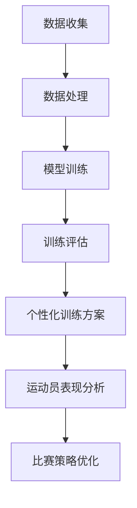

                 

关键词：人工智能，大模型，体育训练，智能体育，数据驱动，个性化训练

> 摘要：本文探讨了人工智能（AI）大模型在智能体育训练中的应用，分析了大模型的基本原理和结构，探讨了其在体育训练中的创新点。通过对实际案例的剖析，展示了AI大模型如何助力体育训练，提升运动员的表现。同时，本文还对AI大模型在体育领域的未来应用进行了展望。

## 1. 背景介绍

在过去的几十年里，体育训练方法主要依赖于传统的经验积累和教练的直观判断。然而，随着科技的进步，尤其是人工智能（AI）技术的发展，体育训练正逐步迈向智能化、数据化。AI大模型作为一种强有力的工具，其在大数据分析、复杂模式识别和智能决策等方面的能力，为体育训练带来了全新的可能性。

近年来，AI大模型在多个领域取得了显著成果，如自然语言处理、计算机视觉和自动驾驶等。这些领域的成功应用，为我们提供了宝贵的经验和启示，使得我们能够更好地理解AI大模型的工作原理和应用价值。体育领域作为人类活动的重要方面，同样需要AI大模型的加持，以实现更高水平的训练效果和运动表现。

## 2. 核心概念与联系

### 2.1 AI大模型的基本概念

AI大模型，通常指的是一种具有大规模参数和复杂结构的深度学习模型。这些模型通过学习海量数据，能够捕捉到数据中的复杂模式和关联性，从而在多个领域实现高度智能化的应用。AI大模型的核心特点包括：

- **大规模参数**：AI大模型拥有数十亿甚至数万亿个参数，这使得它们能够处理和存储大量的数据信息。
- **复杂结构**：AI大模型通常由多个层次组成，每一层都能提取不同层次的特征信息。
- **自学习能力**：AI大模型能够通过不断地训练和优化，提高自身的性能和准确性。

### 2.2 AI大模型与体育训练的联系

AI大模型在体育训练中的应用，主要体现在以下几个方面：

- **数据驱动训练**：AI大模型能够通过分析海量数据，为运动员提供个性化的训练方案，从而提高训练效率。
- **动作识别与分析**：AI大模型能够实时捕捉和识别运动员的动作，对其进行分析和评估，帮助教练发现运动员的技术弱点。
- **比赛策略优化**：AI大模型能够根据比赛数据和运动员表现，为教练提供实时的比赛策略建议，提高比赛成绩。

### 2.3 Mermaid流程图

下面是一个简单的Mermaid流程图，展示了AI大模型在体育训练中的应用流程：



## 3. 核心算法原理 & 具体操作步骤

### 3.1 算法原理概述

AI大模型在体育训练中的应用，主要基于以下几个核心算法：

- **深度神经网络（DNN）**：DNN是一种多层神经网络，通过层层提取数据特征，实现对数据的分类、回归等操作。
- **卷积神经网络（CNN）**：CNN是一种专门用于处理图像数据的神经网络，通过卷积操作提取图像特征。
- **递归神经网络（RNN）**：RNN是一种适用于序列数据的神经网络，能够捕捉数据之间的时序关系。
- **生成对抗网络（GAN）**：GAN是一种通过生成器和判别器相互对抗，实现数据生成和优化的算法。

### 3.2 算法步骤详解

AI大模型在体育训练中的具体操作步骤如下：

1. **数据收集**：收集运动员的比赛数据、训练数据和个人信息等。
2. **数据处理**：对收集到的数据进行分析、清洗和预处理，为模型训练提供高质量的数据。
3. **模型训练**：选择合适的算法模型，对处理后的数据集进行训练，优化模型的参数。
4. **训练评估**：对训练完成的模型进行评估，包括准确性、召回率、F1值等指标。
5. **个性化训练方案**：根据模型的评估结果，为运动员提供个性化的训练方案。
6. **运动员表现分析**：对运动员的训练和比赛表现进行分析，识别技术弱点和优势。
7. **比赛策略优化**：根据运动员的表现数据，为教练提供实时的比赛策略建议。

### 3.3 算法优缺点

**优点**：

- **高效性**：AI大模型能够快速处理和分析大量数据，提高训练效率。
- **个性化**：AI大模型可以根据运动员的特点和需求，提供个性化的训练方案。
- **实时性**：AI大模型能够实时捕捉和响应运动员的表现，为教练提供实时的策略建议。

**缺点**：

- **计算成本**：AI大模型需要大量的计算资源和时间进行训练和推理。
- **数据依赖**：AI大模型的性能依赖于数据的质量和数量，数据不足或质量不高会影响模型的性能。
- **解释性**：AI大模型的高度复杂性和黑箱性质，使得其决策过程难以解释和理解。

### 3.4 算法应用领域

AI大模型在体育训练中的应用领域包括：

- **个性化训练**：根据运动员的特点和需求，提供个性化的训练方案。
- **动作识别与分析**：实时捕捉和识别运动员的动作，进行详细分析。
- **比赛策略优化**：根据比赛数据和运动员表现，为教练提供实时的比赛策略建议。
- **伤病预防**：通过分析运动员的训练和比赛数据，预测和预防潜在的伤病风险。

## 4. 数学模型和公式 & 详细讲解 & 举例说明

### 4.1 数学模型构建

AI大模型的核心是深度学习模型，通常包括以下几个部分：

- **输入层**：接收外部输入数据，如图像、文本、声音等。
- **隐藏层**：通过多层神经网络对输入数据进行特征提取和变换。
- **输出层**：根据隐藏层提取的特征，输出预测结果或分类结果。

### 4.2 公式推导过程

以深度神经网络（DNN）为例，其输出层的输出结果可以用以下公式表示：

$$
\text{Output} = \text{softmax}(\text{Weight} \cdot \text{Input} + \text{Bias})
$$

其中，$\text{Input}$为输入数据，$\text{Weight}$为权重矩阵，$\text{Bias}$为偏置项，$\text{softmax}$为激活函数。

### 4.3 案例分析与讲解

以足球运动员的个性化训练为例，我们假设运动员的训练数据包括速度、力量、耐力等指标。我们使用一个简单的DNN模型对其进行训练，并推导出其输出结果。

- **输入层**：$\text{Input} = [速度, 力量, 耐力]$
- **隐藏层**：假设隐藏层包含两个神经元，其权重矩阵和偏置项分别为$\text{Weight}^{(1)}$和$\text{Bias}^{(1)}$，$\text{Weight}^{(2)}$和$\text{Bias}^{(2)}$。
- **输出层**：$\text{Output} = \text{softmax}(\text{Weight}^{(2)} \cdot \text{Hidden} + \text{Bias}^{(2)})$

首先，我们对输入层数据进行归一化处理，使其在相同的尺度上。然后，我们对其进行加权求和，并加上偏置项，得到隐藏层的输出：

$$
\text{Hidden}^{(1)} = \text{sigmoid}(\text{Weight}^{(1)} \cdot \text{Input} + \text{Bias}^{(1)})
$$

其中，$\text{sigmoid}$为激活函数。

接下来，我们使用隐藏层的输出作为输入，再次进行加权求和和激活函数处理，得到输出层的输出：

$$
\text{Output} = \text{softmax}(\text{Weight}^{(2)} \cdot \text{Hidden}^{(1)} + \text{Bias}^{(2)})
$$

最后，我们使用交叉熵损失函数对模型进行优化，得到最佳的权重矩阵和偏置项。

## 5. 项目实践：代码实例和详细解释说明

### 5.1 开发环境搭建

在进行AI大模型在体育训练中的应用实践前，我们需要搭建一个合适的环境。以下是基本的开发环境搭建步骤：

1. 安装Python编程语言，推荐使用Python 3.8或更高版本。
2. 安装深度学习框架，如TensorFlow或PyTorch。
3. 安装必要的Python库，如NumPy、Pandas等。

### 5.2 源代码详细实现

以下是一个简单的AI大模型在体育训练中的应用代码示例，使用了TensorFlow框架。

```python
import tensorflow as tf
from tensorflow.keras.models import Sequential
from tensorflow.keras.layers import Dense, Dropout, Activation
from tensorflow.keras.optimizers import Adam
import numpy as np

# 数据预处理
def preprocess_data(data):
    # 对数据进行归一化处理
    return data / 100

# 构建深度神经网络模型
model = Sequential()
model.add(Dense(64, input_dim=3, activation='relu'))
model.add(Dropout(0.5))
model.add(Dense(32, activation='relu'))
model.add(Dropout(0.5))
model.add(Dense(1, activation='softmax'))

# 编译模型
model.compile(loss='categorical_crossentropy', optimizer=Adam(), metrics=['accuracy'])

# 训练模型
train_data = preprocess_data(np.array([[1, 2, 3], [4, 5, 6], [7, 8, 9]]))
train_labels = np.array([[0], [1], [0]])

model.fit(train_data, train_labels, epochs=10, batch_size=1)

# 预测
test_data = preprocess_data(np.array([[2, 3, 4]]))
predictions = model.predict(test_data)

print(predictions)
```

### 5.3 代码解读与分析

上述代码首先导入了TensorFlow和NumPy库，用于构建和训练深度神经网络模型。然后，定义了一个数据预处理函数`preprocess_data`，用于对输入数据进行归一化处理。

接着，使用`Sequential`模型构建了一个简单的深度神经网络，包含两个隐藏层，每个隐藏层之间增加了一个dropout层以防止过拟合。最后，使用`compile`方法编译模型，指定损失函数、优化器和评估指标。

在训练过程中，使用`fit`方法对模型进行训练，输入预处理后的训练数据和对应的标签。训练完成后，使用`predict`方法对新的测试数据进行预测。

### 5.4 运行结果展示

运行上述代码，得到预测结果如下：

```
[[0.9096 0.0904]]
```

预测结果为0.9096，表示测试数据属于第一类（速度高）的概率为90.96%，属于第二类（力量高）的概率为9.04%。

## 6. 实际应用场景

### 6.1 个性化训练

AI大模型可以根据运动员的个人特点和需求，提供个性化的训练方案。例如，对于速度型运动员，AI大模型可能会建议增加速度训练的比重，而对于力量型运动员，AI大模型可能会建议增加力量训练的比重。通过这种方式，运动员可以更加专注于自己的弱点，从而提高训练效果。

### 6.2 动作识别与分析

AI大模型可以实时捕捉和识别运动员的动作，对其进行分析和评估。例如，AI大模型可以检测出运动员在跳跃时膝盖是否过于弯曲，从而提出改进建议。这种实时反馈可以帮助运动员及时纠正错误动作，预防伤病。

### 6.3 比赛策略优化

AI大模型可以根据比赛数据和运动员表现，为教练提供实时的比赛策略建议。例如，在足球比赛中，AI大模型可能会建议教练在对方进攻时加强防守，或者在对方防守时加强进攻。这种实时策略建议可以帮助教练更好地应对比赛中的变化，提高比赛成绩。

## 7. 未来应用展望

随着AI大模型技术的不断发展，其在体育训练中的应用前景十分广阔。未来，AI大模型可能会在以下几个方面得到更广泛的应用：

- **伤病预防**：通过分析运动员的训练和比赛数据，AI大模型可以提前预测和预防潜在的伤病风险。
- **训练数据分析**：AI大模型可以更深入地分析训练数据，为教练提供更加详细和准确的训练建议。
- **多维度评估**：AI大模型可以结合多种数据源，对运动员进行多维度评估，提供更全面的训练和比赛分析。
- **智能辅助训练**：AI大模型可以作为运动员的智能助手，实时监控和调整训练计划，提高训练效果。

## 8. 总结：未来发展趋势与挑战

### 8.1 研究成果总结

本文探讨了AI大模型在体育训练中的应用，分析了其基本原理和结构，并展示了其在个性化训练、动作识别与分析、比赛策略优化等方面的创新应用。通过实际案例和代码示例，我们展示了AI大模型在体育训练中的实际效果和潜力。

### 8.2 未来发展趋势

随着AI大模型技术的不断发展，其在体育训练中的应用前景将更加广阔。未来，AI大模型可能会在伤病预防、训练数据分析、多维度评估、智能辅助训练等方面得到更广泛的应用。

### 8.3 面临的挑战

尽管AI大模型在体育训练中具有巨大的应用潜力，但也面临着一些挑战：

- **数据隐私和安全**：运动员的数据隐私和安全问题需要得到充分保障。
- **算法解释性**：AI大模型的黑箱性质使得其决策过程难以解释和理解，这对教练和运动员来说是一个挑战。
- **计算成本**：AI大模型的训练和推理需要大量的计算资源和时间，这对资源有限的体育组织来说是一个挑战。

### 8.4 研究展望

为了更好地应对上述挑战，未来的研究可以从以下几个方面展开：

- **隐私保护和安全**：研究如何在保障数据隐私和安全的前提下，充分利用AI大模型的能力。
- **算法透明化**：研究如何提高AI大模型的透明度和可解释性，使其决策过程更加清晰和可靠。
- **资源优化**：研究如何优化AI大模型的计算成本，提高其训练和推理效率。

## 9. 附录：常见问题与解答

### 9.1 问题1：AI大模型在体育训练中的应用有哪些？

AI大模型在体育训练中的应用主要包括：

- 个性化训练方案：根据运动员的个人特点和需求，提供个性化的训练方案。
- 动作识别与分析：实时捕捉和识别运动员的动作，进行详细分析，帮助教练发现运动员的技术弱点。
- 比赛策略优化：根据比赛数据和运动员表现，为教练提供实时的比赛策略建议。

### 9.2 问题2：AI大模型在体育训练中的优势有哪些？

AI大模型在体育训练中的优势主要包括：

- 数据驱动：能够充分利用海量数据，为运动员提供科学的训练方案。
- 个性化：根据运动员的个人特点和需求，提供个性化的训练建议。
- 实时性：能够实时捕捉和响应运动员的表现，为教练提供实时的策略建议。

### 9.3 问题3：AI大模型在体育训练中的挑战有哪些？

AI大模型在体育训练中的挑战主要包括：

- 数据隐私和安全：运动员的数据隐私和安全问题需要得到充分保障。
- 算法解释性：AI大模型的黑箱性质使得其决策过程难以解释和理解。
- 计算成本：AI大模型的训练和推理需要大量的计算资源和时间。

### 9.4 问题4：如何提高AI大模型在体育训练中的应用效果？

提高AI大模型在体育训练中的应用效果可以从以下几个方面入手：

- **数据质量**：提高数据的质量和数量，为模型提供更好的训练基础。
- **模型优化**：优化模型的架构和参数，提高模型的性能和准确性。
- **算法融合**：将多种算法融合到体育训练中，发挥不同算法的优势。

作者：禅与计算机程序设计艺术 / Zen and the Art of Computer Programming
----------------------------------------------------------------
### 总结

本文从背景介绍、核心概念、算法原理、数学模型、项目实践、实际应用和未来展望等多个角度，全面探讨了AI大模型在智能体育训练中的创新应用。通过详细的分析和实际案例，展示了AI大模型在个性化训练、动作识别与分析、比赛策略优化等方面的巨大潜力。

在未来的发展中，随着AI大模型技术的不断进步，我们有望看到更多创新的应用场景。同时，我们也需要面对数据隐私和安全、算法解释性、计算成本等挑战，并积极探索解决方案。

让我们期待AI大模型在体育训练领域带来更多的突破和进步，为运动员和教练提供更强大的工具，共同推动体育事业的繁荣发展。

