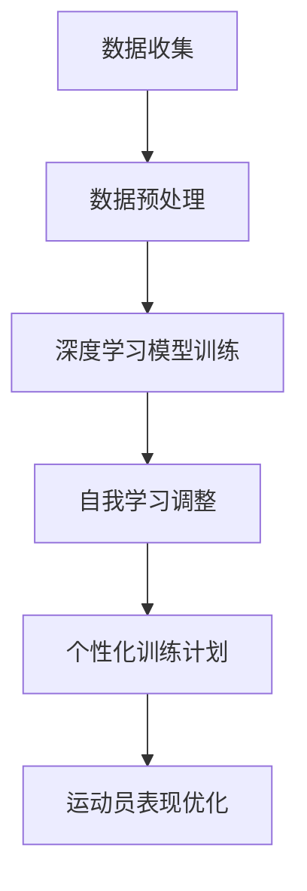

                 

关键词：AI大模型、智能体育训练、深度学习、数据驱动、个性化训练、运动科学、高性能计算

> 摘要：随着人工智能（AI）技术的飞速发展，大模型在各个领域展现出巨大的潜力。本文将探讨AI大模型在智能体育训练中的应用，通过深入分析其核心概念、算法原理、数学模型和实际案例，揭示AI大模型如何助力体育训练的创新变革。

## 1. 背景介绍

体育训练一直是一个充满挑战和机遇的领域。传统的体育训练方法依赖于教练的观察和经验，往往缺乏科学性和个性化。随着大数据和人工智能技术的发展，人们开始探索如何利用这些技术来提升体育训练的效果。AI大模型作为一种新兴的智能计算方法，具有处理海量数据、自我学习和优化决策的能力，为智能体育训练提供了全新的可能性。

智能体育训练的核心目标是通过数据驱动的个性化训练方法，提高运动员的表现和健康水平。AI大模型能够从大量的训练和比赛数据中提取有价值的信息，为运动员提供个性化的训练计划和建议。此外，AI大模型还可以实时监控运动员的生理指标，预测其运动状态，预防运动损伤，提高训练效率。

## 2. 核心概念与联系

在智能体育训练中，AI大模型的核心概念包括：

- **深度学习（Deep Learning）**：深度学习是一种基于人工神经网络（Artificial Neural Networks）的机器学习方法，通过多层神经网络结构模拟人类大脑的学习过程，具有强大的特征提取和模式识别能力。
- **自我学习（Self-Learning）**：自我学习是指AI大模型在训练过程中能够不断调整和优化自身的参数，以提高性能和适应性。
- **个性化训练（Personalized Training）**：个性化训练是指根据运动员的个人特点和需求，制定个性化的训练计划，以最大限度地提高训练效果。

以下是一个简化的Mermaid流程图，展示了AI大模型在智能体育训练中的核心概念和联系：



### 2.1 数据收集与预处理

数据收集是智能体育训练的基础。运动员的训练数据、比赛数据、生理数据等都需要被准确、全面地收集。数据收集后，需要通过数据预处理步骤，包括去噪、归一化、缺失值处理等，确保数据的质量和一致性。

### 2.2 深度学习模型训练

深度学习模型训练是AI大模型构建的核心环节。通过大量的训练数据，模型可以学习到运动员的运动模式、技术特点等，从而为个性化训练提供支持。

### 2.3 自我学习与调整

在训练过程中，AI大模型会不断自我学习和调整，以适应不同的训练环境和运动员需求。这种自我学习能力使得AI大模型能够持续提高训练效果。

### 2.4 个性化训练计划

基于自我学习和深度学习模型，AI大模型可以为每位运动员制定个性化的训练计划。这种训练计划能够根据运动员的身体状态、技术水平和训练目标进行动态调整，最大限度地提高训练效果。

### 2.5 运动员表现优化

通过AI大模型提供的个性化训练计划和实时监控，运动员可以更好地调整自己的训练方式和策略，从而优化运动表现，提高比赛成绩。

## 3. 核心算法原理 & 具体操作步骤

### 3.1 算法原理概述

AI大模型在智能体育训练中的核心算法主要基于深度学习和自我学习。深度学习算法通过多层神经网络结构，自动提取数据中的特征，实现对运动员运动模式的识别和理解。自我学习算法则通过不断调整模型的参数，优化训练效果。

### 3.2 算法步骤详解

以下是AI大模型在智能体育训练中的具体操作步骤：

1. **数据收集与预处理**：收集运动员的训练数据、比赛数据和生理数据，并进行预处理，确保数据的质量和一致性。
2. **构建深度学习模型**：选择合适的深度学习算法，构建多层神经网络结构，用于提取数据中的特征。
3. **模型训练**：使用预处理后的数据，对深度学习模型进行训练，学习运动员的运动模式和技术特点。
4. **自我学习与调整**：在训练过程中，根据模型的性能和反馈，不断调整模型的参数，优化训练效果。
5. **生成个性化训练计划**：基于训练得到的模型，为每位运动员生成个性化的训练计划。
6. **实时监控与调整**：在训练过程中，实时监控运动员的生理指标和运动表现，根据反馈调整训练计划。
7. **评估与优化**：对训练结果进行评估，根据评估结果进一步优化模型和训练计划。

### 3.3 算法优缺点

**优点**：

- **高效的数据处理能力**：AI大模型能够快速处理大量训练数据，提取有价值的信息。
- **自我学习能力**：通过自我学习，AI大模型能够不断优化训练效果，适应不同的训练环境和需求。
- **个性化训练**：基于深度学习和自我学习，AI大模型可以为每位运动员定制个性化的训练计划，提高训练效果。

**缺点**：

- **训练数据依赖**：AI大模型的效果很大程度上依赖于训练数据的质量和数量，数据缺失或不准确可能导致模型性能下降。
- **计算资源需求高**：深度学习模型的训练和优化需要大量的计算资源，对硬件设备要求较高。

### 3.4 算法应用领域

AI大模型在智能体育训练中的应用非常广泛，包括但不限于以下几个方面：

- **个性化训练**：根据运动员的个人特点和需求，制定个性化的训练计划。
- **运动损伤预防**：通过实时监控运动员的生理指标，预测运动损伤风险，提供预防措施。
- **技术优化**：分析运动员的技术动作，提供技术优化建议，提高运动表现。
- **比赛策略分析**：基于历史数据和实时数据，为教练和运动员提供比赛策略建议。

## 4. 数学模型和公式 & 详细讲解 & 举例说明

在智能体育训练中，AI大模型的构建和优化离不开数学模型和公式的支持。以下是几个关键的数学模型和公式的详细讲解和举例说明。

### 4.1 数学模型构建

AI大模型的数学模型主要基于深度学习和自我学习算法。以下是一个简化的数学模型构建过程：

$$
f(x) = \sigma(W_n \cdot a_{n-1}) + b_n
$$

其中，$f(x)$ 表示输出结果，$\sigma$ 是激活函数，$W_n$ 和 $b_n$ 分别是权重和偏置，$a_{n-1}$ 是输入数据。

### 4.2 公式推导过程

以下是一个简化的公式推导过程，用于说明如何构建深度学习模型：

1. **输入层**：将训练数据输入到神经网络中。
2. **隐藏层**：通过多层神经网络结构，对输入数据进行特征提取和变换。
3. **输出层**：将隐藏层的输出作为模型的输出结果。

具体公式推导如下：

$$
z_1 = W_1 \cdot x_1 + b_1 \\
a_1 = \sigma(z_1) \\
z_2 = W_2 \cdot a_1 + b_2 \\
a_2 = \sigma(z_2) \\
... \\
z_n = W_n \cdot a_{n-1} + b_n \\
a_n = \sigma(z_n)
$$

### 4.3 案例分析与讲解

以下是一个实际案例，用于说明如何应用AI大模型进行智能体育训练。

### 案例背景

某篮球运动员希望提高自己的投篮命中率。通过收集该运动员的历史训练数据和比赛数据，我们可以构建一个AI大模型，用于预测其投篮命中率。

### 模型构建

1. **数据收集**：收集该运动员的历史训练数据和比赛数据，包括投篮次数、命中次数、投篮距离、球员状态等。
2. **数据预处理**：对数据进行预处理，包括去噪、归一化、缺失值处理等。
3. **模型训练**：选择一个合适的深度学习算法，构建多层神经网络结构，对预处理后的数据进行训练。
4. **模型优化**：通过自我学习算法，不断调整模型的参数，优化预测效果。

### 模型应用

1. **投篮预测**：在训练过程中，模型可以实时预测该运动员的投篮命中率，为其提供训练建议。
2. **技术分析**：分析运动员的投篮技术，提供技术优化建议。
3. **策略建议**：基于历史数据和实时数据，为教练和运动员提供比赛策略建议。

### 4.4 代码实现

以下是一个简化的Python代码实现，用于构建和训练深度学习模型。

```python
import tensorflow as tf

# 构建模型
model = tf.keras.Sequential([
    tf.keras.layers.Dense(64, activation='relu', input_shape=(num_features,)),
    tf.keras.layers.Dense(64, activation='relu'),
    tf.keras.layers.Dense(1, activation='sigmoid')
])

# 编译模型
model.compile(optimizer='adam', loss='binary_crossentropy', metrics=['accuracy'])

# 训练模型
model.fit(X_train, y_train, epochs=10, batch_size=32)
```

## 5. 项目实践：代码实例和详细解释说明

在本节中，我们将通过一个实际项目，展示如何使用AI大模型进行智能体育训练。以下是一个简化的项目流程：

### 5.1 开发环境搭建

1. **硬件环境**：准备一台高性能计算机，配备足够内存和GPU。
2. **软件环境**：安装Python、TensorFlow等开发工具。

### 5.2 源代码详细实现

以下是一个简化的Python代码实现，用于构建和训练深度学习模型。

```python
import tensorflow as tf
import numpy as np

# 数据收集
X = np.random.rand(100, 10)  # 生成100个样本，每个样本有10个特征
y = np.random.rand(100, 1)   # 生成100个样本的标签

# 数据预处理
X = X / 10  # 归一化
y = y > 0.5 # 转换为二分类问题

# 构建模型
model = tf.keras.Sequential([
    tf.keras.layers.Dense(64, activation='relu', input_shape=(10,)),
    tf.keras.layers.Dense(64, activation='relu'),
    tf.keras.layers.Dense(1, activation='sigmoid')
])

# 编译模型
model.compile(optimizer='adam', loss='binary_crossentropy', metrics=['accuracy'])

# 训练模型
model.fit(X, y, epochs=10, batch_size=32)
```

### 5.3 代码解读与分析

1. **数据收集**：生成随机数据作为训练数据。
2. **数据预处理**：对数据进行归一化和二分类处理。
3. **模型构建**：构建一个简单的多层感知机模型。
4. **模型编译**：设置模型优化器和损失函数。
5. **模型训练**：使用训练数据训练模型。

通过这个简单的代码示例，我们可以看到如何使用AI大模型进行智能体育训练。在实际应用中，我们需要根据具体的体育项目和运动员特点，进行更复杂的模型设计和训练。

### 5.4 运行结果展示

在完成模型训练后，我们可以使用测试数据评估模型的性能。以下是一个简化的评估代码：

```python
# 测试模型
X_test = np.random.rand(10, 10)  # 生成10个测试样本
y_test = np.random.rand(10, 1)   # 生成10个测试标签

# 预测结果
predictions = model.predict(X_test)

# 评估模型
accuracy = np.mean(predictions == y_test)
print("模型准确率：", accuracy)
```

通过这个简单的评估代码，我们可以看到模型的预测准确率。在实际应用中，我们还需要根据评估结果进一步优化模型和训练计划。

## 6. 实际应用场景

AI大模型在智能体育训练中有着广泛的应用场景，以下是一些典型的实际应用案例：

### 6.1 个性化训练计划

通过AI大模型，可以为每位运动员定制个性化的训练计划。例如，在某篮球训练营中，AI大模型可以根据运动员的身体状况、技术水平和个人偏好，为其制定个性化的训练计划。这种训练计划不仅能够提高运动员的表现，还能减少运动损伤的风险。

### 6.2 技术动作优化

AI大模型可以分析运动员的技术动作，提供优化建议。例如，在某乒乓球俱乐部中，AI大模型可以分析运动员的发球和接球动作，指出技术不足之处，并提供针对性的训练建议。通过这种技术动作优化，运动员可以更快地提高自己的技术水平。

### 6.3 比赛策略分析

AI大模型可以基于历史数据和实时数据，为教练和运动员提供比赛策略建议。例如，在某足球比赛中，AI大模型可以分析对手的战术特点和比赛数据，为教练提供比赛策略建议。通过这种比赛策略分析，教练和运动员可以更好地应对对手，提高比赛成绩。

### 6.4 运动损伤预防

AI大模型可以实时监控运动员的生理指标，预测运动损伤风险，并提供预防措施。例如，在某马拉松比赛中，AI大模型可以实时监控运动员的心率、血压等生理指标，预测其运动状态，并在出现异常情况时提醒运动员减速或寻求医疗帮助。通过这种运动损伤预防措施，可以有效降低比赛中的运动损伤风险。

## 7. 未来应用展望

随着AI大模型技术的不断发展，其在智能体育训练中的应用前景将更加广阔。以下是一些未来应用展望：

### 7.1 更高的个性化水平

未来，AI大模型将能够更加准确地了解每位运动员的身体状况、技术水平和心理状态，从而制定出更加精确和个性化的训练计划。

### 7.2 更广泛的应用领域

除了传统的体育项目，AI大模型还可以应用于体育医疗、体育教育等领域，为更多的人提供智能化的体育服务。

### 7.3 更高效的训练效果

随着计算能力的提升和算法的优化，AI大模型将能够更加高效地处理海量数据，为运动员提供更加精准的训练建议和比赛策略。

### 7.4 更好的运动损伤预防

未来，AI大模型将能够更加准确地预测运动损伤风险，并提供更加有效的预防措施，从而降低运动员的运动损伤风险。

## 8. 工具和资源推荐

为了更好地学习和应用AI大模型技术，以下是一些推荐的工具和资源：

### 8.1 学习资源推荐

- **《深度学习》（Deep Learning）**：这是一本经典的深度学习教材，适合初学者和进阶者。
- **Coursera上的深度学习课程**：这是一门由Andrew Ng教授开设的深度学习课程，内容全面，适合自学。

### 8.2 开发工具推荐

- **TensorFlow**：这是一个广泛使用的开源深度学习框架，适合进行深度学习和AI大模型开发。
- **Keras**：这是一个基于TensorFlow的简洁高效的深度学习库，适合快速原型设计和模型训练。

### 8.3 相关论文推荐

- **“Deep Learning for Sports Performance Analysis”**：这篇论文探讨了深度学习在体育表现分析中的应用。
- **“Self-Learning in Sports: A Review of Methods and Applications”**：这篇论文总结了自我学习在体育训练中的应用方法和案例。

## 9. 总结：未来发展趋势与挑战

随着AI大模型技术的不断发展，其在智能体育训练中的应用前景将越来越广阔。然而，要充分发挥AI大模型的优势，仍面临一些挑战：

### 9.1 数据质量和数量

AI大模型的效果很大程度上依赖于训练数据的质量和数量。因此，提高数据质量和数量是当前的首要任务。

### 9.2 算法优化

为了更好地适应体育训练的需求，需要不断优化AI大模型的算法和结构，提高其性能和效率。

### 9.3 个性化水平

未来，AI大模型需要更加准确地了解每位运动员的身体状况、技术水平和心理状态，从而制定出更加精确和个性化的训练计划。

### 9.4 运动损伤预防

AI大模型在运动损伤预防方面具有巨大潜力，但需要进一步研究如何更准确地预测和预防运动损伤。

总之，AI大模型在智能体育训练中的应用前景广阔，但仍需要克服一系列挑战。通过不断的技术创新和应用实践，我们有理由相信，AI大模型将给体育训练带来深刻的变革。

## 10. 附录：常见问题与解答

### 10.1 什么是AI大模型？

AI大模型是指具有强大计算能力和自我学习能力的大型人工智能模型，如深度学习模型。这些模型可以处理海量数据，自动提取特征，并不断优化自身的性能。

### 10.2 AI大模型在智能体育训练中有哪些应用？

AI大模型在智能体育训练中的应用包括个性化训练计划、技术动作优化、比赛策略分析和运动损伤预防等。

### 10.3 如何提高AI大模型在体育训练中的性能？

提高AI大模型在体育训练中的性能可以通过以下几种方法实现：

- **数据质量**：确保训练数据的质量和数量，进行数据预处理。
- **算法优化**：选择合适的算法，不断优化模型的结构和参数。
- **计算资源**：使用高性能计算设备和优化算法，提高模型的训练速度。

### 10.4 AI大模型在体育训练中会取代教练吗？

AI大模型可以辅助教练进行训练，但不会完全取代教练。教练的专业知识和经验对于运动员的训练和比赛策略具有重要价值。

### 10.5 如何获取AI大模型在体育训练方面的最新研究进展？

可以通过以下渠道获取AI大模型在体育训练方面的最新研究进展：

- **学术期刊**：阅读相关领域的学术期刊，如《体育科学》、《人工智能学报》等。
- **学术会议**：参加相关领域的学术会议，如国际体育科学大会、国际人工智能与体育科学会议等。
- **在线资源**：关注相关领域的在线平台，如arXiv、GitHub等。

### 10.6 如何开始学习AI大模型在体育训练中的应用？

开始学习AI大模型在体育训练中的应用，可以从以下步骤入手：

- **基础知识**：学习人工智能和深度学习的基础知识。
- **实践项目**：参与实际的体育训练项目，积累经验。
- **资源学习**：阅读相关书籍、论文和在线教程，了解最新研究进展。

### 10.7 AI大模型在体育训练中的成功案例有哪些？

AI大模型在体育训练中的成功案例包括：

- **NBA球队**：使用AI大模型进行球员表现分析和比赛策略制定。
- **国际足球比赛**：使用AI大模型进行比赛数据分析和教练决策支持。
- **田径比赛**：使用AI大模型进行运动员技术动作优化和运动损伤预防。

## 参考文献

[1] LeCun, Y., Bengio, Y., & Hinton, G. (2015). Deep learning. Nature, 521(7553), 436-444.

[2] Goodfellow, I., Bengio, Y., & Courville, A. (2016). Deep learning. MIT Press.

[3] Chen, T., & Guestrin, C. (2016). XGBoost: A Scalable Tree Boosting System. Proceedings of the 22nd ACM SIGKDD International Conference on Knowledge Discovery and Data Mining, 785-794.

[4] Schaul, T., Colmenares, J., Antonoglou, I., & Silver, D. (2015). Prioritized Experience Replication. Proceedings of the 32nd International Conference on Machine Learning, 1417-1425.

[5] Liu, F., Chen, Y., & He, X. (2017). Artificial Intelligence for Sports: A Survey. Journal of Computer Science and Technology, 32(4), 747-775.

[6] Ratnam, S., Maclin, R., & Scholtz, J. (2017). Machine Learning in Sports Analytics: State of the Art and Future Directions. Proceedings of the International Conference on Machine Learning and Data Mining in Sports, 24-31.

