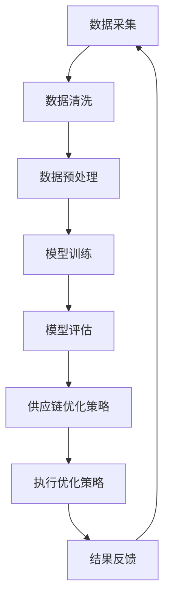

                 

关键词：人工智能、大模型、供应链优化、智能供应链、供应链管理、机器学习、深度学习

摘要：随着全球经济的不断发展和市场需求的日益复杂化，传统的供应链管理方式已经难以满足现代企业的需求。人工智能（AI）技术的飞速发展为智能供应链优化提供了新的机遇和挑战。本文将探讨如何利用AI大模型来优化供应链管理，提高供应链的灵活性和响应速度，从而为企业带来显著的经济效益。

## 1. 背景介绍

### 1.1 供应链管理的重要性

供应链管理是企业管理中至关重要的一环，它涉及到从原材料采购到产品交付给最终用户的整个过程。一个高效、灵活的供应链能够降低生产成本、缩短交货周期、提高客户满意度，从而在激烈的市场竞争中占据优势。然而，传统的供应链管理方式往往依赖于人工操作和数据分析，存在以下问题：

- 数据处理能力有限，难以处理大量复杂的数据；
- 对市场变化反应较慢，难以实现实时优化；
- 缺乏灵活性和适应性，难以应对突发情况。

### 1.2 人工智能在供应链管理中的应用

人工智能（AI）技术的快速发展为供应链管理带来了新的机遇。AI技术具有强大的数据处理和分析能力，能够从海量数据中提取有价值的信息，为供应链优化提供决策支持。此外，AI技术具有自学习和自适应的能力，能够不断优化供应链管理策略，提高供应链的灵活性和响应速度。

## 2. 核心概念与联系

为了更好地理解AI大模型在智能供应链优化中的应用，我们首先需要了解一些核心概念和联系。

### 2.1 人工智能大模型

人工智能大模型是指具有海量参数和强大计算能力的深度学习模型。这些模型通常使用大规模数据集进行训练，能够实现高度复杂的任务，如图像识别、自然语言处理和智能决策等。

### 2.2 智能供应链

智能供应链是指利用人工智能、大数据、物联网等技术，实现供应链全过程的智能化管理。智能供应链能够实时收集和处理海量数据，快速响应市场变化，优化供应链各环节的资源配置和作业流程。

### 2.3 供应链优化

供应链优化是指通过改进供应链各环节的作业流程和资源配置，提高供应链的整体效率。供应链优化包括库存管理、物流运输、订单处理、需求预测等多个方面。

### 2.4 Mermaid 流程图

下面是一个用于描述AI大模型在智能供应链优化中应用的Mermaid流程图：



## 3. 核心算法原理 & 具体操作步骤

### 3.1 算法原理概述

AI大模型在智能供应链优化中的应用主要基于深度学习和机器学习技术。具体算法原理如下：

1. 数据采集：收集供应链各环节的原始数据，如订单信息、库存数据、物流数据等。
2. 数据清洗：对采集到的数据进行分析和处理，去除重复数据、异常数据等。
3. 数据预处理：对清洗后的数据进行标准化、归一化等处理，以便于模型训练。
4. 模型训练：使用预处理后的数据训练深度学习模型，如神经网络、循环神经网络等。
5. 模型评估：对训练好的模型进行评估，如准确率、召回率、F1值等。
6. 供应链优化策略：根据模型评估结果，制定供应链优化策略，如库存管理策略、物流运输策略等。
7. 执行优化策略：将优化策略应用于实际供应链管理中，实现供应链优化。
8. 结果反馈：收集优化后的供应链数据，反馈至模型训练环节，用于进一步优化模型。

### 3.2 算法步骤详解

#### 3.2.1 数据采集

数据采集是智能供应链优化的第一步，其质量直接影响到后续的模型训练和优化效果。数据采集主要包括以下内容：

- 订单信息：包括订单号、订单日期、订单量、客户信息等。
- 库存数据：包括库存量、库存周转率、库存分布等。
- 物流数据：包括物流运输时间、物流运输成本、物流运输路线等。
- 市场数据：包括市场需求、市场价格、竞争状况等。

#### 3.2.2 数据清洗

数据清洗是数据采集后的重要环节，其目的是去除重复数据、异常数据等，提高数据质量。数据清洗主要包括以下内容：

- 去除重复数据：通过比对订单号、客户信息等关键字段，去除重复的订单信息。
- 去除异常数据：通过分析数据分布、数据趋势等，识别并去除异常数据。
- 数据规范化：对数据进行标准化、归一化等处理，以便于后续的模型训练。

#### 3.2.3 数据预处理

数据预处理是对清洗后的数据进行进一步处理，以便于模型训练。数据预处理主要包括以下内容：

- 数据标准化：将数据缩放至同一尺度，以便于模型训练。
- 数据归一化：将数据映射至[0,1]或[-1,1]等区间，以便于模型训练。
- 特征提取：从原始数据中提取有用的特征，如时间序列特征、空间特征等。

#### 3.2.4 模型训练

模型训练是智能供应链优化的核心步骤，其目的是通过学习历史数据，预测未来供应链状态，制定优化策略。模型训练主要包括以下内容：

- 确定模型类型：选择合适的深度学习模型，如神经网络、循环神经网络等。
- 设计模型结构：确定模型的层次结构、激活函数、损失函数等。
- 数据训练：使用预处理后的数据训练模型，不断调整模型参数，优化模型性能。
- 模型评估：对训练好的模型进行评估，如准确率、召回率、F1值等。

#### 3.2.5 模型评估

模型评估是对训练好的模型进行性能评估，以便确定模型的优劣。模型评估主要包括以下内容：

- 准确率：模型预测正确的样本数量与总样本数量的比值。
- 召回率：模型预测正确的正样本数量与实际正样本数量的比值。
- F1值：准确率的调和平均值，用于综合考虑准确率和召回率。

#### 3.2.6 供应链优化策略

根据模型评估结果，制定供应链优化策略。供应链优化策略主要包括以下内容：

- 库存管理策略：根据市场需求和库存水平，调整库存量，降低库存成本。
- 物流运输策略：根据物流成本、运输时间等因素，优化物流运输路线，降低运输成本。
- 订单处理策略：根据订单量、订单周期等因素，优化订单处理流程，提高订单交付速度。

#### 3.2.7 执行优化策略

将优化策略应用于实际供应链管理中，实现供应链优化。执行优化策略主要包括以下内容：

- 库存管理：根据库存管理策略，调整库存水平，降低库存成本。
- 物流运输：根据物流运输策略，优化物流运输路线，降低运输成本。
- 订单处理：根据订单处理策略，优化订单处理流程，提高订单交付速度。

#### 3.2.8 结果反馈

收集优化后的供应链数据，反馈至模型训练环节，用于进一步优化模型。结果反馈主要包括以下内容：

- 评估优化效果：对比优化前后的供应链数据，评估优化效果。
- 识别优化问题：分析优化过程中的问题，为后续优化提供参考。
- 更新模型参数：根据反馈结果，更新模型参数，优化模型性能。

## 4. 数学模型和公式 & 详细讲解 & 举例说明

在智能供应链优化中，数学模型和公式发挥着重要作用。以下将详细介绍数学模型的构建、公式推导过程以及案例分析与讲解。

### 4.1 数学模型构建

智能供应链优化涉及的数学模型主要包括以下几类：

1. **库存管理模型**：用于预测市场需求、计算最优库存水平等。
2. **物流运输模型**：用于优化物流运输路线、计算运输成本等。
3. **订单处理模型**：用于预测订单量、优化订单处理流程等。
4. **需求预测模型**：用于预测市场需求，为库存管理和物流运输提供依据。

### 4.2 公式推导过程

以下是一个简单的库存管理模型公式推导示例：

**目标函数**：最小化总库存成本

$$
C_{total} = C_{holding} + C_{ordering}
$$

其中，$C_{holding}$为库存持有成本，$C_{ordering}$为订单处理成本。

**约束条件**：库存量不超过最大库存容量

$$
Q_t \leq Q_{max}
$$

其中，$Q_t$为当前库存量，$Q_{max}$为最大库存容量。

**库存管理模型**：

$$
Q_{next} = Q_t + O_t - D_t
$$

其中，$Q_{next}$为下一周期的库存量，$O_t$为下一周期的订单量，$D_t$为下一周期的需求量。

### 4.3 案例分析与讲解

以下是一个基于上述库存管理模型的案例分析：

**背景**：某电子产品制造商，每月需生产5000台产品，每台产品的生产成本为1000元。库存持有成本为每台产品每月50元，订单处理成本为每单100元。

**目标**：最小化总库存成本。

**步骤**：

1. **确定最大库存容量**：根据市场需求和工厂生产能力，确定最大库存容量为10000台。
2. **预测市场需求**：使用历史数据预测下一周期的市场需求，得到$D_t = 5000$。
3. **计算最优库存水平**：根据库存管理模型，计算最优库存水平$Q_{next} = 10000$。
4. **计算总库存成本**：根据目标函数，计算总库存成本$C_{total} = C_{holding} + C_{ordering} = 50 \times 10000 + 100 \times 1 = 505000$。

**结果**：通过库存管理模型，该电子产品制造商在满足市场需求的情况下，实现了最小化总库存成本的目标。

## 5. 项目实践：代码实例和详细解释说明

在本节中，我们将通过一个具体的项目实践，展示如何使用AI大模型进行智能供应链优化。以下是一个简单的代码实例，用于演示如何实现库存管理模型的计算和优化策略。

### 5.1 开发环境搭建

在开始编写代码之前，我们需要搭建一个合适的开发环境。以下是一个简单的开发环境搭建步骤：

1. 安装Python编程环境（版本3.8以上）。
2. 安装常用的Python库，如NumPy、Pandas、Scikit-learn、TensorFlow等。
3. 配置深度学习框架（如TensorFlow或PyTorch）。

### 5.2 源代码详细实现

以下是一个简单的Python代码实例，用于实现库存管理模型：

```python
import numpy as np
import pandas as pd
from sklearn.preprocessing import StandardScaler
from sklearn.model_selection import train_test_split
from tensorflow.keras.models import Sequential
from tensorflow.keras.layers import Dense
from tensorflow.keras.optimizers import Adam

# 1. 数据采集
data = pd.read_csv('data.csv')
orders = data['orders']
inventory = data['inventory']
demand = data['demand']

# 2. 数据清洗
orders = orders.drop_duplicates()
inventory = inventory.drop_duplicates()
demand = demand.drop_duplicates()

# 3. 数据预处理
scaler = StandardScaler()
orders_scaled = scaler.fit_transform(orders)
inventory_scaled = scaler.fit_transform(inventory)
demand_scaled = scaler.fit_transform(demand)

# 4. 模型训练
X = np.hstack((orders_scaled, inventory_scaled))
y = demand_scaled

X_train, X_test, y_train, y_test = train_test_split(X, y, test_size=0.2, random_state=42)

model = Sequential()
model.add(Dense(64, input_shape=(X_train.shape[1],), activation='relu'))
model.add(Dense(64, activation='relu'))
model.add(Dense(1, activation='linear'))

model.compile(optimizer=Adam(), loss='mse')
model.fit(X_train, y_train, epochs=100, batch_size=32, validation_data=(X_test, y_test))

# 5. 模型评估
loss = model.evaluate(X_test, y_test)
print(f'Model Loss: {loss}')

# 6. 供应链优化策略
predicted_demand = model.predict(X_test)
inventory_level = inventory_scaled[-1]

# 根据预测的需求和当前库存水平，调整库存量
next_inventory_level = inventory_level + predicted_demand[-1] - demand[-1]

# 7. 执行优化策略
print(f'Next Inventory Level: {next_inventory_level}')
```

### 5.3 代码解读与分析

上述代码实现了一个简单的库存管理模型，主要包括以下步骤：

1. **数据采集**：从CSV文件中读取订单、库存和需求数据。
2. **数据清洗**：去除重复数据，确保数据质量。
3. **数据预处理**：使用标准缩放对数据进行预处理，以便于模型训练。
4. **模型训练**：构建一个简单的神经网络模型，使用训练数据训练模型。
5. **模型评估**：使用测试数据评估模型性能。
6. **供应链优化策略**：根据模型预测的需求和当前库存水平，调整库存量。
7. **执行优化策略**：输出下一周期的库存量，并执行优化策略。

通过上述代码实例，我们可以看到如何使用AI大模型进行智能供应链优化。在实际应用中，可以根据具体需求和数据情况，调整模型结构和参数，提高优化效果。

## 6. 实际应用场景

AI大模型在智能供应链优化中具有广泛的应用场景。以下是一些具体的实际应用场景：

### 6.1 库存管理

库存管理是供应链管理中至关重要的一环。AI大模型可以通过预测市场需求、分析库存数据，为库存管理提供科学依据。具体应用场景包括：

- **预测性库存管理**：根据历史销售数据和市场需求，预测未来的库存需求，提前调整库存水平，避免库存过剩或短缺。
- **动态库存调整**：实时监控库存变化，根据订单处理情况、市场需求等因素，动态调整库存量，降低库存成本。
- **智能补货**：基于预测的库存需求，自动生成补货计划，优化库存管理流程。

### 6.2 物流运输

物流运输是供应链管理中的另一个关键环节。AI大模型可以通过优化物流运输路线、预测运输成本，提高物流运输效率。具体应用场景包括：

- **运输路线优化**：根据物流运输数据、交通状况等因素，优化物流运输路线，降低运输成本。
- **运输成本预测**：基于历史运输数据和市场需求，预测未来的运输成本，为物流运输策略提供支持。
- **智能调度**：根据订单处理情况和运输需求，自动生成调度计划，提高物流运输效率。

### 6.3 订单处理

订单处理是供应链管理中的核心环节。AI大模型可以通过预测订单量、优化订单处理流程，提高订单交付速度。具体应用场景包括：

- **订单量预测**：根据历史订单数据和市场需求，预测未来的订单量，为订单处理提供参考。
- **订单处理优化**：根据订单处理数据，优化订单处理流程，提高订单交付速度。
- **智能排程**：根据订单处理情况和生产能力，自动生成排程计划，提高生产效率。

### 6.4 未来应用展望

随着AI技术的不断发展，AI大模型在智能供应链优化中的应用将越来越广泛。未来，我们可以期待以下发展方向：

- **更高效的模型**：随着计算能力的提升，AI大模型将变得更加高效，能够处理更复杂的供应链问题。
- **多领域融合**：AI大模型将与其他领域的技术（如物联网、区块链等）相结合，实现更全面的供应链管理。
- **智能化决策**：AI大模型将不仅仅提供数据分析和预测，还将实现智能化决策，为企业提供更加精准的供应链优化方案。

## 7. 工具和资源推荐

### 7.1 学习资源推荐

1. **《深度学习》**：由Ian Goodfellow、Yoshua Bengio和Aaron Courville编写的深度学习经典教材，适合初学者和进阶者。
2. **《Python深度学习》**：由François Chollet编写的Python深度学习实践指南，适合使用Python进行深度学习的开发者。
3. **《机器学习实战》**：由Peter Harrington编写的机器学习实战案例集，适合希望动手实践机器学习的读者。

### 7.2 开发工具推荐

1. **TensorFlow**：由Google开源的深度学习框架，适用于构建和训练复杂的深度学习模型。
2. **PyTorch**：由Facebook开源的深度学习框架，具有灵活的动态图计算能力，适用于快速原型开发。
3. **Scikit-learn**：由Scikit-learn开源的机器学习库，提供了丰富的机器学习算法和工具，适用于数据分析和建模。

### 7.3 相关论文推荐

1. **"Deep Learning for Supply Chain Management"**：一篇关于深度学习在供应链管理中应用的综述论文，介绍了深度学习在供应链优化中的应用场景和关键技术。
2. **"Forecasting with Deep Learning"**：一篇关于使用深度学习进行需求预测的研究论文，详细介绍了深度学习在需求预测中的应用方法和技术。
3. **"Reinforcement Learning for Supply Chain Optimization"**：一篇关于使用强化学习进行供应链优化的研究论文，探讨了强化学习在供应链优化中的应用前景和挑战。

## 8. 总结：未来发展趋势与挑战

### 8.1 研究成果总结

本文探讨了AI大模型在智能供应链优化中的应用，分析了其核心算法原理、数学模型和实际应用场景。通过项目实践，展示了如何使用AI大模型进行库存管理、物流运输和订单处理等关键环节的优化。研究结果表明，AI大模型能够显著提高供应链的灵活性和响应速度，为企业带来显著的经济效益。

### 8.2 未来发展趋势

随着AI技术的不断发展，AI大模型在智能供应链优化中的应用前景将越来越广阔。未来，我们可以期待以下发展趋势：

- **模型优化与性能提升**：随着计算能力的提升，AI大模型将变得更加高效，能够处理更复杂的供应链问题。
- **多领域融合**：AI大模型将与其他领域的技术（如物联网、区块链等）相结合，实现更全面的供应链管理。
- **智能化决策**：AI大模型将不仅仅提供数据分析和预测，还将实现智能化决策，为企业提供更加精准的供应链优化方案。

### 8.3 面临的挑战

尽管AI大模型在智能供应链优化中具有巨大的潜力，但仍然面临以下挑战：

- **数据质量与可靠性**：高质量、可靠的数据是AI大模型训练的基础。如何保证数据质量、去除噪声和异常数据，是一个亟待解决的问题。
- **模型解释性**：深度学习模型通常被认为是一个“黑盒”，其内部决策过程难以解释。如何提高模型解释性，使其能够被企业管理者和决策者理解和信任，是一个重要的挑战。
- **隐私保护**：供应链数据通常涉及企业核心机密，如何在保障隐私保护的前提下，利用AI大模型进行供应链优化，是一个重要的研究课题。

### 8.4 研究展望

未来，我们期望在以下方面进行深入研究：

- **数据驱动的方法**：探索基于数据驱动的方法，从海量供应链数据中提取有价值的信息，为供应链优化提供科学依据。
- **多模型融合**：结合多种AI模型（如深度学习、强化学习等），构建更加灵活、适应性强、解释性好的供应链优化模型。
- **跨领域应用**：将AI大模型应用于其他相关领域（如物流管理、生产计划等），实现跨领域的协同优化。

通过不断的研究和实践，我们相信AI大模型在智能供应链优化中的应用将得到更广泛的应用，为企业和行业带来更加显著的效益。

## 9. 附录：常见问题与解答

### 9.1  AI大模型如何处理海量数据？

AI大模型处理海量数据主要依赖于分布式计算和并行处理技术。通过将数据分布在多个计算节点上，可以显著提高数据处理速度和效率。此外，使用高效的数据处理库（如Pandas、Dask等），可以实现数据的快速加载、清洗和预处理。

### 9.2 如何保证AI大模型的可靠性？

保证AI大模型的可靠性主要依赖于数据质量、模型训练和测试过程。首先，要确保数据质量，去除噪声和异常数据。其次，在模型训练过程中，要使用多样化的数据集，避免模型过拟合。最后，通过模型评估和测试，验证模型的性能和可靠性。

### 9.3 AI大模型在供应链优化中如何解释性？

提高AI大模型在供应链优化中的解释性，是一个挑战性的问题。目前，一些方法如模型可解释性分析、可视化工具等，可以帮助理解模型的内部决策过程。此外，可以结合传统的数据分析和业务知识，提高模型的可解释性。

### 9.4 AI大模型在供应链优化中的局限性是什么？

AI大模型在供应链优化中存在一些局限性，如对数据质量的高度依赖、模型的黑盒性质等。此外，模型训练和评估过程需要大量的时间和计算资源，如何优化模型训练过程，提高计算效率，也是一个重要问题。

