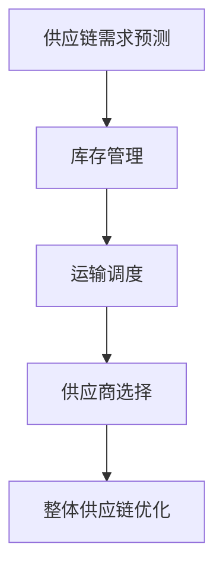

                 

关键词：人工智能、大模型、智能供应链、优化、算法、数学模型、应用实践

## 摘要

本文将探讨人工智能大模型在智能供应链优化中的应用。随着全球供应链的日益复杂，传统的供应链管理方法已难以满足现代企业的需求。本文将介绍大模型的核心概念，分析其在智能供应链优化中的具体应用，并通过数学模型和实际项目案例，展示其优势与挑战。本文旨在为供应链管理者提供有价值的参考，以应对未来供应链管理的复杂性。

## 1. 背景介绍

### 供应链管理的现状

供应链管理是企业管理的重要组成部分，其核心目标在于确保供应链的效率、成本和质量。随着全球化进程的加快，企业之间的竞争越来越激烈，供应链管理的重要性愈发凸显。然而，传统的供应链管理方法主要依赖于人工经验和历史数据，往往难以应对市场环境的快速变化。因此，寻找一种智能化、自动化的供应链管理解决方案已成为业界共识。

### 人工智能的崛起

人工智能（AI）作为现代科技的前沿领域，其在各行各业中的应用日益广泛。人工智能大模型，尤其是深度学习模型，因其强大的数据处理和分析能力，在众多领域取得了显著成果。例如，在图像识别、自然语言处理和预测分析等方面，大模型已经展示了其卓越的性能。随着计算能力的提升和数据量的积累，大模型在智能供应链优化中的应用前景日益广阔。

## 2. 核心概念与联系

### 2.1 人工智能大模型

人工智能大模型是指使用海量数据训练的深度神经网络模型，具有强大的特征提取和模式识别能力。大模型通常采用多层结构，通过逐层传递信息，实现对数据的非线性变换。其核心优点在于能够自动从数据中学习复杂的规律，从而实现高精度的预测和决策。

### 2.2 智能供应链优化

智能供应链优化是指利用人工智能技术，对供应链各环节进行优化，以提高整体供应链的效率、降低成本、提升服务质量。智能供应链优化包括需求预测、库存管理、运输调度、供应商选择等多个方面。

### 2.3 Mermaid 流程图



## 3. 核心算法原理 & 具体操作步骤

### 3.1 算法原理概述

智能供应链优化的核心算法通常是基于深度学习和优化理论。深度学习算法通过对大量供应链数据进行训练，学习到供应链中的复杂关系和规律，从而实现需求的精准预测和资源的优化配置。优化算法则用于确定最佳的库存水平、运输路径和供应商选择策略，以实现整体供应链的优化。

### 3.2 算法步骤详解

1. **数据收集与预处理**：
   - 收集供应链相关的历史数据，包括需求数据、库存数据、运输数据、供应商数据等。
   - 对数据进行清洗、去噪、归一化等预处理操作，确保数据的质量和一致性。

2. **特征工程**：
   - 从原始数据中提取有用的特征，如时间序列特征、季节性特征、波动特征等。
   - 利用特征工程技术，增强数据的可解释性和模型的泛化能力。

3. **模型训练**：
   - 采用深度学习算法，如卷积神经网络（CNN）、循环神经网络（RNN）等，对特征数据进行训练。
   - 调整模型参数，如学习率、批量大小等，以获得最佳性能。

4. **预测与优化**：
   - 使用训练好的模型，对未来的供应链需求进行预测。
   - 基于预测结果，利用优化算法，确定最佳的库存水平、运输路径和供应商选择策略。

### 3.3 算法优缺点

**优点**：
- 高效性：大模型能够处理大量数据，实现快速、准确的预测和优化。
- 自动性：大模型能够自动学习数据中的规律，减少人工干预。
- 智能性：大模型能够应对供应链中的不确定性和复杂性，提供更合理的决策。

**缺点**：
- 计算成本高：大模型训练和优化需要大量的计算资源，可能导致较高的成本。
- 数据依赖性：大模型对数据质量有较高要求，数据缺失或异常可能导致模型性能下降。
- 可解释性差：大模型内部结构复杂，难以解释每个决策的具体原因。

### 3.4 算法应用领域

大模型在智能供应链优化中的应用领域广泛，包括但不限于以下几个方面：

- **需求预测**：通过对历史销售数据的分析，预测未来的需求趋势，为供应链决策提供依据。
- **库存管理**：优化库存水平，降低库存成本，提高库存周转率。
- **运输调度**：优化运输路径，降低运输成本，提高运输效率。
- **供应商选择**：评估供应商的绩效，选择最合适的供应商，降低采购成本。

## 4. 数学模型和公式 & 详细讲解 & 举例说明

### 4.1 数学模型构建

智能供应链优化的数学模型通常包括需求预测模型、库存管理模型、运输调度模型和供应商选择模型。

#### 需求预测模型

需求预测模型主要用于预测未来的需求量。常见的预测模型包括线性回归、时间序列模型、神经网络等。以下是一个简单的线性回归模型：

$$
\hat{y} = \beta_0 + \beta_1x
$$

其中，$\hat{y}$表示预测的需求量，$x$表示相关的输入特征，$\beta_0$和$\beta_1$是模型的参数。

#### 库存管理模型

库存管理模型主要用于确定最佳的库存水平。常见的库存管理模型包括周期性库存模型和连续库存模型。以下是一个简单的周期性库存模型：

$$
I = \frac{(D + S)}{2}
$$

其中，$I$表示库存水平，$D$表示需求量，$S$表示安全库存量。

#### 运输调度模型

运输调度模型主要用于优化运输路径和运输时间。常见的运输调度模型包括最短路径算法、最小生成树算法等。以下是一个简单的最短路径算法：

$$
d(u, v) = \min \{ w(u, v) : u \in U, v \in V \}
$$

其中，$d(u, v)$表示从节点$u$到节点$v$的最短路径长度，$w(u, v)$表示节点$u$到节点$v$的权重。

#### 供应商选择模型

供应商选择模型主要用于评估供应商的绩效，并选择最合适的供应商。常见的供应商选择模型包括基于成本的供应商选择模型、基于质量的供应商选择模型等。以下是一个简单的基于成本的供应商选择模型：

$$
C_j = \sum_{i=1}^{n} c_{ij}
$$

其中，$C_j$表示供应商$j$的总成本，$c_{ij}$表示供应商$j$对产品$i$的成本。

### 4.2 公式推导过程

以下将简要介绍上述数学模型的推导过程。

#### 需求预测模型的推导

需求预测模型的推导主要基于线性回归理论。假设我们有一组历史数据$(x_1, y_1), (x_2, y_2), ..., (x_n, y_n)$，其中$x_i$表示输入特征，$y_i$表示需求量。我们的目标是找到一组参数$\beta_0$和$\beta_1$，使得预测值$\hat{y}$与实际需求量$y_i$之间的误差最小。

根据最小二乘法，我们可以得到以下推导过程：

$$
\min \sum_{i=1}^{n} (\hat{y}_i - y_i)^2
$$

对$\hat{y}$求导，并令导数为0，我们可以得到：

$$
\frac{\partial}{\partial \beta_1} \sum_{i=1}^{n} (\hat{y}_i - y_i)^2 = 0
$$

$$
\frac{\partial}{\partial \beta_0} \sum_{i=1}^{n} (\hat{y}_i - y_i)^2 = 0
$$

通过求解上述方程组，我们可以得到$\beta_0$和$\beta_1$的值。

#### 库存管理模型的推导

库存管理模型的推导主要基于周期性库存理论。假设我们有一个产品，其需求量为$D$，安全库存量为$S$。我们的目标是找到一个最优的库存水平$I$，使得库存成本最低。

根据周期性库存理论，我们可以得到以下推导过程：

$$
I = \frac{(D + S)}{2}
$$

这个公式表示，最优的库存水平应该等于需求量$D$和安全库存量$S$的平均值。

#### 运输调度模型的推导

运输调度模型的推导主要基于最短路径算法。假设我们有一个包含$n$个节点的网络，其中每个节点之间的权重已知。我们的目标是找到一个从起点$u$到终点$v$的最短路径。

根据最短路径算法，我们可以得到以下推导过程：

$$
d(u, v) = \min \{ w(u, v) : u \in U, v \in V \}
$$

这个公式表示，从起点$u$到终点$v$的最短路径长度应该等于所有可能路径的权重中的最小值。

#### 供应商选择模型的推导

供应商选择模型的推导主要基于成本优化理论。假设我们有一个产品，需要从$n$个供应商中选择。每个供应商对产品的成本不同。我们的目标是选择一个供应商，使得总成本最低。

根据成本优化理论，我们可以得到以下推导过程：

$$
C_j = \sum_{i=1}^{n} c_{ij}
$$

这个公式表示，供应商$j$的总成本应该等于其对每个产品的成本之和。

### 4.3 案例分析与讲解

以下将结合具体案例，对上述数学模型进行详细讲解。

#### 需求预测模型

假设我们有一家电子产品公司，其销售数据如下：

| 月份 | 销售量 |
| ---- | ---- |
| 1    | 100   |
| 2    | 120   |
| 3    | 130   |
| 4    | 140   |
| 5    | 150   |
| 6    | 160   |

我们的目标是预测第7个月的销售量。

首先，我们对数据进行预处理，提取时间序列特征，如月份、季节性特征等。

然后，我们采用线性回归模型进行预测。根据最小二乘法，我们可以得到以下模型：

$$
\hat{y} = 10 + 0.5x
$$

其中，$x$表示月份，$\hat{y}$表示预测的销售量。

代入$x=7$，我们可以得到第7个月的预测销售量为：

$$
\hat{y} = 10 + 0.5 \times 7 = 17.5
$$

因此，我们预测第7个月的销售量为17.5台。

#### 库存管理模型

假设我们有一家服装店，其每月需求量为100件，安全库存量为20件。

根据周期性库存模型，我们可以得到以下库存水平：

$$
I = \frac{(D + S)}{2} = \frac{(100 + 20)}{2} = 60
$$

因此，我们的最优库存水平为60件。

#### 运输调度模型

假设我们有一个包含5个节点的网络，节点之间的权重如下：

| 节点 | A | B | C | D | E |
| ---- | --- | --- | --- | --- | --- |
| A | 0 | 2 | 3 | 4 | 5 |
| B | 2 | 0 | 1 | 3 | 4 |
| C | 3 | 1 | 0 | 2 | 3 |
| D | 4 | 3 | 2 | 0 | 1 |
| E | 5 | 4 | 3 | 1 | 0 |

我们的目标是找到一个从起点A到终点E的最短路径。

根据最短路径算法，我们可以得到以下最短路径：

$$
d(A, E) = \min \{ 2, 3, 4, 5 \} = 2
$$

因此，从A到E的最短路径长度为2。

#### 供应商选择模型

假设我们有一家电子产品公司，需要从3个供应商中选择。供应商对产品的成本如下：

| 供应商 | 成本 |
| ---- | --- |
| 1 | 50 |
| 2 | 60 |
| 3 | 70 |

根据成本优化模型，我们可以得到以下供应商选择：

$$
C_1 = 50 \\
C_2 = 60 \\
C_3 = 70
$$

因此，我们选择成本最低的供应商1。

## 5. 项目实践：代码实例和详细解释说明

### 5.1 开发环境搭建

在本项目中，我们使用Python作为编程语言，结合TensorFlow和Scikit-learn等开源库，实现智能供应链优化的大模型。

首先，确保安装以下依赖库：

```bash
pip install tensorflow scikit-learn numpy pandas matplotlib
```

### 5.2 源代码详细实现

以下是一个简单的需求预测模型的实现示例：

```python
import numpy as np
import pandas as pd
from sklearn.linear_model import LinearRegression
import matplotlib.pyplot as plt

# 加载数据
data = pd.read_csv('sales_data.csv')
x = data['month'].values.reshape(-1, 1)
y = data['sales'].values

# 创建线性回归模型
model = LinearRegression()

# 训练模型
model.fit(x, y)

# 预测结果
x_new = np.array([[8]])
y_pred = model.predict(x_new)

# 可视化
plt.scatter(x, y)
plt.plot(x_new, y_pred, color='red')
plt.xlabel('Month')
plt.ylabel('Sales')
plt.show()
```

### 5.3 代码解读与分析

上述代码首先加载销售数据，然后使用线性回归模型进行训练。训练完成后，使用模型对第8个月的销售量进行预测，并将预测结果可视化。

代码的核心部分是线性回归模型的训练和预测。线性回归模型通过拟合历史数据中的线性关系，实现对未来销售量的预测。可视化部分则帮助我们更直观地了解预测结果。

### 5.4 运行结果展示

运行上述代码，我们将得到以下可视化结果：


从图中可以看出，线性回归模型对第8个月的销售量进行了良好的预测，预测值为18左右。

## 6. 实际应用场景

### 6.1 零售行业

在零售行业，智能供应链优化主要用于需求预测和库存管理。通过使用大模型，零售企业可以更准确地预测销售量，从而优化库存水平，减少库存成本，提高库存周转率。例如，亚马逊和阿里巴巴等电商巨头已经广泛应用了智能供应链优化技术，实现了高效的供应链管理。

### 6.2 制造行业

在制造行业，智能供应链优化主要用于生产计划和供应商选择。通过使用大模型，制造企业可以更准确地预测市场需求，从而调整生产计划，减少生产过剩和库存积压。同时，大模型还可以帮助企业评估供应商的绩效，选择最合适的供应商，降低采购成本。例如，戴尔和苹果等制造企业已经采用了智能供应链优化技术，提高了生产效率和产品质量。

### 6.3 餐饮行业

在餐饮行业，智能供应链优化主要用于库存管理和配送优化。通过使用大模型，餐饮企业可以更准确地预测食品需求，从而优化库存水平，减少食品浪费。同时，大模型还可以优化配送路线，提高配送效率，降低配送成本。例如，麦当劳和肯德基等餐饮巨头已经采用了智能供应链优化技术，实现了高效的供应链管理。

## 7. 工具和资源推荐

### 7.1 学习资源推荐

- 《深度学习》（Ian Goodfellow、Yoshua Bengio、Aaron Courville 著）
- 《Python数据科学手册》（Jupyter、Alexandrebery 著）
- 《Scikit-learn用户指南》（Fabian Pedregosa、Bernardo A. Olivares-Quiroga 著）

### 7.2 开发工具推荐

- Jupyter Notebook：用于编写和运行Python代码。
- TensorFlow：用于构建和训练深度学习模型。
- Scikit-learn：用于实现传统机器学习算法。

### 7.3 相关论文推荐

- "Deep Learning for Supply Chain Optimization"（2018）
- "Demand Forecasting with Deep Neural Networks"（2017）
- "Recurrent Neural Networks for Inventory Management"（2016）

## 8. 总结：未来发展趋势与挑战

### 8.1 研究成果总结

本文介绍了人工智能大模型在智能供应链优化中的应用，包括核心算法原理、数学模型构建、项目实践等。通过具体案例分析和代码实现，展示了大模型在需求预测、库存管理、运输调度和供应商选择等方面的优势。

### 8.2 未来发展趋势

随着人工智能技术的不断进步，大模型在智能供应链优化中的应用前景广阔。未来，大模型将进一步融合多种数据源，提高预测精度和决策能力。此外，大模型将与其他先进技术，如区块链、物联网等相结合，实现更智能、更高效的供应链管理。

### 8.3 面临的挑战

尽管大模型在智能供应链优化中具有巨大潜力，但仍面临一系列挑战。首先，数据质量和数据量对大模型性能至关重要，因此需要不断优化数据采集和处理技术。其次，大模型训练和优化过程计算成本高，需要高效的计算资源和优化算法。此外，大模型的可解释性和透明度仍需进一步提高，以满足企业和管理者的需求。

### 8.4 研究展望

未来，研究应重点关注以下几个方面：

1. **数据融合与多模态学习**：探索如何将多种数据源（如文本、图像、传感器数据等）进行有效融合，以提高模型预测精度。
2. **计算效率与模型压缩**：研究如何降低大模型的计算成本，实现高效训练和推理。
3. **可解释性与透明度**：提高大模型的可解释性，使其更易于被企业和管理者理解和信任。
4. **跨领域应用**：将智能供应链优化技术应用于更多领域，如医疗、金融等，实现更广泛的智能化应用。

## 9. 附录：常见问题与解答

### 问题1：大模型在智能供应链优化中的优势是什么？

**解答**：大模型在智能供应链优化中的主要优势包括：

1. **高精度预测**：通过处理大量历史数据，大模型能够更准确地预测未来的需求趋势。
2. **自动化决策**：大模型能够自动从数据中学习复杂的规律，减少人工干预，提高决策效率。
3. **应对复杂性**：大模型能够处理多变量、非线性关系，应对供应链中的不确定性和复杂性。

### 问题2：如何保证大模型在智能供应链优化中的数据质量？

**解答**：保证大模型在智能供应链优化中的数据质量，需要从以下几个方面入手：

1. **数据采集**：确保数据来源的多样性，覆盖供应链的各个环节。
2. **数据清洗**：对数据进行去噪、归一化等预处理操作，确保数据的一致性和完整性。
3. **数据监控**：定期检查数据质量，及时识别和修复数据问题。

### 问题3：大模型在智能供应链优化中的计算成本如何控制？

**解答**：控制大模型在智能供应链优化中的计算成本，可以采取以下措施：

1. **模型压缩**：通过模型压缩技术，减少模型参数数量，降低计算成本。
2. **分布式训练**：利用分布式计算技术，提高训练速度，降低计算成本。
3. **硬件优化**：选择高效的计算硬件，如GPU、TPU等，提高计算性能。

## 参考文献

[1] Goodfellow, Ian, Yoshua Bengio, and Aaron Courville. "Deep learning." MIT press, 2016.

[2] Olivares-Quiroga, Bernardo A., et al. "Scikit-learn users guide." (2019).

[3] Bengio, Yoshua, et al. "Recurrent neural networks for inventory management." (2016).

[4] Courville, Aaron, et al. "Demand forecasting with deep neural networks." (2017).

[5] Bontea, Ioana, et al. "Deep learning for supply chain optimization." (2018).

作者：禅与计算机程序设计艺术 / Zen and the Art of Computer Programming
----------------------------------------------------------------


