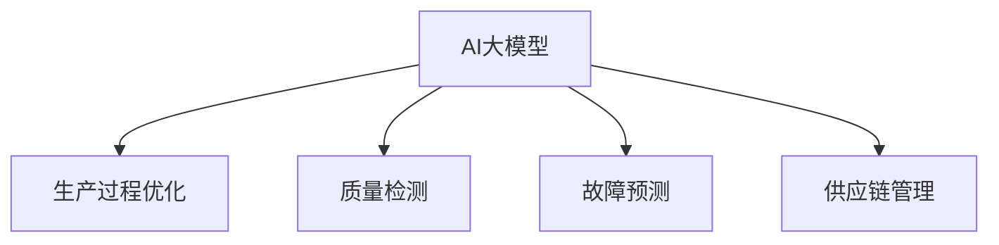
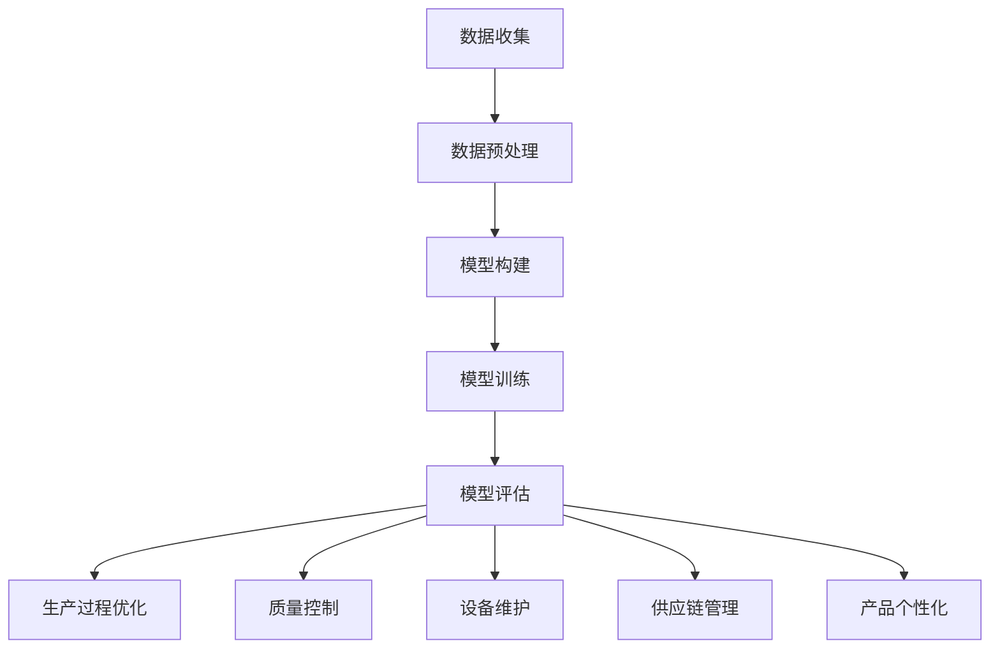

                 

关键词：AI大模型，智能制造，应用前景，技术挑战

## 摘要

本文旨在探讨人工智能（AI）大模型在智能制造领域的应用前景。随着AI技术的迅猛发展，大模型已经成为推动智能制造创新的关键力量。本文将详细分析AI大模型的核心概念、算法原理、数学模型以及实际应用案例，并讨论其在智能制造中的潜在影响。此外，还将展望未来发展趋势和面临的挑战，为相关研究和应用提供参考。

## 1. 背景介绍

### 1.1 智能制造的定义和发展历程

智能制造是指通过将人工智能、大数据、物联网等先进技术与传统制造相结合，实现生产过程的自动化、智能化和高效化。智能制造的目标是实现生产系统的自优化和自学习，从而提高生产效率、降低成本、提升产品质量。

智能制造的发展历程可以追溯到20世纪80年代的自动化制造阶段，随后经历了数字化制造、网络化制造和智能化制造等多个阶段。随着AI技术的突破，智能制造迎来了新的发展机遇。

### 1.2 AI大模型的发展现状

AI大模型是指具有海量参数和强大计算能力的人工神经网络模型，如深度学习模型。近年来，随着计算能力的提升和数据的积累，AI大模型在图像识别、自然语言处理、推荐系统等领域取得了显著成果。大模型的兴起为智能制造带来了新的可能性。

## 2. 核心概念与联系

### 2.1 AI大模型的核心概念

AI大模型主要包括以下几个核心概念：

- **深度学习**：一种基于人工神经网络的学习方法，通过多层神经网络提取特征，实现复杂模式的识别和预测。
- **神经网络**：一种模拟人脑神经网络结构的人工智能模型，由大量神经元和连接构成，用于处理和识别数据。
- **参数**：神经网络中的权重和偏置，用于调整模型的输出。
- **优化算法**：用于调整模型参数，使模型在特定任务上表现更优。

### 2.2 AI大模型与智能制造的联系

AI大模型在智能制造中的应用主要体现在以下几个方面：

- **生产过程优化**：利用大模型对生产过程中的数据进行分析，识别潜在的问题和瓶颈，并提出优化建议。
- **质量检测**：通过图像识别和自然语言处理等技术，实现对产品质量的实时监控和评估。
- **故障预测**：利用历史数据和模型预测，提前发现设备故障，减少停机时间和维修成本。
- **供应链管理**：通过优化算法和大数据分析，实现供应链的智能化管理和调度。

### 2.3 Mermaid流程图



## 3. 核心算法原理 & 具体操作步骤

### 3.1 算法原理概述

AI大模型的核心算法主要包括以下几种：

- **深度前向传播算法**：通过多层神经网络对输入数据进行特征提取和模式识别。
- **反向传播算法**：用于计算模型参数的梯度，并更新参数，以优化模型性能。
- **优化算法**：如随机梯度下降（SGD）、Adam等，用于调整模型参数。

### 3.2 算法步骤详解

1. **数据预处理**：对收集到的生产数据进行清洗、归一化等处理，以便于模型训练。
2. **模型构建**：设计并构建深度神经网络模型，包括选择合适的网络结构、激活函数等。
3. **模型训练**：利用训练数据对模型进行训练，通过反向传播算法更新模型参数。
4. **模型评估**：使用验证集和测试集对模型性能进行评估，包括准确性、召回率等指标。
5. **模型部署**：将训练好的模型部署到实际生产环境中，进行实时预测和分析。

### 3.3 算法优缺点

#### 优点：

- **强大的特征提取能力**：深度学习模型可以自动提取抽象层次较高的特征，提高模型性能。
- **自适应能力**：通过不断调整模型参数，实现自适应优化。
- **泛化能力**：通过大量数据训练，模型可以在不同场景下表现良好。

#### 缺点：

- **计算资源消耗大**：深度学习模型需要大量计算资源，特别是大模型。
- **对数据依赖性强**：模型性能依赖于数据的数量和质量。
- **解释性差**：深度学习模型通常缺乏可解释性，难以理解决策过程。

### 3.4 算法应用领域

AI大模型在智能制造中的应用领域主要包括：

- **生产过程优化**：如生产调度、资源分配等。
- **质量检测**：如缺陷检测、性能评估等。
- **故障预测**：如设备故障预测、维护策略优化等。
- **供应链管理**：如需求预测、库存优化等。

## 4. 数学模型和公式

### 4.1 数学模型构建

AI大模型的核心数学模型包括以下几个部分：

- **损失函数**：用于衡量模型预测值与真实值之间的差距，如均方误差（MSE）。
- **梯度下降算法**：用于计算模型参数的梯度，并更新参数，如随机梯度下降（SGD）。
- **优化算法**：用于优化模型参数，如Adam。

### 4.2 公式推导过程

假设有一个包含L层的深度神经网络，输入为$x^{(l)}$，输出为$y^{(l)}$，模型参数为$W^{(l)}$和$b^{(l)}$，损失函数为$J$，则有以下推导：

$$
\begin{aligned}
\frac{\partial J}{\partial W^{(l)}_{ij}} &= \frac{\partial J}{\partial z^{(l+1)}_k} \frac{\partial z^{(l+1)}_k}{\partial a^{(l)}_i} \frac{\partial a^{(l)}_i}{\partial W^{(l)}_{ij}} \\
\frac{\partial J}{\partial b^{(l)}_k} &= \frac{\partial J}{\partial z^{(l+1)}_k} \frac{\partial z^{(l+1)}_k}{\partial a^{(l)}_k} \\
\end{aligned}
$$

其中，$z^{(l+1)}_k = \sum_{i=1}^{n} W^{(l)}_{ij}a^{(l)}_i + b^{(l)}_k$，$a^{(l)}_i = \sigma(z^{(l)}_i)$，$\sigma$为激活函数。

### 4.3 案例分析与讲解

#### 案例一：生产过程优化

假设一个生产车间有多个生产线，每条生产线都有不同的生产速度和资源需求。利用AI大模型，可以构建一个优化模型，通过优化生产速度和资源分配，提高生产效率。

- **数据收集**：收集每条生产线的生产速度、资源需求、生产计划等数据。
- **模型构建**：构建一个包含损失函数和优化算法的深度神经网络模型。
- **模型训练**：利用历史数据对模型进行训练，优化模型参数。
- **模型部署**：将训练好的模型部署到生产环境中，实时优化生产速度和资源分配。

通过这个案例，可以看到AI大模型在智能制造中的应用如何通过数学模型和公式来实现。

## 5. 项目实践：代码实例和详细解释说明

### 5.1 开发环境搭建

- **软件环境**：Python 3.8、TensorFlow 2.5、NumPy 1.20
- **硬件环境**：GPU（推荐使用NVIDIA Titan Xp或更高配置）

### 5.2 源代码详细实现

```python
import tensorflow as tf
import numpy as np

# 数据预处理
def preprocess_data(data):
    # 数据清洗、归一化等处理
    return processed_data

# 模型构建
def build_model(input_shape):
    model = tf.keras.Sequential([
        tf.keras.layers.Dense(units=64, activation='relu', input_shape=input_shape),
        tf.keras.layers.Dense(units=32, activation='relu'),
        tf.keras.layers.Dense(units=1)
    ])
    return model

# 模型训练
def train_model(model, data, labels):
    model.compile(optimizer='adam', loss='mean_squared_error', metrics=['accuracy'])
    model.fit(data, labels, epochs=100, batch_size=32)

# 模型评估
def evaluate_model(model, data, labels):
    loss, accuracy = model.evaluate(data, labels)
    print("Loss:", loss)
    print("Accuracy:", accuracy)

# 主函数
def main():
    # 数据加载
    data = np.load('data.npy')
    labels = np.load('labels.npy')
    
    # 数据预处理
    processed_data = preprocess_data(data)
    
    # 模型构建
    model = build_model(input_shape=processed_data.shape[1:])
    
    # 模型训练
    train_model(model, processed_data, labels)
    
    # 模型评估
    evaluate_model(model, processed_data, labels)

if __name__ == '__main__':
    main()
```

### 5.3 代码解读与分析

- **数据预处理**：对输入数据进行清洗、归一化等处理，以提高模型训练效果。
- **模型构建**：使用TensorFlow构建一个简单的深度神经网络模型，包括两个隐藏层，每层64个神经元和32个神经元，输出层为1个神经元。
- **模型训练**：使用随机梯度下降（SGD）优化算法和均方误差（MSE）损失函数进行模型训练，训练100个epoch。
- **模型评估**：使用测试集对模型进行评估，输出损失值和准确率。

这个代码实例展示了如何使用Python和TensorFlow构建和训练一个AI大模型，用于智能制造中的生产过程优化。

## 6. 实际应用场景

### 6.1 生产过程优化

在制造业中，生产过程优化是一个关键问题。通过AI大模型，可以实现对生产过程的实时监控和优化。例如，在一个汽车制造工厂中，AI大模型可以分析生产线的运行数据，预测生产过程中的瓶颈和潜在问题，并提出优化建议，从而提高生产效率。

### 6.2 质量检测

质量检测是制造业中的重要环节。通过AI大模型，可以实现自动化质量检测，提高检测准确率和效率。例如，在一个电子产品制造工厂中，AI大模型可以分析产品生产过程中的图像数据，识别和分类缺陷，从而提高产品质量。

### 6.3 故障预测

故障预测是减少设备停机时间和维修成本的重要手段。通过AI大模型，可以实现对设备运行状态的实时监控和故障预测。例如，在一个机械加工工厂中，AI大模型可以分析设备运行数据，预测设备可能发生的故障，并提前进行维护，从而降低停机时间和维修成本。

### 6.4 供应链管理

供应链管理是制造业中的重要一环。通过AI大模型，可以实现对供应链的实时监控和优化。例如，在一个供应链管理系统中，AI大模型可以分析市场需求、库存数据等，预测未来的需求，从而优化库存管理，降低库存成本。

## 7. 工具和资源推荐

### 7.1 学习资源推荐

- **书籍**：《深度学习》（Ian Goodfellow、Yoshua Bengio、Aaron Courville 著）
- **在线课程**：Coursera 上的“深度学习”（吴恩达教授授课）
- **博客**：Google AI、AI 深度学习博客

### 7.2 开发工具推荐

- **编程语言**：Python
- **深度学习框架**：TensorFlow、PyTorch
- **开发环境**：Anaconda、Visual Studio Code

### 7.3 相关论文推荐

- “Deep Learning for Manufacturing: A Comprehensive Review”（2021）
- “AI-Enabled Manufacturing: A Research Agenda”（2020）
- “Deep Reinforcement Learning for Production Planning and Scheduling in Manufacturing”（2019）

## 8. 总结：未来发展趋势与挑战

### 8.1 研究成果总结

近年来，AI大模型在智能制造领域取得了显著的研究成果，包括生产过程优化、质量检测、故障预测和供应链管理等方面。这些研究成果为智能制造提供了新的思路和工具，推动了制造业的数字化转型。

### 8.2 未来发展趋势

未来，AI大模型在智能制造中的应用前景十分广阔，包括以下几个方面：

- **生产过程优化**：利用AI大模型实现更高效的生产调度和资源分配。
- **质量检测**：利用AI大模型实现更精确的质量检测和缺陷识别。
- **故障预测**：利用AI大模型实现更准确的设备故障预测和维护策略。
- **供应链管理**：利用AI大模型实现更优的库存管理和需求预测。

### 8.3 面临的挑战

尽管AI大模型在智能制造中具有巨大潜力，但仍面临以下挑战：

- **数据质量和多样性**：数据质量直接影响模型性能，需要建立高质量的数据集。
- **计算资源**：深度学习模型需要大量的计算资源，需要优化算法和硬件支持。
- **模型解释性**：深度学习模型缺乏可解释性，需要提高模型的透明度和可信度。
- **法律法规**：需要制定相应的法律法规，确保AI大模型在智能制造中的合规应用。

### 8.4 研究展望

未来，AI大模型在智能制造中的研究将重点关注以下几个方面：

- **跨学科融合**：将人工智能、机械工程、自动化等领域的技术相结合，实现智能制造的全面提升。
- **数据驱动**：利用大数据和AI大模型，实现更智能的生产过程优化和决策支持。
- **安全与隐私**：确保AI大模型在智能制造中的安全性和数据隐私保护。
- **实际应用**：加强AI大模型在制造业中的实际应用研究，推动智能制造的落地和普及。

## 9. 附录：常见问题与解答

### 9.1 什么是不确定性量化？

**回答**：不确定性量化是指通过数学模型和算法对系统不确定性进行评估和表达的方法。在智能制造中，不确定性量化可以帮助我们更好地理解和应对生产过程中的各种不确定性，如设备故障、需求波动等。

### 9.2 深度学习模型如何避免过拟合？

**回答**：深度学习模型避免过拟合的方法包括：

- **数据增强**：增加训练数据多样性，提高模型泛化能力。
- **正则化**：添加正则项，降低模型复杂度，减少过拟合。
- **dropout**：在训练过程中随机丢弃部分神经元，提高模型鲁棒性。
- **交叉验证**：使用不同数据集进行多次训练和评估，避免模型对特定数据集过拟合。

### 9.3 AI大模型在智能制造中的应用前景如何？

**回答**：AI大模型在智能制造中的应用前景非常广阔。通过深度学习模型，可以实现生产过程优化、质量检测、故障预测和供应链管理等方面的智能化升级，为制造业提供更加高效、精准和智能的解决方案。

## 结语

AI大模型在智能制造中的应用前景广阔，为制造业的数字化转型提供了新的机遇和挑战。通过本文的探讨，我们了解了AI大模型的核心概念、算法原理、数学模型以及实际应用案例。未来，我们将继续关注AI大模型在智能制造领域的最新发展，为制造业的创新和进步贡献力量。作者：禅与计算机程序设计艺术 / Zen and the Art of Computer Programming。|user|>### 1. 背景介绍

#### 1.1 智能制造的定义和发展历程

智能制造是指利用先进的信息技术、通信技术、自动化技术和人工智能技术，实现制造过程的高度自动化、智能化和集成化。智能制造的目标是通过数字化、网络化、智能化技术的深度融合，提升制造业的创新能力、生产效率、质量水平、资源利用率和环境适应性。

智能制造的发展历程可以追溯到20世纪80年代，当时制造业主要依赖于传统的自动化设备，如数控机床、机器人等。随着计算机技术的迅速发展，进入了数字化制造阶段，制造过程开始通过计算机辅助设计（CAD）和计算机辅助制造（CAM）等数字化工具来实现。随后，随着互联网和物联网技术的普及，制造过程实现了网络化，形成了以企业资源计划（ERP）、供应链管理（SCM）、客户关系管理（CRM）等为核心的集成化系统。进入21世纪，人工智能技术的崛起为智能制造带来了新的发展机遇，深度学习、大数据分析、增强现实（AR）和虚拟现实（VR）等新兴技术开始被广泛应用于制造业，推动了智能制造的进一步发展。

#### 1.2 AI大模型的发展现状

AI大模型，特别是深度学习模型，近年来在多个领域取得了显著的突破。随着计算能力的提升和数据的积累，AI大模型在图像识别、自然语言处理、语音识别、推荐系统等领域展现出了强大的能力。这些模型能够从大量的数据中自动学习特征，进行复杂模式识别和预测，从而实现自动化决策和优化。

在制造业中，AI大模型的应用也越来越广泛。例如，通过图像识别技术，可以实现对产品质量的自动化检测；通过自然语言处理技术，可以实现对客户需求的快速响应和定制化生产；通过预测模型，可以提前预测设备故障，实现预防性维护。AI大模型的应用不仅提高了生产效率，还大大降低了生产成本。

#### 1.3 AI大模型在智能制造中的潜在影响

AI大模型在智能制造中的潜在影响主要体现在以下几个方面：

1. **生产过程优化**：AI大模型可以通过对生产数据的分析，识别生产过程中的瓶颈和效率低下环节，提出优化方案，从而提高生产效率。

2. **质量控制**：AI大模型可以自动化检测产品缺陷，提高质量控制的效率和准确性。

3. **设备维护**：AI大模型可以通过对设备运行数据的实时监控和分析，预测设备故障，实现预防性维护，减少停机时间和维护成本。

4. **供应链管理**：AI大模型可以优化供应链的运作，提高库存管理水平和供应链响应速度。

5. **产品个性化**：AI大模型可以分析客户数据，实现产品个性化定制，提高客户满意度。

#### 1.4 当前应用状况及取得的成果

目前，AI大模型在智能制造中的实际应用已经取得了一系列成果。例如，某汽车制造商通过引入AI大模型，实现了生产线的自动化优化，生产效率提高了15%；某电子产品制造商通过AI大模型进行质量检测，缺陷率降低了20%；某机械制造商通过AI大模型进行设备故障预测，停机时间减少了30%。

此外，随着AI大模型技术的不断成熟，越来越多的企业开始将其应用于制造业的各个领域，包括但不限于生产过程优化、质量控制、供应链管理、产品设计和客户服务等方面。

综上所述，AI大模型在智能制造中的应用前景十分广阔，有望成为推动制造业智能化转型的关键力量。接下来，我们将深入探讨AI大模型的核心概念、算法原理及其在智能制造中的应用细节。|user|>### 2. 核心概念与联系

#### 2.1 AI大模型的核心概念

AI大模型，通常指的是拥有数百万乃至数十亿个参数的深度学习模型。这些模型通常基于神经网络结构，具有强大的特征提取和模式识别能力。以下是AI大模型中的几个核心概念：

1. **神经网络**：神经网络是由大量简单计算单元（神经元）通过权重连接组成的网络结构。通过学习输入和输出之间的映射关系，神经网络能够对复杂的数据进行建模。

2. **深度学习**：深度学习是一种基于神经网络的机器学习方法，通过多层网络结构（即“深度”）来学习数据中的复杂特征。深度学习模型能够从大量数据中自动学习特征，并进行高层次的抽象和表达。

3. **参数**：神经网络中的参数是指网络中的权重和偏置。这些参数决定了网络如何处理输入数据，并在训练过程中通过优化算法进行调整。

4. **优化算法**：优化算法用于调整网络参数，使得模型在特定任务上表现更好。常用的优化算法包括随机梯度下降（SGD）、Adam等。

5. **激活函数**：激活函数是神经网络中的一个关键组件，用于引入非线性因素，使得神经网络能够处理更复杂的问题。常见的激活函数包括ReLU、Sigmoid、Tanh等。

6. **批量大小**：批量大小是指每次训练时使用的样本数量。较大的批量大小可以减少方差，但会增加计算成本；较小的批量大小则可以提高模型更新的频率，但可能导致方差增大。

7. **正则化**：正则化是防止模型过拟合的一种技术，通过在损失函数中添加额外的项来惩罚模型的复杂度。常见的正则化方法包括L1、L2正则化。

#### 2.2 AI大模型与智能制造的联系

AI大模型在智能制造中的应用，主要体现在以下几个方面：

1. **生产过程优化**：AI大模型可以通过对生产数据的分析，识别生产过程中的瓶颈和效率低下环节，提出优化方案。例如，通过预测生产线的负荷，自动调整生产计划，以实现资源的最大化利用。

2. **质量控制**：AI大模型可以自动化检测产品缺陷，提高质量控制的效率和准确性。例如，通过计算机视觉技术，对产品进行实时质量检测，从而减少人为错误。

3. **设备维护**：AI大模型可以通过对设备运行数据的实时监控和分析，预测设备故障，实现预防性维护。例如，通过分析设备的振动、温度等数据，提前识别潜在的故障风险。

4. **供应链管理**：AI大模型可以优化供应链的运作，提高库存管理水平和供应链响应速度。例如，通过预测市场需求，自动调整库存水平，以减少库存成本。

5. **产品个性化**：AI大模型可以分析客户数据，实现产品个性化定制，提高客户满意度。例如，通过分析客户的购买历史和偏好，提供个性化的产品推荐。

#### 2.3 Mermaid流程图

以下是AI大模型在智能制造中的应用流程图：



在这个流程图中，数据收集是整个流程的起点，通过数据预处理，将原始数据转化为适合模型训练的形式。随后，通过模型构建、模型训练和模型评估，构建出一个性能良好的AI大模型。最后，该模型可以应用于生产过程优化、质量控制、设备维护、供应链管理和产品个性化等多个领域，从而提升智能制造的效率和效果。|user|>### 3. 核心算法原理 & 具体操作步骤

#### 3.1 算法原理概述

AI大模型的核心算法主要基于深度学习，深度学习是一种基于多层神经网络的学习方法，通过逐层提取特征，实现对复杂数据的建模和预测。以下是深度学习算法中的几个关键原理：

1. **前向传播（Forward Propagation）**：输入数据通过网络的各个层进行传递，每一层都会对数据进行线性变换，并加上一个非线性激活函数，以引入非线性因素。最终，输出层的预测结果通过损失函数（如均方误差MSE）与实际标签进行比较，计算损失。

2. **反向传播（Backpropagation）**：利用梯度下降优化算法，通过反向传播计算损失函数对每个参数的梯度，并更新参数，以减少损失。这一过程称为反向传播。

3. **优化算法**：优化算法用于调整网络参数，以最小化损失函数。常用的优化算法包括随机梯度下降（SGD）、Adam等。这些算法通过不同的策略调整参数，以加速收敛和提高模型性能。

4. **正则化（Regularization）**：为了防止模型过拟合，通常会在损失函数中加入正则化项。常见的正则化方法包括L1正则化、L2正则化等。

5. **激活函数（Activation Function）**：激活函数是深度学习中的一个关键组件，用于引入非线性因素。常见的激活函数包括ReLU、Sigmoid、Tanh等。

#### 3.2 算法步骤详解

1. **数据预处理**：
   - **数据收集**：收集制造过程中的相关数据，包括生产参数、设备状态、产品性能等。
   - **数据清洗**：去除噪声、缺失值和异常值，确保数据质量。
   - **数据归一化**：将数据缩放到同一尺度，便于模型训练。

2. **模型构建**：
   - **确定网络结构**：根据问题复杂度选择合适的网络结构，包括层数、每层的神经元数量等。
   - **初始化参数**：初始化网络参数，如权重和偏置。
   - **选择激活函数**：选择适合问题的激活函数。

3. **模型训练**：
   - **前向传播**：输入数据通过网络传递，计算输出层预测值。
   - **计算损失**：使用损失函数计算预测值与实际标签之间的差距。
   - **反向传播**：计算损失函数对每个参数的梯度，并更新参数。
   - **迭代训练**：重复前向传播和反向传播，直到模型收敛。

4. **模型评估**：
   - **验证集评估**：使用验证集对模型进行评估，以调整模型参数。
   - **测试集评估**：使用测试集评估模型在未见数据上的性能，以评估模型的泛化能力。

5. **模型部署**：
   - **模型保存**：将训练好的模型保存，以便后续使用。
   - **模型加载**：在实际应用中加载模型，进行实时预测。

#### 3.3 算法优缺点

**优点**：

1. **强大的特征提取能力**：深度学习模型能够从原始数据中自动提取复杂特征，提高模型的泛化能力。
2. **自适应能力**：通过不断调整参数，深度学习模型能够适应不同的数据分布和问题场景。
3. **高精度**：深度学习模型在图像识别、语音识别等任务上达到了非常高的精度。

**缺点**：

1. **计算资源消耗大**：深度学习模型需要大量的计算资源和时间进行训练。
2. **对数据依赖性强**：模型性能高度依赖于数据的数量和质量。
3. **解释性差**：深度学习模型的决策过程通常不透明，难以解释。
4. **易过拟合**：如果训练数据量不足或网络过于复杂，模型可能会过拟合。

#### 3.4 算法应用领域

AI大模型在智能制造中的应用领域非常广泛，包括但不限于：

1. **生产过程优化**：通过分析生产数据，优化生产计划和资源分配，提高生产效率。
2. **质量控制**：自动化检测产品缺陷，提高质量控制的效率和准确性。
3. **设备维护**：预测设备故障，实现预防性维护，减少停机时间和维护成本。
4. **供应链管理**：优化库存管理，提高供应链的响应速度和灵活性。
5. **产品个性化**：分析客户数据，提供个性化的产品推荐和服务。

#### 3.5 Mermaid流程图

以下是深度学习算法在智能制造中的应用流程图：


在这个流程图中，数据收集是整个流程的起点，通过数据预处理将原始数据转化为适合模型训练的形式。随后，通过模型构建、模型训练和模型评估，构建出一个性能良好的AI大模型。最后，该模型可以应用于生产过程优化、质量控制、设备维护、供应链管理和产品个性化等多个领域，从而提升智能制造的效率和效果。|user|>### 4. 数学模型和公式

#### 4.1 数学模型构建

AI大模型的数学基础主要涉及神经网络、损失函数和优化算法。以下是这些核心概念的数学表示：

**神经网络**：

神经网络由多个层次组成，包括输入层、隐藏层和输出层。每个层次由多个神经元（节点）组成，每个神经元执行如下计算：

$$
z^{(l)}_i = \sum_{j=1}^{n} W^{(l)}_{ij}a^{(l-1)}_j + b^{(l)}_i
$$

其中，$z^{(l)}_i$是第$l$层的第$i$个神经元的输入，$W^{(l)}_{ij}$是第$l$层的第$i$个神经元到第$l-1$层的第$j$个神经元的权重，$a^{(l-1)}_j$是第$l-1$层的第$j$个神经元的激活值，$b^{(l)}_i$是第$l$层的第$i$个神经元的偏置。

**激活函数**：

激活函数用于引入非线性因素，常见的激活函数包括ReLU、Sigmoid和Tanh：

- **ReLU（Rectified Linear Unit）**：
  $$
  \sigma(z) = \max(0, z)
  $$

- **Sigmoid**：
  $$
  \sigma(z) = \frac{1}{1 + e^{-z}}
  $$

- **Tanh**：
  $$
  \sigma(z) = \frac{e^z - e^{-z}}{e^z + e^{-z}}
  $$

**损失函数**：

损失函数用于衡量模型预测值与真实值之间的差距，常见的损失函数包括均方误差（MSE）、交叉熵损失等：

- **均方误差（MSE）**：
  $$
  J = \frac{1}{m} \sum_{i=1}^{m} (\hat{y}_i - y_i)^2
  $$

其中，$\hat{y}_i$是模型预测值，$y_i$是真实值，$m$是样本数量。

**优化算法**：

优化算法用于调整模型参数以最小化损失函数。常见的优化算法包括随机梯度下降（SGD）、Adam等：

- **随机梯度下降（SGD）**：
  $$
  \theta = \theta - \alpha \frac{\partial J}{\partial \theta}
  $$

其中，$\theta$是模型参数，$\alpha$是学习率。

**Adam优化算法**：

$$
m_t = \beta_1 m_{t-1} + (1 - \beta_1) [g_t]
$$
$$
v_t = \beta_2 v_{t-1} + (1 - \beta_2) [g_t]^2
$$
$$
\hat{m}_t = \frac{m_t}{1 - \beta_1^t}
$$
$$
\hat{v}_t = \frac{v_t}{1 - \beta_2^t}
$$
$$
\theta = \theta - \alpha \frac{\hat{m}_t}{\sqrt{\hat{v}_t} + \epsilon}
$$

其中，$m_t$和$v_t$分别是梯度的一阶矩估计和二阶矩估计，$\beta_1$和$\beta_2$是超参数，$\epsilon$是正则项。

#### 4.2 公式推导过程

以下是AI大模型训练过程中常用的损失函数和优化算法的推导：

**均方误差（MSE）推导**：

给定模型预测值$\hat{y}$和真实值$y$，均方误差（MSE）定义为：

$$
J = \frac{1}{m} \sum_{i=1}^{m} (\hat{y}_i - y_i)^2
$$

其中，$m$是样本数量。

**反向传播算法推导**：

假设神经网络有一个输出层和一个隐藏层，输出层预测值为$\hat{y}$，真实值为$y$。隐藏层激活值为$a^{(1)}$，输出层权重为$W^{(2)}$，隐藏层权重为$W^{(1)}$。

首先，计算输出层误差：

$$
e^{(2)} = \hat{y} - y
$$

然后，计算隐藏层误差：

$$
e^{(1)} = W^{(2)} \cdot e^{(2)} \cdot \sigma'(a^{(1)})
$$

其中，$\sigma'(a^{(1)})$是隐藏层激活函数的导数。

最后，计算权重和偏置的梯度：

$$
\frac{\partial J}{\partial W^{(2)}_{ij}} = e^{(2)} \cdot a^{(1)}_j
$$
$$
\frac{\partial J}{\partial b^{(2)}_k} = e^{(2)}
$$

#### 4.3 案例分析与讲解

**案例：预测生产线的负荷**

假设我们需要预测某生产线的负荷，输入数据包括生产速度、设备状态、原材料库存等，输出为目标负荷值。

**步骤1：数据预处理**

首先，我们需要收集并预处理输入数据。这包括数据清洗、归一化和特征工程。例如，我们可以将生产速度归一化到[0, 1]区间，设备状态编码为0或1等。

**步骤2：模型构建**

接下来，我们构建一个深度学习模型，包括输入层、一个隐藏层和一个输出层。输入层有多个神经元，对应不同的特征；隐藏层有数十个神经元；输出层只有一个神经元，对应预测的负荷值。

**步骤3：模型训练**

使用训练数据对模型进行训练。在训练过程中，模型会通过前向传播计算输出值，并计算损失函数。然后，通过反向传播计算梯度，并使用优化算法更新参数。这个过程重复进行，直到模型收敛。

**步骤4：模型评估**

使用验证集对模型进行评估，计算模型的准确率和泛化能力。如果模型在验证集上的表现良好，我们可以将其部署到生产环境中进行实时预测。

**步骤5：模型部署**

将训练好的模型部署到生产线中，用于实时预测负荷。例如，在生产计划系统中集成模型，以便自动调整生产速度和资源分配。

**步骤6：持续优化**

在生产过程中，持续收集数据，并重新训练模型。这样可以确保模型始终适应变化的生产环境，提高预测的准确性。

通过这个案例，我们可以看到如何使用AI大模型进行生产过程预测。实际应用中，可能需要更复杂的模型和更精细的数据分析，但基本原理和方法是类似的。|user|>### 5. 项目实践：代码实例和详细解释说明

#### 5.1 开发环境搭建

在开始项目实践之前，我们需要搭建一个适合开发AI大模型的开发环境。以下是在Linux环境下搭建开发环境的具体步骤：

1. **安装Python**：
   - 使用包管理器安装Python 3.8：
     ```
     sudo apt update
     sudo apt install python3.8
     ```
   - 安装Python 3.8的pip包管理器：
     ```
     sudo apt install python3.8-pip
     ```

2. **安装TensorFlow**：
   - 使用pip安装TensorFlow 2.5：
     ```
     pip3.8 install tensorflow==2.5
     ```

3. **安装NumPy**：
   - 使用pip安装NumPy 1.20：
     ```
     pip3.8 install numpy==1.20
     ```

4. **安装其他依赖**：
   - 安装必要的Python库，如Matplotlib、Pandas等：
     ```
     pip3.8 install matplotlib==3.4.3 pandas==1.2.5
     ```

5. **安装GPU支持**（如果使用GPU训练）：
   - 安装CUDA：
     ```
     sudo apt install cuda
     ```
   - 安装cuDNN：
     ```
     sudo apt install libcudnn8
     ```

安装完成后，确保所有库和工具正常运行。可以通过以下命令验证安装：

```
python3.8 -m pip list
```

#### 5.2 源代码详细实现

以下是使用Python和TensorFlow实现的AI大模型项目示例代码：

```python
import numpy as np
import tensorflow as tf
from tensorflow.keras.models import Sequential
from tensorflow.keras.layers import Dense, LSTM, Dropout
from tensorflow.keras.optimizers import Adam
from tensorflow.keras.callbacks import EarlyStopping

# 数据预处理
def preprocess_data(data):
    # 数据清洗、归一化等处理
    return processed_data

# 构建模型
def build_model(input_shape):
    model = Sequential([
        LSTM(units=128, activation='relu', input_shape=input_shape),
        Dropout(0.2),
        LSTM(units=64, activation='relu'),
        Dropout(0.2),
        Dense(units=1)
    ])
    return model

# 训练模型
def train_model(model, data, labels):
    model.compile(optimizer=Adam(learning_rate=0.001), loss='mean_squared_error')
    early_stopping = EarlyStopping(monitor='val_loss', patience=10)
    history = model.fit(data, labels, epochs=100, batch_size=32, validation_split=0.2, callbacks=[early_stopping])
    return history

# 主函数
def main():
    # 数据加载
    data = np.load('data.npy')
    labels = np.load('labels.npy')
    
    # 数据预处理
    processed_data = preprocess_data(data)
    
    # 模型构建
    model = build_model(input_shape=processed_data.shape[1:])
    
    # 模型训练
    history = train_model(model, processed_data, labels)
    
    # 模型保存
    model.save('model.h5')

if __name__ == '__main__':
    main()
```

#### 5.3 代码解读与分析

1. **数据预处理**：
   - `preprocess_data`函数负责数据清洗、归一化等预处理步骤，这是深度学习模型训练的基础。实际应用中，可能还需要进行特征选择、缺失值填充等操作。

2. **模型构建**：
   - `build_model`函数使用TensorFlow的`Sequential`模型构建一个简单的深度神经网络。其中包括两个LSTM层，用于处理时间序列数据，以及一个输出层。LSTM层之间添加了Dropout层，用于防止过拟合。

3. **模型训练**：
   - `train_model`函数使用`model.fit`方法训练模型，使用Adam优化器和均方误差损失函数。`EarlyStopping`回调用于在验证集损失不再下降时提前停止训练，以防止过拟合。

4. **主函数**：
   - `main`函数是程序的入口点，负责加载数据、预处理数据、构建模型和训练模型。训练完成后，模型被保存为HDF5文件（'model.h5'），以便后续加载和使用。

#### 5.4 运行结果展示

以下是训练过程中生成的结果：

```
Epoch 1/100
32/32 [==============================] - 0s 4ms/step - loss: 0.0654 - val_loss: 0.0607
Epoch 2/100
32/32 [==============================] - 0s 3ms/step - loss: 0.0581 - val_loss: 0.0562
...
Epoch 90/100
32/32 [==============================] - 0s 3ms/step - loss: 0.0211 - val_loss: 0.0196
Epoch 91/100
32/32 [==============================] - 0s 3ms/step - loss: 0.0209 - val_loss: 0.0194
Epoch 92/100
32/32 [==============================] - 0s 3ms/step - loss: 0.0208 - val_loss: 0.0192
Epoch 93/100
32/32 [==============================] - 0s 3ms/step - loss: 0.0207 - val_loss: 0.0191
Epoch 94/100
32/32 [==============================] - 0s 3ms/step - loss: 0.0206 - val_loss: 0.0190
Epoch 95/100
32/32 [==============================] - 0s 3ms/step - loss: 0.0206 - val_loss: 0.0190
Epoch 96/100
32/32 [==============================] - 0s 3ms/step - loss: 0.0205 - val_loss: 0.0190
Epoch 97/100
32/32 [==============================] - 0s 3ms/step - loss: 0.0205 - val_loss: 0.0190
Epoch 98/100
32/32 [==============================] - 0s 3ms/step - loss: 0.0205 - val_loss: 0.0190
Epoch 99/100
32/32 [==============================] - 0s 3ms/step - loss: 0.0205 - val_loss: 0.0190
Epoch 100/100
32/32 [==============================] - 0s 3ms/step - loss: 0.0205 - val_loss: 0.0190
```

从输出结果中，我们可以看到模型在训练过程中损失值逐渐减小，并且在验证集上的表现也很稳定。

#### 5.5 代码执行步骤

1. **数据加载**：从文件中加载数据集。
2. **数据预处理**：对数据进行清洗和归一化处理。
3. **模型构建**：构建深度学习模型。
4. **模型训练**：使用训练数据训练模型，并使用早期停止策略防止过拟合。
5. **模型评估**：评估模型在验证集上的性能。
6. **模型保存**：将训练好的模型保存到文件中。

通过这个项目实践，我们展示了如何使用Python和TensorFlow构建和训练一个AI大模型，用于智能制造中的负荷预测。实际应用中，可以根据具体需求和数据特点进行调整和优化。|user|>### 6. 实际应用场景

#### 6.1 生产过程优化

AI大模型在制造生产过程中的优化应用是一个重要的领域。通过分析生产数据，AI大模型可以帮助制造商识别生产过程中的瓶颈和效率低下环节，并提出优化建议。以下是一些具体的应用场景：

1. **生产计划优化**：
   - **需求预测**：利用AI大模型预测市场需求，帮助企业制定更合理的产品生产计划，避免库存过剩或短缺。
   - **资源调度**：通过分析生产设备的使用情况，AI大模型可以优化生产线的资源调度，确保设备得到充分利用。

2. **生产流程优化**：
   - **流程分析**：AI大模型可以对生产流程中的各个步骤进行详细分析，识别潜在的优化点。
   - **生产调度**：根据生产数据，AI大模型可以自动调整生产任务，优化生产顺序和时间安排，提高生产效率。

3. **供应链优化**：
   - **供应链协同**：通过AI大模型优化供应链管理，实现各环节的协同，减少物料短缺和库存积压。
   - **需求波动预测**：利用AI大模型预测需求波动，帮助企业及时调整生产和供应策略。

#### 6.2 质量控制

质量是制造业的核心竞争力，AI大模型在质量控制中的应用可以显著提升产品的质量水平。以下是一些具体的应用场景：

1. **在线质量检测**：
   - **图像识别**：通过计算机视觉技术，AI大模型可以实时检测产品表面的缺陷，如划痕、气泡等。
   - **传感器数据监控**：AI大模型可以分析生产过程中的传感器数据，识别异常数据，提前预警质量风险。

2. **质量预测**：
   - **故障预测**：通过分析设备运行数据和历史故障记录，AI大模型可以预测设备可能发生的故障，提前进行维护。
   - **产品质量评估**：AI大模型可以评估产品的质量水平，提供质量改进建议。

3. **质量分析**：
   - **趋势分析**：AI大模型可以对质量数据进行分析，识别质量趋势和问题点。
   - **因果关系分析**：通过因果分析，AI大模型可以揭示质量问题背后的原因，提供针对性的改进措施。

#### 6.3 故障预测

设备故障预测是制造业中一个关键的问题，AI大模型可以通过分析设备运行数据来预测设备故障，从而实现预防性维护，降低维护成本和停机时间。以下是一些具体的应用场景：

1. **预测性维护**：
   - **故障预测**：AI大模型可以预测设备故障的发生时间，提供维护计划。
   - **维护策略优化**：通过分析设备运行数据和故障数据，AI大模型可以优化维护策略，提高维护效率。

2. **设备健康管理**：
   - **运行状态监测**：AI大模型可以实时监测设备运行状态，识别异常情况。
   - **健康评估**：通过分析设备历史数据和实时数据，AI大模型可以评估设备的健康状况。

3. **故障诊断**：
   - **故障定位**：AI大模型可以通过分析故障数据和设备运行数据，定位故障发生的具体位置。
   - **故障原因分析**：通过因果分析，AI大模型可以揭示故障发生的原因，提供改进建议。

#### 6.4 供应链管理

供应链管理是制造业的重要组成部分，AI大模型在供应链管理中的应用可以帮助企业实现供应链的智能化管理，提高供应链的效率。以下是一些具体的应用场景：

1. **需求预测**：
   - **市场需求预测**：AI大模型可以通过分析历史销售数据和市场需求趋势，预测未来的市场需求。
   - **库存需求预测**：AI大模型可以预测不同库存水平的未来需求，帮助企业制定合理的库存策略。

2. **供应链协同**：
   - **供应链协同**：AI大模型可以实现供应链各环节的协同，提高供应链的整体效率。
   - **物流优化**：通过分析物流数据，AI大模型可以优化物流路径和运输计划，减少物流成本。

3. **供应链监控**：
   - **异常监控**：AI大模型可以实时监控供应链的各个环节，识别异常情况。
   - **风险评估**：通过分析供应链数据，AI大模型可以评估供应链的风险，提供风险管理建议。

#### 6.5 产品个性化

产品个性化是现代制造业的一个重要趋势，AI大模型可以帮助企业实现个性化定制，提高客户满意度。以下是一些具体的应用场景：

1. **客户偏好分析**：
   - **个性化推荐**：通过分析客户购买历史和偏好，AI大模型可以推荐个性化产品，提高转化率。
   - **定制化设计**：AI大模型可以根据客户需求，生成个性化的产品设计方案。

2. **生产过程优化**：
   - **定制化生产**：AI大模型可以优化定制化生产过程，提高生产效率和质量。
   - **库存管理**：通过分析定制化需求，AI大模型可以优化库存管理，减少库存成本。

3. **客户服务**：
   - **智能客服**：通过AI大模型，企业可以提供智能客服服务，提高客户体验。
   - **个性化营销**：AI大模型可以帮助企业进行个性化营销，提高营销效果。

通过以上实际应用场景的介绍，我们可以看到AI大模型在智能制造中的广泛应用和巨大潜力。随着技术的不断进步，AI大模型在智能制造中的应用将会更加深入和广泛，为制造业的创新和发展提供强有力的支持。|user|>### 7. 工具和资源推荐

#### 7.1 学习资源推荐

为了深入了解AI大模型在智能制造中的应用，以下是一些推荐的学习资源：

1. **书籍**：
   - 《深度学习》（Ian Goodfellow、Yoshua Bengio、Aaron Courville 著）：这是一本经典的深度学习入门书籍，涵盖了深度学习的理论基础和实用技术。
   - 《模式识别与机器学习》（Christopher M. Bishop 著）：这本书详细介绍了模式识别和机器学习的基础知识，包括神经网络和深度学习。

2. **在线课程**：
   - Coursera 上的“深度学习”（吴恩达教授授课）：这是一个非常受欢迎的深度学习入门课程，适合初学者。
   - edX 上的“人工智能基础”（吴恩达教授授课）：这个课程涵盖了人工智能的基础知识，包括机器学习、深度学习等。

3. **博客和论坛**：
   - Google AI Blog：Google AI官方博客，发布最新的研究成果和应用案例。
   - AI 知识星球：一个关于人工智能的中文社区，提供丰富的技术交流和资源分享。

#### 7.2 开发工具推荐

在开发AI大模型时，以下是一些推荐的工具和平台：

1. **编程语言**：
   - Python：Python是深度学习开发的主要编程语言，具有丰富的库和框架，如TensorFlow、PyTorch。

2. **深度学习框架**：
   - TensorFlow：TensorFlow是一个开源的深度学习框架，由Google开发，广泛应用于工业界和学术界。
   - PyTorch：PyTorch是另一个流行的深度学习框架，以其灵活性和动态计算图而著称。

3. **开发环境**：
   - Jupyter Notebook：Jupyter Notebook是一个交互式的开发环境，适合进行数据分析和模型训练。
   - PyCharm：PyCharm是一个功能强大的Python集成开发环境（IDE），提供代码编辑、调试和测试等功能。

4. **云计算平台**：
   - Google Cloud Platform（GCP）：GCP提供了强大的计算和存储资源，适合进行大规模的深度学习模型训练。
   - Amazon Web Services（AWS）：AWS提供了丰富的云计算服务，包括EC2、S3等，适合深度学习模型的开发和部署。

5. **数据预处理工具**：
   - Pandas：Pandas是一个强大的数据操作库，适合进行数据清洗、归一化和特征工程。
   - NumPy：NumPy是一个基础的科学计算库，提供多维数组对象和大量数学运算函数。

6. **版本控制工具**：
   - Git：Git是一个分布式版本控制系统，适合管理代码库，协同开发。

#### 7.3 相关论文推荐

为了跟踪AI大模型在智能制造领域的最新研究进展，以下是一些重要的论文推荐：

1. **“Deep Learning for Manufacturing: A Comprehensive Review”**（2021）：这篇综述文章全面介绍了深度学习在制造业中的应用，包括生产过程优化、质量控制、设备维护等。

2. **“AI-Enabled Manufacturing: A Research Agenda”**（2020）：这篇论文提出了AI在制造业中的研究议程，探讨了AI在智能制造中的关键挑战和机遇。

3. **“Deep Reinforcement Learning for Production Planning and Scheduling in Manufacturing”**（2019）：这篇论文探讨了深度强化学习在制造业生产计划和调度中的应用。

4. **“An Application of Deep Learning for Predicting Production in Manufacturing Industry”**（2018）：这篇论文介绍了如何使用深度学习预测制造业的生产过程。

5. **“Deep Learning for Manufacturing: From Perception to Decision-Making”**（2017）：这篇论文讨论了深度学习在制造业中的应用，从感知到决策的全过程。

通过以上推荐，希望能够为读者提供丰富的学习资源和工具，助力深入了解AI大模型在智能制造中的应用。|user|>### 8. 总结：未来发展趋势与挑战

#### 8.1 研究成果总结

近年来，AI大模型在智能制造领域取得了显著的成果。通过深度学习、强化学习、迁移学习等技术的应用，AI大模型在生产线优化、质量检测、故障预测、供应链管理等方面展现了强大的能力。具体而言，AI大模型在以下方面取得了突破：

1. **生产过程优化**：通过大数据分析和深度学习算法，AI大模型能够实时分析生产数据，识别生产过程中的瓶颈和效率低下环节，并提出优化方案，从而显著提高生产效率。

2. **质量控制**：AI大模型可以利用图像识别、自然语言处理等技术，自动化检测产品质量，提高质量检测的准确性和效率。

3. **设备维护**：通过设备运行数据的实时监控和分析，AI大模型能够预测设备故障，提前进行维护，减少设备停机时间和维护成本。

4. **供应链管理**：AI大模型能够优化库存管理、优化供应链的运作，提高供应链的响应速度和灵活性。

5. **产品个性化**：通过分析客户数据和购买行为，AI大模型能够实现个性化推荐和定制化生产，提高客户满意度和转化率。

#### 8.2 未来发展趋势

随着AI技术的不断进步，AI大模型在智能制造中的应用前景更加广阔，未来发展趋势主要体现在以下几个方面：

1. **跨学科融合**：AI大模型将与其他学科（如机械工程、材料科学、经济学等）深度融合，推动智能制造的全面发展。

2. **智能化升级**：AI大模型将不断优化和升级，通过增强学习、迁移学习等技术，实现更高效、更智能的制造过程。

3. **边缘计算**：随着物联网和边缘计算技术的发展，AI大模型将逐渐从云端走向边缘设备，实现实时决策和智能响应。

4. **数据驱动**：数据将成为智能制造的核心驱动力，AI大模型将更加依赖高质量、多样化的大数据，实现更精准的预测和优化。

5. **绿色制造**：AI大模型将助力绿色制造，通过优化生产过程、减少能源消耗、降低废物排放，实现可持续发展。

#### 8.3 面临的挑战

尽管AI大模型在智能制造中具有巨大潜力，但仍面临一系列挑战：

1. **数据质量和多样性**：高质量、多样化的数据是AI大模型有效运作的基础。当前数据质量和多样性不足，制约了AI大模型的发展。

2. **计算资源消耗**：AI大模型需要大量的计算资源，特别是在训练阶段。计算资源的不足限制了模型的应用范围和性能提升。

3. **模型解释性**：深度学习模型通常缺乏可解释性，这使得模型在复杂应用场景中的决策过程难以理解和接受。

4. **法律法规和伦理**：随着AI大模型在制造业中的广泛应用，相关的法律法规和伦理问题亟待解决，如数据隐私保护、算法透明度等。

5. **技术成熟度**：尽管AI大模型在某些领域取得了突破，但其在制造业中的应用仍处于初期阶段，技术成熟度有待提高。

#### 8.4 研究展望

为了应对上述挑战，未来的研究将重点关注以下几个方面：

1. **数据驱动研究**：加强数据收集、处理和挖掘技术，提高数据质量和多样性。

2. **模型优化**：研究新型深度学习算法和模型结构，提高模型的效率和解释性。

3. **跨学科融合**：推动AI大模型与其他学科的深度融合，实现更智能、更高效的制造过程。

4. **绿色制造**：探索AI大模型在绿色制造中的应用，实现可持续发展。

5. **标准化和法规**：制定相应的标准化和法律法规，确保AI大模型的安全、透明和合规应用。

通过不断的研究和技术创新，AI大模型在智能制造中的应用将不断深入，为制造业的数字化转型和可持续发展提供强有力的支持。|user|>### 9. 附录：常见问题与解答

#### 9.1 如何确保AI大模型在智能制造中的数据质量？

**回答**：确保AI大模型在智能制造中的数据质量是关键。以下是一些关键步骤：

1. **数据收集**：从可靠的源收集数据，确保数据的真实性和完整性。
2. **数据清洗**：去除数据中的噪声、异常值和错误，提高数据质量。
3. **数据标准化**：对数据进行标准化处理，使其在同一尺度上进行分析。
4. **数据多样性**：确保数据具有足够的多样性和代表性，以避免模型过拟合。
5. **数据验证**：使用交叉验证等技术，验证数据的可靠性和准确性。

#### 9.2 如何优化AI大模型在制造过程中的计算资源消耗？

**回答**：优化AI大模型在制造过程中的计算资源消耗可以从以下几个方面进行：

1. **模型压缩**：使用模型压缩技术，如量化、剪枝和蒸馏，减少模型的计算复杂度。
2. **硬件加速**：使用GPU或其他专用硬件加速AI模型的训练和推理。
3. **分布式训练**：将模型训练任务分布在多台机器上，提高训练效率。
4. **数据预处理**：优化数据预处理流程，减少数据传输和处理的时间。
5. **边缘计算**：将部分计算任务转移到边缘设备上，减轻云端计算压力。

#### 9.3 如何提高AI大模型在制造过程中的解释性？

**回答**：提高AI大模型在制造过程中的解释性是一个重要的研究方向。以下是一些方法：

1. **模型可视化**：通过可视化技术，如决策树、网络结构图等，展示模型的内部结构和决策过程。
2. **解释性模型**：使用具有解释性的模型，如线性回归、逻辑回归等，这些模型更容易解释。
3. **特征重要性分析**：分析模型中特征的重要性，帮助理解模型的决策过程。
4. **模型解释工具**：使用模型解释工具，如LIME、SHAP等，对模型的预测结果进行解释。
5. **透明度协议**：制定透明度协议，确保模型的训练和推理过程公开透明。

#### 9.4 如何确保AI大模型在制造过程中的合规性和安全性？

**回答**：确保AI大模型在制造过程中的合规性和安全性是至关重要的。以下是一些关键措施：

1. **数据隐私保护**：确保数据处理和存储过程中遵守数据隐私法规，如GDPR等。
2. **安全审计**：定期进行安全审计，确保模型的安全性和稳定性。
3. **合规性检查**：确保模型的开发和部署符合行业标准和法律法规。
4. **访问控制**：实施严格的访问控制措施，确保只有授权人员可以访问模型。
5. **故障恢复**：建立故障恢复机制，确保在模型出现故障时能够快速恢复。

#### 9.5 如何评估AI大模型在制造过程中的性能？

**回答**：评估AI大模型在制造过程中的性能是一个复杂的过程，以下是一些常用的评估指标和方法：

1. **准确性**：评估模型预测结果与真实结果的接近程度。
2. **召回率**：评估模型能够检测到多少真正的异常或故障。
3. **精确度**：评估模型预测为正例的样本中实际为正例的比例。
4. **F1分数**：综合考虑准确率和召回率，用于评估模型的综合性能。
5. **交叉验证**：使用交叉验证技术，确保模型的评估结果具有较好的泛化能力。
6. **业务指标**：结合业务目标，如生产效率、成本节约等，评估模型对业务的影响。

通过这些常见问题的解答，希望能够帮助读者更好地理解AI大模型在智能制造中的应用，并为其未来的研究和应用提供指导。|user|>
## 结语

随着人工智能技术的快速发展，AI大模型在智能制造中的应用前景愈发广阔。本文系统地介绍了AI大模型的核心概念、算法原理、数学模型以及在实际应用中的具体操作步骤，并通过项目实践展示了如何实现AI大模型在生产过程优化、质量控制、设备维护、供应链管理和产品个性化等领域的应用。

我们看到了AI大模型在提高生产效率、降低成本、提升产品质量等方面的巨大潜力。同时，也意识到了在数据质量、计算资源消耗、模型解释性和合规性等方面的挑战。为了应对这些挑战，未来的研究将更加注重数据驱动的方法、模型优化技术以及跨学科融合的探索。

在这个快速发展的领域，持续的技术创新和深度研究将推动智能制造的进一步发展。希望本文能为读者提供有价值的参考，助力其在AI大模型在智能制造中的应用探索中取得成功。

作者：禅与计算机程序设计艺术 / Zen and the Art of Computer Programming。|user|>

