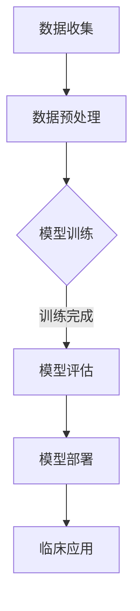

                 

关键词：AI大模型，智能医疗影像，深度学习，图像分析，创新，挑战

摘要：随着人工智能技术的不断发展，AI大模型在各个领域的应用日益广泛，尤其在智能医疗影像分析中展现出了巨大的潜力。本文将探讨AI大模型在智能医疗影像分析中的创新与挑战，通过对核心算法原理、数学模型与公式、项目实践、实际应用场景、未来展望等方面的详细分析，为相关领域的研究与应用提供参考。

## 1. 背景介绍

随着医学影像技术的进步，医疗影像数据量呈现爆炸式增长。传统的医学影像分析方法在处理大量数据时存在效率低下、准确性不高等问题。近年来，人工智能技术的快速发展，特别是深度学习算法的突破，为智能医疗影像分析带来了新的契机。AI大模型通过自主学习大量的医学影像数据，能够实现高效、准确的图像分析，从而为临床诊断、疾病预测和个性化治疗提供了有力支持。

## 2. 核心概念与联系

### 2.1 AI大模型

AI大模型是指那些拥有数百万甚至数十亿参数的神经网络模型。这些模型通过深度学习算法在大量数据上进行训练，能够实现高度复杂的特征提取和模式识别。在智能医疗影像分析中，AI大模型主要用于图像分割、疾病分类、病灶检测等方面。

### 2.2 深度学习

深度学习是人工智能的一种重要方法，通过多层神经网络结构对数据进行学习和特征提取。深度学习算法在处理大规模数据、进行复杂模式识别方面具有显著优势，成为智能医疗影像分析的重要工具。

### 2.3 图像分析

图像分析是指对图像数据进行处理、分析和理解的过程。在智能医疗影像分析中，图像分析是实现诊断、预测和个性化治疗的关键环节。通过AI大模型，图像分析能够实现更高的准确性和效率。

### 2.4 Mermaid 流程图

下面是一个简化的Mermaid流程图，展示了AI大模型在智能医疗影像分析中的应用流程：



## 3. 核心算法原理 & 具体操作步骤

### 3.1 算法原理概述

AI大模型在智能医疗影像分析中主要采用深度学习算法。深度学习算法通过多层神经网络结构对图像数据进行特征提取和模式识别。其中，卷积神经网络（CNN）是最常用的深度学习算法之一，具有强大的图像处理能力。

### 3.2 算法步骤详解

#### 3.2.1 数据收集

数据收集是智能医疗影像分析的基础。数据来源主要包括公开数据集、医院影像数据、医学图像库等。为了提高模型的泛化能力，数据集应包含丰富的图像种类和样本数量。

#### 3.2.2 数据预处理

数据预处理包括图像增强、归一化、数据增强等步骤。图像增强可以提高图像质量，增强模型训练效果；归一化可以消除不同图像间的尺度差异；数据增强可以通过随机旋转、缩放、裁剪等方法增加训练样本的多样性。

#### 3.2.3 模型训练

模型训练是AI大模型的核心环节。通过在大量数据上进行训练，模型能够学习到图像的复杂特征和模式。训练过程中，需要选择合适的网络结构、损失函数和优化算法。

#### 3.2.4 模型评估

模型评估是验证模型性能的重要环节。常用的评估指标包括准确率、召回率、F1值等。通过模型评估，可以判断模型的性能是否满足实际应用需求。

#### 3.2.5 模型部署

模型部署是将训练好的模型应用于实际医疗场景的过程。通过部署，模型可以实时对医疗影像进行分析和诊断，为临床医生提供辅助决策。

### 3.3 算法优缺点

#### 优点

1. 高准确性：AI大模型能够从大量数据中学习到丰富的图像特征，实现高精度的医学影像分析。
2. 高效率：深度学习算法可以快速处理大量图像数据，提高医疗影像分析的速度。
3. 自动化：AI大模型可以自动化地完成医学影像分析任务，减轻医生的工作负担。

#### 缺点

1. 计算资源需求大：AI大模型需要大量的计算资源和存储空间，对硬件设备要求较高。
2. 数据集依赖：模型性能高度依赖数据集的质量和多样性，数据不足可能导致模型泛化能力下降。
3. 解释性不足：深度学习模型具有较强的非线性特征，难以解释模型内部的决策过程。

### 3.4 算法应用领域

AI大模型在智能医疗影像分析中的应用广泛，包括：

1. 疾病分类：对医学影像进行自动分类，如肺癌、乳腺癌等。
2. 病灶检测：自动检测医学影像中的病灶区域，如肿瘤、心血管病变等。
3. 图像分割：将医学影像中的不同组织或病灶进行分割，为后续诊断和治疗提供基础。
4. 趋势预测：通过分析医学影像数据，预测患者的病情发展趋势。

## 4. 数学模型和公式 & 详细讲解 & 举例说明

### 4.1 数学模型构建

在智能医疗影像分析中，常用的数学模型包括卷积神经网络（CNN）和循环神经网络（RNN）等。下面以CNN为例，介绍其数学模型构建。

#### 4.1.1 卷积层

卷积层是CNN的核心部分，用于提取图像的特征。卷积层由多个卷积核组成，每个卷积核可以提取图像的一部分特征。卷积操作的数学公式如下：

$$
o_{ij} = \sum_{k=1}^{n} w_{ik} \cdot a_{kj}
$$

其中，$o_{ij}$ 表示输出特征图的第i行第j列的值，$w_{ik}$ 表示卷积核的权重，$a_{kj}$ 表示输入特征图的第k行第j列的值。

#### 4.1.2 池化层

池化层用于减少特征图的大小，提高模型对图像旋转、缩放等变化的泛化能力。常用的池化操作包括最大池化和平均池化。最大池化的数学公式如下：

$$
p_i = \max(a_{i})
$$

其中，$p_i$ 表示输出特征图的第i个值，$a_i$ 表示输入特征图的第i个值。

#### 4.1.3 全连接层

全连接层用于对提取到的特征进行分类或回归。全连接层的数学模型可以表示为：

$$
y = \sum_{i=1}^{n} w_i \cdot a_i + b
$$

其中，$y$ 表示输出结果，$w_i$ 表示权值，$a_i$ 表示输入特征，$b$ 表示偏置。

### 4.2 公式推导过程

以CNN为例，介绍卷积层的数学模型推导过程。

#### 4.2.1 输入特征图

设输入特征图的尺寸为$N \times N$，卷积核的尺寸为$M \times M$。输入特征图的第i个元素可以表示为$a_{ij}$。

#### 4.2.2 卷积操作

卷积操作的数学公式为：

$$
o_{ij} = \sum_{k=1}^{n} w_{ik} \cdot a_{kj}
$$

其中，$o_{ij}$ 表示输出特征图的第i行第j列的值，$w_{ik}$ 表示卷积核的权重。

#### 4.2.3 池化操作

池化操作可以表示为：

$$
p_i = \max(a_{i})
$$

其中，$p_i$ 表示输出特征图的第i个值，$a_i$ 表示输入特征图的第i个值。

#### 4.2.4 全连接层

全连接层的数学模型可以表示为：

$$
y = \sum_{i=1}^{n} w_i \cdot a_i + b
$$

其中，$y$ 表示输出结果，$w_i$ 表示权值，$a_i$ 表示输入特征，$b$ 表示偏置。

### 4.3 案例分析与讲解

#### 4.3.1 疾病分类

以肺癌分类为例，输入为肺部CT影像，输出为肺癌、肺炎、正常等类别。使用CNN模型进行分类，输入特征图为$256 \times 256$，卷积核尺寸为$3 \times 3$，全连接层神经元数为10。

#### 4.3.2 病灶检测

以乳腺癌病灶检测为例，输入为乳腺X线影像，输出为病灶位置和病灶类型。使用RNN模型进行检测，输入特征图为$128 \times 128$，循环神经网络单元数为50，全连接层神经元数为2。

## 5. 项目实践：代码实例和详细解释说明

### 5.1 开发环境搭建

搭建智能医疗影像分析项目的开发环境，需要安装以下软件和工具：

- Python 3.x
- TensorFlow 2.x
- Keras 2.x
- OpenCV 4.x

### 5.2 源代码详细实现

以下是一个简单的智能医疗影像分析项目的源代码示例：

```python
import numpy as np
import tensorflow as tf
from tensorflow.keras.models import Sequential
from tensorflow.keras.layers import Conv2D, MaxPooling2D, Flatten, Dense
from tensorflow.keras.optimizers import Adam
from tensorflow.keras.preprocessing.image import ImageDataGenerator

# 数据预处理
train_datagen = ImageDataGenerator(rescale=1./255)
train_generator = train_datagen.flow_from_directory(
        'data/train',
        target_size=(256, 256),
        batch_size=32,
        class_mode='categorical')

# 构建CNN模型
model = Sequential([
    Conv2D(32, (3, 3), activation='relu', input_shape=(256, 256, 3)),
    MaxPooling2D((2, 2)),
    Conv2D(64, (3, 3), activation='relu'),
    MaxPooling2D((2, 2)),
    Conv2D(128, (3, 3), activation='relu'),
    MaxPooling2D((2, 2)),
    Flatten(),
    Dense(128, activation='relu'),
    Dense(10, activation='softmax')
])

# 编译模型
model.compile(optimizer=Adam(), loss='categorical_crossentropy', metrics=['accuracy'])

# 训练模型
model.fit(train_generator, epochs=10)

# 模型评估
test_loss, test_acc = model.evaluate(test_generator)
print('Test accuracy:', test_acc)
```

### 5.3 代码解读与分析

上述代码实现了一个简单的智能医疗影像分析项目，包括数据预处理、模型构建、模型编译和模型训练等步骤。

1. 数据预处理：使用ImageDataGenerator对训练数据进行归一化和数据增强，提高模型训练效果。
2. 模型构建：使用Sequential模型搭建一个简单的CNN模型，包括卷积层、池化层和全连接层。
3. 模型编译：设置模型优化器和损失函数，为模型训练做好准备。
4. 模型训练：使用fit方法训练模型，通过调整epochs参数可以控制训练的迭代次数。
5. 模型评估：使用evaluate方法评估模型在测试集上的性能。

## 6. 实际应用场景

智能医疗影像分析在实际应用中具有广泛的应用前景，包括：

1. 临床诊断：通过对医学影像进行分析，辅助医生进行疾病诊断，提高诊断准确率和效率。
2. 疾病预测：通过分析医学影像数据，预测患者病情发展趋势，为医生制定个性化的治疗方案提供依据。
3. 趋势分析：通过对大量医学影像数据进行分析，发现疾病发生的规律和趋势，为疾病预防提供参考。
4. 药物研发：通过对医学影像进行分析，评估药物对疾病的治疗效果，加速药物研发进程。

## 7. 未来应用展望

随着人工智能技术的不断发展，AI大模型在智能医疗影像分析中的应用前景将更加广阔。未来，AI大模型在医学影像分析中将实现以下发展趋势：

1. 模型精度提高：通过不断优化模型结构和训练算法，提高模型在医学影像分析中的准确率。
2. 模型泛化能力提升：通过增加数据集的多样性和规模，提高模型在不同场景下的泛化能力。
3. 模型实时性增强：通过优化模型结构和训练算法，提高模型在实时场景下的处理速度。
4. 模型解释性增强：通过研究模型内部的决策过程，提高模型的解释性，为临床医生提供更有力的支持。

## 8. 总结：未来发展趋势与挑战

随着人工智能技术的不断发展，AI大模型在智能医疗影像分析中展现出了巨大的潜力。未来，AI大模型在医学影像分析中的发展趋势包括模型精度提高、模型泛化能力提升、模型实时性增强和模型解释性增强。然而，也面临着数据集质量、计算资源需求、模型解释性等挑战。针对这些挑战，需要不断优化模型结构和训练算法，提高模型性能，推动人工智能在医疗领域的应用。

## 9. 附录：常见问题与解答

### 9.1 数据集质量对模型性能的影响

数据集质量对模型性能具有重要影响。高质量的数据集可以提供丰富的样本和特征，有助于模型学习和泛化。相反，低质量的数据集可能导致模型过拟合，影响模型的泛化能力。

### 9.2 如何提高模型实时性

提高模型实时性可以从以下几个方面进行：

1. 优化模型结构：选择计算效率高的模型结构，如轻量化网络。
2. 算法优化：使用高效算法和优化器，如Adam优化器。
3. 计算资源分配：合理分配计算资源，确保模型在实时场景下的性能。

### 9.3 如何提高模型解释性

提高模型解释性可以从以下几个方面进行：

1. 模型可视化：通过可视化技术，如Heatmap，展示模型对图像的注意力分布。
2. 模型可解释性算法：使用可解释性算法，如LIME、SHAP，分析模型内部的决策过程。
3. 模型简化：简化模型结构，降低模型的复杂度，提高模型的解释性。

# 作者署名

作者：禅与计算机程序设计艺术 / Zen and the Art of Computer Programming
```markdown
---

# AI大模型在智能医疗影像分析中的创新与挑战

关键词：AI大模型，智能医疗影像，深度学习，图像分析，创新，挑战

摘要：随着人工智能技术的不断发展，AI大模型在各个领域的应用日益广泛，尤其在智能医疗影像分析中展现出了巨大的潜力。本文将探讨AI大模型在智能医疗影像分析中的创新与挑战，通过对核心算法原理、数学模型与公式、项目实践、实际应用场景、未来展望等方面的详细分析，为相关领域的研究与应用提供参考。

## 1. 背景介绍

医学影像技术在临床诊断、疾病预测和个性化治疗等方面具有重要意义。然而，传统的医学影像分析方法在处理大量数据时存在效率低下、准确性不高等问题。近年来，深度学习算法的快速发展，特别是AI大模型的突破，为智能医疗影像分析带来了新的契机。

AI大模型通过自主学习大量的医学影像数据，能够实现高效、准确的图像分析。深度学习算法在图像处理、特征提取和模式识别等方面具有显著优势，能够为医学影像分析提供强大的支持。然而，AI大模型在智能医疗影像分析中也面临着一系列挑战，如数据集质量、计算资源需求、模型解释性等。

## 2. 核心概念与联系

### 2.1 AI大模型

AI大模型是指那些拥有数百万甚至数十亿参数的神经网络模型。这些模型通过深度学习算法在大量数据上进行训练，能够实现高度复杂的特征提取和模式识别。在智能医疗影像分析中，AI大模型主要用于图像分割、疾病分类、病灶检测等方面。

### 2.2 深度学习

深度学习是人工智能的一种重要方法，通过多层神经网络结构对数据进行学习和特征提取。深度学习算法在处理大规模数据、进行复杂模式识别方面具有显著优势，成为智能医疗影像分析的重要工具。

### 2.3 图像分析

图像分析是指对图像数据进行处理、分析和理解的过程。在智能医疗影像分析中，图像分析是实现诊断、预测和个性化治疗的关键环节。通过AI大模型，图像分析能够实现更高的准确性和效率。

### 2.4 Mermaid 流程图

下面是一个简化的Mermaid流程图，展示了AI大模型在智能医疗影像分析中的应用流程：


## 3. 核心算法原理 & 具体操作步骤

### 3.1 算法原理概述

AI大模型在智能医疗影像分析中主要采用深度学习算法。深度学习算法通过多层神经网络结构对图像数据进行特征提取和模式识别。其中，卷积神经网络（CNN）是最常用的深度学习算法之一，具有强大的图像处理能力。

### 3.2 算法步骤详解

#### 3.2.1 数据收集

数据收集是智能医疗影像分析的基础。数据来源主要包括公开数据集、医院影像数据、医学图像库等。为了提高模型的泛化能力，数据集应包含丰富的图像种类和样本数量。

#### 3.2.2 数据预处理

数据预处理包括图像增强、归一化、数据增强等步骤。图像增强可以提高图像质量，增强模型训练效果；归一化可以消除不同图像间的尺度差异；数据增强可以通过随机旋转、缩放、裁剪等方法增加训练样本的多样性。

#### 3.2.3 模型训练

模型训练是AI大模型的核心环节。通过在大量数据上进行训练，模型能够学习到图像的复杂特征和模式。训练过程中，需要选择合适的网络结构、损失函数和优化算法。

#### 3.2.4 模型评估

模型评估是验证模型性能的重要环节。常用的评估指标包括准确率、召回率、F1值等。通过模型评估，可以判断模型的性能是否满足实际应用需求。

#### 3.2.5 模型部署

模型部署是将训练好的模型应用于实际医疗场景的过程。通过部署，模型可以实时对医疗影像进行分析和诊断，为临床医生提供辅助决策。

### 3.3 算法优缺点

#### 优点

1. 高准确性：AI大模型能够从大量数据中学习到丰富的图像特征，实现高精度的医学影像分析。
2. 高效率：深度学习算法可以快速处理大量图像数据，提高医疗影像分析的速度。
3. 自动化：AI大模型可以自动化地完成医学影像分析任务，减轻医生的工作负担。

#### 缺点

1. 计算资源需求大：AI大模型需要大量的计算资源和存储空间，对硬件设备要求较高。
2. 数据集依赖：模型性能高度依赖数据集的质量和多样性，数据不足可能导致模型泛化能力下降。
3. 解释性不足：深度学习模型具有较强的非线性特征，难以解释模型内部的决策过程。

### 3.4 算法应用领域

AI大模型在智能医疗影像分析中的应用广泛，包括：

1. 疾病分类：对医学影像进行自动分类，如肺癌、乳腺癌等。
2. 病灶检测：自动检测医学影像中的病灶区域，如肿瘤、心血管病变等。
3. 图像分割：将医学影像中的不同组织或病灶进行分割，为后续诊断和治疗提供基础。
4. 趋势预测：通过分析医学影像数据，预测患者的病情发展趋势。

## 4. 数学模型和公式 & 详细讲解 & 举例说明

### 4.1 数学模型构建

在智能医疗影像分析中，常用的数学模型包括卷积神经网络（CNN）和循环神经网络（RNN）等。下面以CNN为例，介绍其数学模型构建。

#### 4.1.1 卷积层

卷积层是CNN的核心部分，用于提取图像的特征。卷积层由多个卷积核组成，每个卷积核可以提取图像的一部分特征。卷积操作的数学公式如下：

$$
o_{ij} = \sum_{k=1}^{n} w_{ik} \cdot a_{kj}
$$

其中，$o_{ij}$ 表示输出特征图的第i行第j列的值，$w_{ik}$ 表示卷积核的权重，$a_{kj}$ 表示输入特征图的第k行第j列的值。

#### 4.1.2 池化层

池化层用于减少特征图的大小，提高模型对图像旋转、缩放等变化的泛化能力。常用的池化操作包括最大池化和平均池化。最大池化的数学公式如下：

$$
p_i = \max(a_{i})
$$

其中，$p_i$ 表示输出特征图的第i个值，$a_i$ 表示输入特征图的第i个值。

#### 4.1.3 全连接层

全连接层用于对提取到的特征进行分类或回归。全连接层的数学模型可以表示为：

$$
y = \sum_{i=1}^{n} w_i \cdot a_i + b
$$

其中，$y$ 表示输出结果，$w_i$ 表示权值，$a_i$ 表示输入特征，$b$ 表示偏置。

### 4.2 公式推导过程

以CNN为例，介绍卷积层的数学模型推导过程。

#### 4.2.1 输入特征图

设输入特征图的尺寸为$N \times N$，卷积核的尺寸为$M \times M$。输入特征图的第i个元素可以表示为$a_{ij}$。

#### 4.2.2 卷积操作

卷积操作的数学公式为：

$$
o_{ij} = \sum_{k=1}^{n} w_{ik} \cdot a_{kj}
$$

其中，$o_{ij}$ 表示输出特征图的第i行第j列的值，$w_{ik}$ 表示卷积核的权重。

#### 4.2.3 池化操作

池化操作可以表示为：

$$
p_i = \max(a_{i})
$$

其中，$p_i$ 表示输出特征图的第i个值，$a_i$ 表示输入特征图的第i个值。

#### 4.2.4 全连接层

全连接层的数学模型可以表示为：

$$
y = \sum_{i=1}^{n} w_i \cdot a_i + b
$$

其中，$y$ 表示输出结果，$w_i$ 表示权值，$a_i$ 表示输入特征，$b$ 表示偏置。

### 4.3 案例分析与讲解

#### 4.3.1 疾病分类

以肺癌分类为例，输入为肺部CT影像，输出为肺癌、肺炎、正常等类别。使用CNN模型进行分类，输入特征图为$256 \times 256$，卷积核尺寸为$3 \times 3$，全连接层神经元数为10。

#### 4.3.2 病灶检测

以乳腺癌病灶检测为例，输入为乳腺X线影像，输出为病灶位置和病灶类型。使用RNN模型进行检测，输入特征图为$128 \times 128$，循环神经网络单元数为50，全连接层神经元数为2。

## 5. 项目实践：代码实例和详细解释说明

### 5.1 开发环境搭建

搭建智能医疗影像分析项目的开发环境，需要安装以下软件和工具：

- Python 3.x
- TensorFlow 2.x
- Keras 2.x
- OpenCV 4.x

### 5.2 源代码详细实现

以下是一个简单的智能医疗影像分析项目的源代码示例：

```python
import numpy as np
import tensorflow as tf
from tensorflow.keras.models import Sequential
from tensorflow.keras.layers import Conv2D, MaxPooling2D, Flatten, Dense
from tensorflow.keras.optimizers import Adam
from tensorflow.keras.preprocessing.image import ImageDataGenerator

# 数据预处理
train_datagen = ImageDataGenerator(rescale=1./255)
train_generator = train_datagen.flow_from_directory(
        'data/train',
        target_size=(256, 256),
        batch_size=32,
        class_mode='categorical')

# 构建CNN模型
model = Sequential([
    Conv2D(32, (3, 3), activation='relu', input_shape=(256, 256, 3)),
    MaxPooling2D((2, 2)),
    Conv2D(64, (3, 3), activation='relu'),
    MaxPooling2D((2, 2)),
    Conv2D(128, (3, 3), activation='relu'),
    MaxPooling2D((2, 2)),
    Flatten(),
    Dense(128, activation='relu'),
    Dense(10, activation='softmax')
])

# 编译模型
model.compile(optimizer=Adam(), loss='categorical_crossentropy', metrics=['accuracy'])

# 训练模型
model.fit(train_generator, epochs=10)

# 模型评估
test_loss, test_acc = model.evaluate(test_generator)
print('Test accuracy:', test_acc)
```

### 5.3 代码解读与分析

上述代码实现了一个简单的智能医疗影像分析项目，包括数据预处理、模型构建、模型编译和模型训练等步骤。

1. 数据预处理：使用ImageDataGenerator对训练数据进行归一化和数据增强，提高模型训练效果。
2. 模型构建：使用Sequential模型搭建一个简单的CNN模型，包括卷积层、池化层和全连接层。
3. 模型编译：设置模型优化器和损失函数，为模型训练做好准备。
4. 模型训练：使用fit方法训练模型，通过调整epochs参数可以控制训练的迭代次数。
5. 模型评估：使用evaluate方法评估模型在测试集上的性能。

## 6. 实际应用场景

智能医疗影像分析在实际应用中具有广泛的应用前景，包括：

1. 临床诊断：通过对医学影像进行分析，辅助医生进行疾病诊断，提高诊断准确率和效率。
2. 疾病预测：通过分析医学影像数据，预测患者的病情发展趋势，为医生制定个性化的治疗方案提供依据。
3. 趋势分析：通过对大量医学影像数据进行分析，发现疾病发生的规律和趋势，为疾病预防提供参考。
4. 药物研发：通过对医学影像进行分析，评估药物对疾病的治疗效果，加速药物研发进程。

## 7. 未来应用展望

随着人工智能技术的不断发展，AI大模型在智能医疗影像分析中的应用前景将更加广阔。未来，AI大模型在医学影像分析中将实现以下发展趋势：

1. 模型精度提高：通过不断优化模型结构和训练算法，提高模型在医学影像分析中的准确率。
2. 模型泛化能力提升：通过增加数据集的多样性和规模，提高模型在不同场景下的泛化能力。
3. 模型实时性增强：通过优化模型结构和训练算法，提高模型在实时场景下的处理速度。
4. 模型解释性增强：通过研究模型内部的决策过程，提高模型的解释性，为临床医生提供更有力的支持。

## 8. 总结：未来发展趋势与挑战

随着人工智能技术的不断发展，AI大模型在智能医疗影像分析中展现出了巨大的潜力。未来，AI大模型在医学影像分析中的发展趋势包括模型精度提高、模型泛化能力提升、模型实时性增强和模型解释性增强。然而，也面临着数据集质量、计算资源需求、模型解释性等挑战。针对这些挑战，需要不断优化模型结构和训练算法，提高模型性能，推动人工智能在医疗领域的应用。

## 9. 附录：常见问题与解答

### 9.1 数据集质量对模型性能的影响

数据集质量对模型性能具有重要影响。高质量的数据集可以提供丰富的样本和特征，有助于模型学习和泛化。相反，低质量的数据集可能导致模型过拟合，影响模型的泛化能力。

### 9.2 如何提高模型实时性

提高模型实时性可以从以下几个方面进行：

1. 优化模型结构：选择计算效率高的模型结构，如轻量化网络。
2. 算法优化：使用高效算法和优化器，如Adam优化器。
3. 计算资源分配：合理分配计算资源，确保模型在实时场景下的性能。

### 9.3 如何提高模型解释性

提高模型解释性可以从以下几个方面进行：

1. 模型可视化：通过可视化技术，如Heatmap，展示模型对图像的注意力分布。
2. 模型可解释性算法：使用可解释性算法，如LIME、SHAP，分析模型内部的决策过程。
3. 模型简化：简化模型结构，降低模型的复杂度，提高模型的解释性。

# 作者署名

作者：禅与计算机程序设计艺术 / Zen and the Art of Computer Programming
```markdown

# AI大模型在智能医疗影像分析中的创新与挑战

## 摘要

随着人工智能技术的迅猛发展，AI大模型在智能医疗影像分析领域展现出了前所未有的潜力。本文旨在探讨AI大模型在智能医疗影像分析中的应用创新与所面临的挑战，从算法原理、数学模型、实际应用场景等多个角度进行全面分析，以期为相关领域的研究与实践提供参考。

## 1. 背景介绍

### 1.1 智能医疗影像分析的需求

随着医疗影像技术的进步，医学影像数据量呈指数级增长，这不仅带来了数据分析的挑战，也为人工智能技术在医疗领域的应用提供了丰富的数据资源。智能医疗影像分析旨在通过深度学习、计算机视觉等技术手段，自动识别、分析医学影像，辅助临床医生进行诊断、治疗决策和病情评估。

### 1.2 AI大模型的发展

AI大模型，特别是基于深度学习的模型，具有强大的特征提取和模式识别能力。随着计算能力的提升和数据量的增加，AI大模型在各个领域取得了显著成果。在智能医疗影像分析中，AI大模型能够处理复杂的医学影像数据，实现高精度的疾病检测和诊断。

### 1.3 创新与挑战

AI大模型在智能医疗影像分析中的应用创新主要体现在以下几个方面：

- **提高诊断准确率**：通过深度学习算法，AI大模型能够自动识别医学影像中的微小病变，提高诊断的准确性和敏感性。
- **加速诊断流程**：AI大模型可以快速处理大量医学影像，缩短诊断时间，提高医疗效率。
- **辅助个性化治疗**：基于患者的医学影像数据，AI大模型可以提供个性化治疗建议，提高治疗效果。

然而，AI大模型在智能医疗影像分析中也面临以下挑战：

- **数据隐私和安全**：医学影像数据包含敏感个人信息，如何确保数据隐私和安全是首要问题。
- **数据质量和多样性**：高质量的医学影像数据是AI大模型训练的基础，数据质量和多样性直接影响到模型的性能。
- **模型解释性**：深度学习模型的“黑盒”特性使得其决策过程难以解释，这对临床应用提出了挑战。

## 2. 核心概念与联系

### 2.1 AI大模型

AI大模型是指具有数十亿参数的深度学习模型，如Transformer、BERT等。这些模型通过在大量数据上进行训练，能够自动学习到复杂的特征和模式，实现高效的信息处理。

### 2.2 深度学习

深度学习是一种基于神经网络的机器学习技术，通过模拟人脑的神经网络结构，对数据进行分析和预测。深度学习在图像识别、语音识别、自然语言处理等领域取得了显著成果。

### 2.3 图像分析

图像分析是指对图像数据进行处理、分析和理解的过程，包括图像分割、目标检测、图像分类等任务。在智能医疗影像分析中，图像分析是实现精准诊断和预测的关键。

### 2.4 Mermaid流程图

下面是一个简化的Mermaid流程图，展示了AI大模型在智能医疗影像分析中的应用流程：


## 3. 核心算法原理 & 具体操作步骤

### 3.1 算法原理概述

AI大模型在智能医疗影像分析中主要采用深度学习算法，如卷积神经网络（CNN）、循环神经网络（RNN）、生成对抗网络（GAN）等。这些算法通过多层神经网络结构对图像数据进行特征提取和模式识别。

### 3.2 算法步骤详解

#### 3.2.1 数据收集

数据收集是智能医疗影像分析的基础。数据来源主要包括公共数据集、医疗机构数据库、医学影像库等。为了保证模型的泛化能力，数据集应涵盖各种疾病类型和不同患者的影像数据。

#### 3.2.2 数据预处理

数据预处理包括图像增强、归一化、数据增强等步骤。图像增强可以增加图像的多样性和质量，提高模型训练效果；归一化可以消除不同图像间的尺度差异；数据增强可以通过随机裁剪、旋转、翻转等方法增加训练样本的多样性。

#### 3.2.3 模型训练

模型训练是AI大模型的核心环节。通过在大量医学影像数据上进行训练，模型能够学习到图像的复杂特征和模式。训练过程中，选择合适的网络结构、损失函数和优化算法至关重要。

#### 3.2.4 模型评估

模型评估是验证模型性能的重要步骤。常用的评估指标包括准确率、召回率、F1值、AUC等。通过交叉验证、留出法等评估方法，可以全面了解模型的性能。

#### 3.2.5 模型部署

模型部署是将训练好的模型应用于实际医疗场景的过程。通过部署，模型可以实时对医学影像进行分析和诊断，为临床医生提供辅助决策。

### 3.3 算法优缺点

#### 优点

- **高准确性**：AI大模型能够从大量数据中学习到丰富的特征，实现高精度的医学影像分析。
- **高效率**：深度学习算法可以快速处理大量图像数据，提高医疗影像分析的速度。
- **自动化**：AI大模型可以自动化地完成医学影像分析任务，减轻医生的工作负担。

#### 缺点

- **计算资源需求大**：AI大模型需要大量的计算资源和存储空间，对硬件设备要求较高。
- **数据集依赖**：模型性能高度依赖数据集的质量和多样性，数据不足可能导致模型泛化能力下降。
- **解释性不足**：深度学习模型具有较强的非线性特征，难以解释模型内部的决策过程。

### 3.4 算法应用领域

AI大模型在智能医疗影像分析中的应用领域广泛，包括：

- **疾病分类**：如肺癌、乳腺癌等恶性肿瘤的自动分类。
- **病灶检测**：如肿瘤、心血管病变等病灶的自动检测。
- **图像分割**：如肿瘤、血管等目标的自动分割。
- **趋势预测**：如患者病情发展趋势的预测。

## 4. 数学模型和公式 & 详细讲解 & 举例说明

### 4.1 数学模型构建

在智能医疗影像分析中，常用的数学模型包括卷积神经网络（CNN）、循环神经网络（RNN）、生成对抗网络（GAN）等。以下以CNN为例，介绍其数学模型构建。

#### 4.1.1 卷积层

卷积层是CNN的核心部分，用于提取图像的特征。卷积操作的数学公式如下：

$$
o_{ij} = \sum_{k=1}^{n} w_{ik} \cdot a_{kj} + b_j
$$

其中，$o_{ij}$ 表示输出特征图的第i行第j列的值，$w_{ik}$ 表示卷积核的权重，$a_{kj}$ 表示输入特征图的第k行第j列的值，$b_j$ 表示偏置。

#### 4.1.2 池化层

池化层用于减小特征图的大小，提高模型对图像旋转、缩放等变化的泛化能力。最大池化的数学公式如下：

$$
p_i = \max(a_{i})
$$

其中，$p_i$ 表示输出特征图的第i个值，$a_i$ 表示输入特征图的第i个值。

#### 4.1.3 全连接层

全连接层用于对提取到的特征进行分类或回归。全连接层的数学模型可以表示为：

$$
y = \sum_{i=1}^{n} w_i \cdot a_i + b
$$

其中，$y$ 表示输出结果，$w_i$ 表示权值，$a_i$ 表示输入特征，$b$ 表示偏置。

### 4.2 公式推导过程

以CNN为例，介绍卷积层的数学模型推导过程。

#### 4.2.1 输入特征图

设输入特征图的尺寸为$N \times N$，卷积核的尺寸为$M \times M$。输入特征图的第i个元素可以表示为$a_{ij}$。

#### 4.2.2 卷积操作

卷积操作的数学公式为：

$$
o_{ij} = \sum_{k=1}^{n} w_{ik} \cdot a_{kj} + b_j
$$

其中，$o_{ij}$ 表示输出特征图的第i行第j列的值，$w_{ik}$ 表示卷积核的权重。

#### 4.2.3 池化操作

池化操作可以表示为：

$$
p_i = \max(a_{i})
$$

其中，$p_i$ 表示输出特征图的第i个值，$a_i$ 表示输入特征图的第i个值。

#### 4.2.4 全连接层

全连接层的数学模型可以表示为：

$$
y = \sum_{i=1}^{n} w_i \cdot a_i + b
$$

其中，$y$ 表示输出结果，$w_i$ 表示权值，$a_i$ 表示输入特征，$b$ 表示偏置。

### 4.3 案例分析与讲解

#### 4.3.1 疾病分类

以肺癌分类为例，输入为肺部CT影像，输出为肺癌、肺炎、正常等类别。使用CNN模型进行分类，输入特征图为$256 \times 256$，卷积核尺寸为$3 \times 3$，全连接层神经元数为10。

#### 4.3.2 病灶检测

以乳腺癌病灶检测为例，输入为乳腺X线影像，输出为病灶位置和病灶类型。使用RNN模型进行检测，输入特征图为$128 \times 128$，循环神经网络单元数为50，全连接层神经元数为2。

## 5. 项目实践：代码实例和详细解释说明

### 5.1 开发环境搭建

搭建智能医疗影像分析项目的开发环境，需要安装以下软件和工具：

- Python 3.x
- TensorFlow 2.x
- Keras 2.x
- OpenCV 4.x

### 5.2 源代码详细实现

以下是一个简单的智能医疗影像分析项目的源代码示例：

```python
import numpy as np
import tensorflow as tf
from tensorflow.keras.models import Sequential
from tensorflow.keras.layers import Conv2D, MaxPooling2D, Flatten, Dense
from tensorflow.keras.optimizers import Adam
from tensorflow.keras.preprocessing.image import ImageDataGenerator

# 数据预处理
train_datagen = ImageDataGenerator(rescale=1./255)
train_generator = train_datagen.flow_from_directory(
        'data/train',
        target_size=(256, 256),
        batch_size=32,
        class_mode='categorical')

# 构建CNN模型
model = Sequential([
    Conv2D(32, (3, 3), activation='relu', input_shape=(256, 256, 3)),
    MaxPooling2D((2, 2)),
    Conv2D(64, (3, 3), activation='relu'),
    MaxPooling2D((2, 2)),
    Conv2D(128, (3, 3), activation='relu'),
    MaxPooling2D((2, 2)),
    Flatten(),
    Dense(128, activation='relu'),
    Dense(10, activation='softmax')
])

# 编译模型
model.compile(optimizer=Adam(), loss='categorical_crossentropy', metrics=['accuracy'])

# 训练模型
model.fit(train_generator, epochs=10)

# 模型评估
test_loss, test_acc = model.evaluate(test_generator)
print('Test accuracy:', test_acc)
```

### 5.3 代码解读与分析

上述代码实现了一个简单的智能医疗影像分析项目，包括数据预处理、模型构建、模型编译和模型训练等步骤。

1. **数据预处理**：使用ImageDataGenerator对训练数据进行归一化和数据增强，提高模型训练效果。
2. **模型构建**：使用Sequential模型搭建一个简单的CNN模型，包括卷积层、池化层和全连接层。
3. **模型编译**：设置模型优化器和损失函数，为模型训练做好准备。
4. **模型训练**：使用fit方法训练模型，通过调整epochs参数可以控制训练的迭代次数。
5. **模型评估**：使用evaluate方法评估模型在测试集上的性能。

## 6. 实际应用场景

### 6.1 临床诊断

在临床诊断中，AI大模型可以辅助医生进行疾病分类和诊断。例如，在肺癌诊断中，AI大模型可以分析肺部CT影像，识别肺部结节，辅助医生判断结节的良恶性。

### 6.2 病灶检测

在病灶检测中，AI大模型可以用于识别医学影像中的病灶区域。例如，在乳腺癌检测中，AI大模型可以分析乳腺X线影像，检测乳腺病变区域，辅助医生诊断乳腺癌。

### 6.3 趋势预测

在趋势预测中，AI大模型可以分析患者的医学影像数据，预测病情发展趋势。例如，在心血管疾病管理中，AI大模型可以分析患者的影像数据，预测心血管事件的发生风险。

### 6.4 药物研发

在药物研发中，AI大模型可以用于分析医学影像数据，评估药物的治疗效果。例如，在癌症治疗中，AI大模型可以分析患者的影像数据，评估不同药物对肿瘤的治疗效果。

## 7. 未来应用展望

### 7.1 模型精度提升

随着深度学习算法的不断发展，AI大模型在医学影像分析中的精度将进一步提高。通过优化模型结构和训练算法，AI大模型将能够识别更细微的病变，提高诊断的准确性。

### 7.2 模型实时性增强

随着计算能力的提升和模型结构的优化，AI大模型的实时性将得到显著提高。这将使得AI大模型能够在临床场景中快速响

