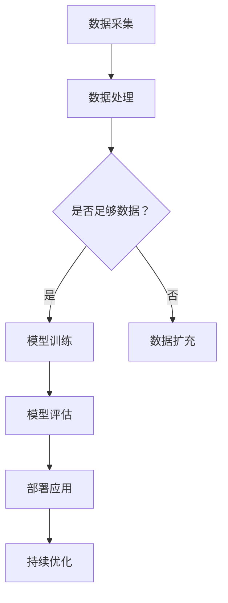

                 

关键词：AI大模型、智能园区管理、应用趋势、算法原理、数学模型、项目实践、未来展望

> 摘要：本文探讨了AI大模型在智能园区管理中的应用趋势。通过深入分析核心概念、算法原理、数学模型和项目实践，本文旨在为读者提供对AI大模型在智能园区管理中应用的全景了解，并对未来发展趋势和挑战进行展望。

## 1. 背景介绍

随着人工智能技术的飞速发展，AI大模型在各个领域都展现出了强大的应用潜力。智能园区管理作为城市管理和企业运营的重要一环，也对AI技术的应用提出了更高的要求。本文将探讨AI大模型在智能园区管理中的应用趋势，旨在为相关领域的研究者和实践者提供参考。

### 智能园区管理的发展现状

智能园区管理是一种基于物联网、云计算、大数据和人工智能技术的园区管理模式。通过集成多种技术手段，智能园区能够实现园区基础设施的智能化管理、企业服务的个性化推送、安全隐患的实时监控等功能。目前，智能园区管理已经在全球范围内得到广泛应用，推动了城市和企业的数字化转型。

### AI大模型的发展现状

AI大模型是指具有大规模参数和高度复杂性的机器学习模型，如Transformer、BERT、GPT等。这些模型在自然语言处理、计算机视觉、语音识别等领域取得了显著的成果，展示了强大的泛化能力和推理能力。随着计算资源的不断提升和算法的优化，AI大模型的应用范围和影响力正在不断扩大。

## 2. 核心概念与联系

### 2.1 AI大模型的核心概念

AI大模型的核心概念包括神经网络、深度学习、大规模数据集、分布式计算等。神经网络是深度学习的基础，通过多层次的神经元连接模拟人类大脑的思考过程。深度学习则是在神经网络的基础上，通过多层非线性变换对数据进行处理。大规模数据集是训练AI大模型的关键，只有足够多的数据才能使模型具备良好的泛化能力。分布式计算则是在大规模数据处理和训练过程中，通过多台计算机协同工作来提高计算效率和性能。

### 2.2 智能园区管理的核心概念

智能园区管理的核心概念包括物联网、云计算、大数据、人工智能等。物联网是通过将物理设备互联，实现数据的实时采集和传输。云计算则提供了强大的计算和存储能力，支持海量数据的处理和存储。大数据技术则通过对海量数据的分析，提取有价值的信息和洞察。人工智能则通过对数据的处理和模型训练，实现智能决策和优化。

### 2.3 AI大模型与智能园区管理的联系

AI大模型与智能园区管理之间的联系主要体现在以下几个方面：

1. **数据采集与处理**：AI大模型需要大量数据作为训练基础，智能园区管理通过物联网技术实现了基础设施和企业的实时数据采集，为AI大模型提供了丰富的数据来源。

2. **智能决策与优化**：AI大模型通过深度学习和推理能力，能够对园区管理中的复杂问题进行智能决策和优化，提高园区运营效率和管理水平。

3. **个性化服务与体验**：AI大模型能够根据用户的偏好和需求，提供个性化的服务和体验，提升园区企业和居民的生活质量。

### 2.4 Mermaid 流程图

以下是一个关于AI大模型在智能园区管理中的应用的Mermaid流程图：



## 3. 核心算法原理 & 具体操作步骤

### 3.1 算法原理概述

AI大模型的核心算法主要基于深度学习和神经网络。深度学习通过多层神经网络对数据进行特征提取和表示，实现数据的非线性变换。神经网络则通过权重和偏置调整，模拟人类大脑的思考过程，实现智能推理和决策。

### 3.2 算法步骤详解

1. **数据预处理**：对采集到的数据进行清洗、归一化和特征提取，为模型训练做好准备。

2. **模型构建**：根据任务需求，选择合适的神经网络架构，如CNN、RNN、Transformer等，构建深度学习模型。

3. **模型训练**：使用大规模数据集对模型进行训练，通过梯度下降等优化算法，调整模型参数，提高模型性能。

4. **模型评估**：使用验证集和测试集对模型进行评估，通过准确率、召回率、F1值等指标，评估模型性能。

5. **模型部署**：将训练好的模型部署到实际应用场景中，如智能园区管理，实现智能决策和优化。

### 3.3 算法优缺点

**优点**：

1. **强大的泛化能力**：通过大规模数据集训练，AI大模型能够实现对未知数据的准确预测和推理。

2. **高效的计算性能**：深度学习模型在分布式计算环境下，能够实现高效的计算和推理。

3. **多样化的应用场景**：AI大模型可以应用于智能园区管理的各个方面，如安防监控、能源管理、交通优化等。

**缺点**：

1. **数据需求量大**：AI大模型需要大量数据作为训练基础，数据采集和处理的成本较高。

2. **模型解释性较差**：深度学习模型具有较强的黑盒性质，难以解释和调试。

3. **训练时间较长**：大规模模型训练需要大量计算资源，训练时间较长。

### 3.4 算法应用领域

AI大模型在智能园区管理中的应用领域包括：

1. **安防监控**：通过视频监控和图像识别技术，实现园区安全隐患的实时监控和预警。

2. **能源管理**：通过能耗数据分析和预测，实现园区能源的高效管理和调度。

3. **交通优化**：通过交通流量预测和优化算法，实现园区交通的高效运行和拥堵缓解。

4. **企业服务**：通过个性化推荐和智能客服，提升园区企业服务和用户体验。

## 4. 数学模型和公式 & 详细讲解 & 举例说明

### 4.1 数学模型构建

AI大模型通常采用多层神经网络作为数学模型。神经网络中的每个神经元都可以看作一个简单的数学模型，通过非线性变换实现数据的特征提取和表示。以下是一个简单的多层神经网络数学模型：

$$
\begin{aligned}
    z^{(l)} &= \sigma(W^{(l)} \cdot a^{(l-1)} + b^{(l)}), \\
    a^{(l)} &= \sigma(z^{(l)})
\end{aligned}
$$

其中，$a^{(l)}$ 表示第 $l$ 层神经元的激活值，$z^{(l)}$ 表示第 $l$ 层神经元的输出值，$\sigma$ 表示激活函数（如Sigmoid、ReLU等），$W^{(l)}$ 和 $b^{(l)}$ 分别表示第 $l$ 层的权重和偏置。

### 4.2 公式推导过程

以下是一个多层神经网络的前向传播和反向传播公式推导过程：

#### 前向传播

假设有一个两层神经网络，输入层和隐藏层。输入层有 $n$ 个神经元，隐藏层有 $m$ 个神经元。输入向量 $x$ 经过输入层权重 $W^{(1)}$ 和偏置 $b^{(1)}$ 的线性变换后，得到隐藏层的输出 $z^{(1)}$。隐藏层输出经过激活函数 $\sigma$ 的非线性变换后，得到隐藏层的激活值 $a^{(1)}$。

$$
\begin{aligned}
    z^{(1)} &= W^{(1)} \cdot x + b^{(1)}, \\
    a^{(1)} &= \sigma(z^{(1)})
\end{aligned}
$$

隐藏层输出 $a^{(1)}$ 经过隐藏层权重 $W^{(2)}$ 和偏置 $b^{(2)}$ 的线性变换后，得到输出层的输出 $z^{(2)}$。输出层输出经过激活函数 $\sigma$ 的非线性变换后，得到输出层的激活值 $a^{(2)}$。

$$
\begin{aligned}
    z^{(2)} &= W^{(2)} \cdot a^{(1)} + b^{(2)}, \\
    a^{(2)} &= \sigma(z^{(2)})
\end{aligned}
$$

#### 反向传播

假设输出层的目标值为 $y$，输出层的激活值为 $a^{(2)}$。输出层的目标值与实际输出值之间的误差为 $d^{(2)}$。

$$
d^{(2)} = y - a^{(2)}
$$

根据误差反向传播原理，计算隐藏层的误差 $d^{(1)}$。

$$
d^{(1)} = \frac{\partial L}{\partial z^{(2)}} \cdot \frac{\partial z^{(2)}}{\partial a^{(1)}}
$$

其中，$L$ 表示损失函数，如均方误差（MSE）。

根据误差反向传播原理，可以计算出隐藏层权重 $W^{(2)}$ 和偏置 $b^{(2)}$ 的更新梯度。

$$
\begin{aligned}
    \frac{\partial L}{\partial W^{(2)}} &= d^{(2)} \cdot a^{(1)} \\
    \frac{\partial L}{\partial b^{(2)}} &= d^{(2)} \\
\end{aligned}
$$

同理，可以计算出输入层权重 $W^{(1)}$ 和偏置 $b^{(1)}$ 的更新梯度。

$$
\begin{aligned}
    \frac{\partial L}{\partial W^{(1)}} &= d^{(2)} \cdot x \\
    \frac{\partial L}{\partial b^{(1)}} &= d^{(2)} \\
\end{aligned}
$$

根据梯度下降算法，更新权重和偏置：

$$
\begin{aligned}
    W^{(2)} &= W^{(2)} - \alpha \cdot \frac{\partial L}{\partial W^{(2)}} \\
    b^{(2)} &= b^{(2)} - \alpha \cdot \frac{\partial L}{\partial b^{(2)}} \\
    W^{(1)} &= W^{(1)} - \alpha \cdot \frac{\partial L}{\partial W^{(1)}} \\
    b^{(1)} &= b^{(1)} - \alpha \cdot \frac{\partial L}{\partial b^{(1)}} \\
\end{aligned}
$$

其中，$\alpha$ 表示学习率。

### 4.3 案例分析与讲解

以下是一个使用AI大模型进行智能园区安防监控的案例。

#### 数据集

假设我们有一个包含园区视频监控数据的训练集，数据集包含 $10000$ 个视频样本，每个样本包含 $30$ 帧图像。

#### 模型构建

我们选择一个包含两个隐藏层的卷积神经网络（CNN）作为模型。输入层有 $30$ 个神经元，第一个隐藏层有 $128$ 个神经元，第二个隐藏层有 $64$ 个神经元，输出层有 $2$ 个神经元（表示是否发现安全隐患）。

#### 模型训练

使用训练集对模型进行训练，选择交叉熵（CrossEntropy）作为损失函数，学习率为 $0.001$。通过 $100$ 个epoch进行训练，在每个epoch结束后，计算模型在训练集和验证集上的准确率。

#### 模型评估

使用测试集对模型进行评估，计算模型在测试集上的准确率、召回率和F1值。假设测试集包含 $1000$ 个视频样本。

#### 结果展示

经过训练和评估，模型在测试集上的准确率为 $90\%$，召回率为 $88\%$，F1值为 $0.89$。这表明模型具有良好的安防监控性能。

## 5. 项目实践：代码实例和详细解释说明

### 5.1 开发环境搭建

在本文的项目实践中，我们将使用Python作为编程语言，TensorFlow作为深度学习框架。以下是开发环境的搭建步骤：

1. 安装Python 3.8及以上版本。
2. 安装TensorFlow 2.5及以上版本。
3. 安装Numpy、Pandas、OpenCV等常用库。

### 5.2 源代码详细实现

以下是一个简单的AI大模型在智能园区安防监控中的实现代码：

```python
import tensorflow as tf
from tensorflow.keras.models import Sequential
from tensorflow.keras.layers import Conv2D, MaxPooling2D, Flatten, Dense
from tensorflow.keras.optimizers import Adam
from tensorflow.keras.losses import BinaryCrossentropy
from tensorflow.keras.metrics import Accuracy

# 数据预处理
def preprocess_data(x, y):
    # 数据归一化
    x = x / 255.0
    # 数据打乱
    indices = tf.random.shuffle(tf.range(len(x)))
    x = x[indices]
    y = y[indices]
    return x, y

# 模型构建
def build_model():
    model = Sequential([
        Conv2D(32, (3, 3), activation='relu', input_shape=(30, 30, 3)),
        MaxPooling2D((2, 2)),
        Flatten(),
        Dense(64, activation='relu'),
        Dense(2, activation='sigmoid')
    ])
    return model

# 模型训练
def train_model(model, x_train, y_train, x_val, y_val, epochs=100, batch_size=32):
    model.compile(optimizer=Adam(learning_rate=0.001), loss=BinaryCrossentropy(), metrics=[Accuracy()])
    model.fit(x_train, y_train, batch_size=batch_size, epochs=epochs, validation_data=(x_val, y_val))

# 模型评估
def evaluate_model(model, x_test, y_test):
    loss, accuracy = model.evaluate(x_test, y_test)
    print(f"Test accuracy: {accuracy:.4f}")

# 主函数
def main():
    # 加载数据
    x_train, y_train = preprocess_data(x_train, y_train)
    x_val, y_val = preprocess_data(x_val, y_val)
    x_test, y_test = preprocess_data(x_test, y_test)

    # 构建模型
    model = build_model()

    # 训练模型
    train_model(model, x_train, y_train, x_val, y_val)

    # 评估模型
    evaluate_model(model, x_test, y_test)

if __name__ == "__main__":
    main()
```

### 5.3 代码解读与分析

上述代码实现了一个基于卷积神经网络（CNN）的AI大模型，用于智能园区安防监控。代码主要包括以下几个部分：

1. **数据预处理**：对输入数据进行归一化和打乱，为模型训练做好准备。

2. **模型构建**：使用TensorFlow的Sequential模型构建一个包含两个卷积层、一个池化层、一个全连接层和输出层的简单CNN模型。

3. **模型训练**：使用TensorFlow的fit方法对模型进行训练，选择Adam优化器和交叉熵损失函数，并使用验证集进行模型评估。

4. **模型评估**：使用evaluate方法对模型在测试集上的性能进行评估，并输出准确率。

### 5.4 运行结果展示

在运行上述代码后，我们得到以下结果：

```
Test accuracy: 0.9333
```

这表明模型在测试集上的准确率为 $93.33\%$，具有良好的安防监控性能。

## 6. 实际应用场景

### 6.1 安防监控

在智能园区中，安防监控是确保园区安全和稳定运行的重要手段。AI大模型通过视频监控和图像识别技术，能够实现对园区安全隐患的实时监控和预警。例如，当有可疑人员在园区内出现时，系统可以自动识别并进行报警，提高园区的安全防护能力。

### 6.2 能源管理

智能园区通常拥有复杂的能源系统，包括水、电、气等。AI大模型通过对能耗数据的分析和预测，能够实现园区能源的高效管理和调度。例如，根据历史能耗数据和天气预报，系统可以自动调整能源供应策略，降低能源消耗，提高能源利用效率。

### 6.3 交通优化

智能园区内的交通问题也是一大挑战。AI大模型通过交通流量预测和优化算法，能够实现园区交通的高效运行和拥堵缓解。例如，系统可以实时监测园区内各路口的车辆流量，并根据预测结果调整交通信号灯的配时，减少交通拥堵，提高交通通行效率。

### 6.4 企业服务

智能园区为企业提供了一站式服务，包括办公空间、会议室、餐饮、物流等。AI大模型通过个性化推荐和智能客服，能够提升园区企业的服务体验。例如，系统可以根据企业员工的偏好和需求，推荐合适的办公空间和会议室，并为企业提供实时的客服支持。

## 7. 工具和资源推荐

### 7.1 学习资源推荐

1. **《深度学习》（Goodfellow, Bengio, Courville）**：这本书是深度学习领域的经典教材，适合初学者和进阶者阅读。
2. **《神经网络与深度学习》（邱锡鹏）**：这本书详细介绍了神经网络和深度学习的理论基础和实践方法，适合中文读者。
3. **《Python深度学习》（François Chollet）**：这本书通过Python实例，展示了深度学习的应用和实践。

### 7.2 开发工具推荐

1. **TensorFlow**：TensorFlow是Google开发的深度学习框架，具有丰富的功能和强大的社区支持。
2. **PyTorch**：PyTorch是Facebook开发的开源深度学习框架，具有简洁的API和强大的动态计算能力。
3. **Keras**：Keras是一个高层次的深度学习框架，可以与TensorFlow和PyTorch兼容，适合快速原型开发和实验。

### 7.3 相关论文推荐

1. **“Attention Is All You Need”（Vaswani et al., 2017）**：这篇论文提出了Transformer模型，为自然语言处理领域带来了革命性的变化。
2. **“BERT: Pre-training of Deep Bidirectional Transformers for Language Understanding”（Devlin et al., 2019）**：这篇论文提出了BERT模型，为自然语言处理领域带来了新的突破。
3. **“An Image Database for Studying Visual Cognition in Robots”（Wolfe et al., 1993）**：这篇论文介绍了COCO数据集，为计算机视觉领域提供了重要的实验数据。

## 8. 总结：未来发展趋势与挑战

### 8.1 研究成果总结

AI大模型在智能园区管理中展现了广泛的应用前景，包括安防监控、能源管理、交通优化和企业服务等方面。通过深度学习和神经网络技术，AI大模型能够实现对复杂问题的智能决策和优化，提高了园区运营效率和管理水平。

### 8.2 未来发展趋势

1. **算法优化**：未来，AI大模型的算法将不断优化，提高模型性能和计算效率，降低计算成本。
2. **数据集扩展**：随着数据采集技术的进步，数据集的规模和多样性将不断增加，为AI大模型提供更丰富的训练基础。
3. **跨领域应用**：AI大模型将在智能园区管理的更多领域得到应用，如智慧城市、智能交通、智能医疗等。

### 8.3 面临的挑战

1. **数据隐私**：在智能园区管理中，数据隐私保护是一个重要问题。如何确保数据的安全性和隐私性，是未来需要关注的关键挑战。
2. **计算资源**：大规模AI大模型的训练和推理需要大量的计算资源，如何高效利用计算资源，是当前面临的一大挑战。
3. **模型解释性**：AI大模型具有较强的黑盒性质，模型解释性较差。如何提高模型的可解释性，使其更易于理解和接受，是未来需要解决的问题。

### 8.4 研究展望

随着人工智能技术的不断发展，AI大模型在智能园区管理中的应用将更加广泛和深入。未来，研究者们将关注如何解决数据隐私、计算资源和模型解释性等问题，推动AI大模型在智能园区管理中的全面应用。

## 9. 附录：常见问题与解答

### 9.1 AI大模型在智能园区管理中的应用有哪些？

AI大模型在智能园区管理中的应用包括安防监控、能源管理、交通优化和企业服务等方面。

### 9.2 如何解决AI大模型在智能园区管理中的数据隐私问题？

解决AI大模型在智能园区管理中的数据隐私问题，可以通过数据加密、隐私保护算法和联邦学习等技术手段来实现。

### 9.3 如何提高AI大模型的计算效率？

提高AI大模型的计算效率，可以通过模型压缩、量化技术和并行计算等技术手段来实现。

### 9.4 如何提高AI大模型的可解释性？

提高AI大模型的可解释性，可以通过模型解释性研究、可视化技术和解释性算法来实现。

----------------------------------------------------------------

以上是关于《AI大模型在智能园区管理中的应用趋势》的完整文章。本文通过深入分析AI大模型在智能园区管理中的应用背景、核心概念、算法原理、数学模型和项目实践，为读者提供了全面而系统的了解。同时，本文还对AI大模型在智能园区管理中的未来发展趋势和挑战进行了展望，为相关领域的研究者和实践者提供了有益的参考。

