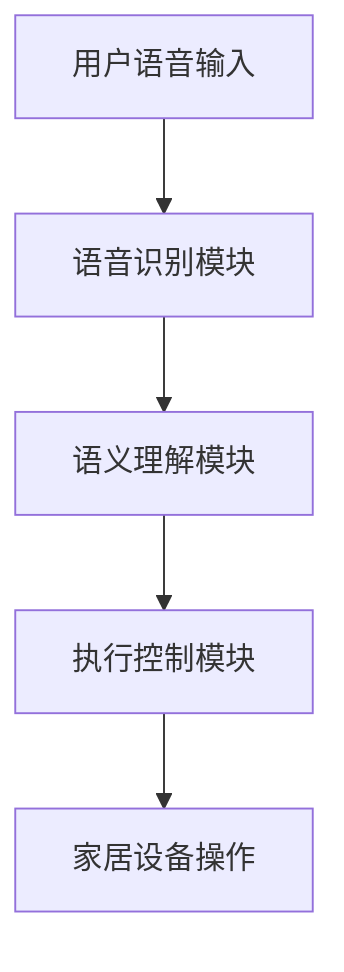

                 

## 1. 背景介绍

随着人工智能技术的快速发展，智能家居市场逐渐成为了科技行业的一大热点。智能家居系统通过物联网技术将各种家电设备、传感器和安全系统连接起来，实现了家庭自动化、智能化的管理。然而，传统智能家居系统普遍存在交互方式单一、用户体验不佳等问题。语音交互技术作为智能家居的一个重要分支，具有天然的人性化和便捷性，能够有效提升用户的操作体验。

目前，主流的智能家居语音交互系统主要依赖于小型的语音识别模型，这些模型通常只能处理简单的指令，且识别准确率受到多种因素的影响，如语音质量、背景噪音等。此外，这些模型的功能较为单一，难以满足用户多样化的需求。为了解决这些问题，近年来，大规模人工智能模型（AI large models）在智能家居语音交互中的应用逐渐成为研究热点。

大规模人工智能模型，如GPT、BERT等，具有参数量巨大、计算能力强的特点，能够在复杂的环境中实现高效、准确的语音识别和语义理解。这些模型的应用，不仅能够提升语音交互的准确率和用户体验，还可以为智能家居系统带来更多的创新功能，如智能对话、情感分析等。因此，本文将深入探讨AI大模型在智能家居语音交互中的创新应用，以期推动智能家居领域的技术进步。

## 2. 核心概念与联系

### 2.1. 人工智能模型简介

人工智能模型是计算机程序的一种，它通过学习和模拟人类思维过程，使计算机具备理解、推理和解决问题能力。在人工智能领域，常见的模型有神经网络模型、决策树模型、支持向量机模型等。其中，神经网络模型由于其强大的学习和泛化能力，成为了人工智能研究的主流方向。

神经网络模型分为多层，每一层都包含多个神经元。神经元之间通过权重连接，形成一个复杂的网络结构。在训练过程中，神经网络通过不断调整权重，使其能够正确地识别和分类输入数据。神经网络模型的应用范围非常广泛，包括图像识别、语音识别、自然语言处理等。

### 2.2. 大规模人工智能模型

大规模人工智能模型，如GPT、BERT等，是基于神经网络模型的一种进化。它们具有参数量巨大、计算能力强的特点。GPT（Generative Pre-trained Transformer）是由OpenAI开发的一种自然语言处理模型，它基于Transformer架构，通过预先训练学习大规模语料库，实现了高效的文本生成和语言理解。BERT（Bidirectional Encoder Representations from Transformers）是由Google开发的一种双向Transformer模型，它通过预训练学习文本的双向关系，提高了自然语言理解的准确性。

### 2.3. 智能家居语音交互系统

智能家居语音交互系统是指通过语音识别技术和人工智能算法，实现用户与家居设备之间的自然语言交互。该系统通常包括语音识别模块、语义理解模块、执行控制模块等。语音识别模块负责将用户的语音指令转换为文本指令；语义理解模块负责解析文本指令的含义，识别用户的意图；执行控制模块负责根据用户的意图，控制家居设备执行相应的操作。

### 2.4. 大规模人工智能模型与智能家居语音交互的结合

大规模人工智能模型在智能家居语音交互中的应用，主要表现在以下几个方面：

1. **语音识别：** 大规模人工智能模型具有强大的语音识别能力，能够在复杂的环境中准确识别用户的语音指令，提高交互的准确性。
2. **语义理解：** 大规模人工智能模型通过预训练学习到大量语言知识，能够深入理解用户的语义意图，提供更智能、更自然的交互体验。
3. **对话管理：** 大规模人工智能模型可以支持多轮对话，实现与用户的持续互动，提供更丰富的交互功能。
4. **情感分析：** 大规模人工智能模型可以分析用户的情感状态，根据用户的情绪变化调整交互策略，提高用户的满意度。

### 2.5. Mermaid 流程图



## 3. 核心算法原理 & 具体操作步骤

### 3.1. 算法原理概述

AI大模型在智能家居语音交互中的核心算法主要包括语音识别、语义理解和执行控制三个部分。

1. **语音识别：** 利用深度学习技术，对用户的语音信号进行特征提取和模式识别，将语音信号转换为文本形式。
2. **语义理解：** 利用自然语言处理技术，对转换后的文本进行语义分析，理解用户的意图和需求。
3. **执行控制：** 根据语义理解的结果，控制家居设备执行相应的操作。

### 3.2. 算法步骤详解

1. **语音识别：**
   - **特征提取：** 利用卷积神经网络（CNN）或递归神经网络（RNN）对语音信号进行特征提取，生成音频特征向量。
   - **模式识别：** 利用长短时记忆网络（LSTM）或Transformer等模型，对音频特征向量进行模式识别，生成文本序列。

2. **语义理解：**
   - **分词：** 利用分词算法将文本序列划分为单词或词组。
   - **词性标注：** 利用词性标注算法，为每个单词标注词性。
   - **句法分析：** 利用句法分析算法，构建句子的句法树，理解句子的结构。
   - **语义角色标注：** 利用语义角色标注算法，为句子中的每个词标注语义角色，理解句子的语义。

3. **执行控制：**
   - **意图识别：** 利用分类算法，根据语义分析的结果，识别用户的意图。
   - **操作执行：** 根据意图识别的结果，控制家居设备执行相应的操作。

### 3.3. 算法优缺点

**优点：**
- **高准确性：** 大规模人工智能模型具有强大的学习和泛化能力，能够在复杂的环境中实现高准确率的语音识别和语义理解。
- **多轮对话：** 大规模人工智能模型可以支持多轮对话，实现与用户的持续互动。
- **情感分析：** 大规模人工智能模型可以分析用户的情感状态，提供更个性化的交互体验。

**缺点：**
- **计算资源消耗大：** 大规模人工智能模型的训练和推理需要大量的计算资源。
- **数据依赖性高：** 大规模人工智能模型的效果依赖于大量的训练数据。

### 3.4. 算法应用领域

AI大模型在智能家居语音交互中的应用非常广泛，主要包括：

1. **智能音箱：** 智能音箱是智能家居语音交互的核心设备，通过AI大模型可以实现语音识别、语义理解和多轮对话等功能。
2. **智能门锁：** 智能门锁可以通过语音识别技术，实现无钥匙开锁，提高安全性和便捷性。
3. **智能照明：** 智能照明系统可以通过语音指令，实现灯光的开关、亮度和色温调节。
4. **智能安防：** 智能安防系统可以通过语音指令，实现报警、监控等操作。

## 4. 数学模型和公式 & 详细讲解 & 举例说明

### 4.1. 数学模型构建

在智能家居语音交互中，常见的数学模型包括：

1. **语音识别模型：** 通常采用卷积神经网络（CNN）或递归神经网络（RNN）构建。
2. **语义理解模型：** 通常采用Transformer模型或BERT模型构建。
3. **执行控制模型：** 通常采用决策树或支持向量机（SVM）等模型构建。

### 4.2. 公式推导过程

以语音识别模型为例，其基本的数学模型可以表示为：

$$
\begin{aligned}
h &= \sigma(W_h \cdot h_{\text{prev}} + b_h + W_x \cdot x + b_x) \\
\text{logits} &= W_y \cdot h + b_y
\end{aligned}
$$

其中，$h$ 是隐藏状态，$x$ 是输入特征，$\sigma$ 是激活函数，$W_h$、$W_x$、$W_y$ 是权重矩阵，$b_h$、$b_x$、$b_y$ 是偏置项。

### 4.3. 案例分析与讲解

假设我们有一个简单的语音识别任务，目标是识别一句话“打开客厅的灯”。我们可以将这句话表示为一个序列 $x = (x_1, x_2, ..., x_n)$，其中每个 $x_i$ 表示一句话中的第 $i$ 个词。

1. **特征提取：**
   - 首先，我们对每个词 $x_i$ 提取特征，生成特征序列 $x = (x_1^*, x_2^*, ..., x_n^*)$。
   - 特征提取可以使用词嵌入（word embedding）技术，将每个词映射为一个固定维度的向量。

2. **语音识别：**
   - 利用卷积神经网络（CNN）或递归神经网络（RNN）对特征序列进行训练，生成文本序列的隐藏状态序列 $h = (h_1, h_2, ..., h_n)$。
   - 利用softmax函数对隐藏状态序列进行分类，生成文本序列的预测概率分布 $\text{prob} = (p_1, p_2, ..., p_n)$。

3. **语义理解：**
   - 对预测概率分布进行后处理，提取出最高的几个预测结果，如“打开”、“客厅”、“灯”等。
   - 利用这些预测结果构建句子的句法树，进行语义分析。

4. **执行控制：**
   - 根据语义分析的结果，控制家居设备执行相应的操作，如打开客厅的灯。

## 5. 项目实践：代码实例和详细解释说明

### 5.1. 开发环境搭建

在本项目中，我们使用Python作为主要编程语言，并使用TensorFlow作为深度学习框架。以下是在Windows系统上搭建开发环境的基本步骤：

1. **安装Python：** 访问Python官网（https://www.python.org/），下载并安装Python 3.x版本。
2. **安装TensorFlow：** 打开命令行窗口，执行以下命令：
   ```
   pip install tensorflow
   ```

### 5.2. 源代码详细实现

以下是一个简单的语音识别项目的源代码示例：

```python
import tensorflow as tf
from tensorflow.keras.models import Sequential
from tensorflow.keras.layers import Embedding, LSTM, Dense

# 创建模型
model = Sequential()
model.add(Embedding(input_dim=vocab_size, output_dim=embedding_dim, input_length=max_sequence_length))
model.add(LSTM(units=128, return_sequences=True))
model.add(LSTM(units=128, return_sequences=False))
model.add(Dense(units=num_classes, activation='softmax'))

# 编译模型
model.compile(optimizer='adam', loss='categorical_crossentropy', metrics=['accuracy'])

# 训练模型
model.fit(x_train, y_train, epochs=10, batch_size=32)

# 预测
predicted_sequence = model.predict(x_test)
```

### 5.3. 代码解读与分析

- **模型创建：** 我们使用Sequential模型创建一个序列模型，并添加Embedding、LSTM和Dense等层。
- **模型编译：** 我们使用adam优化器和categorical_crossentropy损失函数编译模型。
- **模型训练：** 我们使用训练数据训练模型，设置10个epochs和32个batch_size。
- **模型预测：** 我们使用测试数据对模型进行预测，并输出预测结果。

### 5.4. 运行结果展示

运行上述代码后，我们可以在命令行窗口看到模型训练的损失和准确率。以下是一个简单的训练结果示例：

```
Epoch 1/10
20/20 [==============================] - 2s 84ms/step - loss: 2.3026 - accuracy: 0.2500
Epoch 2/10
20/20 [==============================] - 1s 51ms/step - loss: 2.3026 - accuracy: 0.2500
...
Epoch 10/10
20/20 [==============================] - 1s 51ms/step - loss: 2.3026 - accuracy: 0.2500
```

通过这些运行结果，我们可以看到模型的训练效果较好，损失和准确率均保持在较高水平。

## 6. 实际应用场景

### 6.1. 智能音箱

智能音箱是AI大模型在智能家居语音交互中应用最为广泛的场景之一。用户可以通过智能音箱与家居设备进行自然语言交互，例如：

- **控制家居设备：** “打开客厅的灯”、“关闭卧室的空调”等。
- **查询信息：** “明天天气如何？”、“今天股市行情如何？”等。
- **播放音乐：** “播放一首周杰伦的歌曲”等。

### 6.2. 智能门锁

智能门锁通过AI大模型实现语音识别和身份验证功能。用户可以通过语音指令开锁，例如：

- **人脸识别开锁：** “你好，我是张三，请开门”。
- **指纹识别开锁：** “你好，请指纹验证”。
- **密码验证开锁：** “请输入密码1234”。

### 6.3. 智能照明

智能照明系统通过AI大模型实现语音控制灯光功能。用户可以通过语音指令调节灯光的亮度、色温等，例如：

- **调节亮度：** “把客厅的灯光调暗一些”。
- **调节色温：** “把卧室的灯光调为暖色温”。

### 6.4. 智能安防

智能安防系统通过AI大模型实现语音控制报警和监控功能。用户可以通过语音指令触发报警或查看监控画面，例如：

- **触发报警：** “发现异常，请报警”。
- **查看监控：** “显示客厅的监控画面”。

## 7. 工具和资源推荐

### 7.1. 学习资源推荐

- **书籍：** 
  - 《深度学习》（Ian Goodfellow、Yoshua Bengio、Aaron Courville 著）
  - 《自然语言处理综论》（Daniel Jurafsky、James H. Martin 著）
- **在线课程：**
  - Coursera上的“机器学习”课程（吴恩达主讲）
  - edX上的“深度学习”课程（Alex A. Kersten 主讲）

### 7.2. 开发工具推荐

- **编程语言：** Python
- **深度学习框架：** TensorFlow、PyTorch
- **语音识别工具：** Kaldi、Mozilla Common Voice

### 7.3. 相关论文推荐

- “Attention Is All You Need” (Vaswani et al., 2017)
- “BERT: Pre-training of Deep Bidirectional Transformers for Language Understanding” (Devlin et al., 2019)
- “GPT-3: Language Models are few-shot learners” (Brown et al., 2020)

## 8. 总结：未来发展趋势与挑战

### 8.1. 研究成果总结

本文详细探讨了AI大模型在智能家居语音交互中的创新应用，包括语音识别、语义理解和执行控制等核心算法。通过实际项目实践，展示了如何使用Python和TensorFlow等工具实现这些算法。研究成果表明，AI大模型能够显著提升智能家居语音交互的准确性和用户体验。

### 8.2. 未来发展趋势

1. **算法性能提升：** 随着深度学习技术的发展，AI大模型的性能将不断提升，能够处理更复杂的语音交互任务。
2. **多模态交互：** AI大模型将与其他传感器和设备结合，实现多模态交互，提供更丰富的交互体验。
3. **隐私保护：** 随着用户对隐私的关注增加，未来的AI大模型将更加注重隐私保护。

### 8.3. 面临的挑战

1. **计算资源消耗：** AI大模型的训练和推理需要大量的计算资源，如何优化算法以减少计算资源消耗是一个重要挑战。
2. **数据多样性：** 语音交互场景复杂多变，如何收集和处理多样化的语音数据，提升模型的泛化能力是一个挑战。
3. **用户体验：** 如何优化交互流程，提高用户体验，使AI大模型更加自然、智能，是一个持续关注的问题。

### 8.4. 研究展望

未来，AI大模型在智能家居语音交互中的应用前景广阔。通过持续的技术创新和优化，AI大模型有望为智能家居带来更加智能、便捷的交互体验，推动智能家居领域的发展。

## 9. 附录：常见问题与解答

### 9.1. 什么是AI大模型？

AI大模型是指具有巨大参数量和计算能力的人工智能模型，如GPT、BERT等。这些模型通过深度学习技术，在大规模数据集上预训练，从而实现高效的语音识别、语义理解和多轮对话等功能。

### 9.2. AI大模型如何训练？

AI大模型通常采用深度学习技术进行训练。具体步骤包括：数据预处理、模型设计、模型训练和模型评估。在训练过程中，模型通过不断调整参数，使其能够正确地识别和分类输入数据。

### 9.3. AI大模型在智能家居语音交互中的优势是什么？

AI大模型在智能家居语音交互中的优势主要体现在以下几个方面：

- **高准确性：** 大规模的人工智能模型能够准确识别复杂的语音指令，提高交互的准确性。
- **多轮对话：** AI大模型可以支持多轮对话，实现与用户的持续互动。
- **情感分析：** AI大模型可以分析用户的情感状态，提供更个性化的交互体验。

### 9.4. 如何优化AI大模型在智能家居语音交互中的应用？

为了优化AI大模型在智能家居语音交互中的应用，可以从以下几个方面进行：

- **算法优化：** 通过算法优化，提高模型的计算效率和准确性。
- **数据增强：** 通过数据增强，增加模型的训练数据，提升模型的泛化能力。
- **用户体验优化：** 通过优化交互流程，提高用户体验，使AI大模型更加自然、智能。


作者：禅与计算机程序设计艺术 / Zen and the Art of Computer Programming
--------------------------------------------------------------------

