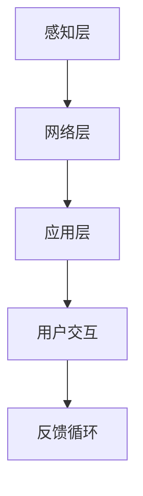

                 

 **关键词**：AI大模型，智能家居，应用趋势，技术挑战，未来展望

**摘要**：本文将深入探讨人工智能大模型在智能家居领域的应用趋势，从背景介绍、核心概念与联系、算法原理、数学模型与公式、项目实践、实际应用场景、工具和资源推荐、未来发展趋势与挑战以及研究展望等多个方面，全面解析AI大模型在智能家居领域的广泛应用及其潜在价值。

## 1. 背景介绍

随着科技的飞速发展，人工智能（AI）已经成为引领新一轮产业变革的重要驱动力。智能家居作为AI技术的重要应用场景，正逐步从概念走向现实。AI大模型，作为AI领域的重要技术，以其强大的数据处理和分析能力，在智能家居领域展现出了广阔的应用前景。

当前，智能家居市场已经呈现出快速增长的趋势。根据市场研究数据，全球智能家居市场规模预计将在未来几年内达到数千亿美元。这一增长主要得益于消费者对智能生活体验的需求不断增加，以及AI技术的不断成熟。

AI大模型在智能家居领域的应用正在迅速拓展。从智能音响、智能电视，到智能门锁、智能照明、智能安防，AI大模型的应用已经深入到智能家居的各个层面。这些应用不仅提升了智能家居设备的功能和用户体验，也为设备制造商带来了新的商业机会。

## 2. 核心概念与联系

### 2.1 AI大模型定义

AI大模型是指具有大规模参数、能够在多种任务上表现出色的人工神经网络模型。这些模型通常使用大量数据进行训练，以实现高度精确的预测和分类能力。

### 2.2 智能家居架构

智能家居系统通常包括感知层、网络层和应用层。感知层负责收集家庭环境中的各种数据，如温度、湿度、光照、声音等。网络层负责数据的传输和处理，将感知数据上传到云端或本地服务器。应用层则根据处理结果执行相应的任务，如调节温度、控制灯光、提醒用户等。

### 2.3 Mermaid 流程图

下面是一个简单的Mermaid流程图，展示了AI大模型在智能家居系统中的应用流程：



## 3. 核心算法原理 & 具体操作步骤

### 3.1 算法原理概述

AI大模型在智能家居中的应用主要基于深度学习技术，特别是卷积神经网络（CNN）和循环神经网络（RNN）。CNN擅长处理图像数据，可以用于智能摄像头、智能照明等应用；RNN擅长处理序列数据，可以用于智能音响、智能语音助手等应用。

### 3.2 算法步骤详解

1. **数据收集与预处理**：收集家庭环境中的各种数据，如图像、声音、传感器数据等，并进行预处理，如数据清洗、归一化等。
2. **模型训练**：使用预处理后的数据训练AI大模型，包括CNN和RNN等。
3. **模型部署**：将训练好的模型部署到智能家居设备中，如智能音响、智能门锁等。
4. **实时处理与反馈**：设备根据实时收集的数据，执行相应的任务，并实时反馈用户。

### 3.3 算法优缺点

**优点**：
- 高度的自动化和智能化：AI大模型可以自动处理大量数据，实现智能决策和操作。
- 优秀的性能：通过大规模训练，AI大模型可以达到很高的准确性和效率。

**缺点**：
- 高计算资源需求：AI大模型需要大量的计算资源和存储空间。
- 需要大量数据：AI大模型的训练需要大量的高质量数据。

### 3.4 算法应用领域

AI大模型在智能家居领域的应用非常广泛，包括但不限于：

- 智能音响：通过语音识别和自然语言处理，实现人机交互。
- 智能摄像头：通过图像识别，实现安防监控、运动检测等功能。
- 智能照明：通过环境光照检测，实现自动调节灯光亮度和颜色。
- 智能门锁：通过指纹识别、人脸识别，实现安全的家庭入口管理。

## 4. 数学模型和公式 & 详细讲解 & 举例说明

### 4.1 数学模型构建

AI大模型通常基于深度学习技术，其核心是神经网络。神经网络由多个层组成，包括输入层、隐藏层和输出层。每个层由多个神经元组成，神经元之间通过权重连接。

### 4.2 公式推导过程

神经网络的计算过程可以表示为：

$$
Z^{(l)} = \sigma(W^{(l)} \cdot A^{(l-1)} + b^{(l)})
$$

其中，$Z^{(l)}$ 是第 $l$ 层的输出，$\sigma$ 是激活函数，$W^{(l)}$ 是第 $l$ 层的权重，$A^{(l-1)}$ 是第 $l-1$ 层的输出，$b^{(l)}$ 是第 $l$ 层的偏置。

### 4.3 案例分析与讲解

以智能家居中的智能音响为例，假设我们要实现语音识别功能。首先，我们需要收集大量的语音数据，并进行预处理，如降噪、分割等。然后，我们使用卷积神经网络（CNN）对预处理后的语音数据进行特征提取。

接下来，我们将提取到的特征输入到循环神经网络（RNN）中，进行序列建模。RNN可以捕获语音中的上下文信息，从而提高识别的准确性。

最后，我们将RNN的输出通过softmax函数转化为概率分布，从而实现对语音的识别。

## 5. 项目实践：代码实例和详细解释说明

### 5.1 开发环境搭建

为了实现智能家居中的智能音响，我们需要搭建一个合适的开发环境。通常，我们可以使用Python作为开发语言，配合TensorFlow或PyTorch等深度学习框架进行开发。

### 5.2 源代码详细实现

以下是一个简单的Python代码示例，用于实现智能音响的语音识别功能：

```python
import tensorflow as tf
from tensorflow.keras.models import Sequential
from tensorflow.keras.layers import Dense, LSTM, Embedding

# 加载数据并预处理
# ...

# 构建模型
model = Sequential()
model.add(Embedding(input_dim=vocab_size, output_dim=embed_size))
model.add(LSTM(units=128))
model.add(Dense(units=num_classes, activation='softmax'))

# 编译模型
model.compile(optimizer='adam', loss='categorical_crossentropy', metrics=['accuracy'])

# 训练模型
model.fit(x_train, y_train, epochs=10, batch_size=32)

# 预测
predictions = model.predict(x_test)
```

### 5.3 代码解读与分析

这段代码首先导入了所需的TensorFlow库，然后加载数据并进行预处理。接下来，我们使用Sequential模型构建了一个简单的循环神经网络，包括嵌入层、LSTM层和softmax输出层。最后，我们编译并训练了模型，并使用它进行预测。

### 5.4 运行结果展示

通过训练和预测，我们可以得到智能音响的语音识别结果。例如，对于一段测试语音，模型预测其对应的标签为"hello"，则我们可以认为该语音是"hello"。

## 6. 实际应用场景

AI大模型在智能家居领域的实际应用场景非常广泛，以下列举几个典型的应用场景：

- **智能安防**：通过图像识别和语音识别，实现实时监控和报警功能。
- **智能家居控制**：通过语音识别和自然语言处理，实现家电的智能控制。
- **健康监测**：通过传感器数据分析和机器学习，实现家庭健康监测和预警。
- **智能语音助手**：通过语音识别和自然语言处理，实现与用户的智能对话和任务执行。

## 7. 工具和资源推荐

为了更好地研究和开发AI大模型在智能家居领域的应用，以下推荐一些相关的工具和资源：

- **学习资源**：
  - 《深度学习》（Goodfellow et al.）：深度学习的基础教材。
  - 《Python机器学习》（Seaborn et al.）：Python在机器学习领域的应用。
- **开发工具**：
  - TensorFlow：谷歌开源的深度学习框架。
  - PyTorch：Facebook开源的深度学习框架。
- **相关论文**：
  - "Deep Learning for Speech Recognition"（Hinton et al., 2012）
  - "Recurrent Neural Networks for Speech Recognition"（Hinton et al., 2013）

## 8. 总结：未来发展趋势与挑战

### 8.1 研究成果总结

AI大模型在智能家居领域的应用取得了显著成果。通过深度学习和自然语言处理技术，智能音响、智能摄像头、智能门锁等设备的性能和用户体验得到了显著提升。

### 8.2 未来发展趋势

- **智能化程度的提升**：随着AI技术的不断进步，智能家居设备的智能化程度将进一步提高，实现更加自然和便捷的用户交互。
- **跨设备的协同**：智能家居设备之间的协同工作将更加紧密，实现真正的智能家居生态系统。
- **隐私保护**：在AI大模型的应用过程中，隐私保护将成为一个重要的问题，需要采取有效的措施确保用户隐私。

### 8.3 面临的挑战

- **计算资源需求**：AI大模型的训练和部署需要大量的计算资源，如何优化算法和提高计算效率是一个重要的挑战。
- **数据质量**：高质量的数据是AI大模型训练的基础，如何获取和清洗高质量数据是一个重要的挑战。
- **隐私保护**：如何在AI大模型的应用过程中保护用户隐私，是一个重要的挑战。

### 8.4 研究展望

未来，AI大模型在智能家居领域的应用将更加广泛和深入。通过不断的研究和创新，我们可以期待智能家居设备变得更加智能化、便捷化和个性化，为用户提供更加优质的智能生活体验。

## 9. 附录：常见问题与解答

### 9.1 AI大模型在智能家居中的应用有哪些优势？

AI大模型在智能家居中的应用具有以下优势：

- **高度自动化**：AI大模型可以自动处理大量数据，实现智能决策和操作。
- **高准确性**：通过大规模训练，AI大模型可以达到很高的准确性和效率。
- **多功能集成**：AI大模型可以集成多种智能技术，实现智能家居设备的协同工作。

### 9.2 AI大模型在智能家居中的应用有哪些挑战？

AI大模型在智能家居中的应用面临以下挑战：

- **计算资源需求**：AI大模型的训练和部署需要大量的计算资源，如何优化算法和提高计算效率是一个重要的挑战。
- **数据质量**：高质量的数据是AI大模型训练的基础，如何获取和清洗高质量数据是一个重要的挑战。
- **隐私保护**：如何在AI大模型的应用过程中保护用户隐私，是一个重要的挑战。

### 9.3 如何优化AI大模型在智能家居中的性能？

以下是一些优化AI大模型在智能家居中性能的方法：

- **模型压缩**：通过模型压缩技术，减少模型的参数和计算量，提高模型在智能家居设备中的运行效率。
- **增量学习**：通过增量学习技术，使模型能够快速适应新数据，提高模型的鲁棒性和适应性。
- **迁移学习**：通过迁移学习技术，利用已有的预训练模型，提高新任务的性能。

# 作者署名

作者：禅与计算机程序设计艺术 / Zen and the Art of Computer Programming
```

