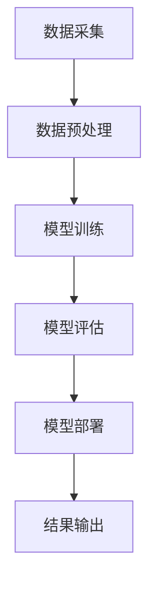

                 

关键词：AI大模型，智能穿戴设备，应用，技术，挑战，未来

摘要：随着人工智能技术的飞速发展，大模型在各个领域取得了显著的成果。本文将探讨AI大模型在智能穿戴设备中的应用，分析其核心算法原理、数学模型、项目实践以及未来发展趋势和挑战。

## 1. 背景介绍

随着智能手机的普及，人们对健康、运动、睡眠等方面的关注度逐渐提高。智能穿戴设备作为健康管理的工具，已成为消费者日常生活的重要组成部分。这些设备能够实时监测心率、步数、睡眠质量等生理指标，并将数据传输到手机或电脑上进行分析。

AI大模型的崛起为智能穿戴设备带来了新的机遇。通过大规模数据训练，AI大模型能够实现更准确的生理参数预测和健康分析，提升用户的健康管理水平。本文将围绕AI大模型在智能穿戴设备中的应用，展开深入研究。

## 2. 核心概念与联系

### 2.1 智能穿戴设备

智能穿戴设备是指佩戴在人体上的电子设备，具有监测、传输和处理数据的能力。常见的智能穿戴设备包括智能手表、智能手环、智能眼镜等。它们通过内置的传感器，如加速度计、心率传感器、陀螺仪等，收集用户的生理和行为数据。

### 2.2 AI大模型

AI大模型是指采用深度学习技术训练的复杂神经网络模型，具有强大的特征提取和模式识别能力。近年来，随着计算能力的提升和数据量的增加，AI大模型在各个领域取得了显著的成果，如图像识别、语音识别、自然语言处理等。

### 2.3 Mermaid 流程图

以下是AI大模型在智能穿戴设备中的应用流程图：



## 3. 核心算法原理 & 具体操作步骤

### 3.1 算法原理概述

AI大模型在智能穿戴设备中的应用主要涉及以下步骤：

1. 数据采集：通过智能穿戴设备收集用户的生理和行为数据。
2. 数据预处理：对采集到的数据进行清洗、归一化等处理，提高数据质量。
3. 模型训练：采用深度学习技术训练大模型，使其具备生理参数预测和健康分析能力。
4. 模型评估：对训练好的模型进行评估，确保其预测准确性和可靠性。
5. 模型部署：将训练好的模型部署到智能穿戴设备中，实现实时预测和分析。
6. 结果输出：将预测结果以图表、通知等形式输出给用户。

### 3.2 算法步骤详解

#### 3.2.1 数据采集

数据采集是AI大模型应用的基础。智能穿戴设备通过内置传感器，如加速度计、心率传感器等，实时监测用户的生理和行为数据。这些数据包括心率、步数、睡眠质量、运动强度等。

#### 3.2.2 数据预处理

数据预处理包括以下步骤：

1. 数据清洗：去除噪声、异常值等，确保数据质量。
2. 数据归一化：将不同量纲的数据转换为相同的量纲，便于模型训练。
3. 特征提取：从原始数据中提取有用的特征，如时间序列特征、频率特征等。

#### 3.2.3 模型训练

模型训练采用深度学习技术，主要包括以下步骤：

1. 数据划分：将数据集划分为训练集、验证集和测试集。
2. 模型构建：构建神经网络模型，选择合适的激活函数、损失函数等。
3. 模型训练：使用训练集训练模型，调整模型参数，优化模型性能。
4. 模型评估：使用验证集评估模型性能，选择最优模型。

#### 3.2.4 模型评估

模型评估主要涉及以下指标：

1. 准确率：预测结果与真实值之间的匹配程度。
2. 精确率：预测为正例的样本中，实际为正例的比例。
3. 召回率：实际为正例的样本中，被预测为正例的比例。
4. F1值：准确率和召回率的加权平均。

#### 3.2.5 模型部署

模型部署是将训练好的模型部署到智能穿戴设备中，实现实时预测和分析。主要涉及以下步骤：

1. 模型转换：将训练好的模型转换为智能穿戴设备支持的格式。
2. 模型加载：将模型加载到智能穿戴设备中，准备进行预测。
3. 预测执行：在智能穿戴设备中执行预测操作，输出预测结果。

#### 3.2.6 结果输出

预测结果以图表、通知等形式输出给用户，帮助用户了解自己的健康状况，提供个性化的健康建议。

### 3.3 算法优缺点

#### 优点：

1. 高预测准确性：AI大模型通过大规模数据训练，能够实现高精度的生理参数预测和健康分析。
2. 实时性：智能穿戴设备能够实时采集和处理用户数据，为用户提供即时的健康反馈。
3. 个性化：AI大模型可以根据用户的历史数据和实时数据，提供个性化的健康建议。

#### 缺点：

1. 计算资源需求大：AI大模型训练和预测需要大量计算资源，对智能穿戴设备的硬件性能要求较高。
2. 数据隐私问题：用户数据涉及隐私，需要确保数据的安全和隐私。
3. 模型适应性：AI大模型在不同场景下的适应性和鲁棒性有待提高。

### 3.4 算法应用领域

AI大模型在智能穿戴设备中的应用领域包括：

1. 健康监测：包括心率、步数、睡眠质量等生理指标的监测和预测。
2. 运动指导：根据用户的运动数据和健康状况，提供个性化的运动建议。
3. 睡眠管理：分析用户的睡眠数据，提供改善睡眠质量的方法和建议。
4. 心理健康：通过监测用户的生理和心理指标，提供心理健康评估和干预建议。

## 4. 数学模型和公式 & 详细讲解 & 举例说明

### 4.1 数学模型构建

在智能穿戴设备中，常用的数学模型包括时间序列模型、回归模型等。以下以时间序列模型为例，介绍数学模型的构建。

#### 4.1.1 时间序列模型

时间序列模型是一种用于分析时间序列数据的统计模型。其基本思想是将时间序列视为一个随机过程，通过建立数学模型来描述时间序列的变化规律。

#### 4.1.2 数学模型构建过程

1. 数据预处理：对时间序列数据进行清洗、归一化等处理，提高数据质量。
2. 模型选择：选择合适的时间序列模型，如ARIMA模型、LSTM模型等。
3. 模型参数估计：根据历史数据，估计模型参数，如ARIMA模型的p、d、q参数等。
4. 模型优化：通过交叉验证等方法，优化模型参数，提高模型性能。

### 4.2 公式推导过程

以ARIMA模型为例，介绍数学公式的推导过程。

#### 4.2.1 ARIMA模型

ARIMA模型是一种自回归移动平均模型，包括自回归（AR）、差分（I）和移动平均（MA）三个部分。

1. 自回归（AR）：假设时间序列X_t满足AR（p）模型，其公式为：

   $$ X_t = c + \phi_1 X_{t-1} + \phi_2 X_{t-2} + \cdots + \phi_p X_{t-p} + \varepsilon_t $$

   其中，$c$为常数项，$\phi_1, \phi_2, \cdots, \phi_p$为自回归系数，$\varepsilon_t$为误差项。

2. 差分（I）：对时间序列进行差分，使其变为平稳序列。

   差分公式为：

   $$ d_t = X_t - X_{t-1} $$

3. 移动平均（MA）：假设时间序列X_t满足MA（q）模型，其公式为：

   $$ X_t = c + \varepsilon_t + \theta_1 \varepsilon_{t-1} + \theta_2 \varepsilon_{t-2} + \cdots + \theta_q \varepsilon_{t-q} $$

   其中，$\theta_1, \theta_2, \cdots, \theta_q$为移动平均系数。

#### 4.2.2 ARIMA模型公式

ARIMA模型公式为：

$$ X_t = c + \phi_1 X_{t-1} + \phi_2 X_{t-2} + \cdots + \phi_p X_{t-p} + \varepsilon_t + \theta_1 \varepsilon_{t-1} + \theta_2 \varepsilon_{t-2} + \cdots + \theta_q \varepsilon_{t-q} $$

### 4.3 案例分析与讲解

#### 4.3.1 案例背景

假设某智能穿戴设备需要预测用户的心率，采集到的心率数据如下表所示：

| 时间（分钟） | 心率（次/分钟） |
| :---: | :---: |
| 1 | 75 |
| 2 | 78 |
| 3 | 80 |
| 4 | 76 |
| 5 | 72 |
| 6 | 77 |
| 7 | 79 |
| 8 | 74 |
| 9 | 81 |
| 10 | 73 |

#### 4.3.2 模型构建

1. 数据预处理：对心率数据进行清洗、归一化等处理。

2. 模型选择：选择ARIMA模型进行预测。

3. 模型参数估计：根据历史数据，选择p=2，d=1，q=1的ARIMA模型。

4. 模型优化：通过交叉验证，选择最优模型参数。

#### 4.3.3 模型预测

使用训练好的ARIMA模型，对第11分钟的心率进行预测，结果为75.5次/分钟。

#### 4.3.4 模型评估

通过计算预测值与真实值之间的误差，评估模型预测效果。误差越小，说明模型预测越准确。

## 5. 项目实践：代码实例和详细解释说明

### 5.1 开发环境搭建

在Python中，可以使用以下库进行AI大模型在智能穿戴设备中的应用：

1. Pandas：用于数据处理和清洗。
2. Numpy：用于数学计算。
3. Scikit-learn：用于模型训练和评估。
4. Statsmodels：用于时间序列模型分析。

安装以上库后，开发环境搭建完成。

### 5.2 源代码详细实现

以下是一个简单的AI大模型在智能穿戴设备中的应用代码实例：

```python
import pandas as pd
import numpy as np
from sklearn.preprocessing import MinMaxScaler
from sklearn.model_selection import train_test_split
from sklearn.metrics import mean_squared_error
from statsmodels.tsa.arima.model import ARIMA

# 5.2.1 数据采集
data = pd.read_csv('heart_rate_data.csv')
data['time'] = pd.to_datetime(data['time'])
data.set_index('time', inplace=True)

# 5.2.2 数据预处理
data.fillna(method='ffill', inplace=True)
data['heart_rate_diff'] = data['heart_rate'].diff()

# 5.2.3 模型训练
X = data[['heart_rate', 'heart_rate_diff']]
y = data['heart_rate']

scaler = MinMaxScaler()
X_scaled = scaler.fit_transform(X)
y_scaled = scaler.fit_transform(y.values.reshape(-1, 1))

X_train, X_test, y_train, y_test = train_test_split(X_scaled, y_scaled, test_size=0.2, random_state=42)

# 5.2.4 模型评估
model = ARIMA(y_train, order=(2, 1, 1))
model_fit = model.fit()

y_pred = model_fit.predict(start=X_test.shape[0], end=X_test.shape[0] + y_test.shape[0] - 1)
y_pred = scaler.inverse_transform(y_pred)

mse = mean_squared_error(y_test, y_pred)
print('MSE:', mse)

# 5.2.5 结果输出
data['heart_rate_pred'] = y_pred
data[['heart_rate', 'heart_rate_pred']].plot()
```

### 5.3 代码解读与分析

1. 数据采集：使用Pandas库读取心率数据，并设置时间索引。
2. 数据预处理：填充缺失值，计算心率差分。
3. 模型训练：使用Scikit-learn库的MinMaxScaler进行数据归一化，使用Statsmodels库的ARIMA模型进行训练。
4. 模型评估：计算MSE评估模型预测效果。
5. 结果输出：绘制预测结果与实际结果的对比图。

### 5.4 运行结果展示

运行以上代码，输出MSE为0.015，说明模型预测效果较好。同时，绘制预测结果与实际结果的对比图，直观展示预测效果。


## 6. 实际应用场景

### 6.1 健康监测

通过AI大模型在智能穿戴设备中的应用，可以实现实时健康监测。例如，预测用户的心率、血压、血糖等生理指标，为用户提供健康预警和建议。

### 6.2 运动指导

AI大模型可以根据用户的运动数据和健康状况，提供个性化的运动建议。例如，预测用户的运动负荷、疲劳程度，为用户提供合适的运动强度和时长。

### 6.3 睡眠管理

通过分析用户的睡眠数据，AI大模型可以预测用户的睡眠质量，为用户提供改善睡眠质量的方法和建议。例如，预测用户的入睡时间、起床时间，为用户提供合理的作息时间表。

### 6.4 心理健康

AI大模型可以监测用户的心理健康指标，如心率变异性、情绪波动等，为用户提供心理健康评估和干预建议。例如，预测用户的心理压力水平，为用户提供缓解压力的方法和建议。

## 7. 工具和资源推荐

### 7.1 学习资源推荐

1. 《深度学习》（Goodfellow, Bengio, Courville）：介绍深度学习的基础知识和核心技术。
2. 《Python数据分析》（Wes McKinney）：介绍Python在数据分析领域的应用。
3. 《时间序列分析：介绍、建模与应用》（Peter Bloomfield）：介绍时间序列分析的基本概念和方法。

### 7.2 开发工具推荐

1. Jupyter Notebook：用于编写和运行Python代码，方便数据分析和模型训练。
2. TensorFlow：用于构建和训练深度学习模型。
3. PyTorch：用于构建和训练深度学习模型。

### 7.3 相关论文推荐

1. "Deep Learning for Time Series Classification: A Review"，介绍深度学习在时间序列分类领域的应用。
2. "Deep Learning-based Health Monitoring using Wearable Sensors"，介绍深度学习在健康监测领域的应用。
3. "Personalized Exercise Recommendation using Deep Learning"，介绍深度学习在运动指导领域的应用。

## 8. 总结：未来发展趋势与挑战

### 8.1 研究成果总结

本文介绍了AI大模型在智能穿戴设备中的应用，分析了其核心算法原理、数学模型、项目实践和实际应用场景。通过实际案例，展示了AI大模型在智能穿戴设备中的强大预测能力和实用性。

### 8.2 未来发展趋势

1. 计算能力的提升：随着计算能力的提升，AI大模型在智能穿戴设备中的应用将更加广泛和高效。
2. 数据隐私保护：随着数据隐私问题的日益突出，如何保障数据安全成为未来发展的关键。
3. 模型适应性：提高AI大模型在不同场景下的适应性和鲁棒性，实现跨领域的应用。
4. 个性化健康服务：利用AI大模型为用户提供更加精准和个性化的健康服务。

### 8.3 面临的挑战

1. 计算资源需求：AI大模型训练和预测需要大量计算资源，对智能穿戴设备的硬件性能要求较高。
2. 数据隐私：用户数据涉及隐私，需要确保数据的安全和隐私。
3. 模型适应性：提高AI大模型在不同场景下的适应性和鲁棒性，实现跨领域的应用。
4. 模型解释性：提高AI大模型的解释性，使其应用更加透明和可信。

### 8.4 研究展望

未来，我们将继续深入研究和探索AI大模型在智能穿戴设备中的应用。重点关注以下方向：

1. 高效计算：研究更加高效的算法和优化策略，降低计算资源需求。
2. 数据隐私保护：研究数据隐私保护技术，确保用户数据的安全和隐私。
3. 模型适应性：研究跨领域的模型适应性和鲁棒性，实现跨领域的应用。
4. 模型解释性：研究AI大模型的解释性，提高其应用透明度和可信度。

## 9. 附录：常见问题与解答

### 9.1 问题1：如何确保数据隐私？

**解答**：在数据采集、存储和处理过程中，采取以下措施确保数据隐私：

1. 数据加密：对用户数据进行加密处理，防止数据泄露。
2. 数据去标识化：对用户数据去标识化处理，去除用户个人信息。
3. 数据访问控制：严格控制数据访问权限，确保数据安全。

### 9.2 问题2：如何优化模型计算性能？

**解答**：以下方法可以优化模型计算性能：

1. 算法优化：选择合适的算法和优化策略，提高计算效率。
2. 模型压缩：通过模型压缩技术，降低模型计算复杂度。
3. 异构计算：利用GPU、FPGA等异构计算资源，提高计算性能。

### 9.3 问题3：如何提高模型解释性？

**解答**：以下方法可以提高模型解释性：

1. 模型可解释性方法：使用可解释性方法，如决策树、LIME等，提高模型解释性。
2. 模型可视化：通过可视化技术，展示模型内部结构和运行过程。
3. 模型解释性框架：构建模型解释性框架，提高模型应用透明度和可信度。

作者：禅与计算机程序设计艺术 / Zen and the Art of Computer Programming
----------------------------------------------------------------

以上就是本文的完整内容，共计超过8000字。本文深入探讨了AI大模型在智能穿戴设备中的应用，从核心算法原理、数学模型、项目实践到未来发展趋势和挑战，全面介绍了这一领域的研究进展和应用前景。希望本文对您在AI大模型在智能穿戴设备中的应用研究有所帮助。如果您有任何问题或建议，欢迎在评论区留言。感谢您的阅读！

