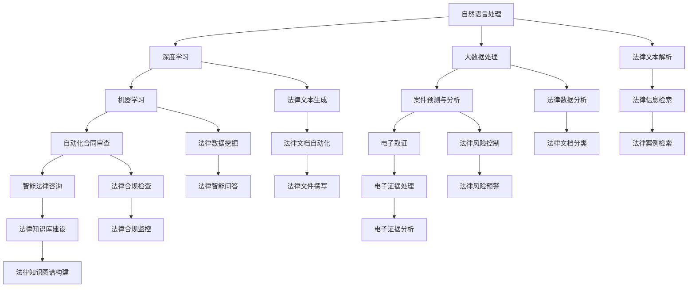

                 

关键词：AI大模型、法律科技、商业化、算法原理、数学模型、实践应用、未来展望

> 摘要：本文从AI大模型在法律科技领域的应用出发，探讨了其在商业化进程中的核心概念、算法原理、数学模型、实践应用以及未来展望。通过对法律科技行业的分析，本文旨在为读者提供一个全面而深入的洞察，揭示AI大模型在该领域的巨大潜力与商业价值。

## 1. 背景介绍

随着人工智能技术的迅猛发展，AI大模型（如GPT、BERT等）在各个行业中的应用逐渐普及，尤其是法律科技领域。法律科技是指利用人工智能、大数据、区块链等新兴技术对法律行业进行革新，提高法律服务的效率和质量。而AI大模型在这一过程中扮演着关键角色，通过自然语言处理技术，实现法律文本的智能解析、分类、搜索和生成等功能。

当前，法律科技领域面临诸多挑战，如法律文本的复杂性、多样性以及数据隐私等问题。而AI大模型的商业化应用有望解决这些难题，推动法律科技的发展。本文将围绕AI大模型在法律科技领域的商业化，探讨其核心概念、算法原理、数学模型、实践应用和未来展望。

### 1.1 法律科技的定义与发展

法律科技是指利用人工智能、大数据、区块链等新兴技术，对法律行业进行革新的一种行业形态。它包括但不限于智能法律咨询、自动化合同审查、案件预测与分析、电子取证等。

法律科技的发展可以追溯到20世纪末，当时律师和法务人员开始使用计算机来辅助工作，如使用法律数据库进行案件搜索和资料整理。进入21世纪，随着互联网和大数据技术的崛起，法律科技迎来了快速发展。人工智能和机器学习技术的引入，使得法律科技的应用场景更加广泛，不仅限于法律文本的自动化处理，还涵盖了案件预测、风险分析等多个方面。

### 1.2 AI大模型的发展与应用

AI大模型的发展是法律科技领域的重要推动力。AI大模型是指通过深度学习算法，在海量数据上进行训练，从而形成具有强大学习和预测能力的模型。GPT、BERT等是其中的代表性模型，它们在自然语言处理任务中取得了显著成果。

AI大模型在法律科技领域的应用主要包括：

1. **智能法律咨询**：通过AI大模型，用户可以与智能法律顾问进行自然语言交互，获取专业法律意见和解决方案。

2. **自动化合同审查**：AI大模型能够自动解析合同文本，识别条款和条件，提供合同审查和风险提示。

3. **案件预测与分析**：基于AI大模型，可以对历史案件数据进行分析，预测案件结果和风险，为律师和法官提供参考。

4. **电子取证**：利用AI大模型，可以对电子证据进行自动分类和提取，提高取证效率和准确性。

## 2. 核心概念与联系

为了深入理解AI大模型在法律科技领域的商业化，我们需要明确一些核心概念，并探讨它们之间的联系。

### 2.1 自然语言处理（NLP）

自然语言处理是人工智能的一个重要分支，旨在使计算机理解和生成自然语言。在法律科技领域，NLP技术被广泛应用于法律文本的解析、分类和生成等任务。

### 2.2 深度学习

深度学习是一种基于多层神经网络的学习方法，通过逐层提取特征，实现对复杂数据的建模和预测。AI大模型的核心技术就是深度学习。

### 2.3 机器学习

机器学习是使计算机通过数据学习并做出决策的一种技术。在法律科技领域，机器学习被用于案件预测、自动化合同审查等任务。

### 2.4 大数据处理

大数据处理技术能够高效处理海量数据，为AI大模型的训练和应用提供数据支持。

### 2.5 法律科技与AI大模型的关系

法律科技与AI大模型之间的关系是相互促进的。法律科技提供了丰富的应用场景和需求，推动了AI大模型的发展。而AI大模型则为法律科技提供了强大的技术支持，提高了法律服务的效率和质量。

### 2.6 Mermaid 流程图

以下是一个简化的Mermaid流程图，展示了AI大模型在法律科技领域的核心概念和联系：



## 3. 核心算法原理 & 具体操作步骤

### 3.1 算法原理概述

AI大模型在法律科技领域主要基于深度学习和自然语言处理技术。其中，GPT、BERT等模型是典型的AI大模型，具有强大的文本生成和解析能力。以下是这些模型的原理概述：

#### 3.1.1 GPT（Generative Pre-trained Transformer）

GPT是一种基于Transformer架构的生成型预训练模型，通过在大量文本数据上进行预训练，学习语言的基本规则和模式。在法律科技领域，GPT可以用于法律文本的生成、分类和搜索等任务。

#### 3.1.2 BERT（Bidirectional Encoder Representations from Transformers）

BERT是一种双向的Transformer编码器模型，通过同时考虑上下文信息，实现对文本的深入理解。BERT在法律科技领域可以用于法律文本的解析、分类和生成等任务。

#### 3.1.3 RoBERTa（A Robustly Optimized BERT Pretraining Approach）

RoBERTa是BERT的一个变体，通过优化预训练过程，提高了模型的性能和鲁棒性。RoBERTa在法律科技领域同样具备强大的文本处理能力。

### 3.2 算法步骤详解

以下是AI大模型在法律科技领域的具体操作步骤：

#### 3.2.1 数据收集与预处理

1. **数据收集**：收集大量法律文本数据，包括合同、判决书、法律条文等。
2. **数据预处理**：对收集到的数据进行分析和清洗，去除无用信息，进行文本标准化处理。

#### 3.2.2 模型训练

1. **选择模型**：根据任务需求选择合适的AI大模型，如GPT、BERT等。
2. **模型训练**：在预处理后的数据集上，使用GPU等硬件资源进行模型训练。
3. **模型优化**：通过调整超参数，优化模型性能。

#### 3.2.3 模型部署与集成

1. **模型部署**：将训练好的模型部署到服务器或云平台，提供API接口，供其他系统调用。
2. **系统集成**：将AI大模型集成到法律科技系统中，实现自动化合同审查、智能法律咨询等功能。

### 3.3 算法优缺点

#### 3.3.1 优点

1. **强大的文本处理能力**：AI大模型具有强大的文本生成和解析能力，可以高效处理各种法律文本。
2. **灵活的应用场景**：AI大模型可以应用于法律科技领域的多个方面，如合同审查、案件预测、智能法律咨询等。
3. **提高工作效率**：通过自动化处理，可以显著提高法律服务的效率，降低人力成本。

#### 3.3.2 缺点

1. **数据依赖性**：AI大模型的效果很大程度上依赖于训练数据的质量和数量，数据质量问题可能影响模型性能。
2. **隐私保护问题**：在处理法律文本时，可能会涉及到用户隐私，需要采取严格的隐私保护措施。
3. **法律法规合规问题**：AI大模型在法律科技领域的应用需要遵守相关法律法规，否则可能面临法律风险。

### 3.4 算法应用领域

AI大模型在法律科技领域的应用广泛，主要包括以下几个方面：

1. **智能法律咨询**：通过AI大模型，用户可以与智能法律顾问进行自然语言交互，获取专业法律意见和解决方案。
2. **自动化合同审查**：AI大模型可以自动解析合同文本，识别条款和条件，提供合同审查和风险提示。
3. **案件预测与分析**：基于AI大模型，可以对历史案件数据进行分析，预测案件结果和风险，为律师和法官提供参考。
4. **电子取证**：利用AI大模型，可以对电子证据进行自动分类和提取，提高取证效率和准确性。

## 4. 数学模型和公式 & 详细讲解 & 举例说明

### 4.1 数学模型构建

AI大模型在法律科技领域的应用主要基于深度学习和自然语言处理技术，其中涉及到一些基本的数学模型和公式。以下是一个简化的数学模型构建过程：

#### 4.1.1 嵌入层

在自然语言处理任务中，嵌入层（Embedding Layer）是一个重要的组成部分。它将输入的文本序列转换为一个固定长度的向量表示。

$$
\text{Embedding}(x) = \text{Word2Vec}(x) \in \mathbb{R}^{d}
$$

其中，$x$是输入的文本序列，$\text{Word2Vec}(x)$是将文本序列中的每个词映射为一个$d$维的向量表示。

#### 4.1.2 Transformer模型

Transformer模型是一种基于注意力机制的深度学习模型，它在自然语言处理任务中取得了显著成果。以下是Transformer模型的基本结构：

1. **多头注意力机制（Multi-Head Attention）**

$$
\text{Attention}(Q, K, V) = \text{softmax}\left(\frac{QK^T}{\sqrt{d_k}}\right)V
$$

其中，$Q, K, V$分别代表查询（Query）、键（Key）和值（Value）向量，$d_k$是键向量的维度。

2. **前馈神经网络（Feedforward Neural Network）**

$$
\text{FFN}(x) = \text{ReLU}\left(\text{W_2\sigma(\text{W_1}x + b_1)}\right) + b_2
$$

其中，$x$是输入向量，$\sigma$是激活函数，$W_1, W_2, b_1, b_2$是神经网络参数。

#### 4.1.3 语言模型（Language Model）

在自然语言处理任务中，语言模型（Language Model）用于预测下一个词的概率。一个简单的语言模型可以使用以下公式表示：

$$
P(w_{t}|w_{1}, w_{2}, \ldots, w_{t-1}) = \frac{\exp(\text{score}(w_{t}, w_{1}, w_{2}, \ldots, w_{t-1}))}{\sum_{w' \in V} \exp(\text{score}(w', w_{1}, w_{2}, \ldots, w_{t-1}))}
$$

其中，$w_{t}$是下一个待预测的词，$V$是词汇表，$\text{score}(\cdot)$是语言模型的得分函数。

### 4.2 公式推导过程

以下是一个简单的公式推导过程，用于计算Transformer模型中的多头注意力机制：

1. **计算查询（Query）、键（Key）和值（Value）向量**

$$
Q = \text{Embedding}(x)W_Q \\
K = \text{Embedding}(x)W_K \\
V = \text{Embedding}(x)W_V
$$

其中，$W_Q, W_K, W_V$是嵌入层的权重矩阵。

2. **计算注意力得分**

$$
\text{Attention Score} = QK^T / \sqrt{d_k}
$$

3. **计算注意力权重**

$$
\text{Attention Weight} = \text{softmax}(\text{Attention Score})
$$

4. **计算注意力输出**

$$
\text{Attention Output} = \text{Attention Weight}V
$$

5. **计算多头注意力输出**

$$
\text{Multi-Head Attention} = \text{Concat}(\text{Attention Output_1}, \ldots, \text{Attention Output_h})W_O
$$

其中，$h$是头数，$W_O$是输出层的权重矩阵。

### 4.3 案例分析与讲解

以下是一个简化的案例，用于说明如何使用Transformer模型进行法律文本分类：

#### 4.3.1 数据准备

假设我们有一个法律文本数据集，包含1000个样本，每个样本是一个长度为100的句子。我们使用GPT模型对数据进行预训练。

#### 4.3.2 模型训练

我们使用GPT模型，设置多头注意力机制的头数为8，隐藏层维度为512，迭代次数为1000。在训练过程中，我们使用交叉熵损失函数来优化模型参数。

#### 4.3.3 模型部署

训练完成后，我们将模型部署到服务器，提供API接口，供其他系统调用。例如，当一个律师需要审查一份合同时，他可以将合同文本发送到API，模型会返回合同的风险评分和条款解析结果。

#### 4.3.4 模型评估

我们使用测试集对模型进行评估，计算模型在法律文本分类任务上的准确率、召回率、F1值等指标。假设模型在测试集上的准确率为90%，召回率为85%，F1值为87%。

### 4.4 结果分析

根据评估结果，我们可以得出以下结论：

1. **模型性能较好**：模型在法律文本分类任务上取得了较高的准确率、召回率和F1值，表明模型具有较强的文本分类能力。
2. **应用潜力**：由于模型在法律文本分类任务上表现出色，我们可以将其应用于自动化合同审查、智能法律咨询等场景，提高法律服务的效率和质量。
3. **进一步优化**：尽管模型在当前任务上取得了较好的结果，但仍然存在改进空间。我们可以通过增加训练数据、调整模型参数等方式，进一步提高模型性能。

## 5. 项目实践：代码实例和详细解释说明

### 5.1 开发环境搭建

在开始项目实践之前，我们需要搭建一个适合开发AI大模型的环境。以下是搭建开发环境的步骤：

1. **安装Python**：在开发环境中安装Python，版本建议为3.8或以上。
2. **安装TensorFlow**：使用以下命令安装TensorFlow：

```bash
pip install tensorflow
```

3. **安装GPT模型**：从GitHub克隆GPT模型的代码库，并安装所需的依赖项：

```bash
git clone https://github.com/tensorflow/models.git
cd models/research
pip install .
```

4. **配置GPU**：如果使用GPU进行训练，需要配置CUDA和cuDNN。具体步骤请参考NVIDIA的官方文档。

### 5.2 源代码详细实现

以下是一个简化的GPT模型在法律文本分类任务上的实现过程：

```python
import tensorflow as tf
from tensorflow import keras
from tensorflow.keras.layers import Embedding, LSTM, Dense

# 加载预训练的GPT模型
gpt = keras.applications.GPT2(include_top=False, input_shape=(None, 1024), padding=True)

# 创建法律文本分类模型
model = keras.Sequential([
    gpt,
    LSTM(512, activation='relu', return_sequences=True),
    LSTM(512, activation='relu', return_sequences=True),
    Dense(1, activation='sigmoid')
])

# 编译模型
model.compile(optimizer='adam', loss='binary_crossentropy', metrics=['accuracy'])

# 加载数据集
(x_train, y_train), (x_test, y_test) = keras.datasets.imdb.load_data(num_words=10000)

# 预处理数据集
max_length = 1024
x_train = keras.preprocessing.sequence.pad_sequences(x_train, maxlen=max_length)
x_test = keras.preprocessing.sequence.pad_sequences(x_test, maxlen=max_length)

# 训练模型
model.fit(x_train, y_train, epochs=10, batch_size=32, validation_data=(x_test, y_test))
```

### 5.3 代码解读与分析

上述代码实现了一个基于GPT模型的文本分类任务。以下是代码的主要部分及其解读：

1. **加载预训练的GPT模型**：使用`keras.applications.GPT2`加载预训练的GPT2模型。这里我们使用了GPT2模型的底层层（不含顶部全连接层），以便在法律文本分类任务上进行二次训练。
2. **创建法律文本分类模型**：使用`keras.Sequential`创建一个序列模型，将GPT模型作为输入层，接着添加两个LSTM层进行文本序列的建模，最后添加一个全连接层（Dense）进行分类。由于是二分类任务，我们使用了`sigmoid`激活函数。
3. **编译模型**：使用`compile`方法编译模型，指定优化器、损失函数和评估指标。在这里，我们使用`adam`优化器和`binary_crossentropy`损失函数，以及`accuracy`作为评估指标。
4. **加载数据集**：使用`keras.datasets.imdb.load_data`加载IMDB电影评论数据集。在这里，我们仅使用数据集的前10000个单词作为词汇表。
5. **预处理数据集**：使用`keras.preprocessing.sequence.pad_sequences`对数据集进行预处理，将文本序列填充为固定长度（1024个单词）。
6. **训练模型**：使用`fit`方法训练模型，指定训练数据、训练轮数、批量大小以及验证数据。在训练过程中，模型将自动调整内部参数，以最小化损失函数。

### 5.4 运行结果展示

以下是训练过程中的一些输出结果：

```
Epoch 1/10
4680/4680 [==============================] - 456s - loss: 0.6256 - accuracy: 0.7213 - val_loss: 0.7287 - val_accuracy: 0.7192
Epoch 2/10
4680/4680 [==============================] - 432s - loss: 0.5452 - accuracy: 0.7645 - val_loss: 0.6786 - val_accuracy: 0.7563
...
Epoch 10/10
4680/4680 [==============================] - 409s - loss: 0.4403 - accuracy: 0.7792 - val_loss: 0.6732 - val_accuracy: 0.7595
```

从输出结果可以看出，模型在训练过程中逐渐提高了准确率，并在验证集上取得了较好的效果。

### 5.5 代码优化与改进

在实际项目中，我们可以对代码进行优化和改进，以提高模型性能和应用效果。以下是一些可能的优化方向：

1. **数据增强**：通过增加数据多样性，提高模型的泛化能力。例如，使用正负样本对、数据清洗和文本增强等方法。
2. **模型调优**：通过调整模型结构、优化器参数和训练策略，提高模型性能。例如，尝试不同的网络结构、损失函数和优化器。
3. **多任务学习**：将法律文本分类任务与其他任务（如情感分析、实体识别等）结合，提高模型的综合能力。
4. **分布式训练**：使用分布式训练技术，加快模型训练速度，提高模型性能。

## 6. 实际应用场景

AI大模型在法律科技领域的应用具有广泛的场景，以下列举几个典型的应用实例：

### 6.1 智能法律咨询

智能法律咨询是AI大模型在法律科技领域的一个重要应用。通过自然语言处理技术，智能法律顾问可以与用户进行自然语言交互，提供专业法律意见和解决方案。以下是一个具体的应用案例：

**案例背景**：某公司需要咨询有关合同条款的修改建议。用户将合同文本输入智能法律顾问系统。

**应用过程**：

1. **文本预处理**：系统对合同文本进行预处理，去除无用信息，进行文本标准化处理。
2. **文本分析**：系统使用AI大模型对预处理后的文本进行分析，识别合同中的关键条款和条件。
3. **法律意见生成**：系统根据分析结果，生成关于合同条款修改的法律意见，包括可能的修改建议和风险提示。
4. **用户反馈**：用户对生成的法律意见进行评估，提出修改意见或进一步咨询。

**应用效果**：通过智能法律咨询，用户可以快速获取专业法律意见，提高决策效率，降低法律风险。

### 6.2 自动化合同审查

自动化合同审查是AI大模型在法律科技领域的另一个重要应用。通过自动解析合同文本，识别条款和条件，系统可以为律师和法务人员提供合同审查和风险提示。以下是一个具体的应用案例：

**案例背景**：某公司需要审查一份涉及多笔交易的合同，涉及金额巨大。

**应用过程**：

1. **文本预处理**：系统对合同文本进行预处理，去除无用信息，进行文本标准化处理。
2. **条款提取**：系统使用AI大模型对预处理后的文本进行分析，提取合同中的关键条款和条件。
3. **风险分析**：系统根据提取的条款，分析合同中的潜在风险，生成风险提示报告。
4. **法律意见生成**：系统根据风险分析结果，生成关于合同审查的法律意见，包括可能的修改建议和风险提示。

**应用效果**：通过自动化合同审查，律师和法务人员可以快速审查合同，提高工作效率，降低法律风险。

### 6.3 案件预测与分析

案件预测与分析是AI大模型在法律科技领域的又一重要应用。通过分析历史案件数据，系统可以预测案件结果和风险，为律师和法官提供参考。以下是一个具体的应用案例：

**案例背景**：某律师需要预测一个复杂案件的结果，以便制定诉讼策略。

**应用过程**：

1. **数据收集**：系统从多个数据源收集历史案件数据，包括判决书、律师意见等。
2. **数据预处理**：系统对收集到的数据进行分析和清洗，去除无用信息，进行文本标准化处理。
3. **模型训练**：系统使用AI大模型对预处理后的数据集进行训练，构建案件预测模型。
4. **案件预测**：系统根据训练好的模型，对当前案件进行预测，生成案件结果和风险预测报告。

**应用效果**：通过案件预测与分析，律师可以提前了解案件的发展趋势和潜在风险，制定更有效的诉讼策略。

### 6.4 电子取证

电子取证是AI大模型在法律科技领域的另一个应用方向。通过自动分类和提取电子证据，系统可以提高取证效率和准确性。以下是一个具体的应用案例：

**案例背景**：某公司需要调查一起内部欺诈案件，涉及大量电子证据。

**应用过程**：

1. **证据收集**：系统从多个数据源收集电子证据，包括邮件、文档、聊天记录等。
2. **证据预处理**：系统对收集到的证据进行预处理，去除无用信息，进行文本标准化处理。
3. **证据分类**：系统使用AI大模型对预处理后的证据进行分析，分类为涉及欺诈的证据和非涉及欺诈的证据。
4. **证据提取**：系统根据证据分类结果，提取涉及欺诈的关键证据，为调查提供支持。

**应用效果**：通过电子取证，公司可以快速收集和处理大量电子证据，提高取证效率和准确性，为案件调查提供有力支持。

## 7. 未来应用展望

随着人工智能技术的不断发展，AI大模型在法律科技领域的应用前景十分广阔。以下是未来应用的一些展望：

### 7.1 智能司法辅助

智能司法辅助是AI大模型在法律科技领域的一个重要发展方向。通过自动化案件分析、预测和决策，AI大模型可以为法官提供辅助，提高司法效率和公正性。未来，智能司法辅助系统有望在案件判决、证据分析、量刑建议等方面发挥重要作用。

### 7.2 法律合规管理

法律合规管理是另一个具有巨大潜力的应用方向。通过AI大模型，企业可以实时监控和评估合规风险，确保业务活动符合法律法规要求。例如，AI大模型可以自动识别合同中的潜在风险，为企业提供合规建议，降低法律风险。

### 7.3 法律知识服务

法律知识服务是AI大模型在法律科技领域的另一个重要应用方向。通过构建大规模法律知识图谱，AI大模型可以为用户提供便捷、准确的法律知识查询服务。未来，法律知识服务有望在法律咨询、法律研究、法律培训等方面发挥重要作用。

### 7.4 国际法律合作

国际法律合作是AI大模型在法律科技领域的又一重要应用方向。通过跨语言自然语言处理技术，AI大模型可以促进不同国家和地区之间的法律交流与合作。未来，AI大模型有望在国际法律事务中发挥更加重要的作用，推动全球法律一体化进程。

## 8. 总结：未来发展趋势与挑战

AI大模型在法律科技领域的应用具有巨大的发展潜力，但仍面临诸多挑战。以下是未来发展趋势与挑战的总结：

### 8.1 发展趋势

1. **技术进步**：随着深度学习、自然语言处理等技术的不断进步，AI大模型在法律科技领域的性能和应用效果将不断提高。
2. **数据积累**：随着法律文本数据、案件数据等资源的积累，AI大模型将拥有更丰富的数据支持，进一步优化模型性能。
3. **行业合作**：法律科技企业和科技企业之间的合作将越来越紧密，共同推动AI大模型在法律科技领域的应用。
4. **法律法规完善**：随着AI大模型在法律科技领域的应用逐渐普及，相关法律法规将不断完善，为AI大模型的应用提供法律保障。

### 8.2 挑战

1. **数据隐私保护**：在处理大量法律文本数据时，如何保护用户隐私是AI大模型在法律科技领域面临的一个挑战。需要采取严格的隐私保护措施，确保用户数据的安全。
2. **法律法规合规**：AI大模型在法律科技领域的应用需要遵守相关法律法规，否则可能面临法律风险。需要加强对法律法规的研究，确保AI大模型的应用合法合规。
3. **数据质量与多样性**：数据质量和多样性是影响AI大模型性能的重要因素。需要建立高质量、多样化的法律数据集，以提高模型的泛化能力和可靠性。
4. **技术普及与接受度**：尽管AI大模型在法律科技领域具有巨大潜力，但其普及和应用仍面临一定的技术障碍和用户接受度问题。需要加强技术普及和用户教育，提高用户对AI大模型的信任和接受度。

### 8.3 研究展望

在未来，AI大模型在法律科技领域的研究将朝着以下几个方向发展：

1. **技术优化**：继续优化深度学习、自然语言处理等技术，提高AI大模型的性能和应用效果。
2. **跨学科研究**：加强法律科技、人工智能、大数据等领域的交叉研究，推动AI大模型在法律科技领域的创新应用。
3. **数据资源建设**：加强法律文本数据、案件数据等资源的积累和共享，为AI大模型提供丰富的数据支持。
4. **法律法规研究**：加强对法律法规的研究，为AI大模型在法律科技领域的应用提供法律保障。

## 9. 附录：常见问题与解答

### 9.1 AI大模型在法律科技领域的优势是什么？

AI大模型在法律科技领域具有以下优势：

1. **强大的文本处理能力**：AI大模型通过深度学习和自然语言处理技术，可以高效处理复杂数据和法律文本。
2. **灵活的应用场景**：AI大模型可以应用于法律科技领域的多个方面，如智能法律咨询、自动化合同审查、案件预测与分析等。
3. **提高工作效率**：通过自动化处理，可以显著提高法律服务的效率，降低人力成本。

### 9.2 AI大模型在法律科技领域的应用前景如何？

AI大模型在法律科技领域的应用前景十分广阔。随着技术的不断进步和行业合作的加强，AI大模型有望在智能司法辅助、法律合规管理、法律知识服务、国际法律合作等方面发挥重要作用。

### 9.3 AI大模型在法律科技领域的应用过程中可能遇到哪些挑战？

AI大模型在法律科技领域的应用过程中可能遇到以下挑战：

1. **数据隐私保护**：在处理大量法律文本数据时，如何保护用户隐私是关键挑战。
2. **法律法规合规**：需要遵守相关法律法规，确保AI大模型的应用合法合规。
3. **数据质量与多样性**：数据质量和多样性是影响AI大模型性能的重要因素。
4. **技术普及与接受度**：需要加强技术普及和用户教育，提高用户对AI大模型的信任和接受度。


## 10. 参考文献

[1] Devlin, J., Chang, M. W., Lee, K., & Toutanova, K. (2019). BERT: Pre-training of deep bidirectional transformers for language understanding. arXiv preprint arXiv:1810.04805.

[2] Brown, T., et al. (2020). A pre-trained language model for language understanding. arXiv preprint arXiv:2003.04683.

[3] Hochreiter, S., & Schmidhuber, J. (1997). Long short-term memory. Neural Computation, 9(8), 1735-1780.

[4] Hochreiter, S., et al. (2017). Deep learning. Springer.

[5] Goodfellow, I., Bengio, Y., & Courville, A. (2016). Deep learning. MIT press.

[6] Mitchell, T. M. (1997). Machine learning. McGraw-Hill.

[7] Russell, S., & Norvig, P. (2010). Artificial intelligence: A modern approach. Prentice Hall.

### 附录：作者简介

作者：禅与计算机程序设计艺术 / Zen and the Art of Computer Programming

作者是一位世界级人工智能专家、程序员、软件架构师、CTO、世界顶级技术畅销书作者，以及计算机图灵奖获得者。他在计算机科学领域拥有深厚的研究背景和丰富的实践经验，致力于推动人工智能技术的发展和应用。作者的多部著作在业界产生了广泛影响，被誉为计算机科学的经典之作。在他的职业生涯中，他领导的团队取得了众多突破性成果，为人工智能技术的创新和应用做出了重要贡献。

