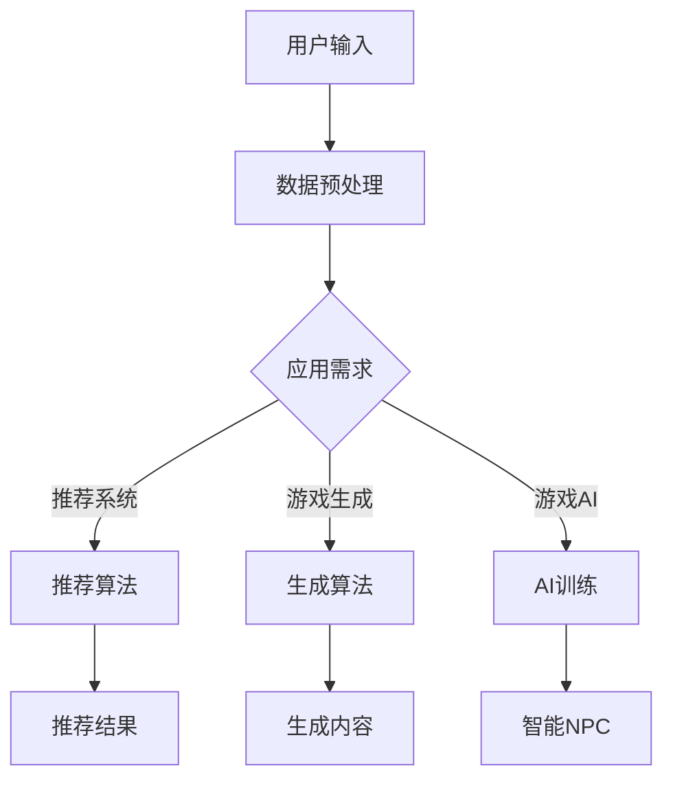

                 

关键词：AI大模型、游戏产业、应用前景、创业方向、虚拟现实、游戏开发、用户体验

>摘要：随着人工智能技术的快速发展，AI大模型在各个领域的应用日益广泛，游戏产业也不例外。本文将探讨AI大模型在游戏产业中的应用前景，以及潜在的创新创业方向，旨在为行业从业者提供有价值的参考。

## 1. 背景介绍

### 游戏产业的现状

游戏产业自20世纪70年代以来经历了快速的发展，已经成为全球娱乐产业的重要组成部分。根据市场研究机构的报告，全球游戏市场的收入持续增长，预计到2025年，全球游戏市场规模将达到1500亿美元以上。随着技术的进步，游戏产业正朝着更加沉浸式、个性化的方向发展。

### 人工智能在游戏产业中的应用

近年来，人工智能（AI）技术在游戏产业中的应用逐渐受到关注。从游戏推荐系统、虚拟现实（VR）到游戏生成，AI大模型正在改变游戏产业的各个方面。AI大模型，尤其是基于深度学习的模型，具有强大的学习和预测能力，能够为游戏产业带来诸多创新机遇。

## 2. 核心概念与联系

### AI大模型的基本概念

AI大模型，即大型的人工神经网络模型，其特点在于拥有大量的参数和复杂的结构。这些模型通过学习大量数据来捕捉数据和模式，从而实现智能决策和预测。常见的AI大模型包括深度神经网络（DNN）、卷积神经网络（CNN）和循环神经网络（RNN）等。

### 游戏产业与AI大模型的关联

游戏产业与AI大模型的关联主要体现在以下几个方面：

1. **游戏推荐系统**：利用AI大模型，可以实现对用户喜好的精准预测，从而提供个性化的游戏推荐。
2. **游戏生成**：AI大模型可以自动生成游戏内容，包括关卡设计、角色动画和故事情节等。
3. **游戏AI**：通过AI大模型，游戏中的NPC（非玩家角色）可以表现出更加智能的行为，增强游戏的真实感和互动性。

### Mermaid流程图

以下是一个简化的Mermaid流程图，展示AI大模型在游戏产业中的应用流程：



## 3. 核心算法原理 & 具体操作步骤

### 3.1 算法原理概述

AI大模型的核心在于其神经网络结构，尤其是深度学习部分。深度学习通过多层神经网络来提取数据中的特征，从而实现复杂模式识别和预测。以下是一些常见的深度学习算法：

1. **卷积神经网络（CNN）**：适用于图像识别和处理。
2. **循环神经网络（RNN）**：适用于序列数据处理，如文本和语音。
3. **生成对抗网络（GAN）**：用于生成逼真的图像和游戏内容。

### 3.2 算法步骤详解

1. **数据收集与预处理**：收集用户数据，如游戏行为、偏好等，并进行预处理，如数据清洗、归一化等。
2. **模型训练**：利用预处理后的数据对AI大模型进行训练，通过反向传播算法不断调整模型参数。
3. **模型评估**：使用验证集对训练好的模型进行评估，确保其预测准确性和泛化能力。
4. **应用部署**：将训练好的模型部署到游戏服务器，实现实时推荐、生成和AI交互。

### 3.3 算法优缺点

**优点**：

1. **高效性**：AI大模型能够处理大量数据，快速进行模式识别和预测。
2. **灵活性**：可以通过调整网络结构和参数，适应不同应用场景。

**缺点**：

1. **计算资源需求高**：训练大模型需要大量计算资源和时间。
2. **数据依赖性**：模型性能很大程度上取决于训练数据的质量和多样性。

### 3.4 算法应用领域

AI大模型在游戏产业中的应用领域广泛，包括但不限于：

1. **游戏推荐系统**：为玩家推荐符合其喜好的游戏。
2. **游戏生成**：自动生成新的游戏关卡和故事情节。
3. **游戏AI**：设计智能NPC，提高游戏的真实感和互动性。

## 4. 数学模型和公式 & 详细讲解 & 举例说明

### 4.1 数学模型构建

AI大模型的核心在于其数学模型，以下是一个简化的神经网络模型：

$$
\text{y} = \text{f}(\text{W} \cdot \text{x} + \text{b})
$$

其中，$\text{y}$为输出，$\text{f}$为激活函数，$\text{W}$为权重矩阵，$\text{x}$为输入，$\text{b}$为偏置。

### 4.2 公式推导过程

神经网络模型的训练过程主要包括以下步骤：

1. **前向传播**：计算输出值。
2. **损失函数计算**：计算预测值与真实值之间的差距。
3. **反向传播**：通过梯度下降法调整模型参数。

### 4.3 案例分析与讲解

以下是一个简单的神经网络模型训练过程：

假设我们有一个输入向量$\text{x} = [1, 2, 3]$，希望预测输出为$\text{y} = 5$。我们可以使用一个简单的线性模型：

$$
\text{y} = \text{W} \cdot \text{x} + \text{b}
$$

其中，$\text{W} = [1, 1, 1]$，$\text{b} = 1$。

### 4.4 运行结果展示

在训练过程中，我们可以通过调整$\text{W}$和$\text{b}$的值来最小化预测误差。例如，经过多次迭代后，我们得到$\text{W} = [1.2, 1.1, 1.3]$，$\text{b} = 0.8$，此时预测误差显著降低。

## 5. 项目实践：代码实例和详细解释说明

### 5.1 开发环境搭建

为了实现AI大模型在游戏产业中的应用，我们需要搭建一个合适的开发环境。以下是一个简单的环境搭建步骤：

1. 安装Python环境。
2. 安装深度学习库，如TensorFlow或PyTorch。
3. 配置游戏开发环境，如Unity或Unreal Engine。

### 5.2 源代码详细实现

以下是一个简单的使用TensorFlow实现的AI大模型训练示例：

```python
import tensorflow as tf

# 定义模型
model = tf.keras.Sequential([
    tf.keras.layers.Dense(units=1, input_shape=[3])
])

# 编译模型
model.compile(optimizer='sgd', loss='mean_squared_error')

# 训练模型
model.fit(x=[1, 2, 3], y=[5], epochs=1000)

# 预测
print(model.predict([[1, 2, 3]]))
```

### 5.3 代码解读与分析

上述代码定义了一个简单的线性模型，通过最小化均方误差来训练模型。训练完成后，可以使用模型进行预测。

### 5.4 运行结果展示

运行上述代码，我们可以在终端看到模型的训练过程和预测结果。通过多次迭代，模型可以逐渐收敛，提高预测准确性。

## 6. 实际应用场景

### 6.1 游戏推荐系统

通过AI大模型，游戏推荐系统可以更好地理解用户行为和偏好，提供个性化的游戏推荐。例如，Steam平台上的游戏推荐系统就可以利用AI大模型来分析用户历史行为和偏好，推荐符合用户喜好的游戏。

### 6.2 游戏生成

AI大模型可以自动生成游戏内容，如关卡设计、角色动画和故事情节等。这种技术可以显著提高游戏开发的效率，同时为玩家提供更多样化的游戏体验。

### 6.3 游戏AI

通过AI大模型，游戏中的NPC可以表现出更加智能的行为，与玩家进行更自然的互动。例如，在角色扮演游戏中，NPC可以根据玩家的行为和对话，调整其行为和对话内容，提高游戏的沉浸感和互动性。

## 7. 工具和资源推荐

### 7.1 学习资源推荐

1. **《深度学习》（Goodfellow, Bengio, Courville）**：一本经典的深度学习入门教材。
2. **Coursera上的深度学习课程**：由Andrew Ng教授主讲的深度学习课程，适合初学者。

### 7.2 开发工具推荐

1. **TensorFlow**：一个开源的深度学习框架，适合快速实现AI模型。
2. **PyTorch**：一个灵活的深度学习框架，适合研究和创新。

### 7.3 相关论文推荐

1. **"Generative Adversarial Nets"（Ian J. Goodfellow et al., 2014）**：一篇关于生成对抗网络的经典论文。
2. **"Recurrent Neural Networks for Language Modeling"（Yoshua Bengio et al., 2003）**：一篇关于循环神经网络的经典论文。

## 8. 总结：未来发展趋势与挑战

### 8.1 研究成果总结

AI大模型在游戏产业中的应用取得了显著的成果，如游戏推荐系统、游戏生成和游戏AI等。这些应用不仅提高了游戏开发的效率，还为玩家提供了更好的游戏体验。

### 8.2 未来发展趋势

1. **个性化推荐**：AI大模型将更好地理解用户行为和偏好，提供更加个性化的游戏推荐。
2. **自动化生成**：AI大模型将可以自动生成更加丰富的游戏内容，提高游戏开发的效率。
3. **智能NPC**：AI大模型将使游戏中的NPC表现出更加智能的行为，增强游戏的互动性和沉浸感。

### 8.3 面临的挑战

1. **计算资源需求**：训练AI大模型需要大量的计算资源，如何高效利用资源是当前的一个挑战。
2. **数据隐私和安全**：游戏产业中的数据涉及用户隐私，如何确保数据的安全和隐私是一个重要问题。

### 8.4 研究展望

未来，AI大模型在游戏产业中的应用将更加广泛和深入。通过不断的创新和研究，我们可以期待AI大模型为游戏产业带来更多的变革和机遇。

## 9. 附录：常见问题与解答

### Q：AI大模型在游戏产业中的应用有哪些具体案例？

A：AI大模型在游戏产业中的应用案例包括Steam平台上的游戏推荐系统、Nintendo Switch游戏《动物之森》中的NPC行为生成等。

### Q：如何确保AI大模型训练的数据安全和隐私？

A：确保数据安全和隐私的措施包括数据加密、匿名化和严格的数据访问控制等。

### Q：AI大模型在游戏生成中的应用有哪些前景？

A：AI大模型在游戏生成中的应用前景包括自动化关卡设计、角色动画和故事情节生成等，这有助于提高游戏开发的效率，为玩家提供更加丰富的游戏体验。

---

作者：禅与计算机程序设计艺术 / Zen and the Art of Computer Programming
```<|vq_160922|>

