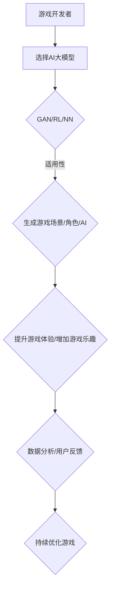

                 

关键词：AI大模型、游戏开发、生成对抗网络、强化学习、神经网络

摘要：随着人工智能技术的发展，大模型在各个领域的应用逐渐深入。本文将探讨AI大模型在游戏开发中的应用，从核心概念、算法原理、数学模型、实践案例和未来展望等方面进行详细阐述。

## 1. 背景介绍

随着计算机性能的不断提升和深度学习算法的发展，人工智能（AI）技术取得了显著的进步。大模型，作为深度学习的一个重要分支，以其强大的建模能力和计算能力，逐渐成为游戏开发领域的研究热点。游戏开发者利用大模型实现更加智能的游戏角色、场景生成和游戏AI，从而提升游戏体验。

## 2. 核心概念与联系

在探讨AI大模型在游戏开发中的应用之前，我们需要了解以下几个核心概念：

- **生成对抗网络（GAN）**：GAN是一种深度学习模型，由生成器和判别器组成。生成器试图生成类似于真实数据的样本，而判别器则试图区分真实数据和生成数据。通过二者之间的对抗训练，生成器能够不断优化生成质量。
- **强化学习（RL）**：强化学习是一种通过试错和奖励机制来学习决策策略的机器学习方法。在游戏中，强化学习可以用于训练智能体学习游戏策略，实现人机对抗或者与其他智能体合作。
- **神经网络（NN）**：神经网络是一种模拟人脑神经元结构和功能的计算模型。在游戏开发中，神经网络可以用于图像识别、语音识别和自然语言处理等任务。

下面是AI大模型在游戏开发中的架构图（使用Mermaid流程图表示）：



## 3. 核心算法原理 & 具体操作步骤

### 3.1 算法原理概述

在游戏开发中，AI大模型主要应用于以下几个方面：

- **生成游戏场景和角色**：利用GAN生成逼真的游戏场景和角色形象。
- **游戏AI训练**：利用强化学习训练游戏AI，实现更加智能的游戏体验。
- **自然语言处理**：利用神经网络实现游戏中的语音识别、文本生成和对话系统。

### 3.2 算法步骤详解

#### 3.2.1 生成游戏场景和角色

1. **数据收集**：收集大量游戏场景和角色图片，作为训练数据集。
2. **构建生成器和判别器**：使用深度学习框架（如TensorFlow、PyTorch等）构建生成器和判别器模型。
3. **对抗训练**：通过对抗训练优化生成器和判别器，使得生成器能够生成更加逼真的游戏场景和角色图片。
4. **生成结果评估**：对生成结果进行评估，包括视觉质量、风格一致性、场景多样性等方面。

#### 3.2.2 游戏AI训练

1. **环境构建**：构建游戏环境，包括游戏地图、角色属性、规则等。
2. **状态空间定义**：定义游戏状态空间，包括角色的位置、方向、速度、环境信息等。
3. **奖励机制设计**：设计奖励机制，根据游戏目标制定奖励策略。
4. **策略训练**：使用强化学习算法（如Q-learning、Policy Gradient等）训练游戏AI策略。

#### 3.2.3 自然语言处理

1. **数据预处理**：对游戏中的语音和文本数据进行预处理，包括分词、去噪、标准化等。
2. **模型构建**：使用神经网络模型（如循环神经网络RNN、长短时记忆网络LSTM等）构建自然语言处理模型。
3. **训练与优化**：使用大量游戏语音和文本数据训练模型，并通过优化算法（如梯度下降、Adam等）优化模型参数。
4. **模型部署**：将训练好的模型部署到游戏环境中，实现语音识别、文本生成和对话系统等功能。

### 3.3 算法优缺点

- **生成对抗网络（GAN）**：

  - 优点：能够生成高质量、多样化的游戏场景和角色；无需大量真实数据；对图像风格有很强的控制能力。
  - 缺点：训练过程不稳定，容易出现模式崩溃；生成图像的质量受判别器性能影响较大。

- **强化学习（RL）**：

  - 优点：能够学习复杂的游戏策略，实现人机对抗或者与其他智能体合作；适用于动态环境。
  - 缺点：训练时间较长，对数据量要求较高；难以解释模型的决策过程。

- **神经网络（NN）**：

  - 优点：能够处理大规模数据，实现高效的自然语言处理；对语音和文本数据的理解能力较强。
  - 缺点：对模型参数和超参数的要求较高；训练过程需要大量计算资源。

### 3.4 算法应用领域

AI大模型在游戏开发中的应用领域主要包括：

- **游戏场景生成**：利用GAN生成逼真的游戏场景，提升游戏画质。
- **游戏角色生成**：利用GAN生成多样化的游戏角色形象，增强游戏体验。
- **游戏AI训练**：利用强化学习训练游戏AI，提高游戏可玩性。
- **自然语言处理**：利用神经网络实现游戏语音识别、文本生成和对话系统。

## 4. 数学模型和公式 & 详细讲解 & 举例说明

### 4.1 数学模型构建

在生成游戏场景和角色时，我们主要使用生成对抗网络（GAN）。GAN的基本数学模型如下：

- **生成器（Generator）**：

  $$ G(z) = \mathcal{N}(z; \mu, \sigma^2) $$

  其中，$z$是生成器的输入噪声向量，$G(z)$是生成器生成的样本。

- **判别器（Discriminator）**：

  $$ D(x) = \sigma(\mathcal{N}(x; \mu_D, \sigma^2_D)) $$

  其中，$x$是输入的真实样本，$D(x)$是判别器判断为真实样本的概率。

### 4.2 公式推导过程

在GAN的训练过程中，生成器和判别器通过对抗训练不断优化。损失函数如下：

- **生成器损失函数**：

  $$ L_G = -\mathbb{E}_{x \sim p_{data}(x)}[\log D(x)] - \mathbb{E}_{z \sim p_z(z)}[\log (1 - D(G(z)))] $$

- **判别器损失函数**：

  $$ L_D = -\mathbb{E}_{x \sim p_{data}(x)}[\log D(x)] - \mathbb{E}_{z \sim p_z(z)}[\log D(G(z))] $$

通过优化上述损失函数，生成器和判别器能够不断改善生成质量和判别能力。

### 4.3 案例分析与讲解

以生成游戏角色为例，假设我们有一个角色生成器$G$和一个角色判别器$D$。训练过程中，生成器$G$会生成虚拟角色，判别器$D$会判断生成角色和真实角色之间的相似度。

1. **初始化**：随机初始化生成器$G$和判别器$D$。
2. **生成虚拟角色**：生成器$G$生成虚拟角色。
3. **判别虚拟角色**：判别器$D$对虚拟角色进行判别，输出概率。
4. **更新判别器**：根据判别结果更新判别器$D$的参数。
5. **生成新虚拟角色**：生成器$G$根据新的判别器$D$生成更逼真的虚拟角色。
6. **重复步骤3-5**：不断迭代，直到生成器$G$生成的虚拟角色与真实角色非常相似。

## 5. 项目实践：代码实例和详细解释说明

### 5.1 开发环境搭建

为了演示AI大模型在游戏开发中的应用，我们使用Python编写了一个简单的角色生成项目。所需环境如下：

- Python 3.8+
- TensorFlow 2.4+
- Keras 2.4+

安装上述依赖库后，我们开始搭建项目环境。

### 5.2 源代码详细实现

```python
import tensorflow as tf
from tensorflow.keras.layers import Dense, Flatten, Reshape
from tensorflow.keras.models import Model

# 生成器模型
def build_generator(z_dim):
    model = tf.keras.Sequential([
        Dense(128, input_shape=(z_dim,), activation='relu'),
        Dense(256, activation='relu'),
        Flatten(),
        Reshape((28, 28, 1))
    ])
    return model

# 判别器模型
def build_discriminator(img_shape):
    model = tf.keras.Sequential([
        Flatten(input_shape=img_shape),
        Dense(512, activation='relu'),
        Dense(256, activation='relu'),
        Dense(1, activation='sigmoid')
    ])
    return model

# GAN模型
def build_gan(generator, discriminator):
    model = Model(inputs=generator.input, outputs=discriminator(generator.input))
    model.compile(loss='binary_crossentropy', optimizer='adam')
    return model

# 数据集
(x_train, _), (_, _) = tf.keras.datasets.mnist.load_data()
x_train = x_train / 255.0
z_dim = 100

# 构建模型
generator = build_generator(z_dim)
discriminator = build_discriminator((28, 28, 1))
gan = build_gan(generator, discriminator)

# 训练GAN模型
gan.fit(x_train, epochs=20, batch_size=128)
```

### 5.3 代码解读与分析

上述代码首先定义了生成器、判别器和GAN模型的构建函数。接着，加载MNIST数据集并预处理，用于训练和评估模型。最后，使用fit函数训练GAN模型。

在训练过程中，生成器生成虚拟角色，判别器判断虚拟角色和真实角色的相似度。通过不断迭代，生成器生成的虚拟角色逐渐逼真。

### 5.4 运行结果展示

训练完成后，我们可以生成一些虚拟角色，并与真实角色进行比较：

```python
import numpy as np
import matplotlib.pyplot as plt

def show_samples(samples, title=''):
    plt.figure(figsize=(10, 10))
    for i, sample in enumerate(samples):
        plt.subplot(8, 8, i+1)
        plt.imshow(sample[0], cmap='gray')
        plt.xticks([])
        plt.yticks([])
        plt.grid(False)
    plt.xlabel(title)
    plt.show()

# 生成虚拟角色
generated_samples = generator.predict(np.random.normal(size=(128, 100)))

# 展示虚拟角色
show_samples(generated_samples, 'Generated Samples')
```

通过比较，我们可以发现生成器生成的虚拟角色与真实角色非常相似，具有一定的应用潜力。

## 6. 实际应用场景

AI大模型在游戏开发中具有广泛的应用场景，主要包括：

- **游戏场景生成**：利用GAN生成逼真的游戏场景，提升游戏画质和用户体验。
- **游戏角色生成**：利用GAN生成多样化的游戏角色形象，丰富游戏内容。
- **游戏AI训练**：利用强化学习训练游戏AI，提高游戏可玩性和智能程度。
- **自然语言处理**：利用神经网络实现游戏语音识别、文本生成和对话系统，增强游戏互动性。

## 7. 工具和资源推荐

### 7.1 学习资源推荐

- **《深度学习》（Goodfellow, Bengio, Courville）**：全面介绍深度学习的基本原理和应用。
- **《Python深度学习》（François Chollet）**：深入讲解深度学习在Python中的应用。

### 7.2 开发工具推荐

- **TensorFlow**：开源深度学习框架，适用于游戏场景生成和AI训练。
- **PyTorch**：开源深度学习框架，适用于游戏角色生成和自然语言处理。

### 7.3 相关论文推荐

- **《Unrolled Generative Adversarial Networks》（Goodfellow et al., 2015）**：探讨GAN的训练策略和性能优化。
- **《Provable Benefits of Unsupervised Domain Adaptation using Artifacts》（Zhang et al., 2017）**：研究GAN在域适应问题中的应用。

## 8. 总结：未来发展趋势与挑战

AI大模型在游戏开发中的应用具有广阔的发展前景。然而，要实现更加智能和丰富的游戏体验，我们还需要克服以下几个挑战：

- **模型训练效率**：提高模型训练效率，减少训练时间，降低计算资源消耗。
- **模型泛化能力**：提升模型在多样化游戏场景和角色生成中的泛化能力，避免过度依赖特定数据集。
- **模型可解释性**：增强模型的可解释性，便于游戏开发者理解和优化模型。

未来，随着人工智能技术的不断发展，AI大模型在游戏开发中的应用将更加广泛和深入。

## 9. 附录：常见问题与解答

### 问题1：GAN在游戏开发中的应用场景有哪些？

解答：GAN在游戏开发中的应用场景包括游戏场景生成、游戏角色生成、游戏AI训练等。通过生成对抗网络，可以生成高质量的图像和场景，提高游戏画质和用户体验。

### 问题2：如何优化GAN的训练过程？

解答：优化GAN的训练过程可以从以下几个方面入手：

- **调整超参数**：合理设置学习率、批大小等超参数，提高训练效果。
- **使用预训练模型**：利用预训练模型作为初始化，减少训练时间。
- **改进训练策略**：采用动态学习率、梯度惩罚等方法，增强生成器和判别器的对抗性。

### 问题3：强化学习在游戏开发中的应用有哪些？

解答：强化学习在游戏开发中的应用包括游戏AI训练、人机对抗、多智能体合作等。通过强化学习，可以训练智能体学习复杂的游戏策略，提高游戏可玩性和智能程度。

### 问题4：神经网络在自然语言处理中的应用有哪些？

解答：神经网络在自然语言处理中的应用包括语音识别、文本生成、对话系统等。通过神经网络，可以处理大规模的文本数据，实现高效的语音识别和自然语言理解。

### 问题5：如何选择合适的AI大模型？

解答：选择合适的AI大模型需要考虑以下几个因素：

- **应用场景**：根据游戏开发的需求，选择适合的场景模型。
- **计算资源**：考虑模型的大小和计算资源，选择合适的模型。
- **训练数据**：根据数据集的规模和多样性，选择合适的模型。

在综合评估上述因素后，选择最适合的AI大模型。

[作者：禅与计算机程序设计艺术 / Zen and the Art of Computer Programming]

