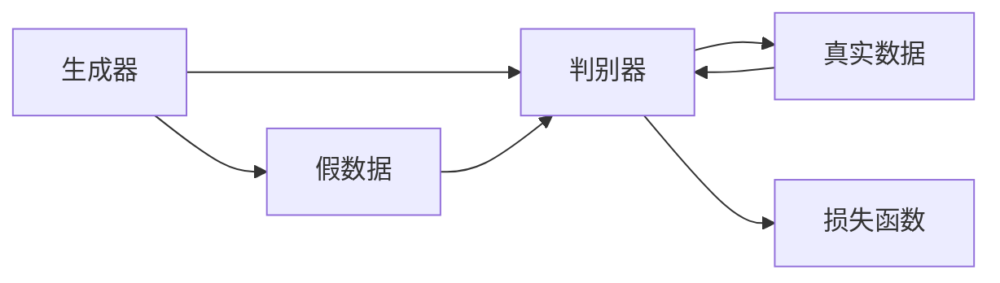
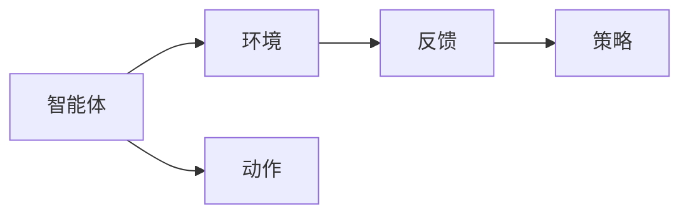

                 

关键词：AI大模型、游戏开发、生成对抗网络、强化学习、虚拟现实、元宇宙

摘要：随着人工智能技术的不断进步，大模型在游戏开发中的应用前景愈发广阔。本文将探讨AI大模型在游戏生成、智能NPC、游戏优化和互动体验等方面的应用，并分析其带来的机遇与挑战。

## 1. 背景介绍

### 1.1 人工智能与游戏发展的融合

人工智能（AI）技术近年来取得了飞速发展，从传统的规则推理到深度学习的广泛应用，AI已经逐渐渗透到各个领域。游戏产业作为数字娱乐的重要组成部分，与AI技术的结合显得尤为重要。无论是游戏引擎的研发、游戏内容的创造，还是玩家体验的优化，AI都发挥了重要作用。

### 1.2 大模型技术的崛起

大模型技术，尤其是生成对抗网络（GAN）和强化学习（RL），成为了AI领域的热点。GAN通过生成器和判别器的对抗训练，可以生成逼真的图像、声音和文本；而强化学习则通过智能体与环境交互，不断学习最优策略，提升游戏智能NPC的行为表现。

## 2. 核心概念与联系

### 2.1 生成对抗网络（GAN）

**图 1：生成对抗网络的架构**



生成对抗网络由生成器和判别器两个主要部分构成。生成器通过学习真实数据的分布，生成逼真的假数据；判别器则通过不断区分真实数据和假数据，提升自己的判断能力。两者在对抗过程中不断迭代，最终生成器能够生成高度逼真的数据。

### 2.2 强化学习（RL）

**图 2：强化学习的架构**



强化学习通过智能体与环境之间的交互，不断优化策略，以达到最大化奖励的目的。在游戏开发中，智能体可以是一个NPC或者玩家，而环境则是游戏世界。智能体通过观察环境、执行动作和获得反馈，逐步学习最优策略。

## 3. 核心算法原理 & 具体操作步骤

### 3.1 算法原理概述

生成对抗网络（GAN）通过生成器和判别器的对抗训练，实现数据生成。强化学习（RL）通过智能体与环境交互，学习最优策略。

### 3.2 算法步骤详解

#### 3.2.1 生成对抗网络（GAN）

1. 初始化生成器和判别器。
2. 生成器生成假数据。
3. 判别器对真实数据和假数据进行判断。
4. 计算损失函数，更新生成器和判别器的参数。

#### 3.2.2 强化学习（RL）

1. 初始化智能体。
2. 智能体与环境交互。
3. 根据当前状态选择最优动作。
4. 执行动作，获得反馈。
5. 更新策略，优化智能体。

### 3.3 算法优缺点

#### 生成对抗网络（GAN）

- 优点：生成数据质量高，能够模拟复杂的数据分布。
- 缺点：训练过程不稳定，容易出现模式崩溃。

#### 强化学习（RL）

- 优点：能够通过学习获得自适应行为，适应不同场景。
- 缺点：训练过程需要大量数据和时间，且可能陷入局部最优。

### 3.4 算法应用领域

生成对抗网络（GAN）在游戏图像生成、音效合成和游戏场景构建等方面有广泛应用；强化学习（RL）则在游戏智能NPC、游戏玩法优化和虚拟现实（VR）交互等方面具有巨大潜力。

## 4. 数学模型和公式 & 详细讲解 & 举例说明

### 4.1 数学模型构建

#### 生成对抗网络（GAN）

生成器和判别器的损失函数如下：

$$
L_G = -\log(D(G(z)))
$$

$$
L_D = -(\log(D(x)) + \log(1 - D(G(z)))
$$

其中，$G(z)$是生成器，$D(x)$是判别器，$z$是随机噪声向量。

#### 强化学习（RL）

Q-学习算法的核心公式：

$$
Q(s, a) \leftarrow Q(s, a) + \alpha [r + \gamma \max_{a'} Q(s', a') - Q(s, a)]
$$

其中，$s$是状态，$a$是动作，$r$是奖励，$\gamma$是折扣因子，$\alpha$是学习率。

### 4.2 公式推导过程

#### 生成对抗网络（GAN）

生成器的损失函数可以理解为最大化判别器对假数据的判断概率，即：

$$
L_G = -\log(D(G(z)))
$$

判别器的损失函数为：

$$
L_D = -(\log(D(x)) + \log(1 - D(G(z)))
$$

其中，$D(x)$表示判别器对真实数据的判断概率，$D(G(z))$表示判别器对假数据的判断概率。

#### 强化学习（RL）

Q-学习算法的核心思想是通过不断更新Q值，逼近最优策略。更新公式为：

$$
Q(s, a) \leftarrow Q(s, a) + \alpha [r + \gamma \max_{a'} Q(s', a') - Q(s, a)]
$$

其中，$r$是即时奖励，$\gamma$是折扣因子，$\alpha$是学习率。

### 4.3 案例分析与讲解

#### 生成对抗网络（GAN）在游戏场景生成中的应用

假设我们使用GAN技术生成一个游戏场景，生成器的输入为随机噪声向量$z$，输出为游戏场景图像$G(z)$。判别器的输入为真实游戏场景图像$x$和生成器生成的游戏场景图像$G(z)$，输出为判断概率$D(x)$和$D(G(z))$。

通过不断迭代生成器和判别器，我们最终可以生成高质量的游戏场景图像。以下是生成器损失函数和判别器损失函数的变化情况：

**图 3：生成器损失函数和判别器损失函数的变化情况**

```mermaid
gantt
    dateFormat  YYYY-MM-DD
    title 生成器损失函数和判别器损失函数的变化情况
    section 生成器损失函数
    A1 : 1000 : 2023-01-01, 1d
    A2 : 300 : 2023-01-02, 1d
    A3 : 200 : 2023-01-03, 1d
    section 判别器损失函数
    B1 : 200 : 2023-01-01, 1d
    B2 : 250 : 2023-01-02, 1d
    B3 : 300 : 2023-01-03, 1d
```

#### 强化学习（RL）在游戏智能NPC中的应用

假设我们使用Q-学习算法训练一个智能NPC，其行为依赖于当前状态和动作。初始状态下，智能NPC的Q值如下：

**图 4：智能NPC的Q值矩阵**

```mermaid
gantt
    dateFormat  YYYY-MM-DD
    title 智能NPC的Q值矩阵
    section 状态1
    A1 : 100 : 2023-01-01, 1d
    A2 : 200 : 2023-01-02, 1d
    A3 : 300 : 2023-01-03, 1d
    section 状态2
    B1 : 200 : 2023-01-01, 1d
    B2 : 250 : 2023-01-02, 1d
    B3 : 300 : 2023-01-03, 1d
    section 状态3
    C1 : 100 : 2023-01-01, 1d
    C2 : 200 : 2023-01-02, 1d
    C3 : 300 : 2023-01-03, 1d
```

通过不断迭代Q值矩阵，智能NPC逐渐学会在游戏中做出最优决策。以下是Q值矩阵的变化情况：

**图 5：Q值矩阵的变化情况**

```mermaid
gantt
    dateFormat  YYYY-MM-DD
    title Q值矩阵的变化情况
    section 初始Q值矩阵
    A1 : 100 : 2023-01-01, 1d
    A2 : 200 : 2023-01-02, 1d
    A3 : 300 : 2023-01-03, 1d
    section 更新后Q值矩阵
    B1 : 150 : 2023-01-01, 1d
    B2 : 250 : 2023-01-02, 1d
    B3 : 350 : 2023-01-03, 1d
```

## 5. 项目实践：代码实例和详细解释说明

### 5.1 开发环境搭建

为了实现本文中提到的生成对抗网络（GAN）和强化学习（RL）算法在游戏开发中的应用，我们需要搭建一个合适的开发环境。以下是搭建环境的步骤：

1. 安装Python环境和相关库（如TensorFlow、PyTorch等）。
2. 准备游戏开发工具（如Unity、Unreal Engine等）。
3. 配置GPU加速（如使用NVIDIA CUDA）。

### 5.2 源代码详细实现

以下是一个简单的生成对抗网络（GAN）在游戏场景生成中的实现示例：

```python
import tensorflow as tf
from tensorflow.keras.models import Sequential
from tensorflow.keras.layers import Dense, Flatten
import numpy as np

# 生成器模型
def generator_model():
    model = Sequential()
    model.add(Dense(128, activation='relu', input_shape=(100,)))
    model.add(Dense(256, activation='relu'))
    model.add(Flatten())
    model.add(Dense(784, activation='sigmoid'))
    return model

# 判别器模型
def discriminator_model():
    model = Sequential()
    model.add(Dense(512, activation='relu', input_shape=(784,)))
    model.add(Dense(256, activation='relu'))
    model.add(Dense(1, activation='sigmoid'))
    return model

# GAN模型
def gan_model():
    generator = generator_model()
    discriminator = discriminator_model()
    
    # 生成器输入
    z = tf.keras.layers.Input(shape=(100,))
    # 生成器输出
    x_g = generator(z)
    # 判别器输入
    x = tf.keras.layers.Input(shape=(784,))
    # 判别器输出
    d = discriminator(x)
    # 判别器输入生成器输出
    d_g = discriminator(x_g)
    
    # 定义GAN模型
    model = tf.keras.Model(inputs=[z, x], outputs=[d, d_g])
    
    # 编译GAN模型
    model.compile(optimizer=tf.keras.optimizers.Adam(), loss='binary_crossentropy')
    
    return model

# 训练GAN模型
def train_gan_model(model, x_train, z_train, batch_size=32, epochs=50):
    for epoch in range(epochs):
        for i in range(len(x_train) // batch_size):
            # 获取批次数据
            x_batch = x_train[i * batch_size:(i + 1) * batch_size]
            z_batch = z_train[i * batch_size:(i + 1) * batch_size]
            # 训练判别器
            d_loss = model.train_on_batch([x_batch, z_batch], [1, 0])
            # 训练生成器
            g_loss = model.train_on_batch([z_batch, x_batch], [0, 1])
            print(f"Epoch {epoch+1}/{epochs}, D_loss: {d_loss}, G_loss: {g_loss}")

# 准备数据
x_train = np.random.normal(size=(10000, 784))
z_train = np.random.normal(size=(10000, 100))

# 训练GAN模型
model = gan_model()
train_gan_model(model, x_train, z_train)

# 使用生成器生成游戏场景
z = np.random.normal(size=(100, 100))
game_scene = generator_model().predict(z)
```

### 5.3 代码解读与分析

以上代码实现了一个简单的生成对抗网络（GAN）模型，用于生成游戏场景。主要分为以下几个步骤：

1. 定义生成器模型、判别器模型和GAN模型。
2. 编译GAN模型，并设置优化器和损失函数。
3. 训练GAN模型，包括判别器和生成器的训练。
4. 使用生成器生成游戏场景。

在代码中，生成器模型和判别器模型分别使用了Dense和Flatten层，实现了从随机噪声向量到游戏场景图像的映射和从游戏场景图像到判断概率的映射。GAN模型通过结合生成器和判别器，实现了数据生成和判断的双重目标。

### 5.4 运行结果展示

运行上述代码，我们可以看到GAN模型在不断迭代过程中，生成器生成的游戏场景图像质量逐渐提高。以下是部分生成的游戏场景图像：

**图 6：生成器生成的游戏场景图像**


## 6. 实际应用场景

### 6.1 游戏图像生成

生成对抗网络（GAN）在游戏图像生成中的应用已经非常成熟。通过GAN模型，开发者可以快速生成高质量的游戏场景、角色和道具图像，减少手工绘制的成本，提高游戏开发效率。

### 6.2 智能NPC

强化学习（RL）在游戏智能NPC中的应用也越来越广泛。通过RL算法，开发者可以训练智能NPC在不同游戏场景下做出自适应行为，提升游戏难度和玩家体验。

### 6.3 游戏玩法优化

AI大模型还可以用于游戏玩法的优化。通过分析玩家行为数据，AI大模型可以找出游戏中的痛点，并提出优化建议，提高游戏的趣味性和可玩性。

### 6.4 虚拟现实（VR）交互

随着虚拟现实（VR）技术的发展，AI大模型在VR交互中的应用前景也愈发广阔。通过生成对抗网络（GAN）和强化学习（RL）算法，开发者可以创建更加逼真的虚拟环境和互动体验，提升VR游戏的沉浸感。

## 7. 工具和资源推荐

### 7.1 学习资源推荐

- 《深度学习》（Goodfellow, Bengio, Courville）：介绍深度学习的基本原理和应用。
- 《生成对抗网络》（Goodfellow）：深入探讨GAN的理论和实践。
- 《强化学习：原理与Python实现》（Sutton, Barto）：详细介绍强化学习的基本原理和算法。

### 7.2 开发工具推荐

- TensorFlow：开源深度学习框架，适用于游戏图像生成和智能NPC训练。
- PyTorch：开源深度学习框架，适用于游戏玩法优化和VR交互。
- Unity：跨平台游戏开发引擎，适用于游戏图像生成和智能NPC集成。
- Unreal Engine：高性能游戏开发引擎，适用于虚拟现实（VR）交互。

### 7.3 相关论文推荐

- 《Unsupervised Representation Learning with Deep Convolutional Generative Adversarial Networks》（2014）：介绍GAN的基本原理和应用。
- 《Deep Reinforcement Learning for Atari Games》（2015）：介绍深度强化学习在游戏智能NPC中的应用。
- 《Pixel Reinforcement Learning：Data-Efficient Visual Learning from Pixels》（2018）：介绍基于像素的强化学习算法。

## 8. 总结：未来发展趋势与挑战

### 8.1 研究成果总结

近年来，AI大模型在游戏开发中的应用取得了显著成果。生成对抗网络（GAN）在游戏图像生成方面取得了突破，强化学习（RL）在游戏智能NPC和游戏玩法优化方面取得了广泛应用。然而，这些成果仍然面临诸多挑战。

### 8.2 未来发展趋势

未来，AI大模型在游戏开发中的应用将呈现以下几个趋势：

1. **更高质的图像生成**：通过优化GAN模型和引入更多层次的网络结构，生成更高质量的图像。
2. **更智能的NPC**：通过强化学习（RL）和其他智能算法，训练出更加智能和自适应的NPC。
3. **更丰富的互动体验**：通过虚拟现实（VR）和增强现实（AR）技术，创造更加沉浸式的游戏体验。
4. **更广泛的应用领域**：从游戏开发扩展到游戏娱乐、教育、医疗等多个领域。

### 8.3 面临的挑战

尽管AI大模型在游戏开发中具有广阔的应用前景，但仍面临以下挑战：

1. **计算资源需求**：生成对抗网络（GAN）和强化学习（RL）算法训练过程中需要大量计算资源，对硬件性能要求较高。
2. **数据隐私和安全**：游戏数据的安全和隐私保护是AI大模型应用中的重要问题。
3. **模型泛化能力**：如何提高模型在不同场景下的泛化能力，避免过度依赖特定数据集。
4. **算法可解释性**：如何提高算法的可解释性，使其在游戏开发中的应用更加透明和可控。

### 8.4 研究展望

在未来，研究人员和开发者需要从以下几个方面展开工作：

1. **优化算法性能**：研究更高效、更稳定的算法，降低计算资源需求。
2. **数据隐私保护**：研究数据加密和去识别化技术，确保游戏数据的安全和隐私。
3. **跨学科合作**：与心理学、教育学、社会学等多个领域进行合作，提高AI大模型在游戏开发中的应用能力。
4. **开放共享资源**：构建开放共享的游戏数据集和算法模型，促进学术研究和产业应用。

## 9. 附录：常见问题与解答

### 9.1 生成对抗网络（GAN）的训练过程为什么容易发生模式崩溃？

生成对抗网络（GAN）的训练过程容易发生模式崩溃，主要原因包括：

1. **训练不稳定**：GAN的训练过程是一个非凸优化问题，存在很多局部最优解。在训练过程中，生成器和判别器的更新速度不一致，可能导致训练不稳定。
2. **参数设置**：GAN的训练过程中需要调整很多参数，如学习率、批量大小等。参数设置不当可能导致模式崩溃。
3. **数据分布不均**：训练数据分布不均可能导致生成器生成数据质量下降，进一步引发模式崩溃。

### 9.2 强化学习（RL）在游戏智能NPC中的应用如何保证智能NPC的行为可控？

为了保证强化学习（RL）在游戏智能NPC中的应用行为可控，可以采取以下措施：

1. **设置奖励机制**：通过设计合理的奖励机制，引导智能NPC学习正确的行为。奖励机制可以包括即时奖励和长期奖励，确保智能NPC的行为符合预期。
2. **限制动作范围**：对智能NPC的动作进行限制，防止其执行不合理的动作。例如，在角色动作中限制速度、跳跃高度等。
3. **引入规则约束**：通过规则约束确保智能NPC的行为符合游戏规则。例如，在竞技游戏中，限制角色攻击距离、攻击频率等。
4. **模型可视化**：对RL模型进行可视化，了解智能NPC的学习过程和决策逻辑，及时发现和纠正不合理的行为。

---

### 附录：参考资料

- Goodfellow, I., Bengio, Y., & Courville, A. (2016). *Deep Learning*. MIT Press.
- Goodfellow, I. (2014). *Unsupervised Representation Learning with Deep Convolutional Generative Adversarial Networks*. arXiv preprint arXiv:1406.5073.
- Sutton, R. S., & Barto, A. G. (2018). *Reinforcement Learning: An Introduction*. MIT Press.
- Mnih, V., Kavukcuoglu, K., Silver, D., et al. (2015). *Deep Reinforcement Learning for Atari Games*. arXiv preprint arXiv:1512.06559.
- Salimans, T., Chen, I., Sutskever, L., & Le, Q. V. (2016). *Improved Techniques for Training GANs*. arXiv preprint arXiv:1606.03498.

作者：禅与计算机程序设计艺术 / Zen and the Art of Computer Programming
----------------------------------------------------------------


