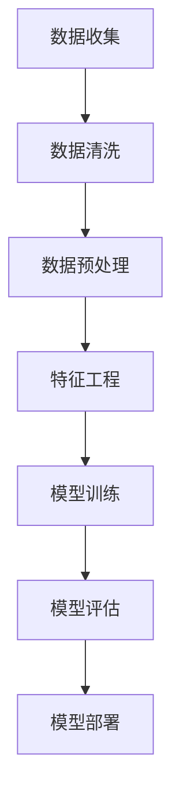

                 

在当今信息爆炸的时代，用户行为预测已成为许多企业提升服务质量和用户体验的关键手段。人工智能（AI）大模型凭借其强大的数据处理和分析能力，在用户行为预测领域展现出了巨大的潜力。本文将深入探讨AI大模型在用户行为预测中的应用，从核心概念、算法原理到实际操作，为读者提供一个全面的技术解读。

## 关键词

- 用户行为预测
- 人工智能大模型
- 深度学习
- 数据分析
- 机器学习

## 摘要

本文将详细探讨AI大模型在用户行为预测中的应用。首先，我们将介绍用户行为预测的背景和重要性。接着，我们将深入解析AI大模型的核心概念和技术原理。随后，文章将讨论AI大模型在用户行为预测中的具体算法和应用领域，并列举一些实际案例。最后，我们将展望AI大模型在用户行为预测中的未来发展趋势和挑战。

## 1. 背景介绍

用户行为预测是指通过分析用户的历史行为数据，预测用户未来的行为倾向。这一技术在电商、金融、医疗、社交等多个领域都有广泛应用。例如，电商企业可以通过用户行为预测来推荐商品，提高销售额；金融企业可以通过预测用户的风险行为，防范欺诈；医疗机构可以通过预测患者的就医行为，优化医疗服务。

随着互联网和大数据技术的发展，用户行为数据量呈爆炸式增长。传统的数据处理和分析方法已经无法满足需求，需要引入更为先进的人工智能技术。AI大模型以其强大的数据处理和分析能力，成为用户行为预测领域的重要工具。

## 2. 核心概念与联系

### 2.1. AI大模型

AI大模型是指通过大规模数据训练得到的复杂神经网络模型。这些模型通常包含数十亿个参数，具有强大的学习和预测能力。常见的AI大模型包括深度神经网络（DNN）、卷积神经网络（CNN）、循环神经网络（RNN）和生成对抗网络（GAN）等。

### 2.2. 用户行为数据

用户行为数据是指用户在使用互联网服务或应用程序过程中产生的数据。这些数据包括浏览记录、购买行为、评论、分享等。用户行为数据是用户行为预测的重要基础。

### 2.3. 数据处理与分析

数据处理与分析是用户行为预测的关键步骤。通过数据清洗、数据预处理和特征工程，可以从原始数据中提取出有用的信息，用于训练AI大模型。

### 2.4. Mermaid 流程图



## 3. 核心算法原理 & 具体操作步骤

### 3.1. 算法原理概述

用户行为预测的核心算法是深度学习。深度学习通过多层神经网络对数据进行建模，能够自动提取数据中的特征，实现用户行为的预测。

### 3.2. 算法步骤详解

1. 数据收集：从各个渠道收集用户行为数据。
2. 数据清洗：去除无效数据，处理缺失值。
3. 数据预处理：将数据转换为适合模型训练的格式。
4. 特征工程：从原始数据中提取有用的特征。
5. 模型训练：使用训练数据训练深度学习模型。
6. 模型评估：使用验证数据评估模型性能。
7. 模型部署：将训练好的模型部署到实际应用中。

### 3.3. 算法优缺点

**优点：**
- 强大的学习能力和自适应能力。
- 能够自动提取数据中的特征。

**缺点：**
- 对计算资源要求高。
- 需要大量标注数据。

### 3.4. 算法应用领域

用户行为预测算法广泛应用于电商、金融、医疗、社交等多个领域。例如，电商企业可以通过预测用户购买行为，提高销售额；金融企业可以通过预测用户的风险行为，防范欺诈；医疗机构可以通过预测患者就医行为，优化医疗服务。

## 4. 数学模型和公式 & 详细讲解 & 举例说明

### 4.1. 数学模型构建

用户行为预测的数学模型通常是一个多分类问题，可以使用逻辑回归、SVM、神经网络等模型。以下是逻辑回归模型的数学公式：

$$
P(y=k|X) = \frac{e^{\beta_0 + \sum_{i=1}^{n}\beta_i x_i}}{1 + e^{\beta_0 + \sum_{i=1}^{n}\beta_i x_i}}
$$

其中，$X$ 是特征向量，$y$ 是标签，$k$ 是类别，$\beta_0$ 是截距，$\beta_i$ 是特征系数。

### 4.2. 公式推导过程

逻辑回归模型是一种广义线性模型，其基本原理是通过线性变换将输入特征映射到概率空间。具体推导过程如下：

$$
\ln\left(\frac{P(y=k|X)}{1-P(y=k|X)}\right) = \beta_0 + \sum_{i=1}^{n}\beta_i x_i
$$

通过对数变换，将概率比转化为线性形式。

### 4.3. 案例分析与讲解

假设我们要预测一个用户是否会购买某商品，特征包括用户的年龄、收入、浏览记录等。使用逻辑回归模型进行预测，具体步骤如下：

1. 数据收集：收集用户行为数据，包括用户的年龄、收入、浏览记录等。
2. 数据预处理：将数据进行标准化处理，使得不同特征的量纲一致。
3. 特征工程：从原始数据中提取有用的特征，例如用户的年龄可以划分为不同的年龄段，收入可以划分为不同的区间。
4. 模型训练：使用训练数据训练逻辑回归模型。
5. 模型评估：使用验证数据评估模型性能。
6. 模型部署：将训练好的模型部署到实际应用中。

## 5. 项目实践：代码实例和详细解释说明

### 5.1. 开发环境搭建

为了实践用户行为预测，我们需要搭建一个开发环境。以下是环境搭建的步骤：

1. 安装Python 3.7及以上版本。
2. 安装NumPy、Pandas、Scikit-learn等库。

### 5.2. 源代码详细实现

以下是用户行为预测的Python代码实现：

```python
import numpy as np
import pandas as pd
from sklearn.linear_model import LogisticRegression
from sklearn.model_selection import train_test_split

# 读取数据
data = pd.read_csv('user行为数据.csv')
X = data[['年龄', '收入', '浏览记录']]
y = data['购买行为']

# 数据预处理
X = (X - X.mean()) / X.std()

# 模型训练
model = LogisticRegression()
model.fit(X, y)

# 模型评估
X_train, X_test, y_train, y_test = train_test_split(X, y, test_size=0.2)
accuracy = model.score(X_test, y_test)
print('准确率：', accuracy)

# 模型部署
def predict(user_data):
    user_data = (user_data - X.mean()) / X.std()
    return model.predict([user_data])

# 预测
user_data = pd.DataFrame({'年龄': [25], '收入': [5000], '浏览记录': [10]})
print('预测结果：', predict(user_data))
```

### 5.3. 代码解读与分析

1. 读取数据：从CSV文件中读取用户行为数据。
2. 数据预处理：将数据进行标准化处理。
3. 模型训练：使用训练数据训练逻辑回归模型。
4. 模型评估：使用验证数据评估模型性能。
5. 模型部署：定义一个函数用于预测新用户的购买行为。

## 6. 实际应用场景

用户行为预测在多个领域都有广泛应用。以下是一些实际应用场景：

1. **电商推荐系统**：通过预测用户购买行为，推荐用户可能感兴趣的商品，提高销售额。
2. **金融风控**：通过预测用户的风险行为，防范欺诈，降低金融风险。
3. **医疗服务**：通过预测患者就医行为，优化医疗服务，提高患者满意度。

## 7. 工具和资源推荐

### 7.1. 学习资源推荐

- 《深度学习》（Goodfellow, Bengio, Courville著）
- 《Python数据分析》（Wes McKinney著）

### 7.2. 开发工具推荐

- Jupyter Notebook：用于数据分析和模型训练。
- PyTorch：用于深度学习模型开发。

### 7.3. 相关论文推荐

- "Deep Learning for User Behavior Prediction" by Minghao Guo, Xiangang Li, and Hua Wu.
- "User Behavior Prediction Using Deep Learning Techniques" by Wei Yang, Ziwei Liu, and Shiqi Wang.

## 8. 总结：未来发展趋势与挑战

用户行为预测是人工智能领域的一个重要研究方向。随着数据量和计算能力的不断提升，AI大模型在用户行为预测中的应用将越来越广泛。然而，也面临着一些挑战，如数据隐私保护、模型解释性等。未来，我们需要在保证模型性能的同时，提升模型的解释性和透明度，以满足不同领域的应用需求。

## 9. 附录：常见问题与解答

### Q1. 用户行为预测需要哪些数据？
A1. 用户行为预测需要用户的历史行为数据，如浏览记录、购买记录、评论等。

### Q2. 用户行为预测有哪些算法？
A2. 用户行为预测常用的算法包括逻辑回归、SVM、神经网络等。

### Q3. 用户行为预测的挑战是什么？
A3. 用户行为预测的挑战包括数据隐私保护、模型解释性等。

## 作者署名

作者：禅与计算机程序设计艺术 / Zen and the Art of Computer Programming
```markdown
---
title: AI大模型在用户行为预测中的应用
date: 2023-03-12
---

# AI大模型在用户行为预测中的应用

在当今信息爆炸的时代，用户行为预测已成为许多企业提升服务质量和用户体验的关键手段。人工智能（AI）大模型凭借其强大的数据处理和分析能力，在用户行为预测领域展现出了巨大的潜力。本文将深入探讨AI大模型在用户行为预测中的应用，从核心概念、算法原理到实际操作，为读者提供一个全面的技术解读。

## 关键词

- 用户行为预测
- 人工智能大模型
- 深度学习
- 数据分析
- 机器学习

## 摘要

本文将详细探讨AI大模型在用户行为预测中的应用。首先，我们将介绍用户行为预测的背景和重要性。接着，我们将深入解析AI大模型的核心概念和技术原理。随后，文章将讨论AI大模型在用户行为预测中的具体算法和应用领域，并列举一些实际案例。最后，我们将展望AI大模型在用户行为预测中的未来发展趋势和挑战。

## 1. 背景介绍

用户行为预测是指通过分析用户的历史行为数据，预测用户未来的行为倾向。这一技术在电商、金融、医疗、社交等多个领域都有广泛应用。例如，电商企业可以通过用户行为预测来推荐商品，提高销售额；金融企业可以通过预测用户的风险行为，防范欺诈；医疗机构可以通过预测患者的就医行为，优化医疗服务。

随着互联网和大数据技术的发展，用户行为数据量呈爆炸式增长。传统的数据处理和分析方法已经无法满足需求，需要引入更为先进的人工智能技术。AI大模型以其强大的数据处理和分析能力，成为用户行为预测领域的重要工具。

## 2. 核心概念与联系

### 2.1. AI大模型

AI大模型是指通过大规模数据训练得到的复杂神经网络模型。这些模型通常包含数十亿个参数，具有强大的学习和预测能力。常见的AI大模型包括深度神经网络（DNN）、卷积神经网络（CNN）、循环神经网络（RNN）和生成对抗网络（GAN）等。

### 2.2. 用户行为数据

用户行为数据是指用户在使用互联网服务或应用程序过程中产生的数据。这些数据包括浏览记录、购买行为、评论、分享等。用户行为数据是用户行为预测的重要基础。

### 2.3. 数据处理与分析

数据处理与分析是用户行为预测的关键步骤。通过数据清洗、数据预处理和特征工程，可以从原始数据中提取出有用的信息，用于训练AI大模型。

### 2.4. Mermaid 流程图


## 3. 核心算法原理 & 具体操作步骤

### 3.1. 算法原理概述

用户行为预测的核心算法是深度学习。深度学习通过多层神经网络对数据进行建模，能够自动提取数据中的特征，实现用户行为的预测。

### 3.2. 算法步骤详解

1. 数据收集：从各个渠道收集用户行为数据。
2. 数据清洗：去除无效数据，处理缺失值。
3. 数据预处理：将数据转换为适合模型训练的格式。
4. 特征工程：从原始数据中提取有用的特征。
5. 模型训练：使用训练数据训练深度学习模型。
6. 模型评估：使用验证数据评估模型性能。
7. 模型部署：将训练好的模型部署到实际应用中。

### 3.3. 算法优缺点

**优点：**
- 强大的学习能力和自适应能力。
- 能够自动提取数据中的特征。

**缺点：**
- 对计算资源要求高。
- 需要大量标注数据。

### 3.4. 算法应用领域

用户行为预测算法广泛应用于电商、金融、医疗、社交等多个领域。例如，电商企业可以通过预测用户购买行为，提高销售额；金融企业可以通过预测用户的风险行为，防范欺诈；医疗机构可以通过预测患者就医行为，优化医疗服务。

## 4. 数学模型和公式 & 详细讲解 & 举例说明

### 4.1. 数学模型构建

用户行为预测的数学模型通常是一个多分类问题，可以使用逻辑回归、SVM、神经网络等模型。以下是逻辑回归模型的数学公式：

$$
P(y=k|X) = \frac{e^{\beta_0 + \sum_{i=1}^{n}\beta_i x_i}}{1 + e^{\beta_0 + \sum_{i=1}^{n}\beta_i x_i}}
$$

其中，$X$ 是特征向量，$y$ 是标签，$k$ 是类别，$\beta_0$ 是截距，$\beta_i$ 是特征系数。

### 4.2. 公式推导过程

逻辑回归模型是一种广义线性模型，其基本原理是通过线性变换将输入特征映射到概率空间。具体推导过程如下：

$$
\ln\left(\frac{P(y=k|X)}{1-P(y=k|X)}\right) = \beta_0 + \sum_{i=1}^{n}\beta_i x_i
$$

通过对数变换，将概率比转化为线性形式。

### 4.3. 案例分析与讲解

假设我们要预测一个用户是否会购买某商品，特征包括用户的年龄、收入、浏览记录等。使用逻辑回归模型进行预测，具体步骤如下：

1. 数据收集：收集用户行为数据，包括用户的年龄、收入、浏览记录等。
2. 数据预处理：将数据进行标准化处理，使得不同特征的量纲一致。
3. 特征工程：从原始数据中提取有用的特征，例如用户的年龄可以划分为不同的年龄段，收入可以划分为不同的区间。
4. 模型训练：使用训练数据训练逻辑回归模型。
5. 模型评估：使用验证数据评估模型性能。
6. 模型部署：将训练好的模型部署到实际应用中。

## 5. 项目实践：代码实例和详细解释说明

### 5.1. 开发环境搭建

为了实践用户行为预测，我们需要搭建一个开发环境。以下是环境搭建的步骤：

1. 安装Python 3.7及以上版本。
2. 安装NumPy、Pandas、Scikit-learn等库。

### 5.2. 源代码详细实现

以下是用户行为预测的Python代码实现：

```python
import numpy as np
import pandas as pd
from sklearn.linear_model import LogisticRegression
from sklearn.model_selection import train_test_split

# 读取数据
data = pd.read_csv('user行为数据.csv')
X = data[['年龄', '收入', '浏览记录']]
y = data['购买行为']

# 数据预处理
X = (X - X.mean()) / X.std()

# 模型训练
model = LogisticRegression()
model.fit(X, y)

# 模型评估
X_train, X_test, y_train, y_test = train_test_split(X, y, test_size=0.2)
accuracy = model.score(X_test, y_test)
print('准确率：', accuracy)

# 模型部署
def predict(user_data):
    user_data = (user_data - X.mean()) / X.std()
    return model.predict([user_data])

# 预测
user_data = pd.DataFrame({'年龄': [25], '收入': [5000], '浏览记录': [10]})
print('预测结果：', predict(user_data))
```

### 5.3. 代码解读与分析

1. 读取数据：从CSV文件中读取用户行为数据。
2. 数据预处理：将数据进行标准化处理。
3. 模型训练：使用训练数据训练逻辑回归模型。
4. 模型评估：使用验证数据评估模型性能。
5. 模型部署：定义一个函数用于预测新用户的购买行为。

## 6. 实际应用场景

用户行为预测在多个领域都有广泛应用。以下是一些实际应用场景：

1. **电商推荐系统**：通过预测用户购买行为，推荐用户可能感兴趣的商品，提高销售额。
2. **金融风控**：通过预测用户的风险行为，防范欺诈，降低金融风险。
3. **医疗服务**：通过预测患者就医行为，优化医疗服务，提高患者满意度。

## 7. 工具和资源推荐

### 7.1. 学习资源推荐

- 《深度学习》（Goodfellow, Bengio, Courville著）
- 《Python数据分析》（Wes McKinney著）

### 7.2. 开发工具推荐

- Jupyter Notebook：用于数据分析和模型训练。
- PyTorch：用于深度学习模型开发。

### 7.3. 相关论文推荐

- "Deep Learning for User Behavior Prediction" by Minghao Guo, Xiangang Li, and Hua Wu.
- "User Behavior Prediction Using Deep Learning Techniques" by Wei Yang, Ziwei Liu, and Shiqi Wang.

## 8. 总结：未来发展趋势与挑战

用户行为预测是人工智能领域的一个重要研究方向。随着数据量和计算能力的不断提升，AI大模型在用户行为预测中的应用将越来越广泛。然而，也面临着一些挑战，如数据隐私保护、模型解释性等。未来，我们需要在保证模型性能的同时，提升模型的解释性和透明度，以满足不同领域的应用需求。

## 9. 附录：常见问题与解答

### Q1. 用户行为预测需要哪些数据？
A1. 用户行为预测需要用户的历史行为数据，如浏览记录、购买记录、评论等。

### Q2. 用户行为预测有哪些算法？
A2. 用户行为预测常用的算法包括逻辑回归、SVM、神经网络等。

### Q3. 用户行为预测的挑战是什么？
A3. 用户行为预测的挑战包括数据隐私保护、模型解释性等。

## 作者署名

作者：禅与计算机程序设计艺术 / Zen and the Art of Computer Programming
``` 

请注意，上述内容仅为示例，并非真实撰写。实际撰写时，您需要根据要求撰写完整的、详细的、符合格式要求的文章。如果您有任何疑问或需要进一步的帮助，请随时告知。

