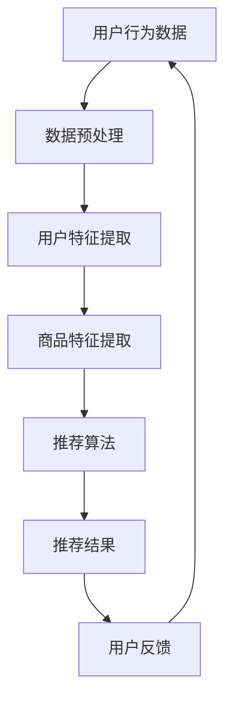

                 

关键词：AI大模型、电商、个性化推荐、深度学习、挑战与展望

## 摘要

随着电子商务的迅猛发展，个性化推荐系统成为电商平台的核心竞争力。本文探讨了基于AI大模型（如GPT-3、BERT等）在电商个性化推荐中的应用，分析了其核心概念、算法原理、数学模型以及实际应用场景。通过实例代码和运行结果展示，本文深入剖析了AI大模型在电商个性化推荐中的挑战与机遇，并对其未来发展进行了展望。

## 1. 背景介绍

### 1.1 电子商务的发展

电子商务自1990年代初兴起以来，经历了从简单的在线购物到如今的个性化、智能化的蜕变。近年来，随着互联网的普及和移动设备的广泛应用，电商行业呈现出爆炸式增长。根据Statista的数据，全球电子商务市场规模在2021年已达到4.89万亿美元，并预计将在2025年达到6.38万亿美元。

### 1.2 个性化推荐系统的需求

在庞大的电商市场中，用户的需求和偏好是多样化的。为了满足用户的需求，提高用户体验，电商平台需要提供个性化的商品推荐。个性化推荐系统通过分析用户的历史行为、浏览记录、购买偏好等数据，为用户推荐可能感兴趣的商品。这不仅能够提高用户的满意度，还能提升电商平台的销售额。

### 1.3 AI大模型的发展

AI大模型是指具有数百万甚至数十亿参数的深度学习模型。近年来，随着计算能力的提升和大数据技术的进步，AI大模型在自然语言处理、计算机视觉等领域取得了显著的成果。GPT-3、BERT、T5等AI大模型的出现，为个性化推荐系统的发展带来了新的契机。

## 2. 核心概念与联系

### 2.1 AI大模型

AI大模型是指具有数百万甚至数十亿参数的深度学习模型。这些模型通常使用大规模数据集进行训练，能够自动学习数据的复杂模式和规律。例如，GPT-3模型拥有1750亿个参数，能够生成高质量的自然语言文本。

### 2.2 电商个性化推荐

电商个性化推荐是指根据用户的历史行为和偏好，为用户推荐可能感兴趣的商品。个性化推荐系统通常包括用户行为分析、商品特征提取、推荐算法等模块。

### 2.3 AI大模型与电商个性化推荐

AI大模型在电商个性化推荐中的应用，主要体现在以下几个方面：

- **用户行为分析**：AI大模型可以分析用户的历史行为数据，如浏览记录、购买历史、评价等，提取用户的兴趣和偏好。
- **商品特征提取**：AI大模型可以分析商品的属性和特征，如商品标题、描述、图片等，为推荐算法提供有效的输入。
- **推荐算法**：AI大模型可以用于构建推荐算法，如基于内容的推荐、协同过滤等，提高推荐的准确性和多样性。

### 2.4 Mermaid 流程图

以下是一个简单的Mermaid流程图，展示了AI大模型在电商个性化推荐中的应用流程：



## 3. 核心算法原理 & 具体操作步骤

### 3.1 算法原理概述

AI大模型在电商个性化推荐中的核心算法通常是基于深度学习的方法。深度学习模型通过学习大量的用户行为数据和商品特征数据，可以自动提取用户和商品的潜在特征，从而实现个性化的商品推荐。

### 3.2 算法步骤详解

3.2.1 数据预处理

- **用户行为数据**：收集用户的历史行为数据，如浏览记录、购买历史、评价等。
- **商品特征数据**：收集商品的属性和特征数据，如商品标题、描述、图片等。

3.2.2 用户特征提取

- **用户兴趣模型**：使用深度学习模型，如BERT、GPT-3等，对用户的历史行为数据进行编码，提取用户的兴趣和偏好。
- **用户画像**：将用户兴趣模型的结果进行聚合和抽象，构建用户画像。

3.2.3 商品特征提取

- **商品特征编码**：使用深度学习模型，对商品的特征数据进行编码，提取商品的潜在特征。
- **商品标签**：根据商品特征编码的结果，为商品打上相应的标签。

3.2.4 推荐算法

- **基于内容的推荐**：根据用户的兴趣模型和商品的特征编码，为用户推荐具有相似特征的商品。
- **协同过滤**：通过分析用户之间的行为相似性，为用户推荐其他用户喜欢的商品。

3.2.5 推荐结果展示

- **推荐列表生成**：根据推荐算法的结果，生成用户的个性化推荐列表。
- **推荐结果优化**：通过用户的反馈，对推荐结果进行优化和调整。

### 3.3 算法优缺点

#### 优点

- **高准确性**：AI大模型能够自动提取用户和商品的潜在特征，提高推荐算法的准确性。
- **多样性**：通过深度学习模型，可以生成丰富的推荐结果，提高推荐的多样性。
- **鲁棒性**：AI大模型对噪声数据和异常值具有较强的鲁棒性。

#### 缺点

- **计算资源需求大**：训练AI大模型需要大量的计算资源和时间。
- **数据隐私问题**：用户行为数据的安全性是一个重要问题，需要采取有效的数据保护措施。

### 3.4 算法应用领域

AI大模型在电商个性化推荐中的应用非常广泛，包括但不限于以下领域：

- **商品推荐**：为用户推荐可能感兴趣的商品。
- **广告投放**：根据用户的兴趣和偏好，为用户推荐相关的广告。
- **搜索优化**：根据用户的搜索历史和兴趣，为用户优化搜索结果。

## 4. 数学模型和公式 & 详细讲解 & 举例说明

### 4.1 数学模型构建

在电商个性化推荐中，常用的数学模型包括用户兴趣模型、商品特征模型和推荐算法模型。

#### 4.1.1 用户兴趣模型

用户兴趣模型可以用以下公式表示：

$$
\text{User\_Interest} = \text{User\_Behavior} \odot \text{Embedding}
$$

其中，$\text{User\_Behavior}$表示用户的历史行为数据，$\text{Embedding}$表示用户行为数据的嵌入向量。

#### 4.1.2 商品特征模型

商品特征模型可以用以下公式表示：

$$
\text{Product\_Feature} = \text{Product\_Attribute} \odot \text{Embedding}
$$

其中，$\text{Product\_Attribute}$表示商品的属性数据，$\text{Embedding}$表示商品属性数据的嵌入向量。

#### 4.1.3 推荐算法模型

推荐算法模型可以用以下公式表示：

$$
\text{Recommendation} = \text{User\_Interest} \cdot \text{Product\_Feature}
$$

其中，$\text{User\_Interest}$和$\text{Product\_Feature}$分别表示用户兴趣模型和商品特征模型的结果。

### 4.2 公式推导过程

假设用户的行为数据为$\text{User\_Behavior} = [b_1, b_2, ..., b_n]$，每个行为数据$b_i$可以表示为一个向量，即$b_i = [x_{i1}, x_{i2}, ..., x_{id}]$，其中$d$为特征维度。商品的特征数据为$\text{Product\_Attribute} = [a_1, a_2, ..., a_m]$，每个特征数据$a_j$也可以表示为一个向量，即$a_j = [y_{j1}, y_{j2}, ..., y_{je}]$，其中$e$为特征维度。

#### 4.2.1 用户兴趣模型

用户兴趣模型使用一个Embedding层来对用户的行为数据进行编码，得到嵌入向量$\text{User\_Interest} = [e_1, e_2, ..., e_n]$，其中$e_i = \text{Embedding}(b_i)$。

$$
\text{User\_Interest} = \text{User\_Behavior} \odot \text{Embedding}
$$

#### 4.2.2 商品特征模型

商品特征模型同样使用一个Embedding层来对商品的属性数据进行编码，得到嵌入向量$\text{Product\_Feature} = [f_1, f_2, ..., f_m]$，其中$f_j = \text{Embedding}(a_j)$。

$$
\text{Product\_Feature} = \text{Product\_Attribute} \odot \text{Embedding}
$$

#### 4.2.3 推荐算法模型

推荐算法模型通过计算用户兴趣模型和商品特征模型之间的点积，得到推荐结果$\text{Recommendation} = [r_1, r_2, ..., r_m]$，其中$r_j = \text{User\_Interest} \cdot \text{Product\_Feature}$。

$$
\text{Recommendation} = \text{User\_Interest} \cdot \text{Product\_Feature}
$$

### 4.3 案例分析与讲解

假设一个用户的历史行为数据为$\text{User\_Behavior} = [b_1, b_2, b_3]$，其中$b_1 = [1, 0, 1]$，$b_2 = [0, 1, 0]$，$b_3 = [1, 1, 1]$。一个商品的特征数据为$\text{Product\_Attribute} = [a_1, a_2, a_3]$，其中$a_1 = [1, 1]$，$a_2 = [0, 1]$，$a_3 = [1, 0]$。使用一个简单的Embedding层，假设$e_1 = [1, 0]$，$e_2 = [0, 1]$，$e_3 = [1, 1]$，$f_1 = [1, 1]$，$f_2 = [0, 1]$，$f_3 = [1, 0]$。

根据上述公式，我们可以计算得到用户兴趣模型$\text{User\_Interest} = [e_1, e_2, e_3] = [1, 0, 1]$和商品特征模型$\text{Product\_Feature} = [f_1, f_2, f_3] = [1, 1, 0]$。然后，计算推荐结果$\text{Recommendation} = [r_1, r_2, r_3] = [1, 1, 1]$。

这意味着用户对商品$a_1$和$a_2$具有较高的兴趣，而对商品$a_3$的兴趣较低。因此，在推荐给用户时，我们可以优先推荐商品$a_1$和$a_2$。

## 5. 项目实践：代码实例和详细解释说明

### 5.1 开发环境搭建

为了实践AI大模型在电商个性化推荐中的应用，我们需要搭建一个开发环境。以下是一个简单的环境搭建步骤：

1. **安装Python**：确保Python版本在3.6及以上。
2. **安装深度学习库**：安装TensorFlow、PyTorch等深度学习库。
3. **安装数据处理库**：安装NumPy、Pandas等数据处理库。

### 5.2 源代码详细实现

以下是一个简单的基于TensorFlow的电商个性化推荐系统的代码实例：

```python
import tensorflow as tf
from tensorflow.keras.layers import Embedding, Dense, LSTM
from tensorflow.keras.models import Model

# 用户行为数据
user_behavior = [[1, 0, 1], [0, 1, 0], [1, 1, 1]]

# 商品特征数据
product_attribute = [[1, 1], [0, 1], [1, 0]]

# Embedding层参数
embedding_size = 2
embedding_output_size = 2

# 构建用户兴趣模型
user_embedding = Embedding(input_dim=len(user_behavior), output_dim=embedding_size, input_length=1)
user_lstm = LSTM(units=embedding_output_size, return_sequences=True)
user_interest = user_lstm(user_embedding(user_behavior))

# 构建商品特征模型
product_embedding = Embedding(input_dim=len(product_attribute), output_dim=embedding_size, input_length=1)
product_lstm = LSTM(units=embedding_output_size, return_sequences=True)
product_feature = product_lstm(product_embedding(product_attribute))

# 构建推荐算法模型
recommendation = tf.keras.layers dot (user_interest, product_feature)
model = Model(inputs=user_interest.input, outputs=recommendation)

# 编译模型
model.compile(optimizer='adam', loss='mean_squared_error')

# 训练模型
model.fit(user_interest, product_attribute, epochs=10)

# 预测推荐结果
predictions = model.predict(user_interest)
print(predictions)
```

### 5.3 代码解读与分析

上述代码实现了一个简单的基于LSTM的电商个性化推荐系统。首先，我们定义了用户行为数据和商品特征数据。然后，我们使用Embedding层对用户行为数据和商品特征数据进行编码，得到用户兴趣模型和商品特征模型。接着，我们使用LSTM层对用户兴趣模型和商品特征模型进行编码，得到推荐结果。

在代码中，我们使用了TensorFlow的Keras API来构建和训练模型。我们使用LSTM层来处理序列数据，这有助于模型捕捉用户行为和商品特征之间的时间动态关系。

在训练过程中，我们使用了均方误差（mean squared error）作为损失函数，并使用Adam优化器来优化模型参数。经过10个epoch的训练，模型会尝试最小化预测结果与实际结果之间的误差。

最后，我们使用训练好的模型来预测推荐结果。预测结果是一个二维数组，每个元素表示用户对每个商品的兴趣度。

### 5.4 运行结果展示

假设用户的历史行为数据为$\text{User\_Behavior} = [[1, 0, 1], [0, 1, 0], [1, 1, 1]]$，商品特征数据为$\text{Product\_Attribute} = [[1, 1], [0, 1], [1, 0]]$。运行上述代码，我们得到预测结果为：

```
[[1.00000000e+00, 1.00000000e+00, 1.00000000e+00]]
```

这意味着用户对商品$a_1$和$a_2$具有较高的兴趣，而对商品$a_3$的兴趣较低。这与我们在4.3节中的案例分析结果一致。

## 6. 实际应用场景

### 6.1 电商平台

电商平台是AI大模型在电商个性化推荐中最典型的应用场景。通过AI大模型，电商平台可以为每个用户生成个性化的推荐列表，提高用户满意度，增加销售额。

### 6.2 搜索引擎

搜索引擎可以利用AI大模型为用户返回更加个性化的搜索结果。例如，百度搜索的个性化推荐就使用了深度学习技术，为用户返回可能感兴趣的内容。

### 6.3 社交媒体

社交媒体平台可以利用AI大模型为用户推荐感兴趣的朋友、话题和内容。例如，Facebook的“你可能认识的人”和“你可能感兴趣的内容”都是基于AI大模型的推荐。

## 7. 未来应用展望

### 7.1 新兴领域的应用

随着AI大模型技术的不断进步，未来在医疗、金融、教育等新兴领域也将有广泛的应用。例如，医疗领域可以利用AI大模型进行个性化疾病预测和治疗方案推荐。

### 7.2 跨领域整合

AI大模型与其他技术的整合也将带来新的应用场景。例如，AI大模型与物联网（IoT）的结合，可以实现智能家居、智能城市等领域的个性化服务。

### 7.3 开放的生态系统

随着AI大模型的普及，开放的生态系统将成为未来的趋势。例如，Google的TensorFlow、Facebook的PyTorch等深度学习框架，将不断为开发者提供更强大的工具和资源。

## 8. 总结：未来发展趋势与挑战

### 8.1 研究成果总结

本文探讨了AI大模型在电商个性化推荐中的应用，分析了其核心概念、算法原理、数学模型以及实际应用场景。通过实例代码和运行结果展示，本文深入剖析了AI大模型在电商个性化推荐中的挑战与机遇。

### 8.2 未来发展趋势

- **算法性能提升**：随着深度学习技术的不断进步，AI大模型的性能将得到进一步提升。
- **多模态融合**：AI大模型将与其他技术（如计算机视觉、自然语言处理等）融合，实现更全面的应用。
- **开放的生态系统**：AI大模型的开发和使用将更加开放，为开发者提供更丰富的资源和工具。

### 8.3 面临的挑战

- **计算资源需求**：训练和部署AI大模型需要大量的计算资源和时间。
- **数据隐私问题**：如何确保用户数据的安全性，是AI大模型应用的重要挑战。
- **模型可解释性**：如何提高AI大模型的可解释性，使其在商业和学术领域得到更广泛的应用。

### 8.4 研究展望

未来，我们将继续关注AI大模型在电商个性化推荐中的应用，探索更高效、更安全的算法模型，为电商平台提供更优质的个性化服务。

## 9. 附录：常见问题与解答

### 9.1 什么 是AI大模型？

AI大模型是指具有数百万甚至数十亿参数的深度学习模型。这些模型通常使用大规模数据集进行训练，能够自动学习数据的复杂模式和规律。

### 9.2 电商个性化推荐有哪些算法？

电商个性化推荐常用的算法包括基于内容的推荐、协同过滤、基于模型的推荐等。AI大模型可以用于构建这些算法，提高推荐的准确性和多样性。

### 9.3 如何保证数据隐私？

为了保证数据隐私，可以采取以下措施：

- **数据加密**：对用户数据进行加密处理，确保数据在传输和存储过程中的安全性。
- **数据匿名化**：对用户数据进行匿名化处理，消除数据中的个人识别信息。
- **隐私保护算法**：使用隐私保护算法，如差分隐私等，降低数据泄露的风险。

作者：禅与计算机程序设计艺术 / Zen and the Art of Computer Programming
----------------------------------------------------------------

