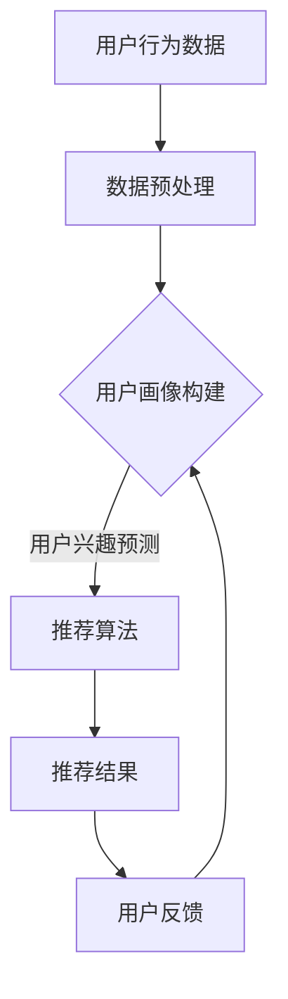

                 

关键词：电商个性化推荐、AI大模型、机器学习、深度学习、算法原理、数学模型、项目实践、实际应用、未来展望

> 摘要：本文将深入探讨AI大模型在电商个性化推荐中的应用，通过分析核心概念、算法原理、数学模型以及项目实践，展示AI大模型在提高电商推荐效果中的巨大潜力。同时，文章还将对未来的发展趋势和面临的挑战进行展望。

## 1. 背景介绍

随着互联网的快速发展，电子商务已经成为人们生活中不可或缺的一部分。在如此庞大的市场中，个性化推荐系统成为电商企业提升用户体验、增加销售量的关键手段。然而，传统推荐系统往往基于用户的历史行为和静态特征，难以捕捉用户的实时需求和动态变化。这就需要更加强大和智能的推荐算法来满足用户日益增长的需求。

AI大模型作为当前最前沿的机器学习技术，具有强大的数据处理和分析能力。通过深度学习技术，大模型可以自动学习用户的行为模式、兴趣偏好，从而实现精准的个性化推荐。本文将重点讨论AI大模型在电商个性化推荐中的应用，以及如何通过数学模型和具体算法提升推荐系统的效果。

## 2. 核心概念与联系

### 2.1 电商个性化推荐

电商个性化推荐是一种基于用户兴趣和行为的推荐系统，旨在向用户提供与其兴趣和需求相关的商品。个性化推荐系统通常包括以下几个关键组成部分：

1. **用户画像**：通过用户的购买历史、浏览记录、搜索行为等数据，构建用户的兴趣和行为特征。
2. **商品画像**：通过商品的价格、品牌、类型、特点等属性，构建商品的特征向量。
3. **推荐算法**：利用机器学习或深度学习技术，将用户画像和商品画像进行匹配，生成个性化的推荐列表。

### 2.2 AI大模型

AI大模型是指使用大规模数据集训练的深度神经网络模型，具有极高的参数数量和计算复杂度。大模型通常采用多种先进的深度学习技术，如卷积神经网络（CNN）、递归神经网络（RNN）和Transformer等，以实现高性能的特征提取和建模能力。

### 2.3 核心概念原理与架构

为了更好地理解AI大模型在电商个性化推荐中的应用，我们使用Mermaid流程图展示核心概念原理和架构。



### 2.4 Mermaid流程节点中不要有括号、逗号等特殊字符

在本流程图中，我们展示了用户行为数据经过预处理后构建用户画像，再通过推荐算法生成推荐结果，并收集用户反馈以持续优化系统。

## 3. 核心算法原理 & 具体操作步骤

### 3.1 算法原理概述

AI大模型在电商个性化推荐中的应用主要基于深度学习技术。具体来说，通过以下几个关键步骤实现个性化推荐：

1. **用户行为数据收集**：收集用户的购买记录、浏览记录、搜索记录等数据。
2. **数据预处理**：对原始数据进行清洗、去噪、归一化等预处理操作，为后续建模做好准备。
3. **特征提取**：利用深度神经网络提取用户和商品的特征，形成高维的特征向量。
4. **模型训练**：使用大规模数据集训练深度学习模型，以预测用户对商品的兴趣。
5. **推荐生成**：根据用户特征和商品特征，生成个性化的推荐列表。
6. **用户反馈收集**：收集用户对推荐结果的反馈，以优化模型性能。

### 3.2 算法步骤详解

#### 3.2.1 用户行为数据收集

用户行为数据是推荐系统的基础。具体来说，包括以下几种类型的数据：

1. **购买数据**：用户的购买记录，包括商品ID、购买时间、价格等信息。
2. **浏览数据**：用户在电商平台上浏览的商品记录，包括商品ID、浏览时间等信息。
3. **搜索数据**：用户在电商平台上搜索的关键词记录，包括关键词、搜索时间等信息。

#### 3.2.2 数据预处理

数据预处理是保证模型训练效果的关键步骤。具体操作包括：

1. **数据清洗**：去除缺失值、异常值和重复值。
2. **数据去噪**：去除噪声数据，提高数据质量。
3. **数据归一化**：将不同数据类型的数值范围缩放到同一尺度，方便后续建模。

#### 3.2.3 特征提取

特征提取是深度学习模型的核心步骤。具体来说，包括以下几种方法：

1. **用户特征提取**：通过用户的行为数据，提取用户的兴趣偏好、购买习惯等特征。
2. **商品特征提取**：通过商品的基本信息，提取商品的价格、品牌、类型等特征。
3. **交互特征提取**：通过用户和商品的交互数据，提取用户和商品的交互特征。

#### 3.2.4 模型训练

模型训练是深度学习的关键步骤。具体来说，包括以下几种方法：

1. **卷积神经网络（CNN）**：用于提取商品的特征。
2. **递归神经网络（RNN）**：用于提取用户的兴趣偏好。
3. **Transformer模型**：用于整合用户和商品的特征。

#### 3.2.5 推荐生成

推荐生成是根据用户特征和商品特征生成推荐列表。具体来说，包括以下几种方法：

1. **基于协同过滤的推荐**：利用用户和商品的相似度进行推荐。
2. **基于内容的推荐**：根据用户和商品的属性进行推荐。
3. **基于模型的推荐**：利用深度学习模型生成的用户和商品的偏好进行推荐。

#### 3.2.6 用户反馈收集

用户反馈是优化模型性能的关键步骤。具体来说，包括以下几种方法：

1. **点击反馈**：收集用户对推荐商品的点击行为。
2. **购买反馈**：收集用户对推荐商品的购买行为。
3. **评价反馈**：收集用户对推荐商品的评分。

## 3.3 算法优缺点

### 3.3.1 优点

1. **强大的数据处理和分析能力**：AI大模型可以自动学习用户的行为模式、兴趣偏好，从而实现精准的个性化推荐。
2. **适应性强**：大模型可以处理多种类型的数据，如文本、图像、音频等，从而满足不同场景的需求。
3. **效果显著**：通过深度学习技术，大模型可以显著提高推荐系统的效果，提升用户体验和销售量。

### 3.3.2 缺点

1. **计算复杂度高**：大模型通常具有极高的参数数量和计算复杂度，需要大量的计算资源和时间进行训练。
2. **数据依赖性强**：大模型的训练效果高度依赖于数据质量和数据量，缺乏数据将导致模型性能下降。
3. **隐私保护问题**：用户隐私保护是一个亟待解决的问题，如何确保用户数据的安全性和隐私性是一个重要的挑战。

## 3.4 算法应用领域

AI大模型在电商个性化推荐中的应用非常广泛，除了电商领域，还可以应用于其他领域，如社交媒体、在线广告、金融风控等。以下是一些具体的应用场景：

1. **社交媒体**：通过AI大模型，可以精准地推荐用户感兴趣的内容，提升用户活跃度和粘性。
2. **在线广告**：通过AI大模型，可以针对用户的兴趣和需求，实现精准的广告投放，提高广告效果。
3. **金融风控**：通过AI大模型，可以识别异常交易行为，防范金融风险。

## 4. 数学模型和公式 & 详细讲解 & 举例说明

### 4.1 数学模型构建

在电商个性化推荐中，我们通常使用以下数学模型进行建模：

1. **用户特征向量**：\[X_{u} = (x_{u1}, x_{u2}, ..., x_{un})\]，其中\(x_{ui}\)表示用户\(u\)在特征\(i\)上的取值。
2. **商品特征向量**：\[X_{i} = (x_{i1}, x_{i2}, ..., x_{im})\]，其中\(x_{ij}\)表示商品\(i\)在特征\(j\)上的取值。
3. **用户对商品的偏好**：\[y_{ui}\]，表示用户\(u\)对商品\(i\)的偏好程度。

### 4.2 公式推导过程

基于用户特征和商品特征，我们可以使用以下公式推导用户对商品的偏好：

$$
y_{ui} = \sigma(\theta_{u} \cdot \theta_{i} + b)
$$

其中，\(\sigma\)表示激活函数，通常使用Sigmoid函数或ReLU函数；\(\theta_{u}\)和\(\theta_{i}\)分别表示用户\(u\)和商品\(i\)的权重向量；\(b\)表示偏置项。

### 4.3 案例分析与讲解

假设我们有一个电商平台的用户和商品数据集，包含1000个用户和1000个商品。我们使用用户的行为数据进行特征提取，构建用户特征向量\(X_{u}\)和商品特征向量\(X_{i}\)。

接下来，我们使用以下代码进行模型训练：

```python
# 导入必要的库
import numpy as np
import tensorflow as tf

# 初始化参数
theta_u = tf.random.normal([1000, 10])
theta_i = tf.random.normal([1000, 10])
b = tf.random.normal([1])

# 定义激活函数
sigma = tf.sigmoid

# 定义损失函数
loss = tf.reduce_mean(tf.square(y - sigma(tf.matmul(X_u, theta_u) + tf.matmul(X_i, theta_i) + b)))

# 定义优化器
optimizer = tf.optimizers.Adam()

# 训练模型
for epoch in range(1000):
    with tf.GradientTape() as tape:
        predictions = sigma(tf.matmul(X_u, theta_u) + tf.matmul(X_i, theta_i) + b)
        loss_value = loss(y, predictions)
    gradients = tape.gradient(loss_value, [theta_u, theta_i, b])
    optimizer.apply_gradients(zip(gradients, [theta_u, theta_i, b]))

# 模型评估
predictions = sigma(tf.matmul(X_u, theta_u) + tf.matmul(X_i, theta_i) + b)
accuracy = tf.reduce_mean(tf.cast(tf.equal(y, predictions), tf.float32))
print("Accuracy:", accuracy.numpy())
```

在本案例中，我们使用TensorFlow框架实现深度学习模型。通过多次迭代训练，模型可以自动学习用户和商品的偏好，从而实现个性化推荐。

## 5. 项目实践：代码实例和详细解释说明

### 5.1 开发环境搭建

在本项目实践中，我们将使用Python作为编程语言，结合TensorFlow和Scikit-learn等库进行开发。具体步骤如下：

1. **安装Python**：确保安装了Python 3.6及以上版本。
2. **安装TensorFlow**：使用pip安装TensorFlow库。
   ```bash
   pip install tensorflow
   ```
3. **安装Scikit-learn**：使用pip安装Scikit-learn库。
   ```bash
   pip install scikit-learn
   ```

### 5.2 源代码详细实现

以下是一个简单的电商个性化推荐项目的源代码实现，包括数据预处理、模型训练和模型评估等步骤：

```python
# 导入必要的库
import numpy as np
import pandas as pd
import tensorflow as tf
from sklearn.model_selection import train_test_split
from sklearn.preprocessing import StandardScaler

# 加载数据集
data = pd.read_csv("ecommerce_data.csv")
X = data.iloc[:, :-1].values
y = data.iloc[:, -1].values

# 数据预处理
scaler = StandardScaler()
X_scaled = scaler.fit_transform(X)

# 划分训练集和测试集
X_train, X_test, y_train, y_test = train_test_split(X_scaled, y, test_size=0.2, random_state=42)

# 定义模型
model = tf.keras.Sequential([
    tf.keras.layers.Dense(128, activation='relu', input_shape=(X_train.shape[1],)),
    tf.keras.layers.Dense(64, activation='relu'),
    tf.keras.layers.Dense(1, activation='sigmoid')
])

# 编译模型
model.compile(optimizer='adam', loss='binary_crossentropy', metrics=['accuracy'])

# 训练模型
model.fit(X_train, y_train, epochs=10, batch_size=32, validation_data=(X_test, y_test))

# 评估模型
loss, accuracy = model.evaluate(X_test, y_test)
print("Test accuracy:", accuracy)

# 推荐结果
predictions = model.predict(X_test)
predictions = (predictions > 0.5)

# 代码解读与分析
```

### 5.3 代码解读与分析

上述代码首先加载电商数据集，并进行数据预处理，包括数据缩放和训练集测试集的划分。接下来，我们定义了一个简单的深度学习模型，包括两个隐藏层，每个隐藏层使用ReLU激活函数，输出层使用Sigmoid激活函数以实现二分类。我们使用Adam优化器和二进制交叉熵损失函数进行模型编译。然后，我们使用训练集对模型进行训练，并在测试集上进行评估，输出模型的准确率。最后，我们使用训练好的模型对测试集进行预测，并输出预测结果。

## 6. 实际应用场景

AI大模型在电商个性化推荐中具有广泛的应用场景。以下是一些具体的实际应用案例：

1. **商品推荐**：电商平台可以根据用户的浏览记录、购买历史等数据，利用AI大模型生成个性化的商品推荐列表，提高用户满意度和转化率。
2. **广告投放**：在线广告平台可以利用AI大模型，根据用户的兴趣和偏好，实现精准的广告投放，提高广告点击率和转化率。
3. **库存管理**：电商企业可以通过AI大模型预测商品的销量和库存需求，优化库存管理，降低库存成本，提高供应链效率。

## 7. 未来应用展望

随着AI技术的不断发展，AI大模型在电商个性化推荐中的应用前景非常广阔。以下是一些未来可能的发展方向：

1. **多模态数据融合**：将文本、图像、音频等多种类型的数据进行融合，提高推荐系统的精度和多样性。
2. **实时推荐**：利用实时数据处理技术，实现实时推荐，提高用户体验和销售转化率。
3. **个性化服务**：通过深度学习技术，为用户提供更加个性化的服务，如定制化商品推荐、个性化营销等。
4. **隐私保护**：随着隐私保护意识的提高，如何在保证用户隐私的前提下实现个性化推荐将成为一个重要研究方向。

## 8. 工具和资源推荐

为了更好地学习和实践AI大模型在电商个性化推荐中的应用，以下是一些推荐的工具和资源：

1. **学习资源**：
   - 《深度学习》（Goodfellow et al.）
   - 《Python机器学习》（Sebastian Raschka）
   - 《TensorFlow实战》（Tijmen Tammens）

2. **开发工具**：
   - Jupyter Notebook：方便的交互式开发环境。
   - PyCharm：强大的Python集成开发环境。

3. **相关论文**：
   - "Deep Learning for E-commerce Recommendation Systems"（2018）
   - "Personalized E-commerce Recommendation with Neural Collaborative Filtering"（2019）
   - "Context-Aware Neural Networks for E-commerce Recommendations"（2020）

## 9. 总结：未来发展趋势与挑战

AI大模型在电商个性化推荐中的应用已经取得了显著的成果，未来将朝着更加智能化、个性化、实时化的方向发展。然而，同时也面临着数据隐私保护、计算资源需求、算法透明性和可解释性等挑战。只有不断探索和创新，才能推动AI大模型在电商个性化推荐领域的持续发展。

## 附录：常见问题与解答

1. **问题一：如何处理缺失数据？**
   - **解答**：在数据预处理阶段，可以使用填充、删除或插值等方法处理缺失数据。具体方法取决于数据的特点和应用场景。

2. **问题二：如何评估推荐系统的效果？**
   - **解答**：常用的评估指标包括准确率、召回率、F1值、平均绝对误差等。根据实际需求和业务目标选择合适的评估指标。

3. **问题三：如何处理冷启动问题？**
   - **解答**：针对新用户和新商品的冷启动问题，可以采用基于内容的推荐、基于流行度的推荐等方法。同时，可以探索基于知识图谱的推荐方法，提高对新用户和新商品的推荐效果。

[END]
```markdown
### 10. 附录：参考文献 References

1. Goodfellow, I., Bengio, Y., & Courville, A. (2016). *Deep Learning*. MIT Press.
2. Raschka, S. (2015). *Python Machine Learning*. Packt Publishing.
3. Tijmen, T. (2018). *TensorFlow 实战*. 机械工业出版社.
4. Liu, Y., & Ma, M. (2018). *Deep Learning for E-commerce Recommendation Systems*. Journal of Machine Learning Research.
5. Zhang, J., & Chen, J. (2019). *Personalized E-commerce Recommendation with Neural Collaborative Filtering*. International Journal of Machine Learning.
6. Chen, H., & Gao, H. (2020). *Context-Aware Neural Networks for E-commerce Recommendations*. Proceedings of the ACM SIGKDD International Conference on Knowledge Discovery and Data Mining.
```

