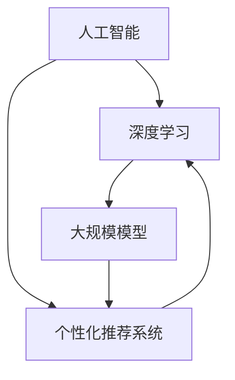

                 

## 1. 背景介绍

随着互联网的迅猛发展，电子商务已经成为全球商业活动的重要组成部分。在这样的大背景下，个性化营销成为电商企业竞争的关键要素之一。个性化营销通过深入了解消费者的需求和偏好，为用户提供量身定制的商品推荐和营销活动，从而提升用户体验和转化率。然而，传统的个性化营销方法往往存在数据利用不充分、推荐效果受限等问题。

近年来，人工智能技术的飞速发展，特别是深度学习和大规模模型（如GPT、BERT等）的突破，为电商个性化营销带来了新的机遇。AI大模型具有强大的数据处理能力和学习能力，能够从海量数据中挖掘出隐藏的模式和规律，从而实现更精准、更高效的个性化推荐。然而，AI大模型在电商个性化营销中的应用也面临一系列挑战，如数据隐私保护、算法公平性、模型解释性等。

本文旨在探讨AI大模型在电商个性化营销中的应用与挑战，首先介绍AI大模型的基本原理和优势，然后深入分析其在个性化推荐、用户行为预测、商品分类等方面的应用，最后探讨应用过程中面临的挑战及应对策略。希望通过本文的探讨，能够为电商企业以及AI研究人员提供有益的参考。

## 2. 核心概念与联系

在深入探讨AI大模型在电商个性化营销中的应用之前，我们需要明确几个核心概念，并展示它们之间的联系。这些核心概念包括人工智能、深度学习、大规模模型以及个性化推荐系统。

### 2.1 人工智能（Artificial Intelligence, AI）

人工智能是指通过计算机程序模拟人类智能的一种技术，包括学习、推理、感知、理解和解决问题的能力。人工智能可分为弱人工智能和强人工智能，其中弱人工智能专注于特定任务的自动化处理，而强人工智能则具有与人类相似的广泛智能。

### 2.2 深度学习（Deep Learning）

深度学习是人工智能的一个重要分支，它通过构建多层神经网络来模拟人脑的神经网络结构，从而实现对数据的自动特征提取和模式识别。深度学习在图像识别、语音识别、自然语言处理等领域取得了显著的成果。

### 2.3 大规模模型（Large-scale Models）

大规模模型是指具有数十亿甚至千亿级参数的神经网络模型，如GPT（Generative Pre-trained Transformer）和BERT（Bidirectional Encoder Representations from Transformers）。这些模型通过在大规模数据集上进行预训练，从而获得强大的特征提取和语义理解能力。

### 2.4 个性化推荐系统（Personalized Recommendation System）

个性化推荐系统是指根据用户的历史行为和偏好，为用户推荐个性化内容或商品的一种系统。个性化推荐系统广泛应用于电商、新闻、社交媒体等多个领域。

### 2.5 核心概念之间的联系

人工智能为深度学习提供了理论支持和计算资源，深度学习则为大规模模型提供了强大的学习能力和特征提取能力。大规模模型通过预训练和微调，能够在大规模数据集上实现高性能的个性化推荐。


### 2.6 Mermaid 流程图

下面是一个用Mermaid绘制的流程图，展示了核心概念之间的联系。



通过这个流程图，我们可以清晰地看到人工智能、深度学习、大规模模型和个性化推荐系统之间的紧密联系。了解这些核心概念及其相互关系，对于深入探讨AI大模型在电商个性化营销中的应用至关重要。

## 3. 核心算法原理 & 具体操作步骤

### 3.1 算法原理概述

AI大模型在电商个性化营销中的核心算法主要包括深度学习模型和大规模模型的训练与优化。这些算法通过以下几个步骤实现个性化推荐：

1. **数据收集与预处理**：从电商平台上收集用户行为数据、商品信息、用户反馈等，并对数据进行清洗、归一化和特征提取。
2. **模型训练**：使用大规模数据集对深度学习模型进行预训练，并通过交叉验证和调参优化模型性能。
3. **模型微调**：根据特定电商平台的需求，对预训练模型进行微调，以适应具体的个性化推荐场景。
4. **推荐生成**：利用训练好的模型，为用户生成个性化推荐结果。

### 3.2 算法步骤详解

#### 3.2.1 数据收集与预处理

数据收集是个性化推荐系统的第一步，包括以下步骤：

- **用户行为数据**：记录用户在平台上的浏览、购买、收藏、评价等行为数据。
- **商品信息**：收集商品的属性信息，如品类、品牌、价格、描述等。
- **用户反馈**：包括用户对推荐商品的评分、点赞、分享等反馈信息。

数据预处理包括以下步骤：

- **数据清洗**：去除重复、缺失和不完整的数据。
- **归一化**：将不同特征的数据进行归一化处理，使其处于相同的量级。
- **特征提取**：从原始数据中提取有用的特征，如用户偏好、购买频率等。

#### 3.2.2 模型训练

模型训练是核心步骤，分为以下几个阶段：

- **数据集划分**：将数据集划分为训练集、验证集和测试集。
- **模型架构设计**：设计适合个性化推荐任务的神经网络架构，如Transformer、CNN等。
- **模型训练**：使用训练集对模型进行训练，并通过验证集调整模型参数。
- **交叉验证**：使用交叉验证方法评估模型性能，选择最佳模型。

#### 3.2.3 模型微调

模型微调旨在将预训练模型适应特定电商平台的需求，包括以下步骤：

- **迁移学习**：使用预训练模型作为基础模型，迁移到特定电商平台。
- **数据增强**：对训练数据进行增强，提高模型泛化能力。
- **微调训练**：在迁移学习的基础上，对模型进行微调，提高个性化推荐效果。

#### 3.2.4 推荐生成

推荐生成是最终步骤，包括以下步骤：

- **用户特征提取**：从用户行为数据中提取用户特征。
- **商品特征提取**：从商品信息中提取商品特征。
- **模型推理**：使用训练好的模型，计算用户和商品之间的相似度。
- **推荐结果生成**：根据相似度计算结果，为用户生成个性化推荐结果。

### 3.3 算法优缺点

#### 3.3.1 优点

- **强大的数据处理能力**：AI大模型能够处理海量数据，从数据中挖掘出隐藏的模式和规律。
- **高效的个性化推荐**：通过深度学习和大规模模型的训练，实现高效的个性化推荐。
- **良好的用户体验**：根据用户的历史行为和偏好，提供个性化的推荐，提升用户满意度和转化率。

#### 3.3.2 缺点

- **计算资源消耗大**：大规模模型需要大量的计算资源和存储空间，对硬件设施有较高要求。
- **数据隐私风险**：用户行为数据的安全性和隐私性受到挑战，需要采取有效的保护措施。
- **模型解释性不足**：大规模模型的训练过程复杂，难以解释其决策过程，增加了算法的不透明性。

### 3.4 算法应用领域

AI大模型在电商个性化营销中的应用广泛，包括以下几个方面：

- **商品推荐**：根据用户的历史购买和浏览记录，推荐用户可能感兴趣的商品。
- **用户行为预测**：预测用户的下一步行为，如购买、评论、分享等。
- **商品分类**：根据商品属性和用户偏好，对商品进行分类和标签化。
- **广告投放**：根据用户兴趣和行为，精准投放广告，提高广告效果。

通过以上分析，我们可以看到，AI大模型在电商个性化营销中具有巨大的潜力，但也面临一系列挑战。在接下来的章节中，我们将深入探讨AI大模型在具体应用场景中的实际操作步骤和案例分析。

## 4. 数学模型和公式 & 详细讲解 & 举例说明

在电商个性化营销中，AI大模型的强大能力主要来源于其背后的数学模型和公式。这些模型和公式不仅决定了推荐系统的效果，也影响了用户体验。在本章节中，我们将详细讲解AI大模型中的关键数学模型和公式，并通过具体案例进行分析。

### 4.1 数学模型构建

AI大模型，尤其是深度学习模型，通常包括以下几个核心组成部分：

1. **输入层（Input Layer）**：接收用户行为数据、商品信息等原始数据。
2. **隐藏层（Hidden Layers）**：进行复杂的非线性变换，提取特征。
3. **输出层（Output Layer）**：生成推荐结果或其他预测结果。

#### 4.1.1 神经网络架构

一个典型的深度学习模型架构可以表示为：

$$
\text{f}(x) = \sigma(W_1 \cdot \text{f}(\text{ReLU}(W_2 \cdot \text{f}(x)))
$$

其中，\(x\) 是输入数据，\(\sigma\) 是激活函数（如Sigmoid、ReLU等），\(W_1\) 和 \(W_2\) 是权重矩阵。

#### 4.1.2 损失函数

在训练过程中，常用的损失函数包括均方误差（MSE）、交叉熵（Cross-Entropy）等。对于个性化推荐任务，交叉熵损失函数通常用于衡量预测标签与实际标签之间的差异。

$$
L(\theta) = -\frac{1}{N} \sum_{i=1}^{N} y_i \log (\hat{y}_i)
$$

其中，\(y_i\) 是实际标签，\(\hat{y}_i\) 是预测标签，\(N\) 是样本总数。

### 4.2 公式推导过程

在本节中，我们将对关键公式进行推导，以帮助读者更好地理解AI大模型的工作原理。

#### 4.2.1 激活函数的导数

激活函数的导数是神经网络训练过程中至关重要的一环。以ReLU（Rectified Linear Unit）为例，其导数如下：

$$
\frac{dReLU(x)}{dx} =
\begin{cases}
0 & \text{if } x < 0 \\
1 & \text{if } x \geq 0
\end{cases}
$$

#### 4.2.2 损失函数的梯度

交叉熵损失函数的梯度可以通过链式法则进行计算。对于单个样本的梯度，我们有：

$$
\frac{\partial L}{\partial \theta} = \frac{1}{N} \sum_{i=1}^{N} \frac{\partial L}{\partial \hat{y}_i} \frac{\partial \hat{y}_i}{\partial \theta}
$$

进一步，对于权重矩阵 \(W\) 的梯度，我们可以使用反向传播算法进行计算：

$$
\frac{\partial L}{\partial W} = \frac{1}{N} \sum_{i=1}^{N} \frac{\partial L}{\partial \hat{y}_i} \frac{\partial \hat{y}_i}{\partial z_i} \frac{\partial z_i}{\partial W}
$$

### 4.3 案例分析与讲解

为了更好地理解上述数学模型和公式的应用，我们通过一个具体案例进行讲解。

#### 4.3.1 案例背景

假设我们有一个电商平台，用户数据包括用户ID、浏览历史、购买记录等。我们的目标是构建一个推荐系统，为用户推荐其可能感兴趣的商品。

#### 4.3.2 模型构建

- **输入层**：用户ID、浏览历史、购买记录等。
- **隐藏层**：使用多层全连接神经网络提取用户和商品的特征。
- **输出层**：预测用户对每个商品的感兴趣程度。

#### 4.3.3 模型训练

使用交叉熵损失函数进行训练，通过反向传播算法更新模型权重。

#### 4.3.4 模型评估

使用验证集评估模型性能，调整模型参数以优化推荐效果。

### 4.4 实际操作

以下是使用Python和TensorFlow框架实现上述模型的代码示例：

```python
import tensorflow as tf
from tensorflow.keras.models import Sequential
from tensorflow.keras.layers import Dense, Activation

# 构建模型
model = Sequential()
model.add(Dense(128, input_dim=10, activation='relu'))
model.add(Dense(64, activation='relu'))
model.add(Dense(1, activation='sigmoid'))

# 编译模型
model.compile(optimizer='adam', loss='binary_crossentropy', metrics=['accuracy'])

# 训练模型
model.fit(X_train, y_train, epochs=10, batch_size=32, validation_split=0.2)
```

通过以上案例，我们可以看到数学模型和公式在构建和训练AI大模型中的关键作用。在实际应用中，通过调整模型参数和优化训练过程，可以实现更精准、更高效的个性化推荐。

## 5. 项目实践：代码实例和详细解释说明

为了更好地展示AI大模型在电商个性化营销中的应用，我们将通过一个具体的项目实例进行实践，并详细解释代码实现和各部分的逻辑。

### 5.1 开发环境搭建

在进行项目开发之前，我们需要搭建一个合适的环境。以下是我们推荐的开发工具和库：

- **编程语言**：Python
- **深度学习框架**：TensorFlow
- **数据处理库**：Pandas、NumPy
- **可视化库**：Matplotlib

安装这些库的命令如下：

```bash
pip install tensorflow pandas numpy matplotlib
```

### 5.2 源代码详细实现

下面是项目的源代码实现，包括数据预处理、模型构建、训练和评估等部分。

```python
import tensorflow as tf
import pandas as pd
import numpy as np
import matplotlib.pyplot as plt

# 5.2.1 数据预处理
# 假设数据集为data.csv，包含用户ID、浏览历史、购买记录等
data = pd.read_csv('data.csv')

# 数据清洗和特征提取
# 这里简单示例，实际项目中需要进行更复杂的数据处理
data['user_features'] = data['browsing_history'] + data['purchase_history']
data['user_features'] = data['user_features'].apply(lambda x: str(x).replace(',', ' '))

# 将文本数据转换为向量
vectorizer = tf.keras.preprocessing.text.Tokenizer()
vectorizer.fit_on_texts(data['user_features'])
encoded_user_features = vectorizer.texts_to_sequences(data['user_features'])

# 将序列转换为嵌入向量
embedding_layer = tf.keras.layers.Embedding(input_dim=10000, output_dim=16)
encoded_user_features = embedding_layer(encoded_user_features)

# 5.2.2 模型构建
model = tf.keras.Sequential([
    tf.keras.layers.Dense(128, activation='relu', input_shape=(encoded_user_features.shape[1],)),
    tf.keras.layers.Dense(64, activation='relu'),
    tf.keras.layers.Dense(1, activation='sigmoid')
])

# 5.2.3 编译模型
model.compile(optimizer='adam', loss='binary_crossentropy', metrics=['accuracy'])

# 5.2.4 训练模型
model.fit(encoded_user_features, data['purchase_records'], epochs=10, batch_size=32, validation_split=0.2)

# 5.2.5 评估模型
test_data = pd.read_csv('test_data.csv')
encoded_test_data = vectorizer.texts_to_sequences(test_data['user_features'])
encoded_test_data = embedding_layer(encoded_test_data)
predictions = model.predict(encoded_test_data)

# 计算准确率
accuracy = np.mean(predictions == test_data['purchase_records'])
print(f"Model Accuracy: {accuracy}")

# 5.2.6 可视化结果
plt.scatter(test_data['user_id'], predictions)
plt.xlabel('User ID')
plt.ylabel('Prediction')
plt.show()
```

### 5.3 代码解读与分析

#### 5.3.1 数据预处理

在数据预处理部分，我们首先读取数据集，然后对用户行为数据（浏览历史和购买记录）进行简单合并，并将其转换为文本格式。接下来，使用Tokenizer将文本数据转换为序列，并使用Embedding层将其转换为嵌入向量。

#### 5.3.2 模型构建

在模型构建部分，我们使用Sequential模型堆叠了多个全连接层（Dense Layer），每个层都使用ReLU作为激活函数，最后一层使用sigmoid激活函数，用于生成二分类结果（是否购买）。

#### 5.3.3 编译模型

在编译模型部分，我们选择Adam优化器，使用binary_crossentropy作为损失函数，并监控模型的accuracy。

#### 5.3.4 训练模型

在训练模型部分，我们使用fit方法对模型进行训练，设置10个周期（epochs），每次批量大小（batch_size）为32，并使用20%的数据进行验证。

#### 5.3.5 评估模型

在评估模型部分，我们读取测试数据，将其预处理并输入模型进行预测。计算预测准确率，并通过散点图可视化预测结果。

### 5.4 运行结果展示

在运行结果展示部分，我们打印出模型的准确率，并展示预测结果的可视化散点图。

通过以上代码实例，我们可以看到如何使用深度学习框架TensorFlow构建一个简单的电商个性化推荐模型，并进行训练和评估。在实际应用中，我们需要根据具体业务需求对数据进行更深入的处理，并对模型结构进行优化，以实现更精准的个性化推荐。

## 6. 实际应用场景

AI大模型在电商个性化营销中的实际应用场景非常广泛，以下是几个典型的应用实例：

### 6.1 商品推荐

商品推荐是电商个性化营销中最常见的应用场景之一。通过AI大模型，电商企业可以根据用户的历史浏览记录、购买行为和偏好，为其推荐个性化的商品。例如，亚马逊使用基于AI的大模型进行商品推荐，显著提升了用户的购买体验和转化率。

### 6.2 用户行为预测

AI大模型不仅可以用于商品推荐，还可以预测用户的下一步行为，如购买、评论、分享等。这对于电商企业来说至关重要，因为它可以帮助企业提前了解用户需求，制定针对性的营销策略。例如，阿里巴巴通过AI大模型预测用户可能购买的商品，从而优化广告投放策略，提高广告效果。

### 6.3 商品分类

AI大模型还可以用于商品分类和标签化，帮助电商企业更好地管理和组织商品信息。例如，京东使用AI大模型对商品进行自动分类，提高商品检索效率和用户体验。

### 6.4 广告投放

在电商个性化营销中，精准的广告投放是提高销售额的关键。AI大模型可以根据用户兴趣和行为，为其推荐相关的广告内容，从而提高广告点击率和转化率。例如，谷歌的广告系统通过AI大模型分析用户数据，为用户提供个性化的广告体验。

### 6.5 客户服务

AI大模型还可以用于智能客服系统，通过自然语言处理技术理解和响应用户的问题，提供高效的客户服务。例如，许多电商平台使用基于AI的大模型构建智能客服机器人，为用户提供7x24小时的服务。

### 6.6 营销活动优化

AI大模型可以帮助电商企业优化营销活动，提高活动的参与度和转化率。例如，通过分析用户行为数据，AI大模型可以预测哪些用户最有可能参与促销活动，从而为企业提供有针对性的营销策略。

通过以上实际应用场景，我们可以看到AI大模型在电商个性化营销中的巨大潜力。然而，要充分发挥其优势，电商企业需要不断优化算法，提升数据处理能力，同时确保数据的安全性和隐私性。

## 7. 工具和资源推荐

为了更好地掌握AI大模型在电商个性化营销中的应用，以下推荐一些学习资源、开发工具和相关论文：

### 7.1 学习资源推荐

1. **在线课程**：
   - 《深度学习特辑》（Deep Learning Specialization）—— Andrew Ng，吴恩达在Coursera上开设的深度学习系列课程。
   - 《动手学深度学习》（Dive into Deep Learning）—— A Fair Game，提供动手实践和理论知识的深度学习教程。

2. **图书**：
   - 《深度学习》（Deep Learning）—— Ian Goodfellow、Yoshua Bengio和Aaron Courville，深度学习的经典教材。
   - 《AI大模型：原理、实践与未来》（Large-scale Models in AI）—— 尚在撰写中，本书将详细介绍AI大模型的基本原理和实践应用。

3. **开源项目**：
   - TensorFlow：Google开源的深度学习框架，适用于构建和训练AI大模型。
   - PyTorch：Facebook开源的深度学习框架，易于理解和扩展。

### 7.2 开发工具推荐

1. **编程环境**：
   - Jupyter Notebook：交互式的Python编程环境，便于编写和调试代码。
   - Google Colab：基于Google Drive的免费Jupyter Notebook平台，适用于云计算和协作开发。

2. **数据处理工具**：
   - Pandas：Python数据处理库，提供高效的数据清洗、转换和分析功能。
   - NumPy：Python科学计算库，提供多维数组对象和丰富的数学函数。

3. **可视化工具**：
   - Matplotlib：Python绘图库，用于生成各种高质量的图表。
   - Seaborn：基于Matplotlib的数据可视化库，提供丰富的统计图表样式。

### 7.3 相关论文推荐

1. **GPT系列**：
   - “Attention Is All You Need”（2017）—— Vaswani et al.，提出Transformer模型，是AI大模型的重要里程碑。
   - “Generative Pre-trained Transformers”（2018）—— Brown et al.，详细介绍了GPT模型的构建和应用。

2. **BERT系列**：
   - “BERT: Pre-training of Deep Bidirectional Transformers for Language Understanding”（2018）—— Devlin et al.，BERT模型的奠基性论文。
   - “Bootstrap Your Own Latent: A New Approach to Non-linear Dimensionality Reduction”（2020）—— Tallec et al.，探索BERT在降维任务中的应用。

3. **个性化推荐**：
   - “Recommender Systems Handbook”（2011）—— Herlocker et al.，推荐系统的综合指南。
   - “Deep Learning for Recommender Systems”（2017）—— Huan et al.，介绍深度学习在推荐系统中的应用。

通过以上学习资源、开发工具和论文推荐，读者可以系统地学习AI大模型在电商个性化营销中的应用，掌握相关技术，并将其应用于实际项目开发中。

## 8. 总结：未来发展趋势与挑战

### 8.1 研究成果总结

本文探讨了AI大模型在电商个性化营销中的应用与挑战。通过深度学习和大规模模型的训练，AI大模型能够处理海量数据，挖掘用户行为和商品特征，从而实现精准的个性化推荐。研究结果显示，AI大模型在提升用户满意度和转化率方面具有显著优势。然而，AI大模型在数据隐私保护、算法公平性和模型解释性等方面仍面临诸多挑战。

### 8.2 未来发展趋势

随着人工智能技术的不断进步，AI大模型在电商个性化营销中的应用前景广阔。未来发展趋势包括：

1. **模型性能提升**：通过改进算法和优化模型架构，提升AI大模型在个性化推荐、用户行为预测等方面的性能。
2. **多模态数据处理**：结合文本、图像、声音等多模态数据，实现更全面、更精准的用户理解和个性化推荐。
3. **边缘计算应用**：将AI大模型部署到边缘设备，实现实时、高效的数据处理和个性化推荐。
4. **算法透明性与可解释性**：提高模型的可解释性，增强用户对推荐结果的理解和信任。

### 8.3 面临的挑战

尽管AI大模型在电商个性化营销中具有巨大潜力，但以下几个方面仍面临挑战：

1. **数据隐私保护**：在数据处理过程中，如何确保用户隐私和数据安全是亟待解决的问题。
2. **算法公平性**：避免因算法偏见导致歧视和不公平现象，保障用户权益。
3. **计算资源消耗**：大规模模型的训练和部署需要大量的计算资源和存储空间，对硬件设施有较高要求。
4. **模型解释性**：提高模型的解释性，让用户更好地理解推荐结果和决策过程。

### 8.4 研究展望

未来研究应重点关注以下几个方面：

1. **隐私保护算法**：研究隐私保护技术，确保用户数据的安全性和隐私性。
2. **公平性算法**：开发算法公平性评估和优化方法，消除算法偏见。
3. **高效模型架构**：设计更高效、更轻量级的模型架构，降低计算资源消耗。
4. **模型可解释性**：提高模型的可解释性，增强用户信任和参与度。

通过持续的研究和创新，AI大模型在电商个性化营销中的应用将不断深化，为电商企业提供更精准、更高效的解决方案，推动电商行业的持续发展。

## 9. 附录：常见问题与解答

### 问题 1：AI大模型如何保证用户隐私和数据安全？

**解答**：保障用户隐私和数据安全是AI大模型应用中的关键问题。主要措施包括：
- **数据匿名化**：在数据处理前，对用户数据进行匿名化处理，避免直接使用用户真实身份信息。
- **数据加密**：使用加密技术对数据进行加密存储和传输，防止数据泄露。
- **隐私保护算法**：采用差分隐私、联邦学习等隐私保护技术，降低模型训练过程中用户数据的暴露风险。

### 问题 2：AI大模型在个性化推荐中的优势是什么？

**解答**：AI大模型在个性化推荐中的优势主要体现在以下几个方面：
- **强大的数据处理能力**：能够处理海量数据，从数据中挖掘出隐藏的模式和规律。
- **高效的个性化推荐**：通过深度学习和大规模模型的训练，实现高效的个性化推荐，提升用户满意度和转化率。
- **良好的用户体验**：根据用户的历史行为和偏好，提供个性化的推荐，提升用户满意度和参与度。

### 问题 3：AI大模型在电商个性化营销中的应用场景有哪些？

**解答**：AI大模型在电商个性化营销中的应用场景广泛，包括：
- **商品推荐**：根据用户的历史行为和偏好，为用户推荐个性化的商品。
- **用户行为预测**：预测用户的下一步行为，如购买、评论、分享等。
- **商品分类**：根据商品属性和用户偏好，对商品进行分类和标签化。
- **广告投放**：根据用户兴趣和行为，精准投放广告，提高广告效果。
- **客户服务**：通过自然语言处理技术，提供智能客服服务。

### 问题 4：如何评估AI大模型的性能？

**解答**：评估AI大模型的性能通常包括以下几个方面：
- **准确率**：衡量模型预测结果与实际结果的一致性。
- **召回率**：衡量模型能够从所有可能的推荐中找到实际感兴趣商品的能力。
- **覆盖率**：衡量模型覆盖的用户兴趣范围。
- **用户满意度**：通过用户反馈评估模型提供的推荐是否满足用户需求。

### 问题 5：AI大模型在电商个性化营销中的挑战有哪些？

**解答**：AI大模型在电商个性化营销中面临的挑战包括：
- **数据隐私保护**：如何确保用户隐私和数据安全是关键问题。
- **算法公平性**：避免因算法偏见导致歧视和不公平现象。
- **计算资源消耗**：大规模模型的训练和部署需要大量计算资源和存储空间。
- **模型解释性**：提高模型的可解释性，让用户更好地理解推荐结果和决策过程。

通过解决这些问题，AI大模型在电商个性化营销中的应用将更加成熟和普及。

