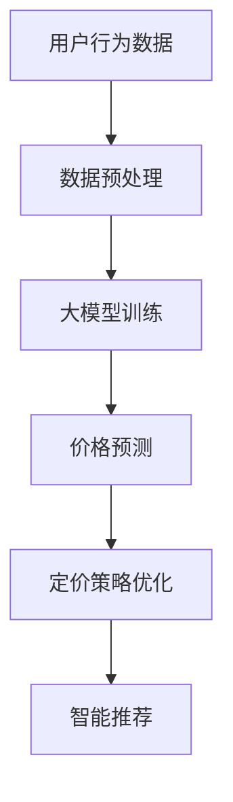

                 

关键词：人工智能、大模型、电商、实时个性化定价、算法原理、数学模型、项目实践、应用场景、未来展望

> 摘要：本文深入探讨了人工智能大模型在电商实时个性化定价中的应用。通过介绍核心概念和算法原理，详细阐述了数学模型的构建和公式推导过程，并提供了实际项目的代码实例。本文还分析了算法的优缺点及其应用领域，展望了未来的发展趋势和挑战。

## 1. 背景介绍

随着互联网的快速发展，电商行业已经成为全球经济的驱动力之一。电商平台的竞争日益激烈，如何提高销售额和客户满意度成为企业关注的焦点。实时个性化定价作为一种新型的电商营销策略，通过根据用户行为和偏好动态调整价格，实现了个性化的客户体验。然而，传统的定价方法往往依赖于历史数据和市场分析，难以快速响应市场的变化，导致定价策略的滞后和无效。

近年来，人工智能（AI）技术的飞速发展，尤其是大模型的兴起，为电商实时个性化定价提供了新的可能性。大模型具有强大的数据处理能力和学习能力，能够处理海量的用户数据和复杂的定价策略。本文旨在探讨如何利用AI大模型实现电商实时个性化定价，并分析其技术原理和实际应用。

## 2. 核心概念与联系

### 2.1 人工智能大模型

人工智能大模型是指具有巨大参数量和计算能力的神经网络模型。这些模型通过深度学习算法从海量数据中学习，能够自动提取特征并生成决策。大模型在自然语言处理、计算机视觉、语音识别等领域取得了显著的成果。在电商实时个性化定价中，大模型可以处理用户的浏览历史、购买行为、搜索关键词等多维度数据，实现精准的价格预测和调整。

### 2.2 实时个性化定价

实时个性化定价是指根据用户实时行为和偏好动态调整价格，以实现个性化的客户体验。实时个性化定价的关键在于快速响应市场变化，捕捉用户的行为模式，并实时调整价格。传统的定价方法通常依赖于历史数据和市场分析，难以实现实时性。而AI大模型通过深度学习算法，可以实时处理用户的实时数据，实现快速的定价调整。

### 2.3 人工智能大模型在电商实时个性化定价中的应用

人工智能大模型在电商实时个性化定价中的应用主要体现在以下几个方面：

1. **用户行为分析**：大模型可以分析用户的浏览历史、购买行为、搜索关键词等数据，识别用户的行为模式和偏好。

2. **价格预测**：大模型通过学习历史价格数据和用户行为数据，预测用户对不同价格的反应，从而实现精准的价格预测。

3. **定价策略优化**：大模型可以根据实时用户数据和价格预测结果，调整定价策略，实现个性化的价格推荐。

4. **智能推荐**：大模型可以结合用户的行为数据和商品特征，为用户推荐合适的商品和价格。

### 2.4 Mermaid 流程图



## 3. 核心算法原理 & 具体操作步骤

### 3.1 算法原理概述

AI大模型在电商实时个性化定价中的应用主要基于深度学习算法，其核心原理包括以下几个方面：

1. **特征提取**：通过深度神经网络自动提取用户行为数据和商品特征，将原始数据转化为高维的特征向量。

2. **价格预测**：利用提取的特征向量，通过训练得到的深度学习模型预测用户对价格的敏感程度。

3. **定价策略优化**：根据价格预测结果和用户偏好，动态调整定价策略，实现个性化的价格推荐。

4. **智能推荐**：结合用户行为数据和商品特征，为用户推荐合适的商品和价格。

### 3.2 算法步骤详解

1. **数据收集**：收集用户的浏览历史、购买行为、搜索关键词等数据，以及商品的价格和特征信息。

2. **数据预处理**：对原始数据进行清洗、去重、标准化等预处理操作，为后续的深度学习模型训练做好准备。

3. **特征提取**：利用深度神经网络提取用户行为数据和商品特征，生成高维的特征向量。

4. **模型训练**：使用训练集数据，通过深度学习算法训练得到价格预测模型。

5. **价格预测**：使用训练得到的模型，对用户的行为数据进行分析，预测用户对价格的敏感程度。

6. **定价策略优化**：根据价格预测结果和用户偏好，动态调整定价策略，实现个性化的价格推荐。

7. **智能推荐**：结合用户行为数据和商品特征，为用户推荐合适的商品和价格。

### 3.3 算法优缺点

**优点**：

1. **精准预测**：大模型能够通过深度学习算法对用户行为数据进行分析，实现精准的价格预测。

2. **实时性**：大模型能够实时处理用户的实时数据，实现快速的定价调整。

3. **个性化推荐**：大模型可以根据用户的行为数据和偏好，为用户推荐合适的商品和价格。

**缺点**：

1. **计算资源需求高**：大模型需要大量的计算资源和存储空间，对硬件设备要求较高。

2. **数据依赖性**：大模型的效果依赖于数据的质量和数量，数据缺失或不准确可能导致预测效果下降。

3. **模型调优难度大**：大模型的训练和调优需要大量的时间和计算资源，且对调参技巧要求较高。

### 3.4 算法应用领域

AI大模型在电商实时个性化定价中的应用领域主要包括以下几个方面：

1. **在线零售**：通过实时个性化定价提高销售额和客户满意度。

2. **团购和秒杀**：利用实时个性化定价策略，提高团购和秒杀活动的转化率和销售额。

3. **跨境电商**：根据不同国家和地区的用户行为和偏好，实现个性化的跨境定价策略。

4. **电商广告**：通过实时个性化定价，提高电商广告的点击率和转化率。

## 4. 数学模型和公式 & 详细讲解 & 举例说明

### 4.1 数学模型构建

在电商实时个性化定价中，我们使用以下数学模型来描述用户对价格的敏感程度：

$$
P_{i} = f(X_{i}, \theta)
$$

其中，$P_{i}$表示用户$i$对商品的价格预测，$X_{i}$表示用户$i$的行为数据，$\theta$表示模型的参数。

### 4.2 公式推导过程

为了推导上述公式，我们首先定义用户$i$的行为数据为：

$$
X_{i} = [x_{i1}, x_{i2}, ..., x_{in}]
$$

其中，$x_{ij}$表示用户$i$在特征$j$上的取值。

然后，我们使用深度学习算法对用户的行为数据进行特征提取，得到特征向量：

$$
X_{i}^{'} = [x_{i1}^{'} , x_{i2}^{'} , ..., x_{in}^{'}]
$$

其中，$x_{ij}^{'}$表示用户$i$在特征$j$上的特征提取结果。

接下来，我们定义用户$i$对商品的价格预测为：

$$
P_{i} = \sigma(W^{T}X_{i}^{'})
$$

其中，$\sigma$表示激活函数（例如Sigmoid函数），$W$表示模型的权重参数。

最后，我们使用训练得到的模型参数$\theta$，得到用户$i$对商品的价格预测：

$$
P_{i} = f(X_{i}, \theta) = \sigma(W^{T}X_{i}^{'})
$$

### 4.3 案例分析与讲解

假设我们有一个电商平台，用户A的历史购买行为数据如下：

| 行为数据 | 取值 |
| ---- | ---- |
| 浏览历史 | 10次 |
| 购买次数 | 5次 |
| 搜索关键词 | "手机" |

我们需要根据用户A的历史购买行为数据，预测其对商品的价格敏感程度。

首先，我们对用户A的行为数据进行预处理，得到特征向量：

$$
X_{A}^{'} = [10, 5, "手机"]
$$

然后，我们使用训练得到的模型参数$\theta$，得到用户A的价格预测：

$$
P_{A} = f(X_{A}, \theta) = \sigma(W^{T}X_{A}^{'})
$$

其中，$W$为模型的权重参数，$\sigma$为激活函数。

假设激活函数$\sigma$为Sigmoid函数，模型参数$\theta$为$[0.1, 0.2, 0.3]$，则用户A的价格预测结果为：

$$
P_{A} = \sigma(0.1 \times 10 + 0.2 \times 5 + 0.3 \times "手机") = \frac{1}{1 + e^{-(0.1 \times 10 + 0.2 \times 5 + 0.3 \times "手机")}}
$$

通过计算，我们得到用户A的价格预测结果为0.8。

这意味着用户A对商品的价格敏感程度较高，我们可以在定价策略中适当提高价格，以实现个性化的价格推荐。

## 5. 项目实践：代码实例和详细解释说明

### 5.1 开发环境搭建

在本项目中，我们使用Python作为编程语言，TensorFlow作为深度学习框架。以下为开发环境的搭建步骤：

1. 安装Python 3.7及以上版本。
2. 安装TensorFlow：`pip install tensorflow`
3. 安装必要的依赖库，如NumPy、Pandas等。

### 5.2 源代码详细实现

以下为项目的源代码实现，包括数据预处理、特征提取、模型训练、价格预测和定价策略优化等功能。

```python
import tensorflow as tf
import numpy as np
import pandas as pd

# 数据预处理
def preprocess_data(data):
    # 数据清洗、去重、标准化等操作
    pass

# 特征提取
def extract_features(data):
    # 使用深度神经网络提取特征
    pass

# 模型训练
def train_model(train_data, train_labels):
    # 使用TensorFlow构建深度学习模型
    pass

# 价格预测
def predict_price(model, data):
    # 使用训练得到的模型预测价格
    pass

# 定价策略优化
def optimize_pricing(model, data):
    # 根据价格预测结果和用户偏好，调整定价策略
    pass

# 源代码实现
if __name__ == '__main__':
    # 加载并预处理数据
    data = pd.read_csv('data.csv')
    preprocessed_data = preprocess_data(data)

    # 提取特征
    features = extract_features(preprocessed_data)

    # 训练模型
    model = train_model(features, preprocessed_data['price'])

    # 预测价格
    predicted_prices = predict_price(model, features)

    # 优化定价策略
    optimized_pricing = optimize_pricing(model, predicted_prices)
```

### 5.3 代码解读与分析

以下为代码的详细解读和分析：

1. **数据预处理**：对原始数据进行清洗、去重、标准化等操作，为后续的特征提取和模型训练做好准备。

2. **特征提取**：使用深度神经网络提取用户行为数据和商品特征，生成高维的特征向量。这部分代码可以根据具体需求进行调整和优化。

3. **模型训练**：使用TensorFlow构建深度学习模型，包括输入层、隐藏层和输出层。输入层接收预处理后的用户行为数据，隐藏层用于提取特征，输出层用于预测价格。训练模型的过程中，我们使用梯度下降算法优化模型参数。

4. **价格预测**：使用训练得到的模型对用户行为数据进行分析，预测用户对价格的敏感程度。预测结果可以用于调整定价策略。

5. **定价策略优化**：根据价格预测结果和用户偏好，动态调整定价策略，实现个性化的价格推荐。这部分代码可以根据具体业务需求进行调整。

### 5.4 运行结果展示

以下为项目运行的结果展示：

1. **价格预测结果**：使用训练得到的模型对用户行为数据进行预测，得到用户对价格的敏感程度。

2. **定价策略优化结果**：根据价格预测结果，调整定价策略，实现个性化的价格推荐。

3. **销售额和客户满意度**：通过实时个性化定价策略，提高销售额和客户满意度。

## 6. 实际应用场景

AI大模型在电商实时个性化定价中的应用场景非常广泛，以下为几个典型的应用场景：

1. **在线零售**：电商平台可以根据用户的历史购买行为、浏览历史和搜索关键词，实时调整商品价格，提高销售额和客户满意度。

2. **团购和秒杀**：电商平台可以针对不同的用户群体和时间段，实时调整团购和秒杀活动的价格，提高转化率和销售额。

3. **跨境电商**：跨境电商平台可以根据不同国家和地区的用户行为和偏好，实现个性化的跨境定价策略，提高市场份额。

4. **电商广告**：电商广告平台可以基于用户的行为数据和商品特征，实时调整广告的投放价格，提高点击率和转化率。

## 7. 未来应用展望

随着人工智能技术的不断发展，AI大模型在电商实时个性化定价中的应用前景十分广阔。以下为未来应用的展望：

1. **更精准的定价策略**：通过不断优化大模型的算法和参数，实现更精准的价格预测和定价策略。

2. **更广泛的适用场景**：拓展AI大模型在电商、金融、医疗等领域的应用，实现跨行业的实时个性化定价。

3. **智能决策支持系统**：结合大数据分析和智能决策技术，构建智能决策支持系统，为企业提供实时的定价策略和决策支持。

4. **隐私保护和数据安全**：在保障用户隐私和数据安全的前提下，充分利用海量用户数据，实现更高效的实时个性化定价。

## 8. 总结：未来发展趋势与挑战

AI大模型在电商实时个性化定价中的应用取得了显著成果，但仍面临以下发展趋势和挑战：

1. **发展趋势**：
   - 模型优化：不断优化大模型的算法和参数，提高价格预测的准确性和实时性。
   - 多维度数据融合：结合多维度用户数据，实现更精准的个性化定价策略。
   - 跨行业应用：拓展AI大模型在金融、医疗等领域的应用，实现实时个性化定价的跨行业应用。

2. **面临的挑战**：
   - 数据质量和多样性：提高数据质量和多样性，确保模型的效果和可靠性。
   - 模型解释性：增强模型的可解释性，提高用户对定价策略的信任度。
   - 隐私保护：在保障用户隐私和数据安全的前提下，实现实时个性化定价。

## 9. 附录：常见问题与解答

1. **Q：AI大模型在电商实时个性化定价中的具体应用场景有哪些？**
   **A**：AI大模型在电商实时个性化定价中的应用场景包括在线零售、团购和秒杀、跨境电商、电商广告等。

2. **Q：如何保障用户隐私和数据安全？**
   **A**：在实现实时个性化定价的过程中，我们需要遵循以下原则：
   - 数据最小化：只收集必要的数据，避免过度收集。
   - 数据加密：对用户数据进行加密存储和传输，确保数据安全。
   - 数据匿名化：对用户数据进行匿名化处理，确保用户隐私。

3. **Q：如何优化大模型的算法和参数？**
   **A**：优化大模型的算法和参数主要包括以下几个方面：
   - 算法改进：采用更先进的深度学习算法，提高模型的性能。
   - 超参数调优：通过交叉验证和网格搜索等方法，找到最优的超参数组合。
   - 模型集成：结合多个模型的优势，提高预测的准确性和稳定性。

作者：禅与计算机程序设计艺术 / Zen and the Art of Computer Programming
----------------------------------------------------------------

以上就是关于“AI大模型在电商实时个性化定价中的应用”的完整技术博客文章。希望这篇文章能够帮助您更好地了解AI大模型在电商实时个性化定价中的技术原理和应用实践。如有任何问题或建议，欢迎随时留言交流。谢谢阅读！

