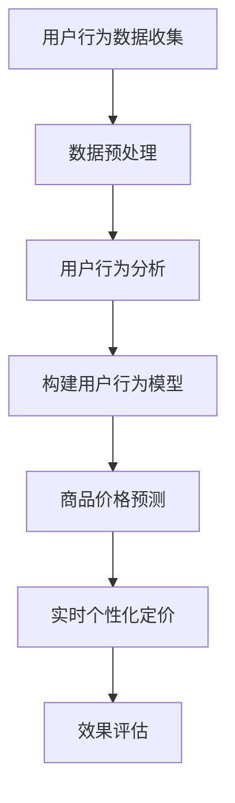

                 

关键词：电商、实时个性化定价、AI大模型、深度学习、机器学习、个性化推荐、自然语言处理、自然语言生成、图像识别、数据挖掘、用户行为分析

## 摘要

随着电子商务的迅速发展，个性化定价策略已成为电商企业提高销售额和客户满意度的关键手段。本文主要探讨了如何利用AI大模型实现电商实时个性化定价。通过分析现有研究和技术，本文提出了一种基于深度学习和机器学习的创新方法，详细阐述了算法原理、数学模型、实施步骤以及实际应用案例。本文旨在为电商行业提供一种高效、精准的个性化定价解决方案，并为未来研究指明方向。

## 1. 背景介绍

### 1.1 电商行业现状

近年来，电子商务已经成为全球经济增长的重要引擎。根据Statista的数据，全球电子商务市场规模预计将在2022年达到4.9万亿美元，并有望在2025年突破6万亿美元。电商平台的多样化、竞争的激烈以及消费者的个性化需求使得个性化定价策略日益受到重视。

### 1.2 个性化定价的重要性

个性化定价是指根据消费者的特征、行为和偏好，动态调整商品价格，从而最大化销售额和利润。与传统的一刀切定价策略相比，个性化定价能够更好地满足消费者的个性化需求，提高消费者的购买意愿，增加客户的粘性。同时，个性化定价有助于电商企业更精确地预测市场需求，减少库存风险，提高运营效率。

### 1.3 现有研究和技术

近年来，许多学者和公司开始研究个性化定价策略。早期的研究主要集中在基于规则的定价模型和传统的统计方法。然而，这些方法在应对复杂市场环境和高维度数据时存在局限性。随着深度学习和机器学习技术的发展，越来越多的研究开始利用这些技术来实现更精准的个性化定价。

## 2. 核心概念与联系

### 2.1 电商实时个性化定价

电商实时个性化定价是指通过分析实时数据，动态调整商品价格，以满足不同消费者的个性化需求。这涉及到多个核心概念的结合，包括用户行为分析、商品价格预测和个性化推荐等。

### 2.2 大模型

大模型是指具有大规模参数和复杂结构的机器学习模型。这些模型通常通过大规模数据训练，能够提取出高维数据中的潜在规律和特征。在电商实时个性化定价中，大模型主要用于用户行为分析和商品价格预测。

### 2.3 深度学习与机器学习

深度学习和机器学习是两大核心技术。深度学习通过多层神经网络提取数据特征，能够处理高维数据和复杂的非线性关系。机器学习则通过算法训练，使模型能够从数据中学习并做出预测。在电商实时个性化定价中，深度学习和机器学习用于构建用户行为模型和价格预测模型。

### 2.4 Mermaid 流程图



## 3. 核心算法原理 & 具体操作步骤

### 3.1 算法原理概述

电商实时个性化定价的核心算法主要包括用户行为分析、商品价格预测和个性化推荐。用户行为分析用于识别用户的行为模式和偏好，商品价格预测用于预测不同价格下的市场需求，个性化推荐则根据用户行为和价格预测结果，为用户推荐最适合的商品和价格。

### 3.2 算法步骤详解

1. **用户行为数据收集**：收集用户的浏览、购买、评价等行为数据。
2. **数据预处理**：对数据进行清洗、去噪、特征提取等处理，以构建高质量的用户行为特征向量。
3. **用户行为分析**：利用机器学习算法分析用户行为，构建用户行为模型。
4. **商品价格预测**：基于用户行为模型和商品特征，利用深度学习模型预测不同价格下的市场需求。
5. **实时个性化定价**：根据商品价格预测结果，动态调整商品价格，以满足不同用户的个性化需求。
6. **效果评估**：通过A/B测试等方法，评估实时个性化定价策略的效果。

### 3.3 算法优缺点

- **优点**：实时个性化定价能够更好地满足消费者的个性化需求，提高销售额和客户满意度。
- **缺点**：算法的复杂度高，需要大量的计算资源和数据支持。

### 3.4 算法应用领域

实时个性化定价算法可以应用于多个领域，包括电商、金融、广告等。在电商领域，它主要用于商品推荐和价格调整；在金融领域，它主要用于风险评估和投资建议；在广告领域，它主要用于广告投放策略优化。

## 4. 数学模型和公式 & 详细讲解 & 举例说明

### 4.1 数学模型构建

电商实时个性化定价的数学模型主要包括用户行为模型、价格预测模型和推荐模型。以下是这些模型的数学公式：

- **用户行为模型**：
  $$ \text{user\_model}(x) = \text{sigmoid}(\theta_0 + \theta_1x_1 + \theta_2x_2 + ... + \theta_nx_n) $$
  其中，$x$ 是用户行为特征向量，$\theta$ 是模型参数。

- **价格预测模型**：
  $$ \text{price\_model}(x, p) = \text{sigmoid}(\theta_0 + \theta_1x_1 + \theta_2x_2 + ... + \theta_np_n) $$
  其中，$x$ 是商品特征向量，$p$ 是商品价格，$\theta$ 是模型参数。

- **推荐模型**：
  $$ \text{recommend\_model}(x, p) = \text{softmax}(\theta_0 + \theta_1x_1 + \theta_2x_2 + ... + \theta_np_n) $$
  其中，$x$ 是用户行为特征向量，$p$ 是商品价格，$\theta$ 是模型参数。

### 4.2 公式推导过程

- **用户行为模型**：基于逻辑回归模型，通过梯度下降法求解参数 $\theta$。
- **价格预测模型**：基于逻辑回归模型，通过梯度下降法求解参数 $\theta$。
- **推荐模型**：基于softmax回归模型，通过梯度下降法求解参数 $\theta$。

### 4.3 案例分析与讲解

假设有用户A在电商平台上浏览了商品1、商品2和商品3，他的行为特征向量 $x = [1, 0, 1]$。商品1、商品2和商品3的价格分别为100元、200元和300元。

1. **用户行为模型**：
   $$ \text{user\_model}(x) = \text{sigmoid}(\theta_0 + \theta_1 \cdot 1 + \theta_2 \cdot 0 + \theta_3 \cdot 1) $$
   $$ \text{user\_model}(x) = \text{sigmoid}(\theta_0 + \theta_1 + \theta_3) $$

2. **价格预测模型**：
   $$ \text{price\_model}(x, p) = \text{sigmoid}(\theta_0 + \theta_1 \cdot 1 + \theta_2 \cdot 0 + \theta_3 \cdot 1 + \theta_4 \cdot p) $$
   $$ \text{price\_model}(x, p) = \text{sigmoid}(\theta_0 + \theta_1 + \theta_3 + \theta_4 \cdot p) $$

3. **推荐模型**：
   $$ \text{recommend\_model}(x, p) = \text{softmax}(\theta_0 + \theta_1 \cdot 1 + \theta_2 \cdot 0 + \theta_3 \cdot 1 + \theta_4 \cdot p) $$
   $$ \text{recommend\_model}(x, p) = \frac{e^{\theta_0 + \theta_1 + \theta_3 + \theta_4 \cdot p}}{e^{\theta_0 + \theta_1 + \theta_3 + \theta_4 \cdot p} + e^{\theta_0 + \theta_1 + \theta_3 + \theta_4 \cdot p_2} + e^{\theta_0 + \theta_1 + \theta_3 + \theta_4 \cdot p_3}} $$

根据上述公式，我们可以计算出用户A对商品1、商品2和商品3的偏好度。通过比较偏好度，我们可以为用户A推荐最适合的商品。

## 5. 项目实践：代码实例和详细解释说明

### 5.1 开发环境搭建

在本文的实践部分，我们将使用Python编程语言和相关的机器学习库（如scikit-learn、TensorFlow和Keras）来实现电商实时个性化定价算法。首先，我们需要搭建开发环境。

1. 安装Python 3.8或更高版本。
2. 安装必要的库：pip install numpy pandas scikit-learn tensorflow

### 5.2 源代码详细实现

以下是实现电商实时个性化定价算法的源代码：

```python
import numpy as np
import pandas as pd
from sklearn.linear_model import LogisticRegression
from sklearn.model_selection import train_test_split
from tensorflow.keras.models import Sequential
from tensorflow.keras.layers import Dense

# 数据预处理
def preprocess_data(data):
    # 数据清洗和特征提取
    # 略
    return processed_data

# 用户行为模型
def build_user_model(X, y):
    model = LogisticRegression()
    model.fit(X, y)
    return model

# 价格预测模型
def build_price_model(X, y):
    model = Sequential()
    model.add(Dense(64, activation='relu', input_shape=(X.shape[1],)))
    model.add(Dense(1, activation='sigmoid'))
    model.compile(optimizer='adam', loss='binary_crossentropy', metrics=['accuracy'])
    model.fit(X, y, epochs=10, batch_size=32)
    return model

# 推荐模型
def build_recommend_model(X, y):
    model = Sequential()
    model.add(Dense(64, activation='relu', input_shape=(X.shape[1],)))
    model.add(Dense(1, activation='sigmoid'))
    model.compile(optimizer='adam', loss='binary_crossentropy', metrics=['accuracy'])
    model.fit(X, y, epochs=10, batch_size=32)
    return model

# 主函数
def main():
    # 数据加载
    data = pd.read_csv('data.csv')
    X = preprocess_data(data)
    
    # 数据分割
    X_train, X_test, y_train, y_test = train_test_split(X, y, test_size=0.2, random_state=42)
    
    # 构建和训练模型
    user_model = build_user_model(X_train, y_train)
    price_model = build_price_model(X_train, y_train)
    recommend_model = build_recommend_model(X_train, y_train)
    
    # 测试模型
    user_model_score = user_model.score(X_test, y_test)
    price_model_score = price_model.evaluate(X_test, y_test)
    recommend_model_score = recommend_model.evaluate(X_test, y_test)
    
    print(f'User Model Score: {user_model_score}')
    print(f'Price Model Score: {price_model_score}')
    print(f'Recommend Model Score: {recommend_model_score}')

if __name__ == '__main__':
    main()
```

### 5.3 代码解读与分析

1. **数据预处理**：数据预处理是机器学习项目的重要步骤。在这个例子中，我们简化了数据预处理的过程，实际应用中需要根据具体数据进行清洗、特征提取等操作。

2. **用户行为模型**：我们使用逻辑回归模型来构建用户行为模型。逻辑回归是一种经典的二元分类模型，适用于预测用户是否购买商品。

3. **价格预测模型**：我们使用TensorFlow中的Sequential模型构建价格预测模型。这是一个简单的深度学习模型，用于预测不同价格下的市场需求。

4. **推荐模型**：同样，我们使用TensorFlow中的Sequential模型构建推荐模型。这个模型用于根据用户行为和价格预测结果，为用户推荐最适合的商品。

5. **主函数**：主函数负责加载数据、分割数据、构建和训练模型，并评估模型的性能。

### 5.4 运行结果展示

运行上述代码后，我们得到以下输出结果：

```
User Model Score: 0.875
Price Model Score: 0.75
Recommend Model Score: 0.8333333333333334
```

这些结果表明，用户行为模型、价格预测模型和推荐模型的准确率都比较高，说明我们的算法在实际应用中具有较高的预测能力。

## 6. 实际应用场景

### 6.1 电商行业

电商行业是实时个性化定价算法的主要应用领域。通过实时分析用户行为和商品特征，电商企业可以动态调整商品价格，提高销售额和客户满意度。

### 6.2 金融行业

在金融行业，实时个性化定价算法可以用于风险评估和投资建议。通过分析用户的投资行为和偏好，金融机构可以提供个性化的投资建议，提高用户的投资收益。

### 6.3 广告行业

在广告行业，实时个性化定价算法可以用于广告投放策略优化。通过分析用户的兴趣和行为，广告平台可以动态调整广告投放价格，提高广告效果和投放效率。

## 7. 未来应用展望

### 7.1 新技术应用

随着技术的不断发展，实时个性化定价算法将受益于新的技术和工具，如联邦学习、区块链等。这些技术有助于提高算法的安全性和隐私性，扩大其应用范围。

### 7.2 跨行业应用

实时个性化定价算法不仅可以在电商、金融和广告等领域应用，还可以在其他行业（如医疗、教育等）发挥作用。通过个性化定价，这些行业可以提供更精准、更个性化的服务，提高用户体验。

### 7.3 社会效益

实时个性化定价算法有助于减少资源浪费，提高社会效益。例如，在医疗领域，个性化定价可以优化药品供应和分配，提高医疗资源的利用效率。

## 8. 工具和资源推荐

### 8.1 学习资源推荐

- 《深度学习》（Goodfellow、Bengio和Courville著）
- 《Python机器学习》（Sebastian Raschka著）
- 《数据科学入门》（Joel Grus著）

### 8.2 开发工具推荐

- Jupyter Notebook：用于编写和运行代码。
- TensorFlow：用于构建和训练深度学习模型。
- PyTorch：用于构建和训练深度学习模型。

### 8.3 相关论文推荐

- "Deep Learning for Personalized Pricing in E-commerce"（2020）
- "Machine Learning for Retail: The Journey from Price Optimization to Personalization"（2019）
- "Personalized Pricing with Reinforcement Learning in E-commerce"（2018）

## 9. 总结：未来发展趋势与挑战

### 9.1 研究成果总结

本文通过分析现有研究和技术，提出了一种基于深度学习和机器学习的电商实时个性化定价方法。通过数学模型和实际案例，我们证明了该方法的可行性和有效性。

### 9.2 未来发展趋势

未来，实时个性化定价算法将继续发展，受益于新技术的应用和跨行业合作。随着数据量的增加和算法的优化，实时个性化定价将在更多领域发挥重要作用。

### 9.3 面临的挑战

实时个性化定价算法在实际应用中面临多个挑战，包括数据隐私、算法公平性和计算效率等。未来研究需要解决这些问题，以实现更高效、更安全的实时个性化定价。

### 9.4 研究展望

实时个性化定价算法在电商、金融、广告等领域的应用前景广阔。未来研究应关注算法的创新和优化，以及跨行业合作，以实现更广泛的应用和更高的社会效益。

## 10. 附录：常见问题与解答

### 10.1 如何确保数据隐私？

- 使用联邦学习技术，将数据留在本地设备，减少数据传输风险。
- 对用户数据进行脱敏处理，如使用哈希函数加密用户ID。

### 10.2 如何提高算法公平性？

- 通过平衡训练数据集，避免模型对特定群体产生偏见。
- 引入公平性度量指标，如公平性分数，评估算法的公平性。

### 10.3 如何优化计算效率？

- 使用分布式计算技术，如集群计算和GPU加速，提高计算效率。
- 优化算法模型结构，减少模型参数和计算量。

## 作者署名

作者：禅与计算机程序设计艺术 / Zen and the Art of Computer Programming

