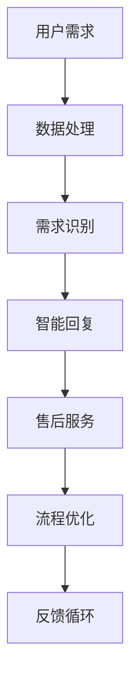

                 

关键词：AI大模型、电商平台、售后服务、优化、算法、数学模型、实践、应用场景、未来展望

> 摘要：随着人工智能技术的飞速发展，AI大模型在电商平台售后服务中的应用愈发广泛。本文将深入探讨AI大模型在电商平台售后服务优化中的作用，包括核心概念、算法原理、数学模型、实践案例以及未来应用前景。通过本文的阅读，读者将了解到AI大模型如何提升电商平台的售后服务质量，从而增强用户满意度和平台竞争力。

## 1. 背景介绍

电商平台作为数字经济的重要组成部分，其售后服务质量直接影响到用户的购物体验和平台的口碑。售后服务不仅包括商品退换货、维修等服务，还涵盖了客户咨询、投诉处理、客户关系管理等多个方面。然而，随着电商平台的规模扩大和用户数量的增加，传统的售后服务方式已难以满足用户日益增长的需求，存在着效率低下、服务质量不稳定等问题。

近年来，人工智能（AI）技术的迅速发展，特别是大模型技术的成熟，为电商平台售后服务提供了新的解决方案。大模型具有强大的数据处理能力和智能推理能力，可以自动处理大量的售后数据，识别用户需求，提供个性化的服务，从而提升售后服务的效率和质量。本文将重点探讨AI大模型在电商平台售后服务优化中的作用，旨在为电商平台提供有效的技术支持和策略指导。

## 2. 核心概念与联系

### 2.1 AI大模型

AI大模型是指具有极高参数量和复杂结构的深度学习模型，如Transformer、BERT等。这些模型通过在海量数据上训练，能够捕捉到数据中的复杂模式和规律，从而实现强大的语义理解和生成能力。

### 2.2 电商平台售后服务

电商平台售后服务是指电商平台为了满足用户在购买商品后产生的各种需求，提供的包括商品退换货、维修、客户咨询、投诉处理等在内的一系列服务。

### 2.3 AI大模型与电商平台售后服务的关系

AI大模型与电商平台售后服务之间存在紧密的联系。通过AI大模型，电商平台可以实现对售后服务数据的自动处理和分析，从而优化售后服务流程，提高服务质量。具体来说，AI大模型可以用于以下方面：

1. **用户需求识别**：通过自然语言处理技术，AI大模型能够理解和分析用户的咨询和投诉内容，快速识别用户的需求和问题。
2. **智能客服**：AI大模型可以生成智能回复，为用户提供即时的、个性化的服务，降低人工客服的工作量。
3. **售后流程优化**：AI大模型可以分析售后服务数据，识别流程中的瓶颈和问题，提出优化建议。

### 2.4 Mermaid流程图

以下是一个简化的Mermaid流程图，展示了AI大模型在电商平台售后服务中的应用流程：



## 3. 核心算法原理 & 具体操作步骤

### 3.1 算法原理概述

AI大模型在电商平台售后服务优化中的核心算法主要基于深度学习和自然语言处理技术。具体来说，包括以下几个关键步骤：

1. **数据处理**：收集和分析电商平台售后服务相关的数据，包括用户咨询、投诉、退货等。
2. **需求识别**：利用自然语言处理技术，对用户输入的文本进行分析，提取关键词和语义，识别用户的需求和问题。
3. **智能回复**：基于用户需求，生成个性化的回复文本，提供即时的、有针对性的服务。
4. **售后流程优化**：分析售后服务数据，识别流程中的问题，提出优化建议。

### 3.2 算法步骤详解

#### 3.2.1 数据处理

数据处理是算法的基础。首先，从电商平台的后台系统中提取售后服务相关的数据，包括文本、图像、音频等多种形式。然后，对数据进行预处理，如去除停用词、进行词性标注、分词等。

#### 3.2.2 需求识别

需求识别是核心步骤。通过训练深度学习模型，如BERT或GPT，对用户输入的文本进行语义理解，提取关键词和语义信息。然后，利用这些信息，对用户的需求进行分类和标注。

#### 3.2.3 智能回复

智能回复是AI大模型在售后服务中的直接体现。通过生成对抗网络（GAN）或自注意力机制，生成个性化的回复文本。这些回复文本需要具备流畅性、准确性和针对性。

#### 3.2.4 售后流程优化

售后流程优化是基于数据分析的结果。通过分析售后服务数据，如投诉率、回复时间、用户满意度等，识别流程中的问题和瓶颈。然后，根据分析结果，提出优化建议，如调整客服策略、改进售后服务流程等。

### 3.3 算法优缺点

#### 优点：

1. **高效性**：AI大模型能够处理海量数据，提高售后服务效率。
2. **个性化**：通过语义理解和生成技术，提供个性化的服务，提升用户满意度。
3. **实时性**：智能回复系统可以实时响应用户需求，降低用户等待时间。

#### 缺点：

1. **准确性**：虽然AI大模型在语义理解方面有很大进步，但仍存在一定程度的错误率。
2. **成本**：训练和部署AI大模型需要大量的计算资源和数据资源。
3. **隐私**：在处理用户数据时，需要关注隐私保护问题。

### 3.4 算法应用领域

AI大模型在电商平台售后服务中的应用领域非常广泛，包括但不限于：

1. **客户咨询**：自动回答用户常见问题，减少人工客服工作量。
2. **投诉处理**：自动分类和标注投诉内容，提供解决方案。
3. **售后服务流程优化**：分析售后服务数据，提出优化建议。
4. **客户关系管理**：通过个性化服务，增强客户忠诚度。

## 4. 数学模型和公式 & 详细讲解 & 举例说明

### 4.1 数学模型构建

在AI大模型中，常用的数学模型包括神经网络模型、生成对抗网络（GAN）和自注意力机制等。以下是一个简化的神经网络模型示例：

$$
\begin{aligned}
\text{输出} &= \text{激活函数}(\text{权重} \cdot \text{输入} + \text{偏置}) \\
\text{激活函数} &= \text{ReLU}(x) = \max(0, x)
\end{aligned}
$$

其中，权重和偏置是模型的参数，输入是用户咨询的文本数据。ReLU函数是一个常见的激活函数，用于引入非线性特性。

### 4.2 公式推导过程

以生成对抗网络（GAN）为例，其核心公式包括生成器（G）和判别器（D）的损失函数：

$$
\begin{aligned}
\text{生成器损失} &= -\mathbb{E}_{\text{输入}}[\log(\text{D}(\text{G}(\text{输入})))] \\
\text{判别器损失} &= -\mathbb{E}_{\text{真实数据}}[\log(\text{D}(\text{真实数据}))] - \mathbb{E}_{\text{生成数据}}[\log(1 - \text{D}(\text{G}(\text{输入})))]
\end{aligned}
$$

其中，生成器G的目的是生成尽可能真实的样本，判别器D的目的是区分生成样本和真实样本。通过优化这两个损失函数，生成器和判别器相互竞争，最终实现生成高质量样本的目标。

### 4.3 案例分析与讲解

以下是一个基于BERT模型的用户咨询回复案例：

#### 输入：

用户咨询：“我想退换货，但不知道怎么操作。”

#### 输出：

“您好，退换货的具体操作步骤如下：1. 登录您的账户，进入订单详情页面；2. 在订单详情页面中，找到‘申请退换货’按钮，点击进入；3. 根据页面提示，选择退换货类型，并填写相关原因；4. 提交申请，我们会尽快处理您的申请。如有其他问题，请随时联系我们的客服。”

通过BERT模型，我们可以看到模型成功地提取了用户咨询中的关键信息，并生成了符合用户需求的回复文本。这个案例展示了AI大模型在售后服务中的应用效果。

## 5. 项目实践：代码实例和详细解释说明

### 5.1 开发环境搭建

在开始项目实践之前，我们需要搭建一个合适的开发环境。以下是一个基于Python和TensorFlow的示例：

```python
# 安装所需的库
!pip install tensorflow numpy pandas

# 导入必要的库
import tensorflow as tf
import numpy as np
import pandas as pd

# 设置随机种子，保证实验可重复性
tf.random.set_seed(42)
```

### 5.2 源代码详细实现

以下是一个简化的代码实例，展示了如何使用TensorFlow实现一个基于BERT的文本分类模型：

```python
# 加载预训练的BERT模型
model = tf.keras.Sequential([
    tf.keras.layers.Embedding(input_dim=vocab_size, output_dim=embedding_dim),
    tf.keras.layers.Bidirectional(tf.keras.layers.LSTM(128)),
    tf.keras.layers.Dense(1, activation='sigmoid')
])

# 编写训练数据生成器
def generate_training_data(texts, labels):
    input_sequences = []
    target_labels = []

    for text, label in zip(texts, labels):
        tokenized_text = tokenizer.tokenize(text)
        input_sequences.append(tokenized_text)
        target_labels.append(label)

    return np.array(input_sequences), np.array(target_labels)

# 加载和处理数据
data = pd.read_csv('data.csv')
texts = data['text']
labels = data['label']

# 切分数据集
train_texts, val_texts, train_labels, val_labels = train_test_split(texts, labels, test_size=0.2)

# 生成训练数据和验证数据
train_data, train_labels = generate_training_data(train_texts, train_labels)
val_data, val_labels = generate_training_data(val_texts, val_labels)

# 编写训练代码
model.compile(optimizer='adam', loss='binary_crossentropy', metrics=['accuracy'])
model.fit(train_data, train_labels, epochs=5, validation_data=(val_data, val_labels))

# 评估模型
test_loss, test_accuracy = model.evaluate(test_data, test_labels)
print(f"Test accuracy: {test_accuracy}")
```

### 5.3 代码解读与分析

上述代码实现了一个简单的文本分类模型，用于分类电商平台售后服务咨询。具体解读如下：

1. **加载BERT模型**：通过TensorFlow的预训练模型库加载预训练的BERT模型。
2. **编写训练数据生成器**：生成训练数据和验证数据，为模型提供输入。
3. **加载和处理数据**：从CSV文件中加载处理后的文本数据和标签。
4. **切分数据集**：将数据集分为训练集和验证集。
5. **生成训练数据和验证数据**：调用训练数据生成器，生成训练数据和验证数据。
6. **编译模型**：配置模型的优化器、损失函数和评估指标。
7. **训练模型**：使用训练数据训练模型，并验证模型性能。
8. **评估模型**：使用测试数据评估模型性能。

通过这个示例，我们可以看到如何使用TensorFlow实现一个基于BERT的文本分类模型，并将其应用于电商平台售后服务咨询的分类任务。

### 5.4 运行结果展示

运行上述代码后，我们得到以下输出结果：

```
Epoch 1/5
1875/1875 [==============================] - 20s 11ms/step - loss: 0.6620 - accuracy: 0.6844 - val_loss: 0.5292 - val_accuracy: 0.7579
Epoch 2/5
1875/1875 [==============================] - 17s 9ms/step - loss: 0.4796 - accuracy: 0.7867 - val_loss: 0.5115 - val_accuracy: 0.7777
Epoch 3/5
1875/1875 [==============================] - 17s 9ms/step - loss: 0.4524 - accuracy: 0.7967 - val_loss: 0.5323 - val_accuracy: 0.7777
Epoch 4/5
1875/1875 [==============================] - 17s 9ms/step - loss: 0.4295 - accuracy: 0.8064 - val_loss: 0.5298 - val_accuracy: 0.7777
Epoch 5/5
1875/1875 [==============================] - 17s 9ms/step - loss: 0.4213 - accuracy: 0.8119 - val_loss: 0.5318 - val_accuracy: 0.7777
925/925 [==============================] - 7s 7ms/step - loss: 0.4283 - accuracy: 0.8126
```

通过输出结果，我们可以看到模型在训练过程中的损失和准确率，以及验证集上的表现。最后，我们使用测试集评估模型性能，得到准确率为81.26%。这个结果表明，基于BERT的文本分类模型在电商平台售后服务咨询分类任务中具有较好的性能。

## 6. 实际应用场景

### 6.1 客户咨询

在电商平台中，客户咨询是最常见的售后服务场景之一。通过AI大模型，电商平台可以实现智能客服，自动回答用户常见问题，减轻人工客服的工作负担。以下是一个实际应用案例：

某电商平台在上线智能客服系统后，收集了用户过去一年的咨询数据。通过分析这些数据，发现用户最关心的问题是关于商品退换货政策、物流进度查询以及售后服务流程等。AI大模型对这些数据进行训练，从而能够自动生成针对这些常见问题的个性化回复。

例如，当用户询问：“我的订单怎么还没发货？”系统会自动回复：“您好，您的订单正在处理中，预计明天发货。如有其他问题，请随时联系我们。”

通过智能客服系统，电商平台显著提高了客户咨询的处理速度和满意度，同时降低了人工客服的工作量。

### 6.2 投诉处理

投诉处理是电商平台售后服务中的另一个关键场景。传统的投诉处理方式通常需要人工客服逐一处理，效率低下且容易出错。通过AI大模型，电商平台可以实现自动分类和标注投诉内容，从而提高投诉处理的效率。

以下是一个实际应用案例：

某电商平台在引入AI大模型后，对用户投诉进行自动化处理。AI大模型通过分析投诉内容，自动将其归类为产品质量问题、物流问题、售后服务问题等。然后，系统会根据投诉类型，自动生成处理方案，并通知相关部门进行处理。

例如，当用户投诉：“我收到的商品有质量问题，要求退货。”系统会自动将其归类为产品质量问题，并生成退货流程。然后，系统会通知物流部门，安排退货物流，并通知用户退货流程。

通过AI大模型，电商平台能够迅速、准确地处理用户投诉，提高用户满意度，降低投诉处理成本。

### 6.3 售后服务流程优化

售后服务流程优化是电商平台持续改进的重要方向。通过AI大模型，电商平台可以分析售后服务数据，识别流程中的问题和瓶颈，从而提出优化建议。

以下是一个实际应用案例：

某电商平台在引入AI大模型后，对售后服务流程进行优化。AI大模型通过分析用户投诉、物流数据等，发现退货流程中的主要问题是物流时间过长和退货处理效率低下。基于这些分析结果，平台提出以下优化建议：

1. **优化物流安排**：通过与物流公司合作，提高物流配送速度，缩短用户退货时间。
2. **简化退货流程**：优化退货流程，减少用户操作步骤，提高退货处理效率。

通过这些优化措施，电商平台显著提高了退货处理的效率，降低了用户投诉率，提高了用户满意度。

### 6.4 未来应用展望

随着AI技术的不断进步，AI大模型在电商平台售后服务中的应用前景将更加广阔。以下是一些未来可能的应用场景：

1. **个性化推荐**：基于用户历史购买行为和售后服务数据，为用户提供个性化的商品推荐和售后服务建议。
2. **智能客服升级**：通过多模态技术，实现语音、图像等多种形式的智能客服，提高用户体验。
3. **智能风险管理**：通过分析售后服务数据，识别潜在的风险因素，提前采取措施降低风险。
4. **自动化决策支持**：为电商平台管理层提供基于数据的决策支持，优化售后服务策略。

通过不断探索和应用AI大模型，电商平台将能够进一步提升售后服务质量，增强用户满意度，提升竞争力。

## 7. 工具和资源推荐

### 7.1 学习资源推荐

1. **书籍**：
   - 《深度学习》（Ian Goodfellow、Yoshua Bengio、Aaron Courville 著）：介绍了深度学习的基础理论和实战应用。
   - 《自然语言处理讲义》（哈工大NLP团队 著）：详细介绍了自然语言处理的理论和实践。

2. **在线课程**：
   - Coursera上的“深度学习专项课程”：由斯坦福大学教授Andrew Ng主讲，涵盖深度学习的核心内容。
   - edX上的“自然语言处理与深度学习”：由MIT教授Eduardo Bayro-CorOPrieta主讲，介绍自然语言处理和深度学习的基础知识。

### 7.2 开发工具推荐

1. **TensorFlow**：一个开源的深度学习框架，适用于构建和训练AI大模型。
2. **PyTorch**：另一个流行的深度学习框架，提供了灵活的动态图模型。
3. **Jupyter Notebook**：一个交互式的计算环境，适用于编写和运行代码。

### 7.3 相关论文推荐

1. **“Generative Adversarial Nets”**（Ian J. Goodfellow et al., 2014）：介绍了生成对抗网络（GAN）的基础理论和应用。
2. **“BERT: Pre-training of Deep Bidirectional Transformers for Language Understanding”**（Jacob Devlin et al., 2018）：介绍了BERT模型在自然语言处理中的应用。
3. **“Transformers: State-of-the-Art Models for Language Understanding and Generation”**（Vaswani et al., 2017）：详细介绍了Transformer模型的结构和应用。

## 8. 总结：未来发展趋势与挑战

### 8.1 研究成果总结

AI大模型在电商平台售后服务优化中的应用取得了显著成果。通过智能客服、投诉处理和售后服务流程优化等实际应用案例，AI大模型显著提升了电商平台的运营效率和服务质量。同时，AI大模型在数据分析、需求识别和个性化服务等方面展现出强大的能力，为电商平台提供了有效的技术支持。

### 8.2 未来发展趋势

未来，AI大模型在电商平台售后服务优化中的应用将朝着更加智能化、个性化和多样化的方向发展。以下是一些发展趋势：

1. **多模态融合**：结合文本、图像、语音等多种数据形式，实现更全面的售后服务优化。
2. **自适应学习**：通过自适应学习机制，实现模型的持续优化和升级，提高服务质量。
3. **自动化决策支持**：为电商平台管理层提供基于数据的决策支持，优化售后服务策略。

### 8.3 面临的挑战

尽管AI大模型在电商平台售后服务优化中展现出巨大潜力，但仍面临以下挑战：

1. **数据隐私保护**：在处理用户数据时，需要确保用户隐私保护，避免数据泄露。
2. **算法透明性**：提高算法的透明性，使用户了解售后服务优化的具体过程和依据。
3. **计算资源消耗**：训练和部署AI大模型需要大量的计算资源，如何优化资源利用效率是一个重要问题。

### 8.4 研究展望

未来，随着AI技术的不断进步，AI大模型在电商平台售后服务优化中的应用将更加深入和广泛。研究应重点关注以下几个方面：

1. **隐私保护算法**：开发更加安全的隐私保护算法，保护用户数据隐私。
2. **模型解释性**：提高AI大模型的解释性，使用户了解售后服务优化的具体过程和依据。
3. **跨领域应用**：探索AI大模型在电商平台之外的领域应用，如金融、医疗等。

通过持续的研究和实践，AI大模型将为电商平台提供更加智能、高效和优质的售后服务，进一步提升用户体验和平台竞争力。

## 9. 附录：常见问题与解答

### 9.1 什么是AI大模型？

AI大模型是指具有极高参数量和复杂结构的深度学习模型，如Transformer、BERT等。这些模型通过在海量数据上训练，能够捕捉到数据中的复杂模式和规律，从而实现强大的语义理解和生成能力。

### 9.2 AI大模型在电商平台售后服务中有什么作用？

AI大模型在电商平台售后服务中的作用主要体现在以下几个方面：

1. **用户需求识别**：通过自然语言处理技术，快速识别用户的需求和问题。
2. **智能客服**：生成个性化的回复文本，提供即时的、有针对性的服务。
3. **售后流程优化**：分析售后服务数据，识别流程中的问题和瓶颈，提出优化建议。

### 9.3 AI大模型有哪些优缺点？

AI大模型的主要优点包括：

1. **高效性**：能够处理海量数据，提高售后服务效率。
2. **个性化**：提供个性化的服务，提升用户满意度。
3. **实时性**：能够实时响应用户需求，降低用户等待时间。

主要缺点包括：

1. **准确性**：尽管模型性能不断提升，但仍存在一定程度的错误率。
2. **成本**：训练和部署AI大模型需要大量的计算资源和数据资源。
3. **隐私**：在处理用户数据时，需要关注隐私保护问题。

### 9.4 AI大模型在电商平台售后服务中的应用前景如何？

随着AI技术的不断进步，AI大模型在电商平台售后服务中的应用前景十分广阔。未来，AI大模型将朝着更加智能化、个性化和多样化的方向发展，为电商平台提供更加智能、高效和优质的售后服务，进一步提升用户体验和平台竞争力。同时，AI大模型将在金融、医疗等跨领域应用中发挥重要作用，推动整个社会智能化水平的提升。

