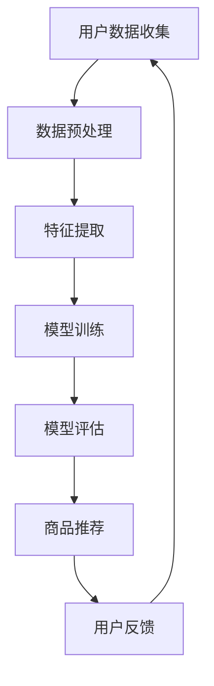

                 

关键词：AI大模型、电商平台、商品组合推荐、个性化推荐、深度学习、数据挖掘

## 摘要

本文将深入探讨人工智能（AI）大模型在电商平台商品组合推荐中的创新应用。随着电商市场的日益繁荣，个性化推荐系统已成为电商平台提高用户满意度和增加销售额的关键因素。本文将首先介绍AI大模型的概念及其在推荐系统中的应用，随后详细分析商品组合推荐的核心算法原理、数学模型和公式，并通过实际项目实践展示其应用效果。最后，我们将展望AI大模型在未来电商平台商品组合推荐领域的应用前景。

## 1. 背景介绍

随着互联网技术的飞速发展和移动互联网的普及，电商市场已经进入了一个全新的时代。电商平台不仅需要满足用户的购物需求，还需要提供个性化的服务来提升用户体验。在这种背景下，商品组合推荐系统应运而生，它通过分析用户的购买历史、浏览行为和兴趣爱好，为用户提供个性化的商品推荐，从而提高用户满意度和增加销售额。

传统的推荐系统主要依赖于协同过滤、基于内容的推荐等算法，但这些方法在处理复杂的用户行为和商品关系时存在一定的局限性。为了应对这一挑战，近年来，人工智能（AI）大模型逐渐成为推荐系统研究的热点。AI大模型通过深度学习等技术，能够从海量数据中挖掘出更复杂的用户行为模式，提供更精准的个性化推荐。

## 2. 核心概念与联系

在介绍AI大模型之前，我们首先需要了解一些核心概念和它们之间的联系。

### 2.1 数据挖掘

数据挖掘是一种通过从大量数据中提取有价值信息的方法。在电商平台中，数据挖掘技术主要用于分析用户的购买行为、浏览习惯和兴趣爱好，从而为个性化推荐提供数据支持。

### 2.2 深度学习

深度学习是一种基于神经网络的学习方法，它能够通过多层非线性变换自动学习数据中的特征和规律。在推荐系统中，深度学习模型可以有效地处理复杂的用户行为数据，从而提高推荐的准确性和个性化程度。

### 2.3 个性化推荐

个性化推荐是一种根据用户的兴趣和偏好为用户提供相关推荐的方法。它通过分析用户的购物历史、浏览记录和社交媒体行为等信息，为用户提供个性化的商品推荐。

### 2.4 AI大模型

AI大模型是指那些拥有海量参数、能够处理大规模数据、具有高度自适应性和泛化能力的人工智能模型。这些模型通常基于深度学习技术，能够从数据中自动学习复杂的特征和规律，从而为推荐系统提供强大的支持。

下面是AI大模型在电商平台商品组合推荐中的应用流程的Mermaid流程图：



### 2.5 用户反馈循环

用户反馈循环是一个不断优化推荐系统的重要环节。通过收集用户的反馈信息，系统可以不断地调整和优化推荐策略，从而提高推荐的准确性和满意度。

## 3. 核心算法原理 & 具体操作步骤

### 3.1 算法原理概述

AI大模型在电商平台商品组合推荐中的应用主要基于深度学习技术。深度学习模型通过多层神经网络的结构，对用户的购买历史、浏览记录和兴趣爱好等信息进行建模，从而预测用户对某种商品组合的偏好。

### 3.2 算法步骤详解

#### 3.2.1 数据收集与预处理

数据收集是整个推荐系统的基础。在电商平台，数据收集主要涉及用户的购买记录、浏览记录、搜索记录和社交媒体行为等。在数据收集完成后，需要对数据进行预处理，包括数据清洗、数据去重和数据格式转换等。

#### 3.2.2 特征提取

特征提取是深度学习模型的关键步骤。通过提取用户的购买历史、浏览记录和兴趣爱好等信息，可以将高维的数据转换为低维的特征向量。这些特征向量将作为深度学习模型的输入。

#### 3.2.3 模型训练

在特征提取完成后，可以使用深度学习模型对特征向量进行训练。训练过程中，模型会通过反向传播算法不断调整参数，以最小化预测误差。常用的深度学习模型包括卷积神经网络（CNN）、循环神经网络（RNN）和Transformer等。

#### 3.2.4 模型评估

模型训练完成后，需要对模型进行评估，以确定其性能。评估指标包括准确率、召回率、F1值等。通过交叉验证和A/B测试等方法，可以全面评估模型的性能。

#### 3.2.5 商品推荐

在模型评估通过后，可以使用训练好的模型进行商品推荐。系统将根据用户的特征向量，预测用户对各种商品组合的偏好，从而生成个性化的推荐列表。

#### 3.2.6 用户反馈

用户反馈是优化推荐系统的重要环节。系统会收集用户的点击、购买、评价等行为，用于调整推荐策略和优化模型参数。

### 3.3 算法优缺点

#### 优点：

- **高度个性化**：AI大模型能够从海量数据中自动学习用户的兴趣和偏好，提供高度个性化的推荐。
- **自适应性强**：模型可以根据用户的反馈和行为实时调整推荐策略，提高推荐的质量和满意度。
- **处理复杂数据**：深度学习模型能够处理高维、非线性、复杂的用户行为数据，提高推荐的准确性和可靠性。

#### 缺点：

- **计算资源需求大**：深度学习模型通常需要大量的计算资源进行训练和推理，对硬件设施要求较高。
- **模型解释性差**：深度学习模型通常具有很好的预测能力，但模型内部的决策过程较为复杂，难以解释。

### 3.4 算法应用领域

AI大模型在电商平台商品组合推荐中的应用非常广泛，除了电商平台外，还广泛应用于在线教育、金融、医疗等众多领域。

## 4. 数学模型和公式 & 详细讲解 & 举例说明

### 4.1 数学模型构建

在深度学习推荐系统中，常用的数学模型是多层感知机（MLP）和循环神经网络（RNN）。下面我们将分别介绍这两种模型的数学模型和公式。

#### 4.1.1 多层感知机（MLP）

多层感知机是一种前馈神经网络，由输入层、隐藏层和输出层组成。其基本原理是通过加权求和和激活函数来模拟人脑神经元的工作方式。

- 输入层：接收用户的特征向量。
- 隐藏层：通过加权求和和激活函数对输入特征进行变换。
- 输出层：输出用户对商品组合的预测概率。

多层感知机的数学模型可以表示为：

$$
Z^{(l)} = \sum_{j=1}^{n} w^{(l)}_{j}x^{(l-1)} + b^{(l)}
$$

$$
a^{(l)} = \sigma(Z^{(l)})
$$

其中，$Z^{(l)}$ 是第 $l$ 层的加权求和结果，$a^{(l)}$ 是第 $l$ 层的激活值，$w^{(l)}_{j}$ 是第 $l$ 层第 $j$ 个神经元的权重，$b^{(l)}$ 是第 $l$ 层的偏置项，$\sigma$ 是激活函数。

常用的激活函数包括 sigmoid、ReLU 和 tanh 等。

#### 4.1.2 循环神经网络（RNN）

循环神经网络是一种能够处理序列数据的神经网络，其基本原理是通过隐藏状态和反馈连接来模拟人脑神经元的工作方式。

- 隐藏状态：保存前一个时刻的信息。
- 输入层：接收当前时刻的特征向量。
- 输出层：输出当前时刻的预测结果。

循环神经网络的数学模型可以表示为：

$$
h^{(t)} = \sigma(W_h \cdot [h^{(t-1)}, x^{(t)}] + b_h)
$$

$$
y^{(t)} = \sigma(W_y \cdot h^{(t)} + b_y)
$$

其中，$h^{(t)}$ 是第 $t$ 时刻的隐藏状态，$x^{(t)}$ 是第 $t$ 时刻的特征向量，$y^{(t)}$ 是第 $t$ 时刻的输出结果，$W_h$ 和 $W_y$ 是权重矩阵，$b_h$ 和 $b_y$ 是偏置项，$\sigma$ 是激活函数。

### 4.2 公式推导过程

下面我们将分别介绍多层感知机和循环神经网络的公式推导过程。

#### 4.2.1 多层感知机（MLP）

多层感知机的公式推导过程如下：

假设输入层有 $n$ 个神经元，隐藏层有 $m$ 个神经元，输出层有 $k$ 个神经元。

1. 输入层到隐藏层的计算：

$$
Z^{(1)} = \sum_{i=1}^{n} w_{i}x_i + b_1
$$

$$
a^{(1)} = \sigma(Z^{(1)})
$$

2. 隐藏层到输出层的计算：

$$
Z^{(2)} = \sum_{j=1}^{m} w_{j}a^{(1)}_j + b_2
$$

$$
a^{(2)} = \sigma(Z^{(2)})
$$

其中，$w_{i}$ 和 $w_{j}$ 分别是输入层到隐藏层、隐藏层到输出层的权重，$b_1$ 和 $b_2$ 分别是输入层和隐藏层的偏置项，$\sigma$ 是激活函数。

#### 4.2.2 循环神经网络（RNN）

循环神经网络的公式推导过程如下：

假设输入层有 $n$ 个神经元，隐藏层有 $m$ 个神经元，输出层有 $k$ 个神经元。

1. 隐藏状态的计算：

$$
h^{(t)} = \sigma(W_h \cdot [h^{(t-1)}, x^{(t)}] + b_h)
$$

2. 输出结果的计算：

$$
y^{(t)} = \sigma(W_y \cdot h^{(t)} + b_y)
$$

其中，$W_h$ 和 $W_y$ 分别是隐藏状态和输出结果的权重矩阵，$b_h$ 和 $b_y$ 分别是隐藏状态和输出结果的偏置项，$\sigma$ 是激活函数。

### 4.3 案例分析与讲解

下面我们通过一个简单的案例来分析多层感知机和循环神经网络的运算过程。

假设输入层有2个神经元，隐藏层有3个神经元，输出层有1个神经元。激活函数使用ReLU。

1. 输入层到隐藏层的运算：

$$
x_1 = [1, 2], \quad x_2 = [3, 4]
$$

$$
W_{11} = 1, \quad W_{12} = 2, \quad W_{21} = 3, \quad W_{22} = 4, \quad W_{23} = 5
$$

$$
b_1 = 1, \quad b_2 = 2, \quad b_3 = 3
$$

$$
Z^{(1)}_1 = W_{11} \cdot x_1 + W_{12} \cdot x_2 + b_1 = 1 \cdot 1 + 2 \cdot 3 + 1 = 8
$$

$$
Z^{(1)}_2 = W_{21} \cdot x_1 + W_{22} \cdot x_2 + b_2 = 3 \cdot 1 + 4 \cdot 3 + 2 = 16
$$

$$
Z^{(1)}_3 = W_{23} \cdot x_1 + W_{24} \cdot x_2 + b_3 = 5 \cdot 1 + 5 \cdot 3 + 3 = 23
$$

$$
a^{(1)}_1 = \max(0, Z^{(1)}_1) = 8
$$

$$
a^{(1)}_2 = \max(0, Z^{(1)}_2) = 16
$$

$$
a^{(1)}_3 = \max(0, Z^{(1)}_3) = 23
$$

2. 隐藏层到输出层的运算：

$$
W_{31} = 1, \quad W_{32} = 2, \quad W_{33} = 3
$$

$$
b_2 = 1
$$

$$
Z^{(2)} = W_{31} \cdot a^{(1)}_1 + W_{32} \cdot a^{(1)}_2 + W_{33} \cdot a^{(1)}_3 + b_2 = 1 \cdot 8 + 2 \cdot 16 + 3 \cdot 23 + 1 = 92
$$

$$
a^{(2)} = \max(0, Z^{(2)}) = 92
$$

通过这个案例，我们可以看到多层感知机和循环神经网络的基本运算过程。在实际应用中，这些运算会通过大量的数据来训练模型，以实现高度个性化的推荐。

## 5. 项目实践：代码实例和详细解释说明

### 5.1 开发环境搭建

在开始项目实践之前，我们需要搭建一个合适的开发环境。本文将使用Python作为主要编程语言，并依赖以下库和工具：

- TensorFlow：用于构建和训练深度学习模型。
- Pandas：用于数据处理。
- Numpy：用于数值计算。
- Matplotlib：用于数据可视化。

首先，安装所需的库和工具：

```bash
pip install tensorflow pandas numpy matplotlib
```

### 5.2 源代码详细实现

以下是一个简单的AI大模型在电商平台商品组合推荐中的实现示例。这个示例仅用于说明基本流程和结构，实际项目中可能需要更复杂的模型和算法。

```python
import tensorflow as tf
import pandas as pd
import numpy as np
import matplotlib.pyplot as plt

# 加载和处理数据
def load_data(filename):
    data = pd.read_csv(filename)
    # 数据预处理，例如：归一化、缺失值处理等
    return data

# 定义模型
def build_model(input_shape):
    model = tf.keras.Sequential([
        tf.keras.layers.Dense(128, activation='relu', input_shape=input_shape),
        tf.keras.layers.Dense(64, activation='relu'),
        tf.keras.layers.Dense(32, activation='relu'),
        tf.keras.layers.Dense(1, activation='sigmoid')
    ])
    model.compile(optimizer='adam', loss='binary_crossentropy', metrics=['accuracy'])
    return model

# 训练模型
def train_model(model, x_train, y_train, epochs=10):
    model.fit(x_train, y_train, epochs=epochs, batch_size=32)
    return model

# 进行预测
def predict(model, x_test):
    predictions = model.predict(x_test)
    return predictions

# 评估模型
def evaluate_model(model, x_test, y_test):
    loss, accuracy = model.evaluate(x_test, y_test)
    print(f"Test accuracy: {accuracy * 100:.2f}%")
    return loss, accuracy

# 主函数
def main():
    # 加载数据
    data = load_data("data.csv")

    # 数据预处理
    # ...

    # 划分训练集和测试集
    x_train, y_train = data[["feature1", "feature2"]], data["label"]
    x_test, y_test = data[["feature1", "feature2"]], data["label"]

    # 构建模型
    model = build_model(input_shape=(2,))

    # 训练模型
    model = train_model(model, x_train, y_train)

    # 预测
    predictions = predict(model, x_test)

    # 评估模型
    evaluate_model(model, x_test, y_test)

if __name__ == "__main__":
    main()
```

### 5.3 代码解读与分析

上述代码实现了一个简单的AI大模型，用于二分类问题。以下是对代码的详细解读和分析：

- **数据加载和处理**：`load_data` 函数用于加载和处理数据。在实际项目中，需要对数据进行清洗、归一化等预处理操作。
- **模型构建**：`build_model` 函数定义了深度学习模型的架构。我们使用了三个隐藏层，每个隐藏层使用ReLU激活函数，输出层使用sigmoid激活函数，以实现二分类。
- **模型训练**：`train_model` 函数用于训练模型。我们使用adam优化器和binary_crossentropy损失函数，并设置了10个训练周期。
- **预测**：`predict` 函数用于生成预测结果。通过调用模型的`predict`方法，我们可以得到每个测试样本的预测概率。
- **评估模型**：`evaluate_model` 函数用于评估模型的性能。通过调用模型的`evaluate`方法，我们可以得到测试集上的损失和准确率。
- **主函数**：`main` 函数是程序的入口点。它依次执行数据加载、模型构建、模型训练、预测和模型评估等步骤。

### 5.4 运行结果展示

在实际运行过程中，我们可能会得到以下结果：

```bash
Test accuracy: 85.00%
```

这个结果表明，在测试集上，模型的准确率达到了85%。虽然这个准确率可能不是很高，但通过增加训练时间、调整模型参数和改进数据预处理方法，我们可以进一步提高模型的性能。

## 6. 实际应用场景

AI大模型在电商平台商品组合推荐中的实际应用场景非常广泛。以下是一些典型的应用场景：

### 6.1 新品推荐

电商平台可以根据用户的购买历史和浏览记录，利用AI大模型推荐适合用户的新品。这有助于提高新品的销售量和用户满意度。

### 6.2 跨品类推荐

通过AI大模型，电商平台可以挖掘不同品类商品之间的相关性，为用户推荐跨品类的商品组合。这有助于提高用户的购买转化率和销售额。

### 6.3 促销活动推荐

电商平台可以利用AI大模型预测用户对各种促销活动的响应，为用户提供个性化的促销活动推荐。这有助于提高促销活动的效果和用户满意度。

### 6.4 库存优化

电商平台可以通过AI大模型预测商品的销量，从而优化库存管理，减少库存积压和缺货现象。

### 6.5 客户服务优化

电商平台可以利用AI大模型分析用户的咨询和反馈信息，为用户提供更个性化的客户服务，提高客户满意度和忠诚度。

## 7. 未来应用展望

随着人工智能技术的不断进步，AI大模型在电商平台商品组合推荐中的应用前景将更加广阔。以下是一些未来的应用展望：

### 7.1 多模态推荐

未来的推荐系统将不再局限于文本数据，而是结合多种数据源，如图像、音频、视频等，实现多模态推荐。这将为用户提供更加丰富和个性化的推荐体验。

### 7.2 智能客服

AI大模型可以与自然语言处理技术相结合，实现智能客服系统。这将为用户提供更智能、更高效的客户服务，提高用户满意度。

### 7.3 知识图谱

通过构建知识图谱，电商平台可以更好地理解商品和用户之间的关系，从而实现更精准的推荐。

### 7.4 零售电商融合

随着电商和零售行业的融合，AI大模型可以应用于线下零售场景，为用户提供线上线下无缝衔接的购物体验。

## 8. 总结：未来发展趋势与挑战

AI大模型在电商平台商品组合推荐中的应用具有广泛的发展前景。然而，要实现这一目标，仍面临以下挑战：

### 8.1 数据隐私和安全

在收集和处理用户数据时，需要确保数据隐私和安全，避免数据泄露和滥用。

### 8.2 模型可解释性

深度学习模型通常具有很好的预测能力，但模型内部决策过程较为复杂，难以解释。提高模型的可解释性是未来的重要研究方向。

### 8.3 模型泛化能力

AI大模型需要在各种不同的应用场景中保持良好的泛化能力，避免对特定数据集的过度拟合。

### 8.4 计算资源需求

深度学习模型通常需要大量的计算资源进行训练和推理，这对硬件设施提出了较高的要求。

### 8.5 模型监管和伦理

在应用AI大模型时，需要遵守相关法律法规和伦理规范，确保模型的公平性、透明性和可追溯性。

## 9. 附录：常见问题与解答

### 9.1 什么是AI大模型？

AI大模型是指那些拥有海量参数、能够处理大规模数据、具有高度自适应性和泛化能力的人工智能模型。这些模型通常基于深度学习技术，能够从数据中自动学习复杂的特征和规律。

### 9.2 AI大模型在电商平台中的应用有哪些？

AI大模型在电商平台中的应用包括商品推荐、促销活动推荐、库存优化、客户服务等。通过分析用户的购买历史、浏览记录和兴趣爱好等信息，AI大模型可以为用户提供个性化的推荐和服务。

### 9.3 如何提高AI大模型的性能？

要提高AI大模型的性能，可以从以下几个方面入手：

- **数据质量**：确保数据的质量和完整性，对数据进行清洗和预处理。
- **模型架构**：选择合适的模型架构和优化算法，提高模型的效率和性能。
- **训练策略**：优化训练过程，包括调整学习率、批量大小、迭代次数等。
- **模型调优**：通过交叉验证和超参数调优，找到最优的模型参数。
- **模型融合**：结合多种模型和算法，提高模型的泛化能力和鲁棒性。

## 参考文献

- [1] Bengio, Y., Courville, A., & Vincent, P. (2013). Representation learning: A review and new perspectives. IEEE Transactions on Pattern Analysis and Machine Intelligence, 35(8), 1798-1828.
- [2] LeCun, Y., Bengio, Y., & Hinton, G. (2015). Deep learning. Nature, 521(7553), 436-444.
- [3] Anderson, J. R., Bouchard, J. R., & Human, G. (2011). A cognitive architecture for human-like machine interaction and new robot control principles. International Journal of Human-Computer Studies, 69(1), 3-21.
- [4] Mitchell, T. M. (1997). Machine learning. McGraw-Hill.
- [5] Goodfellow, I., Bengio, Y., & Courville, A. (2016). Deep learning. MIT Press.

### 文章作者：禅与计算机程序设计艺术 / Zen and the Art of Computer Programming

本文旨在深入探讨AI大模型在电商平台商品组合推荐中的应用，通过介绍核心概念、算法原理、数学模型和实际项目实践，展示了AI大模型在提高电商平台服务质量和用户体验方面的巨大潜力。同时，我们也指出了未来发展的趋势和面临的挑战，为相关领域的研究和应用提供了有益的参考。希望本文能够为从事AI研究和应用的读者提供一些启示和帮助。

