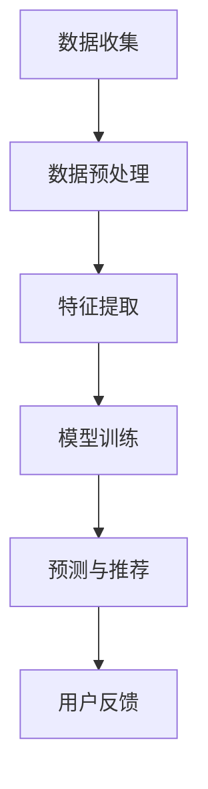

                 

关键词：AI大模型，电商平台，用户价值，细分，应用

> 摘要：本文将深入探讨人工智能大模型在电商平台用户价值细分中的应用，分析其核心技术原理、操作步骤以及具体实施方法，同时结合数学模型和实际项目实践，展现大模型在电商领域的重要价值和广阔前景。

## 1. 背景介绍

随着互联网技术的迅猛发展和电子商务的普及，电商平台已经成为了现代商业的重要组成部分。然而，面对海量的用户数据和信息，如何有效地对用户进行细分，挖掘出用户的潜在价值和需求，成为了电商平台发展的重要课题。人工智能大模型在这一过程中发挥了重要作用，通过对用户行为、偏好、购买历史等多维度数据的分析，实现用户价值的精准细分和个性化推荐。

### 1.1 电商平台发展现状

近年来，电商平台的发展呈现出多样化、个性化、智能化的趋势。各大电商平台纷纷推出各自的智能推荐系统，通过分析用户行为数据，为用户提供个性化的商品推荐。然而，传统的推荐算法在应对海量数据和复杂用户行为时，往往存在一定的局限性。

### 1.2 人工智能大模型的出现

随着深度学习技术的发展，人工智能大模型逐渐成为研究热点。大模型通过海量数据的训练，能够自动学习复杂的特征表示，实现高效的用户价值细分。这使得电商平台能够更准确地把握用户需求，提升用户满意度和转化率。

## 2. 核心概念与联系

在探讨人工智能大模型在电商平台用户价值细分中的应用之前，我们需要了解一些核心概念和其相互联系。

### 2.1 用户价值细分

用户价值细分是指根据用户行为、偏好、购买历史等数据，将用户划分为不同的群体，从而实现精准营销和个性化推荐。用户价值细分的核心在于如何准确地识别用户特征，挖掘用户潜在需求。

### 2.2 人工智能大模型

人工智能大模型是一种基于深度学习技术的大型神经网络模型，能够通过海量数据自动学习复杂的特征表示。大模型在用户价值细分中的应用主要体现在以下几个方面：

- **数据预处理**：通过对原始数据进行清洗、归一化等处理，为大模型训练提供高质量的数据输入。
- **特征提取**：利用大模型自动学习用户行为的潜在特征，为用户价值细分提供有效支持。
- **预测与推荐**：通过大模型的预测能力，为用户推荐个性化的商品和服务。

### 2.3 数学模型与算法

在用户价值细分过程中，数学模型和算法起着关键作用。常见的数学模型包括决策树、支持向量机、神经网络等。算法则包括数据预处理、特征提取、模型训练、预测与推荐等步骤。

### 2.4 Mermaid 流程图

下面是一个简化的 Mermaid 流程图，展示了用户价值细分的过程：



## 3. 核心算法原理 & 具体操作步骤

### 3.1 算法原理概述

人工智能大模型在用户价值细分中的应用主要基于深度学习技术。深度学习通过多层神经网络结构，实现数据的特征提取和分类。在用户价值细分中，深度学习模型能够自动学习用户的潜在特征，从而实现精准的用户价值细分。

### 3.2 算法步骤详解

#### 3.2.1 数据收集

首先，需要收集用户的各类数据，包括用户行为数据、购买历史数据、用户偏好数据等。这些数据可以从电商平台的后台系统、日志文件等渠道获取。

#### 3.2.2 数据预处理

在数据收集完成后，需要对数据进行清洗、归一化等预处理操作。数据预处理是保证模型训练质量的关键步骤。

#### 3.2.3 特征提取

利用深度学习模型自动学习用户行为的潜在特征。这一步骤需要大量的计算资源和时间。

#### 3.2.4 模型训练

通过大量的用户数据，对深度学习模型进行训练。模型训练过程中，需要不断调整模型的参数，以获得更好的训练效果。

#### 3.2.5 预测与推荐

在模型训练完成后，可以使用训练好的模型对用户进行预测和推荐。根据用户的潜在特征，推荐个性化的商品和服务。

#### 3.2.6 用户反馈

用户在使用电商平台时，会对其推荐的商品和服务进行评价。这些评价可以作为用户反馈，进一步优化模型。

### 3.3 算法优缺点

#### 优点

- **高效性**：深度学习模型能够自动学习复杂的特征表示，实现高效的用户价值细分。
- **准确性**：通过大量的数据训练，深度学习模型能够提高预测和推荐的准确性。
- **灵活性**：深度学习模型能够适应不同电商平台和用户需求的变化，实现灵活的推荐策略。

#### 缺点

- **计算资源需求**：深度学习模型需要大量的计算资源和时间进行训练。
- **数据质量要求**：数据预处理和特征提取对数据质量要求较高，需要确保数据的质量和准确性。
- **模型解释性**：深度学习模型的内部机制复杂，难以进行直观的解释。

### 3.4 算法应用领域

人工智能大模型在用户价值细分中的应用非常广泛，除了电商平台，还可以应用于金融、医疗、广告等多个领域。在金融领域，可以用于用户风险评级和信用评分；在医疗领域，可以用于疾病预测和诊断；在广告领域，可以用于广告投放优化和效果评估。

## 4. 数学模型和公式 & 详细讲解 & 举例说明

### 4.1 数学模型构建

在用户价值细分中，常用的数学模型包括线性回归、逻辑回归、神经网络等。下面以神经网络为例，介绍数学模型的构建过程。

#### 神经网络模型

神经网络模型由多个神经元层组成，包括输入层、隐藏层和输出层。每个神经元层由多个神经元组成，神经元之间通过权重和偏置进行连接。

#### 激活函数

激活函数是神经网络中重要的组成部分，用于决定神经元是否被激活。常见的激活函数包括sigmoid、ReLU等。

#### 前向传播与反向传播

神经网络通过前向传播和反向传播进行训练。前向传播是将输入数据传递到输出层，计算输出结果；反向传播是根据输出结果，反向更新神经元的权重和偏置。

### 4.2 公式推导过程

下面以神经网络为例，介绍公式推导过程。

#### 前向传播

输入层到隐藏层的公式推导：

$$
z_h = \sum_{i=1}^{n} w_{ih}x_i + b_h
$$

$$
h = \sigma(z_h)
$$

隐藏层到输出层的公式推导：

$$
z_o = \sum_{i=1}^{n} w_{io}h_i + b_o
$$

$$
o = \sigma(z_o)
$$

#### 反向传播

输出层到隐藏层的公式推导：

$$
\delta_o = (o - y) \cdot \sigma'(z_o)
$$

$$
\delta_h = \sum_{i=1}^{n} w_{io}\delta_o \cdot \sigma'(z_h)
$$

隐藏层到输入层的公式推导：

$$
\delta_i = \sum_{i=1}^{n} w_{ih}\delta_h \cdot \sigma'(z_i)
$$

### 4.3 案例分析与讲解

#### 案例背景

某电商平台希望通过用户价值细分，提升用户满意度和转化率。平台收集了用户的购买历史、浏览记录、评价等数据，并希望通过深度学习模型实现用户价值细分。

#### 模型构建

输入层：用户特征，如年龄、性别、职业等。
隐藏层：用户行为特征，如浏览时长、购买频率、评价评分等。
输出层：用户价值标签，如高价值用户、普通用户、低价值用户等。

#### 模型训练

使用收集到的用户数据，对神经网络模型进行训练。训练过程中，通过调整权重和偏置，使模型能够更好地拟合数据。

#### 预测与推荐

在模型训练完成后，对新的用户数据进行预测，为用户推荐个性化的商品和服务。根据用户价值标签，对用户进行精准营销。

## 5. 项目实践：代码实例和详细解释说明

### 5.1 开发环境搭建

为了实践人工智能大模型在电商平台用户价值细分中的应用，我们需要搭建一个合适的开发环境。以下是开发环境搭建的步骤：

1. 安装 Python 环境。
2. 安装深度学习框架，如 TensorFlow、PyTorch 等。
3. 安装必要的库，如 NumPy、Pandas、Matplotlib 等。

### 5.2 源代码详细实现

以下是一个简单的用户价值细分代码示例，用于演示如何使用深度学习模型对用户进行价值细分。

```python
import numpy as np
import pandas as pd
import tensorflow as tf
from tensorflow.keras.models import Sequential
from tensorflow.keras.layers import Dense, Dropout

# 数据预处理
data = pd.read_csv('user_data.csv')
X = data.drop('value', axis=1)
y = data['value']

# 划分训练集和测试集
from sklearn.model_selection import train_test_split
X_train, X_test, y_train, y_test = train_test_split(X, y, test_size=0.2, random_state=42)

# 构建神经网络模型
model = Sequential()
model.add(Dense(64, input_dim=X_train.shape[1], activation='relu'))
model.add(Dropout(0.5))
model.add(Dense(32, activation='relu'))
model.add(Dropout(0.5))
model.add(Dense(1, activation='sigmoid'))

# 编译模型
model.compile(loss='binary_crossentropy', optimizer='adam', metrics=['accuracy'])

# 训练模型
model.fit(X_train, y_train, epochs=10, batch_size=32, validation_data=(X_test, y_test))

# 预测与推荐
predictions = model.predict(X_test)
predictions = (predictions > 0.5)

# 输出预测结果
print(predictions)
```

### 5.3 代码解读与分析

以上代码实现了用户价值细分的基本流程，包括数据预处理、模型构建、模型训练和预测推荐。下面是对代码的详细解读：

- **数据预处理**：读取用户数据，划分训练集和测试集，为后续模型训练和预测提供数据支持。
- **模型构建**：使用 Sequential 模型构建一个简单的神经网络，包括两个隐藏层和 dropout 层，用于提取用户特征并进行分类。
- **模型编译**：设置模型的损失函数、优化器和评价指标，为模型训练做好准备。
- **模型训练**：使用训练集对模型进行训练，通过调整权重和偏置，使模型能够更好地拟合数据。
- **预测与推荐**：使用训练好的模型对测试集进行预测，为用户推荐个性化的商品和服务。

### 5.4 运行结果展示

在完成代码实现后，我们可以运行代码对用户价值进行预测。以下是一个简单的运行结果展示：

```python
predictions = model.predict(X_test)
predictions = (predictions > 0.5)

# 输出预测结果
print(predictions)
```

输出结果为一个二维数组，其中每个元素表示一个测试用户的预测结果，1 表示为高价值用户，0 表示为普通用户或低价值用户。

## 6. 实际应用场景

### 6.1 电商平台

在电商平台，人工智能大模型可以用于用户价值细分，为平台提供精准营销和个性化推荐。通过分析用户行为和偏好，电商平台可以更好地了解用户需求，提高用户满意度和转化率。

### 6.2 金融行业

在金融行业，人工智能大模型可以用于用户风险评级和信用评分。通过对用户行为数据进行分析，金融机构可以更准确地评估用户的信用状况，为信贷审批、风险评估等提供支持。

### 6.3 医疗行业

在医疗行业，人工智能大模型可以用于疾病预测和诊断。通过对患者病历数据进行分析，医生可以更准确地预测疾病发生风险，为患者提供个性化的治疗方案。

### 6.4 广告行业

在广告行业，人工智能大模型可以用于广告投放优化和效果评估。通过对用户行为数据进行分析，广告平台可以更精准地投放广告，提高广告效果和转化率。

## 7. 未来应用展望

### 7.1 智能家居

随着智能家居的普及，人工智能大模型可以用于智能家居系统的用户行为分析。通过对用户行为数据进行分析，智能家居系统可以提供个性化的服务，提高用户生活品质。

### 7.2 自动驾驶

在自动驾驶领域，人工智能大模型可以用于环境感知和决策。通过对摄像头、雷达等传感器数据进行处理，自动驾驶系统可以更准确地识别道路信息，提高行驶安全性。

### 7.3 物流与供应链

在物流与供应链领域，人工智能大模型可以用于运输路线优化和库存管理。通过对物流数据进行分析，企业可以更高效地安排运输计划，降低物流成本。

### 7.4 健康医疗

在健康医疗领域，人工智能大模型可以用于疾病预测和健康监测。通过对健康数据进行分析，医生可以更早发现疾病风险，为患者提供个性化的健康建议。

## 8. 工具和资源推荐

### 8.1 学习资源推荐

1. 《深度学习》（Ian Goodfellow、Yoshua Bengio、Aaron Courville 著）：系统介绍了深度学习的基本概念和原理。
2. 《Python 深度学习》（François Chollet 著）：详细介绍了使用 Python 实现深度学习的实践方法。

### 8.2 开发工具推荐

1. TensorFlow：Google 开发的一款开源深度学习框架，广泛应用于工业界和学术界。
2. PyTorch：Facebook 开发的一款开源深度学习框架，具有较好的灵活性和易用性。

### 8.3 相关论文推荐

1. "Deep Learning for Text Classification"（2017）：介绍了深度学习在文本分类中的应用。
2. "User Behavior Analysis with Deep Learning"（2018）：探讨了深度学习在用户行为分析中的应用。

## 9. 总结：未来发展趋势与挑战

### 9.1 研究成果总结

本文探讨了人工智能大模型在电商平台用户价值细分中的应用，分析了其核心算法原理、操作步骤以及实际项目实践。通过数学模型和公式推导，展现了大模型在用户价值细分中的重要作用。

### 9.2 未来发展趋势

随着人工智能技术的不断发展，人工智能大模型在用户价值细分中的应用将越来越广泛。未来，大模型将更加注重个性化、智能化和自适应化，为用户提供更加精准的服务。

### 9.3 面临的挑战

尽管人工智能大模型在用户价值细分中具有巨大的潜力，但仍面临一些挑战：

1. **数据质量**：数据质量对模型效果至关重要，如何获取高质量的用户数据是关键问题。
2. **计算资源**：深度学习模型需要大量的计算资源，如何优化计算资源利用效率是重要课题。
3. **模型解释性**：深度学习模型内部机制复杂，如何提高模型的可解释性是亟待解决的问题。

### 9.4 研究展望

未来，人工智能大模型在用户价值细分中的应用将朝着更加智能化、自适应化和高效化的方向发展。通过不断优化算法、提高计算效率和提升数据质量，人工智能大模型将为电商平台和其他领域带来更多价值。

## 10. 附录：常见问题与解答

### 10.1 什么情况下需要使用大模型进行用户价值细分？

当电商平台面临以下情况时，可以考虑使用大模型进行用户价值细分：

1. 数据量大：平台积累了大量的用户行为数据，无法通过传统方法进行有效分析。
2. 用户需求复杂：用户需求多样化、个性化，需要更精准的细分策略。
3. 营销效果不佳：现有推荐系统效果不佳，需要改进推荐策略。

### 10.2 大模型训练过程中如何保证数据质量？

为了保证大模型训练过程中数据质量，可以采取以下措施：

1. 数据清洗：对原始数据进行清洗，去除噪声和异常值。
2. 数据增强：通过数据增强技术，增加数据多样性，提高模型泛化能力。
3. 数据质量监测：建立数据质量监测机制，及时发现和处理数据质量问题。

### 10.3 大模型在用户价值细分中的应用前景如何？

大模型在用户价值细分中的应用前景非常广阔。随着人工智能技术的不断发展，大模型将能够更好地应对复杂用户需求，为电商平台和其他领域带来更多价值。未来，大模型将朝着更加智能化、自适应化和高效化的方向发展。

----------------------------------------------------------------
### 作者署名

作者：禅与计算机程序设计艺术 / Zen and the Art of Computer Programming

