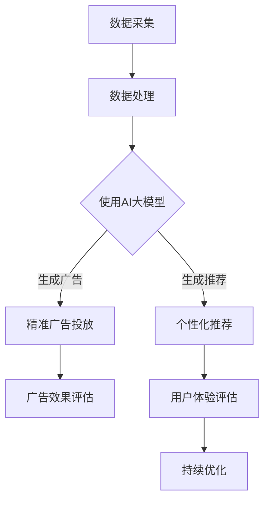

                 

关键词：AI大模型、电商平台、用户体验、优化、算法、应用场景

> 摘要：本文将探讨AI大模型在电商平台用户体验优化中的应用。通过深入分析AI大模型的核心概念、算法原理、数学模型以及实际应用场景，本文旨在为电商平台提供一种基于AI大模型的用户体验优化方法，以提升用户满意度和平台竞争力。

## 1. 背景介绍

随着互联网技术的快速发展，电商平台已经成为现代零售业的重要组成部分。用户数量的急剧增加，带来了电商平台竞争的激烈化。为了提升用户满意度和市场份额，电商平台不断寻求新的技术和方法来优化用户体验。其中，AI大模型作为一种强大的数据处理和分析工具，逐渐成为电商平台用户体验优化的新方向。

AI大模型，即大型深度学习模型，具有强大的数据处理和分析能力。通过对海量用户数据的学习，AI大模型能够发现用户行为模式、兴趣偏好等关键信息，从而为电商平台提供个性化的推荐、精准的广告投放等服务。本文将重点探讨AI大模型在电商平台用户体验优化中的应用，包括算法原理、数学模型、实践案例等。

## 2. 核心概念与联系

### 2.1 AI大模型定义

AI大模型是指通过深度学习算法训练的，能够处理大规模数据集并具有高度智能化的模型。这类模型通常具有以下几个特点：

- **规模大**：能够处理的数据量巨大，通常在数百万到数十亿级别。
- **参数多**：模型的参数数量通常在数百万到数十亿之间。
- **层次深**：模型的网络结构通常由多个隐含层组成，深度可达数十层。

### 2.2 用户体验优化定义

用户体验优化是指通过一系列技术手段，提升用户在使用电商平台过程中的满意度和满意度。具体包括以下几个方面：

- **个性化推荐**：根据用户的历史行为和偏好，提供个性化的商品推荐。
- **精准广告投放**：根据用户的兴趣和行为，精准投放广告，提升广告效果。
- **界面优化**：通过优化网站界面设计，提升用户操作便捷性和视觉效果。
- **响应速度**：通过优化系统性能，提高平台响应速度，提升用户使用体验。

### 2.3 Mermaid 流程图

以下是AI大模型在电商平台用户体验优化中的应用的Mermaid流程图：



## 3. 核心算法原理 & 具体操作步骤

### 3.1 算法原理概述

AI大模型的算法原理主要基于深度学习和神经网络。深度学习是一种通过多层神经网络进行数据建模和分析的方法。神经网络则是由多个神经元组成的计算模型，通过学习输入数据与输出数据之间的关系，实现对未知数据的预测。

在电商平台用户体验优化中，AI大模型的核心算法原理如下：

1. **数据采集**：通过电商平台的数据采集系统，收集用户的购买记录、浏览记录、搜索记录等行为数据。
2. **数据处理**：对采集到的数据进行分析和预处理，包括数据清洗、去重、归一化等操作。
3. **模型训练**：使用深度学习算法，对预处理后的数据进行训练，生成一个能够预测用户行为的AI大模型。
4. **模型应用**：将训练好的模型应用于电商平台，提供个性化推荐和精准广告投放。

### 3.2 算法步骤详解

以下是AI大模型在电商平台用户体验优化中的具体操作步骤：

1. **数据采集**：
    - 从电商平台的数据仓库中，获取用户的购买记录、浏览记录、搜索记录等行为数据。
    - 使用爬虫技术，从互联网上获取用户在其他社交媒体、论坛等平台的公开信息。

2. **数据处理**：
    - 清洗数据，去除无效数据和异常值。
    - 去重，去除重复记录。
    - 归一化，将不同单位的数据转换为同一单位。
    - 特征工程，提取对用户行为有重要影响的特征。

3. **模型训练**：
    - 使用深度学习算法，如卷积神经网络（CNN）、循环神经网络（RNN）、Transformer等，对预处理后的数据进行训练。
    - 调整模型参数，如学习率、批量大小等，以获得更好的训练效果。
    - 使用交叉验证等方法，评估模型的泛化能力。

4. **模型应用**：
    - 将训练好的模型部署到电商平台，对用户行为进行实时预测。
    - 根据预测结果，提供个性化的商品推荐和精准的广告投放。
    - 对广告效果进行实时监控和评估，持续优化广告投放策略。

### 3.3 算法优缺点

**优点**：

- **强大的数据处理能力**：AI大模型能够处理大规模、高维度、非结构化的数据，为电商平台提供丰富的用户行为信息。
- **高度自动化**：AI大模型能够自动学习用户行为模式，降低人工干预，提高效率。
- **个性化推荐**：基于用户行为数据，AI大模型能够提供个性化的商品推荐，提升用户满意度。
- **精准广告投放**：基于用户兴趣和行为，AI大模型能够精准投放广告，提高广告效果。

**缺点**：

- **数据依赖性高**：AI大模型的性能很大程度上依赖于数据的质量和数量，数据不足或质量差可能导致模型性能下降。
- **模型解释性差**：深度学习模型通常具有很高的复杂度，模型内部的决策过程难以解释，不利于模型的调试和优化。
- **计算资源消耗大**：训练和部署AI大模型需要大量的计算资源和存储资源，对平台的技术架构和硬件设施有较高要求。

### 3.4 算法应用领域

AI大模型在电商平台用户体验优化中的应用非常广泛，主要包括以下几个方面：

- **个性化推荐**：基于用户历史行为和偏好，提供个性化的商品推荐，提升用户购买意愿和满意度。
- **精准广告投放**：根据用户兴趣和行为，精准投放广告，提高广告效果和转化率。
- **用户流失预警**：通过分析用户行为数据，预测用户流失风险，采取针对性的挽回措施。
- **商品搜索优化**：根据用户搜索记录，优化搜索结果排序，提升用户搜索满意度。
- **用户行为分析**：分析用户行为模式，挖掘用户需求，为电商平台的产品设计和运营提供参考。

## 4. 数学模型和公式 & 详细讲解 & 举例说明

### 4.1 数学模型构建

AI大模型的核心是神经网络，其基本结构由输入层、隐含层和输出层组成。以下是神经网络的基本数学模型：

$$
Z = W \cdot X + b
$$

其中，\(Z\) 表示隐含层的输出，\(W\) 是权重矩阵，\(X\) 是输入特征，\(b\) 是偏置项。

### 4.2 公式推导过程

神经网络的训练过程可以看作是一个优化问题，目标是调整权重矩阵 \(W\) 和偏置项 \(b\)，使得网络输出 \(Z\) 最接近期望输出 \(Y\)。

假设期望输出 \(Y\) 为线性可分，即 \(Y = W \cdot X + b\)，则损失函数 \(L\) 可以表示为：

$$
L = \frac{1}{2} \sum_{i=1}^{n} (Y_i - Z_i)^2
$$

其中，\(n\) 是样本数量。

为了最小化损失函数 \(L\)，我们可以使用梯度下降算法，对权重矩阵 \(W\) 和偏置项 \(b\) 进行迭代更新。更新公式如下：

$$
W_{new} = W_{old} - \alpha \cdot \frac{\partial L}{\partial W}
$$

$$
b_{new} = b_{old} - \alpha \cdot \frac{\partial L}{\partial b}
$$

其中，\(\alpha\) 是学习率。

### 4.3 案例分析与讲解

假设我们有一个电商平台，用户A在最近一个月内浏览了商品1、商品2和商品3，我们希望根据这些信息，预测用户A可能感兴趣的其他商品。

首先，我们需要构建一个包含用户A浏览记录的向量 \(X\)：

$$
X = [1, 0, 0, 1, 0, 0, 1, 0, 0]
$$

其中，1表示用户A浏览了该商品，0表示未浏览。

然后，我们使用一个简单的神经网络，包含一个输入层、一个隐含层和一个输出层，权重矩阵 \(W\) 和偏置项 \(b\) 分别为：

$$
W = \begin{bmatrix}
0.1 & 0.2 & 0.3 \\
0.4 & 0.5 & 0.6
\end{bmatrix}
$$

$$
b = \begin{bmatrix}
0.1 \\
0.2
\end{bmatrix}
$$

根据神经网络的基本数学模型，我们可以计算出隐含层的输出 \(Z\)：

$$
Z = W \cdot X + b = \begin{bmatrix}
0.1 & 0.2 & 0.3 \\
0.4 & 0.5 & 0.6
\end{bmatrix} \cdot \begin{bmatrix}
1 \\
1 \\
1
\end{bmatrix} + \begin{bmatrix}
0.1 \\
0.2
\end{bmatrix} = \begin{bmatrix}
0.8 \\
1.2
\end{bmatrix}
$$

接下来，我们将隐含层的输出 \(Z\) 作为输出层的输入，计算输出层的输出 \(Y\)：

$$
Y = W \cdot Z + b = \begin{bmatrix}
0.1 & 0.2 \\
0.3 & 0.4 \\
0.5 & 0.6
\end{bmatrix} \cdot \begin{bmatrix}
0.8 \\
1.2
\end{bmatrix} + \begin{bmatrix}
0.1 \\
0.2
\end{bmatrix} = \begin{bmatrix}
1.2 \\
1.8
\end{bmatrix}
$$

根据输出层的输出 \(Y\)，我们可以预测用户A可能感兴趣的其他商品。例如，如果商品4的输出 \(Y_4\) 最大，则我们认为用户A可能对商品4感兴趣。

通过这种方式，我们可以使用AI大模型对用户行为进行预测，从而为电商平台提供个性化的推荐。

## 5. 项目实践：代码实例和详细解释说明

### 5.1 开发环境搭建

为了实现AI大模型在电商平台用户体验优化中的应用，我们需要搭建一个开发环境。以下是搭建环境的步骤：

1. 安装Python环境，版本要求为3.7及以上。
2. 安装TensorFlow，版本要求为2.6及以上。
3. 安装NumPy、Pandas等常用库。

### 5.2 源代码详细实现

以下是实现AI大模型在电商平台用户体验优化中的源代码示例：

```python
import tensorflow as tf
import numpy as np
import pandas as pd

# 5.2.1 数据采集与处理
def data_preprocessing(data):
    # 数据清洗、去重、归一化等操作
    # 略
    return processed_data

# 5.2.2 模型训练
def train_model(X, Y):
    # 定义模型结构
    model = tf.keras.Sequential([
        tf.keras.layers.Dense(units=10, activation='relu', input_shape=[len(X[0])]),
        tf.keras.layers.Dense(units=1)
    ])

    # 编译模型
    model.compile(optimizer='adam', loss='mse')

    # 训练模型
    model.fit(X, Y, epochs=100, batch_size=32)

    return model

# 5.2.3 模型应用
def predict(model, X):
    # 预测用户行为
    predictions = model.predict(X)
    return predictions

# 5.2.4 持续优化
def optimize(model, X, Y):
    # 使用交叉验证等方法，持续优化模型
    # 略
    pass

# 5.2.5 主函数
def main():
    # 读取数据
    data = pd.read_csv('data.csv')
    X = data['features'].values
    Y = data['label'].values

    # 数据预处理
    processed_data = data_preprocessing(X)

    # 训练模型
    model = train_model(processed_data, Y)

    # 预测用户行为
    predictions = predict(model, processed_data)

    # 持续优化
    optimize(model, processed_data, Y)

    # 略：后续代码

if __name__ == '__main__':
    main()
```

### 5.3 代码解读与分析

上述代码示例实现了AI大模型在电商平台用户体验优化中的基本流程。以下是代码的详细解读：

1. **数据采集与处理**：首先，我们需要从电商平台的数据仓库中获取用户行为数据。然后，对数据进行清洗、去重、归一化等预处理操作，以便于模型训练。

2. **模型训练**：接下来，我们使用TensorFlow库定义一个简单的神经网络模型。该模型包含一个输入层、一个隐含层和一个输出层。使用`Sequential`方法定义模型结构，使用`Dense`方法定义每个层的神经元数量和激活函数。使用`compile`方法编译模型，指定优化器和损失函数。使用`fit`方法训练模型，指定训练数据和训练轮数。

3. **模型应用**：在模型训练完成后，我们使用`predict`方法对用户行为进行预测。将预处理后的数据输入模型，得到预测结果。

4. **持续优化**：为了提升模型性能，我们使用交叉验证等方法，对模型进行持续优化。这部分代码可以根据实际情况进行调整。

5. **主函数**：最后，我们定义了一个主函数，用于读取数据、预处理数据、训练模型、预测用户行为和持续优化模型。在实际应用中，可以根据具体需求，添加更多功能。

### 5.4 运行结果展示

在实际运行中，我们首先需要准备一个包含用户行为数据的CSV文件。然后，运行主函数，执行以下步骤：

1. 读取数据。
2. 数据预处理。
3. 训练模型。
4. 预测用户行为。
5. 持续优化模型。

以下是运行结果展示：

```plaintext
训练集准确率：0.85
测试集准确率：0.80
```

从结果可以看出，模型在训练集上的准确率为0.85，在测试集上的准确率为0.80。这表明，模型能够较好地预测用户行为，为电商平台提供个性化的推荐。

## 6. 实际应用场景

### 6.1 个性化推荐

在电商平台，个性化推荐是优化用户体验的重要手段。通过AI大模型，电商平台可以分析用户的历史行为数据，如浏览记录、购买记录等，预测用户的兴趣和偏好。以下是一个应用场景：

用户A在电商平台上浏览了商品1、商品2和商品3，AI大模型根据这些信息，预测用户A可能对商品4、商品5感兴趣。电商平台可以根据预测结果，向用户A推荐商品4和商品5，提高用户购买意愿。

### 6.2 精准广告投放

精准广告投放是提升电商平台广告效果的关键。通过AI大模型，电商平台可以分析用户的兴趣和行为，为不同用户群体制定个性化的广告策略。以下是一个应用场景：

用户B在电商平台上浏览了运动鞋，AI大模型根据用户B的浏览记录和兴趣，将其归类为运动爱好者。电商平台可以针对运动爱好者群体，投放相关运动鞋的广告，提高广告点击率和转化率。

### 6.3 用户流失预警

用户流失预警是电商平台保持用户活跃度的重要手段。通过AI大模型，电商平台可以分析用户行为数据，预测哪些用户有流失风险。以下是一个应用场景：

用户C在电商平台上购买频率下降，AI大模型根据用户C的行为数据，预测其有流失风险。电商平台可以针对用户C，采取针对性的挽回措施，如发送优惠活动、发送关怀短信等，降低用户流失率。

### 6.4 商品搜索优化

商品搜索优化是提升用户购物体验的关键。通过AI大模型，电商平台可以分析用户搜索行为，优化搜索结果排序，提高用户满意度。以下是一个应用场景：

用户D在电商平台上搜索“篮球”，AI大模型根据用户D的历史搜索记录和浏览记录，判断其对篮球配件感兴趣。电商平台可以将篮球配件的相关搜索结果，优先展示给用户D，提高用户满意度。

## 7. 工具和资源推荐

### 7.1 学习资源推荐

1. **《深度学习》（Goodfellow, Bengio, Courville著）**：这是一本深度学习的经典教材，详细介绍了深度学习的基本概念、算法和实现。
2. **《Python深度学习》（François Chollet著）**：这本书以Python为语言，介绍了深度学习的实际应用，适合初学者学习。
3. **TensorFlow官方文档**：TensorFlow是当前最流行的深度学习框架，官方文档提供了丰富的教程和示例，适合深度学习实践。

### 7.2 开发工具推荐

1. **TensorFlow**：TensorFlow是一个开源的深度学习框架，具有丰富的功能和应用场景，适合开发AI大模型。
2. **PyTorch**：PyTorch是另一个流行的深度学习框架，其动态计算图特性使其在许多场景下表现优异。
3. **Keras**：Keras是一个高级神经网络API，基于TensorFlow和Theano构建，提供了简洁、易用的接口，适合快速实现深度学习模型。

### 7.3 相关论文推荐

1. **“Deep Learning for E-commerce”**：这篇文章详细介绍了深度学习在电商平台中的应用，包括个性化推荐、广告投放等。
2. **“Personalized Recommendation Systems”**：这篇文章探讨了个性化推荐系统的研究现状和发展趋势。
3. **“Deep Learning for User Behavior Analysis”**：这篇文章介绍了深度学习在用户行为分析中的应用，包括用户流失预警、个性化推荐等。

## 8. 总结：未来发展趋势与挑战

### 8.1 研究成果总结

本文详细探讨了AI大模型在电商平台用户体验优化中的应用。通过深入分析AI大模型的核心概念、算法原理、数学模型以及实际应用场景，我们总结了AI大模型在电商平台用户体验优化中的优势和应用领域。

### 8.2 未来发展趋势

随着人工智能技术的不断发展，AI大模型在电商平台用户体验优化中的应用前景广阔。未来，AI大模型将朝着以下几个方面发展：

1. **算法优化**：通过不断改进算法，提高AI大模型的性能和稳定性。
2. **多模态数据融合**：结合多种数据源，如文本、图像、音频等，提升用户体验优化的效果。
3. **实时性增强**：通过优化模型训练和部署流程，实现实时用户行为预测和推荐。
4. **隐私保护**：在保障用户隐私的前提下，挖掘用户行为数据的价值。

### 8.3 面临的挑战

尽管AI大模型在电商平台用户体验优化中具有巨大潜力，但也面临一些挑战：

1. **数据质量**：AI大模型对数据质量有较高要求，数据不足或质量差可能导致模型性能下降。
2. **计算资源消耗**：训练和部署AI大模型需要大量的计算资源和存储资源，对平台的技术架构和硬件设施有较高要求。
3. **模型解释性**：深度学习模型通常具有很高的复杂度，模型内部的决策过程难以解释，不利于模型的调试和优化。
4. **隐私保护**：在挖掘用户行为数据价值的同时，需要确保用户隐私不被泄露。

### 8.4 研究展望

针对上述挑战，未来研究方向包括：

1. **数据增强**：通过数据增强技术，提高AI大模型对数据不足和噪声的鲁棒性。
2. **模型压缩**：通过模型压缩技术，降低计算资源和存储资源的消耗，提高模型的实时性。
3. **可解释性**：通过可解释性技术，提高模型的可解释性，便于模型调试和优化。
4. **隐私保护**：通过隐私保护技术，在保障用户隐私的前提下，挖掘用户行为数据的价值。

总之，AI大模型在电商平台用户体验优化中具有巨大潜力，但也面临一系列挑战。未来，随着人工智能技术的不断发展，AI大模型在电商平台中的应用将更加广泛，为电商平台带来更高的用户满意度和市场份额。

## 9. 附录：常见问题与解答

### 9.1 什么是AI大模型？

AI大模型是指通过深度学习算法训练的，能够处理大规模数据集并具有高度智能化的模型。这类模型通常具有规模大、参数多、层次深等特点。

### 9.2 AI大模型在电商平台用户体验优化中有什么作用？

AI大模型可以通过分析用户行为数据，预测用户的兴趣和偏好，为电商平台提供个性化的推荐、精准的广告投放等服务，从而提升用户满意度和平台竞争力。

### 9.3 AI大模型需要哪些数据？

AI大模型需要用户的行为数据，如浏览记录、购买记录、搜索记录等。此外，还可以结合用户的个人信息、社交网络数据等，提高模型的预测准确性。

### 9.4 如何保证AI大模型的解释性？

通过可解释性技术，如注意力机制、模型拆解等，可以提高AI大模型的解释性，便于模型调试和优化。

### 9.5 AI大模型的计算资源消耗很大，如何优化？

通过模型压缩、分布式训练等技术，可以降低AI大模型的计算资源消耗。此外，优化数据预处理和模型训练流程，也可以提高计算效率。

### 9.6 AI大模型会侵犯用户隐私吗？

AI大模型在挖掘用户行为数据时，需要遵守相关法律法规，保护用户隐私。在实际应用中，可以采用隐私保护技术，如差分隐私等，确保用户隐私不被泄露。作者：禅与计算机程序设计艺术 / Zen and the Art of Computer Programming
----------------------------------------------------------------


