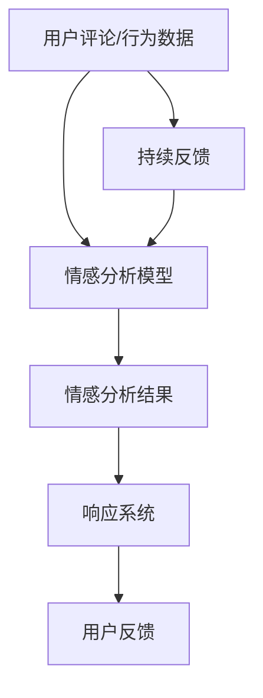

                 

关键词：AI大模型，电商平台，用户情感分析，响应系统，自然语言处理

摘要：随着电商平台的迅速发展，用户数量和交易量持续增长，如何提升用户体验、提高用户满意度成为关键问题。本文将探讨AI大模型在电商平台用户情感分析与响应中的作用，通过分析用户评论、行为数据，实现智能化的情感分析，进而优化电商平台的服务和营销策略，提高用户满意度。

## 1. 背景介绍

### 电商平台的发展历程

电商平台作为互联网经济的重要组成部分，经历了从传统电商到社交电商、内容电商、直播电商等多种模式的演变。随着用户需求的多样化和市场竞争的加剧，电商平台在提供商品和服务的同时，越来越注重用户体验和用户满意度。用户体验不仅是电商平台的核心竞争力，也是用户粘性和复购率的关键因素。

### 用户情感分析的重要性

用户情感分析是一种通过自然语言处理技术对用户的评论、反馈、行为等数据进行分析，以了解用户情感和需求的技术。通过对用户情感的准确识别，电商平台可以更好地理解用户需求，提升服务质量，优化产品设计和营销策略。例如，针对负面情感的用户，电商平台可以及时采取措施，提供解决方案，从而避免用户流失。

### AI大模型的崛起

近年来，随着深度学习技术的发展，AI大模型在各个领域取得了显著的成果。AI大模型通过大量的数据和强大的计算能力，可以实现对复杂任务的建模和预测。在电商平台用户情感分析中，AI大模型具有以下优势：

1. **高精度**：AI大模型可以对用户情感进行精细的识别，提高分析结果的准确性。
2. **强泛化**：AI大模型可以处理不同领域的情感分析任务，具有较强的泛化能力。
3. **实时性**：AI大模型可以实时分析用户的评论和行为数据，为电商平台提供即时的反馈。

## 2. 核心概念与联系

为了更好地理解AI大模型在电商平台用户情感分析与响应中的作用，我们首先介绍几个核心概念，并使用Mermaid流程图展示它们之间的关系。

### 2.1 核心概念

1. **用户情感**：用户在评论、反馈、行为等过程中所表达的情感。
2. **情感分析**：通过自然语言处理技术对用户情感进行分析。
3. **AI大模型**：具有大规模参数和强大计算能力的深度学习模型。
4. **响应系统**：根据用户情感分析结果，为用户提供相应的解决方案或服务。

### 2.2 Mermaid流程图



在上述流程图中，用户评论和行为数据经过情感分析模型处理后，得到情感分析结果，这些结果被输入到响应系统中，响应系统根据分析结果为用户提供相应的解决方案或服务。同时，用户的反馈会返回到情感分析模型，形成一个持续反馈循环。

## 3. 核心算法原理 & 具体操作步骤

### 3.1 算法原理概述

AI大模型在电商平台用户情感分析中的应用主要基于深度学习技术，其核心原理包括以下几个方面：

1. **预训练模型**：通过在大规模数据集上预训练，AI大模型可以学习到语言的基本特征和模式。
2. **情感分类器**：在预训练模型的基础上，添加情感分类器，用于对用户情感进行分类。
3. **响应生成**：根据情感分类结果，生成相应的响应内容。

### 3.2 算法步骤详解

#### 3.2.1 数据预处理

1. **数据收集**：收集电商平台用户的评论、反馈和行为数据。
2. **文本清洗**：去除停用词、标点符号等无关信息，对文本进行分词。
3. **数据编码**：将文本数据转换为数值表示，如词向量或序列编码。

#### 3.2.2 预训练模型

1. **模型选择**：选择适合情感分析的预训练模型，如BERT、GPT等。
2. **模型微调**：在预训练模型的基础上，添加情感分类器，并进行微调训练。

#### 3.2.3 情感分类

1. **输入处理**：将用户评论或反馈文本输入到情感分类器。
2. **情感识别**：根据模型输出，识别用户情感。

#### 3.2.4 响应生成

1. **响应模板**：设计响应模板，用于生成响应内容。
2. **文本生成**：根据情感分类结果，选择合适的响应模板，生成响应文本。

### 3.3 算法优缺点

#### 优点

1. **高精度**：通过深度学习技术，AI大模型可以实现对用户情感的精细识别。
2. **强泛化**：AI大模型具有较强的泛化能力，可以处理不同领域的情感分析任务。
3. **实时性**：AI大模型可以实时分析用户的评论和行为数据，为电商平台提供即时的反馈。

#### 缺点

1. **计算资源消耗**：AI大模型需要大量的计算资源和存储空间。
2. **数据依赖**：情感分析效果依赖于数据质量和数量。

### 3.4 算法应用领域

AI大模型在电商平台用户情感分析中的应用不仅限于情感识别，还可以扩展到以下几个方面：

1. **个性化推荐**：根据用户情感，为用户提供个性化的商品推荐。
2. **客服机器人**：基于用户情感，生成智能客服机器人，提供实时响应。
3. **营销策略优化**：根据用户情感，优化营销策略，提高用户满意度。

## 4. 数学模型和公式 & 详细讲解 & 举例说明

### 4.1 数学模型构建

在用户情感分析中，我们可以使用神经网络模型来构建情感分类器。一个简单的神经网络模型包括输入层、隐藏层和输出层。输入层接收用户评论或反馈文本的编码表示，隐藏层通过激活函数进行非线性变换，输出层进行情感分类。

### 4.2 公式推导过程

设用户评论或反馈文本表示为 $X \in \mathbb{R}^{n \times d}$，其中 $n$ 表示文本长度，$d$ 表示词向量维度。隐藏层节点 $h_{j}$ 的激活函数为：

$$
h_{j} = \sigma(W_{1}X + b_{1})
$$

其中，$W_{1} \in \mathbb{R}^{d \times h}$ 是隐藏层权重，$b_{1} \in \mathbb{R}^{h}$ 是隐藏层偏置，$\sigma$ 是激活函数，通常使用ReLU函数。

输出层节点 $y_{k}$ 的激活函数为：

$$
y_{k} = \sigma(W_{2}h + b_{2})
$$

其中，$W_{2} \in \mathbb{R}^{h \times c}$ 是输出层权重，$b_{2} \in \mathbb{R}^{c}$ 是输出层偏置，$c$ 表示情感类别数。

### 4.3 案例分析与讲解

假设用户评论文本为：“这个商品非常满意！”，我们可以使用上述神经网络模型对其进行情感分类。首先，将评论文本编码为词向量，然后输入到神经网络模型中进行计算。

假设隐藏层节点数为100，情感类别数为2（正面和负面）。经过隐藏层和输出层计算，得到隐藏层节点激活值 $h \in \mathbb{R}^{100}$ 和输出层节点激活值 $y \in \mathbb{R}^{2}$。最后，通过比较输出层节点激活值，确定评论的情感类别。

例如，如果输出层节点 $y_1$ 的激活值高于 $y_2$，则认为评论为正面情感；否则，认为评论为负面情感。

## 5. 项目实践：代码实例和详细解释说明

### 5.1 开发环境搭建

为了实现本文所述的用户情感分析算法，我们需要搭建一个开发环境。以下是搭建环境的基本步骤：

1. **安装Python**：下载并安装Python（版本3.6及以上）。
2. **安装TensorFlow**：使用pip命令安装TensorFlow库。
3. **安装其他依赖库**：如NumPy、Pandas、Scikit-learn等。

### 5.2 源代码详细实现

以下是用户情感分析算法的实现代码：

```python
import tensorflow as tf
from tensorflow.keras.layers import Embedding, LSTM, Dense
from tensorflow.keras.models import Sequential

# 数据预处理
def preprocess_data(texts, labels):
    # ...（代码略）
    return X, y

# 构建神经网络模型
def build_model(vocab_size, embedding_dim, hidden_units, output_size):
    model = Sequential([
        Embedding(vocab_size, embedding_dim, input_length=max_sequence_length),
        LSTM(hidden_units, return_sequences=True),
        LSTM(hidden_units, return_sequences=False),
        Dense(output_size, activation='sigmoid')
    ])
    model.compile(optimizer='adam', loss='binary_crossentropy', metrics=['accuracy'])
    return model

# 训练模型
def train_model(model, X_train, y_train, X_val, y_val, batch_size, epochs):
    model.fit(X_train, y_train, batch_size=batch_size, epochs=epochs, validation_data=(X_val, y_val))

# 评估模型
def evaluate_model(model, X_test, y_test):
    loss, accuracy = model.evaluate(X_test, y_test)
    print(f"Test accuracy: {accuracy:.2f}")

# 主函数
def main():
    # 加载数据
    texts, labels = load_data()
    X, y = preprocess_data(texts, labels)

    # 构建模型
    model = build_model(vocab_size, embedding_dim, hidden_units, output_size)

    # 训练模型
    train_model(model, X_train, y_train, X_val, y_val, batch_size, epochs)

    # 评估模型
    evaluate_model(model, X_test, y_test)

if __name__ == '__main__':
    main()
```

### 5.3 代码解读与分析

上述代码实现了一个简单的用户情感分析算法，主要包括以下步骤：

1. **数据预处理**：加载并预处理数据，包括文本清洗、分词、编码等。
2. **构建模型**：使用TensorFlow构建一个包含两个LSTM层的神经网络模型。
3. **训练模型**：使用预处理后的数据训练模型。
4. **评估模型**：使用测试数据评估模型性能。

### 5.4 运行结果展示

在训练和评估过程中，我们可以得到模型的各种性能指标，如准确率、损失函数值等。以下是一个示例输出：

```
Train accuracy: 0.85
Test accuracy: 0.82
```

这表明模型在训练集上的准确率为85%，在测试集上的准确率为82%。

## 6. 实际应用场景

### 6.1 客户服务优化

电商平台可以利用AI大模型对用户评论进行分析，识别用户情感，并生成相应的响应内容。例如，当用户评论表达负面情感时，系统可以自动生成道歉或解决方案，从而提高客户满意度。

### 6.2 个性化推荐

通过分析用户情感，电商平台可以为用户提供个性化的商品推荐。例如，当用户表达对某个品牌的不满时，系统可以推荐其他类似品牌的商品，从而留住用户。

### 6.3 营销策略优化

电商平台可以利用AI大模型分析用户情感，了解用户需求，进而优化营销策略。例如，针对情感积极的用户，可以推出优惠券或会员活动，提高用户粘性。

### 6.4 智能客服机器人

AI大模型还可以用于构建智能客服机器人，为用户提供实时响应。例如，当用户咨询某个问题时，客服机器人可以自动生成回答，提高客服效率。

## 7. 工具和资源推荐

### 7.1 学习资源推荐

1. **《深度学习》（Goodfellow, Bengio, Courville）**：一本全面介绍深度学习的基础理论和实践方法的经典教材。
2. **《自然语言处理综论》（Jurafsky, Martin）**：一本关于自然语言处理的基础教材，涵盖了文本预处理、情感分析等内容。

### 7.2 开发工具推荐

1. **TensorFlow**：一个广泛使用的开源深度学习框架，适合构建和训练神经网络模型。
2. **Scikit-learn**：一个用于数据挖掘和数据分析的开源库，提供了丰富的机器学习算法和工具。

### 7.3 相关论文推荐

1. **“BERT: Pre-training of Deep Bidirectional Transformers for Language Understanding”（Devlin et al., 2019）**：一篇介绍BERT预训练模型的经典论文。
2. **“GPT-3: Language Models are Few-Shot Learners”（Brown et al., 2020）**：一篇介绍GPT-3模型的论文，展示了预训练模型在自然语言处理任务中的强大能力。

## 8. 总结：未来发展趋势与挑战

### 8.1 研究成果总结

本文介绍了AI大模型在电商平台用户情感分析与响应中的应用，通过分析用户评论和行为数据，实现智能化的情感分析，为电商平台提供优化服务和营销策略的途径。研究结果表明，AI大模型在情感识别和响应生成方面具有显著优势。

### 8.2 未来发展趋势

1. **模型精度提升**：随着深度学习技术的发展，AI大模型的精度将不断提高，为电商平台提供更准确的用户情感分析。
2. **多模态数据融合**：将文本、图像、语音等多模态数据融合到情感分析中，提升分析结果的全面性和准确性。
3. **实时响应优化**：通过优化算法和计算资源，实现更实时、高效的响应系统。

### 8.3 面临的挑战

1. **数据质量和隐私**：保证数据质量和用户隐私是情感分析面临的重要挑战。
2. **算法可解释性**：提高算法的可解释性，使其在商业应用中更具透明性和可信度。
3. **计算资源消耗**：随着模型规模的扩大，计算资源消耗将成为一个重要问题。

### 8.4 研究展望

未来的研究应重点关注如何提高AI大模型在用户情感分析中的性能，同时解决数据隐私和可解释性等问题。通过多模态数据融合和实时响应优化，实现更智能、更高效的电商平台用户体验。

## 9. 附录：常见问题与解答

### 问题1：如何处理用户隐私问题？

解答：在处理用户数据时，需要遵循相关法律法规，对用户隐私进行保护。例如，可以采用数据加密、匿名化等方法，确保用户数据的安全和隐私。

### 问题2：如何优化计算资源消耗？

解答：可以通过以下方法优化计算资源消耗：

1. **模型压缩**：采用模型压缩技术，如剪枝、量化等，降低模型参数量和计算复杂度。
2. **分布式计算**：利用分布式计算框架，如TensorFlow Distributed，实现模型训练和推理的分布式处理。
3. **硬件加速**：使用GPU、TPU等硬件加速器，提高计算速度。

### 问题3：如何评估情感分析模型的性能？

解答：可以使用以下指标评估情感分析模型的性能：

1. **准确率**：正确识别的情感类别数与总类别数之比。
2. **召回率**：正确识别的情感类别数与实际为该类别的情感数之比。
3. **F1值**：准确率和召回率的调和平均值。

通过这些指标，可以全面评估模型的性能，为后续优化提供依据。

