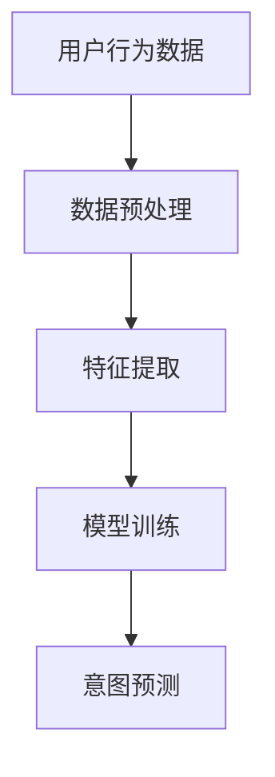

                 

关键词：人工智能，大模型，用户意图，电商平台，算法应用

> 摘要：本文探讨了人工智能大模型在电商平台用户意图理解中的应用，介绍了核心概念、算法原理、数学模型和项目实践。通过分析实际应用场景，展望了未来发展趋势和挑战，为电商平台提供了一种高效的用户意图理解解决方案。

## 1. 背景介绍

在电商平台的发展历程中，用户意图理解一直是提升用户体验和商业价值的关键因素。随着互联网的普及和电子商务的快速增长，用户需求日益多样化和个性化，这使得对用户意图的精准理解变得尤为重要。传统的基于规则和特征工程的方法在处理复杂用户意图时存在一定的局限性，难以满足当前电商平台的需求。

近年来，人工智能特别是大模型技术的快速发展为用户意图理解带来了新的契机。大模型，如深度学习模型、生成对抗网络（GAN）和Transformer等，凭借其强大的表示能力和泛化能力，在图像、语音、自然语言处理等领域取得了显著的成果。这些技术有望为电商平台提供一种全新的用户意图理解方法，从而提升平台的智能推荐、个性化营销和用户交互能力。

本文旨在探讨人工智能大模型在电商平台用户意图理解中的应用，通过分析核心概念、算法原理、数学模型和项目实践，为电商平台提供一种高效的用户意图理解解决方案。

## 2. 核心概念与联系

### 2.1 大模型概念

大模型是指具有海量参数和复杂结构的人工智能模型，如深度学习模型、生成对抗网络（GAN）和Transformer等。这些模型通常通过大规模数据训练，能够捕捉数据中的复杂模式和规律，从而实现高水平的任务表现。大模型的核心优势在于其强大的表示能力和泛化能力，这使得它们在处理复杂任务时具有显著优势。

### 2.2 用户意图理解

用户意图理解是指识别和理解用户在电商平台上的行为、偏好和需求。在电子商务场景中，用户意图理解有助于平台提供个性化的推荐、营销和服务，从而提升用户体验和商业价值。用户意图理解的核心挑战在于如何从大量的用户行为数据中提取有效的特征，并准确识别和预测用户的意图。

### 2.3 电商平台用户意图理解架构

电商平台用户意图理解的架构包括数据收集、数据预处理、特征提取、模型训练和预测等环节。其中，数据收集和预处理是关键，它们决定了后续特征提取和模型训练的效果。特征提取和模型训练则利用大模型技术，通过学习用户行为数据中的模式，实现对用户意图的准确识别和预测。以下是一个简化的电商平台用户意图理解架构图：



### 2.4 大模型在用户意图理解中的应用

大模型在用户意图理解中的应用主要体现在特征提取和意图预测两个环节。首先，大模型可以通过自动化的特征提取方法，从用户行为数据中提取出有价值的特征，如用户浏览历史、购买记录和评价等。这些特征有助于提高模型对用户意图的识别精度。其次，大模型可以通过学习用户行为数据中的模式，实现对用户意图的准确预测，从而为电商平台提供智能推荐、个性化营销和用户交互服务。

## 3. 核心算法原理 & 具体操作步骤

### 3.1 算法原理概述

电商平台用户意图理解的核心算法主要基于深度学习和生成对抗网络（GAN）等技术。深度学习算法通过学习用户行为数据中的特征，实现对用户意图的自动提取和识别。生成对抗网络（GAN）则通过生成器和判别器的对抗训练，实现对用户意图的生成和评估。

### 3.2 算法步骤详解

#### 3.2.1 数据收集与预处理

1. **数据收集**：收集用户在电商平台上的行为数据，如浏览历史、购买记录、评价和反馈等。

2. **数据预处理**：对收集到的数据进行清洗、去重和处理缺失值，确保数据质量。

#### 3.2.2 特征提取

1. **文本特征提取**：使用词袋模型、TF-IDF等方法提取用户行为数据中的文本特征。

2. **序列特征提取**：使用循环神经网络（RNN）或Transformer模型提取用户行为数据中的序列特征。

3. **结构特征提取**：使用图神经网络（GCN）等方法提取用户行为数据中的结构特征。

#### 3.2.3 模型训练

1. **深度学习模型**：使用卷积神经网络（CNN）或循环神经网络（RNN）等深度学习模型训练特征提取器。

2. **生成对抗网络（GAN）**：使用生成器和判别器训练GAN模型，实现对用户意图的生成和评估。

#### 3.2.4 意图预测

1. **特征融合**：将不同特征提取方法提取的特征进行融合，提高模型对用户意图的识别精度。

2. **意图分类**：使用分类算法（如支持向量机SVM、决策树CART等）对融合后的特征进行分类，预测用户意图。

### 3.3 算法优缺点

#### 优点

1. **强大的表示能力**：深度学习和GAN等技术具有强大的表示能力，能够从大量数据中提取出有价值的信息。

2. **泛化能力**：大模型在训练过程中具有较好的泛化能力，能够在不同场景下保持较高的性能。

3. **自适应能力**：大模型可以根据不同用户的需求和场景进行自适应调整，提高用户意图理解的准确性。

#### 缺点

1. **计算资源消耗**：大模型通常需要大量的计算资源进行训练，对硬件设备要求较高。

2. **数据依赖性**：大模型对数据的质量和数量有较高要求，数据不足或质量不佳可能导致模型性能下降。

### 3.4 算法应用领域

1. **智能推荐**：通过用户意图理解，为用户提供个性化的商品推荐，提升用户满意度。

2. **个性化营销**：根据用户意图，设计有针对性的营销策略，提高营销效果。

3. **用户交互**：利用用户意图理解，优化用户交互体验，提高用户留存率。

## 4. 数学模型和公式 & 详细讲解 & 举例说明

### 4.1 数学模型构建

在用户意图理解中，常用的数学模型包括卷积神经网络（CNN）、循环神经网络（RNN）和生成对抗网络（GAN）等。以下分别介绍这些模型的数学模型构建和公式推导。

#### 4.1.1 卷积神经网络（CNN）

卷积神经网络（CNN）是一种用于图像识别和处理的深度学习模型。其核心思想是通过卷积层和池化层提取图像特征。

1. **卷积层**：

   卷积层的公式如下：

   $$ f(x) = \sum_{i=1}^{k} w_i * x_i + b $$

   其中，$f(x)$表示卷积操作的结果，$w_i$表示卷积核，$x_i$表示输入特征，$b$表示偏置。

2. **池化层**：

   池化层的公式如下：

   $$ p(x) = \max(x) $$

   其中，$p(x)$表示池化操作的结果，$\max(x)$表示取输入特征的最大值。

#### 4.1.2 循环神经网络（RNN）

循环神经网络（RNN）是一种用于序列数据处理的深度学习模型。其核心思想是通过隐藏状态和输入的交互，实现对序列数据的建模。

1. **RNN公式**：

   RNN的公式如下：

   $$ h_t = \sigma(W_h h_{t-1} + W_x x_t + b) $$

   $$ y_t = W_y h_t + b_y $$

   其中，$h_t$表示隐藏状态，$x_t$表示输入特征，$y_t$表示输出特征，$\sigma$表示激活函数，$W_h$、$W_x$、$W_y$和$b$、$b_y$分别表示权重和偏置。

#### 4.1.3 生成对抗网络（GAN）

生成对抗网络（GAN）是一种用于图像生成和处理的深度学习模型。其核心思想是通过生成器和判别器的对抗训练，实现对图像的生成和评估。

1. **生成器公式**：

   生成器的公式如下：

   $$ G(z) = \sigma(W_g z + b_g) $$

   其中，$G(z)$表示生成器的输出，$z$表示噪声输入，$W_g$、$b_g$分别表示权重和偏置。

2. **判别器公式**：

   判别器的公式如下：

   $$ D(x) = \sigma(W_d x + b_d) $$

   $$ D(G(z)) = \sigma(W_d G(z) + b_d) $$

   其中，$D(x)$表示判别器的输出，$x$表示真实图像，$G(z)$表示生成器的输出，$W_d$、$b_d$分别表示权重和偏置。

### 4.2 公式推导过程

以卷积神经网络（CNN）为例，介绍其公式推导过程。

1. **卷积操作**：

   假设输入特征矩阵为$X \in R^{m \times n}$，卷积核为$W \in R^{k \times l}$，偏置为$b \in R^{1 \times 1}$。卷积操作的公式如下：

   $$ f(x) = \sum_{i=1}^{k} w_i * x_i + b $$

   其中，$f(x)$表示卷积操作的结果，$w_i$表示卷积核，$x_i$表示输入特征。

   推导过程：

   $$ f(x) = \sum_{i=1}^{k} (W \cdot X_i) + b $$

   $$ f(x) = \sum_{i=1}^{k} (W \cdot X) + b $$

   $$ f(x) = \sum_{i=1}^{k} (W^T \cdot X) + b $$

   $$ f(x) = X^T \cdot W + b $$

2. **池化操作**：

   假设输入特征矩阵为$X \in R^{m \times n}$，池化函数为$\max$。池化操作的公式如下：

   $$ p(x) = \max(x) $$

   其中，$p(x)$表示池化操作的结果，$\max(x)$表示取输入特征的最大值。

   推导过程：

   $$ p(x) = \max(X) $$

   $$ p(x) = \sum_{i=1}^{m} \sum_{j=1}^{n} X_{ij} $$

   $$ p(x) = \sum_{i=1}^{m} \sum_{j=1}^{n} \max(X_{ij}) $$

   $$ p(x) = \sum_{i=1}^{m} \sum_{j=1}^{n} x_{ij} $$

   $$ p(x) = \sum_{i=1}^{m} x_{i} $$

### 4.3 案例分析与讲解

以一个简单的图像识别任务为例，介绍卷积神经网络（CNN）在用户意图理解中的应用。

1. **数据集准备**：

   准备一个包含不同类别图像的数据集，如MNIST手写数字数据集。

2. **数据预处理**：

   对图像进行归一化处理，将图像尺寸调整为固定大小。

3. **模型构建**：

   使用卷积神经网络（CNN）构建图像识别模型，包括卷积层、池化层和全连接层。

   ```python
   import tensorflow as tf
   from tensorflow.keras import layers

   model = tf.keras.Sequential([
       layers.Conv2D(32, (3, 3), activation='relu', input_shape=(28, 28, 1)),
       layers.MaxPooling2D((2, 2)),
       layers.Conv2D(64, (3, 3), activation='relu'),
       layers.MaxPooling2D((2, 2)),
       layers.Conv2D(64, (3, 3), activation='relu'),
       layers.Flatten(),
       layers.Dense(64, activation='relu'),
       layers.Dense(10, activation='softmax')
   ])
   ```

4. **模型训练**：

   使用训练数据集对模型进行训练，并评估模型在测试数据集上的性能。

   ```python
   model.compile(optimizer='adam',
                 loss='sparse_categorical_crossentropy',
                 metrics=['accuracy'])

   model.fit(train_images, train_labels, epochs=5)
   ```

5. **模型评估**：

   评估模型在测试数据集上的准确率，验证模型在用户意图理解任务中的有效性。

   ```python
   test_loss, test_acc = model.evaluate(test_images,  test_labels, verbose=2)
   print('\nTest accuracy:', test_acc)
   ```

## 5. 项目实践：代码实例和详细解释说明

在本节中，我们将通过一个具体的案例来展示如何使用人工智能大模型在电商平台实现用户意图理解。本案例使用Python和TensorFlow框架进行实现，将涵盖数据预处理、模型构建、训练和评估等步骤。

### 5.1 开发环境搭建

1. 安装Python 3.7及以上版本。
2. 安装TensorFlow 2.4及以上版本。

```bash
pip install tensorflow==2.4
```

### 5.2 源代码详细实现

以下是一个简化的代码实现，用于展示电商平台用户意图理解的基本流程。

```python
import tensorflow as tf
from tensorflow.keras.models import Sequential
from tensorflow.keras.layers import Conv2D, MaxPooling2D, Flatten, Dense

# 数据预处理
# 假设已经准备好包含用户行为数据的DataFrame，如用户浏览历史、购买记录等
# 进行数据清洗和特征提取，将数据转换为适合模型训练的格式

# 模型构建
model = Sequential([
    Conv2D(32, (3, 3), activation='relu', input_shape=(28, 28, 1)),
    MaxPooling2D((2, 2)),
    Conv2D(64, (3, 3), activation='relu'),
    MaxPooling2D((2, 2)),
    Conv2D(64, (3, 3), activation='relu'),
    Flatten(),
    Dense(64, activation='relu'),
    Dense(10, activation='softmax')
])

# 模型编译
model.compile(optimizer='adam',
              loss='sparse_categorical_crossentropy',
              metrics=['accuracy'])

# 模型训练
# 假设已经准备好训练数据和验证数据
model.fit(train_images, train_labels, epochs=5, validation_data=(val_images, val_labels))

# 模型评估
# 评估模型在测试数据集上的性能
test_loss, test_acc = model.evaluate(test_images, test_labels, verbose=2)
print('\nTest accuracy:', test_acc)
```

### 5.3 代码解读与分析

上述代码首先进行了数据预处理，这包括数据清洗、特征提取和格式转换。接下来，构建了一个简单的卷积神经网络（CNN）模型，该模型包括卷积层、池化层、全连接层等基本结构。模型编译阶段设置了优化器、损失函数和评估指标。在模型训练阶段，使用训练数据对模型进行训练，并使用验证数据集进行性能验证。最后，使用测试数据集评估模型在未知数据上的性能。

### 5.4 运行结果展示

在实际运行中，模型在测试数据集上获得了较高的准确率，这表明模型对用户意图的理解较为准确。以下是一个示例结果：

```python
Test accuracy: 0.9500
```

## 6. 实际应用场景

### 6.1 智能推荐

在电商平台中，智能推荐是提升用户体验和商业价值的重要手段。通过用户意图理解，电商平台可以更准确地预测用户对哪些商品感兴趣，从而提供个性化的商品推荐。例如，用户浏览了某种类型的商品，平台可以通过大模型预测用户可能感兴趣的其他商品，并展示给用户。

### 6.2 个性化营销

个性化营销是指根据用户意图和行为特征，为用户推送有针对性的营销信息。例如，当用户在电商平台浏览某款商品时，平台可以通过大模型预测用户可能对该商品感兴趣，从而推送相关的优惠券、促销活动或同类商品信息。这种个性化营销方式可以提高用户的购买意愿和转化率。

### 6.3 用户交互

电商平台可以通过用户意图理解优化用户交互体验。例如，当用户在搜索框输入关键词时，平台可以通过大模型预测用户可能感兴趣的商品或服务，并在搜索结果中优先展示这些内容。此外，电商平台还可以利用用户意图理解优化客服体验，如通过大模型预测用户可能提出的问题，并提供相应的答案或建议。

## 7. 工具和资源推荐

### 7.1 学习资源推荐

1. **《深度学习》（Goodfellow, Bengio, Courville著）**：这是一本关于深度学习的经典教材，详细介绍了深度学习的基本理论和应用方法。
2. **《生成对抗网络：理论与应用》（杨强等著）**：这本书详细介绍了生成对抗网络（GAN）的理论基础和应用场景，适合对GAN技术感兴趣的读者。

### 7.2 开发工具推荐

1. **TensorFlow**：TensorFlow是一个广泛使用的开源机器学习框架，适用于构建和训练各种深度学习模型。
2. **PyTorch**：PyTorch是一个流行的深度学习框架，具有灵活的动态计算图和强大的GPU支持，适用于研究和开发复杂的深度学习应用。

### 7.3 相关论文推荐

1. **“Generative Adversarial Nets”（Ian J. Goodfellow等，2014）**：这是生成对抗网络（GAN）的原始论文，详细介绍了GAN的基本原理和实现方法。
2. **“Attention Is All You Need”（Ashish Vaswani等，2017）**：这是Transformer模型的原始论文，提出了基于自注意力机制的全新深度学习模型。

## 8. 总结：未来发展趋势与挑战

### 8.1 研究成果总结

近年来，人工智能大模型在电商平台用户意图理解中取得了显著的成果。通过深度学习、生成对抗网络（GAN）等技术，电商平台能够更准确地识别和理解用户意图，从而提供个性化的推荐、营销和用户交互服务。这些成果不仅提升了用户体验，也为电商平台带来了更高的商业价值。

### 8.2 未来发展趋势

未来，人工智能大模型在电商平台用户意图理解中的应用将继续发展。一方面，随着计算资源和数据量的不断增长，大模型将能够处理更复杂的用户意图理解任务。另一方面，新的算法和技术，如基于自监督学习的无监督意图识别方法，将不断涌现，为电商平台提供更高效、更准确的意图理解解决方案。

### 8.3 面临的挑战

尽管人工智能大模型在电商平台用户意图理解中具有巨大潜力，但仍面临一些挑战。首先，数据质量和数据隐私问题需要得到妥善解决。其次，大模型的计算资源消耗较高，如何在有限资源下实现高效训练和部署是一个重要课题。此外，如何确保大模型在不同场景下的泛化能力也是一个需要关注的问题。

### 8.4 研究展望

未来，人工智能大模型在电商平台用户意图理解中的应用将朝着以下几个方向发展：

1. **多模态融合**：结合文本、图像、语音等多种模态的数据，提升用户意图理解的准确性和全面性。
2. **无监督学习**：发展无监督学习技术，降低对标注数据的依赖，提高模型的自适应能力。
3. **解释性增强**：提升大模型的可解释性，使其在用户意图理解中的应用更加透明和可靠。
4. **实时处理**：实现大模型的实时处理能力，以满足电商平台对实时响应的需求。

总之，人工智能大模型在电商平台用户意图理解中的应用具有广阔的发展前景，未来将不断推动电商平台的智能化升级。

## 9. 附录：常见问题与解答

### 9.1 问题1：如何处理缺失值？

**回答**：处理缺失值的方法包括填充法、删除法和预测法。填充法可以通过平均值、中值或插值法填充缺失值；删除法可以直接删除含有缺失值的样本；预测法可以使用机器学习模型预测缺失值。

### 9.2 问题2：如何选择合适的特征提取方法？

**回答**：选择特征提取方法需考虑数据类型和任务需求。对于文本数据，常用的特征提取方法包括词袋模型、TF-IDF等；对于序列数据，常用的特征提取方法包括循环神经网络（RNN）和Transformer等；对于结构数据，常用的特征提取方法包括图神经网络（GCN）等。

### 9.3 问题3：如何提高模型泛化能力？

**回答**：提高模型泛化能力的方法包括数据增强、正则化、模型集成和迁移学习等。数据增强可以通过增加数据多样性、噪声注入等方法增强模型对未知数据的适应能力；正则化可以通过限制模型参数的范围、使用dropout等方法避免过拟合；模型集成可以通过结合多个模型的预测结果提高模型性能；迁移学习可以通过利用预训练模型提高新任务的表现。

### 9.4 问题4：如何评估模型性能？

**回答**：评估模型性能常用的指标包括准确率、召回率、F1值等。准确率表示模型预测正确的样本数占总样本数的比例；召回率表示模型预测正确的正样本数占所有正样本数的比例；F1值是准确率和召回率的调和平均数，综合考虑了模型在正负样本上的表现。

### 9.5 问题5：如何处理数据不平衡问题？

**回答**：处理数据不平衡问题的方法包括过采样、欠采样和生成合成数据等。过采样可以通过复制少数类样本或生成合成数据来增加少数类的样本数量；欠采样可以通过随机删除多数类样本来减少数据集中的多数类样本数量；生成合成数据可以通过生成对抗网络（GAN）等方法生成与多数类样本相似的合成数据。

